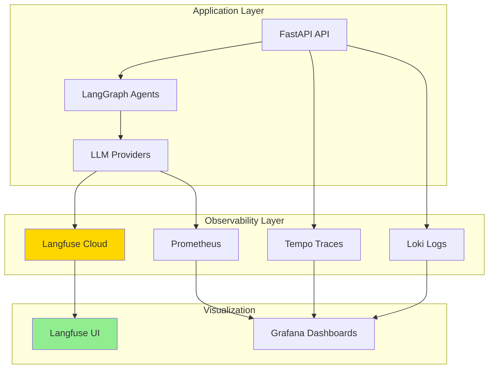
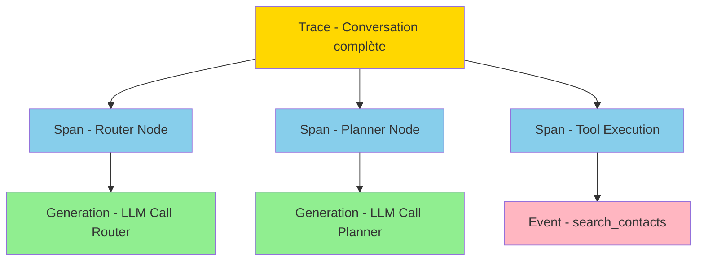
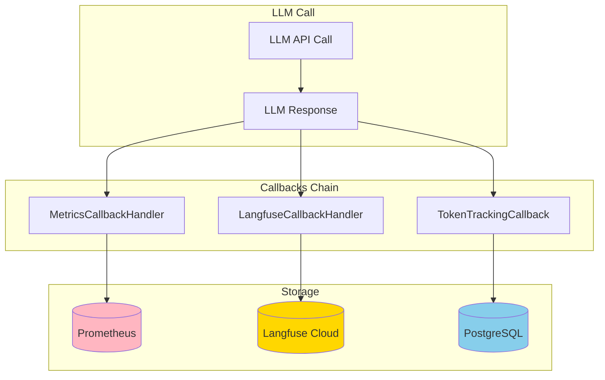

# LANGFUSE.md

**Documentation Technique - LIA**
**Version**: 1.0
**Dernière mise à jour**: 2025-11-14
**Statut**: ✅ Production-Ready

---

## Table des matières

1. [Vue d'ensemble](#vue-densemble)
2. [Architecture Langfuse](#architecture-langfuse)
3. [Integration LangChain](#integration-langchain)
4. [Traces et observations](#traces-et-observations)
5. [Token tracking](#token-tracking)
6. [Configuration](#configuration)
7. [Validation et debugging](#validation-et-debugging)
8. [Troubleshooting](#troubleshooting)
9. [Ressources](#ressources)

---

## Vue d'ensemble

### Qu'est-ce que Langfuse ?

**Langfuse** est une plateforme d'observabilité spécialisée pour applications LLM, offrant :

1. **Tracing complet** : Capture toutes les interactions LLM avec contexte
2. **Token & Cost Tracking** : Suivi précis des consommations et coûts
3. **Debugging LLM** : Visualization des prompts, réponses, erreurs
4. **Analytics** : Dashboards pour comprendre l'usage LLM
5. **Prompt Management** : Versioning et A/B testing de prompts

### Pourquoi Langfuse dans LIA ?

```python
"""
Langfuse Use Cases dans LIA

1. Debugging Multi-Agent:
   ✅ Trace complète Router → Planner → Domain Agents
   ✅ Voir tous les appels LLM avec prompts et réponses
   ✅ Identifier les erreurs et hallucinations

2. Token Tracking (Authoritative Source):
   ✅ Source de vérité pour consommation LLM
   ✅ Prometheus = agrégation temps réel
   ✅ Langfuse = détail par conversation

3. Cost Analysis:
   ✅ Coût par conversation
   ✅ Coût par user
   ✅ Coût par agent (router, planner, domain)

4. Prompt Optimization:
   ✅ Comparer versions de prompts
   ✅ Mesurer impact sur qualité
   ✅ A/B testing automatisé

5. Compliance & Audit:
   ✅ Historique complet des interactions
   ✅ Reproduction exacte des requêtes
   ✅ GDPR compliant (no PII storage)
"""
```

### Architecture d'observabilité complète



---

## Architecture Langfuse

### 1. Concepts clés

#### Trace

Une **trace** représente une exécution complète d'une requête utilisateur.

```python
"""
Trace Structure

Trace (top-level)
├── Span: Router Node
│   └── Generation: LLM call (gpt-4.1-nano)
├── Span: Planner Node
│   └── Generation: LLM call (gpt-4.1-mini)
├── Span: Domain Agent (contacts)
│   ├── Generation: LLM call (gpt-4.1-nano)
│   └── Span: Tool Execution
│       └── Event: search_contacts
└── Span: Response Node
    └── Generation: LLM call (gpt-4.1-mini)

Trace attributes:
- id: Unique trace ID (UUID)
- name: "multi_agent_conversation"
- user_id: User identifier (GDPR: hashed)
- session_id: Conversation session
- tags: ["production", "contacts_agent"]
- metadata: {environment: "prod", version: "0.1.0"}
- timestamp: ISO 8601
"""
```

#### Generation (LLM Call)

Une **generation** représente un appel LLM unique.

```python
"""
Generation Structure

Generation:
- id: Unique generation ID
- name: "router_decision"
- model: "gpt-4.1-nano"
- prompt: System + User messages (full context)
- completion: LLM response
- usage:
  - promptTokens: 1250
  - completionTokens: 85
  - totalTokens: 1335
- cost: 0.000234 USD (calculated)
- latency: 1.2 seconds
- status: "success"
- metadata: {node: "router", confidence: 0.95}
"""
```

### 2. Hiérarchie Langfuse



---

## Integration LangChain

### 1. Instrumentation automatique

```python
# apps/api/src/infrastructure/llm/factory.py

from langfuse.callback import CallbackHandler as LangfuseCallbackHandler

def create_langfuse_callback() -> LangfuseCallbackHandler | None:
    """
    Create Langfuse callback handler for LangChain instrumentation.

    Returns:
        Langfuse callback handler, or None if disabled

    Configuration:
        LANGFUSE_PUBLIC_KEY: Public API key
        LANGFUSE_SECRET_KEY: Secret API key
        LANGFUSE_HOST: Langfuse host (default: https://cloud.langfuse.com)
        LANGFUSE_ENABLED: Enable/disable Langfuse (default: true)
    """
    if not settings.langfuse_enabled:
        return None

    try:
        callback = LangfuseCallbackHandler(
            public_key=settings.langfuse_public_key,
            secret_key=settings.langfuse_secret_key,
            host=settings.langfuse_host,
        )

        logger.info(
            "langfuse_callback_created",
            host=settings.langfuse_host,
        )

        return callback

    except Exception as e:
        logger.error(
            "langfuse_callback_creation_failed",
            error=str(e),
            exc_info=True,
        )
        return None
```

### 2. Callback Chain

```python
# apps/api/src/infrastructure/llm/callback_factory.py

def create_callbacks(node_name: str, llm: BaseChatModel) -> list[AsyncCallbackHandler]:
    """
    Create callback chain for LLM instrumentation.

    Order matters:
    1. MetricsCallbackHandler (Prometheus) - ALWAYS FIRST
    2. LangfuseCallbackHandler (Langfuse) - SECOND
    3. TokenTrackingCallback (Database) - THIRD

    Args:
        node_name: LangGraph node name (router, planner, etc.)
        llm: LLM instance

    Returns:
        List of callback handlers
    """
    callbacks: list[AsyncCallbackHandler] = []

    # 1. Prometheus Metrics (ALWAYS FIRST - critical for alerting)
    callbacks.append(MetricsCallbackHandler(node_name=node_name, llm=llm))

    # 2. Langfuse Tracing (SECOND - detailed debugging)
    langfuse_callback = create_langfuse_callback()
    if langfuse_callback:
        callbacks.append(langfuse_callback)

    # 3. Token Tracking (THIRD - database persistence)
    # Note: Created separately in ChatService for conversation context

    return callbacks
```

### 3. Enrichissement des traces

```python
# apps/api/src/domains/agents/api/service.py

def enrich_config_with_metadata(
    self,
    config: RunnableConfig,
    run_id: str,
    user_id: UUID,
    conversation_id: UUID,
) -> RunnableConfig:
    """
    Enrich LangGraph config with metadata for observability.

    Adds metadata for:
    - Langfuse traces (user_id, session_id, tags)
    - Prometheus metrics (langgraph_node)
    - OpenTelemetry traces (correlation)

    Args:
        config: Base LangGraph config
        run_id: Unique run identifier
        user_id: User UUID
        conversation_id: Conversation UUID

    Returns:
        Enriched config with metadata
    """
    metadata = config.get("metadata", {})

    # Langfuse metadata
    metadata["user_id"] = str(user_id)
    metadata["session_id"] = str(conversation_id)
    metadata["run_id"] = run_id
    metadata["tags"] = ["production", "multi_agent"]
    metadata["environment"] = settings.environment

    # Update config
    config["metadata"] = metadata

    return config
```

---

## Traces et observations

### 1. Exemple de trace complète

```json
{
  "id": "trace_abc123",
  "name": "multi_agent_conversation",
  "userId": "user_hash_a1b2c3d4",
  "sessionId": "conv_123e4567-e89b-12d3",
  "timestamp": "2025-11-14T10:30:00Z",
  "tags": ["production", "multi_agent"],
  "metadata": {
    "environment": "production",
    "version": "0.1.0"
  },
  "observations": [
    {
      "id": "gen_router_001",
      "type": "generation",
      "name": "router_decision",
      "model": "gpt-4.1-nano",
      "startTime": "2025-11-14T10:30:00.100Z",
      "endTime": "2025-11-14T10:30:01.250Z",
      "promptTokens": 1250,
      "completionTokens": 85,
      "totalTokens": 1335,
      "statusMessage": "success",
      "metadata": {
        "node": "router",
        "intention": "contacts_agent",
        "confidence": 0.95
      }
    },
    {
      "id": "gen_planner_001",
      "type": "generation",
      "name": "planner_create_plan",
      "model": "gpt-4.1-mini",
      "promptTokens": 2100,
      "completionTokens": 450,
      "totalTokens": 2550
    },
    {
      "id": "gen_contacts_001",
      "type": "generation",
      "name": "contacts_agent_execution",
      "model": "gpt-4.1-nano",
      "promptTokens": 3200,
      "completionTokens": 320,
      "totalTokens": 3520
    },
    {
      "id": "gen_response_001",
      "type": "generation",
      "name": "response_final",
      "model": "gpt-4.1-mini",
      "promptTokens": 4500,
      "completionTokens": 680,
      "totalTokens": 5180
    }
  ],
  "totalPromptTokens": 11050,
  "totalCompletionTokens": 1535,
  "totalTokens": 12585,
  "totalCost": 0.002456
}
```

### 2. Query API Langfuse

```python
# scripts/validate_langfuse_integration.py (extrait)

async def get_recent_traces(self, limit: int = 10, hours: int = 24) -> list[dict]:
    """
    Fetch recent Langfuse traces via API.

    Args:
        limit: Maximum number of traces
        hours: Look back window

    Returns:
        List of trace objects
    """
    from_timestamp = datetime.utcnow() - timedelta(hours=hours)

    params = {
        "page": 1,
        "limit": limit,
        "fromTimestamp": from_timestamp.isoformat() + "Z",
    }

    response = await self.client.get(
        f"{self.api_url}/traces",
        params=params
    )
    response.raise_for_status()
    return response.json().get("data", [])
```

---

## Token tracking

### 1. Architecture Token Tracking



### 2. Sources de vérité

```python
"""
Token Tracking - Sources of Truth

1. Langfuse (AUTHORITATIVE for detailed analysis):
   ✅ Token count par conversation
   ✅ Token count par generation (LLM call)
   ✅ Token count par user
   ✅ Cost breakdown détaillé
   ✅ Historical trends (30+ days)

   Usage: Debugging, cost analysis, prompt optimization

2. Prometheus (AUTHORITATIVE for real-time monitoring):
   ✅ Token rate (tokens/sec)
   ✅ Token distribution (P50, P95, P99)
   ✅ Alerting (anomalies, budgets)
   ✅ 15-day retention

   Usage: Real-time monitoring, alerting, SLO tracking

3. PostgreSQL (BACKUP for billing):
   ✅ Token count par message
   ✅ Conversation totals
   ✅ Indefinite retention
   ✅ Billing reconciliation

   Usage: Billing, compliance, long-term storage

Alignment Strategy:
- Langfuse = ground truth for detailed analysis
- Prometheus = ground truth for real-time monitoring
- PostgreSQL = fallback for billing compliance
"""
```

### 3. Validation token alignment

```bash
# scripts/validate_langfuse_integration.py

python scripts/validate_langfuse_integration.py

# Output example:
# ================================================================================
# Langfuse Integration Validation (Phase 5)
# ================================================================================
#
# Configuration:
#   - Langfuse Host: https://cloud.langfuse.com
#   - Public Key: pk_lf_abc...
#   - Look-back: 24 hours
#   - Limit: 10 traces
#
# Step 1: Fetching recent traces...
#   ✅ Found 10 traces
#
# Step 2: Validating traces...
#
# ================================================================================
# Validation Results
# ================================================================================
#
# +------------------+--------------------------------+--------+---------+--------+------+-----------+
# | Trace ID         | Name                           | Input  | Output  | Total  | Obs  | Usage OK  |
# +==================+================================+========+=========+========+======+===========+
# | trace_abc123...  | multi_agent_conversation       | 11050  | 1535    | 12585  | 4    | ✅        |
# | trace_def456...  | simple_query                   | 450    | 120     | 570    | 1    | ✅        |
# +------------------+--------------------------------+--------+---------+--------+------+-----------+
#
# Summary Statistics:
# Total Traces Checked: 10
#   ✅ Successful: 10
#   ❌ Errors: 0
#
# Token Tracking:
#   ✅ Traces with usage data: 9 (90.0%)
#   ⚠️  Traces without usage data: 1 (10.0%)
#
# Total Tokens:
#   - Input: 125,450
#   - Output: 18,920
#   - Total: 144,370
```

---

## Configuration

### 1. Variables d'environnement

```bash
# apps/api/.env.example

# ============================================================================
# LANGFUSE - LLM Observability
# ============================================================================

# Langfuse Cloud credentials
LANGFUSE_PUBLIC_KEY=pk_lf_your_public_key_here
LANGFUSE_SECRET_KEY=sk_lf_your_secret_key_here
LANGFUSE_HOST=https://cloud.langfuse.com

# Enable/disable Langfuse tracing
LANGFUSE_ENABLED=true

# Debug mode (verbose logging)
LANGFUSE_DEBUG=false

# Sampling rate (0.0 to 1.0)
# 1.0 = 100% of traces (production default)
# 0.1 = 10% sampling (high-volume environments)
LANGFUSE_SAMPLE_RATE=1.0

# Flush interval (seconds)
# How often to send batches to Langfuse
LANGFUSE_FLUSH_INTERVAL=1

# Flush batch size
# Max traces per batch
LANGFUSE_FLUSH_BATCH_SIZE=50
```

### 2. Configuration Python

```python
# apps/api/src/core/config.py

class Settings(BaseSettings):
    """Application settings."""

    # Langfuse configuration
    langfuse_public_key: str = Field(
        default="",
        description="Langfuse public API key"
    )
    langfuse_secret_key: str = Field(
        default="",
        description="Langfuse secret API key"
    )
    langfuse_host: str = Field(
        default="https://cloud.langfuse.com",
        description="Langfuse host URL"
    )
    langfuse_enabled: bool = Field(
        default=True,
        description="Enable Langfuse tracing"
    )
    langfuse_sample_rate: float = Field(
        default=1.0,
        ge=0.0,
        le=1.0,
        description="Sampling rate for Langfuse traces (0.0-1.0)"
    )

    @field_validator("langfuse_enabled")
    @classmethod
    def validate_langfuse_keys(cls, v: bool, values: dict) -> bool:
        """Disable Langfuse if keys missing."""
        if v and not values.get("langfuse_public_key"):
            logger.warning("langfuse_disabled_missing_keys")
            return False
        return v
```

---

## Validation et debugging

### 1. Script de validation

Voir le code complet dans [scripts/validate_langfuse_integration.py](../../scripts/validate_langfuse_integration.py) (350 lignes).

Fonctionnalités :
- Fetch recent traces (API call)
- Extract token usage per trace
- Validate token alignment
- Summary statistics
- Warnings pour traces sans usage data

### 2. Debugging avec Langfuse UI

#### Accéder à une trace

```
1. Ouvrir Langfuse UI: https://cloud.langfuse.com
2. Naviguer: Traces > Search
3. Filtrer par:
   - User ID: user_hash_a1b2c3d4
   - Session ID: conv_123e4567
   - Date range: Last 24 hours
   - Tags: production
4. Cliquer sur trace pour voir détails
```

#### Analyser une generation

```
Dans la trace:
1. Expand "Observations"
2. Cliquer sur generation (ex: "router_decision")
3. Voir:
   - Prompt complet (system + user messages)
   - Completion (réponse LLM)
   - Token usage (prompt/completion/total)
   - Latency
   - Cost
   - Metadata (node, confidence, etc.)
```

#### Comparer des prompts

```
1. Naviguer: Prompts > List
2. Sélectionner prompt (ex: "router_system_prompt")
3. Voir versions (v1, v2, v3...)
4. Comparer:
   - Token usage moyen
   - Latency moyenne
   - Success rate
   - Cost total
5. A/B testing results
```

---

## Troubleshooting

### Problème 1: Traces manquantes dans Langfuse

**Symptôme** : Aucune trace visible dans Langfuse UI après appels LLM.

**Causes possibles** :
1. `LANGFUSE_ENABLED=false`
2. Credentials invalides
3. Eventual consistency delay (1-2 secondes)
4. Network errors (firewall, proxy)

**Solution** :

```bash
# 1. Vérifier configuration
python -c "
from src.core.config import settings
print(f'Enabled: {settings.langfuse_enabled}')
print(f'Host: {settings.langfuse_host}')
print(f'Public Key: {settings.langfuse_public_key[:10]}...')
"

# 2. Test credentials
python scripts/validate_langfuse_integration.py

# 3. Check logs for errors
grep -i "langfuse" logs/app.log | tail -20
```

### Problème 2: Token count discrepancy

**Symptôme** : Token count Langfuse ≠ Prometheus.

**Cause** : Cache hits (ADR-015).

**Explication** :

```python
"""
Known Limitation: Cache Hits

Problem:
- Cache hits (Redis LLM cache) don't trigger LLM calls
- No LLM call = no Langfuse generation
- Prometheus increments directly (no callback)

Result:
- Langfuse token count < Prometheus token count
- Difference = cached tokens

This is EXPECTED BEHAVIOR (documented in ADR-015)

Solution:
- Use Prometheus for authoritative cache hit metrics
- Use Langfuse for authoritative non-cached metrics
- Total = Prometheus (includes both)
"""
```

### Problème 3: High Langfuse latency

**Symptôme** : Augmentation latence requêtes après activation Langfuse.

**Cause** : Flush synchrone ou batch size trop petit.

**Solution** :

```bash
# Ajuster configuration dans .env

# Increase flush interval (default: 1s)
LANGFUSE_FLUSH_INTERVAL=3

# Increase batch size (default: 50)
LANGFUSE_FLUSH_BATCH_SIZE=100

# Enable async flush (non-blocking)
LANGFUSE_ASYNC=true
```

---

## Ressources

### Documentation interne

- [OBSERVABILITY_AGENTS.md](OBSERVABILITY_AGENTS.md) - Observabilité complète
- [SECURITY.md](SECURITY.md) - PII filtering dans Langfuse
- [AUTHENTICATION.md](AUTHENTICATION.md) - User ID hashing

### Documentation Langfuse

- [Langfuse Docs](https://langfuse.com/docs)
- [LangChain Integration](https://langfuse.com/docs/integrations/langchain)
- [API Reference](https://langfuse.com/docs/api)
- [Self-Hosting](https://langfuse.com/docs/deployment/self-host)

### Scripts utilitaires

```bash
# Validation Langfuse
python scripts/validate_langfuse_integration.py

# Export traces to CSV
python scripts/export_langfuse_traces.py --start 2025-11-01 --end 2025-11-14

# Cost analysis
python scripts/analyze_langfuse_costs.py --user user_hash_a1b2c3d4
```

---

**Dernière révision** : 2025-11-14
**Prochaine révision** : 2026-02-14 (tous les 3 mois)
**Responsable** : Observability Team
