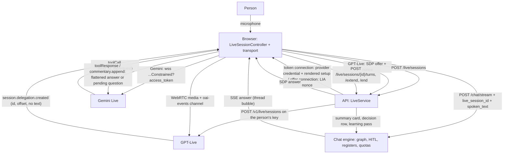

# Live Voice Mode — Technical Reference

A **speech-to-speech** session with LIA on the person's own provider key —
Gemini Live and OpenAI GPT-Live today, both at once if the person holds both
keys (the `live` connector category is additive, the sessions open on the one
the person chose). The voice model owns the conversation — listening,
speaking, interrupting, filling a wait — and delegates every request for data
or action to the chat engine: through ONE declared function on Gemini
(`send_to_lia`), by its own act on GPT-Live (`session.delegation.created`).
The delegated turn is an ordinary chat turn, drawn in the thread, bounded by
the quotas, filed in the registers.

- Architecture decisions: [ADR-299](../architecture/ADR-299-Live-Voice-Mode-Two-Intelligences-One-Seam.md) (the seam), [ADR-300](../architecture/ADR-300-A-Second-Live-Provider-One-Seam-Two-Wires.md) (the second provider, the additive category, the offer connection)
- Specs (arbitrated with the owner, measured): `docs/superpowers/specs/2026-09-18-live-llm-connector-design.md` (§ 9), `docs/superpowers/specs/2026-09-19-live-wave2-design.md` (§ 6)
- Feature flag: `LIVE_ENABLED` (default off); capability `live` (route-enforced, family *media*).
- Per-user connectors `GEMINI_LIVE` and `GPT_LIVE`, category `live` (additive), in *Préférences → Mes Connecteurs*; the sessions' provider in *Préférences → Mode Live* (choosing a model IS choosing its provider).
- Provider probe (Gemini): `task live:probe` (`apps/api/scripts/live/probe.py`, reads `LIVE_PROBE_API_KEY`).

## Architecture

**The audio never transits the API.** On a `token` connection the API mints
the provider's single-use credential and renders the setup the browser replays
verbatim; on an `offer` connection it mints its own single-use nonce and
exchanges the browser's SDP on the person's key. The CSP allowlists a
WebSocket provider's host exactly (`LIVE_PROVIDER_CONNECT_SRC`,
`apps/web/src/lib/csp.ts`); no directive governs a WebRTC peer connection.

## Two wires, one seam — and a third provider on the first wire

| | Gemini Live (`token`, `tool`) | GPT-Live (`offer`, `native`) | ElevenLabs Agents (`token`, `tool`, wave 4) |
|---|---|---|---|
| Browser transport | `transports/gemini-ws.ts`: JSON over a WebSocket, binary frames, the setup as first frame | `transports/openai-webrtc.ts`: WebRTC tracks + the `oai-events` data channel | `transports/elevenlabs-ws.ts`: JSON over a WebSocket on the `convai` subprotocol, the initiation frame first |
| Credential | the provider's ephemeral token, `uses: 1`, constrained to the model | LIA's nonce, kept on the session record, consumed by `POST /live/sessions/{id}/offer` | a SIGNED URL minted on the person's key (`GET /v1/convai/conversation/get-signed-url`), one conversation, opened within 15 minutes |
| Delegation | `toolCall send_to_lia(request)` — the model writes the request | `session.delegation.created` — id and `offset_ms`, no text: `lib/live/request-composer.ts` composes it from `session.input_transcript.delta` | `client_tool_call send_to_lia(request)` — a CLIENT tool attached to the person's agent (`AgentSyncing`), blocking: the agent waits |
| Result | `toolResponse` (+ `scheduling`, omitted where refused) | `session.commentary.append` (spoken) / `session.thinking.append` (silent), split under 500 tokens per append | `client_tool_result` — a string; the delivery note rides beside the result in one JSON string (`{result, tone}`) |
| Speech signals | `turnComplete`, `interrupted`, `interactionStatus` (Extended Thinking) | derived: the assistant's transcript IS its speech (quiet = end of utterance + turn complete), the person's words meanwhile = interruption | `agent_response` (the agent's WHOLE reply: the turn's text and its end), `interruption` (every audio event up to its id dropped) |
| Microphone | `audioStreamEnd`; `activityStart/End` under manual VAD | `session.input_audio.mute` / `unmute` (acknowledged); the track is disabled too | `user_audio_chunk` at 16 kHz (the probe requires `pcm_16000` input); nothing to tell on mute |
| VAD, interruptions | `realtimeInputConfig` from the person's reflexes | none — the provider decides (`configurable_vad: false`: the reflexes are not offered) | the agent's own, on the portal (`configurable_vad: false`, `portal_voice: true`) |
| Resumption | handle + `goAway`, a fresh token per reconnection | none (a fork is a new session): a drop ends the session `provider_closed` | none: a drop ends the session `provider_closed` |
| Extension of the cap | re-mints a token to the new cap, the client reconnects at once (the provider closes at expiry) | moves the cap only — the WebRTC session outlives it | re-mints a signed URL (a `token` wire), the client reconnects: a NEW conversation |
| Voice sample | the Gemini TTS model (`LIVE_VOICE_SAMPLE_MODEL`) on the person's key | a short live WebSocket session on the person's key (`providers/openai_live_socket.py`): the speech endpoint serves none of the twelve live voices | none: the voice is the agent's, on the portal — the form offers no voice and no sample, stores the sentinel `agent` |
| Activation probe | a session opened and closed on the SDK | the same WebSocket session: the provider refuses a wrong voice itself | a conversation opened on the REAL initiation frame and closed; LIA refuses in words an agent whose input format is not `pcm_16000` or whose output is not PCM |
| Provider usage | `usageMetadata` per model turn (the WHOLE context re-billed, by modality, plus `thoughtsTokenCount`) → the banner's indicative meter | `session.usage.updated` (`usage.seconds`, `context_window.usage_ratio`) → the same meter, priced per minute; the clock ticks between two events | none, and the platform prices NOTHING of it (`billing = "vendor"`, owner rule 2026-09-20: the agents API runs on the person's own key under the vendor's own grid): `rates` is null at the start, the meter shows the clock alone, no spend ceiling, and the vendor's own bill (`GET conversations/{id}`: `cost_fiat`, the LLM and call charges, the models charged for, the duration) is shown ONCE at the end, recorded nowhere. **The vendor settles the bill AFTER the close handshake** (measured 2026-09-20: `in-progress` and no cost while the close frame lands, the bill 0.3 s after the handshake, `done` at 1.4 s): the transport's `close()` waits for the socket's close event (`ELEVENLABS_CLOSE_WAIT_MS`) before `/end` is posted, and `fetch_vendor_bill` asks again `LIVE_VENDOR_BILL_SETTLE_ATTEMPTS` times, `LIVE_VENDOR_BILL_SETTLE_INTERVAL_SECONDS` apart — two sessions in a row had shown nothing |

The controller branches on `LiveSessionStart.capabilities` and
`LiveCredential.connection`, the mandate on `delegation_wire` and
`async_delegation`, the settings on `configurable_vad` and `portal_voice` —
never on a provider id. The third provider proved it: ElevenLabs is one
`LiveProvider` (`providers/elevenlabs_live.py`), one transport, one row in
`lib/live/providers.ts`, one CSP host (`wss://api.elevenlabs.io`) and NO
tariff row — no line of the bridge, the banner, the registers or the card
moved. Three seams grew for it, all provider-neutral: **`LiveProvider.billing`**
(`tariff`: the platform's table prices the model and the start publishes
`LiveRates`; `vendor`: the session runs on the person's own key under the
vendor's own grid, the platform prices NOTHING of it — `rates` null, the
clock alone on the meter, no ceiling, `LiveModelCapabilities.vendor_billed`,
the model offered whatever the table holds and never refused as « unpriced ».
ElevenLabs has two grids and the table knows one: the SIMPLE API — STT, TTS,
what the deployment's own slots run, where `eleven_v3_conversational` is a
`tts` row at 0.05 USD per 1 000 characters — and the AGENTS API — telephony
and the live mode, per conversation minute plus the LLM, on the person's key
only; owner rule 2026-09-20, after a flat row `elevenlabs-agents` and then a
« voice model's minute as a floor » were both written and retired: prices
from the wrong grid. The agent's `voice_model` and `llm` are still read
from its configuration at the listing, for information), **`VendorBilling`**
(the provider states what it billed once the conversation ended:
`conversation_bill` reads `cost_fiat`, the LLM and call charges in credits,
the models charged for and the duration under the conversation id the wire
named; the end response carries it as `vendor_bill`, the banner tells it
ONCE and it is recorded nowhere) and **`AgentSyncing`** (a provider whose sessions run
on an AGENT of the person's prepares it before the mint: the prompt-override
permission merged into the agent's own overrides block, LIA's client tools
created once per fingerprint of the declarations and attached beside the
person's own, the other set of LIA's detached — what LIA holds is kept on the
connector's metadata, a NEW dict). **At most one set per KIND lives in the
workspace** (review 2026-09-20): a new fingerprint of the delegation set or
of the direct set — a renamed description, a tool a release added — retires
the set that kind held before, taken off the agent then deleted (forced, best
effort), the phone's own rule on drift; the sets used to accumulate for ever,
fifty-odd tools per change, which is the orphan problem in another form. And a
set is named by the metadata only once the sync RETURNS: a vendor refusal on
the agent patch deletes the set this very call created and re-raises, else
every retry would leave one more orphan set behind.

**The ElevenLabs wire was read from the official `@elevenlabs/client` 1.25.0
source, then MEASURED on the owner's own agent (2026-09-19 evening, the first
sessions), and three findings became rules**: the provider validates
`source_info.source` against its OWN SDK names and closes **1008 after the
metadata** on any other word — the frame carries no `source_info` now, and
the activation probe keeps listening for `ELEVENLABS_LIVE_PROBE_SETTLE_SECONDS`
after the metadata because the metadata is NOT the verdict (a probe returning
on it said « ok » about a session that died at once); a client tool's array
items need a `description` (422, the phone had measured the same on webhook
tools) — `function_declaration` writes it in the one neutral projection; and a
refused creation must CANCEL its siblings before the rollback (`TaskGroup`,
never `gather` — fifty creations went on after the third refusal, the rollback
iterated a dict they kept filling, 99 orphan tools in the workspace, removed by
hand). The signed URL, the `convai` subprotocol, the initiation with the
prompt override and the agent's permission PATCH are measured to hold — and
the whole delegated session too, in a real Chromium on the real bundle
(2026-09-19 19:51, a throwaway account on the owner's agent, since deleted):
the socket opened on `convai`, the initiation went out, the metadata came
back, the microphone's chunks flowed, `user_transcript` → `audio` →
`agent_response`, two turns archived, the session ended clean. A socket that
fails BEFORE the setup now rejects with its close code and the provider's
reason (`closeWords`, both WebSocket transports), so the API's log names
what the browser saw rather than a bare `live_socket_error`.

### ElevenLabs over WebRTC on iPhone and iPad

On iOS the raw WebSocket audio of an ElevenLabs agent played unevenly, so the
browser asks for another audio transport there: `POST /live/sessions` carries
`audio_transport` (`websocket` by default, `webrtc` on iPhone, iPad and iPod),
the provider mints a LiveKit conversation token instead of a signed URL
(`LiveSetupInputs.audio_transport`, round-tripped with the record like every
other input), and `createLiveTransport(provider, audioTransport)` returns
`transports/elevenlabs-webrtc.ts` — the vendor's own SDK (`@elevenlabs/client`,
pinned) with its native audio tracks. The transport declares its audio
`managed`: the SDK owns the microphone and the speaker, so the controller
disposes of its PCM player and opens no PCM microphone of its own. LIA's tools
are the SDK's client tools, each routed through the same door as on the
WebSocket wire; a name the person's own agent declares is answered by that door
too, which refuses what it does not know. A WebRTC connection holds no expiring
credential, so an extension moves the cap without re-minting (the GPT-Live
rule); the CSP gains the one host the SDK opens, `wss://livekit.rtc.elevenlabs.io`
(`LIVE_PROVIDER_CONNECT_SRC`).

Three smaller measures ride with it. The PCM player keeps a rebuffer headroom
after an underrun (120 ms on iOS, none elsewhere) and a short attack after a
gap, and it counts what it played — chunks, drains, the audio duration, the
source and context rates, short and long gaps with a histogram — which the
controller posts as `audio_diagnostics` on `POST …/end`
(`LiveAudioDiagnostics`: counts only, never audio or text), so a stutter can be
told apart from a network starvation. iOS may mark the page hidden while its
microphone permission sheet is open: the hidden-page grace starts only once the
sheet has returned a stream. And a Gemini key restricted to the API server's IP
address mints its ephemeral token, then Google refuses the BROWSER's socket
(1008, « API key has an IP address restriction »): `liveErrorKey` names that
configuration (`live.error.key_ip_restricted`) instead of the generic start
failure — the Live connector needs a key without an IP restriction.

## A DIRECT session: the phone's line, in the browser (wave 4)

The header's voice menu offers a THIRD entry — « Direct live session
(<brand>) » — where the chosen model's wire carries a tool schema
(`LiveModelCapabilities.direct_tools`: Gemini's function declarations,
ElevenLabs' client tools; not GPT-Live's native wire). In a direct session
the voice model **holds LIA's read-only tools itself and never delegates**:
the phone's derived set (ADR-290 lot 8 — search or explicit `read` policy, a
voice domain, speakable parameters, plus the native `recall_memories`,
minus the person's own switches `users.phone_disabled_domains`), voice-projected
results, the phone's context block under a token budget, and the rule « never
act: say it in the chat or in a live session ».

- `POST /live/sessions {mode: "direct"}` — `LiveSessionMode`, a column of the
  session RECORD (`LiveSessionRecord.mode`, read back by `from_json`: the
  round-trip is pinned over every field because the first proof found the
  mode LOST on read, every lookup refused as « not a direct session »).
  Refused `mode_unsupported` (409) where `direct_tools` is false.
- `direct_mandate.py` renders `live_direct_system_prompt.txt` with the
  domains in words (`live_direct_lines.txt`), the context block from
  `self_call_context.build_owner_context(surface="live_session")` and
  declares `function_declaration(spec)` for every tool — the provider-neutral
  `{name, description, parameters}` the vendor bodies share; no `send_to_lia`.
- **One tool door**, `POST /live/sessions/{id}/tools` (`tool_door.py`): the
  record must be the person's and direct, the tool one the session declared,
  the session's lookup budget not spent (`LIVE_DIRECT_TOOL_CALLS_MAX`, 60, a
  Redis counter under the `live_tools` family that lives as long as the
  record); every refusal is a sentence the voice says (`refused_mode`,
  `refused_tool`, `budget_exhausted`, technical English). The door hands the
  offered set, the budget and the host to the ONE admission every voice
  lookup goes through (`agents/telephony/voice_lookup.serve_voice_lookup`,
  ADR-301 — the phone's call-back runs the same sequence: offered, then the
  budget, then the run), and the lookup runs
  through the phone's own runner (`run_live_tool`) under a
  **`VoiceToolHost`** — the seam that generalised the phone: surface
  `live_session`, the session's run id for the spend and the consultations,
  node `live_session_tool`. `live_tool_calls_total{provider,outcome}` on
  dashboard 30. A lookup that spends on Google alone (Places, Routes — no
  model call) is filed under the session's run since the ADR-272 amendment
  of 2026-09-20 (`TrackingContext.pending_families()` counts every billable
  family; before, a Google-only tracker wrote nothing), and the closing card
  sums the rows' **billed** total, Maps euros included. The browser answers the provider's call on the same id
  (`toolResponse` / `client_tool_result`) and, when the door cannot be
  reached, with the one browser-held line `direct_lines.lookup_failed`
  published by `GET /live/config`.
- **A direct session archives NOTHING turn by turn, and is RELAYED at its
  end** (owner decisions 2026-09-19 and 2026-09-20, ADR-301): no `live_turn`
  row is written, so nothing is injected into the next written turn — the
  detour that would have handed the exchange to the graph's own extractors —
  and the session's end runs no learning pass of its own. Instead
  `POST …/turns` KEEPS the exchange in the session record (a Redis list
  beside it, `LiveSessionStore.append_turns`, bounded by
  `LIVE_DIRECT_TRANSCRIPT_MAX_ROWS`, answering no row id), and the end turns
  the whole transcript into the message the person would have typed — the
  phone's own relay synthesis (`voice_relay.synthesize_relay`, first person,
  absolute dates, accounted under the session's run id on the `live_session`
  surface; the prompt is told the line is AUTHENTICATED through the context's
  `SESSION:` line, `voice_relay_lines.txt`, so it never looks for a phone
  call's identity check) — and runs it as the person's own turn: HITL, registers, quotas
  and the six extractions come with that turn. **Both run in a task the
  closing owns** (`voice_session_closing._settle_direct_relay`), off the
  request path, and holding NO database session across the turn (the
  workboard runner's rule; measured 2026-09-20: 8.9 s of `idle in
  transaction` before, none after): `POST …/end` calls no model — the person pressed stop, the
  account's claim is released at once, and a slow provider can neither hang
  the banner nor lock the account out of a new session. The closing card
  says `scheduled` (or `empty` when nothing was said — `live_summary.relay`)
  and is REWRITTEN once the words settled, with the fate known then
  (`answered`, `waiting`, `busy`, `pending_question`, `quota_blocked`,
  `failed`… — the phone's `RelayOutcome` vocabulary, EVERY value of which has
  a sentence in six languages, guarded), its cost re-read then (the relayed
  turn spent under the same run after the card was written). **The card
  does not stay at « scheduled » for anything that raises**: whatever broke
  in the settle, the fate known at that instant is written on a fresh
  session, and a turn that DID run is never reported as failed by a rewrite
  that failed after it. The envelope is the phone's own: the settle is a
  background task drained at graceful shutdown, and a hard crash mid-flight
  loses the words (nothing persists the transcript) and leaves the card at
  « scheduled » — stated here rather than promised away. **Words
  that could not become a turn are not lost**: when the relay did not run
  (busy, a pending question, a ceiling, a failure) the card carries the
  synthesis's neutral recap (`live_summary.relay_summary`, quoted under the
  fate; `summary_recap` in the Markdown fallback) — the phone's fallback push
  carries the same. An
  authenticated session is the account holder's by construction: the
  synthesis's own `owner_confirmed` — a model output — is overwritten, so a
  model that does not copy the collected flag cannot answer `not_owner` for
  the person's own session. A notice on the person's SSE stream
  (`proactive_live_session`, `metadata.event = live_relay`) reloads the
  thread. The banner's note says exactly that (« LIA reads your
  data for you and acts on nothing while you talk; at the end, what you asked
  is relayed to your conversation as a message from you »), the direct
  mandate NOTES a request instead of refusing it, and Stop is not offered
  (no chat turn to stop). What remains is what the registers owe (ADR-263):
  the decision row (a session happened), the consultation rows (which
  capability the voice read — never what was said) and the closing card,
  whose body counts no exchange.

**Measured on dev, 2026-09-19, on a real Gemini session** (a throwaway
account, the proof script removed): 55 tools declared, `setupComplete`, the
model calling `get_events_tool` itself with `time_min` / `time_max` on the
first spoken question, the door answering in 0.23 s, the treatment row filed
on `live_session` under the session's run id, the refusals in words. **And
the owner's premise measured**: the declarations weigh 35 864 of the 40 312
characters of the setup (a delegated setup is 4 611), and the FIRST turn
bills **10 983 prompt tokens against 1 227** on a delegated session — Gemini
re-bills the whole context every turn, so a direct session costs about nine
times the text prompt per turn for the latency it saves. Read-only, by
construction: HITL, mutations and the registers come free with delegation
(spec B1).

## The voice sessions' bounded context (ADR-301)

The phone's Live mode (ADR-301) gave the browser's live mode a sibling on
another line, and what the two share moved OUT of `live/` into
`domains/voice_sessions/` (values and queries: `VoiceSession`,
`VoiceTranscript`, the projection corpus shared with `lib/live/delegation.ts`,
the summary queries, the delegation block of the mandates, `bridge_lines()`
and `tone_lines()`) and `infrastructure/scheduler/` (the runners:
`voice_session_closing.close_voice_session`, ONE closing policy per mode
whichever the carrier — the browser's `end` and the phone's post-call webhook
call it —, `voice_relay` for the direct policy, `voice_delegation` for the
phone's server-side bridge). `live/service.py` shrank (594 → 547 SLOC),
`live/summary.py` and `live/learning.py` are gone. See
`docs/technical/TELEPHONY.md` § « Live mode » for the phone's half and
`docs/architecture/ADR-301-Voice-Sessions-One-Policy-Per-Mode.md` for the
decisions.

## Backend (`apps/api/src/domains/live/`)

| File | Role |
|---|---|
| `router.py` | `/live/*` under `capability_dependencies(LIVE)`: config (every enforced bound, published — the per-model duration bounds and the « no limit » value included — and the delivery notes, one per tone register), models discover / published voices / voice sample (before the connector exists, `provider` in the payload), connector activate, `GET /connectors` (every active one and the account's choice), `PUT /connectors/{provider}`, preferences, sessions (start, credential renewal, **offer exchange**, extend, turns, end). No execution route: a delegated request goes through `POST /chat/stream` with the person's own cookie. |
| `connector_service.py` | `LiveConnectorService`: everything that exists BEFORE a session — the activation door (key verified by the listing, voice checked against the vendored list, thinking level against the model's ladder, model probed by the provider), the account's provider choice (`chosen_connector`, `users.live_preferences.provider`), the union of the models the active keys discover, the voices of one provider, the voice sample on the person's key, the three reflexes. Composed by `LiveService`, never re-implemented. |
| `model_settings.py` | **A connector remembers EVERY model it was set up on** (owner decision 2026-09-19): `connector_metadata = {model, models: {name: {voice, thinking_level, idle_timeout_seconds, session_max_minutes}}}`, read through `read_models` (the previous top-level shape still read, never written), written through `write_models` as a NEW dict. A model switched to comes back with its own voice and durations; the two durations are per model, `0` = no limit, within bounds shared with the instance settings (`LIVE_SESSION_MAX_MINUTES_MIN/MAX`, `LIVE_IDLE_TIMEOUT_SECONDS_MIN/MAX`, ADR-184: the schema refuses the gap between « no limit » and the minimum, 422). **The spend ceiling is the CONNECTOR's** (wave 3, owner decision: provider granularity): `session_budget_eur`, optional, beside the models (`read_session_budget` / `write_session_budget`), bounded by `LIVE_SESSION_BUDGET_EUR_MAX` (published as `session_budget_eur_max`), published by the start and enforced by the browser's meter (outcome `budget_reached`). |
| `pricing.py` | **A live model of a `tariff`-billed provider is offered and started only when the tariff table declares it** (wave 3, owner rule 2026-09-19; a `vendor`-billed provider's models — ElevenLabs agents — are outside this rule, offered whatever the table holds, started with `rates` null): `rates_for(model)` reads the pricing cache (`get_cached_model_price`, exact name then normalised, the ADR-228 rule) into `LiveRates` — text rates, the audio pair, the USD→EUR rate — published by `POST /live/sessions`; `split_priced` partitions a key's discovered models into `models` (offered) and `unpriced` (named in the listing, never offered; the connector form says so instead of « invalid key »); `_check_choice` and the start refuse an undeclared model with `model_unpriced` (409). **« Declared » means the tariff can price a LIVE session**: a per-minute/hour unit, or a token-billed tariff WITH its audio pair — the text rates alone would leave every turn's cost unavailable and a spend ceiling unenforceable, so such a row does not declare a live model (the sentence names the rule). The tariff table gained `audio_input_unit_price` / `audio_output_unit_price` (migration `f1a3c5e7b9d2`, the seed's live rows, the admin form and the workbook — schema v3): a speech-to-speech model bills its audio beside its text, both or neither, `per_1m_tokens` only; a minute-billed model (`gpt-live-1`, `per_audio_minute`) declares none. The vendors' published rates, read 2026-09-19: Gemini 3.8 Live / Extended Thinking / 3.1 Flash Live text 0.75 / 4.50, audio 3.00 / 12.00 USD per 1M; Gemini 2.5 Flash native audio text 0.50 / 2.00, audio 3.00 / 12.00; GPT-Live 0.05 USD per minute, transcripts included. |
| `service.py` | `LiveService`: the session lifecycle — the session claim (Redis owner token, instance cap, mint rate limit; a new start by the same account SUPERSEDES the session it holds), the mint with the rendered mandate (a nonce kept on the record for an `offer` connection; LIA's inner state read through the psyche engine's own block), credential renewal for the SAME record, the offer exchange (nonce consumed BEFORE the provider is asked), the extension (re-mint on `token` only), turn archiving, the closing card with EXACT figures, the decision row, the learning pass. **The cap is the MODEL's** (`session_max_minutes`), and `0` means the cap ROLLS: the credential and the record still carry one (a slice of `LIVE_EXTENSION_MINUTES` — a provider token cannot outlive its expiry, and a key with no TTL is never written) that the client renews in silence; the record says so (`unlimited_cap`), a renewal is never counted as the person's extension (the card would say « extended 5 times » about a session nobody prolonged) and the metric names the kind (`live_session_extensions_total{kind=explicit|rolling}`). The start hands the client the model's `idle_timeout_seconds` (`0`: no silence clock at all). |
| `mandate.py` | The live system prompt (`prompts/v1/live_system_prompt.txt`) rendered with the person's name, language, local time, personality, **LIA's inner state** (`{psyche_block}`: the psyche engine's own `<InnerVoice>` block, the one the reminders and the proactive messages carry — placed verbatim when the engine hands one, nothing said otherwise) and ONE delegation verb per wire (`delegate_by_call` / `delegate_native`, `live_lines.txt`); the delegation block per wire and capability; the **delivery-note rule** (`tone_note_call` / `tone_note_native`, emitted only under `EXPRESSIVITY_ENABLED`); the `send_to_lia` declaration (`NON_BLOCKING`); the bridge lines; the **tone lines** (`live_tone_lines.txt`, one per register of `TONE_REGISTERS`, a guard holds the file complete and closed); the sample's greeting. |
| `providers/protocol.py` | `LiveProvider` (`connection`, `delegation_wire`, `billing` — `tariff` or `vendor` —, `default_model`, models, voices, `knows_voice`, `thinking_levels_of`, `capabilities_of`, `build_setup`, `mint`, `sample_voice`, `probe`), `OfferExchanging` (`exchange_offer`) for `offer` connections, `VendorBilling` (`conversation_bill`) for a `vendor`-billed provider, `AgentSyncing` (`sync_agent`) for a provider whose sessions run on the person's agent, and the setup-inputs pair (`setup_inputs_to_dict` / `setup_inputs_from_dict`, pinned by a round-trip equality test — a DIRECT session keeps `direct_tools` and no `tool_declaration`). `LiveModelCapabilities` gained `direct_tools` and `portal_voice` (wave 4), then `vendor_billed` (2026-09-20). |
| `providers/gemini.py` | Gemini: the ephemeral token (`uses=1`, constrained), the documented capability rows per family, the vendored voices, the TTS sample. The listing lives in `infrastructure/llm/providers/gemini_live_listing.py`, shared with the API-key verifier so `connectors` never imports `live`. **No `enableAffectiveDialog`, on purpose** (measured 2026-09-19, see below; a negative test pins it). |
| `providers/openai_live.py`, `providers/openai_live_socket.py` | GPT-Live: the `session` object with `delegation: {type: client}`, the nonce as credential, the offer exchange (`POST /v1/live/sessions`), the twelve vendored voices, the probe and the sample over a server-side WebSocket (input silence at real-time pace, the sentence through an instruction append, the continuous output trimmed by `infrastructure/media/pcm.py`). The listing lives in `infrastructure/llm/providers/openai_live_listing.py` (a transcription model under the live prefix is dropped). |
| `providers/elevenlabs_live.py` | ElevenLabs Agents (wave 4): the agents as models (`label` = the agent's name; the listing in `infrastructure/llm/providers/elevenlabs_live_listing.py`, shared with the key verifier so `connectors` imports neither `live` nor `telephony`), the initiation frame with the prompt alone, the signed URL as credential, `sync_agent` (permission merged, client tools by fingerprint, `tool_ids` = the person's own + this session's set), the probe over aiohttp, no sample (`portal_voice`). The agent doors it needs (`get_agent`, `signed_url`, `patch_agent`, `create_tool`, `set_agent_tool_ids`) are the phone's `telephony/client.py`. |
| `direct_mandate.py`, `tool_door.py` | The DIRECT session (wave 4, above): the mandate, the declarations, the context block; the tool door. |
| `session_store.py` | `LiveSessionRecord` (claim + record, `live:session`, USER_RUNTIME; TTL = cap + `LIVE_SESSION_RECORD_GRACE_SECONDS`; `nonce` / `nonce_until` for an offer connection; `mode`; `rewrite` under the claim), the active set (`live:active`, GLOBAL), the lookup budget of a direct session (`live_tools:<session>`, USER_RUNTIME). |
| `summary.py`, `learning.py`, `preferences.py`, `errors.py` | As in ADR-299: the exact figures of the card, the learning pass, the four reflexes plus the provider choice, the coded refusals (`credential_invalid` for a used or stale nonce). |
| `infrastructure/observability/metrics_live.py` + dashboard 30 | Sessions by outcome, mints by outcome (`mode_unsupported` among them), active sessions, duration, extensions by kind (`explicit` / `rolling`), voice samples, **offer exchanges**, archived exchanges, **direct-session lookups** by provider and outcome. |

**Measured** (each a rule in the code, its date in the comment):

- 2026-09-18 (Gemini): the constraint does not lock the instruction; a used token cannot reconnect; an unknown voice is accepted in silence; only the `…Constrained` method accepts a token; the frames are BINARY.
- 2026-09-19 (Gemini, wave 2): an open socket dies at the token's expiry (1011) → an extension re-mints and the client reconnects on the handle; a correction while a delegation runs is a SECOND `toolCall`, never a cancellation; Extended Thinking refuses `scheduling` and requires a thinking level; `gemini-3.1-flash-tts-preview` blocks the sample sentence, `gemini-2.5-flash-preview-tts` speaks it.
- 2026-09-19 (emotion in the voice, owner question 5): Gemini's `enableAffectiveDialog` is a FALSE POSITIVE at `setupComplete` — on the browser's own path (token-constrained socket, `gemini-3.8-live`) the flag earns a `setupComplete` and then closes the socket 1007 « invalid argument » at the FIRST thing the model must answer: a `clientContent` text turn, a `realtimeInput.text`, a SPOKEN question (the sample's TTS fed as 16 kHz PCM) alike; only silence survives it; v1beta and v1alpha, with or without the flag in the token constraint. Without the flag the same spoken question is understood, delegated, and **a function response carrying `{result, tone}` is accepted and restituted** (three runs, 384–545 kB of audio, the transcript the answer in the voice's own words). So the emotion comes from the MANDATE (LIA's inner state) and from the NOTE beside each result; the effect on the audio itself has no oracle and is not claimed.
- 2026-09-19 (the « biiiip »): the owner heard quarter-second beeps on every session on Chrome 152.0.7977.83. The raw provider audio captured on the socket (7 s, 21 chunks of 120–640 ms) holds no sustained tone and no boundary discontinuity; a Chromium 148 rendering of the same chunks through the previous player is clean; the community measured the same build replacing the start of a scheduled chunk with one render block repeated (discuss.ai.google.dev 180487, 181671 — « MEEP », AI Studio affected too, Chrome 151 and Canary 153 not). The tap this repository can place (a `ScriptProcessor` before the destination) did NOT reproduce it in four headed sessions on that build, so the fix rests on the community's measurement and on removing the pattern the defect needs: one worklet, no chunk scheduling. A worklet session was then replayed on the same Chrome 152 (three spoken questions, 46 chunks, the answer restituted, no repeated block, the same gap profile as before).
- 2026-09-19 (a session the provider closed in five seconds, twice): the API's log said `provider_closed` and nothing else. `LiveEndRequest.detail` now carries the client's technical word (`close 1007: …`, bounded by `LIVE_END_DETAIL_MAX_CHARS`), logged, never shown.
- 2026-09-19 (the meter, wave 3): Gemini's `usageMetadata` arrives once per model turn as `{promptTokenCount, responseTokenCount, totalTokenCount, promptTokensDetails: [{modality: TEXT|AUDIO, tokenCount}], responseTokensDetails: [...], thoughtsTokenCount}` — measured on a real session: 1 227 prompt tokens (974 text + 198 audio + 55 unattributed), 68 response (48 audio), 115 thoughts on the first turn, 1 342 / 160 / 72 on the second; the prompt is the WHOLE context re-billed on every turn, so the meter ADDS the turns and shows the last `totalTokenCount` as the context. Unattributed prompt tokens are counted as TEXT (the cheaper rate — the meter never over-reports on a guess). Gemini bills its transcriptions at the text output rate (Google staff, forum 140340) and GPT-Live includes them in its per-minute price, so **the captions are not an option**: switching them off would save nothing on GPT-Live and would remove what the delegation, the archive and the request composition need on both wires. A real session on the owner's Chrome (153.0.8010.53 by then) drew the meter per turn: `0 IN` → `1 580 IN · 160 OUT · 0,0025 € · contexte 1 650` → `3 392 · 435 · 0,0068 €` → `5 430 · 670 · 0,0110 € · contexte 2 185`.
- 2026-09-19 (GPT-Live): `session.started` in 1.2–1.7 s over WebSocket; an unknown voice refused BEFORE the start (`forbidden`), an unknown model `invalid_model`; `session.instructions.append` needs `delegation_id: null` and `content`, and a greeting renders only while input audio flows; over WebRTC in a real Chromium: connected in 480 ms, channel open at 640–710 ms, `session.started` on the channel 110 ms later, a spoken question transcribed and delegated BY THE MODEL 6 ms after its last fragment (« Une seconde, je regarde »), our commentary spoken back and acknowledged ten seconds later, `session.closed` 700 ms after `session.close`; the speech endpoint serves none of the live voices.

## Frontend (`apps/web/src/`)

| File | Role |
|---|---|
| `lib/live/types.ts` | The wire contracts, mirrors of `domains/live/schemas.py` (`LiveCredential.connection`, `LiveConnectOptions.exchangeOffer`, `LiveModelCapabilities`). |
| `lib/live/transport.ts`, `lib/live/transports/{gemini-ws,openai-webrtc,elevenlabs-ws,elevenlabs-webrtc,index}.ts` | The `LiveTransport` seam (intentions, never frames) and the four transports; `createLiveTransport(provider, audioTransport)` — ElevenLabs over WebRTC on iOS, its audio `managed` by the vendor SDK. A `LiveDelegation` carries the CALL itself (`call: {name, args}`) on a tool wire, so a direct session reads the tool's name where a delegated one reads the request. |
| `lib/live/request-composer.ts` | The request of a native delegation, from the input transcript. |
| `lib/live/providers.ts` | The providers the browser speaks: id, connector type, brand, billed account — read by the settings, the connector form and its group; held equal to the API's `PROVIDERS` by the cross-stack guard. `LIVE_PORTAL_VOICE` (`agent`), the sentinel stored for a portal-voiced model, held equal to `ELEVENLABS_LIVE_PORTAL_VOICE`. |
| `lib/live/pcm-player.ts`, `lib/live/mic-capture.ts` | Gapless PCM playback (Gemini) through ONE `AudioWorkletNode` reading a queue of chunks continuously (linear resampling ACROSS chunk boundaries, an exact `drained` report from the render thread, a flush inside the worklet) — never one `AudioBufferSourceNode` per chunk: that shape is the one Chrome 152 (152.0.7977.83, the owner's build) sometimes renders with a 128-sample block repeated ~100 times at a chunk start, the « biiiip » heard on every session (see Measured). The microphone as PCM chunks through the shared worklet, or the bare stream a native transport carries (`pcm: false`). |
| `lib/live/session-machine.ts`, `lib/live/activity-clock.ts` | The session states; `closeDecision`; the silence clock with its holds (speaking, delegating, provider) and countdown. |
| `lib/live/meter.ts`, `lib/live/meter-view.ts`, `components/live/LiveMeter.tsx` | **The indicative meter** (wave 3, owner request; the « never count a personal key's spend » rule amended the same day: a live DISPLAY is not an accounting). The transports normalise the provider's own reports (`geminiUsageReport`, `openaiUsageReport` → `LiveUsageReport`, `onUsage`), the store folds them (`accumulateUsage`: tokens add, a duration replaces), `meterCost` prices them by the `LiveRates` the start published — a cost that needs a rate nobody declared is null, never a partial figure (ADR-185) — and the band draws it UNDER the last caption, set off by a lateral bar (owner placement 2026-09-19), in the chat meter's vocabulary (🟠 IN · 🟢 OUT · euros · context); the captions fold is an icon button like its neighbours. A duration-billed model ticks with the wall clock, corrected upward by the provider's count. Never persisted, never on the closing card. When the connector carries a ceiling, the cost reads « 0,0450 € / 2,00 € » and the controller ends the session at it (`checkBudget`: on every report, and every second on a duration-billed model). |
| `lib/live/delegation.ts` | `DelegationBridge`: the newest request wins, a bounded wait, a pending HITL question as the answer, `flattenForVoice` + `boundToTokens`, and the **delivery note**: the register the answering model declared (ADR-253, read off the live bubble's `metadata.expressivity`, which the reducer copies from the SSE `done` and never persists) mapped through the config's `tone_lines` — on Gemini a `tone` field beside `result` in the function response, on GPT-Live a silent `session.thinking.append` before the spoken one; a late answer (a text turn) carries none. |
| `lib/live/session-controller.ts`, `lib/live/support.ts` | `LiveSessionController`: the browser checked before anything is minted, mint, microphone BEFORE the connection, connect (the exchange door handed to an `offer` connection), turns, delegation, reconnection, idle / hidden / cap / extension timers — the silence clock is the MODEL's (`idle_timeout_seconds` from the start; `0`: none), a rolling cap (`session_max_minutes: 0`) is renewed at the prompt instant without a dialog — the closing card. Tested without React. |
| `hooks/useLiveSession.ts`, `hooks/useLiveAvailability.ts` | The thin React shell (`start(mode)`); « is there an active live connector, on which provider, and can its model hold a direct session? » (`GET /live/connectors` → `{ available, provider, directTools }`). The store carries `pendingStart: LiveSessionMode | null` and `mode`. **The reading follows the Live settings** (owner request 2026-09-19): the voice toggle sits in the dashboard layout and never remounts between the settings and the chat, so its one read kept the old brand on « Session Live (<brand>) » after a provider or model change. `stores/revisionStore.ts` is the seam — a writer BUMPS the resource it changed (`bumpRevision('live_connectors')` on a saved connector, an activation, a live disconnect), a reader hands the revision to its query's `deps`; the vocabulary is a closed type. Journey `e2e/smoke/settings-live-header-menu.spec.ts` (red without the bump, measured). |
| `components/live/LiveBanner.tsx`, `LiveExtendDialog.tsx`, `LiveCaptions.tsx`, `LiveSessionSummaryCard.tsx`, `VoicesProvenance.tsx`, `components/voice-toggle.tsx` | The opaque band above the thread with the idle countdown, the extension dialog, the captions, the closing card, the voice list's provenance, and the toast that greets a session on its OWN `live` status (once per session id); the header's ONE voice icon (a toggle, or a menu of two entries drawn alike with an icon before each: « Spoken replies » and « Live session (<brand>) », named after the provider the sessions open on). **The two voices are exclusive** (owner decision 2026-09-19): asking for a session switches the spoken replies off without a word, the checkbox is refused while a session is open, and the icon shows the live waveform while one runs. No talk mode: a live session is always automatic. |
| `components/settings/LiveModeSettings.tsx`, `components/settings/LiveDurationFields.tsx`, `hooks/useLiveConnectorSettings.ts`, `hooks/useLiveConnectorDraft.ts`, `hooks/useLivePreferences.ts`, `hooks/useVoiceSample.ts` | The « Live mode » section: the union of models grouped by brand, the voices of the provider under edit (a stale listing for another provider is withheld), the sample on every voice change, **a model switched to coming back with what its connector remembers** (voice, level, durations — else the provider's first voice and the instance defaults), the two durations under the billing warning (`0` = no limit; the API's bounds shown, a value in the gap or past the maximum said under the field and withheld from the save; the typed text kept apart from the number so a cleared field never snaps back), the reflexes a provider can honour, the save on `PUT /live/connectors/{provider}`. |
| `components/settings/connectors/LiveConnectorForm.tsx`, `hooks/useLiveConnector.ts`, `LiveConnectorGroup.tsx` | The connector form (told which provider it sets up; key → listing → choose → sample → activate) and its group: the connected ones, and an available card per provider not yet set up. |
| `e2e/smoke/chat-live-session.spec.ts`, `e2e/smoke/chat-live-session-openai.spec.ts`, `e2e/smoke/chat-live-session-elevenlabs.spec.ts` | The hermetic journeys: Gemini played by `page.routeWebSocket` (binary frames) — a delegated session and a DIRECT one (the third menu entry, `{mode: direct}` posted, `toolCall` → the tool door → `toolResponse`, nothing in the thread, no Stop); GPT-Live by a fake `RTCPeerConnection` (the offer exchange, the text-less delegation, the appended answer, `session.close`); ElevenLabs by `page.routeWebSocket` on the signed URL (the initiation first, the pong, `client_tool_call` → the thread → `client_tool_result` with the note, `agent_response` as a caption). |

## What the thread shows

- A **delegated turn** is a chat turn stamped `live_session_id` with the person's `spoken_text` beside the request (written by the model, or composed from the transcript).
- A **voice-only exchange** is archived as two visible rows (`live_turn`) at the turn's end — `turnComplete` on Gemini, the assistant's quiet on GPT-Live.
- The session closes on ONE card (`live_session_summary`): the outcome, the duration, the requests to LIA, the voice exchanges, the EXPLICIT extensions (a rolling cap's renewals are not the person's), and LIA's own spend.

## Bounds, all published by `GET /live/config`

`LIVE_SESSION_MAX_MINUTES` (10) and `LIVE_IDLE_TIMEOUT_SECONDS` (60) are the DEFAULTS a model
starts from — each model of a connector keeps its own two durations, `0` meaning no limit,
within `LIVE_SESSION_MAX_MINUTES_MIN/MAX` (1–240) and `LIVE_IDLE_TIMEOUT_SECONDS_MIN/MAX`
(5–3600), published as `session_max_bounds` / `idle_timeout_bounds` / `unlimited_value` because
they are enforced (ADR-184); the silence is « nobody speaks, LIA neither, no delegation in
flight, no provider processing », with a countdown for the last 5 s. `LIVE_EXTENSION_MINUTES`
(10, unlimited explicit extensions; the slice a rolling cap renews by),
`LIVE_EXTENSION_PROMPT_SECONDS` (60, below the cap), `LIVE_CONNECT_WINDOW_SECONDS`, `LIVE_HIDDEN_GRACE_SECONDS`, `LIVE_MAX_CONCURRENT_SESSIONS`,
`LIVE_MINT_RATE_LIMIT_*` (the voice sample shares its family), `LIVE_DELEGATION_TIMEOUT_SECONDS`,
`LIVE_DELEGATION_RESULT_MAX_TOKENS`, `LIVE_CONTEXT_TRIGGER_TOKENS` / `LIVE_CONTEXT_TARGET_TOKENS`,
`LIVE_PROBE_TIMEOUT_SECONDS` (the probe, the sample's start, the SDP exchange),
`LIVE_VOICE_SAMPLE_MODEL`, `LIVE_SESSION_BUDGET_EUR_MAX` (100, the most a connector's optional
per-session ceiling may be). Every refusal is coded (`connector_missing`, `session_in_progress`,
`instance_busy`, `mint_rate_limited`, `provider_refused`, `voice_unknown`,
`thinking_level_unknown`, `model_unpriced`, `mode_unsupported`, `session_not_found`,
`session_expired`, `credential_invalid`; the browser adds `unsupported_browser` on its own).
`LIVE_DIRECT_TOOL_CALLS_MAX` (60) bounds the lookups of one direct session. The outcomes a session
can end on: `ended`, `expired`, `idle_timeout`, `hidden`, `provider_closed`, `resumption_failed`,
`error`, `mic_denied`, `superseded`, `budget_reached` — one closed vocabulary shared by the API,
the web types and the six locales, held
equal by `tests/unit/domains/live/test_vocabulary_crosses_the_stack.py` and
`lib/live/__tests__/live-labels.test.ts`.

## What the live mode does NOT do

- It never RECORDS the provider's tokens or seconds — no ledger row, no `user_statistics`, no closing-card figure: the person's key pays them. Showing them while the session runs, priced by the declared tariff, is a display the person reads on their own screen (owner rule amended 2026-09-19); on a `vendor`-billed provider the platform prices nothing at all, and what is shown is the vendor's own bill, read once at the end (owner rule 2026-09-20).
- It never runs a tool, holds a credential or writes a register row of its own: the delegated turn does, in the graph.
- It does not bridle the tool set of a DELEGATED session: unlike the phone (ADR-290), the person is at their own screen. A DIRECT session is read-only by construction (wave 4): a mutation asked there is refused in one sentence and pointed at the chat.
- It does not replace the voice mode's push-to-talk (`VOICE_MODE.md`): a third door beside it.
- It does not ask Gemini for `enableAffectiveDialog`: measured to kill the session at the first answer on the browser's path (above). The voice's emotion is LIA's inner state in the mandate and the delivery note beside each result.
- It does not choose the billing model for the person: a provider may bill the whole session (waiting included) or only the exchanges, so the durations are the person's, under a warning that says exactly that.
- Measured in the Android shell (2026-09-19, `task mobile:probe:android`): the engine produces a WebRTC offer with a data channel (`webrtc_offer=offer`) and loads an AudioWorklet module from a `blob:` URL under the production CSP (`audio_worklet_blob=loaded`), beside the WebSocket that leaves the page. Not measured yet: the same two on iOS (the probe needs macOS), and a full session with a credential in either shell.
