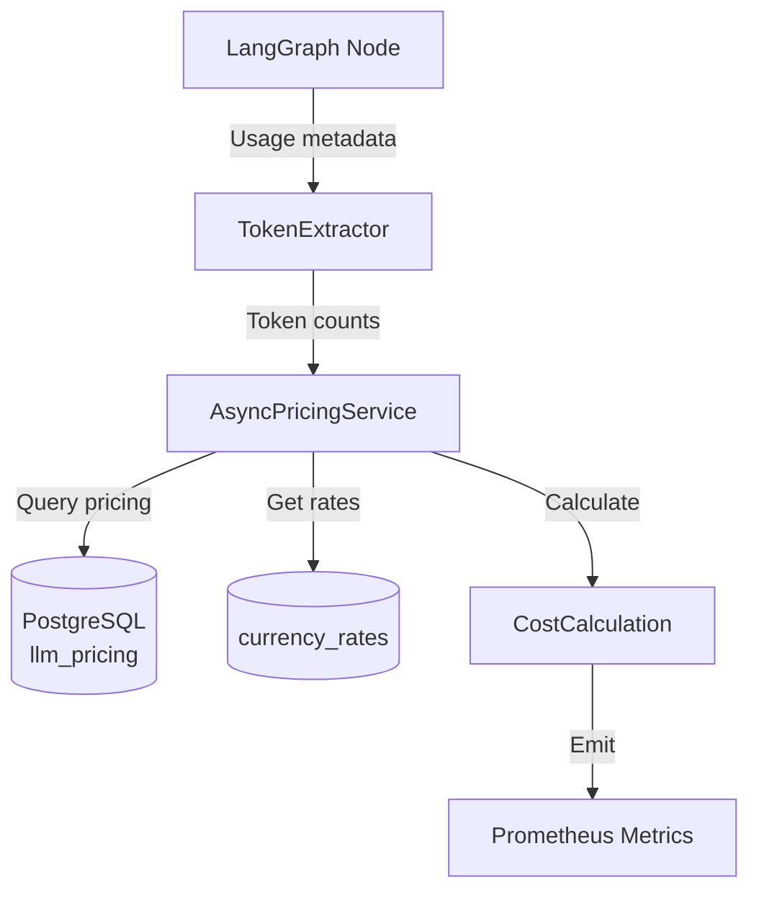
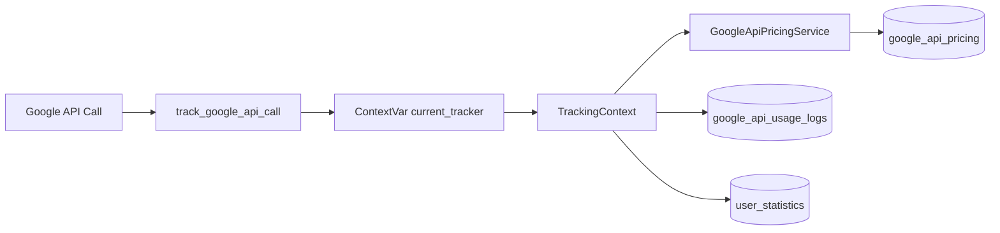

# LLM_PRICING_MANAGEMENT - Gestion des Coûts LLM

> **Documentation complète du système de pricing et token tracking multi-provider**
>
> **Version**: 2.0
> **Date**: 2026-02-04
> **Dernière mise à jour**: Intégration Google API tracking, exports consommation
> **Statut**: ✅ Complète

---

## 📋 Table des Matières

1. [Vue d'ensemble](#vue-densemble)
2. [AsyncPricingService](#asyncpricingservice)
3. [Database Schema](#database-schema)
4. [Token Tracking](#token-tracking)
5. [Currency Conversion](#currency-conversion)
6. [Cost Calculation](#cost-calculation)
7. [Multi-Provider Support](#multi-provider-support)
8. [Google API Cost Tracking](#google-api-cost-tracking)
9. [Export de Consommation](#export-de-consommation)
10. [Métriques & Observabilité](#métriques--observabilité)
11. [Annexes](#annexes)

---

## 📖 Vue d'ensemble

### Objectif

Le système de pricing LLM permet de:
- **Tracker les tokens** utilisés par node (router, planner, response, agents)
- **Calculer les coûts** en temps réel (USD/EUR)
- **Support multi-provider** (OpenAI, Anthropic, DeepSeek, Perplexity, Ollama)
- **Currency conversion** automatique avec cache
- **Intégration Google API** : tracking des coûts Google Maps Platform (voir [GOOGLE_API_TRACKING.md](./GOOGLE_API_TRACKING.md))
- **Export consommation** : exports CSV détaillés et agrégés pour facturation

### Architecture



### Providers Supportés

| Provider | Models | Pricing Source |
|----------|--------|----------------|
| OpenAI | gpt-4.1-mini, gpt-4.1-mini-mini, gpt-4.1-nano, o1, o1-mini | Seeded in DB |
| Anthropic | claude-sonnet-4, claude-opus-4 | Seeded in DB |
| DeepSeek | deepseek-chat, deepseek-reasoner | Seeded in DB |
| Perplexity | sonar-pro, sonar-reasoning | Seeded in DB |
| Ollama | * (local models) | Free (0.00) |

---

## 🔧 AsyncPricingService

### Code Complet

**Fichier source**: [apps/api/src/domains/llm/pricing_service.py](apps/api/src/domains/llm/pricing_service.py)

```python
from decimal import Decimal
from typing import NamedTuple
from datetime import datetime
import time

class ModelPrice(NamedTuple):
    """Model pricing information."""
    model_name: str
    input_price: Decimal  # USD per 1M tokens
    cached_input_price: Decimal | None  # Cached tokens (Anthropic)
    output_price: Decimal  # USD per 1M tokens
    effective_from: datetime

class AsyncPricingService:
    """
    Async pricing service with LRU cache.

    Cache TTL: 1 hour (pricing changes infrequently)
    """

    def __init__(self, db: AsyncSession, cache_ttl_seconds: int = 3600):
        self.db = db
        self.cache_ttl = cache_ttl_seconds
        self._cache_timestamp: dict[str, float] = {}
        self._model_price_cache: dict[str, ModelPrice] = {}
        self._currency_rate_cache: dict[str, Decimal] = {}

    async def get_active_model_price(self, model_name: str) -> ModelPrice | None:
        """
        Get active pricing for model (cached).

        Args:
            model_name: e.g., "gpt-4.1-mini", "claude-sonnet-4"

        Returns:
            ModelPrice or None if not found
        """
        cache_key = f"async_model_price_{model_name}"

        # Check cache validity
        if cache_key in self._cache_timestamp:
            age = time.time() - self._cache_timestamp[cache_key]
            if age <= self.cache_ttl and cache_key in self._model_price_cache:
                return self._model_price_cache[cache_key]

        # Query database
        pricing = await self._query_model_pricing(model_name)

        # Cache result
        if pricing:
            self._model_price_cache[cache_key] = pricing
            self._cache_timestamp[cache_key] = time.time()

        return pricing

    async def _query_model_pricing(self, model_name: str) -> ModelPrice | None:
        """Query pricing from database."""
        normalized_model = normalize_model_name(model_name)

        stmt = select(LLMModelPricing).where(
            LLMModelPricing.model_name == normalized_model,
            LLMModelPricing.is_active
        )

        result = await self.db.scalars(stmt)
        pricing = result.first()

        if not pricing:
            logger.warning("model_pricing_not_found", model=model_name)
            return None

        return ModelPrice(
            model_name=pricing.model_name,
            input_price=pricing.input_price_per_million,
            cached_input_price=pricing.cached_input_price_per_million,
            output_price=pricing.output_price_per_million,
            effective_from=pricing.effective_from
        )

    async def get_currency_rate(
        self,
        from_currency: str = "USD",
        to_currency: str = "EUR"
    ) -> Decimal:
        """
        Get currency exchange rate (cached).

        Args:
            from_currency: Source currency (default: USD)
            to_currency: Target currency (default: EUR)

        Returns:
            Exchange rate (e.g., 0.94 for USD->EUR)
        """
        if from_currency == to_currency:
            return Decimal("1.0")

        cache_key = f"async_rate_{from_currency}_{to_currency}"

        # Check cache
        if cache_key in self._cache_timestamp:
            age = time.time() - self._cache_timestamp[cache_key]
            if age <= self.cache_ttl and cache_key in self._currency_rate_cache:
                return self._currency_rate_cache[cache_key]

        # Query database
        stmt = select(CurrencyExchangeRate).where(
            CurrencyExchangeRate.from_currency == from_currency,
            CurrencyExchangeRate.to_currency == to_currency,
            CurrencyExchangeRate.is_active
        )

        result = await self.db.scalars(stmt)
        rate_record = result.first()

        if not rate_record:
            logger.warning("currency_rate_not_found",
                          from_currency=from_currency,
                          to_currency=to_currency)
            return Decimal("1.0")  # Fallback

        # Cache result
        self._currency_rate_cache[cache_key] = rate_record.rate
        self._cache_timestamp[cache_key] = time.time()

        return rate_record.rate

    async def calculate_cost(
        self,
        model_name: str,
        input_tokens: int,
        output_tokens: int,
        cached_tokens: int = 0,
        target_currency: str = "EUR"
    ) -> dict:
        """
        Calculate cost for token usage.

        Args:
            model_name: LLM model
            input_tokens: Input token count
            output_tokens: Output token count
            cached_tokens: Cached input tokens (Anthropic)
            target_currency: Target currency (default: EUR)

        Returns:
            {
                "input_cost_usd": Decimal,
                "output_cost_usd": Decimal,
                "cached_cost_usd": Decimal,
                "total_cost_usd": Decimal,
                "total_cost_target": Decimal,
                "currency": str,
                "exchange_rate": Decimal
            }
        """
        # Get pricing
        price = await self.get_active_model_price(model_name)
        if not price:
            logger.error("pricing_not_available", model=model_name)
            return self._zero_cost_result(target_currency)

        # Calculate USD costs (per million tokens)
        input_cost_usd = (Decimal(input_tokens) / Decimal("1000000")) * price.input_price
        output_cost_usd = (Decimal(output_tokens) / Decimal("1000000")) * price.output_price

        cached_cost_usd = Decimal("0")
        if cached_tokens > 0 and price.cached_input_price:
            cached_cost_usd = (Decimal(cached_tokens) / Decimal("1000000")) * price.cached_input_price

        total_usd = input_cost_usd + output_cost_usd + cached_cost_usd

        # Currency conversion
        rate = await self.get_currency_rate("USD", target_currency)
        total_target = total_usd * rate

        return {
            "input_cost_usd": input_cost_usd,
            "output_cost_usd": output_cost_usd,
            "cached_cost_usd": cached_cost_usd,
            "total_cost_usd": total_usd,
            "total_cost_target": total_target,
            "currency": target_currency,
            "exchange_rate": rate
        }
```

---

## 🗄️ Database Schema

### Table: llm_pricing

```sql
CREATE TABLE llm_pricing (
    id UUID PRIMARY KEY DEFAULT uuid_generate_v4(),
    model_name VARCHAR(100) NOT NULL,  -- 'gpt-4.1-mini', 'claude-sonnet-4', etc.
    input_price_per_million DECIMAL(10, 6) NOT NULL,  -- USD per 1M input tokens
    cached_input_price_per_million DECIMAL(10, 6),  -- USD per 1M cached tokens (Anthropic)
    output_price_per_million DECIMAL(10, 6) NOT NULL,  -- USD per 1M output tokens
    effective_from TIMESTAMP NOT NULL DEFAULT NOW(),
    is_active BOOLEAN DEFAULT TRUE,
    created_at TIMESTAMP DEFAULT NOW(),
    updated_at TIMESTAMP DEFAULT NOW(),
    UNIQUE(model_name, is_active)
);

CREATE INDEX idx_llm_pricing_active ON llm_pricing(model_name) WHERE is_active = TRUE;
```

### Seed Data (Exemples)

**Fichier source**: [apps/api/alembic/versions/2025_11_05_1500-seed_openai_pricing.py](apps/api/alembic/versions/2025_11_05_1500-seed_openai_pricing.py)

```python
# OpenAI Models
openai_pricing = [
    {
        "model_name": "gpt-4.1-mini",
        "input_price_per_million": Decimal("2.50"),
        "output_price_per_million": Decimal("10.00"),
        "effective_from": datetime(2025, 11, 5)
    },
    {
        "model_name": "gpt-4.1-mini-mini",
        "input_price_per_million": Decimal("0.150"),
        "output_price_per_million": Decimal("0.600"),
        "effective_from": datetime(2025, 11, 5)
    },
    {
        "model_name": "o1",
        "input_price_per_million": Decimal("15.00"),
        "output_price_per_million": Decimal("60.00"),
        "effective_from": datetime(2025, 11, 5)
    },
    {
        "model_name": "o1-mini",
        "input_price_per_million": Decimal("3.00"),
        "output_price_per_million": Decimal("12.00"),
        "effective_from": datetime(2025, 11, 5)
    }
]

# Anthropic Models (with cached tokens support)
anthropic_pricing = [
    {
        "model_name": "claude-sonnet-4",
        "input_price_per_million": Decimal("3.00"),
        "cached_input_price_per_million": Decimal("0.30"),  # 10x cheaper
        "output_price_per_million": Decimal("15.00"),
        "effective_from": datetime(2025, 11, 5)
    },
    {
        "model_name": "claude-opus-4",
        "input_price_per_million": Decimal("15.00"),
        "cached_input_price_per_million": Decimal("1.50"),
        "output_price_per_million": Decimal("75.00"),
        "effective_from": datetime(2025, 11, 5)
    }
]

# DeepSeek Models
deepseek_pricing = [
    {
        "model_name": "deepseek-chat",
        "input_price_per_million": Decimal("0.14"),
        "output_price_per_million": Decimal("0.28"),
        "effective_from": datetime(2025, 11, 5)
    },
    {
        "model_name": "deepseek-reasoner",
        "input_price_per_million": Decimal("0.55"),
        "output_price_per_million": Decimal("2.19"),
        "effective_from": datetime(2025, 11, 5)
    }
]
```

### Table: currency_rates

```sql
CREATE TABLE currency_exchange_rates (
    id UUID PRIMARY KEY DEFAULT uuid_generate_v4(),
    from_currency VARCHAR(3) NOT NULL,  -- 'USD'
    to_currency VARCHAR(3) NOT NULL,    -- 'EUR'
    rate DECIMAL(10, 6) NOT NULL,       -- Exchange rate
    effective_from TIMESTAMP NOT NULL DEFAULT NOW(),
    is_active BOOLEAN DEFAULT TRUE,
    created_at TIMESTAMP DEFAULT NOW(),
    updated_at TIMESTAMP DEFAULT NOW(),
    UNIQUE(from_currency, to_currency, is_active)
);

CREATE INDEX idx_currency_rates_active
    ON currency_exchange_rates(from_currency, to_currency)
    WHERE is_active = TRUE;
```

**Seed Data**:

```python
currency_rates = [
    {
        "from_currency": "USD",
        "to_currency": "EUR",
        "rate": Decimal("0.94"),  # 1 USD = 0.94 EUR (Nov 2025)
        "effective_from": datetime(2025, 11, 5)
    }
]
```

---

## 📊 Token Tracking

### TokenExtractor

**Fichier source**: [apps/api/src/infrastructure/observability/token_extractor.py](apps/api/src/infrastructure/observability/token_extractor.py)

```python
class TokenExtractor:
    """Extract token counts from LLM responses (multi-provider)."""

    @staticmethod
    def extract_from_response(response: Any, provider: str) -> dict:
        """
        Extract tokens based on provider format.

        Args:
            response: LLM response object
            provider: 'openai', 'anthropic', etc.

        Returns:
            {
                "input_tokens": int,
                "output_tokens": int,
                "cached_tokens": int,  # Anthropic only
                "total_tokens": int
            }
        """
        if provider == "openai":
            return {
                "input_tokens": response.usage.prompt_tokens,
                "output_tokens": response.usage.completion_tokens,
                "cached_tokens": 0,
                "total_tokens": response.usage.total_tokens
            }

        elif provider == "anthropic":
            usage = response.usage
            return {
                "input_tokens": usage.input_tokens,
                "output_tokens": usage.output_tokens,
                "cached_tokens": getattr(usage, "cache_read_input_tokens", 0),
                "total_tokens": usage.input_tokens + usage.output_tokens
            }

        elif provider in ["deepseek", "perplexity"]:
            return {
                "input_tokens": response.usage.prompt_tokens,
                "output_tokens": response.usage.completion_tokens,
                "cached_tokens": 0,
                "total_tokens": response.usage.total_tokens
            }

        else:
            logger.warning("unknown_provider_for_token_extraction", provider=provider)
            return {
                "input_tokens": 0,
                "output_tokens": 0,
                "cached_tokens": 0,
                "total_tokens": 0
            }
```

### Node-Level Tracking

```python
# Dans chaque node (router, planner, response)
from src.infrastructure.observability.token_extractor import TokenExtractor

async def router_node(state: MessagesState) -> dict:
    """Router node with token tracking."""

    # LLM invocation
    response = await llm.ainvoke(messages)

    # Extract tokens
    tokens = TokenExtractor.extract_from_response(response, provider="openai")

    # Store in state metadata
    return {
        "routing_decision": decision,
        "metadata": {
            "tokens": {
                "router": {
                    "input": tokens["input_tokens"],
                    "output": tokens["output_tokens"],
                    "total": tokens["total_tokens"]
                }
            }
        }
    }
```

### Aggregation

```python
# Calculate total cost for conversation
async def calculate_conversation_cost(
    state: MessagesState,
    pricing_service: AsyncPricingService
) -> dict:
    """Calculate total cost from all nodes."""

    total_input = 0
    total_output = 0
    cost_by_node = {}

    # Aggregate tokens from metadata
    tokens_metadata = state["metadata"].get("tokens", {})

    for node_name, node_tokens in tokens_metadata.items():
        input_tokens = node_tokens.get("input", 0)
        output_tokens = node_tokens.get("output", 0)

        total_input += input_tokens
        total_output += output_tokens

        # Calculate cost for this node
        cost = await pricing_service.calculate_cost(
            model_name="gpt-4.1-mini",  # Or from config
            input_tokens=input_tokens,
            output_tokens=output_tokens,
            target_currency="EUR"
        )

        cost_by_node[node_name] = cost

    # Calculate total
    total_cost = await pricing_service.calculate_cost(
        model_name="gpt-4.1-mini",
        input_tokens=total_input,
        output_tokens=total_output,
        target_currency="EUR"
    )

    return {
        "total_input_tokens": total_input,
        "total_output_tokens": total_output,
        "total_cost_usd": float(total_cost["total_cost_usd"]),
        "total_cost_eur": float(total_cost["total_cost_target"]),
        "cost_by_node": cost_by_node
    }
```

---

## 💱 Currency Conversion

### Scheduled Sync (Hourly)

```python
# Celery task (hourly)
from celery import shared_task
import httpx

@shared_task
async def sync_currency_rates():
    """Sync currency rates from external API (hourly)."""

    async with httpx.AsyncClient() as client:
        # Fetch from currency API (e.g., exchangerate-api.com)
        response = await client.get(
            "https://api.exchangerate-api.com/v4/latest/USD"
        )
        data = response.json()

        # Update database
        async with AsyncSessionLocal() as db:
            # Deactivate old rate
            await db.execute(
                update(CurrencyExchangeRate)
                .where(
                    CurrencyExchangeRate.from_currency == "USD",
                    CurrencyExchangeRate.to_currency == "EUR"
                )
                .values(is_active=False)
            )

            # Insert new rate
            new_rate = CurrencyExchangeRate(
                from_currency="USD",
                to_currency="EUR",
                rate=Decimal(str(data["rates"]["EUR"])),
                effective_from=datetime.utcnow(),
                is_active=True
            )
            db.add(new_rate)
            await db.commit()

    logger.info("currency_rates_synced", usd_to_eur=data["rates"]["EUR"])
```

---

## 💰 Cost Calculation

### Exemples

**Exemple 1: Simple call**

```python
# Single LLM call cost
cost = await pricing_service.calculate_cost(
    model_name="gpt-4.1-mini",
    input_tokens=1500,
    output_tokens=500,
    target_currency="EUR"
)

# Result:
# {
#   "input_cost_usd": Decimal("0.00375"),    # 1500 / 1M * $2.50
#   "output_cost_usd": Decimal("0.005"),     # 500 / 1M * $10.00
#   "cached_cost_usd": Decimal("0"),
#   "total_cost_usd": Decimal("0.00875"),
#   "total_cost_target": Decimal("0.008225"),  # 0.00875 * 0.94
#   "currency": "EUR",
#   "exchange_rate": Decimal("0.94")
# }
```

**Exemple 2: Conversation complète**

```python
# Total conversation cost (all nodes)
conversation_cost = await calculate_conversation_cost(state, pricing_service)

# Result:
# {
#   "total_input_tokens": 12450,
#   "total_output_tokens": 3820,
#   "total_cost_usd": 0.06935,
#   "total_cost_eur": 0.06519,
#   "cost_by_node": {
#       "router": {"total_cost_usd": 0.00125, ...},
#       "planner": {"total_cost_usd": 0.01245, ...},
#       "response": {"total_cost_usd": 0.05565, ...}
#   }
# }
```

---

## 🌐 Multi-Provider Support

### Provider Pricing Matrix

| Provider | Model | Input ($/1M) | Output ($/1M) | Cached ($/1M) |
|----------|-------|--------------|---------------|---------------|
| **OpenAI** | gpt-4.1-mini | $2.50 | $10.00 | - |
| | gpt-4.1-mini-mini | $0.15 | $0.60 | - |
| | o1 | $15.00 | $60.00 | - |
| | o1-mini | $3.00 | $12.00 | - |
| **Anthropic** | claude-sonnet-4 | $3.00 | $15.00 | $0.30 |
| | claude-opus-4 | $15.00 | $75.00 | $1.50 |
| **DeepSeek** | deepseek-chat | $0.14 | $0.28 | - |
| | deepseek-reasoner | $0.55 | $2.19 | - |
| **Perplexity** | sonar-pro | $1.00 | $1.00 | - |
| | sonar-reasoning | $5.00 | $5.00 | - |
| **Ollama** | * (local) | $0.00 | $0.00 | - |

### Model Selection Strategy

```python
# Cost-optimized model selection
def select_model_for_task(task_complexity: str) -> str:
    """Select most cost-effective model for task."""

    if task_complexity == "simple":
        # Use cheapest model
        return "gpt-4.1-mini-mini"  # $0.15/$0.60

    elif task_complexity == "medium":
        # Balance cost/quality
        return "deepseek-chat"  # $0.14/$0.28 (cheaper than gpt-4.1-mini-mini for output)

    elif task_complexity == "complex":
        # Use best model
        return "gpt-4.1-mini"  # $2.50/$10.00

    elif task_complexity == "reasoning":
        # Use reasoning model
        return "o1-mini"  # $3.00/$12.00 (cheaper than o1)

    else:
        return "gpt-4.1-mini"  # Default
```

---

## 📊 Métriques & Observabilité

### Prometheus Metrics

```python
from prometheus_client import Counter, Histogram

# Token usage
llm_tokens_total = Counter(
    'llm_tokens_total',
    'Total tokens used',
    ['provider', 'model', 'type', 'node']  # type=input|output|cached
)

# Cost tracking
llm_cost_usd_total = Counter(
    'llm_cost_usd_total',
    'Total cost in USD',
    ['provider', 'model', 'node']
)

llm_cost_eur_total = Counter(
    'llm_cost_eur_total',
    'Total cost in EUR',
    ['provider', 'model', 'node']
)

# Per-call histogram
llm_tokens_per_call = Histogram(
    'llm_tokens_per_call',
    'Tokens per LLM call',
    ['provider', 'model', 'node'],
    buckets=[100, 500, 1000, 5000, 10000, 50000]
)

# Emit metrics
llm_tokens_total.labels(
    provider="openai",
    model="gpt-4.1-mini",
    type="input",
    node="router"
).inc(1500)

llm_cost_usd_total.labels(
    provider="openai",
    model="gpt-4.1-mini",
    node="router"
).inc(0.00375)
```

### Grafana Dashboard "LLM Tokens & Cost"

**Panel 1**: Token usage over time
```promql
rate(llm_tokens_total[5m]) by (model, node)
```

**Panel 2**: Cost breakdown per provider
```promql
sum(rate(llm_cost_usd_total[1h])) by (provider)
```

**Panel 3**: Cost per conversation (average)
```promql
avg(llm_cost_eur_total) by (model)
```

**Panel 4**: Top expensive models
```promql
topk(5, sum(llm_cost_usd_total) by (model))
```

---

## 🌐 Google API Cost Tracking

Le système de coûts a été étendu pour inclure les APIs Google Maps Platform.

### Architecture

Le tracking Google API utilise un pattern similaire au tracking LLM :



### Différences avec LLM Tracking

| Aspect | LLM Tracking | Google API Tracking |
|--------|--------------|---------------------|
| Unité de facturation | Tokens | Requêtes |
| Granularité | Par node | Par endpoint |
| Cache | Cache LLM (prompts) | Cache applicatif (résultats) |
| Coûts | Par million de tokens | Par 1000 requêtes |

### Référence Complète

Voir [GOOGLE_API_TRACKING.md](./GOOGLE_API_TRACKING.md) pour la documentation détaillée.

---

## 📤 Export de Consommation

### Endpoints Admin

Le système fournit des endpoints d'export CSV pour la facturation :

| Endpoint | Description |
|----------|-------------|
| `GET /admin/google-api/export/token-usage` | Export détaillé LLM |
| `GET /admin/google-api/export/google-api-usage` | Export détaillé Google API |
| `GET /admin/google-api/export/consumption-summary` | Agrégation par utilisateur |

### Filtres Disponibles

Tous les endpoints supportent :

- `start_date` : Date début (YYYY-MM-DD)
- `end_date` : Date fin (YYYY-MM-DD)
- `user_id` : Filtrer par utilisateur (UUID)

### Format CSV Summary

```csv
user_email,total_prompt_tokens,total_completion_tokens,total_cached_tokens,total_llm_calls,total_llm_cost_eur,total_google_requests,total_google_cost_eur,total_cost_eur
user@example.com,125000,45000,80000,150,1.234567,25,0.456789,1.691356
```

### Interface Admin

Deux composants frontend permettent la gestion :

- **AdminConsumptionExportSection** : Exports avec presets de dates et autocomplete utilisateur
- **AdminGoogleApiPricingSection** : CRUD pricing Google API avec rechargement cache

---

## 📚 Annexes

### Configuration

```bash
# .env

# Currency API
CURRENCY_API_KEY=your_api_key
CURRENCY_API_URL=https://api.exchangerate-api.com/v4/latest/USD

# Celery (for scheduled tasks)
CELERY_BROKER_URL=redis://localhost:6379/0
CELERY_RESULT_BACKEND=redis://localhost:6379/0
```

### Migration Script

```bash
# Seed pricing data
alembic upgrade head

# Verify
psql -d lia -c "SELECT model_name, input_price_per_million, output_price_per_million FROM llm_pricing WHERE is_active = TRUE;"
```

### Troubleshooting

**Problème**: Pricing not found for model

```python
# Check if model seeded
async with db:
    pricing = await db.scalars(
        select(LLMModelPricing).where(
            LLMModelPricing.model_name == "gpt-4.1-mini",
            LLMModelPricing.is_active
        )
    )
    print(pricing.first())
```

**Solution**: Run seed migration

```bash
alembic upgrade head
```

---

## Références

| Document | Description |
|----------|-------------|
| [GOOGLE_API_TRACKING.md](./GOOGLE_API_TRACKING.md) | Tracking détaillé Google Maps Platform |
| [TOKEN_TRACKING_AND_COUNTING.md](./TOKEN_TRACKING_AND_COUNTING.md) | Architecture token tracking |
| [DATABASE_SCHEMA.md](./DATABASE_SCHEMA.md) | Schema PostgreSQL complet |
| [OBSERVABILITY_AGENTS.md](./OBSERVABILITY_AGENTS.md) | Métriques Prometheus |

---

**Fin de LLM_PRICING_MANAGEMENT.md**

*Document mis à jour le 2026-02-04 - Ajout Google API tracking et exports consommation*
