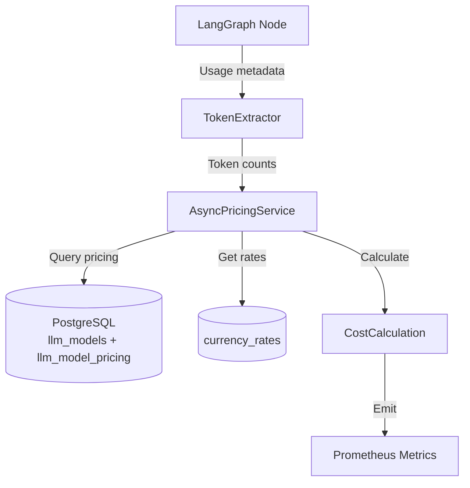
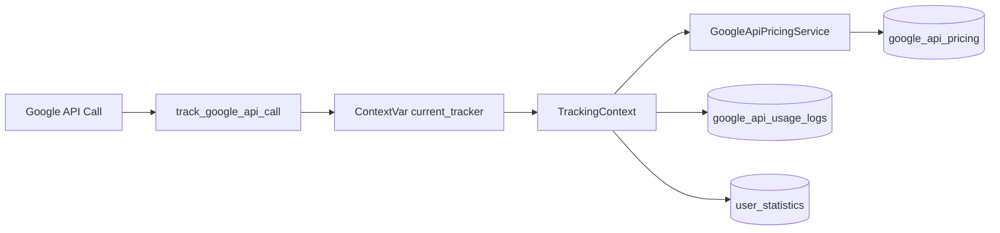

# LLM_PRICING_MANAGEMENT - Gestion des Coûts LLM

> **Documentation complète du système de pricing et token tracking multi-provider**
>
> **Version**: 2.1
> **Date**: 2026-05-05
> **Dernière mise à jour**: v1.19.0 — Catalogue DB-source-of-truth ([ADR-078](../architecture/ADR-078-LLM-Catalogue-DB-Source-Of-Truth.md))
> **Statut**: ✅ Complète

> **🆕 v1.19.0 — Catalogue DB-driven** : la table `llm_model_pricing` n'est plus indexée par une colonne `model_name` libre, mais par une **FK `model_id` sur la nouvelle table `llm_models`** qui porte les capacités (provider + 8 flags : tools, structured output, strict mode, streaming, vision, reasoning, max input/output tokens). `AsyncPricingService._query_model_pricing` joint via `LLMModel.model_name == normalized` puis `selectinload(LLMModelPricing.model)` pour exposer `pricing.model.model_name` à l'appelant. Les capacités sont consommées via le singleton `ModelCapabilitiesCache` (`infrastructure/llm/model_capabilities_cache.py`), invalidé cross-worker via Redis Pub/Sub (ADR-063). Les exemples ci-dessous montrent la structure logique du système ; pour le code de référence à jour, voir [`apps/api/src/domains/llm/pricing_service.py`](../../apps/api/src/domains/llm/pricing_service.py).

---

## 📋 Table des Matières

1. [Vue d'ensemble](#-vue-densemble)
2. [AsyncPricingService](#-asyncpricingservice)
3. [Database Schema](#-database-schema)
4. [Token Tracking](#-token-tracking)
5. [Currency Conversion](#-currency-conversion)
6. [Cost Calculation](#-cost-calculation)
7. [Multi-Provider Support](#-multi-provider-support)
8. [Google API Cost Tracking](#-google-api-cost-tracking)
9. [Export de Consommation](#-export-de-consommation)
9-bis. [Administration en masse par classeur](#-administration-en-masse-par-classeur)
10. [Métriques & Observabilité](#-métriques--observabilité)
11. [Annexes](#-annexes)

---

## 📖 Vue d'ensemble

### Objectif

Le système de pricing LLM permet de:
- **Tracker les tokens** utilisés par node (router, planner, response, agents)
- **Calculer les coûts** en temps réel (USD/EUR)
- **Support multi-provider** (OpenAI, Anthropic, DeepSeek, Perplexity, Ollama)
- **Currency conversion** automatique avec cache
- **Intégration Google API** : tracking des coûts Google Maps Platform (voir [GOOGLE_API_TRACKING.md](./GOOGLE_API_TRACKING.md))
- **Export consommation** : exports CSV détaillés et agrégés pour facturation

### Architecture


```mermaid
graph TB
    Node[LangGraph Node] -->|Usage metadata| Extractor[TokenExtractor]
    Extractor -->|Token counts| Service[AsyncPricingService]
    Service -->|Query pricing| DB[(PostgreSQL<br/>llm_models + llm_model_pricing)]
    Service -->|Get rates| Currency[(currency_rates)]
    Service -->|Calculate| Cost[CostCalculation]
    Cost -->|Emit| Metrics[Prometheus Metrics]
```

### Providers Supportés

| Provider | Models | Pricing Source |
|----------|--------|----------------|
| OpenAI | gpt-6-astra, gpt-6-sol, gpt-6-luna, gpt-5.6-terra, gpt-5.6-sol, gpt-5.6-luna, gpt-4.1-mini, gpt-4.1-nano, o1, o1-mini | Seeded in DB (the 2026-09-23 additions — gpt-6-*, gemini-3.8-flash and four Qwen models — also by migration `f6c2a8e4b0d7`, since production never replays the seed) |
| Anthropic | claude-sonnet-4, claude-opus-4 | Seeded in DB |
| DeepSeek | deepseek-flash, deepseek-v4-pro, deepseek-v4-flash (retired alias), deepseek-chat, deepseek-reasoner | Seeded in DB (deepseek-flash also by migration `e9b5d7f3a2c4`) |
| Perplexity | sonar-pro, sonar-reasoning | Seeded in DB |
| Gemini | gemini-3.8-flash, gemini-3.7-flash, gemini-3.6-flash, gemini-3.5-flash, gemini-3.1-pro-preview | Seeded in DB (gemini-3.8-flash carries the price valid through 2026-12-31; it doubles on 2027-01-01 and must be edited then) |
| Qwen | qwen3.8-max, qwen3.8-flash, qwen3.7-max, qwen3.7-plus, qwen3.7-flash, qwen3.6-plus, qwen3.6-flash, qwen3.5-plus, qwen3.5-flash, qwen3-max | Seeded in DB (Germany (Frankfurt) grid, Global deployment scope, for the models added 2026-09-23 — see [LLM_PROVIDERS.md](./LLM_PROVIDERS.md)) |
| Ollama | * (local models) | Free (0.00) |

---

## 🔧 AsyncPricingService

### Code Complet

**Fichier source**: [apps/api/src/domains/llm/pricing_service.py](../../apps/api/src/domains/llm/pricing_service.py)

```python
from decimal import Decimal
from typing import NamedTuple
from datetime import UTC, datetime
import time

class ModelPrice(NamedTuple):
    """Model pricing information."""
    model_name: str
    input_price: Decimal  # USD per 1M tokens
    cached_input_price: Decimal | None  # Cached tokens (Anthropic)
    output_price: Decimal  # USD per 1M tokens
    effective_from: datetime

class AsyncPricingService:
    """
    Async pricing service with LRU cache.

    Cache TTL: 1 hour (pricing changes infrequently)
    """

    def __init__(self, db: AsyncSession, cache_ttl_seconds: int = 3600):
        self.db = db
        self.cache_ttl = cache_ttl_seconds
        self._cache_timestamp: dict[str, float] = {}
        self._model_price_cache: dict[str, ModelPrice] = {}
        self._currency_rate_cache: dict[str, Decimal] = {}

    async def get_active_model_price(self, model_name: str) -> ModelPrice | None:
        """
        Get active pricing for model (cached).

        Args:
            model_name: e.g., "gpt-4.1-mini", "claude-sonnet-4"

        Returns:
            ModelPrice or None if not found
        """
        cache_key = f"async_model_price_{model_name}"

        # Check cache validity
        if cache_key in self._cache_timestamp:
            age = time.time() - self._cache_timestamp[cache_key]
            if age <= self.cache_ttl and cache_key in self._model_price_cache:
                return self._model_price_cache[cache_key]

        # Query database
        pricing = await self._query_model_pricing(model_name)

        # Cache result
        if pricing:
            self._model_price_cache[cache_key] = pricing
            self._cache_timestamp[cache_key] = time.time()

        return pricing

    async def _query_model_pricing(self, model_name: str) -> ModelPrice | None:
        """Query pricing from database."""
        normalized_model = normalize_model_name(model_name)

        stmt = select(LLMModelPricing).where(
            LLMModelPricing.model_name == normalized_model,
            LLMModelPricing.is_active
        )

        result = await self.db.scalars(stmt)
        pricing = result.first()

        if not pricing:
            logger.warning("model_pricing_not_found", model=model_name)
            return None

        return ModelPrice(
            model_name=pricing.model_name,
            input_price=pricing.input_price_per_million,
            cached_input_price=pricing.cached_input_price_per_million,
            output_price=pricing.output_price_per_million,
            effective_from=pricing.effective_from
        )

    async def get_currency_rate(
        self,
        from_currency: str = "USD",
        to_currency: str = "EUR"
    ) -> Decimal:
        """
        Get currency exchange rate (cached).

        Args:
            from_currency: Source currency (default: USD)
            to_currency: Target currency (default: EUR)

        Returns:
            Exchange rate (e.g., 0.94 for USD->EUR)
        """
        if from_currency == to_currency:
            return Decimal("1.0")

        cache_key = f"async_rate_{from_currency}_{to_currency}"

        # Check cache
        if cache_key in self._cache_timestamp:
            age = time.time() - self._cache_timestamp[cache_key]
            if age <= self.cache_ttl and cache_key in self._currency_rate_cache:
                return self._currency_rate_cache[cache_key]

        # Query database
        stmt = select(CurrencyExchangeRate).where(
            CurrencyExchangeRate.from_currency == from_currency,
            CurrencyExchangeRate.to_currency == to_currency,
            CurrencyExchangeRate.is_active
        )

        result = await self.db.scalars(stmt)
        rate_record = result.first()

        if not rate_record:
            logger.warning("currency_rate_not_found",
                          from_currency=from_currency,
                          to_currency=to_currency)
            return Decimal("1.0")  # Fallback

        # Cache result
        self._currency_rate_cache[cache_key] = rate_record.rate
        self._cache_timestamp[cache_key] = time.time()

        return rate_record.rate

    async def calculate_cost(
        self,
        model_name: str,
        input_tokens: int,
        output_tokens: int,
        cached_tokens: int = 0,
        target_currency: str = "EUR"
    ) -> dict:
        """
        Calculate cost for token usage.

        Args:
            model_name: LLM model
            input_tokens: Input token count
            output_tokens: Output token count
            cached_tokens: Cached input tokens (Anthropic)
            target_currency: Target currency (default: EUR)

        Returns:
            {
                "input_cost_usd": Decimal,
                "output_cost_usd": Decimal,
                "cached_cost_usd": Decimal,
                "total_cost_usd": Decimal,
                "total_cost_target": Decimal,
                "currency": str,
                "exchange_rate": Decimal
            }
        """
        # Get pricing
        price = await self.get_active_model_price(model_name)
        if not price:
            logger.error("pricing_not_available", model=model_name)
            return self._zero_cost_result(target_currency)

        # Calculate USD costs (per million tokens)
        input_cost_usd = (Decimal(input_tokens) / Decimal("1000000")) * price.input_price
        output_cost_usd = (Decimal(output_tokens) / Decimal("1000000")) * price.output_price

        cached_cost_usd = Decimal("0")
        if cached_tokens > 0 and price.cached_input_price:
            cached_cost_usd = (Decimal(cached_tokens) / Decimal("1000000")) * price.cached_input_price

        total_usd = input_cost_usd + output_cost_usd + cached_cost_usd

        # Currency conversion
        rate = await self.get_currency_rate("USD", target_currency)
        total_target = total_usd * rate

        return {
            "input_cost_usd": input_cost_usd,
            "output_cost_usd": output_cost_usd,
            "cached_cost_usd": cached_cost_usd,
            "total_cost_usd": total_usd,
            "total_cost_target": total_target,
            "currency": target_currency,
            "exchange_rate": rate
        }
```

---

## 🗄️ Database Schema

### Tables : llm_models + llm_model_pricing (v1.19.0+)

> Le schéma complet vit dans [`DATABASE_SCHEMA.md`](./DATABASE_SCHEMA.md#9-llm_models). Vue résumée ici pour le contexte pricing.

```sql
-- Catalogue (1 row per model, capabilities + provider)
CREATE TABLE llm_models (
    id UUID PRIMARY KEY DEFAULT gen_random_uuid(),
    model_name VARCHAR(100) NOT NULL UNIQUE,
    provider llm_provider_enum NOT NULL,
    max_input_tokens INTEGER NOT NULL,
    max_output_tokens INTEGER NOT NULL,
    supports_tools BOOLEAN NOT NULL DEFAULT TRUE,
    supports_structured_output BOOLEAN NOT NULL DEFAULT TRUE,
    supports_strict_mode BOOLEAN NOT NULL DEFAULT FALSE,
    supports_streaming BOOLEAN NOT NULL DEFAULT TRUE,
    supports_vision BOOLEAN NOT NULL DEFAULT FALSE,
    is_reasoning_model BOOLEAN NOT NULL DEFAULT FALSE,
    -- v1.20.1+ — model classification; the reasoning columns are what
    -- SURVIVED ADR-245 (v1.32.0): the widget and the budget range are dropped,
    -- the accepted ladder is DERIVED from (provider, model) and this column
    -- may only NARROW it.
    kind llm_model_kind_enum NOT NULL DEFAULT 'chat',
    reasoning_enum_values JSONB,
    reasoning_doc_i18n_key VARCHAR(100),
    -- ADR-244 (v1.32.0) — who filled the capability columns above:
    -- 'declared' (nobody curated), 'imported' (registry-corroborated),
    -- 'verified' (a human edited one through LLMModelService.update)
    capability_provenance llm_capability_provenance_enum NOT NULL DEFAULT 'declared',
    -- v1.20.1+ — per-parameter sampling acceptance (drives admin UI sliders)
    supports_temperature BOOLEAN NOT NULL DEFAULT TRUE,
    supports_top_p BOOLEAN NOT NULL DEFAULT TRUE,
    supports_frequency_penalty BOOLEAN NOT NULL DEFAULT TRUE,
    supports_presence_penalty BOOLEAN NOT NULL DEFAULT TRUE,
    is_active BOOLEAN NOT NULL DEFAULT TRUE,
    created_at TIMESTAMPTZ NOT NULL DEFAULT NOW(),
    updated_at TIMESTAMPTZ NOT NULL DEFAULT NOW()
);

-- Pricing (N rows per model, FK + temporal versioning)
CREATE TABLE llm_model_pricing (
    id UUID PRIMARY KEY DEFAULT gen_random_uuid(),
    model_id UUID NOT NULL REFERENCES llm_models(id) ON DELETE RESTRICT,
    input_price_per_1m_tokens NUMERIC(10, 6) NOT NULL,
    cached_input_price_per_1m_tokens NUMERIC(10, 6),
    output_price_per_1m_tokens NUMERIC(10, 6) NOT NULL,
    -- ADR-223 (2026-08-17): optional UTC windowed tariff (DeepSeek
    -- peak/off-peak). NULL/[] = flat pricing; a window overrides the three
    -- unit prices while active. Resolution: pricing_time_slots.find_active_slot,
    -- consumed by both cost chokepoints via their optional `at` parameter.
    time_slots JSONB,
    effective_from TIMESTAMPTZ NOT NULL DEFAULT NOW(),
    is_active BOOLEAN NOT NULL DEFAULT TRUE,
    created_at TIMESTAMPTZ NOT NULL DEFAULT NOW(),
    updated_at TIMESTAMPTZ NOT NULL DEFAULT NOW(),
    CONSTRAINT uq_pricing_model_effective UNIQUE (model_id, effective_from)
);

-- ADR-228 (2026-08-19): "the" active tariff of a model is an invariant,
-- not a convention. Before this index, 96 of the 114 active models carried
-- two or three active rows and four read paths selected without ORDER BY —
-- two of them could return different prices for the same model at the same
-- instant. Same shape on the rates table, whose duplicates came from a
-- scheduler that inserted without deactivating.
CREATE UNIQUE INDEX uq_llm_model_pricing_active
    ON llm_model_pricing (model_id) WHERE is_active;
CREATE UNIQUE INDEX uq_currency_rate_active
    ON currency_exchange_rates (from_currency, to_currency) WHERE is_active;
```

> Historisation : le versionnement temporel reste inchangé. `get_model_price_at_date`
> trie par `effective_from` et **n'utilise pas** `is_active` — l'index ne contraint
> que la ligne courante, pas l'historique.

Toute lecture d'un tarif ordonne désormais explicitement — nom exact avant nom
normalisé, puis `effective_from DESC, id DESC` — via `resolve_priced_name`
(`src/core/llm_utils.py`), la seule implémentation partagée par le cache et le
service asynchrone.

**Pre-v1.19.0** : la table `llm_model_pricing` portait directement une colonne `model_name` (libre, sans FK). La migration `2026_05_05_0001/2/3` introduit la FK et supprime `model_name` après backfill.

### Seed Data

Les tarifs ne sont pas recopiés ici : une copie dérive (l'exemple qui se tenait à cet
endroit prêtait 2,50 / 10 $ à `gpt-4.1-mini`, qui coûte 0,40 / 1,60 $). La référence est
le bundle `infrastructure/database/seeds/llm_pricing_seed.sql` ; une instance existante
le reçoit par migration, puisque la production ne rejoue jamais le seed, et chaque
migration de tarifs a une garde qui tient les deux sources égales.

**Audit des prix du 2026-09-23** (migration `d5f8b2a6c9e3`, garde
`test_published_price_corrections_guard.py`). Chaque tarif actif des trois tables
(`llm_model_pricing`, `image_generation_pricing`, `google_api_pricing`) a été relu sur la
page de son éditeur. Corrigés :

- `gpt-5.6-sol` portait le prix de `gpt-5.5` (5 / 30 au lieu de 4 / 20) ;
- `deepseek-v4-flash`, nom retiré servi par DeepSeek-V4.1-Flash, est « facturé au prix
  Flash » (même grille, mêmes fenêtres que `deepseek-flash`) ;
- `gemini-3.7-flash` portait son prix Batch, `gemini-3.6-flash` son prix de 2027 : les
  deux valent 0,75 / 0,075 / 3,75 jusqu'au 2026-12-31 ;
- les deux modèles vocaux Gemini facturent le texte en entrée et l'AUDIO en sortie
  (0,50 / 10,00 et 1,00 / 20,00), pas un prix de modèle texte ;
- cinq tarifs de cache Qwen, selon le mode de cache du modèle sur le périmètre Global de
  Francfort : une lecture implicite coûte 20 % du prix d'entrée (`qwen3.7-plus`,
  `qwen3-max`) ; `qwen3.5-flash`, `qwen3.5-plus` et `qwen3.6-plus` n'y ont pas de cache
  implicite (mesuré : aucun jeton en cache sur deux requêtes identiques), leur seule
  lecture possible est explicite, à 10 %. La famille qwen3.8, dont le taux n'est publié
  que dans la console, garde les valeurs du propriétaire ;
- les neuf prix par image de `gpt-image-2` étaient ceux de `gpt-image-1` ;
- Static Street View coûte 7 $ les 1 000, pas 2 $ ; et le SKU Routes dépend de la
  requête (voir [GOOGLE_API.md](./GOOGLE_API.md)).

La migration ne remplace un tarif que s'il porte encore une valeur livrée par LIA : un
prix saisi par un administrateur reste. **Non exprimés, et donc non facturés à leur juste
prix** : les paliers long contexte (OpenAI au-delà de 272K, Gemini au-delà de 200K, les
tranches Qwen), les frais par requête de Perplexity (5 à 14 $ les 1 000 selon la
profondeur de recherche) et les quotas gratuits mensuels de Google Maps. Gemini 3.6, 3.7
et 3.8 Flash doublent le 2027-01-01 : rien ne bascule seul, les tarifs sont à éditer ce
jour-là. Ne figurent plus sur les pages des éditeurs, donc invérifiables et laissés tels
quels : les préversions `gpt-4o-*`, les `codex` et `chat-latest` versionnés, `o1-mini`,
`o3-deep-research`, `o4-mini-deep-research`, `computer-use-preview`, la famille
`gemini-2.0-*`, les préversions Gemini `09-2025`, `gemini-3-pro-preview`,
`gemini-embedding-001` (toujours servi), `text-embedding-004`, `embedding-001` et
`scribe_v1`.

### Table: currency_rates

```sql
CREATE TABLE currency_exchange_rates (
    id UUID PRIMARY KEY DEFAULT uuid_generate_v4(),
    from_currency VARCHAR(3) NOT NULL,  -- 'USD'
    to_currency VARCHAR(3) NOT NULL,    -- 'EUR'
    rate DECIMAL(10, 6) NOT NULL,       -- Exchange rate
    effective_from TIMESTAMP NOT NULL DEFAULT NOW(),
    is_active BOOLEAN DEFAULT TRUE,
    created_at TIMESTAMP DEFAULT NOW(),
    updated_at TIMESTAMP DEFAULT NOW(),
    UNIQUE(from_currency, to_currency, is_active)
);

CREATE INDEX idx_currency_rates_active
    ON currency_exchange_rates(from_currency, to_currency)
    WHERE is_active = TRUE;
```

**Seed Data**:

```python
currency_rates = [
    {
        "from_currency": "USD",
        "to_currency": "EUR",
        "rate": Decimal("0.94"),  # 1 USD = 0.94 EUR (Nov 2025)
        "effective_from": datetime(2025, 11, 5)
    }
]
```

---

## 📗 Administration en masse par classeur

Le catalogue complet — modèles, caractéristiques et tarifs courants, plages
horaires comprises — s'exporte en classeur Excel et se réimporte après édition
hors ligne (ADR-228). Le mécanisme est générique : le domaine ne fournit qu'une
déclaration de colonnes (`domains/llm/pricing_sheet.py`) et un applicateur
(`pricing_import_service.py`) ; le format vit dans `infrastructure/tabular_io/`.

| Aspect | Où |
|---|---|
| Contrat complet, règles d'import, gardes | [`TABULAR_ADMIN_IO.md`](./TABULAR_ADMIN_IO.md) |
| Décision et défauts préexistants corrigés | `docs/architecture/ADR-228-Import-Export-Tabulaire-Administration.md` |
| Endpoints | `GET/POST /admin/llm/pricing/sheet/…` (superuser) |

Deux règles engagent ce document : **un tarif n'est réécrit que s'il a réellement
changé** (sinon un import de 124 lignes créerait 124 versions inutiles dans
l'historique ci-dessus), et **une ligne absente du fichier ne supprime rien** —
le retrait passe par `is_active`, dans les deux sens.

---

## 📊 Token Tracking

### TokenExtractor

**Fichier source**: [apps/api/src/infrastructure/observability/token_extractor.py](../../apps/api/src/infrastructure/observability/token_extractor.py)

```python
class TokenExtractor:
    """Extract token counts from LLM responses (multi-provider)."""

    @staticmethod
    def extract_from_response(response: Any, provider: str) -> dict:
        """
        Extract tokens based on provider format.

        Args:
            response: LLM response object
            provider: 'openai', 'anthropic', etc.

        Returns:
            {
                "input_tokens": int,
                "output_tokens": int,
                "cached_tokens": int,  # Anthropic only
                "total_tokens": int
            }
        """
        if provider == "openai":
            return {
                "input_tokens": response.usage.prompt_tokens,
                "output_tokens": response.usage.completion_tokens,
                "cached_tokens": 0,
                "total_tokens": response.usage.total_tokens
            }

        elif provider == "anthropic":
            usage = response.usage
            return {
                "input_tokens": usage.input_tokens,
                "output_tokens": usage.output_tokens,
                "cached_tokens": getattr(usage, "cache_read_input_tokens", 0),
                "total_tokens": usage.input_tokens + usage.output_tokens
            }

        elif provider in ["deepseek", "perplexity"]:
            return {
                "input_tokens": response.usage.prompt_tokens,
                "output_tokens": response.usage.completion_tokens,
                "cached_tokens": 0,
                "total_tokens": response.usage.total_tokens
            }

        else:
            logger.warning("unknown_provider_for_token_extraction", provider=provider)
            return {
                "input_tokens": 0,
                "output_tokens": 0,
                "cached_tokens": 0,
                "total_tokens": 0
            }
```

### Node-Level Tracking

```python
# Dans chaque node (router, planner, response)
from src.infrastructure.observability.token_extractor import TokenExtractor

async def router_node(state: MessagesState) -> dict:
    """Router node with token tracking."""

    # LLM invocation
    response = await llm.ainvoke(messages)

    # Extract tokens
    tokens = TokenExtractor.extract_from_response(response, provider="openai")

    # Store in state metadata
    return {
        "routing_decision": decision,
        "metadata": {
            "tokens": {
                "router": {
                    "input": tokens["input_tokens"],
                    "output": tokens["output_tokens"],
                    "total": tokens["total_tokens"]
                }
            }
        }
    }
```

### Aggregation

```python
# Calculate total cost for conversation
async def calculate_conversation_cost(
    state: MessagesState,
    pricing_service: AsyncPricingService
) -> dict:
    """Calculate total cost from all nodes."""

    total_input = 0
    total_output = 0
    cost_by_node = {}

    # Aggregate tokens from metadata
    tokens_metadata = state["metadata"].get("tokens", {})

    for node_name, node_tokens in tokens_metadata.items():
        input_tokens = node_tokens.get("input", 0)
        output_tokens = node_tokens.get("output", 0)

        total_input += input_tokens
        total_output += output_tokens

        # Calculate cost for this node
        cost = await pricing_service.calculate_cost(
            model_name="gpt-4.1-mini",  # Or from config
            input_tokens=input_tokens,
            output_tokens=output_tokens,
            target_currency="EUR"
        )

        cost_by_node[node_name] = cost

    # Calculate total
    total_cost = await pricing_service.calculate_cost(
        model_name="gpt-4.1-mini",
        input_tokens=total_input,
        output_tokens=total_output,
        target_currency="EUR"
    )

    return {
        "total_input_tokens": total_input,
        "total_output_tokens": total_output,
        "total_cost_usd": float(total_cost["total_cost_usd"]),
        "total_cost_eur": float(total_cost["total_cost_target"]),
        "cost_by_node": cost_by_node
    }
```

---

## 💱 Currency Conversion

### Scheduled sync (daily)

The USD→EUR rate is synced once a day by the scheduler leader, at
`CURRENCY_SYNC_HOUR`:`CURRENCY_SYNC_MINUTE` UTC (`core/constants.py`), through
[`sync_currency_rates`](../../apps/api/src/infrastructure/scheduler/currency_sync.py):

1. `CurrencyRateService` fetches the live rate (`currency_api_url`, an ECB
   source by default). Nothing is written when it gives none.
2. Only once it has answered, ONE short transaction retires the pair's active
   row and inserts the new one — `replace_active_rate`
   (`domains/llm/currency_rates.py`), shared with `POST /admin/llm/currencies`
   so « exactly one active rate per pair » has one implementation, and no
   transaction stays open across the API call (ADR-304).
3. Committed, `refresh_and_publish_pricing_cache()` rebuilds the pricing cache
   and publishes the ADR-063 invalidation — the admin route does the same.
   The cache converts every cost to euros with the rate it read at its last
   rebuild, and each worker keeps it for its whole life: until 2026-09-23 a
   synced rate reached no worker's costs before that worker restarted.

### CurrencyRateService Resilience (v1.12.1)

The `CurrencyRateService` fetches live exchange rates from `frankfurter.app`. In Docker environments where this external API may be unreachable, the following hardening was applied:

- **Class-level cache**: The rate cache is now shared across all `CurrencyRateService` instances (class attribute) instead of per-instance, so a rate fetched by one caller benefits all others within the same process.
- **Negative-result cache (5-minute TTL)**: When the API is unreachable, the failure is cached for 5 minutes to prevent retry storms on subsequent requests.
- **Reduced retry policy**: Retries reduced from 3 attempts to 2 with shorter backoff, preventing the ~76-second blocking that occurred when `frankfurter.app` was unreachable from Docker.

These changes ensure that currency conversion failures degrade gracefully (falling back to the database-seeded rate) without blocking request processing.

---

## 💰 Cost Calculation

### Time-slot tariffs (ADR-223, 2026-08-17)

Some providers bill text models by UTC time of day — DeepSeek charges its
peak windows (01:00–04:00 and 06:00–10:00 UTC) at exactly twice the
off-peak rate. When a pricing row carries `time_slots`, both cost
chokepoints resolve the window active at the **billing instant** through
the single implementation (module `src.domains.llm.pricing_time_slots`):

- `get_cached_cost_usd_eur(..., at=None)` (sync, hot path) and
  `AsyncPricingService.calculate_token_cost(..., at=None)` default to
  now (UTC) — the call instant, which is also the instant persisted with
  `TokenUsageLog`, so the ledger matches the provider invoice;
- `calculate_token_cost_at_date` resolves at the historical `at_date`
  with the pricing row effective at that date — a peak-hour message keeps
  its peak cost when recomputed later.

A window overrides all three unit prices; outside every window the base
columns apply. Admins manage the windows in the LLM pricing dialog
(toggle « time-based pricing (UTC) », visible for `per_1m_tokens` rows
only); on update, an omitted `time_slots` field inherits the current
row's windows onto the new temporal version and `[]` clears them.

**A window may apply on some days only** (ADR-223 amendment, 2026-09-23):
DeepSeek bills its peak windows Monday to Friday, weekends being off-peak
all day. `weekdays` lists the ISO weekdays (1 = Monday … 7 = Sunday) of the
UTC day the window STARTS on — a window running past midnight belongs to the
day it opened, Sunday's into Monday. No `weekdays` means every day, the shape
of every row stored before days existed (the key is not written). Resolution
and the overlap check run on the 10 080-minute week, so the same hours on
disjoint days are two tariffs, not an overlap. The dialog gives each window
the shared weekday toggles (every day / weekdays / weekend in one press), and
the pricing workbook carries a `weekdays` column (format v4). Chinese public
holidays are not expressed: they stay priced at peak, an overestimate.

**A worker rebuilds its prices from the database at startup.** It keeps them
in memory for its whole life, and the Redis blob it used to start from could
predate a deploy's pricing migration (measured 2026-09-23: after the weekday
migration, a restarted dev API kept billing Saturday peak hours at double
from a 47-minute-old blob). Only the cross-worker invalidation (ADR-063)
adopts the blob, which the writing worker has just republished. A startup
whose database read fails adopts the published blob rather than nothing: an
older tariff prices better than zero for the worker's whole life.

**Every tariff writer tells every worker.** Creating, updating or
deactivating a tariff, importing the workbook, the explicit cache reload and
both writers of the USD→EUR rate (the admin route and the daily sync — the
cache converts every cost to euros with it) call
`refresh_and_publish_pricing_cache()` once committed: rebuild from the
database, then publish the ADR-063 invalidation — never after a failed
rebuild, which would make the other workers adopt a blob that says nothing
new. Until 2026-09-23 these writers only rebuilt their OWN worker: under
`WEB_CONCURRENCY=4` an edited tariff reached one worker in four, and the
three others billed the old prices until they restarted. The reload no longer
empties the local copy first, so a rebuild that fails leaves the worker on
its previous prices instead of billing every call at zero.

### Exemples

**Exemple 1: Simple call**

```python
# Single LLM call cost
cost = await pricing_service.calculate_cost(
    model_name="gpt-4.1-mini",
    input_tokens=1500,
    output_tokens=500,
    target_currency="EUR"
)

# Result:
# {
#   "input_cost_usd": Decimal("0.00375"),    # 1500 / 1M * $2.50
#   "output_cost_usd": Decimal("0.005"),     # 500 / 1M * $10.00
#   "cached_cost_usd": Decimal("0"),
#   "total_cost_usd": Decimal("0.00875"),
#   "total_cost_target": Decimal("0.008225"),  # 0.00875 * 0.94
#   "currency": "EUR",
#   "exchange_rate": Decimal("0.94")
# }
```

**Exemple 2: Conversation complète**

```python
# Total conversation cost (all nodes)
conversation_cost = await calculate_conversation_cost(state, pricing_service)

# Result:
# {
#   "total_input_tokens": 12450,
#   "total_output_tokens": 3820,
#   "total_cost_usd": 0.06935,
#   "total_cost_eur": 0.06519,
#   "cost_by_node": {
#       "router": {"total_cost_usd": 0.00125, ...},
#       "planner": {"total_cost_usd": 0.01245, ...},
#       "response": {"total_cost_usd": 0.05565, ...}
#   }
# }
```

---

## 🌐 Multi-Provider Support

### Provider Pricing Matrix

Pas de copie des prix ici (voir [Seed Data](#seed-data)) : la grille de chaque fournisseur
est dans le bundle de référence et dans l'écran d'administration des tarifs, où chaque
ligne dit sa date d'effet. Les règles qui NE sont PAS des prix vivent dans le code : le
supplément d'écriture de cache (`CachedModelPrice.cache_write_multiplier`, ADR-306), les
fenêtres horaires (ADR-223) et les prix audio des modèles live (ADR-300).

### Model Selection Strategy

```python
# Cost-optimized model selection
def select_model_for_task(task_complexity: str) -> str:
    """Select most cost-effective model for task."""

    if task_complexity == "simple":
        # Use cheapest model
        return "gpt-4.1-mini-mini"  # $0.15/$0.60

    elif task_complexity == "medium":
        # Balance cost/quality
        return "deepseek-chat"  # $0.14/$0.28 (cheaper than gpt-4.1-mini-mini for output)

    elif task_complexity == "complex":
        # Use best model
        return "gpt-4.1-mini"  # $2.50/$10.00

    elif task_complexity == "reasoning":
        # Use reasoning model
        return "o1-mini"  # $3.00/$12.00 (cheaper than o1)

    else:
        return "gpt-4.1-mini"  # Default
```

---

## 📊 Métriques & Observabilité

### Prometheus Metrics

```python
from prometheus_client import Counter, Histogram

# Token usage
llm_tokens_consumed_total = Counter(
    'llm_tokens_consumed_total',
    'Total tokens used',
    ['provider', 'model', 'type', 'node']  # type=input|output|cached
)

# Cost tracking
llm_cost_total = Counter(
    'llm_cost_total',
    'Total cost in USD',
    ['provider', 'model', 'node']
)

llm_cost_eur_total = Counter(
    'llm_cost_eur_total',
    'Total cost in EUR',
    ['provider', 'model', 'node']
)

# Per-call histogram
llm_tokens_per_call = Histogram(
    'llm_tokens_per_call',
    'Tokens per LLM call',
    ['provider', 'model', 'node'],
    buckets=[100, 500, 1000, 5000, 10000, 50000]
)

# Emit metrics
llm_tokens_consumed_total.labels(
    provider="openai",
    model="gpt-4.1-mini",
    type="input",
    node="router"
).inc(1500)

llm_cost_total.labels(
    provider="openai",
    model="gpt-4.1-mini",
    node="router"
).inc(0.00375)
```

### Grafana Dashboard "LLM Tokens & Cost"

**Panel 1**: Token usage over time
```promql
rate(llm_tokens_consumed_total[5m]) by (model, node)
```

**Panel 2**: Cost breakdown per provider
```promql
sum(rate(llm_cost_total[1h])) by (provider)
```

**Panel 3**: Cost per conversation (average)
```promql
avg(llm_cost_eur_total) by (model)
```

**Panel 4**: Top expensive models
```promql
topk(5, sum(llm_cost_total) by (model))
```

---

## 🌐 Google API Cost Tracking

Le système de coûts a été étendu pour inclure les APIs Google Maps Platform.

### Architecture

Le tracking Google API utilise un pattern similaire au tracking LLM :


```mermaid
graph LR
    A[Google API Call] --> B[track_google_api_call]
    B --> C[ContextVar current_tracker]
    C --> D[TrackingContext]
    D --> E[GoogleApiPricingService]
    E --> F[(google_api_pricing)]
    D --> G[(google_api_usage_logs)]
    D --> H[(user_statistics)]
```

### Différences avec LLM Tracking

| Aspect | LLM Tracking | Google API Tracking |
|--------|--------------|---------------------|
| Unité de facturation | Tokens | Requêtes |
| Granularité | Par node | Par endpoint |
| Cache | Cache LLM (prompts) | Cache applicatif (résultats) |
| Coûts | Par million de tokens | Par 1000 requêtes |

### Référence Complète

Voir [GOOGLE_API_TRACKING.md](./GOOGLE_API_TRACKING.md) pour la documentation détaillée.

---

## 📤 Export de Consommation

### Shared Export Service (v1.9.1)

Export logic is centralized in `src/domains/google_api/export_service.py` with three reusable functions used by both admin and user endpoints. See [GOOGLE_API_TRACKING.md](./GOOGLE_API_TRACKING.md#-export-de-consommation) for full details.

### Admin Endpoints (Superuser Only)

| Endpoint | Description |
|----------|-------------|
| `GET /admin/google-api/export/token-usage` | Detailed LLM export (all users or filtered) |
| `GET /admin/google-api/export/google-api-usage` | Detailed Google API export |
| `GET /admin/google-api/export/consumption-summary` | Per-user aggregation |

Filters: `start_date`, `end_date`, `user_id` (optional).

### User Endpoints (v1.9.1)

| Endpoint | Description |
|----------|-------------|
| `GET /usage/export/token-usage` | User's own LLM token usage |
| `GET /usage/export/google-api-usage` | User's own Google API usage |
| `GET /usage/export/consumption-summary` | User's own aggregated summary |

Filters: `start_date`, `end_date`. Security: `user_id` forced server-side to `current_user.id`.

### Format CSV Summary

```csv
user_email,total_prompt_tokens,total_completion_tokens,total_cached_tokens,total_llm_calls,total_llm_cost_eur,total_google_requests,total_google_cost_eur,total_cost_eur
user@example.com,125000,45000,80000,150,1.234567,25,0.456789,1.691356
```

### Interface Frontend

- **ConsumptionExportSection** (v1.9.1): Shared dual-mode component (`mode: 'admin' | 'user'`). Admin mode shows user filter with autocomplete; user mode shows date filters only.
- **AdminConsumptionExportSection**: Thin wrapper calling `ConsumptionExportSection` with `mode="admin"`.
- **AdminGoogleApiPricingSection**: CRUD pricing Google API with cache reload. Cross-worker invalidation via Redis Pub/Sub (ADR-063).

---

## 📚 Annexes

### Configuration

```bash
# .env

# Currency API
CURRENCY_API_KEY=your_api_key
CURRENCY_API_URL=https://api.exchangerate-api.com/v4/latest/USD

# Celery (for scheduled tasks)
CELERY_BROKER_URL=redis://localhost:6379/0
CELERY_RESULT_BACKEND=redis://localhost:6379/0
```

### Migration Script

```bash
# Seed pricing data
alembic upgrade head

# Verify
psql -d lia -c "SELECT model_name, input_price_per_million, output_price_per_million FROM llm_pricing WHERE is_active = TRUE;"
```

### Troubleshooting

**Problème**: Pricing not found for model

```python
# Check if model seeded
async with db:
    pricing = await db.scalars(
        select(LLMModelPricing).where(
            LLMModelPricing.model_name == "gpt-4.1-mini",
            LLMModelPricing.is_active
        )
    )
    print(pricing.first())
```

**Solution**: Run seed migration

```bash
alembic upgrade head
```

---

## Références

| Document | Description |
|----------|-------------|
| [GOOGLE_API_TRACKING.md](./GOOGLE_API_TRACKING.md) | Tracking détaillé Google Maps Platform |
| [TOKEN_TRACKING_AND_COUNTING.md](./TOKEN_TRACKING_AND_COUNTING.md) | Architecture token tracking |
| [DATABASE_SCHEMA.md](./DATABASE_SCHEMA.md) | Schema PostgreSQL complet |
| [OBSERVABILITY_AGENTS.md](./OBSERVABILITY_AGENTS.md) | Métriques Prometheus |

---

**Fin de LLM_PRICING_MANAGEMENT.md**

*Document mis à jour le 2026-02-04 - Ajout Google API tracking et exports consommation*
