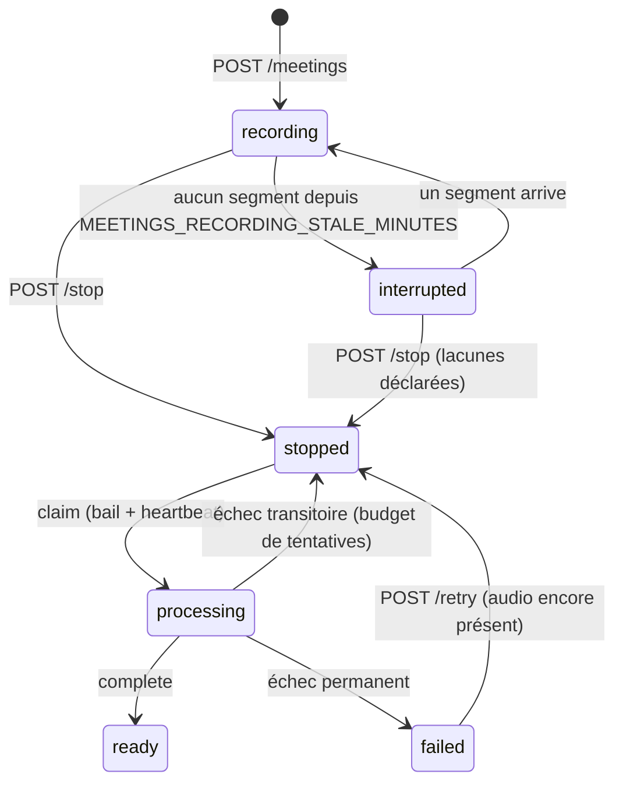

# Réunions — enregistrement et comptes rendus structurés (ADR-258)

> Décision : [ADR-258](../architecture/ADR-258-Meeting-Recording-And-Structured-Minutes.md).
> Spécification et mesures : `docs/superpowers/specs/2026-09-02-meeting-recording-and-minutes-design.md`.

Depuis le bouton « + » du composeur (celui qui ajoutait déjà un fichier), l'utilisateur
enregistre une réunion (téléphone ou ordinateur comme micro). À l'arrêt, le serveur transcrit l'ensemble, rédige un
compte rendu selon **la structure de l'utilisateur** (modèle par utilisateur),
l'indexe dans l'espace de connaissances « Réunions », le notifie dans le chat,
l'envoie par e-mail si demandé et le propose en PDF.

## Domaine backend — `apps/api/src/domains/meetings/`

| Module | Rôle |
|---|---|
| `models.py` | `meetings` (la ligne EST le job durable, ADR-129), `meeting_templates`, `meeting_preferences` |
| `repository.py` | chaque transition = un `UPDATE … WHERE status = …` atomique ; bail, heartbeat, tentatives |
| `service.py` | démarrage (moteur résolu, bornes publiées), segments, arrêt (lacunes → 409 `segments_missing`), édition, livraison |
| `audio_store.py` | un fichier par séquence (4 workers), assemblage puis normalisation Opus par ffmpeg sous le plafond distant |
| `engine.py` | `resolve_engine` : slot admin → ordre de repli → moteur local ; rien ne touche le réseau |
| `transcription.py` | fichier entier chez ElevenLabs/OpenAI, ou blocs PCM de 600 s dans le Whisper local sans plafond ; un modèle sans tarif administré stocke un coût `null`, jamais `0.0` |
| `synthesis.py` | un appel structuré sur le slot `meeting_synthesis`, condensation par parties si la fenêtre déborde, `repair_report` |
| `render.py` | UN sérialiseur : Markdown (espace RAG), contenu sectionné (PDF via ADR-226), HTML (e-mail) |
| `indexing.py` | espace trouvé par RÔLE (`rag_spaces.kind='meetings'`), un document RAG par réunion réécrit en place — et supprimé (morceaux, ligne, fichier) avec la réunion : l'espace est une projection, jamais une seconde copie |
| `processing.py` | le job : claim → normalisation → transcription → enrichissement → synthèse → `ready` → index/notification/e-mail/purge (ces effets sont gardés : un échec après `ready` est journalisé, jamais requalifié en échec de la réunion) |
| `enrichment.py` | événement d'agenda chevauchant (indice, jamais un fait) et libellé du lieu, en mode meilleur effort |
| `delivery.py` | PDF et e-mail via le connecteur e-mail actif de l'utilisateur |
| `reapers.py` | enregistrements muets → `interrupted`, baux expirés → `stopped`, orphelins relancés, audio conservé purgé |

Réglages : `apps/api/src/core/config/meetings.py` (`MEETINGS_*`, voir `.env.example` §87).
Prompts : `prompts/v1/meeting_synthesis_prompt.txt`, `prompts/v1/meeting_condense_prompt.txt`.
Capacité plateforme : `PlatformCapability.MEETINGS` (routes fermées par l'interrupteur admin).
Métriques : `infrastructure/observability/metrics_meetings.py`, tableau Grafana `27-meetings.json`.

### Cycle de vie

### Chaîne de moteurs

1. le fournisseur du slot admin `voice_transcription` s'il a une clé ;
2. l'ordre de repli `STT_PROVIDER_FALLBACK_ORDER` (ElevenLabs Scribe, OpenAI `gpt-4o-transcribe-diarize`) ;
3. le Whisper local si `VOICE_STT_ENABLED` — sans plafond de durée, fenêtres VAD Silero ≤ 20 s
   (`voice/stt/long_audio.py`), sans séparation des interlocuteurs.

La préférence utilisateur `remote` refuse le repli local ; `local` n'appelle jamais un
fournisseur. **La chaîne est reparcourue au traitement** (`transcribe_with_fallback`) : un
code permanent d'UN fournisseur (`PERMANENT_STT_CODES` : clé refusée, fichier trop gros)
passe au moteur suivant dans la préférence de l'utilisateur ; seuls `no_speech` et les
pannes transitoires (budget de tentatives du job) arrêtent le parcours. Mesuré le
2026-09-03 : l'instance dev stocke un ID de clé ElevenLabs, chaque réunion aurait échoué
alors qu'une clé OpenAI était disponible.

## Frontend — `apps/web/src/`

| Élément | Fichier |
|---|---|
| Machine à états du recorder (testée sous fakes) | `lib/meetings/recorder-controller.ts` |
| Sources audio (Opus `MediaRecorder` / PCM worklet partagé) | `lib/meetings/audio-source.ts`, `lib/audio/pcm-worklet.ts` |
| Choix du format (PCM imposé sur Apple) | `lib/meetings/audio-format.ts` |
| File d'envoi ordonnée, reprise, hors-ligne | `lib/meetings/segment-uploader.ts` |
| Garde du silence, verrou d'écran | `lib/meetings/silence-watchdog.ts`, `lib/wake-lock.ts` |
| Store (persisté pour Reprendre / Finaliser / Abandonner) | `stores/meetingRecorderStore.ts` |
| Fournisseur + bannière dans la mise en page du tableau de bord | `components/meetings/MeetingRecorderProvider.tsx`, `MeetingRecordingBanner.tsx` |
| Entrée du composeur (menu du bouton « + », 44 px sur téléphone) | `components/chat/ChatInput.tsx` (`meetingsEnabled`) |
| Destination « Réunions » de l'en-tête (entre Relations et Alertes, seulement si l'instance active la fonction) | `lib/dashboard-nav.ts` (`visibleDestinations`), `app/[lng]/dashboard/layout.tsx`, `components/dashboard/MobileNavMenu.tsx` |
| Pages | `app/[lng]/dashboard/meetings/`, `[id]/` |
| Section de réglages (préférences, modèle, réunions récentes) | `components/settings/MeetingsSettings.tsx` (jeton `meetings`) |
| Carte du chat « compte rendu prêt » | `components/meetings/MeetingMinutesCard.tsx` (`proactive_meeting`) |

Le PWA : le verrou d'écran est demandé pendant la capture et la bannière rappelle de garder
LIA au premier plan — un téléphone en arrière-plan coupe le micro sur les deux plateformes
(mesuré, voir les guides mobiles). Une perte de connectivité met les segments en attente sans
jamais les perdre tant que la page vit ; un rechargement revient en `interrupted`.

Trois règles du recorder qui ne sont pas des détails :

- **Le plafond côté serveur est un arrêt, pas une panne.** Un onglet ralenti qui rate le plafond
  client reçoit 413 `duration_cap_reached` sur le segment de trop ; la file d'envoi se déclare
  « réglée » à la séquence refusée et l'arrêt déclare exactement ce que le serveur détient — aucune
  lacune inventée.
- **Une réunion adoptée depuis un autre appareil ne reprend que dans le même conteneur** : les
  segments d'une réunion sont homogènes (un seul remux ffmpeg) ; PCM reprend partout, un Opus
  démarré ailleurs reprend seulement si ce navigateur choisit le même conteneur, sinon
  `format_unavailable` et il reste Finaliser / Abandonner.
- **Le contexte React ne publie que l'état grossier** (`MeetingRecorderContextValue`) : le niveau
  du vumètre et les compteurs changent plusieurs fois par seconde et n'appartiennent qu'à la
  bannière ; le composeur ne se re-rend pas à cette cadence pendant deux heures de réunion (testé).

## Ce que la réunion coûte, et où ça se voit

Deux unités payantes : l'audio chez le moteur de transcription et les tokens du modèle de
synthèse (passes de condensation et régénérations comprises). Les deux rejoignent la
comptabilité de la plateforme comme tout autre échange — l'audio par les statistiques STT
distantes, les tokens par `track_proactive_tokens` sous un `run_id` que le message archivé
porte (la jointure avec `token_usage_logs` fonctionne comme pour toute notification
proactive). La ligne `meetings` garde la dépense propre au compte rendu (`synthesis_model`,
`synthesis_tokens_*`, `synthesis_cost_eur`, cumulés à chaque régénération) ; la page
affiche le total exact et sa décomposition, la liste le total, la carte du chat les deux
unités et leur somme quand l'utilisateur affiche les coûts. Un modèle sans tarif administré
donne `null`, jamais zéro (ADR-185 : un montant est exact ou absent). Les tarifs des deux moteurs STT
OpenAI sont livrés par la migration `seed_meetings_stt_pricing` (la production ne rejoue pas le lot de
seeds) : catalogue inséré seulement si inconnu, tarif seulement si aucun n'est actif — jamais par-dessus
un prix administré ; `test_meetings_stt_pricing_migration_guard.py` tient migration et seed égaux.

## Ce que le compte rendu affirme

- **Les bornes sont publiées** avec la réponse de démarrage (`limits`) : cadence des
  segments, taille maximale, durée maximale, délai du rappel de silence.
- **Les comptes sont exacts** (ADR-185) : total de la liste, participants, actions.
- **Une lacune est dite**, jamais comblée : `audio_gaps` porte le nombre de segments
  manquants et le prompt interdit d'inventer entre deux morceaux.
- **Les interlocuteurs sont `S1…Sn`**, stables d'un fournisseur à l'autre ; un nom n'apparaît
  que si la transcription l'établit, et l'utilisateur peut les nommer en éditant.
