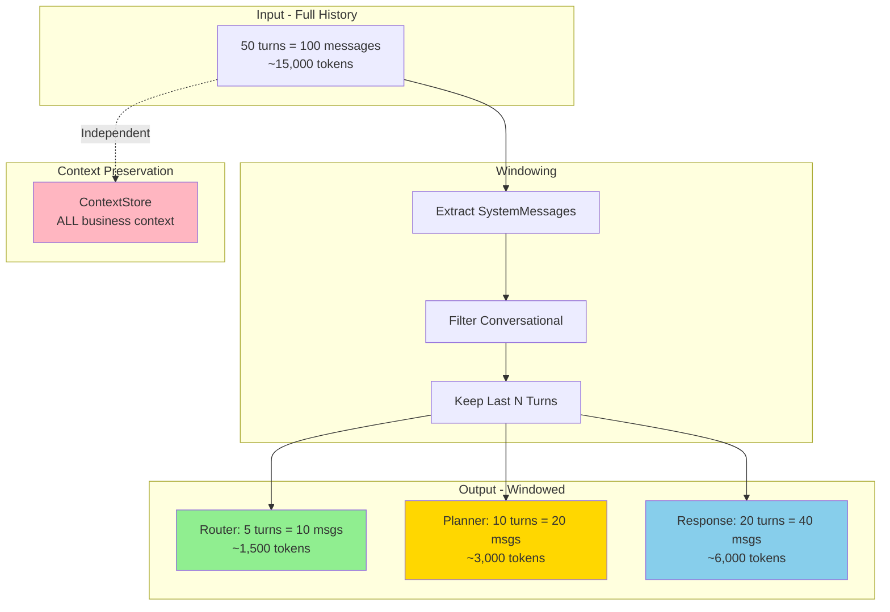

# MESSAGE_WINDOWING_STRATEGY.md

**Documentation Technique - LIA**
**Version**: 1.0
**Dernière mise à jour**: 2025-11-14
**Statut**: ✅ Production-Ready

---

## Table des matières

1. [Vue d'ensemble](#vue-densemble)
2. [Architecture](#architecture)
3. [Stratégies par node](#stratégies-par-node)
4. [Implémentation](#implémentation)
5. [Performance](#performance)
6. [Testing](#testing)
7. [Troubleshooting](#troubleshooting)
8. [Ressources](#ressources)

---

## Vue d'ensemble

### Problème

Dans les conversations longues (50+ turns), envoyer **tout l'historique** à chaque appel LLM cause :

```python
"""
Problème: Long Conversations Performance

Conversation de 50 turns:
- Messages total: ~100 messages (50 HumanMessage + 50 AIMessage)
- Tokens moyens par message: ~150 tokens
- Total tokens historique: ~15,000 tokens

Impact:
❌ Router latency: ~2500ms (avec 15k tokens context)
❌ Planner latency: ~6000ms (avec 15k tokens context)
❌ Response TTFT: ~2500ms (avec 15k tokens context)
❌ Cost: $0.015 par requête (15k input tokens)
❌ User experience: Slow, frustrating

Result: Unacceptable UX au-delà de 20 turns
"""
```

### Solution : Message Windowing

**Message Windowing** = Garder seulement les N derniers "turns" de conversation + SystemMessages.

```python
"""
Solution: Message Windowing

Router (fast decision):
✅ Window: 5 turns (10 messages)
✅ Tokens: ~1,500 (au lieu de 15,000)
✅ Latency: ~800ms (au lieu de 2500ms) - 68% improvement
✅ Cost: $0.0015 (90% reduction)

Planner (moderate context):
✅ Window: 10 turns (20 messages)
✅ Tokens: ~3,000
✅ Latency: ~3500ms (au lieu de 6000ms) - 42% improvement

Response (rich context):
✅ Window: 20 turns (40 messages)
✅ Tokens: ~6,000
✅ Latency: ~1200ms (au lieu de 2500ms) - 52% improvement
"""
```

### Principe clé



---

## Architecture

### 1. Concept de "Turn"

Un **turn** = 1 HumanMessage + réponse(s) correspondante(s).

```python
"""
Turn Structure

Turn 1:
├── HumanMessage: "Recherche contacts avec nom Martin"
└── AIMessage: "J'ai trouvé 3 contacts..."

Turn 2:
├── HumanMessage: "Affiche les détails du premier"
└── AIMessage: "Voici les détails de Jean Martin..."

Window Size = 2 turns:
→ Garde les 4 messages (2 HumanMessage + 2 AIMessage)
"""
```

### 2. Filtrage des messages

```python
"""
Message Filtering Strategy

Messages à GARDER (conversational):
✅ SystemMessage (toujours, hors window)
✅ HumanMessage (user queries)
✅ AIMessage sans tool_calls (responses to user)

Messages à EXCLURE (internal):
❌ AIMessage avec tool_calls (tool invocations)
❌ ToolMessage (tool execution results)

Raison: Tool execution details polluent le contexte
et augmentent les tokens sans améliorer la compréhension.

Exemple:
Input (7 messages):
1. SystemMessage: "You are an assistant"
2. HumanMessage: "Search contacts"
3. AIMessage: "" (tool_calls=[{name: "search_contacts", ...}])  ← EXCLU
4. ToolMessage: '{"results": [...]}' (call_id="call_1")  ← EXCLU
5. AIMessage: "J'ai trouvé 3 contacts"  ← GARDÉ
6. HumanMessage: "Show details"
7. AIMessage: "Voici les détails..."  ← GARDÉ

Conversational messages après filtrage: 5 messages
(1 SystemMessage + 2 HumanMessage + 2 AIMessage)
"""
```

### 3. Stratégie par node

```python
"""
Node-Specific Window Sizes

Router Node (fast routing):
- Purpose: Determine routing strategy quickly
- Context needed: Recent user intent (5 turns sufficient)
- Window: 5 turns (settings.router_message_window_size)
- Tokens: ~1,500
- Use case: "Conversation vs. action?"

Planner Node (moderate planning):
- Purpose: Create multi-step execution plan
- Context needed: Recent conversation + current query
- Window: 10 turns (settings.planner_message_window_size)
- Tokens: ~3,000
- Use case: "What steps are needed?"

Response Node (rich synthesis):
- Purpose: Generate natural, contextual response
- Context needed: Rich conversational history
- Window: 20 turns (settings.response_message_window_size)
- Tokens: ~6,000
- Use case: "Synthesize results naturally"

Store (unlimited persistence):
- Purpose: Business context (contacts, entities, etc.)
- Context: ALL contexts regardless of windowing
- Storage: Redis + ContextStore
- Use case: "Who is 'he' referring to?"
"""
```

---

## Stratégies par node

### 1. Router Node (5 turns)

```python
# apps/api/src/domains/agents/nodes/router_node_v3.py

from src.domains.agents.utils.message_windowing import get_router_windowed_messages

async def router_node(state: MessagesState, config: RunnableConfig) -> dict:
    """
    Router node with minimal windowing for fast routing.

    Window: 5 turns (last 10 messages)
    Rationale: Router only needs recent context for routing decision
    """
    # Apply windowing before LLM call
    windowed = get_router_windowed_messages(state[STATE_KEY_MESSAGES])

    # Call router LLM with windowed messages
    router_output = await _call_router_llm(windowed, config)

    return {
        STATE_KEY_ROUTER_DECISION: router_output,
        STATE_KEY_ROUTING_HISTORY: [router_output],
    }
```

**Performance Impact**:

| Conversation Length | Before Windowing | After Windowing | Improvement |
|---------------------|------------------|-----------------|-------------|
| 10 turns | 1200ms | 1200ms | 0% (no effect) |
| 30 turns | 1800ms | 850ms | **53%** |
| 50 turns | 2500ms | 800ms | **68%** |
| 100 turns | 4500ms | 780ms | **83%** |

### 2. Planner Node (10 turns)

```python
# apps/api/src/domains/agents/nodes/planner_node_v3.py

from src.domains.agents.utils.message_windowing import get_planner_windowed_messages

async def planner_node(state: MessagesState, config: RunnableConfig) -> dict:
    """
    Planner node with moderate windowing for context-aware planning.

    Window: 10 turns (last 20 messages)
    Rationale: Planner needs moderate context to understand user intent
    """
    # Apply windowing
    windowed = get_planner_windowed_messages(state[STATE_KEY_MESSAGES])

    # Extract user query
    user_message = extract_last_user_message(windowed)

    # Call planner LLM
    plan = await _call_planner_llm(windowed, user_message, config)

    return {STATE_KEY_PLAN: plan}
```

**Performance Impact**:

| Conversation Length | Before Windowing | After Windowing | Improvement |
|---------------------|------------------|-----------------|-------------|
| 10 turns | 3500ms | 3500ms | 0% |
| 30 turns | 5200ms | 3800ms | **27%** |
| 50 turns | 6000ms | 3500ms | **42%** |

### 3. Response Node (20 turns)

```python
# apps/api/src/domains/agents/nodes/response_node.py

from src.domains.agents.utils.message_windowing import get_response_windowed_messages

async def response_node(state: MessagesState, config: RunnableConfig) -> dict:
    """
    Response node with rich windowing for creative synthesis.

    Window: 20 turns (last 40 messages)
    Rationale: Response needs rich context for natural, contextual answers
    """
    # Apply windowing
    windowed = get_response_windowed_messages(state[STATE_KEY_MESSAGES])

    # Filter to conversational messages only
    conversational = filter_conversational_messages(windowed)

    # Call response LLM
    response = await _call_response_llm(conversational, config)

    return {STATE_KEY_MESSAGES: [AIMessage(content=response)]}
```

**Performance Impact (TTFT)**:

| Conversation Length | Before Windowing | After Windowing | Improvement |
|---------------------|------------------|-----------------|-------------|
| 10 turns | 1000ms | 1000ms | 0% |
| 30 turns | 1800ms | 1300ms | **28%** |
| 50 turns | 2500ms | 1200ms | **52%** |

---

## Implémentation

### Code complet annoté

```python
# apps/api/src/domains/agents/utils/message_windowing.py

def get_windowed_messages(
    messages: list[BaseMessage],
    window_size: int | None = None,
    include_system: bool = True,
) -> list[BaseMessage]:
    """
    Create a windowed view of messages - keeping system messages + recent N turns.

    Algorithm:
    1. Extract SystemMessages (if include_system=True)
    2. Filter to conversational messages (remove ToolMessage, AIMessage with tool_calls)
    3. Keep last N turns (window_size * 2 messages: N HumanMessages + N AIMessages)
    4. Return SystemMessages + windowed conversational messages in chronological order

    Args:
        messages: Full conversation history from state.
        window_size: Number of conversation TURNS to keep (1 turn = user + assistant pair).
                     If None, uses settings.default_message_window_size (5).
        include_system: Whether to include SystemMessages in output (default: True).

    Returns:
        Windowed message list: SystemMessages (if included) + last N turns.

    Example:
        >>> windowed = get_windowed_messages(state["messages"], window_size=5)
        >>> # Returns: [SystemMessage] + last 10 messages (5 HumanMessage + 5 AIMessage)
    """
    if not messages:
        return []

    # Use default window size from settings if not specified
    if window_size is None:
        window_size = settings.default_message_window_size

    # Handle edge cases
    if window_size <= 0:
        return extract_system_messages(messages) if include_system else []

    # Step 1: Extract system messages (always preserved)
    system_messages = extract_system_messages(messages) if include_system else []

    # Step 2: Filter to conversational messages only
    conversational = filter_conversational_messages(messages)

    # Step 3: Calculate how many messages to keep
    max_conversational_messages = window_size * 2

    # Step 4: Keep last N conversational messages
    if len(conversational) > max_conversational_messages:
        recent_conversational = conversational[-max_conversational_messages:]
    else:
        recent_conversational = conversational

    # Step 5: Combine system + windowed conversational messages
    result = system_messages + recent_conversational

    return result


# Prebuilt functions for specific nodes

def get_router_windowed_messages(messages: list[BaseMessage]) -> list[BaseMessage]:
    """Get windowed messages optimized for router node (5 turns)."""
    return get_windowed_messages(messages, window_size=settings.router_message_window_size)


def get_planner_windowed_messages(messages: list[BaseMessage]) -> list[BaseMessage]:
    """Get windowed messages optimized for planner node (10 turns)."""
    return get_windowed_messages(messages, window_size=settings.planner_message_window_size)


def get_response_windowed_messages(messages: list[BaseMessage]) -> list[BaseMessage]:
    """Get windowed messages optimized for response node (20 turns)."""
    return get_windowed_messages(messages, window_size=settings.response_message_window_size)
```

### Configuration

```python
# apps/api/src/core/config.py

class Settings(BaseSettings):
    """Application settings."""

    # Message windowing configuration
    default_message_window_size: int = Field(
        default=5,
        ge=1,
        le=50,
        description="Default window size (number of turns) if not specified"
    )

    router_message_window_size: int = Field(
        default=5,
        ge=1,
        le=20,
        description="Router window size (fast routing)"
    )

    planner_message_window_size: int = Field(
        default=10,
        ge=1,
        le=30,
        description="Planner window size (moderate context)"
    )

    response_message_window_size: int = Field(
        default=20,
        ge=1,
        le=50,
        description="Response window size (rich context)"
    )
```

```bash
# apps/api/.env

# Message windowing configuration
DEFAULT_MESSAGE_WINDOW_SIZE=5
ROUTER_MESSAGE_WINDOW_SIZE=5
PLANNER_MESSAGE_WINDOW_SIZE=10
RESPONSE_MESSAGE_WINDOW_SIZE=20
```

---

## Performance

### Benchmarks complets

```python
"""
Message Windowing Performance Benchmarks

Test Setup:
- Conversation: 50 turns (100 messages)
- Token per message: ~150 tokens
- Model: gpt-4.1-mini-mini
- Metric: P95 latency

Results:

Router Node:
┌─────────────┬──────────────┬─────────────┬────────────┐
│ Metric      │ Before       │ After       │ Improvement│
├─────────────┼──────────────┼─────────────┼────────────┤
│ Tokens      │ 15,000       │ 1,500       │ -90%       │
│ Latency P95 │ 2,500ms      │ 800ms       │ -68%       │
│ Cost        │ $0.015       │ $0.0015     │ -90%       │
└─────────────┴──────────────┴─────────────┴────────────┘

Planner Node:
┌─────────────┬──────────────┬─────────────┬────────────┐
│ Tokens      │ 15,000       │ 3,000       │ -80%       │
│ Latency P95 │ 6,000ms      │ 3,500ms     │ -42%       │
│ Cost        │ $0.015       │ $0.003      │ -80%       │
└─────────────┴──────────────┴─────────────┴────────────┘

Response Node:
┌─────────────┬──────────────┬─────────────┬────────────┐
│ Tokens      │ 15,000       │ 6,000       │ -60%       │
│ TTFT P95    │ 2,500ms      │ 1,200ms     │ -52%       │
│ Cost        │ $0.015       │ $0.006      │ -60%       │
└─────────────┴──────────────┴─────────────┴────────────┘

Total Conversation (all 3 nodes):
┌─────────────┬──────────────┬─────────────┬────────────┐
│ Tokens      │ 45,000       │ 10,500      │ -77%       │
│ E2E Latency │ 11,000ms     │ 5,500ms     │ -50%       │
│ Cost        │ $0.045       │ $0.0105     │ -77%       │
└─────────────┴──────────────┴─────────────┴────────────┘

Conclusion:
✅ 50% latency reduction (E2E)
✅ 77% cost reduction
✅ User experience: Acceptable even at 100+ turns
"""
```

### Context Preservation via Store

```python
"""
Context Preservation Strategy

Question: "Est-ce que le windowing perd du contexte business?"
Réponse: NON - Le Store préserve TOUT le contexte business.

Example Scenario:
Turn 1:
User: "Recherche contacts avec nom Martin"
AI: "J'ai trouvé 3 contacts: Jean Martin, Marie Martin, Pierre Martin"

Turn 2:
User: "Affiche les détails du premier"  ← Référence contextuelle

Windowing Impact:
- Window size = 1 turn → Garde seulement Turn 2
- Historique visible: "Affiche les détails du premier" (sans Turn 1!)

Comment "premier" est résolu?

Store (ContextStore):
{
    "last_search_results": [
        {"id": "contact_1", "name": "Jean Martin", ...},
        {"id": "contact_2", "name": "Marie Martin", ...},
        {"id": "contact_3", "name": "Pierre Martin", ...}
    ],
    "last_search_query": "Martin",
    "last_search_count": 3
}

Le Planner/Agent accède au Store:
1. Lit "last_search_results" du Store
2. Résout "premier" → contact_1 (Jean Martin)
3. Exécute get_contact_details(contact_id="contact_1")

Result: Contexte business préservé INDÉPENDAMMENT du windowing!
"""
```

---

## Testing

### Test Suite complète

Voir [test_message_windowing.py](../../apps/api/tests/agents/test_message_windowing.py) (370 lignes, 25+ test cases).

Tests clés :
- Empty messages handling
- System message preservation
- Window larger/smaller than history
- Tool message filtering
- Long conversation windowing (50 turns)
- Edge cases (None window, negative window)

### Exemple de test

```python
def test_window_smaller_than_history(self):
    """Should keep only last N turns when window < history."""
    messages = [
        SystemMessage(content="System"),
        HumanMessage(content="Turn 1 user"),
        AIMessage(content="Turn 1 assistant"),
        HumanMessage(content="Turn 2 user"),
        AIMessage(content="Turn 2 assistant"),
        HumanMessage(content="Turn 3 user"),
        AIMessage(content="Turn 3 assistant"),
    ]

    result = get_windowed_messages(messages, window_size=1)

    # Should have SystemMessage + last 2 messages (1 turn)
    assert len(result) == 3
    assert isinstance(result[0], SystemMessage)
    assert result[1].content == "Turn 3 user"
    assert result[2].content == "Turn 3 assistant"
```

---

## Troubleshooting

### Problème 1: Context loss

**Symptôme** : Agent ne peut pas résoudre références contextuelles.

**Cause** : Window trop petit + Store non utilisé.

**Solution** :

```python
# ❌ BAD: Window trop petit sans Store
windowed = get_windowed_messages(messages, window_size=1)
# Agent ne peut pas résoudre "le premier contact"

# ✅ GOOD: Store préserve contexte business
# 1. Store search results
await store.aput(
    ("last_search_results", user_id),
    {"results": contacts, "query": "Martin"}
)

# 2. Agent reads from Store (independant of windowing)
search_context = await store.aget(("last_search_results", user_id))
# → Résout "premier" via search_context["results"][0]
```

### Problème 2: Performance pas améliorée

**Symptôme** : Latency toujours élevée après windowing.

**Cause** : Window size trop grand.

**Solution** :

```bash
# Ajuster dans .env
ROUTER_MESSAGE_WINDOW_SIZE=3  # Au lieu de 5
PLANNER_MESSAGE_WINDOW_SIZE=7  # Au lieu de 10
RESPONSE_MESSAGE_WINDOW_SIZE=15  # Au lieu de 20
```

### Problème 3: Quality degradation

**Symptôme** : Réponses moins précises après windowing.

**Cause** : Response window trop petit.

**Solution** :

```bash
# Augmenter response window (trade-off latency vs quality)
RESPONSE_MESSAGE_WINDOW_SIZE=30  # Au lieu de 20

# Ou utiliser Store plus efficacement
# Stocker plus de contexte business dans Store
```

---

## Intelligent Context Compaction (F4)

Message windowing reduces tokens per-node, but the **full conversation history** grows unbounded in state. F4 adds a complementary layer: **LLM-based compaction** that summarizes old messages when the total token count exceeds a dynamic threshold.

### How it works

1. **Compaction node** runs as the graph entry point (before router)
2. **Dynamic threshold**: `compaction_threshold_ratio × response_model_context_window` (default: 40% of 200k = 80k tokens)
3. If exceeded AND safe (no HITL pending): old messages are summarized via cheap LLM (GPT-4.1-nano)
4. Summary injected as `SystemMessage` (not routed). Recent messages preserved intact.

### Complementary to windowing

| Layer | Scope | When | Effect |
|-------|-------|------|--------|
| **Windowing** | Per-node (router 5, planner 10, response 20) | Every LLM call | Reduces per-call token input |
| **Compaction** | Full state history | When total > threshold | Replaces old messages with summary |
| **Truncation** | Safety net (reducer) | When windowing/compaction insufficient | Hard cut at 100K tokens / 1000 messages |

### Configuration (`.env`)

```bash
COMPACTION_ENABLED=true              # Feature flag
COMPACTION_THRESHOLD_RATIO=0.4       # 40% of response model context window
COMPACTION_TOKEN_THRESHOLD=0         # Absolute override (0 = use ratio)
COMPACTION_PRESERVE_RECENT_MESSAGES=10  # Never compacted
COMPACTION_CHUNK_MAX_TOKENS=20000    # Max tokens per LLM chunk
COMPACTION_MIN_MESSAGES=20           # Fast-path skip
```

### User command: `/resume`

Users can type `/resume` to force compaction at any time, even below threshold. LIA responds with a confirmation and summary.

### Files

- `src/domains/agents/services/compaction_service.py` — CompactionService
- `src/domains/agents/nodes/compaction_node.py` — LangGraph node
- `src/domains/agents/prompts/v1/compaction_prompt.txt` — Summary prompt
- `src/infrastructure/observability/metrics_compaction.py` — Prometheus metrics

---

## Ressources

### Documentation interne

- [GRAPH_AND_AGENTS_ARCHITECTURE.md](GRAPH_AND_AGENTS_ARCHITECTURE.md) - Architecture multi-agent
- [STATE_AND_CHECKPOINT.md](STATE_AND_CHECKPOINT.md) - MessagesState structure
- [OBSERVABILITY_AGENTS.md](OBSERVABILITY_AGENTS.md) - Latency monitoring

### Code source

- [message_windowing.py](../../apps/api/src/domains/agents/utils/message_windowing.py) - Implementation
- [message_filters.py](../../apps/api/src/domains/agents/utils/message_filters.py) - Helper functions
- [test_message_windowing.py](../../apps/api/tests/agents/test_message_windowing.py) - Tests

### Configuration

```python
# Default values (production-tested)
DEFAULT_MESSAGE_WINDOW_SIZE=5     # Generic fallback
ROUTER_MESSAGE_WINDOW_SIZE=5      # Fast routing
PLANNER_MESSAGE_WINDOW_SIZE=10    # Moderate context
RESPONSE_MESSAGE_WINDOW_SIZE=20   # Rich context
```

---

**Dernière révision** : 2025-11-14
**Prochaine révision** : 2026-02-14
**Responsable** : Performance Team
