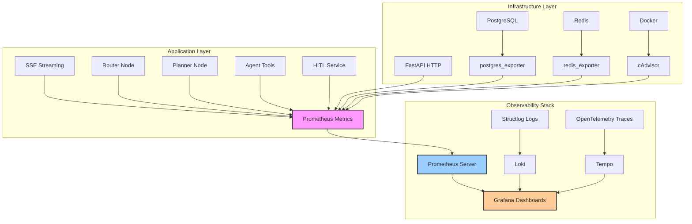

# Metrics Reference - LIA

> **Catalogue complet des métriques Prometheus pour observabilité multi-couches**
>
> Version: 1.4
> Date: 2026-04-20
> Architecture: Prometheus + Grafana (20 dashboards, 354+ panels)
> Total métriques: 545+ métriques (149 instrumentées + 390 recording rules)
> Compliance: OpenTelemetry conventions, Google SRE best practices

---

## Table des Matières

1. [Vue d'Ensemble](#vue-densemble)
2. [Types de Métriques](#types-de-métriques)
3. [SSE Streaming (5 métriques)](#sse-streaming)
4. [Router Node (5 métriques)](#router-node)
5. [LLM Token & Cost (4 métriques)](#llm-token--cost)
6. [Agent Nodes (2 métriques)](#agent-nodes)
7. [Context & State (2 métriques)](#context--state)
8. [Google Contacts API (5 métriques)](#google-contacts-api)
9. [Agent Tools (3 métriques)](#agent-tools)
10. [Task Orchestrator (2 métriques)](#task-orchestrator)
11. [HITL Classification (10 métriques)](#hitl-classification)
12. [HITL Plan-Level (6 métriques)](#hitl-plan-level)
13. [Planner Node (12 métriques)](#planner-node)
14. [Plan Execution (3 métriques)](#plan-execution)
15. [Checkpoints (3 métriques)](#checkpoints)
16. [Conversations (6 métriques)](#conversations)
17. [Voice TTS (12 métriques)](#voice-tts-text-to-speech)
18. [Voice STT (4 métriques)](#voice-stt-speech-to-text)
19. [Voice WebSocket (5 métriques)](#voice-websocket)
20. [Hybrid Memory Search (5 métriques)](#hybrid-memory-search)
21. [GeoIP (1 métrique)](#geoip)
22. [Usage Limits (2 métriques)](#usage-limits)
23. [Recording Rules (40+ règles)](#recording-rules)
23. [Labels & Cardinality](#labels--cardinality)
24. [Best Practices](#best-practices)
25. [Troubleshooting](#troubleshooting)
26. [Ressources](#ressources)

---

## Vue d'Ensemble

### Statistiques Métriques

| Catégorie | Métriques | Dashboards | Panels |
|-----------|-----------|------------|--------|
| **SSE Streaming** | 5 | Dashboard 01 | 8 panels |
| **Router & LLM** | 9 | Dashboard 04, 05 | 18 panels |
| **Agents & Tools** | 7 | Dashboard 04 | 15 panels |
| **HITL** | 16 | Dashboard 07 | 12 panels |
| **Planner** | 12 | Dashboard 04 | 15 panels |
| **Checkpoints** | 3 | Dashboard 06 | 6 panels |
| **Business** | 6 | Dashboard 03 | 10 panels |
| **Voice (TTS/STT/WS)** | 21 | Dashboard 10 | 20 panels |
| **Hybrid Memory Search** | 5 | Dashboard 04 | 6 panels |
| **Usage Limits** | 2 | Dashboard 03 | 2 panels |
| **Infrastructure** | 20+ | Dashboard 02 | 25 panels |
| **Recording Rules** | 40+ | Toutes | - |
| **TOTAL** | **137+** | **10** | **157+** |

### Architecture Observabilité



### Naming Conventions

LIA suit les **OpenTelemetry Semantic Conventions** avec adaptations:

```
# Pattern général
<subsystem>_<metric_name>_<unit>

# Exemples
sse_streaming_duration_seconds         # Histogram avec unité
router_decisions_total                  # Counter avec _total suffix
agent_context_tokens_gauge              # Gauge avec _gauge suffix (explicit)
llm_cost_total                          # Counter cumulatif (EUR/USD)

# Recording rules (suffixe :aggregate:interval)
agent_node_success_rate:5m              # Success rate 5min window
llm_cost_per_request:1h                 # Average cost par requête 1h
api:slo:availability:ratio_5m           # SLO availability 5min
```

---

## Types de Métriques

### Counter (Monotonique)

**Définition**: Valeur monotonique croissante (ne diminue jamais, reset à 0 au redémarrage).

**Usage**: Compter événements cumulatifs (requêtes, erreurs, tokens consommés).

**Exemples:**

```python
# Définition
from prometheus_client import Counter

http_requests_total = Counter(
    "http_requests_total",
    "Total HTTP requests",
    ["method", "endpoint", "status"]
)

# Instrumentation
http_requests_total.labels(
    method="POST",
    endpoint="/api/v1/chat/stream",
    status="200"
).inc()  # Increment by 1

llm_tokens_consumed_total.labels(
    model="gpt-4.1-mini",
    node_name="planner",
    token_type="prompt_tokens"
).inc(1250)  # Increment by token count
```

**Query PromQL:**

```promql
# Rate (tokens/sec over 5min)
rate(llm_tokens_consumed_total[5m])

# Total in last 1h
increase(llm_tokens_consumed_total[1h])

# Sum by model
sum by (model) (rate(llm_tokens_consumed_total[5m]))
```

---

### Histogram (Distributions)

**Définition**: Échantillonne observations et compte dans buckets configurés.

**Usage**: Latences, tailles, distributions.

**Exemples:**

```python
from prometheus_client import Histogram

# Définition avec buckets optimisés
llm_api_latency_seconds = Histogram(
    "llm_api_latency_seconds",
    "LLM API call latency",
    ["model", "node_name"],
    buckets=[0.5, 1.0, 2.0, 5.0, 10.0, 20.0, 30.0, 60.0]  # Optimized for OpenAI
)

# Instrumentation (context manager)
with llm_api_latency_seconds.labels(
    model="gpt-4.1-mini",
    node_name="planner"
).time():
    response = await llm.ainvoke(messages)
```

**Query PromQL:**

```promql
# P95 latency
histogram_quantile(0.95,
    sum by (model, le) (rate(llm_api_latency_seconds_bucket[5m]))
)

# P99 latency
histogram_quantile(0.99,
    rate(llm_api_latency_seconds_bucket[5m])
)

# Average latency
rate(llm_api_latency_seconds_sum[5m]) / rate(llm_api_latency_seconds_count[5m])
```

**Métriques générées automatiquement:**

```
llm_api_latency_seconds_bucket{le="0.5"}   # Count ≤ 0.5s
llm_api_latency_seconds_bucket{le="1.0"}   # Count ≤ 1.0s
llm_api_latency_seconds_bucket{le="+Inf"} # Total count
llm_api_latency_seconds_sum                # Sum of all observations
llm_api_latency_seconds_count              # Total observations
```

---

### Gauge (Snapshot)

**Définition**: Valeur instantanée qui peut augmenter ou diminuer.

**Usage**: Valeurs actuelles (pool size, queue depth, active connections).

**Exemples:**

```python
from prometheus_client import Gauge

agent_context_tokens_gauge = Gauge(
    "agent_context_tokens_gauge",
    "Current context size in tokens",
    ["node_name"]
)

# Instrumentation
agent_context_tokens_gauge.labels(node_name="planner").set(15000)

# Can also increment/decrement
active_connections = Gauge("active_connections", "Active DB connections")
active_connections.inc()  # +1
active_connections.dec()  # -1
```

**Query PromQL:**

```promql
# Current value
agent_context_tokens_gauge{node_name="planner"}

# Average over 5min
avg_over_time(agent_context_tokens_gauge[5m])

# Max value in 1h
max_over_time(agent_context_tokens_gauge[1h])
```

---

## SSE Streaming

### sse_streaming_duration_seconds

**Type**: Histogram
**Description**: Total SSE streaming duration (request to last token)
**Labels**: `intention` (router decision)
**Buckets**: `[0.5, 1.0, 2.0, 3.0, 5.0, 7.0, 10.0, 15.0, 30.0]`

**Instrumentation:**

```python
# apps/api/src/domains/agents/api/service.py
start_time = time.time()
async for chunk in self.stream_agent_response(...):
    yield chunk
duration = time.time() - start_time

sse_streaming_duration_seconds.labels(
    intention=router_output.intention
).observe(duration)
```

**Query PromQL:**

```promql
# P95 streaming duration by intention
histogram_quantile(0.95,
    sum by (intention, le) (rate(sse_streaming_duration_seconds_bucket[5m]))
)

# Slow streams (> 10s)
count(sse_streaming_duration_seconds_bucket{le="10"}) -
count(sse_streaming_duration_seconds_bucket{le="+Inf"})
```

**Dashboard**: 01-Application-Performance, Panel: "SSE Streaming Duration P95/P99"

---

### sse_time_to_first_token_seconds

**Type**: Histogram
**Description**: Time to first token (TTFT) in SSE streaming
**Labels**: `intention`
**Buckets**: `[0.1, 0.25, 0.5, 0.75, 1.0, 1.5, 2.0, 3.0, 5.0]`

**Rationale**: TTFT est métrique critique UX (perception de latence utilisateur).

**Target SLO**: P95 < 1.0s (excellent), P95 < 2.0s (acceptable)

**Instrumentation:**

```python
first_token_sent = False
start_time = time.time()

async for chunk in stream:
    if not first_token_sent:
        ttft = time.time() - start_time
        sse_time_to_first_token_seconds.labels(
            intention=intention
        ).observe(ttft)
        first_token_sent = True
    yield chunk
```

**Query PromQL:**

```promql
# P95 TTFT (SLO tracking)
histogram_quantile(0.95,
    sum by (intention, le) (rate(sse_time_to_first_token_seconds_bucket[5m]))
)

# TTFT distribution (all percentiles)
histogram_quantile(0.50, rate(sse_time_to_first_token_seconds_bucket[5m])) # P50
histogram_quantile(0.90, rate(sse_time_to_first_token_seconds_bucket[5m])) # P90
histogram_quantile(0.99, rate(sse_time_to_first_token_seconds_bucket[5m])) # P99
```

**Dashboard**: 01-Application-Performance, Panel: "TTFT P50/P95/P99"

---

### sse_tokens_generated_total

**Type**: Counter
**Description**: Total tokens generated in SSE streaming
**Labels**: `intention`, `node_name`

**Usage**: Track token generation throughput, detect streaming issues.

**Instrumentation:**

```python
# Increment per streaming chunk
sse_tokens_generated_total.labels(
    intention=intention,
    node_name=node_name
).inc(len(chunk.split()))  # Approximate token count
```

**Query PromQL:**

```promql
# Tokens/sec generation rate
rate(sse_tokens_generated_total[5m])

# Total tokens by node (last 1h)
sum by (node_name) (increase(sse_tokens_generated_total[1h]))

# Average tokens per request
rate(sse_tokens_generated_total[1h]) / rate(http_requests_total{endpoint="/api/v1/chat/stream"}[1h])
```

---

### sse_streaming_errors_total

**Type**: Counter
**Description**: Total SSE streaming errors
**Labels**: `error_type`, `node_name`

**Error Types:**
- `timeout`: Stream timeout (30s+)
- `llm_error`: LLM API error during streaming
- `checkpoint_save_error`: Failed to save checkpoint
- `connection_closed`: Client closed connection
- `unknown_error`: Uncategorized errors

**Instrumentation:**

```python
try:
    async for chunk in stream:
        yield chunk
except asyncio.TimeoutError:
    sse_streaming_errors_total.labels(
        error_type="timeout",
        node_name=node_name
    ).inc()
    raise
except OpenAIError as e:
    sse_streaming_errors_total.labels(
        error_type="llm_error",
        node_name=node_name
    ).inc()
    raise
```

**Query PromQL:**

```promql
# Error rate by type
rate(sse_streaming_errors_total[5m])

# Error ratio (errors / total streams)
sum(rate(sse_streaming_errors_total[5m])) /
sum(rate(http_requests_total{endpoint="/api/v1/chat/stream"}[5m]))
```

---

## Router Node

### router_latency_seconds

**Type**: Histogram
**Description**: Router decision latency (time to route)
**Buckets**: `[0.1, 0.2, 0.3, 0.5, 0.75, 1.0, 1.5, 2.0]`

**Target**: P95 < 500ms, P99 < 1000ms

**Instrumentation:**

```python
# apps/api/src/domains/agents/nodes/router_node_v3.py
@track_node_execution(node_name="router")
async def router_node(state: MessagesState) -> MessagesState:
    start_time = time.time()

    router_output = await llm_with_structured_output.ainvoke(messages)

    latency = time.time() - start_time
    router_latency_seconds.observe(latency)

    return state
```

**Query PromQL:**

```promql
# P95 router latency
histogram_quantile(0.95, rate(router_latency_seconds_bucket[5m]))

# SLO compliance (% requests < 500ms)
sum(rate(router_latency_seconds_bucket{le="0.5"}[5m])) /
sum(rate(router_latency_seconds_count[5m]))
```

**Dashboard**: 04-Agents-LangGraph, Panel: "Router Latency P95/P99"

---

### router_decisions_total

**Type**: Counter
**Description**: Total router decisions
**Labels**: `intention`, `confidence_bucket`

**Confidence Buckets:**
- `high`: confidence ≥ 0.8
- `medium`: 0.6 ≤ confidence < 0.8
- `low`: confidence < 0.6

**Instrumentation:**

```python
from src.infrastructure.observability.metrics_agents import get_confidence_bucket

confidence = router_output.confidence
confidence_bucket = get_confidence_bucket(confidence)  # "low" / "medium" / "high"

router_decisions_total.labels(
    intention=router_output.intention,
    confidence_bucket=confidence_bucket
).inc()
```

**Query PromQL:**

```promql
# Distribution by intention (1h)
sum by (intention) (increase(router_decisions_total[1h]))

# Low confidence rate (quality indicator)
sum(rate(router_decisions_total{confidence_bucket="low"}[1h])) /
sum(rate(router_decisions_total[1h]))

# High confidence ratio (target > 80%)
sum(rate(router_decisions_total{confidence_bucket="high"}[1h])) /
sum(rate(router_decisions_total[1h]))
```

---

### router_fallback_total

**Type**: Counter
**Description**: Total router fallbacks (low confidence)
**Labels**: `original_intention`

**Rationale**: Track when router confidence < threshold (0.6) triggers fallback to `conversation`.

**Instrumentation:**

```python
if confidence < settings.router_confidence_threshold:
    # Fallback to "conversation" intention
    router_fallback_total.labels(
        original_intention=router_output.intention
    ).inc()

    router_output.intention = "conversation"
```

**Query PromQL:**

```promql
# Fallback rate (target < 5%)
rate(router_fallback_total[1h]) / rate(router_decisions_total[1h])

# Most frequent fallback intentions
topk(5, sum by (original_intention) (increase(router_fallback_total[1h])))
```

---

### router_data_presumption_total

**Type**: Counter
**Description**: Router decisions based on data availability instead of syntax (RULE #5 violation)
**Labels**: `pattern_detected`, `decision`

**Patterns:**
- `aucun_resultat`: "aucun résultat trouvé"
- `pas_trouve`: "je n'ai pas trouvé"
- `introuvable`: "contact introuvable"

**Decisions:**
- `conversation`: Fallback to conversation (correct)
- `actionable`: Incorrect actionable decision (bug)

**Instrumentation:**

```python
# Pattern detection in LLM response
if "aucun résultat" in llm_response.lower():
    router_data_presumption_total.labels(
        pattern_detected="aucun_resultat",
        decision=router_output.intention
    ).inc()
```

**Query PromQL:**

```promql
# RULE #5 violation rate (target: 0%)
rate(router_data_presumption_total{decision="actionable"}[1h])

# Total presumption decisions (all patterns)
sum(rate(router_data_presumption_total[1h]))
```

**Alert:**

```yaml
- alert: RouterDataPresumptionHigh
  expr: |
    rate(router_data_presumption_total{decision="actionable"}[5m]) > 0.1
  annotations:
    summary: "Router violating RULE #5 (data presumption)"
```

---

## LLM Token & Cost

### llm_tokens_consumed_total

**Type**: Counter
**Description**: Total LLM tokens consumed
**Labels**: `model`, `node_name`, `token_type`

**Token Types:**
- `prompt_tokens`: Input tokens (excludes cached)
- `completion_tokens`: Output tokens
- `cached_tokens`: Cached input tokens (OpenAI prompt caching)

**Instrumentation:**

```python
# apps/api/src/infrastructure/llm/decorators.py
@track_llm_call
async def ainvoke(self, messages, **kwargs):
    response = await self.llm.ainvoke(messages, **kwargs)

    # Extract token usage
    usage = response.usage_metadata
    prompt_tokens = usage["input_tokens"] - usage.get("cache_read_input_tokens", 0)
    completion_tokens = usage["output_tokens"]
    cached_tokens = usage.get("cache_read_input_tokens", 0)

    llm_tokens_consumed_total.labels(
        model=model_name,
        node_name=node_name,
        token_type="prompt_tokens"
    ).inc(prompt_tokens)

    llm_tokens_consumed_total.labels(
        model=model_name,
        node_name=node_name,
        token_type="completion_tokens"
    ).inc(completion_tokens)

    llm_tokens_consumed_total.labels(
        model=model_name,
        node_name=node_name,
        token_type="cached_tokens"
    ).inc(cached_tokens)
```

**Query PromQL:**

```promql
# Total tokens/sec by model
sum by (model) (rate(llm_tokens_consumed_total[5m]))

# Cache hit ratio (cost optimization)
sum(rate(llm_tokens_consumed_total{token_type="cached_tokens"}[1h])) /
sum(rate(llm_tokens_consumed_total{token_type=~"prompt_tokens|cached_tokens"}[1h]))

# Tokens by node (identify expensive nodes)
sum by (node_name) (rate(llm_tokens_consumed_total[1h]))
```

**Dashboard**: 05-LLM-Tokens-Cost, Panel: "Token Consumption by Model/Node"

---

### llm_api_calls_total

**Type**: Counter
**Description**: Total LLM API calls
**Labels**: `model`, `node_name`, `status`

**Status:** `success`, `error`

**Instrumentation:**

```python
try:
    response = await llm.ainvoke(messages)
    llm_api_calls_total.labels(
        model=model_name,
        node_name=node_name,
        status="success"
    ).inc()
except OpenAIError:
    llm_api_calls_total.labels(
        model=model_name,
        node_name=node_name,
        status="error"
    ).inc()
    raise
```

**Query PromQL:**

```promql
# API success rate
sum(rate(llm_api_calls_total{status="success"}[5m])) /
sum(rate(llm_api_calls_total[5m]))

# Call rate by model
sum by (model) (rate(llm_api_calls_total[5m]))

# Error rate (SLO monitoring)
sum(rate(llm_api_calls_total{status="error"}[5m]))
```

---

### llm_api_latency_seconds

**Type**: Histogram
**Description**: LLM API call latency (optimized for OpenAI GPT-4/gpt-4.1-mini patterns)
**Labels**: `model`, `node_name`
**Buckets**: `[0.5, 1.0, 2.0, 5.0, 10.0, 20.0, 30.0, 60.0]`

**Rationale**: Buckets optimized for OpenAI (rarely < 500ms, often > 10s for large contexts).

**Instrumentation:**

```python
with llm_api_latency_seconds.labels(
    model=model_name,
    node_name=node_name
).time():
    response = await llm.ainvoke(messages)
```

**Query PromQL:**

```promql
# P95 latency by model
histogram_quantile(0.95,
    sum by (model, le) (rate(llm_api_latency_seconds_bucket[5m]))
)

# Slow calls (> 30s)
sum(rate(llm_api_latency_seconds_bucket{le="30"}[5m])) -
sum(rate(llm_api_latency_seconds_bucket{le="60"}[5m]))
```

---

### llm_cost_total

**Type**: Counter
**Description**: Cumulative LLM cost in configured currency (USD or EUR)
**Labels**: `model`, `node_name`, `currency`

**Instrumentation:**

```python
from src.domains.llm.pricing_service import AsyncPricingService

pricing_service = AsyncPricingService(db=db)
cost_usd, cost_eur = await pricing_service.calculate_token_cost(
    model=model_name,
    input_tokens=prompt_tokens,
    output_tokens=completion_tokens,
    cached_tokens=cached_tokens
)

llm_cost_total.labels(
    model=model_name,
    node_name=node_name,
    currency="USD"
).inc(float(cost_usd))

llm_cost_total.labels(
    model=model_name,
    node_name=node_name,
    currency="EUR"
).inc(float(cost_eur))
```

**Query PromQL:**

```promql
# Cost/hour by model (EUR)
sum by (model) (rate(llm_cost_total{currency="EUR"}[1h]) * 3600)

# Total cost last 24h
sum(increase(llm_cost_total{currency="EUR"}[24h]))

# Cost per request
sum(rate(llm_cost_total{currency="EUR"}[1h])) /
sum(rate(llm_api_calls_total[1h]))
```

---

### pricing_cache_fallback_total

**Type**: Counter
**Description**: Tracks pricing cache fallbacks (when cost estimation returns 0.0)
**Labels**: `reason`

**Reasons:**
- `cache_not_initialized`: Pricing cache not yet loaded (startup race condition)
- `model_not_found`: Model pricing not in cache (missing from DB)

**Instrumentation:**

```python
# apps/api/src/infrastructure/cache/pricing_cache.py
from prometheus_client import Counter

pricing_cache_fallback_total = Counter(
    "pricing_cache_fallback_total",
    "Total pricing cache fallbacks (cost returned as 0.0)",
    ["reason"],
)

# Usage in get_cached_cost()
if _local_cache is None:
    pricing_cache_fallback_total.labels(reason="cache_not_initialized").inc()
    return 0.0
```

**Alerting:**

```promql
# High fallback rate (> 1% of cost estimations)
sum(rate(pricing_cache_fallback_total[5m])) /
sum(rate(llm_api_calls_total[5m])) > 0.01
```

---

### conversation_id_cache_total

**Type**: Counter
**Description**: Tracks conversation ID cache operations for HITL performance optimization
**Labels**: `result`

**Results:**
- `hit`: Cache hit (conversation_id found in Redis)
- `miss`: Cache miss (fallback to DB query, then cached)
- `error`: Redis error (fallback to direct DB query without caching)

**Instrumentation:**

```python
# apps/api/src/infrastructure/cache/conversation_cache.py
from prometheus_client import Counter

conversation_id_cache_total = Counter(
    "conversation_id_cache_total",
    "Total conversation ID cache operations",
    ["result"],
)

# Usage in ConversationIdCache.get()
if cached:
    conversation_id_cache_total.labels(result="hit").inc()
else:
    conversation_id_cache_total.labels(result="miss").inc()
```

**Alerting:**

```promql
# Cache hit rate (target: > 90%)
sum(rate(conversation_id_cache_total{result="hit"}[5m])) /
sum(rate(conversation_id_cache_total[5m])) < 0.9

# High error rate (> 1%)
sum(rate(conversation_id_cache_total{result="error"}[5m])) /
sum(rate(conversation_id_cache_total[5m])) > 0.01
```

---

## Agent Nodes

### agent_node_executions_total

**Type**: Counter
**Description**: Total agent node executions
**Labels**: `node_name`, `status`

**Node Names:**
- `router`: Router node
- `planner`: Planner node
- `task_orchestrator`: Task orchestrator (deprecated)
- `contacts_agent`: Google Contacts agent
- `response`: Response synthesis node
- `approval_gate`: HITL approval gate (Phase 8)
- `wave_aggregator`: Parallel wave aggregator (Phase 5.2B)
- `step_executor`: Step executor node (Phase 5)

**Status:** `success`, `error`

**Instrumentation:**

```python
# apps/api/src/infrastructure/observability/decorators.py
def track_node_execution(node_name: str):
    def decorator(func):
        async def wrapper(*args, **kwargs):
            try:
                result = await func(*args, **kwargs)
                agent_node_executions_total.labels(
                    node_name=node_name,
                    status="success"
                ).inc()
                return result
            except Exception:
                agent_node_executions_total.labels(
                    node_name=node_name,
                    status="error"
                ).inc()
                raise
        return wrapper
    return decorator

# Usage
@track_node_execution(node_name="planner")
async def planner_node(state: MessagesState) -> MessagesState:
    ...
```

**Query PromQL:**

```promql
# Success rate by node (recording rule)
agent_node_success_rate:5m

# Error rate
sum by (node_name) (rate(agent_node_executions_total{status="error"}[5m]))

# Execution rate by node
sum by (node_name) (rate(agent_node_executions_total[5m]))
```

---

### agent_node_duration_seconds

**Type**: Histogram
**Description**: Agent node execution duration
**Labels**: `node_name`
**Buckets**: `[0.1, 0.5, 1.0, 2.0, 5.0, 10.0, 30.0]`

**Instrumentation:**

```python
@track_node_execution(node_name="planner")
async def planner_node(state: MessagesState) -> MessagesState:
    start_time = time.time()

    # Execute node logic
    result = await execute_planner(state)

    duration = time.time() - start_time
    agent_node_duration_seconds.labels(
        node_name="planner"
    ).observe(duration)

    return result
```

**Query PromQL:**

```promql
# P95 duration by node
histogram_quantile(0.95,
    sum by (node_name, le) (rate(agent_node_duration_seconds_bucket[5m]))
)

# Slowest nodes (P99)
topk(5,
    histogram_quantile(0.99,
        sum by (node_name, le) (rate(agent_node_duration_seconds_bucket[5m]))
    )
)
```

**Dashboard**: 04-Agents-LangGraph, Panel: "Node Duration P95 by Node"

---

## Context & State

### agent_context_tokens_gauge

**Type**: Gauge
**Description**: Current context size in tokens
**Labels**: `node_name`

**Usage**: Monitor context bloat, optimize message windowing.

**Instrumentation:**

```python
from src.domains.agents.utils.token_utils import count_messages_tokens

# Before LLM call
context_tokens = count_messages_tokens(state["messages"])
agent_context_tokens_gauge.labels(
    node_name=node_name
).set(context_tokens)
```

**Query PromQL:**

```promql
# Current context size
agent_context_tokens_gauge{node_name="planner"}

# Average context over 1h
avg_over_time(agent_context_tokens_gauge{node_name="planner"}[1h])

# Max context (identify spikes)
max_over_time(agent_context_tokens_gauge[24h])
```

**Alert:**

```yaml
- alert: ContextSizeExceeded
  expr: agent_context_tokens_gauge > 100000
  annotations:
    summary: "Context size > 100k tokens (truncation needed)"
```

---

### agent_messages_history_count

**Type**: Histogram
**Description**: Number of messages in conversation history
**Buckets**: `[1, 3, 5, 10, 20, 50, 100]`

**Instrumentation:**

```python
message_count = len(state["messages"])
agent_messages_history_count.observe(message_count)
```

**Query PromQL:**

```promql
# P95 message count
histogram_quantile(0.95, rate(agent_messages_history_count_bucket[1h]))

# Distribution
sum by (le) (rate(agent_messages_history_count_bucket[1h]))
```

---

## Google Contacts API

### google_contacts_api_calls_total

**Type**: Counter
**Description**: Total Google Contacts API calls
**Labels**: `operation`, `status`

**Operations:** `search`, `list`, `details`
**Status:** `success`, `error`

**Note**: Removed `connector_id_hash` label to prevent high cardinality (1 series per user).

**Instrumentation:**

```python
# apps/api/src/domains/connectors/clients/google_people_client.py
try:
    response = await self._make_request(url)
    google_contacts_api_calls.labels(
        operation="search",
        status="success"
    ).inc()
except GoogleAPIError:
    google_contacts_api_calls.labels(
        operation="search",
        status="error"
    ).inc()
    raise
```

**Query PromQL:**

```promql
# API success rate
sum(rate(google_contacts_api_calls_total{status="success"}[5m])) /
sum(rate(google_contacts_api_calls_total[5m]))

# Call rate by operation
sum by (operation) (rate(google_contacts_api_calls_total[5m]))

# Error rate
sum(rate(google_contacts_api_calls_total{status="error"}[5m]))
```

---

### google_contacts_api_latency_seconds

**Type**: Histogram
**Description**: Google Contacts API call latency
**Labels**: `operation`
**Buckets**: `[0.1, 0.25, 0.5, 1.0, 2.0, 5.0]`

**Instrumentation:**

```python
with google_contacts_api_latency.labels(
    operation="search"
).time():
    response = await self._make_request(url)
```

**Query PromQL:**

```promql
# P95 latency by operation
histogram_quantile(0.95,
    sum by (operation, le) (rate(google_contacts_api_latency_seconds_bucket[5m]))
)

# Connection pooling benefit (compare with/without pool)
# Baseline: 150ms → 65ms (35-90ms saved)
```

---

### google_contacts_cache_hits_total / google_contacts_cache_misses_total

**Type**: Counter
**Description**: Google Contacts cache hits/misses
**Labels**: `cache_type`

**Cache Types:**
- `list`: List contacts (TTL 5min)
- `search`: Search contacts (TTL 5min)
- `details`: Contact details (TTL 3min)

**Instrumentation:**

```python
# Check cache first
cache_key = f"contacts:search:{hash(query)}"
cached = await redis.get(cache_key)

if cached:
    google_contacts_cache_hits.labels(cache_type="search").inc()
    return json.loads(cached)
else:
    google_contacts_cache_misses.labels(cache_type="search").inc()
    result = await self._search_contacts_api(query)
    await redis.setex(cache_key, 300, json.dumps(result))
    return result
```

**Query PromQL:**

```promql
# Cache hit rate (target: > 85%)
sum(rate(google_contacts_cache_hits_total[5m])) /
(sum(rate(google_contacts_cache_hits_total[5m])) +
 sum(rate(google_contacts_cache_misses_total[5m])))

# Hit rate by cache type
sum by (cache_type) (rate(google_contacts_cache_hits_total[5m])) /
(sum by (cache_type) (rate(google_contacts_cache_hits_total[5m])) +
 sum by (cache_type) (rate(google_contacts_cache_misses_total[5m])))
```

**Dashboard**: 03-Business-Metrics, Panel: "Contacts Cache Hit Rate"

---

### google_contacts_results_count

**Type**: Histogram
**Description**: Number of contacts returned per query
**Labels**: `operation`
**Buckets**: `[0, 1, 5, 10, 20, 50, 100, 500]`

**Instrumentation:**

```python
results = await self.search_contacts(query)
google_contacts_results_count.labels(
    operation="search"
).observe(len(results))
```

**Query PromQL:**

```promql
# P95 result count (detect large queries)
histogram_quantile(0.95,
    sum by (operation, le) (rate(google_contacts_results_count_bucket[5m]))
)

# Zero results rate (UX quality indicator)
sum(rate(google_contacts_results_count_bucket{le="0"}[1h])) /
sum(rate(google_contacts_results_count_count[1h]))
```

---

## Agent Tools

### agent_tool_invocations_total

**Type**: Counter
**Description**: Total agent tool invocations
**Labels**: `tool_name`, `agent_name`, `success`

**Tool Names:**
- `search_contacts_tool`
- `list_contacts_tool`
- `get_contact_details_tool`
- `get_current_time_tool`
- `get_current_location_tool`

**Instrumentation:**

```python
# apps/api/src/domains/agents/tools/decorators.py
@connector_tool
async def search_contacts_tool(...) -> dict:
    try:
        result = await _search_contacts(...)
        agent_tool_invocations.labels(
            tool_name="search_contacts_tool",
            agent_name="contacts_agent",
            success="true"
        ).inc()
        return result
    except Exception:
        agent_tool_invocations.labels(
            tool_name="search_contacts_tool",
            agent_name="contacts_agent",
            success="false"
        ).inc()
        raise
```

**Query PromQL:**

```promql
# Tool success rate
sum by (tool_name) (rate(agent_tool_invocations_total{success="true"}[5m])) /
sum by (tool_name) (rate(agent_tool_invocations_total[5m]))

# Most used tools
topk(10, sum by (tool_name) (increase(agent_tool_invocations_total[24h])))
```

---

### agent_tool_duration_seconds

**Type**: Histogram
**Description**: Agent tool execution duration
**Labels**: `tool_name`, `agent_name`
**Buckets**: `[0.1, 0.25, 0.5, 1.0, 2.0, 5.0, 10.0]`

**Instrumentation:**

```python
with agent_tool_duration_seconds.labels(
    tool_name="search_contacts_tool",
    agent_name="contacts_agent"
).time():
    result = await _search_contacts(...)
```

**Query PromQL:**

```promql
# P95 tool duration
histogram_quantile(0.95,
    sum by (tool_name, le) (rate(agent_tool_duration_seconds_bucket[5m]))
)

# Slowest tools
topk(5,
    histogram_quantile(0.95,
        sum by (tool_name, le) (rate(agent_tool_duration_seconds_bucket[5m]))
    )
)
```

---

### agent_tool_rate_limit_hits_total

**Type**: Counter
**Description**: Total agent tool rate limit hits (requests blocked)
**Labels**: `tool_name`, `user_id_hash`, `scope`

**Scopes:**
- `user`: Per-user rate limit (e.g., 10 req/min)
- `global`: Global rate limit (e.g., 100 req/min)

**Instrumentation:**

```python
# apps/api/src/domains/agents/utils/rate_limiting.py
from slowapi import Limiter

limiter = Limiter(key_func=get_user_id)

@limiter.limit("10/minute", scope="user")
async def search_contacts_tool(...):
    try:
        return await _search(...)
    except RateLimitExceeded:
        agent_tool_rate_limit_hits.labels(
            tool_name="search_contacts_tool",
            user_id_hash=hash(user_id),
            scope="user"
        ).inc()
        raise
```

**Query PromQL:**

```promql
# Rate limit hit rate
sum(rate(agent_tool_rate_limit_hits_total[5m]))

# Most rate-limited users (debugging)
topk(10, sum by (user_id_hash) (increase(agent_tool_rate_limit_hits_total[1h])))
```

---

## Task Orchestrator

### task_orchestrator_plans_created_total

**Type**: Counter
**Description**: Total orchestration plans created
**Labels**: `intention`, `agents_count`

**Note**: Task orchestrator deprecated (Phase 5), replaced by Planner node.

---

### orchestration_plan_agents_distribution

**Type**: Histogram
**Description**: Distribution of agents count per orchestration plan
**Buckets**: `[1, 2, 3, 4, 5, 10]`

**Query PromQL:**

```promql
# P95 agents per plan
histogram_quantile(0.95, rate(orchestration_plan_agents_count_bucket[1h]))
```

---

## HITL Classification

### hitl_classification_method_total

**Type**: Counter
**Description**: HITL response classification by method (fast-path pattern vs LLM fallback)
**Labels**: `method`, `decision`

**Methods:**
- `fast_path`: Regex pattern matching (deprecated Phase 1.2)
- `llm`: LLM classification (current)

**Decisions:**
- `APPROVE`: User approves action
- `REJECT`: User rejects action
- `EDIT`: User wants to modify parameters
- `AMBIGUOUS`: Classification unclear (needs clarification)

**Instrumentation:**

```python
# apps/api/src/domains/agents/services/hitl_classifier.py
classification = await self._classify_with_llm(user_message)

hitl_classification_method_total.labels(
    method="llm",
    decision=classification.decision
).inc()
```

**Query PromQL:**

```promql
# LLM fallback rate (fast-path effectiveness)
# Recording rule: hitl_llm_fallback_ratio:1h
sum(rate(hitl_classification_method_total{method="llm"}[1h])) /
sum(rate(hitl_classification_method_total[1h]))

# Approval rate (user trust indicator)
sum(rate(hitl_classification_method_total{decision="APPROVE"}[1h])) /
sum(rate(hitl_classification_method_total{decision=~"APPROVE|REJECT"}[1h]))
```

---

### hitl_classification_duration_seconds

**Type**: Histogram
**Description**: HITL classification latency (pattern matching + LLM inference time)
**Labels**: `method`
**Buckets**: `[0.01, 0.05, 0.1, 0.25, 0.5, 1.0, 2.0, 5.0]`

**Target**: P95 < 1.0s (LLM), P95 < 0.1s (fast-path)

---

### hitl_classification_confidence

**Type**: Histogram
**Description**: Confidence score distribution for HITL LLM classifications
**Labels**: `decision`
**Buckets**: `[0.0, 0.3, 0.5, 0.7, 0.8, 0.9, 0.95, 1.0]`

**Instrumentation:**

```python
classification = await self._classify_with_llm(user_message)

hitl_classification_confidence.labels(
    decision=classification.decision
).observe(classification.confidence)

# Demotion if low confidence
if classification.confidence < 0.7:
    hitl_classification_demoted_total.labels(
        from_decision=classification.decision,
        to_decision="AMBIGUOUS",
        reason="low_confidence"
    ).inc()
    classification.decision = "AMBIGUOUS"
```

---

### hitl_clarification_requests_total

**Type**: Counter
**Description**: Total clarification requests sent to users (ambiguous or low confidence responses)
**Labels**: `reason`

**Reasons:**
- `ambiguous_decision`: Classification unclear
- `low_confidence`: Confidence < threshold (0.7)
- `unclear_edit`: EDIT decision but unclear parameters

**Target**: < 10% clarification rate (good classifier quality)

---

### hitl_classification_demoted_total

**Type**: Counter
**Description**: HITL classifications demoted due to low confidence or validation issues
**Labels**: `from_decision`, `to_decision`, `reason`

**Example:** `EDIT → AMBIGUOUS` (low_confidence)

---

### hitl_security_events_total

**Type**: Counter
**Description**: Security events detected in HITL flows (DoS attempts, abuse, rate limits)
**Labels**: `event_type`, `severity`

**Event Types:**
- `max_actions_exceeded`: User exceeded max HITL actions per conversation (10)
- `rate_limit_exceeded`: Too many HITL requests (DoS prevention)

**Severity:** `low`, `medium`, `high`

---

### hitl_resumption_total / hitl_resumption_duration_seconds

**Type**: Counter / Histogram
**Description**: HITL graph resumption attempts after user approval
**Labels**: `strategy`, `status`

**Strategies:**
- `conversational`: Conversational HITL (Phase 1.2)
- `button`: Button-based HITL (deprecated)

---

### hitl_user_response_time_seconds

**Type**: Histogram
**Description**: Time between HITL tool approval request and user response
**Labels**: `decision`
**Buckets**: `[1, 5, 10, 30, 60, 300, 600, 1800, 3600]`

**Usage**: Measure user friction, optimize interrupt timing.

---

### hitl_question_ttft_seconds

**Type**: Histogram
**Description**: Time to first token for HITL question generation (user-perceived latency)
**Buckets**: `[0.05, 0.1, 0.2, 0.5, 1.0, 2.0, 5.0]`

**Critical UX Metric**: P95 < 500ms (vs 2-4s blocking)

---

## HITL Plan-Level

### hitl_plan_approval_requests_total

**Type**: Counter
**Description**: Total plan approval requests sent to users
**Labels**: `strategy`

**Strategies (Phase 8):**
- `ManifestBasedStrategy`: Tool manifest requires_approval=true
- `CostThresholdStrategy`: Plan cost > threshold (€0.10)
- `AlwaysApproveStrategy`: Always approve (bypass)

**Instrumentation:**

```python
# apps/api/src/domains/agents/services/approval/evaluator.py
evaluation = await approval_evaluator.evaluate(plan, state)

if evaluation.requires_approval:
    for strategy in evaluation.strategies_triggered:
        hitl_plan_approval_requests.labels(
            strategy=strategy
        ).inc()
```

---

### hitl_plan_approval_latency_seconds

**Type**: Histogram
**Description**: Time from approval request to user decision
**Buckets**: `[1.0, 5.0, 10.0, 30.0, 60.0, 120.0, 300.0, 600.0]`

**Optimized for human response time**: Users typically respond within 1-60 seconds.

**Instrumentation:**

```python
start_time = time.time()

# Wait for user decision (streaming or checkpoint resume)
decision = await wait_for_approval_decision(plan_id)

latency = time.time() - start_time
hitl_plan_approval_latency.observe(latency)
```

---

### hitl_plan_decisions_total

**Type**: Counter
**Description**: Plan approval decisions by type
**Labels**: `decision`

**Decisions:**
- `APPROVE`: User approves plan execution
- `REJECT`: User rejects plan
- `EDIT`: User edits plan parameters (future)
- `REPLAN`: User requests planner to regenerate plan

---

### hitl_plan_modifications_total

**Type**: Counter
**Description**: Plan modifications by type during EDIT workflow
**Labels**: `modification_type`

**Modification Types:**
- `edit_params`: Edit step parameters
- `remove_step`: Remove step from plan
- `reorder_steps`: Reorder execution sequence

---

### hitl_plan_approval_question_duration_seconds

**Type**: Histogram
**Description**: Time to generate plan approval question with LLM
**Buckets**: `[0.1, 0.3, 0.5, 1.0, 2.0, 3.0, 5.0, 10.0]`

**Expected**: 0.5-3s for question generation (gpt-4.1-mini-mini streaming)

---

### hitl_plan_approval_question_fallback_total

**Type**: Counter
**Description**: Plan approval questions that fell back to static message
**Labels**: `error_type`

**Error Types:**
- `timeout`: LLM generation timeout (> 5s)
- `llm_error`: LLM API error
- `validation_error`: Generated question failed validation

---

## Planner Node

### planner_plans_created_total

**Type**: Counter
**Description**: Total execution plans created by planner LLM
**Labels**: `execution_mode`

**Execution Modes:**
- `sequential`: Sequential execution (Phase 5.0-5.2A)
- `parallel`: Wave-based parallel execution (Phase 5.2B+)

**Instrumentation:**

```python
# apps/api/src/domains/agents/nodes/planner_node_v3.py
plan = await planner_llm.ainvoke(messages)

planner_plans_created_total.labels(
    execution_mode=plan.execution_mode  # "sequential" or "parallel"
).inc()
```

---

### planner_plans_rejected_total

**Type**: Counter
**Description**: Total execution plans rejected by validator
**Labels**: `reason`

**Rejection Reasons:**
- `validation_failed`: Pydantic validation error
- `budget_exceeded`: Plan exceeds cost/token budget
- `too_many_steps`: Step count > max (15)
- `cycle_detected`: Dependency cycle in CONDITIONAL steps
- `invalid_step_reference`: Step references non-existent step_id
- `missing_tool`: Tool not in catalogue

**Instrumentation:**

```python
# apps/api/src/domains/agents/orchestration/validator.py
validation = validator.validate(plan)

if not validation.is_valid:
    planner_plans_rejected_total.labels(
        reason=validation.rejection_reason
    ).inc()
```

---

### planner_errors_total

**Type**: Counter
**Description**: Total planner errors
**Labels**: `error_type`

**Error Types:**
- `json_parse_error`: LLM response not valid JSON
- `pydantic_validation_error`: Response doesn't match ExecutionPlan schema
- `validation_error`: Plan validator rejected plan
- `unknown_error`: Uncategorized errors

---

### planner_retries_total

**Type**: Counter
**Description**: Total planner retry attempts after validation errors
**Labels**: `retry_attempt`, `validation_error_type`

**Retry Attempts:** `1`, `2`, `3` (max 3 retries)

**Instrumentation:**

```python
# apps/api/src/domains/agents/nodes/planner_node_v3.py
MAX_RETRIES = 3

for retry_attempt in range(1, MAX_RETRIES + 1):
    plan = await planner_llm.ainvoke(messages)
    validation = validator.validate(plan)

    if validation.is_valid:
        break

    planner_retries_total.labels(
        retry_attempt=str(retry_attempt),
        validation_error_type=validation.rejection_reason
    ).inc()

    # Add error feedback to messages
    messages.append(SystemMessage(content=validation.error_feedback))
```

**Target**: Retry rate < 20%, success rate > 80%

---

### planner_retry_success_total

**Type**: Counter
**Description**: Total successful planner retries (plan became valid after retry)
**Labels**: `retry_attempt`

**Dashboard**: Dashboard 04, Panel: "Planner Retry Success Rate"

---

### planner_retry_exhausted_total

**Type**: Counter
**Description**: Total planner retries exhausted without success after max attempts
**Labels**: `final_error_type`

**Alert:**

```yaml
- alert: PlannerRetryExhaustedHigh
  expr: rate(planner_retry_exhausted_total[5m]) > 0.1
  annotations:
    summary: "Planner exhausting retries (> 10% rate)"
```

---

### planner_domain_filtering_active

**Type**: Gauge
**Description**: Domain filtering status flag (1=enabled, 0=disabled)

**Phase 3 - Domain Filtering** (80-90% token reduction)

---

### planner_catalogue_size_tools

**Type**: Histogram
**Description**: Distribution of tool count loaded in planner catalogue
**Labels**: `filtering_applied`, `domains_loaded`
**Buckets**: `[1, 3, 5, 8, 10, 15, 20, 30, 50]`

**Domains Loaded:**
- `contacts`: Google Contacts only (5 tools)
- `contacts+email`: Contacts + Email (10 tools)
- `all`: All domains (50+ tools)

**Instrumentation:**

```python
catalogue = await load_filtered_catalogue(domains=detected_domains)

planner_catalogue_size_tools.labels(
    filtering_applied="true" if domains else "false",
    domains_loaded=",".join(domains) if domains else "all"
).observe(len(catalogue.tools))
```

**Query PromQL:**

```promql
# Catalogue size reduction ratio (recording rule)
planner_catalogue_reduction_ratio:1h

# P50 catalogue size (filtered vs full)
histogram_quantile(0.5, rate(planner_catalogue_size_tools_bucket{filtering_applied="true"}[1h]))
histogram_quantile(0.5, rate(planner_catalogue_size_tools_bucket{filtering_applied="false"}[1h]))
```

---

### planner_domain_confidence_score

**Type**: Histogram
**Description**: Router confidence score for domain detection (used for planner filtering)
**Labels**: `fallback_triggered`
**Buckets**: `[0.0, 0.5, 0.6, 0.7, 0.75, 0.8, 0.85, 0.9, 0.95, 1.0]`

**Instrumentation:**

```python
# Router provides domain classification
router_output = await router_node(state)
confidence = router_output.confidence

fallback = confidence < settings.domain_filtering_confidence_threshold

planner_domain_confidence_score.labels(
    fallback_triggered=str(fallback).lower()
).observe(confidence)

if fallback:
    # Load full catalogue (low confidence)
    catalogue = await load_full_catalogue()
else:
    # Load filtered catalogue
    catalogue = await load_filtered_catalogue(domains=[router_output.domain])
```

---

### planner_domain_filtering_cache_hits_total

**Type**: Counter
**Description**: Cache hits/misses for filtered catalogues (TTL 5min)
**Labels**: `cache_status`, `domains`

**Cache Status:** `hit`, `miss`

**Instrumentation:**

```python
cache_key = f"catalogue:filtered:{','.join(sorted(domains))}"
cached = await redis.get(cache_key)

if cached:
    planner_domain_filtering_cache_hits.labels(
        cache_status="hit",
        domains=",".join(sorted(domains))
    ).inc()
    return json.loads(cached)
else:
    planner_domain_filtering_cache_hits.labels(
        cache_status="miss",
        domains=",".join(sorted(domains))
    ).inc()
    catalogue = await build_filtered_catalogue(domains)
    await redis.setex(cache_key, 300, json.dumps(catalogue))
    return catalogue
```

**Target**: Cache hit rate > 30%

---

## Plan Execution

### langgraph_plan_steps_skipped_total

**Type**: Counter
**Description**: Total steps skipped due to conditional branching (ADR-005)
**Labels**: `plan_type`, `skip_reason`

**Skip Reasons:**
- `fallback_branch`: Fallback branch triggered (success condition failed)
- `success_branch`: Success branch skipped (fallback taken)

**Instrumentation:**

```python
# apps/api/src/domains/agents/orchestration/step_executor_node.py
if step.type == "CONDITIONAL" and condition_failed:
    # Skip success branch, execute fallback
    for skipped_step_id in step.on_success:
        langgraph_plan_steps_skipped_total.labels(
            plan_type=plan.plan_type,
            skip_reason="success_branch"
        ).inc()
```

---

### langgraph_plan_wave_filtered_total

**Type**: Counter
**Description**: Total waves that had steps filtered before execution (ADR-005)
**Labels**: `plan_type`, `filter_type`

**Filter Types:**
- `partial`: Some steps filtered (partial wave execution)
- `complete`: All steps filtered (wave skipped entirely)

---

### langgraph_plan_execution_efficiency_ratio

**Type**: Histogram
**Description**: Ratio of executed steps to total planned steps (measures branching efficiency)
**Labels**: `plan_type`
**Buckets**: `[0.2, 0.4, 0.5, 0.6, 0.7, 0.8, 0.9, 1.0]`

**Instrumentation:**

```python
total_steps = len(plan.steps)
executed_steps = len(state["completed_steps"])

efficiency = executed_steps / total_steps

langgraph_plan_execution_efficiency.labels(
    plan_type=plan.plan_type
).observe(efficiency)
```

**Target**: Efficiency 0.6-0.8 (40-20% skipped steps from conditional branching)

---

## Checkpoints

### checkpoint_load_duration_seconds

**Type**: Histogram
**Description**: Time to load checkpoint from PostgreSQL
**Labels**: `node_name`
**Buckets**: `[0.01, 0.05, 0.1, 0.25, 0.5, 1.0, 2.0]`

**Target**: P95 < 100ms (fast cold start)

---

### checkpoint_save_duration_seconds

**Type**: Histogram
**Description**: Time to save checkpoint to PostgreSQL
**Labels**: `node_name`
**Buckets**: `[0.01, 0.05, 0.1, 0.25, 0.5, 1.0]`

**Target**: P95 < 50ms (low overhead)

---

### checkpoint_size_bytes

**Type**: Histogram
**Description**: Size of checkpoint payload in bytes (extended for long conversations)
**Labels**: `node_name`
**Buckets**: `[100, 500, 1000, 5000, 10000, 50000, 100000, 500000, 1000000]`

**Instrumentation:**

```python
checkpoint_bytes = len(json.dumps(state).encode())

checkpoint_size_bytes.labels(
    node_name=node_name
).observe(checkpoint_bytes)
```

**Alert:**

```yaml
- alert: CheckpointSizeLarge
  expr: histogram_quantile(0.95, checkpoint_size_bytes_bucket) > 500000
  annotations:
    summary: "Checkpoint size P95 > 500KB (state bloat)"
```

---

## Conversations

### conversation_created_total

**Type**: Counter
**Description**: Total conversations created (lazy creation)

**Instrumentation:**

```python
# Lazy creation on first message
if not conversation:
    conversation = await conversation_service.create(user_id)
    conversation_created_total.inc()
```

---

### conversation_resets_total

**Type**: Counter
**Description**: Total conversation resets by users

**Note**: `user_id_hash` label removed to prevent high cardinality.

---

### conversation_message_archived_total

**Type**: Counter
**Description**: Total messages archived to conversation_messages table
**Labels**: `role`

**Roles:** `user`, `assistant`, `system`

---

### conversation_repository_queries_total / conversation_messages_query_duration_seconds / conversation_repository_routing_total / conversation_repository_errors_total

**Phase 3 Refactoring**: Migration metrics (legacy vs optimized repository).

---

## Voice TTS (Text-to-Speech)

### voice_tts_requests_total

**Type**: Counter
**Description**: Total Edge TTS API requests
**Labels**: `status`, `voice_name`

**Status**: `success`, `error`
**Voice Names**: `fr-FR-RemyMultilingualNeural`, `fr-FR-VivienneMultilingualNeural`, etc.

**Instrumentation:**

```python
# apps/api/src/domains/voice/client.py
voice_tts_requests_total.labels(
    status="success",
    voice_name="fr-FR-VivienneMultilingualNeural"
).inc()
```

**Query PromQL:**

```promql
# TTS success rate
sum(rate(voice_tts_requests_total{status="success"}[5m])) /
sum(rate(voice_tts_requests_total[5m]))

# Usage by voice
sum by (voice_name) (increase(voice_tts_requests_total[24h]))
```

---

### voice_tts_latency_seconds

**Type**: Histogram
**Description**: Edge TTS API call latency
**Labels**: `voice_name`
**Buckets**: `[0.05, 0.1, 0.2, 0.3, 0.5, 0.75, 1.0, 1.5, 2.0, 3.0]`

**Target**: P95 < 500ms (Edge TTS is fast)

---

### voice_tts_errors_total

**Type**: Counter
**Description**: Total Edge TTS API errors by type
**Labels**: `error_type`, `voice_name`

**Error Types**: `network_error`, `synthesis_error`, `empty_response`, `unknown`

---

### voice_comment_tokens_total

**Type**: Counter
**Description**: Tokens used for voice comment generation
**Labels**: `model`, `token_type`

**Token Types**: `prompt_tokens`, `completion_tokens`

---

### voice_comment_generation_duration_seconds

**Type**: Histogram
**Description**: Duration of voice comment LLM generation
**Labels**: `model`
**Buckets**: `[0.1, 0.25, 0.5, 1.0, 1.5, 2.0, 3.0, 5.0]`

---

### voice_time_to_first_audio_seconds

**Type**: Histogram
**Description**: Time to first audio chunk (TTFA - perceived latency)
**Buckets**: `[0.25, 0.5, 0.75, 1.0, 1.5, 2.0, 3.0, 5.0]`

**Critical UX Metric**: Target P95 < 2s

**Query PromQL:**

```promql
# P95 TTFA
histogram_quantile(0.95, rate(voice_time_to_first_audio_seconds_bucket[5m]))
```

---

### voice_audio_bytes_total / voice_audio_chunks_total / voice_streaming_duration_seconds

**Types**: Counter / Counter / Histogram
**Description**: Audio streaming metrics (bytes, chunks, duration)

---

### voice_preference_toggles_total / voice_sessions_total

**Types**: Counter / Counter
**Description**: User preference and session metrics
**Labels**: `action` (enabled/disabled), `lia_gender` (male/female)

---

### voice_fallback_total / voice_interruptions_total

**Types**: Counter / Counter
**Description**: Graceful degradation and playback interruption metrics
**Labels**: `reason`, `trigger`

---

## Voice STT (Speech-to-Text)

### voice_stt_transcriptions_total

**Type**: Counter
**Description**: Total STT transcription attempts (Sherpa-onnx offline)
**Labels**: `status`

**Status**: `success`, `error`, `timeout`

**Instrumentation:**

```python
# apps/api/src/domains/voice/stt/sherpa_stt.py
stt_transcriptions_total.labels(status="success").inc()
```

**Query PromQL:**

```promql
# STT success rate (target > 99%)
sum(rate(voice_stt_transcriptions_total{status="success"}[5m])) /
sum(rate(voice_stt_transcriptions_total[5m]))
```

---

### voice_stt_transcription_duration_seconds

**Type**: Histogram
**Description**: STT processing time (CPU time, not audio duration)
**Buckets**: `[0.1, 0.25, 0.5, 1.0, 2.0, 3.0, 5.0, 10.0]`

**Expected**: 0.1-2s for short phrases, up to 5s for long audio

---

### voice_stt_audio_duration_seconds

**Type**: Histogram
**Description**: Audio duration received for transcription
**Buckets**: `[1, 2, 5, 10, 15, 30, 45, 60]`

---

### voice_stt_errors_total

**Type**: Counter
**Description**: Total STT errors by type
**Labels**: `error_type`

**Error Types**: `model_not_found`, `decode_error`, `timeout`, `audio_too_long`

---

## Voice WebSocket

### voice_websocket_connections_active

**Type**: Gauge
**Description**: Current active WebSocket audio connections

**Usage**: Track concurrent load on transcription service.

---

### voice_websocket_connections_total

**Type**: Counter
**Description**: Total WebSocket audio connections
**Labels**: `status`

**Status**: `connected`, `rejected_auth`, `rejected_rate_limit`, `error`

**Query PromQL:**

```promql
# Connection rejection rate
sum(rate(voice_websocket_connections_total{status=~"rejected.*"}[5m])) /
sum(rate(voice_websocket_connections_total[5m]))
```

---

### voice_websocket_audio_bytes_received_total

**Type**: Counter
**Description**: Total audio bytes received via WebSocket

---

### voice_websocket_connection_duration_seconds

**Type**: Histogram
**Description**: WebSocket connection duration
**Buckets**: `[1, 5, 10, 30, 60, 120, 300]`

---

### voice_websocket_tickets_issued_total / voice_websocket_tickets_validated_total

**Types**: Counter / Counter
**Description**: WebSocket BFF auth ticket metrics
**Labels** (validated): `status` (valid/invalid/expired)

**Query PromQL:**

```promql
# Ticket validation success rate (security monitoring)
sum(rate(voice_websocket_tickets_validated_total{status="valid"}[5m])) /
sum(rate(voice_websocket_tickets_validated_total[5m]))
```

---

## Hybrid Memory Search

### memory_hybrid_search_total

**Type**: Counter
**Description**: Total hybrid search operations (BM25 + semantic)
**Labels**: `status`

**Status**: `success`, `error`, `fallback`

**Instrumentation:**

```python
# apps/api/src/infrastructure/store/semantic_store.py
hybrid_search_total.labels(status="success").inc()
```

**Query PromQL:**

```promql
# Hybrid search success rate
sum(rate(memory_hybrid_search_total{status="success"}[5m])) /
sum(rate(memory_hybrid_search_total[5m]))

# Fallback rate (semantic-only due to BM25 issues)
sum(rate(memory_hybrid_search_total{status="fallback"}[5m])) /
sum(rate(memory_hybrid_search_total[5m]))
```

---

### memory_hybrid_search_duration_seconds

**Type**: Histogram
**Description**: Hybrid search latency (semantic + BM25 combined)
**Buckets**: `[0.01, 0.05, 0.1, 0.2, 0.5, 1.0]`

**Target**: P95 < 200ms

**Query PromQL:**

```promql
# P95 hybrid search latency
histogram_quantile(0.95, rate(memory_hybrid_search_duration_seconds_bucket[5m]))
```

---

### memory_bm25_cache_hits_total / memory_bm25_cache_misses_total

**Types**: Counter / Counter
**Description**: BM25 index cache hits and misses

**Query PromQL:**

```promql
# BM25 cache hit rate (target > 80%)
sum(rate(memory_bm25_cache_hits_total[5m])) /
(sum(rate(memory_bm25_cache_hits_total[5m])) +
 sum(rate(memory_bm25_cache_misses_total[5m])))
```

---

### memory_bm25_cache_size

**Type**: Gauge
**Description**: Current BM25 cache size (number of users)

**Configuration**: Max users configured via `MEMORY_BM25_CACHE_MAX_USERS` (default: 100)

**Query PromQL:**

```promql
# Cache utilization
memory_bm25_cache_size / 100  # Assuming max 100 users
```

---

## RAG Spaces (14 métriques)

Métriques pour les espaces de connaissances RAG (upload, processing, retrieval, embedding, reindex).
Source: `apps/api/src/infrastructure/observability/metrics_rag_spaces.py`

### Document Processing

| Métrique | Type | Labels | Description |
|----------|------|--------|-------------|
| `rag_documents_processed_total` | Counter | `status` (success/error) | Documents processed through pipeline |
| `rag_document_processing_duration_seconds` | Histogram | — | Processing pipeline duration |
| `rag_document_chunks_total` | Histogram | — | Chunks produced per document |
| `rag_document_upload_size_bytes` | Histogram | `content_type` | Upload file sizes |

### Retrieval

| Métrique | Type | Labels | Description |
|----------|------|--------|-------------|
| `rag_retrieval_requests_total` | Counter | `has_results` (true/false) | Retrieval requests |
| `rag_retrieval_duration_seconds` | Histogram | — | Retrieval latency (embed + search + fusion) |
| `rag_retrieval_chunks_returned` | Histogram | — | Chunks returned per query |
| `rag_retrieval_skipped_total` | Counter | `reason` (no_active_spaces/reindex_in_progress/error) | Skipped retrievals |

### Embedding

| Métrique | Type | Labels | Description |
|----------|------|--------|-------------|
| `rag_embedding_tokens_total` | Counter | `operation` (index) | RAG embedding tokens consumed |

### Space Lifecycle

| Métrique | Type | Labels | Description |
|----------|------|--------|-------------|
| `rag_spaces_active_count` | Gauge | — | Current active RAG spaces |
| `rag_spaces_total_count` | Gauge | — | Total RAG spaces |
| `rag_documents_total_count` | Gauge | `status` (processing/ready/error/reindexing) | Total RAG documents by status |

### Reindex

| Métrique | Type | Labels | Description |
|----------|------|--------|-------------|
| `rag_reindex_runs_total` | Counter | `status` (started/completed/failed) | Reindex runs |
| `rag_reindex_documents_total` | Counter | `status` (success/error) | Documents reindexed |

### System Indexation & Retrieval

| Métrique | Type | Labels | Description |
|----------|------|--------|-------------|
| `rag_system_indexation_total` | Counter | `space_name`, `status` | System indexation runs |
| `rag_system_indexation_duration_seconds` | Histogram | — | Indexation duration |
| `rag_system_retrieval_total` | Counter | `has_results` (true/false) | System context retrievals |

**Query PromQL:**

```promql
# Document processing success rate
sum(rate(rag_documents_processed_total{status="success"}[1h])) /
sum(rate(rag_documents_processed_total[1h]))

# Retrieval P95 latency
histogram_quantile(0.95, sum(rate(rag_retrieval_duration_seconds_bucket[5m])) by (le))

# Embedding cost (tokens/hour by operation)
sum by (operation) (rate(rag_embedding_tokens_total[1h]))
```

---

## GeoIP (1 métrique)

### `http_requests_by_country_total`

| Propriété | Valeur |
|-----------|--------|
| **Type** | Counter |
| **Labels** | `country` |
| **Description** | Total HTTP requests by country (ISO 3166-1 or "local" for private IPs, "unknown" for unresolvable) |
| **Instrumenté dans** | `apps/api/src/core/middleware.py` (LoggingMiddleware) |
| **Dashboard** | 17 - User Analytics & Geo |
| **Cardinality** | ~200 (countries) + 2 special values |

**Notes**:
- Géolocalisation via DB-IP Lite City MMDB (`geoip2` library)
- IPs privées (RFC1918, loopback, link-local) → label `"local"`
- IPs non résolvables → label `"unknown"`
- Configurable via `GEOIP_ENABLED` et `GEOIP_DB_PATH`
- Résolveur lazy-loaded singleton avec dégradation gracieuse (MMDB manquant → warning unique + None)

---

## Usage Limits (2 métriques)

### `usage_limit_check_total`

| Propriété | Valeur |
|-----------|--------|
| **Type** | Counter |
| **Labels** | `result` (ok, warning, critical, blocked_limit, blocked_manual) |
| **Description** | Total usage limit checks performed |
| **Instrumenté dans** | `apps/api/src/domains/usage_limits/service.py` |

### `usage_limit_enforcement_total`

| Propriété | Valeur |
|-----------|--------|
| **Type** | Counter |
| **Labels** | `layer` (router, service, llm_invoke, proactive), `limit_type` (cycle_tokens, cycle_messages, etc.) |
| **Description** | Total enforcement actions (user blocked from performing an action) |
| **Instrumenté dans** | `apps/api/src/domains/agents/api/router.py`, `service.py`, `invoke_helpers.py`, `runner.py` |

---

## Recording Rules

### Agent Performance

```yaml
# Agent node success rate (5m rolling window)
- record: agent_node_success_rate:5m
  expr: |
    sum by (node_name) (rate(agent_node_executions_total{status="success"}[5m]))
    /
    sum by (node_name) (rate(agent_node_executions_total[5m]))

# Router decision distribution (1h aggregate)
- record: router_decisions_by_intention:1h
  expr: |
    sum by (intention) (increase(router_decisions_total[1h]))

# Agent execution rate (requests/sec by node)
- record: agent_node_executions:rate5m
  expr: |
    sum by (node_name) (rate(agent_node_executions_total[5m]))
```

---

### LLM Costs

```yaml
# LLM cost per request (hourly average)
- record: llm_cost_per_request:1h
  expr: |
    sum(rate(llm_cost_usd_total[1h]))
    /
    sum(rate(llm_api_calls_total[1h]))

# Cached tokens ratio (cache efficiency)
- record: llm_cached_tokens_ratio:1h
  expr: |
    sum(rate(llm_tokens_consumed_total{token_type="cached_tokens"}[1h]))
    /
    sum(rate(llm_tokens_consumed_total[1h]))
```

---

### SLO Tracking

```yaml
# API availability (success rate)
- record: api:slo:availability:ratio_5m
  expr: |
    sum(rate(http_requests_total{status!~"5.."}[5m]))
    /
    sum(rate(http_requests_total[5m]))

# Error budget burn rate (1h window)
- record: api:slo:error_budget:burn_rate_1h
  expr: |
    (
      sum(rate(http_requests_total{status=~"5.."}[1h]))
      /
      sum(rate(http_requests_total[1h]))
    ) / 0.001  # Normalize to error budget percentage

# Agent success rate (rolling 1h)
- record: agent:slo:success_rate:1h
  expr: |
    sum by (agent_type) (rate(agent_success_rate_total{outcome="success"}[1h]))
    /
    sum by (agent_type) (rate(agent_success_rate_total[1h]))
```

---

## Labels & Cardinality

### High Cardinality Labels (Éviter)

❌ **À éviter** (explosion cardinality):

- `user_id`: UUID unique par utilisateur (1000s+ series)
- `connector_id`: UUID unique par connector
- `conversation_id`: UUID unique par conversation
- `run_id`: UUID unique par requête

✅ **Solution**: Utiliser hashing ou agrégation:

```python
# BAD: High cardinality
metric.labels(user_id=str(user_id)).inc()

# GOOD: Hash or aggregate
metric.labels(user_id_hash=hash(user_id) % 1000).inc()

# BETTER: No user label (aggregate in PromQL)
metric.inc()
```

---

### Label Best Practices

1. **Limiter labels à 5-7 max** par métrique
2. **Cardinality total < 10k series** par métrique
3. **Utiliser enums/buckets** pour labels variables:
   - `confidence_bucket`: `low`, `medium`, `high` (pas confidence exacte)
   - `agents_bucket`: `single`, `few_2-3`, `many_4+` (pas agent count exact)

4. **Calculer cardinality**:

```promql
# Count series for metric
count(llm_tokens_consumed_total)

# Count series by label
count by (model) (llm_tokens_consumed_total)
```

---

## Best Practices

### 1. Metric Naming

✅ **DO:**

```python
# Use subsystem prefix
sse_streaming_duration_seconds  # Good
llm_api_calls_total             # Good

# Include unit in name (Histogram/Gauge)
checkpoint_size_bytes           # Good (bytes explicit)
router_latency_seconds          # Good (seconds explicit)

# Use _total suffix for Counters
agent_tool_invocations_total    # Good
```

❌ **DON'T:**

```python
# Generic names without subsystem
duration_seconds                # Bad (too generic)

# Missing units
checkpoint_size                 # Bad (bytes? KB? MB?)

# Counter without _total
agent_tool_invocations          # Bad (ambiguous)
```

---

### 2. Histogram Bucket Selection

**Optimiser buckets pour distribution attendue:**

```python
# BAD: Linear buckets (inefficient)
buckets=[1, 2, 3, 4, 5, 6, 7, 8, 9, 10]

# GOOD: Exponential buckets (optimized)
buckets=[0.1, 0.5, 1.0, 2.0, 5.0, 10.0]  # LLM latency
buckets=[1, 5, 10, 30, 60, 300, 600]     # HITL user response time
```

**Guidelines:**
- **5-10 buckets** maximum (plus de buckets = plus de series)
- **Exponential spacing** pour large range (0.1s → 60s)
- **Custom buckets** pour distribution connue

---

### 3. Recording Rules Optimization

**Préférer recording rules pour queries complexes:**

```yaml
# Recording rule (evaluated every 30s)
- record: api:latency:p95_5m
  expr: |
    histogram_quantile(0.95,
      sum by (endpoint, le) (rate(http_request_duration_seconds_bucket[5m]))
    )

# Dashboard query (instant)
api:latency:p95_5m{endpoint="/api/v1/chat/stream"}
```

**Avantages:**
- Dashboard loading 10-100x faster
- Reduced Prometheus load
- Consistent aggregation

---

### 4. Alert Best Practices

```yaml
# GOOD: Alert on SLO burn rate
- alert: ErrorBudgetBurnRateHigh
  expr: api:slo:error_budget:burn_rate_1h > 10
  for: 5m
  annotations:
    summary: "Error budget burning > 10x (critical)"

# GOOD: Alert on business metric
- alert: HitlClarificationRateHigh
  expr: hitl:clarification_rate:1h > 0.2
  annotations:
    summary: "HITL clarification rate > 20% (classifier needs improvement)"

# BAD: Alert on raw metric (noisy)
- alert: RouterErrorSingle
  expr: router_errors_total > 1
  annotations:
    summary: "Router error occurred"  # Too noisy
```

---

## Troubleshooting

### Problème 1: Missing Metrics

**Symptôme:** Métrique n'apparaît pas dans Prometheus.

**Diagnostic:**

```bash
# Check Prometheus targets
curl http://localhost:9090/api/v1/targets

# Check metric endpoint
curl http://localhost:8000/metrics | grep "metric_name"
```

**Solutions:**

1. **Métrique jamais instrumentée** → Vérifier code instrumentation
2. **Label typo** → Vérifier labels exactes (case-sensitive)
3. **Scrape interval trop long** → Ajuster `scrape_interval` (default 15s)

---

### Problème 2: High Cardinality Explosion

**Symptôme:** Prometheus OOM, queries lentes.

**Diagnostic:**

```promql
# Count series per metric
topk(10, count by (__name__) ({__name__=~".+"}))

# Count series per label
count by (label_name) (metric_name)
```

**Solution:**

```python
# Remove high cardinality label
# BAD
metric.labels(user_id=user_id).inc()

# GOOD (aggregate or hash)
metric.inc()  # No user label
# OR
metric.labels(user_id_hash=hash(user_id) % 100).inc()
```

---

### Problème 3: Histogram Buckets Incorrects

**Symptôme:** Tous les échantillons dans un seul bucket.

**Diagnostic:**

```promql
# Check bucket distribution
rate(metric_name_bucket[5m])
```

**Solution:**

```python
# Adjust buckets to actual distribution
# Current buckets (bad for LLM latency)
buckets=[0.1, 0.2, 0.3]

# Optimized (OpenAI patterns)
buckets=[0.5, 1.0, 2.0, 5.0, 10.0, 20.0, 30.0, 60.0]
```

---

### Problème 4: Recording Rule Evaluation Failed

**Symptôme:** Recording rule not producing values.

**Diagnostic:**

```bash
# Check Prometheus logs
docker logs prometheus | grep "error"

# Test rule manually
curl -G http://localhost:9090/api/v1/query \
  --data-urlencode 'query=<rule_expr>'
```

**Solutions:**

1. **Syntax error** → Validate PromQL syntax
2. **Missing labels** → Check label consistency
3. **Division by zero** → Add `> 0` condition

---

## Ressources

### Documentation Officielle

- **Prometheus**: https://prometheus.io/docs/
- **PromQL**: https://prometheus.io/docs/prometheus/latest/querying/basics/
- **Recording Rules**: https://prometheus.io/docs/prometheus/latest/configuration/recording_rules/
- **Alerting**: https://prometheus.io/docs/alerting/latest/overview/

### Best Practices

- **OpenTelemetry Semantic Conventions**: https://opentelemetry.io/docs/specs/semconv/
- **Google SRE Book**: https://sre.google/sre-book/table-of-contents/
- **Prometheus Best Practices**: https://prometheus.io/docs/practices/naming/

### LIA Internal Docs

- **[OBSERVABILITY_AGENTS.md](OBSERVABILITY_AGENTS.md)**: Architecture observabilité complète
- **[GRAFANA_DASHBOARDS.md](GRAFANA_DASHBOARDS.md)**: 17 dashboards Grafana détaillés
- **[TOKEN_TRACKING_AND_COUNTING.md](TOKEN_TRACKING_AND_COUNTING.md)**: Token tracking architecture

### Code References

- **apps/api/src/infrastructure/observability/metrics_agents.py**: Métriques principales (110+ définitions)
- **infrastructure/observability/prometheus/recording_rules.yml**: Recording rules (40+ règles)
- **infrastructure/observability/grafana/dashboards/**: 17 dashboards JSON

---

**Fin de METRICS_REFERENCE.md** - Catalogue complet des 500+ métriques Prometheus LIA.
