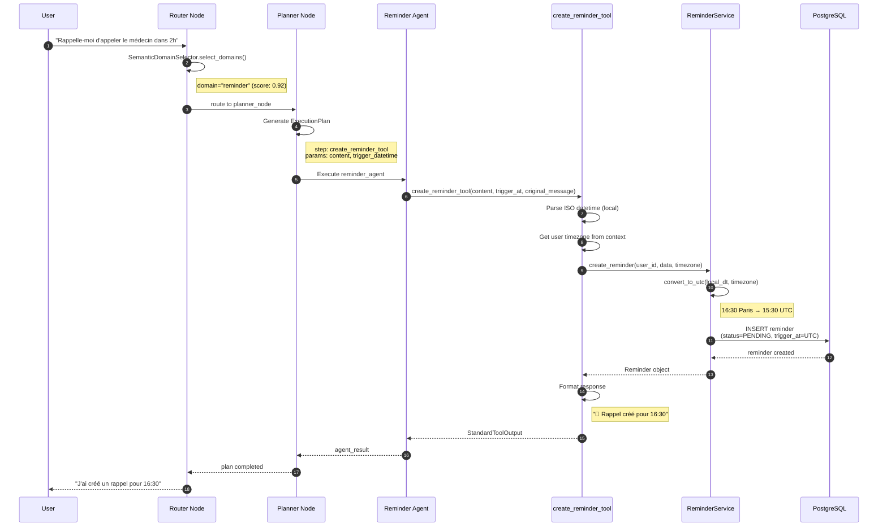
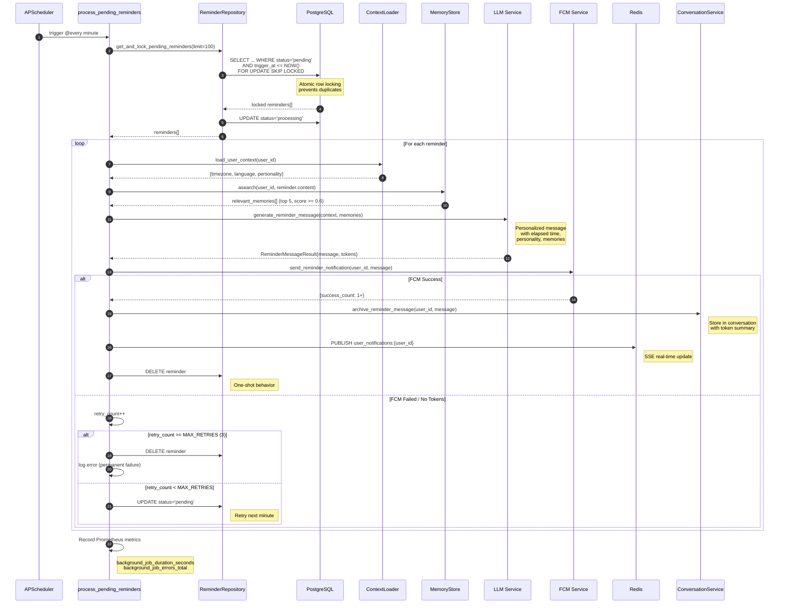
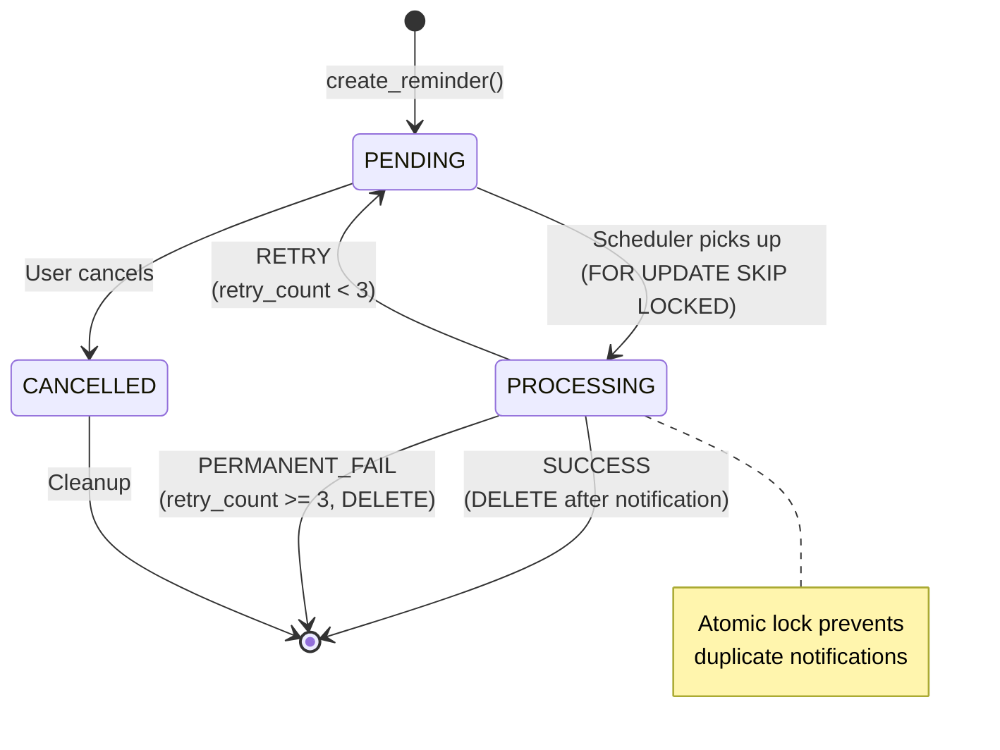
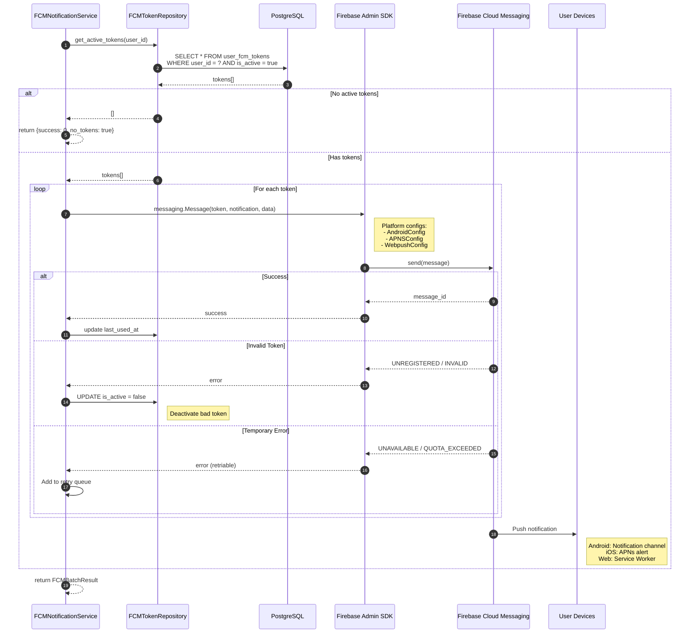
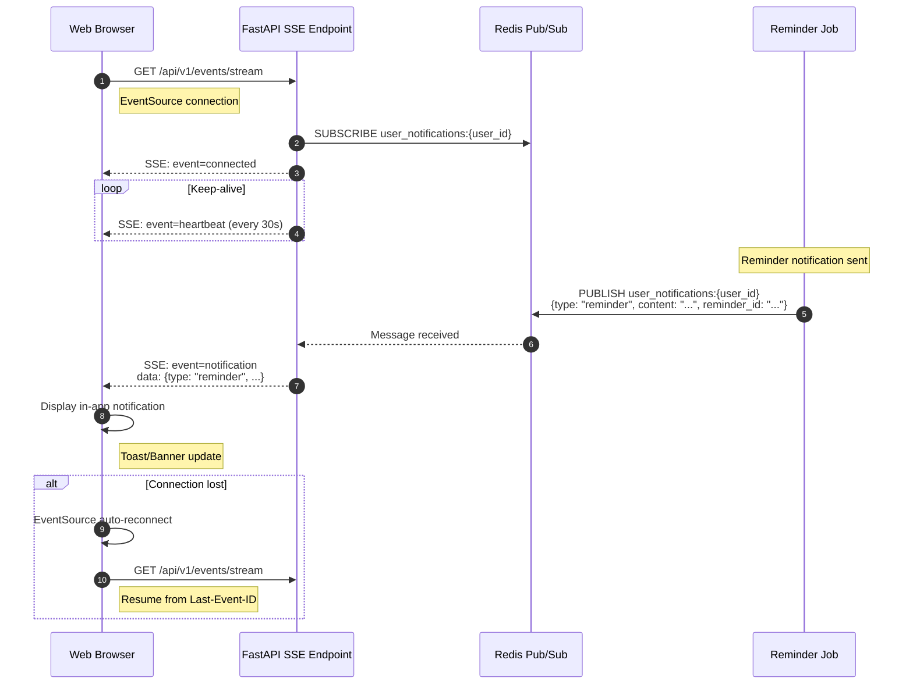
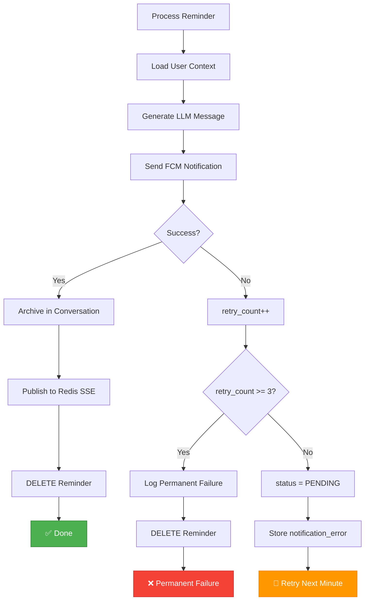
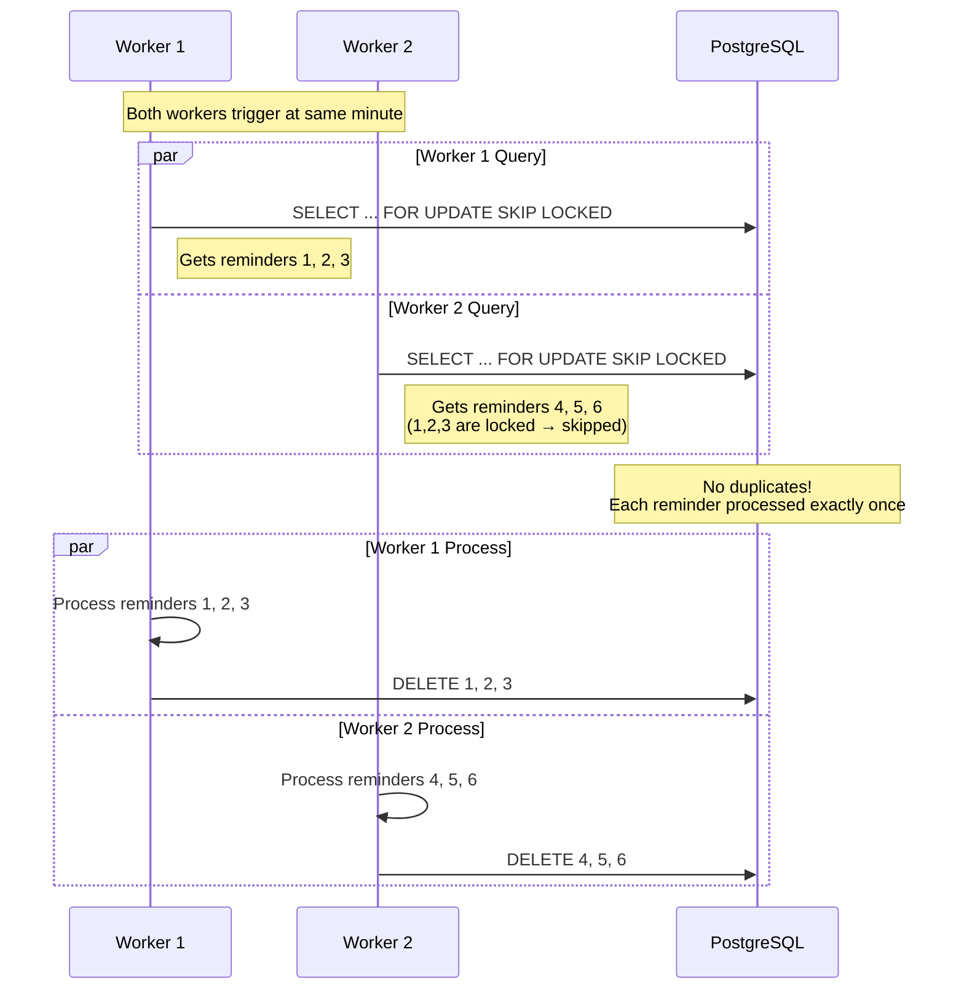

# Notifications Flow - Technical Documentation

> Documentation technique détaillée des flux de notifications dans LIA

**Related ADRs**: ADR-051 (Reminder & Notification System), ADR-046 (Background Job Scheduling)

---

## Table of Contents

1. [Overview](#overview)
2. [Reminder Creation Flow](#reminder-creation-flow)
3. [Reminder Notification Flow](#reminder-notification-flow)
4. [FCM Push Notification Flow](#fcm-push-notification-flow)
5. [SSE Real-time Flow](#sse-real-time-flow)
6. [Error Handling Flow](#error-handling-flow)
7. [Concurrency Handling](#concurrency-handling)

---

## Overview

Le système de notifications LIA gère deux types de notifications avec livraison multi-canal :

| Type | Trigger | Delivery | Use Case |
|------|---------|----------|----------|
| **Reminders** | Scheduled (trigger_at) | FCM Push + SSE + Channels (Telegram) | "Rappelle-moi de..." |
| **Proactive** | Interest detection | FCM Push + SSE + Channels (Telegram) | Actualités centres d'intérêt |
| **Real-time** | Immediate | SSE only | Status updates, typing indicators |

### Architecture Overview

```mermaid
graph TB
    subgraph "USER INTERACTION"
        USER[User] -->|"rappelle-moi de..."| AGENT[Agent Graph]
        AGENT -->|create| REMINDER[(Reminders DB)]
    end

    subgraph "BACKGROUND PROCESSING"
        SCHEDULER[APScheduler<br/>@every minute] -->|process| JOB[reminder_notification.py]
        JOB -->|lock & fetch| REMINDER
        JOB -->|generate| LLM[LLM Message]
        LLM -->|dispatch| DISPATCH[NotificationDispatcher]
        DISPATCH -->|Step 1| FCM[FCM Service]
        FCM -->|push| DEVICES[Mobile/Web Devices]
        DISPATCH -->|Step 2| REDIS[Redis Pub/Sub]
        REDIS -->|stream| SSE[SSE Endpoint]
        SSE -->|real-time| WEB[Web Browser]
        DISPATCH -->|Step 3| CONV[ConversationService]
        DISPATCH -->|Step 4| CHANNELS[Channel Senders]
        CHANNELS -->|Telegram API| TELEGRAM[Telegram Bot]
    end

    style JOB fill:#4CAF50,stroke:#2E7D32,color:#fff
    style FCM fill:#FF9800,stroke:#F57C00,color:#fff
    style LLM fill:#2196F3,stroke:#1565C0,color:#fff
    style CHANNELS fill:#9C27B0,stroke:#7B1FA2,color:#fff
    style TELEGRAM fill:#0088cc,stroke:#006699,color:#fff
```

---

## Reminder Creation Flow

### Sequence Diagram



### Data Transformations

```
INPUT (User Local Time):
┌─────────────────────────────────────────────────────────┐
│ trigger_datetime: "2025-12-28T16:30:00"  (naive, local) │
│ user_timezone: "Europe/Paris"                           │
└─────────────────────────────────────────────────────────┘
                            │
                            ▼
                   convert_to_utc()
                            │
                            ▼
┌─────────────────────────────────────────────────────────┐
│ trigger_at: "2025-12-28T15:30:00+00:00"  (UTC aware)    │
│ user_timezone: "Europe/Paris"  (stored for display)    │
└─────────────────────────────────────────────────────────┘
```

---

## Reminder Notification Flow

### Sequence Diagram



### State Machine



---

## FCM Push Notification Flow

### Sequence Diagram



### Platform-Specific Payloads

```json
// Android Notification
{
  "message": {
    "token": "device_token",
    "notification": {
      "title": "Rappel",
      "body": "N'oublie pas d'appeler le médecin !"
    },
    "android": {
      "priority": "high",
      "notification": {
        "click_action": "OPEN_CHAT",
        "channel_id": "reminders"
      }
    },
    "data": {
      "type": "reminder",
      "reminder_id": "550e8400-..."
    }
  }
}

// iOS (APNs) Notification
{
  "message": {
    "token": "device_token",
    "apns": {
      "payload": {
        "aps": {
          "alert": {
            "title": "Rappel",
            "body": "N'oublie pas d'appeler le médecin !"
          },
          "sound": "default",
          "badge": 1
        }
      }
    }
  }
}

// Web Push Notification
{
  "message": {
    "token": "device_token",
    "webpush": {
      "notification": {
        "title": "Rappel",
        "body": "N'oublie pas d'appeler le médecin !",
        "icon": "/icon-192x192.png",
        "requireInteraction": true
      }
    }
  }
}
```

---

## SSE Real-time Flow

### Sequence Diagram



### SSE Message Format

```
event: notification
data: {"type": "reminder", "content": "N'oublie pas d'appeler le médecin !", "reminder_id": "550e8400-e29b-41d4-a716-446655440000", "title": "Rappel"}
id: 1735398000000

event: heartbeat
data: {"timestamp": "2025-12-28T15:30:00Z"}
id: 1735398030000
```

### Client Implementation

```javascript
// Web client SSE subscription
const eventSource = new EventSource('/api/v1/events/stream', {
  withCredentials: true  // BFF pattern
});

eventSource.addEventListener('notification', (event) => {
  const data = JSON.parse(event.data);

  if (data.type === 'reminder') {
    // Show in-app notification
    showToast({
      title: data.title,
      message: data.content,
      type: 'reminder',
      onClick: () => scrollToMessage(data.reminder_id)
    });

    // Optional: Show browser notification
    if (Notification.permission === 'granted') {
      new Notification(data.title, {
        body: data.content,
        icon: '/icon-192x192.png'
      });
    }
  }
});

eventSource.addEventListener('heartbeat', () => {
  console.debug('SSE heartbeat received');
});

eventSource.onerror = (error) => {
  console.error('SSE connection error', error);
  // EventSource will auto-reconnect
};
```

---

## Error Handling Flow

### Retry Flow Diagram



### Error Categories

| Category | Example | Action | Retry? |
|----------|---------|--------|--------|
| **User Error** | Invalid timezone | Log + Skip | No |
| **LLM Error** | Timeout, Rate limit | Use fallback message | Yes |
| **FCM Error - Permanent** | Invalid token | Deactivate token | No |
| **FCM Error - Transient** | Quota exceeded | Retry later | Yes |
| **DB Error** | Connection lost | Rollback + Retry | Yes |

### Fallback Message Generation

```python
# If LLM generation fails, use simple fallback
async def generate_reminder_message(...) -> ReminderMessageResult:
    try:
        # Normal LLM generation with personality + memories
        return await _generate_with_llm(...)
    except Exception as e:
        logger.warning("reminder_llm_generation_failed", error=str(e))

        # Fallback: simple message without LLM
        if language == "fr":
            message = f"C'est l'heure ! Rappel ({created_at_text}) : {content}"
        else:
            message = f"It's time! Reminder ({created_at_text}): {content}"

        return ReminderMessageResult(
            message=message,
            tokens_in=0,
            tokens_out=0,
            tokens_cache=0,
            model_name="fallback",
        )
```

---

## Concurrency Handling

### Multi-Worker Scenario



### SQL Locking Strategy

```sql
-- Atomic SELECT + LOCK
SELECT r.*
FROM reminders r
WHERE r.status = 'pending'
  AND r.trigger_at <= NOW()
ORDER BY r.trigger_at ASC
LIMIT 100
FOR UPDATE SKIP LOCKED;

-- Key behaviors:
-- 1. FOR UPDATE: Locks selected rows
-- 2. SKIP LOCKED: Skips already-locked rows (other workers)
-- 3. LIMIT 100: Batch processing for efficiency
-- 4. ORDER BY trigger_at: Oldest first (fairness)
```

### Transaction Isolation

```python
async def get_and_lock_pending_reminders(self, limit: int = 100) -> list[Reminder]:
    """
    Transaction behavior:
    1. BEGIN TRANSACTION (implicit via SQLAlchemy session)
    2. SELECT ... FOR UPDATE SKIP LOCKED
    3. UPDATE status = 'processing'
    4. COMMIT (on context exit)

    If any step fails, ROLLBACK automatically.
    """
    stmt = (
        select(Reminder)
        .where(Reminder.status == ReminderStatus.PENDING.value)
        .where(Reminder.trigger_at <= datetime.now(UTC))
        .order_by(Reminder.trigger_at.asc())
        .limit(limit)
        .with_for_update(skip_locked=True)
    )

    result = await self.db.execute(stmt)
    reminders = list(result.scalars().all())

    # Transition to PROCESSING within same transaction
    for reminder in reminders:
        reminder.status = ReminderStatus.PROCESSING.value

    await self.db.flush()  # Still within transaction
    return reminders
```

---

## Prometheus Metrics

### Available Metrics

```python
# Job duration histogram
background_job_duration_seconds = Histogram(
    "background_job_duration_seconds",
    "Duration of background jobs",
    ["job_name"],
    buckets=[0.1, 0.5, 1, 2, 5, 10, 30, 60],
)

# Job error counter
background_job_errors_total = Counter(
    "background_job_errors_total",
    "Total background job errors",
    ["job_name"],
)

# Recommended additional metrics for reminders
reminder_notifications_sent_total = Counter(
    "reminder_notifications_sent_total",
    "Total reminder notifications sent",
    ["status"],  # success, failed, no_tokens
)

reminder_llm_generation_seconds = Histogram(
    "reminder_llm_generation_seconds",
    "LLM message generation latency",
    buckets=[0.5, 1, 2, 5, 10],
)

reminder_fcm_delivery_total = Counter(
    "reminder_fcm_delivery_total",
    "FCM delivery results",
    ["platform", "status"],  # android/ios/web, success/failed
)
```

### Grafana Dashboard Queries

```promql
# Reminder notifications per hour
sum(increase(reminder_notifications_sent_total[1h])) by (status)

# Average notification latency
histogram_quantile(0.95, rate(background_job_duration_seconds_bucket{job_name="reminder_notification"}[5m]))

# FCM success rate
sum(rate(reminder_fcm_delivery_total{status="success"}[1h])) /
sum(rate(reminder_fcm_delivery_total[1h])) * 100

# Pending reminders (requires custom gauge)
reminder_pending_count
```

---

## Troubleshooting Guide

### Common Issues

| Symptom | Possible Cause | Resolution |
|---------|---------------|------------|
| Reminder not triggering | Scheduler not running | Check `scheduler_started` log |
| Duplicate notifications | Missing FOR UPDATE SKIP LOCKED | Verify SQL query |
| No FCM push | No active tokens | Check user_fcm_tokens table |
| Wrong trigger time | Timezone mismatch | Verify UTC conversion |
| LLM message empty | LLM timeout | Check fallback generation |

### Debug Commands

```bash
# Check scheduler status
docker logs api 2>&1 | grep -E "(scheduler|reminder_notification)"

# Check pending reminders
psql -c "SELECT id, trigger_at, status, retry_count FROM reminders WHERE status = 'pending';"

# Check FCM tokens
psql -c "SELECT user_id, device_type, is_active, last_error FROM user_fcm_tokens WHERE user_id = 'xxx';"

# Check Redis pub/sub
redis-cli SUBSCRIBE "user_notifications:*"

# Check Prometheus metrics
curl http://localhost:8000/metrics | grep reminder
```

---

## Multi-Channel Delivery (evolution F3)

> Depuis la phase evolution F3, le `NotificationDispatcher` envoie les notifications vers les canaux de messagerie externes liés par l'utilisateur (Telegram, etc.), en plus de FCM et SSE.

### Pipeline NotificationDispatcher

Le dispatcher suit un pipeline séquentiel en 4 étapes :

| Étape | Service | Description |
|-------|---------|-------------|
| **Step 1** | FCM Service | Push notifications vers tous les devices enregistrés |
| **Step 2** | Redis Pub/Sub | Publication SSE pour mise à jour temps-réel dans le navigateur |
| **Step 3** | ConversationService | Archivage du message dans la conversation |
| **Step 4** | Channel Senders | Envoi vers canaux externes actifs (Telegram) |

### Step 4 — Channel Delivery

```python
# infrastructure/proactive/notification.py — _send_channels()
async def _send_channels(self, user_id, title, body, language):
    bindings = await repo.get_active_for_user(user_id)
    for binding in bindings:
        sender = _get_sender(binding.channel_type)   # TelegramSender
        message = format_notification(title, body)    # HTML-safe
        await sender.send_message(binding.channel_user_id, message)
```

- **Fail-safe** : les erreurs d'envoi canal sont loguées mais ne bloquent pas les autres étapes
- **Formatage** : `strip_html_cards()` retire les composants HTML web avant envoi Telegram
- **Métriques** : `channel_messages_sent_total{channel_type="telegram", direction="outbound"}`

### Configuration

| Variable | Description |
|----------|-------------|
| `CHANNELS_ENABLED` | Active/désactive le module channels global |
| `TELEGRAM_BOT_TOKEN` | Token du bot Telegram |
| `TELEGRAM_WEBHOOK_SECRET` | Secret pour validation signature webhook |

> Voir [CHANNELS_INTEGRATION.md](./CHANNELS_INTEGRATION.md) pour la documentation complète du module channels.

---

## Related Documentation

- [ADR-051: Reminder & Notification System](../architecture/ADR-051-Reminder-Notification-System.md)
- [ADR-046: Background Job Scheduling](../architecture/ADR-046-Background-Job-Scheduling.md)
- [CHANNELS_INTEGRATION.md](./CHANNELS_INTEGRATION.md)
- [README_REMINDERS.md](../readme/README_REMINDERS.md)
