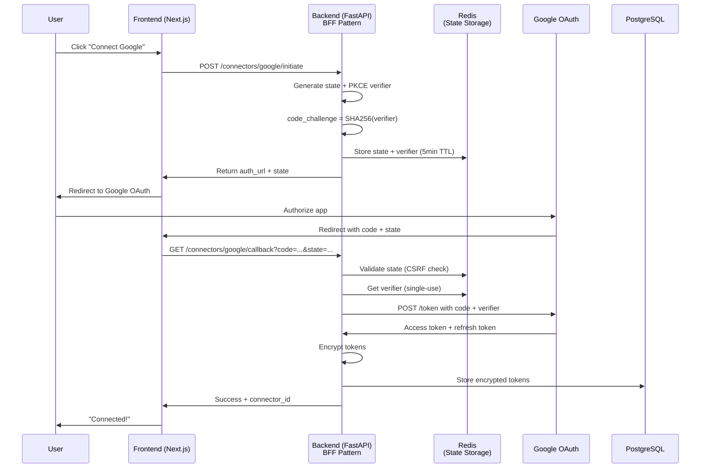
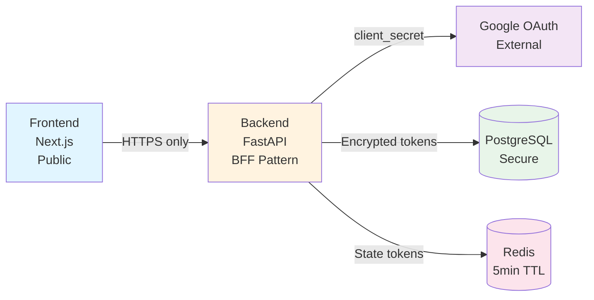
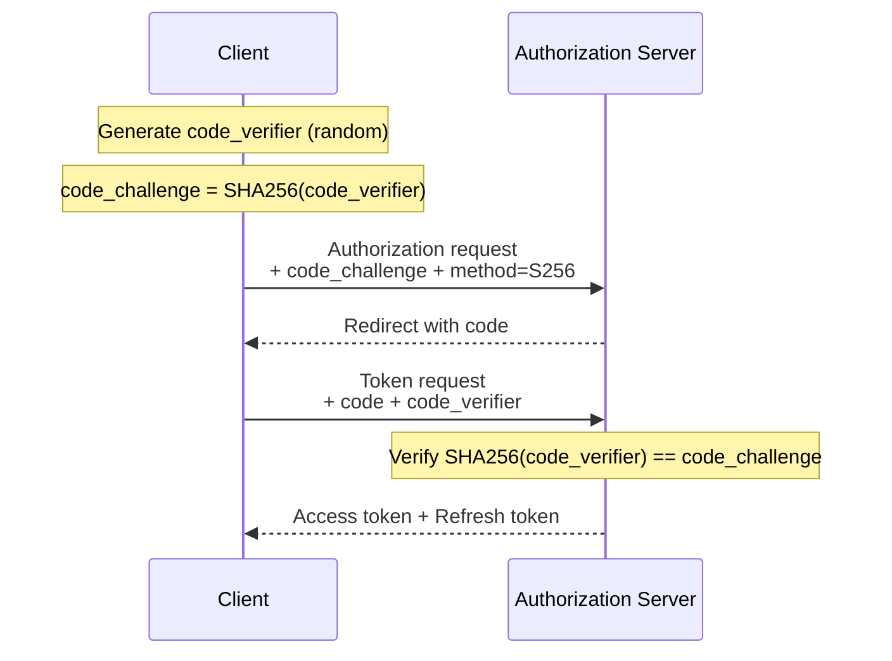

# OAUTH - OAuth 2.1 avec PKCE

> **Documentation complète de l'authentification OAuth 2.1 avec PKCE dans LIA**
>
> Version: 1.1
> Date: 2026-03-02
> Auteur: Documentation LIA

---

## 📋 Table des Matières

1. [Vue d'ensemble](#vue-densemble)
2. [Architecture OAuth](#architecture-oauth)
3. [OAuthFlowHandler](#oauthflowhandler)
4. [GoogleOAuthProvider](#googleoauthprovider)
5. [BFF Pattern](#bff-pattern)
6. [PKCE (Proof Key for Code Exchange)](#pkce-proof-key-for-code-exchange)
7. [State Token & CSRF Protection](#state-token--csrf-protection)
8. [Token Storage](#token-storage)
9. [Sécurité](#sécurité)
10. [Error Handling](#error-handling)
11. [Testing](#testing)
12. [Troubleshooting](#troubleshooting)
13. [MCP OAuth 2.1 (per-user)](#mcp-oauth-21-per-user)
14. [Annexes](#annexes)

---

## 📖 Vue d'ensemble

### Objectif

LIA implémente **OAuth 2.1** avec **PKCE (Proof Key for Code Exchange)** obligatoire pour sécuriser l'authentification et l'autorisation avec les services externes (Google Contacts, Gmail, etc.).

Ce système garantit:
- **PKCE S256** (SHA-256) pour prévenir interception du code d'autorisation
- **State token** unique pour protection CSRF
- **BFF Pattern** (Backend-for-Frontend) pour ne jamais exposer le `client_secret`
- **Token storage sécurisé** (encrypted PostgreSQL)
- **Single-use state tokens** (Redis avec TTL 5min)

### OAuth 2.1 vs OAuth 2.0

**Différences clés**:
- **PKCE obligatoire** (plus de flows sans PKCE)
- **Pas de implicit grant** (supprimé, insecure)
- **Redirect URI exact match** (pas de wildcard)
- **HTTPS obligatoire** en production

### Architecture Globale



### Principes de Sécurité

1. **Defense in Depth**: Multiple couches (PKCE + State + HTTPS + Encryption)
2. **Least Privilege**: Scopes minimums nécessaires
3. **Zero Trust**: Validation stricte à chaque étape
4. **Fail Secure**: Erreurs = échec sécurisé (pas de fallback insecure)

---

## 🏗️ Architecture OAuth

### Composants

**1. OAuthFlowHandler**
- Orchestrateur générique du flow OAuth
- Abstraction provider-agnostic
- Gère PKCE, state, token exchange

**2. OAuthProvider** (Protocol)
- Interface pour providers (Google, Microsoft, etc.)
- Configuration: `client_id`, `client_secret`, endpoints, scopes

**3. SessionService (Redis)**
- Stockage state tokens avec TTL
- Pattern single-use (suppression après lecture)

**4. Connectors Repository (PostgreSQL)**
- Stockage encrypted tokens
- User-connector mapping
- Expiration tracking

### Flow Complet

**Phase 1: Initiation**

```python
# 1. User clicks "Connect Google" on frontend
# 2. Frontend POST /api/v1/connectors/google-contacts/initiate

# Backend:
provider = GoogleOAuthProvider.for_contacts(settings)
handler = OAuthFlowHandler(provider, session_service)

auth_url, state = await handler.initiate_flow(
    additional_params={
        "access_type": "offline",  # Get refresh token
        "prompt": "consent"  # Force re-consent
    },
    metadata={
        "user_id": str(user.id),
        "connector_type": "google_contacts"
    }
)

# 3. Return to frontend
return {"authorization_url": auth_url, "state": state}

# 4. Frontend redirects user to authorization_url
```

**Phase 2: Autorisation Utilisateur**

```
User at Google:
1. Reviews scopes (contacts.readonly, contacts.other.readonly)
2. Clicks "Allow"
3. Google redirects to:
   https://api.lia-assistant.com/api/v1/connectors/google-contacts/callback?code=4/abc...&state=xyz...
```

**Phase 3: Token Exchange**

```python
# Frontend receives redirect, calls backend
# GET /api/v1/connectors/google-contacts/callback?code=...&state=...

# Backend:
tokens, metadata = await handler.handle_callback(code, state)

# tokens = OAuthTokenResponse(
#     access_token="ya29.a0...",
#     refresh_token="1//0g...",
#     expires_in=3600,
#     scope="https://www.googleapis.com/auth/contacts.readonly ...",
#     token_type="Bearer"
# )

# metadata = {
#     "user_id": "550e8400-...",
#     "connector_type": "google_contacts",
#     "provider": "google",
#     "timestamp": "2025-11-14T10:30:00Z"
# }
```

**Phase 4: Stockage**

```python
# Store in database
async with uow:
    connector = await uow.connectors.create(
        user_id=UUID(metadata["user_id"]),
        provider="google",
        connector_type="google_contacts",
        access_token=encrypt(tokens.access_token),  # Encrypted
        refresh_token=encrypt(tokens.refresh_token),  # Encrypted
        expires_at=datetime.utcnow() + timedelta(seconds=tokens.expires_in),
        scopes=tokens.scope.split(" ")
    )
    await uow.commit()

return {"success": True, "connector_id": str(connector.id)}
```

---

## 🔧 OAuthFlowHandler

### Code Complet

**Fichier source**: [apps/api/src/core/oauth/flow_handler.py](apps/api/src/core/oauth/flow_handler.py)

```python
from datetime import UTC, datetime
from typing import Any
from urllib.parse import urlencode

import httpx
from pydantic import BaseModel

from src.core.config import settings
from src.core.security.utils import (
    generate_code_challenge,
    generate_code_verifier,
    generate_state_token,
)
from src.infrastructure.cache.redis import SessionService

from .exceptions import (
    OAuthProviderError,
    OAuthStateValidationError,
    OAuthTokenExchangeError,
)
from .providers.base import OAuthProvider


class OAuthTokenResponse(BaseModel):
    """OAuth token response from provider."""

    access_token: str
    refresh_token: str | None = None
    expires_in: int | None = None
    scope: str | None = None
    token_type: str = "Bearer"
    id_token: str | None = None  # OpenID Connect

    class Config:
        frozen = True


class OAuthFlowHandler:
    """
    Generic OAuth 2.1 flow handler with PKCE.

    Best Practices Implemented:
    - PKCE (S256) mandatory
    - State token CSRF protection
    - Redis state storage with TTL
    - Single-use state tokens
    - Timeout protection
    - Structured logging
    """

    def __init__(self, provider: OAuthProvider, session_service: SessionService) -> None:
        """
        Initialize OAuth flow handler.

        Args:
            provider: OAuth provider configuration
            session_service: Session service for state storage
        """
        self.provider = provider
        self.session_service = session_service

    async def initiate_flow(
        self,
        additional_params: dict[str, str] | None = None,
        metadata: dict[str, str] | None = None,
    ) -> tuple[str, str]:
        """
        Initiate OAuth authorization flow with PKCE.

        This method:
        1. Generates crypto-secure state and PKCE verifier
        2. Stores state+verifier+metadata in Redis (5min TTL)
        3. Builds authorization URL with PKCE challenge

        Args:
            additional_params: Additional query params (e.g., access_type=offline, prompt=consent)
            metadata: Business logic metadata to store with state (e.g., user_id, connector_type)

        Returns:
            Tuple of (authorization_url, state_token)

        Example:
            >>> auth_url, state = await handler.initiate_flow(
            ...     additional_params={"access_type": "offline", "prompt": "consent"},
            ...     metadata={"user_id": "123", "connector_type": "gmail"},
            ... )
        """
        # === STEP 1: Generate cryptographically secure tokens ===
        state = generate_state_token()  # 32 bytes hex (64 chars)
        code_verifier = generate_code_verifier()  # 43-128 chars URL-safe
        code_challenge = generate_code_challenge(code_verifier)  # SHA-256

        # === STEP 2: Prepare state data with PKCE and metadata ===
        state_data = {
            "provider": self.provider.provider_name,
            "code_verifier": code_verifier,
            "timestamp": datetime.now(UTC).isoformat(),
        }

        # Merge business logic metadata if provided
        if metadata:
            state_data.update(metadata)

        # === STEP 3: Store state in Redis with short TTL ===
        await self.session_service.store_oauth_state(
            state,
            state_data,
            expire_minutes=5,  # Short-lived for security
        )

        logger.info(
            "oauth_state_stored",
            state=state,
            provider=self.provider.provider_name,
            ttl_minutes=5
        )

        # === STEP 4: Build authorization URL ===
        params = {
            "client_id": self.provider.client_id,
            "redirect_uri": self.provider.redirect_uri,
            "response_type": "code",
            "scope": " ".join(self.provider.scopes),
            "state": state,
            "code_challenge": code_challenge,
            "code_challenge_method": "S256",  # SHA-256 (most secure)
            **(additional_params or {}),  # Merge additional params
        }

        auth_url = f"{self.provider.authorization_endpoint}?{urlencode(params)}"

        logger.info(
            "oauth_flow_initiated",
            provider=self.provider.provider_name,
            state=state,
            scopes=self.provider.scopes,
            pkce=True,
        )

        return auth_url, state

    async def handle_callback(
        self,
        code: str,
        state: str,
    ) -> tuple[OAuthTokenResponse, dict[str, str]]:
        """
        Handle OAuth callback and exchange authorization code for tokens.

        This method:
        1. Validates state token (CSRF protection)
        2. Retrieves PKCE code_verifier + metadata from Redis
        3. Exchanges authorization code for access/refresh tokens
        4. Deletes state token (single-use)

        Args:
            code: Authorization code from provider
            state: State token from provider (must match stored state)

        Returns:
            Tuple of (OAuthTokenResponse, stored_state_metadata)

        Raises:
            OAuthStateValidationError: If state invalid or expired
            OAuthTokenExchangeError: If token exchange fails
            OAuthProviderError: If provider returns error

        Security:
        - State token validated against Redis (CSRF protection)
        - PKCE code_verifier required (prevents code interception)
        - State token deleted after use (single-use)
        - HTTP timeout protection (10s)
        """
        # === STEP 1: Validate state and retrieve PKCE verifier + metadata ===
        stored_state = await self._validate_state_and_get_verifier(state)

        # === STEP 2: Exchange authorization code for tokens ===
        token_data = await self._exchange_code_for_tokens(
            code, stored_state["code_verifier"]
        )

        # === STEP 3: Parse and return token response ===
        token_response = self._parse_token_response(token_data)

        # Note: State token already deleted by get_oauth_state() (single-use pattern)
        logger.info(
            "oauth_token_exchange_success",
            provider=self.provider.provider_name,
            state=state,
            has_refresh_token=token_data.get("refresh_token") is not None,
            expires_in=token_data.get("expires_in"),
        )

        return token_response, stored_state

    # === PRIVATE HELPER METHODS ===

    async def _validate_state_and_get_verifier(self, state: str) -> dict[str, Any]:
        """
        Validate OAuth state token and retrieve stored data including PKCE verifier.

        Args:
            state: State token from OAuth callback

        Returns:
            Stored state data containing code_verifier, provider, timestamp, and metadata

        Raises:
            OAuthStateValidationError: If state is invalid, expired, or provider mismatch
        """
        from src.infrastructure.observability.metrics_oauth import (
            oauth_pkce_validation_total,
            oauth_state_validation_total,
        )

        # Retrieve state from Redis (auto-deleted after retrieval for single-use pattern)
        stored_state = await self.session_service.get_oauth_state(state)

        if not stored_state:
            logger.warning(
                "oauth_invalid_state",
                provider=self.provider.provider_name,
                state=state,
            )
            # Track state validation failure
            oauth_state_validation_total.labels(
                provider=self.provider.provider_name, result="failed"
            ).inc()
            raise OAuthStateValidationError("Invalid or expired OAuth state token")

        # Verify provider matches (prevent cross-provider attacks)
        if stored_state.get("provider") != self.provider.provider_name:
            logger.warning(
                "oauth_provider_mismatch",
                expected=self.provider.provider_name,
                got=stored_state.get("provider"),
                state=state,
            )
            oauth_state_validation_total.labels(
                provider=self.provider.provider_name, result="failed"
            ).inc()
            raise OAuthStateValidationError("OAuth state provider mismatch")

        # Verify PKCE code_verifier exists (mandatory for security)
        code_verifier = stored_state.get("code_verifier")
        if not code_verifier:
            logger.error(
                "oauth_missing_code_verifier",
                provider=self.provider.provider_name,
                state=state,
            )
            oauth_pkce_validation_total.labels(
                provider=self.provider.provider_name, result="failed"
            ).inc()
            raise OAuthStateValidationError("PKCE code_verifier not found in state")

        # State validation succeeded
        oauth_state_validation_total.labels(
            provider=self.provider.provider_name, result="success"
        ).inc()

        oauth_pkce_validation_total.labels(
            provider=self.provider.provider_name, result="success"
        ).inc()

        logger.debug(
            "oauth_state_validated",
            provider=self.provider.provider_name,
            state=state,
            has_metadata=len(stored_state) > 3,
        )

        return stored_state

    async def _exchange_code_for_tokens(
        self, code: str, code_verifier: str
    ) -> dict[str, Any]:
        """
        Exchange authorization code for access/refresh tokens with PKCE verification.

        Args:
            code: Authorization code from OAuth provider
            code_verifier: PKCE code verifier (proves client initiated the flow)

        Returns:
            Token data dictionary from provider

        Raises:
            OAuthTokenExchangeError: If token exchange fails
        """
        async with httpx.AsyncClient(timeout=settings.http_timeout_oauth) as client:
            try:
                response = await client.post(
                    self.provider.token_endpoint,
                    data={
                        "code": code,
                        "client_id": self.provider.client_id,
                        "client_secret": self.provider.client_secret,
                        "redirect_uri": self.provider.redirect_uri,
                        "grant_type": "authorization_code",
                        "code_verifier": code_verifier,  # PKCE verification
                    },
                    headers={"Accept": "application/json"},
                )
                response.raise_for_status()
                return response.json()

            except httpx.HTTPStatusError as e:
                error_detail = e.response.text if e.response else str(e)
                logger.error(
                    "oauth_token_exchange_failed",
                    provider=self.provider.provider_name,
                    status_code=e.response.status_code if e.response else None,
                    error_detail=error_detail,
                )
                raise OAuthTokenExchangeError(
                    f"Token exchange failed with status {e.response.status_code if e.response else 'unknown'}",
                    original_error=e,
                ) from e

            except httpx.RequestError as e:
                logger.error(
                    "oauth_token_exchange_network_error",
                    provider=self.provider.provider_name,
                    error=str(e),
                )
                raise OAuthTokenExchangeError(
                    "Network error during token exchange",
                    original_error=e,
                ) from e

    def _parse_token_response(self, token_data: dict[str, Any]) -> OAuthTokenResponse:
        """
        Parse and validate token response from OAuth provider.

        Args:
            token_data: Raw token data from provider

        Returns:
            Validated OAuthTokenResponse object

        Raises:
            OAuthProviderError: If required fields are missing
        """
        try:
            return OAuthTokenResponse(
                access_token=token_data["access_token"],
                refresh_token=token_data.get("refresh_token"),
                expires_in=token_data.get("expires_in"),
                scope=token_data.get("scope"),
                token_type=token_data.get("token_type", "Bearer"),
                id_token=token_data.get("id_token"),  # OpenID Connect
            )
        except KeyError as e:
            logger.error(
                "oauth_invalid_token_response",
                provider=self.provider.provider_name,
                missing_field=str(e),
                token_data=token_data,
            )
            raise OAuthProviderError(
                f"Invalid token response from provider: missing {e}",
                provider_response=token_data,
            ) from e

    async def revoke_token(
        self,
        token: str,
        token_type: str = "access_token",
    ) -> None:
        """
        Revoke an OAuth token (best effort).

        Args:
            token: Token to revoke (access_token or refresh_token)
            token_type: Type hint for provider

        Note:
            Token revocation is best-effort. Even if revocation fails,
            the token should be considered revoked locally.
        """
        if not self.provider.revocation_endpoint:
            logger.warning(
                "oauth_revocation_unsupported",
                provider=self.provider.provider_name,
            )
            return

        async with httpx.AsyncClient(timeout=settings.http_timeout_token) as client:
            try:
                response = await client.post(
                    self.provider.revocation_endpoint,
                    data={
                        "token": token,
                        "token_type_hint": token_type,
                    },
                    auth=(self.provider.client_id, self.provider.client_secret),
                )
                response.raise_for_status()

                logger.info(
                    "oauth_token_revoked",
                    provider=self.provider.provider_name,
                    token_type=token_type,
                )

            except Exception as e:
                # Best effort - don't fail on revocation errors
                logger.error(
                    "oauth_revocation_failed",
                    provider=self.provider.provider_name,
                    token_type=token_type,
                    error=str(e),
                    exc_info=True,
                )
```

### Méthodes Clés

#### **initiate_flow()**

**Responsabilité**: Démarrer le flow OAuth

**Étapes**:
1. Generate state token (32 bytes hex)
2. Generate PKCE verifier (43-128 chars)
3. Generate PKCE challenge = SHA256(verifier)
4. Store state + verifier + metadata in Redis (5min TTL)
5. Build authorization URL with challenge
6. Return (auth_url, state)

**Paramètres additionnels Google**:
```python
additional_params = {
    "access_type": "offline",  # Get refresh token
    "prompt": "consent"  # Force re-consent (ensures refresh token)
}
```

#### **handle_callback()**

**Responsabilité**: Exchange code for tokens

**Étapes**:
1. Validate state token from Redis
2. Get code_verifier from state
3. POST to token endpoint with code + verifier
4. Parse token response
5. Delete state from Redis (single-use)
6. Return (tokens, metadata)

**PKCE Verification**:
- Provider calculates SHA256(code_verifier) = code_challenge_received
- Compares with code_challenge from authorization request
- If match: tokens issued
- If not: error "invalid_grant"

---

## 🌐 GoogleOAuthProvider

### Code Complet

**Fichier source**: [apps/api/src/core/oauth/providers/google.py](apps/api/src/core/oauth/providers/google.py)

```python
from dataclasses import dataclass

from src.core.config import Settings
from src.core.constants import (
    API_PREFIX_DEFAULT,
    GOOGLE_SCOPE_CONTACTS_READONLY,
    GOOGLE_SCOPE_GMAIL_READONLY,
)

# Google Contacts API scopes
GOOGLE_CONTACTS_SCOPES = [
    GOOGLE_SCOPE_CONTACTS_READONLY,  # "https://www.googleapis.com/auth/contacts.readonly"
    "https://www.googleapis.com/auth/contacts.other.readonly",
]

# Gmail API scopes
GOOGLE_GMAIL_SCOPES = [
    GOOGLE_SCOPE_GMAIL_READONLY,  # "https://mail.google.com/"
    "https://www.googleapis.com/auth/gmail.send",
]


@dataclass
class GoogleOAuthProvider:
    """
    Google OAuth 2.0 provider configuration.

    Best Practices:
    - Always use PKCE (S256)
    - Request offline_access for refresh tokens
    - Use prompt=consent to force re-consent (gets refresh token)
    """

    client_id: str
    client_secret: str
    redirect_uri: str
    scopes: list[str]
    authorization_endpoint: str = "https://accounts.google.com/o/oauth2/v2/auth"
    token_endpoint: str = "https://oauth2.googleapis.com/token"
    revocation_endpoint: str = "https://oauth2.googleapis.com/revoke"
    provider_name: str = "google"

    @classmethod
    def for_authentication(cls, settings: Settings) -> "GoogleOAuthProvider":
        """
        Create provider config for user authentication (OpenID Connect).

        Scopes: openid, email, profile
        """
        return cls(
            client_id=settings.google_client_id,
            client_secret=settings.google_client_secret,
            redirect_uri=settings.google_redirect_uri,
            scopes=["openid", "email", "profile"],
        )

    @classmethod
    def for_gmail(cls, settings: Settings) -> "GoogleOAuthProvider":
        """
        Create provider config for Gmail connector.

        Scopes: gmail.readonly, gmail.send
        """
        return cls(
            client_id=settings.google_client_id,
            client_secret=settings.google_client_secret,
            redirect_uri=f"{settings.api_url}{API_PREFIX_DEFAULT}/connectors/gmail/callback",
            scopes=GOOGLE_GMAIL_SCOPES,
        )

    @classmethod
    def for_contacts(cls, settings: Settings) -> "GoogleOAuthProvider":
        """
        Create provider config for Google Contacts connector.

        Scopes: contacts.readonly, contacts.other.readonly
        """
        return cls(
            client_id=settings.google_client_id,
            client_secret=settings.google_client_secret,
            redirect_uri=f"{settings.api_url}{API_PREFIX_DEFAULT}/connectors/google-contacts/callback",
            scopes=GOOGLE_CONTACTS_SCOPES,
        )
```

### Scopes Google

#### **Contacts**

```python
GOOGLE_CONTACTS_SCOPES = [
    "https://www.googleapis.com/auth/contacts.readonly",  # Read contacts
    "https://www.googleapis.com/auth/contacts.other.readonly"  # Read "Other Contacts"
]
```

**Justification**:
- `contacts.readonly`: Accès lecture aux contacts utilisateur
- `contacts.other.readonly`: Accès "Other Contacts" (contacts non explicitement ajoutés)

#### **Gmail**

```python
GOOGLE_GMAIL_SCOPES = [
    "https://mail.google.com/",  # Full Gmail access (read)
    "https://www.googleapis.com/auth/gmail.send"  # Send emails
]
```

#### **Authentication**

```python
GOOGLE_AUTH_SCOPES = [
    "openid",  # OpenID Connect
    "email",  # User email
    "profile"  # User profile (name, photo)
]
```

### Endpoints Google

```python
authorization_endpoint = "https://accounts.google.com/o/oauth2/v2/auth"
token_endpoint = "https://oauth2.googleapis.com/token"
revocation_endpoint = "https://oauth2.googleapis.com/revoke"
```

---

## 🏛️ BFF Pattern

### Architecture

**BFF (Backend-for-Frontend)**: Le backend agit comme proxy entre le frontend et Google OAuth.



### Pourquoi BFF?

**Problème sans BFF**:
```javascript
// Frontend (INSECURE - DON'T DO THIS)
const clientSecret = "GOCSPX-abc123...";  // EXPOSED IN BUNDLE!

const tokenResponse = await fetch("https://oauth2.googleapis.com/token", {
    method: "POST",
    body: JSON.stringify({
        code: authorizationCode,
        client_id: clientId,
        client_secret: clientSecret,  // LEAKED!
        redirect_uri: redirectUri,
        grant_type: "authorization_code"
    })
});
```

**Solution avec BFF**:
```typescript
// Frontend (SECURE)
// 1. Initiate flow
const { authorization_url, state } = await fetch("/api/v1/connectors/google-contacts/initiate", {
    method: "POST"
}).then(r => r.json());

// 2. Redirect to authorization_url
window.location.href = authorization_url;

// 3. Google redirects back to /callback?code=...&state=...
// 4. Backend handles callback (client_secret NEVER exposed)
const { success, connector_id } = await fetch(`/api/v1/connectors/google-contacts/callback?code=${code}&state=${state}`)
    .then(r => r.json());
```

### Bénéfices BFF

1. **client_secret jamais exposé** (reste sur backend)
2. **State management sécurisé** (Redis backend, pas LocalStorage)
3. **Token storage sécurisé** (PostgreSQL encrypted, pas frontend)
4. **CSRF protection** (state token validé backend)
5. **Rate limiting** (backend contrôle)

### Endpoints BFF

```python
# POST /api/v1/connectors/google-contacts/initiate
# Returns: {"authorization_url": "...", "state": "..."}

# GET /api/v1/connectors/google-contacts/callback?code=...&state=...
# Returns: {"success": true, "connector_id": "..."}

# POST /api/v1/connectors/{connector_id}/refresh
# Returns: {"access_token": "...", "expires_at": "..."}

# DELETE /api/v1/connectors/{connector_id}/disconnect
# Returns: {"success": true}
```

---

## 🔐 PKCE (Proof Key for Code Exchange)

### Principe

**Problème sans PKCE**:
Un attaquant peut intercepter le `code` d'autorisation et l'échanger contre des tokens.

**Solution PKCE**:
Le client prouve qu'il a initié le flow en fournissant le `code_verifier`.

### Flow PKCE



### Implémentation

**Step 1: Generate code_verifier**

```python
# src/core/security.py

import secrets
import base64

def generate_code_verifier() -> str:
    """
    Generate PKCE code verifier (RFC 7636).

    Returns:
        43-128 character URL-safe string
    """
    # Generate 32 random bytes
    random_bytes = secrets.token_bytes(32)

    # Base64 URL-safe encode (no padding)
    verifier = base64.urlsafe_b64encode(random_bytes).decode("utf-8").rstrip("=")

    return verifier  # Length: 43 characters
```

**Step 2: Generate code_challenge**

```python
import hashlib

def generate_code_challenge(verifier: str) -> str:
    """
    Generate PKCE code challenge from verifier (RFC 7636).

    Args:
        verifier: Code verifier (43-128 chars)

    Returns:
        Base64 URL-safe encoded SHA-256 hash
    """
    # SHA-256 hash of verifier
    digest = hashlib.sha256(verifier.encode("utf-8")).digest()

    # Base64 URL-safe encode (no padding)
    challenge = base64.urlsafe_b64encode(digest).decode("utf-8").rstrip("=")

    return challenge
```

**Step 3: Store verifier in Redis**

```python
# initiate_flow()
code_verifier = generate_code_verifier()
code_challenge = generate_code_challenge(code_verifier)

await session_service.store_oauth_state(
    state,
    {
        "provider": "google",
        "code_verifier": code_verifier,  # Stored for later
        "timestamp": datetime.utcnow().isoformat()
    },
    expire_minutes=5
)

# Build auth URL with code_challenge
params = {
    "code_challenge": code_challenge,
    "code_challenge_method": "S256",  # SHA-256
    ...
}
```

**Step 4: Exchange code with verifier**

```python
# handle_callback()
stored_state = await session_service.get_oauth_state(state)
code_verifier = stored_state["code_verifier"]

# POST to token endpoint
response = await client.post(
    token_endpoint,
    data={
        "code": code,
        "code_verifier": code_verifier,  # Provider verifies
        "client_id": client_id,
        "client_secret": client_secret,
        "grant_type": "authorization_code",
        "redirect_uri": redirect_uri
    }
)

# Provider validates: SHA256(code_verifier) == code_challenge
# If match: returns tokens
# If not: error "invalid_grant"
```

### Sécurité PKCE

**Protection contre**:
- **Authorization code interception**: Attaquant ne peut pas utiliser le code sans code_verifier
- **Code injection**: Verifier prouve que le client a initié le flow

**Méthodes PKCE**:
- **S256** (SHA-256): Recommandé, secure
- **plain** (deprecated): Ne pas utiliser, insecure

**LIA**: Utilise **exclusivement S256**.

---

## 🛡️ State Token & CSRF Protection

### Principe

**State token** protège contre CSRF (Cross-Site Request Forgery) attacks.

**Scénario d'attaque sans state**:
1. Attaquant initie OAuth flow pour sa propre account
2. Obtient `code` d'autorisation
3. Envoie victime vers: `https://lia-assistant.com/callback?code=ATTACKER_CODE`
4. Victime connecte account de l'attaquant à son profil LIA
5. Attaquant accède aux données de la victime

**Protection avec state**:
- Client génère state token unique par flow
- Stocke state en session (Redis backend)
- Provider renvoie state dans callback
- Backend valide state match
- Si mismatch: reject

### Implémentation

**Generate state token**:

```python
# src/core/security.py

def generate_state_token() -> str:
    """
    Generate cryptographically secure state token for OAuth CSRF protection.

    Returns:
        32-byte hex string (64 characters)
    """
    return secrets.token_hex(32)  # 32 bytes = 64 hex chars
```

**Store in Redis**:

```python
# src/infrastructure/cache/session_store.py

class SessionService:
    async def store_oauth_state(
        self,
        state: str,
        data: dict[str, str],
        expire_minutes: int = 5
    ) -> None:
        """
        Store OAuth state with TTL.

        Args:
            state: State token (key)
            data: Data to store (code_verifier, metadata, etc.)
            expire_minutes: TTL in minutes (default: 5)
        """
        key = f"oauth:state:{state}"
        await self.redis.setex(
            key,
            expire_minutes * 60,
            json.dumps(data)
        )

    async def get_oauth_state(self, state: str) -> dict[str, str] | None:
        """
        Get and DELETE OAuth state (single-use pattern).

        Args:
            state: State token

        Returns:
            Stored data or None if not found/expired

        Note:
            State is deleted after retrieval (single-use).
        """
        key = f"oauth:state:{state}"

        # Get value
        data = await self.redis.get(key)

        if not data:
            return None

        # DELETE immediately (single-use)
        await self.redis.delete(key)

        return json.loads(data)
```

**Validate in callback**:

```python
# handle_callback()

# 1. Get state from callback
state_from_callback = request.query_params["state"]

# 2. Retrieve from Redis (auto-deleted)
stored_state = await session_service.get_oauth_state(state_from_callback)

# 3. Validate exists
if not stored_state:
    raise OAuthStateValidationError("Invalid or expired state")

# 4. Validate provider match
if stored_state["provider"] != provider.provider_name:
    raise OAuthStateValidationError("Provider mismatch")

# 5. State validated ✓
# Continue with token exchange...
```

### Sécurité State

**Single-use pattern**:
- State supprimé après lecture (Redis DELETE)
- Replay attack impossible

**Short TTL**:
- 5 minutes expiration
- Limite window d'attaque

**Provider match**:
- Vérifie que provider callback = provider initiator
- Prévient cross-provider attacks

---

## 🗄️ Token Storage

### Architecture

**Tokens stockés**:
- `access_token`: Short-lived (1 heure)
- `refresh_token`: Long-lived (optionnel)
- `expires_at`: Timestamp expiration

**Stockage**:
- PostgreSQL table `connectors`
- **Encryption at rest** (AES-256)
- User-connector mapping

### Database Schema

```sql
CREATE TABLE connectors (
    id UUID PRIMARY KEY DEFAULT uuid_generate_v4(),
    user_id UUID NOT NULL REFERENCES users(id) ON DELETE CASCADE,
    provider VARCHAR(50) NOT NULL,  -- 'google', 'microsoft', etc.
    connector_type VARCHAR(50) NOT NULL,  -- 'google_contacts', 'gmail', etc.
    access_token TEXT NOT NULL,  -- Encrypted
    refresh_token TEXT,  -- Encrypted (may be NULL)
    expires_at TIMESTAMP,  -- Token expiration
    scopes TEXT[],  -- Array of scopes
    is_active BOOLEAN DEFAULT TRUE,
    created_at TIMESTAMP DEFAULT NOW(),
    updated_at TIMESTAMP DEFAULT NOW(),
    UNIQUE(user_id, connector_type)
);

CREATE INDEX idx_connectors_user_id ON connectors(user_id);
CREATE INDEX idx_connectors_expires_at ON connectors(expires_at);
```

### Encryption

**Algorithme**: AES-256-GCM

**Clé encryption**: `ENCRYPTION_KEY` env var (32 bytes)

**Implementation**:

```python
# src/core/security.py

from cryptography.fernet import Fernet

def encrypt_token(token: str, encryption_key: bytes) -> str:
    """
    Encrypt token using Fernet (AES-256-GCM).

    Args:
        token: Token to encrypt
        encryption_key: 32-byte encryption key

    Returns:
        Base64-encoded encrypted token
    """
    fernet = Fernet(encryption_key)
    encrypted = fernet.encrypt(token.encode("utf-8"))
    return encrypted.decode("utf-8")

def decrypt_token(encrypted_token: str, encryption_key: bytes) -> str:
    """
    Decrypt token using Fernet.

    Args:
        encrypted_token: Base64-encoded encrypted token
        encryption_key: 32-byte encryption key

    Returns:
        Decrypted token

    Raises:
        InvalidToken: If decryption fails
    """
    fernet = Fernet(encryption_key)
    decrypted = fernet.decrypt(encrypted_token.encode("utf-8"))
    return decrypted.decode("utf-8")
```

**Usage**:

```python
# Store connector
async def create_connector(
    user_id: UUID,
    provider: str,
    access_token: str,
    refresh_token: str | None,
    expires_in: int,
    scopes: list[str]
) -> Connector:
    """Create connector with encrypted tokens."""

    # Encrypt tokens
    encrypted_access = encrypt_token(access_token, settings.encryption_key)
    encrypted_refresh = encrypt_token(refresh_token, settings.encryption_key) if refresh_token else None

    # Calculate expiration
    expires_at = datetime.utcnow() + timedelta(seconds=expires_in)

    # Insert
    async with uow:
        connector = await uow.connectors.create(
            user_id=user_id,
            provider=provider,
            access_token=encrypted_access,
            refresh_token=encrypted_refresh,
            expires_at=expires_at,
            scopes=scopes
        )
        await uow.commit()

    return connector

# Retrieve connector
async def get_connector(connector_id: UUID) -> Connector:
    """Get connector with decrypted tokens."""

    async with uow:
        connector = await uow.connectors.get_by_id(connector_id)

        if not connector:
            raise ConnectorNotFoundError()

        # Decrypt tokens
        connector.access_token = decrypt_token(connector.access_token, settings.encryption_key)

        if connector.refresh_token:
            connector.refresh_token = decrypt_token(connector.refresh_token, settings.encryption_key)

    return connector
```

### Token Refresh

**Refresh flow**:

```python
async def refresh_access_token(connector_id: UUID) -> str:
    """
    Refresh access token using refresh token.

    Args:
        connector_id: Connector ID

    Returns:
        New access token

    Raises:
        ConnectorNotFoundError: If connector doesn't exist
        OAuthTokenRefreshError: If refresh fails
    """
    # 1. Get connector
    async with uow:
        connector = await uow.connectors.get_by_id(connector_id)

        if not connector:
            raise ConnectorNotFoundError()

        # Decrypt tokens
        refresh_token = decrypt_token(connector.refresh_token, settings.encryption_key)

    # 2. Refresh with provider
    provider = GoogleOAuthProvider.for_contacts(settings)

    async with httpx.AsyncClient(timeout=10.0) as client:
        response = await client.post(
            provider.token_endpoint,
            data={
                "client_id": provider.client_id,
                "client_secret": provider.client_secret,
                "refresh_token": refresh_token,
                "grant_type": "refresh_token"
            }
        )
        response.raise_for_status()
        token_data = response.json()

    # 3. Update connector
    new_access_token = token_data["access_token"]
    new_expires_at = datetime.utcnow() + timedelta(seconds=token_data["expires_in"])

    encrypted_access = encrypt_token(new_access_token, settings.encryption_key)

    async with uow:
        connector.access_token = encrypted_access
        connector.expires_at = new_expires_at
        await uow.commit()

    logger.info("token_refreshed", connector_id=connector_id)

    return new_access_token
```

---

## 🔒 Sécurité

### Checklist Sécurité

#### 1. **PKCE Obligatoire**
- ✅ S256 (SHA-256) utilisé
- ✅ code_verifier stocké sécurisé (Redis)
- ✅ code_challenge envoyé à provider
- ✅ code_verifier envoyé au token exchange

#### 2. **State Token**
- ✅ 32 bytes cryptographically secure
- ✅ Single-use (deleted after validation)
- ✅ Short TTL (5 minutes)
- ✅ Provider mismatch check

#### 3. **HTTPS Obligatoire**
- ✅ Production: HTTPS only
- ✅ Development: HTTP allowed (localhost)
- ✅ Redirect URI: HTTPS enforced

#### 4. **Token Encryption**
- ✅ AES-256-GCM (Fernet)
- ✅ Encryption key 32 bytes
- ✅ Tokens encrypted at rest
- ✅ Decryption only when needed

#### 5. **client_secret Protection**
- ✅ Backend only (BFF Pattern)
- ✅ Never exposed to frontend
- ✅ Environment variable
- ✅ Not in git

#### 6. **Scopes Minimum**
- ✅ Least privilege principle
- ✅ Only scopes nécessaires
- ✅ Contacts: readonly only
- ✅ Gmail: specific scopes

#### 7. **Timeout Protection**
- ✅ HTTP requests: 10s timeout
- ✅ State tokens: 5min TTL
- ✅ Access tokens: 1h expiration

#### 8. **Logging & Monitoring**
- ✅ Structured logging (structlog)
- ✅ Prometheus metrics
- ✅ PII filtering (no tokens logged)
- ✅ Security events tracked

### OWASP Top 10 Mitigation

**A01 - Broken Access Control**:
- ✅ User-connector isolation (user_id check)
- ✅ Tokens encrypted per user

**A02 - Cryptographic Failures**:
- ✅ HTTPS enforced
- ✅ AES-256-GCM encryption
- ✅ Secure random generation

**A03 - Injection**:
- ✅ Parameterized queries (SQLAlchemy)
- ✅ No user input in OAuth flow

**A04 - Insecure Design**:
- ✅ PKCE + State (defense in depth)
- ✅ BFF Pattern (secure architecture)

**A05 - Security Misconfiguration**:
- ✅ Secrets in env vars
- ✅ HTTPS enforced prod
- ✅ Secure defaults

**A07 - Identification and Authentication Failures**:
- ✅ OAuth 2.1 best practices
- ✅ Single-use tokens
- ✅ Short TTLs

---

## ❌ Error Handling

### Exceptions

```python
# src/core/oauth/exceptions.py

class OAuthError(Exception):
    """Base OAuth exception."""
    pass

class OAuthStateValidationError(OAuthError):
    """State token validation failed."""
    pass

class OAuthTokenExchangeError(OAuthError):
    """Token exchange failed."""
    def __init__(self, message: str, original_error: Exception | None = None):
        super().__init__(message)
        self.original_error = original_error

class OAuthProviderError(OAuthError):
    """Provider returned error."""
    def __init__(self, message: str, provider_response: dict | None = None):
        super().__init__(message)
        self.provider_response = provider_response

class OAuthTokenRefreshError(OAuthError):
    """Token refresh failed."""
    pass
```

### Error Responses

```python
# Example error responses

# State validation error
{
    "error": "invalid_state",
    "error_description": "OAuth state token is invalid or expired",
    "status_code": 400
}

# Token exchange error
{
    "error": "token_exchange_failed",
    "error_description": "Failed to exchange authorization code for tokens",
    "provider_error": "invalid_grant",
    "status_code": 400
}

# Provider mismatch
{
    "error": "provider_mismatch",
    "error_description": "OAuth provider does not match expected provider",
    "status_code": 400
}
```

---

## 🧪 Testing

### Unit Tests

```python
# tests/core/oauth/test_flow_handler.py

import pytest
from unittest.mock import AsyncMock, Mock

from src.core.oauth.flow_handler import OAuthFlowHandler
from src.core.oauth.providers.google import GoogleOAuthProvider


@pytest.mark.asyncio
async def test_initiate_flow():
    """Test OAuth flow initiation."""

    # Mock provider
    provider = GoogleOAuthProvider(
        client_id="test_client",
        client_secret="test_secret",
        redirect_uri="http://localhost/callback",
        scopes=["scope1", "scope2"]
    )

    # Mock session service
    session_service = Mock()
    session_service.store_oauth_state = AsyncMock()

    # Create handler
    handler = OAuthFlowHandler(provider, session_service)

    # Initiate flow
    auth_url, state = await handler.initiate_flow(
        additional_params={"prompt": "consent"},
        metadata={"user_id": "123"}
    )

    # Assertions
    assert "accounts.google.com" in auth_url
    assert "code_challenge=" in auth_url
    assert "code_challenge_method=S256" in auth_url
    assert f"state={state}" in auth_url

    # Verify state stored
    session_service.store_oauth_state.assert_called_once()
    call_args = session_service.store_oauth_state.call_args
    assert call_args[0][0] == state  # state token
    assert "code_verifier" in call_args[0][1]  # state data
    assert call_args[1]["expire_minutes"] == 5


@pytest.mark.asyncio
async def test_handle_callback_success():
    """Test successful OAuth callback handling."""

    provider = GoogleOAuthProvider(...)
    session_service = Mock()

    # Mock state validation
    session_service.get_oauth_state = AsyncMock(return_value={
        "provider": "google",
        "code_verifier": "test_verifier_abc123...",
        "user_id": "123"
    })

    handler = OAuthFlowHandler(provider, session_service)

    # Mock HTTP client
    with patch("httpx.AsyncClient") as mock_client:
        mock_response = Mock()
        mock_response.status_code = 200
        mock_response.json.return_value = {
            "access_token": "ya29.abc...",
            "refresh_token": "1//0g...",
            "expires_in": 3600,
            "scope": "scope1 scope2"
        }
        mock_client.return_value.__aenter__.return_value.post = AsyncMock(return_value=mock_response)

        # Handle callback
        tokens, metadata = await handler.handle_callback(
            code="test_code",
            state="test_state"
        )

    # Assertions
    assert tokens.access_token == "ya29.abc..."
    assert tokens.refresh_token == "1//0g..."
    assert tokens.expires_in == 3600
    assert metadata["user_id"] == "123"
```

---

## 🔍 Troubleshooting

### Problème 1: Invalid State

**Symptôme**:
```
ERROR: OAuthStateValidationError: Invalid or expired OAuth state token
```

**Causes**:
1. State expiré (> 5min)
2. State déjà utilisé (single-use)
3. Redis flush/restart

**Solutions**:
- Réinitier le flow OAuth
- Vérifier Redis disponibilité
- Check TTL configuration

### Problème 2: PKCE Validation Failed

**Symptôme**:
```
ERROR: Token exchange failed: invalid_grant
```

**Cause**: code_verifier ne match pas code_challenge

**Solutions**:
- Vérifier que code_verifier est bien stocké dans Redis
- Vérifier que S256 est utilisé (pas plain)
- Check que provider supporte PKCE

### Problème 3: Provider Mismatch

**Symptôme**:
```
ERROR: OAuth state provider mismatch
```

**Cause**: State généré pour un provider, callback pour un autre

**Solution**: Vérifier routing des callbacks (un endpoint par provider)

---

## MCP OAuth 2.1 (per-user)

> **evolution F2.1** — Le systeme MCP implemente un **second flow OAuth 2.1** independant du flow Google, utilisant des RFCs complementaires.

### Differences avec le flow Google OAuth

| Aspect | Google OAuth (connectors) | MCP OAuth (user_mcp_servers) |
|--------|--------------------------|------------------------------|
| **Provider** | Google (fixe) | Dynamique (n'importe quel serveur MCP) |
| **Discovery** | Endpoints connus | RFC 9728 Protected Resource Metadata → RFC 8414 Authorization Server Metadata |
| **Client Registration** | Console Google (pre-enregistre) | RFC 7591 Dynamic Client Registration (automatique) |
| **Scopes** | Fixes par connector_type | Declares par le serveur MCP (dynamiques) |
| **Token Storage** | `connectors.credentials_encrypted` | `user_mcp_servers.credentials_encrypted` |
| **State Storage** | Redis `oauth_state:{state}` 5min TTL | Redis `mcp:oauth:state:{state}` 10min TTL |
| **PKCE** | S256 (identique) | S256 (identique) |
| **Handler** | `OAuthFlowHandler` (core) | `MCPOAuthFlow` (infrastructure/mcp) |

### Flow MCP OAuth

```
1. User adds MCP server with auth_type=oauth2
2. MCPOAuthFlow.discover_auth_server(server_url)
   → GET /.well-known/oauth-protected-resource (RFC 9728)
   → GET /.well-known/oauth-authorization-server (RFC 8414)
3. Dynamic Client Registration (RFC 7591) if registration_endpoint available
   → POST /register with client_name, redirect_uris, grant_types
4. MCPOAuthFlow.initiate_flow(server_id, user_id, scopes)
   → PKCE code_verifier + code_challenge (S256)
   → State token → Redis (10min TTL)
   → Return authorization_url
5. User authorizes at external OAuth provider
6. MCPOAuthFlow.handle_callback(code, state)
   → Validate state from Redis (single-use)
   → POST /token with code + code_verifier
   → Encrypt tokens → user_mcp_servers.credentials_encrypted
```

### Fichiers cles

| Fichier | Role |
|---------|------|
| `infrastructure/mcp/oauth_flow.py` | `MCPOAuthFlow` — orchestrateur du flow MCP OAuth |
| `infrastructure/mcp/auth.py` | Header injection (API key, Bearer, OAuth token) |
| `infrastructure/mcp/security.py` | SSRF validation, URL sanitization |
| `domains/user_mcp/router.py` | Endpoints `/mcp/servers/{id}/oauth/initiate` et `/callback` |
| `domains/user_mcp/models.py` | `UserMCPServer.oauth_metadata` (cached auth server metadata) |

**Documentation complete:** [MCP_INTEGRATION.md](./MCP_INTEGRATION.md) (section Security: OAuth 2.1)

---

## 📚 Annexes

### Ressources

- [RFC 6749 - OAuth 2.0](https://datatracker.ietf.org/doc/html/rfc6749)
- [RFC 7636 - PKCE](https://datatracker.ietf.org/doc/html/rfc7636)
- [OAuth 2.1 Draft](https://datatracker.ietf.org/doc/html/draft-ietf-oauth-v2-1-07)
- [Google OAuth 2.0 Docs](https://developers.google.com/identity/protocols/oauth2)
- [RFC 9728 - Protected Resource Metadata](https://datatracker.ietf.org/doc/html/rfc9728) (MCP discovery)
- [RFC 8414 - Authorization Server Metadata](https://datatracker.ietf.org/doc/html/rfc8414) (MCP discovery)
- [RFC 7591 - Dynamic Client Registration](https://datatracker.ietf.org/doc/html/rfc7591) (MCP auto-register)

### Configuration

```bash
# .env

# Google OAuth
GOOGLE_CLIENT_ID=123456789-abc.apps.googleusercontent.com
GOOGLE_CLIENT_SECRET=GOCSPX-abc123...
GOOGLE_REDIRECT_URI=https://api.lia-assistant.com/api/v1/auth/google/callback

# Encryption
ENCRYPTION_KEY=<32-byte-base64-key>

# Redis
REDIS_URL=redis://localhost:6379/0

# API
API_URL=https://api.lia-assistant.com
ENVIRONMENT=production  # Forces HTTPS
```

---

**Fin de OAUTH.md**

*Document créé le 2025-11-14, mis à jour le 2026-03-02 (ajout MCP OAuth 2.1)*
*Phase 1 - Documentation Technique Critique (2/8)*
