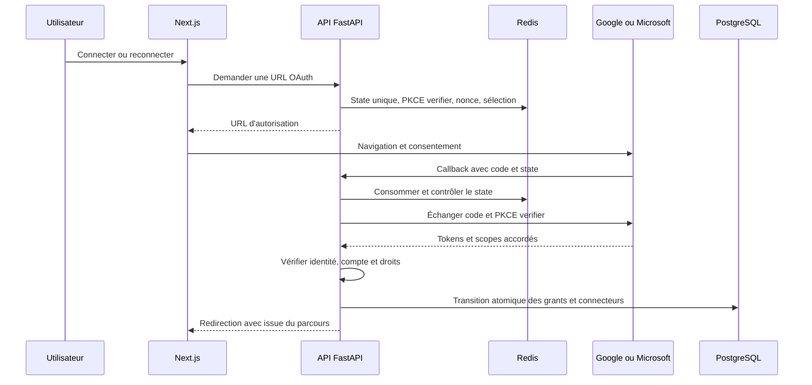

# OAuth des connecteurs Google et Microsoft

> État du code au 2026-09-21. Cette page décrit les connexions unitaires et les
> parcours groupés des connecteurs. L'authentification de session est décrite
> dans [AUTHENTICATION.md](AUTHENTICATION.md) ; l'OAuth des serveurs MCP dans
> [MCP_INTEGRATION.md](MCP_INTEGRATION.md).

## Vue d'ensemble

L'API FastAPI détient les secrets OAuth et échange les codes d'autorisation.
Le frontend Next.js reçoit seulement une URL de départ, puis la redirection de
retour. Tous les parcours utilisent HTTPS, un `state` Redis à usage unique
(5 minutes), PKCE S256 et une URI de callback exacte. Le navigateur ne choisit
jamais les scopes du parcours groupé. Le fournisseur délivre les tokens ; le
serveur chiffre les credentials avant de les enregistrer dans PostgreSQL.

```mermaid
sequenceDiagram
    participant U as Utilisateur
    participant W as Next.js
    participant A as API FastAPI
    participant R as Redis
    participant P as Google ou Microsoft
    participant D as PostgreSQL
    U->>W: Connecter ou reconnecter
    W->>A: Demander une URL OAuth
    A->>R: State unique, PKCE verifier, nonce, sélection
    A-->>W: URL d'autorisation
    W->>P: Navigation et consentement
    P->>A: Callback avec code et state
    A->>R: Consommer et contrôler le state
    A->>P: Échanger code et PKCE verifier
    P-->>A: Tokens et scopes accordés
    A->>A: Vérifier identité, compte et droits
    A->>D: Transition atomique des grants et connecteurs
    A-->>W: Redirection avec issue du parcours
```

[L'ADR-021](../architecture/ADR-021-OAuth-Token-Lifecycle-Management.md)
consigne le cycle de vie initial par connecteur ;
[l'ADR-302](../architecture/ADR-302-OAuth-Grant-Par-Compte-Et-Consentement-Groupe.md)
porte la décision actuelle pour les grants partagés.

## Connexion et reconnexion groupées

| Action | Initiation | Services retenus |
|---|---|---|
| Reconnecter mes services | `POST /connectors/oauth-bulk/{provider}/authorize` | Services configurés en erreur, sélectionnés explicitement pour un même compte |
| Tout connecter | `POST /connectors/oauth-bulk/{provider}/connect-all/authorize` | Services absents, autorisés par la configuration globale et sans conflit avec un autre fournisseur actif |

`provider` vaut `google` ou `microsoft`. Les deux actions partagent
`GET /connectors/oauth-bulk/{provider}/callback`, avec un seul consentement et
une seule union de scopes par fournisseur et par compte. Pour « Tout connecter »,
le navigateur peut transmettre le `grant_id` d'un compte déjà lié ; il ne peut
pas transmettre sa propre liste de services ou de scopes. Si plusieurs comptes
sont connus, l'utilisateur choisit celui du parcours. Des comptes différents
impliquent des parcours distincts. Une ancienne connexion sans identité signée
n'est jamais fusionnée sur la seule base de son e-mail.

Le callback vérifie le `state`, l'identité signée du fournisseur (signature
JWKS, issuer, audience, nonce et identifiant stable), puis les scopes
**effectivement accordés**. Lorsqu'un ID token contient `at_hash`,
`verify_provider_identity` reçoit l'access token du même échange pour vérifier
leur liaison. Une valeur manquante ou incorrecte est refusée ; cette
vérification ne doit pas être désactivée. Le callback revalide les connecteurs
et le compte sous verrou avant l'écriture atomique. Un refus de scope laisse un
service en erreur en reconnexion, ou absent en connexion initiale. Les services
actifs du grant conservent leurs scopes ; une autorisation qui les retirerait
est refusée. Le retour publie le mode et les nombres réellement activés ou
refusés, sans token dans l'URL.

Code : [règles de sélection et de scopes](../../apps/api/src/domains/connectors/oauth_bulk.py),
[service et callback](../../apps/api/src/domains/connectors/oauth_bulk_service.py),
[vérification d'identité](../../apps/api/src/domains/connectors/oauth_identity.py),
[routes](../../apps/api/src/domains/connectors/oauth_bulk_router.py).

### URI à enregistrer chez les fournisseurs

Les URI sont construites à partir des clés **existantes** `API_URL` et
`API_PREFIX` ; aucune nouvelle clé `.env` n'est nécessaire :

- Google : `{API_URL}{API_PREFIX}/connectors/oauth-bulk/google/callback` ;
- Microsoft : `{API_URL}{API_PREFIX}/connectors/oauth-bulk/microsoft/callback`.

| Environnement | Fournisseur | URI exacte actuelle |
|---|---|---|
| Docker dev (`.env`) | Google | `https://192.168.0.29.nip.io:8000/api/v1/connectors/oauth-bulk/google/callback` |
| Docker dev (`.env`) | Microsoft | `https://192.168.0.29.nip.io:8000/api/v1/connectors/oauth-bulk/microsoft/callback` |
| Docker prod (`.env.prod`) | Google | `https://lia-back.jeyswork.com/api/v1/connectors/oauth-bulk/google/callback` |
| Docker prod (`.env.prod`) | Microsoft | `https://lia-back.jeyswork.com/api/v1/connectors/oauth-bulk/microsoft/callback` |

Dans **Google Auth Platform → Clients**, ouvrir le client Web identifié par
`GOOGLE_CLIENT_ID` de l'environnement et ajouter l'URI Google dans les URI de
redirection autorisées. Dans **Microsoft Entra → App registrations →
Authentication**, ouvrir l'application identifiée par `MICROSOFT_CLIENT_ID`,
ajouter l'URI Microsoft comme redirection **Web**, puis enregistrer. Si dev et
prod utilisent des clients distincts, enregistrer chaque URI dans le client
correspondant ; s'ils partagent un client, enregistrer les deux. Préserver les
callbacks existants de login et de connexion unitaire.
`GOOGLE_REDIRECT_URI` reste le callback de login Google : il n'est pas remplacé.
Le schéma, l'hôte, le port et le chemin doivent correspondre exactement à
l'URL envoyée au fournisseur.

Les quatre fichiers `.env`, `.env.prod`, `.env.example` et `.env.prod.example`
contiennent des commentaires de rappel ; les deux exemples utilisent un hôte
modèle à remplacer lors d'un nouveau déploiement.

## Grants, refresh et déconnexion

Un grant partagé représente une autorisation pour
`(user_id, provider, client_id, subject)` : l'identité de compte ne repose pas
sur l'adresse e-mail affichée. Le credential et les scopes accordés sont
conservés dans `oauth_grants`. Chaque service garde une ligne `connectors`
individuelle avec `oauth_grant_id` et une copie chiffrée compatible avec les
lecteurs historiques. Les anciennes connexions unitaires gardent un lien nul
jusqu'à leur reconnexion explicite. Le schéma exact est dans
[DATABASE_SCHEMA.md](DATABASE_SCHEMA.md#2a-oauth_grants).

[Le runtime du grant](../../apps/api/src/domains/connectors/oauth_grant_runtime.py)
rafraîchit une fois les tokens d'un compte sous verrou PostgreSQL, puis
synchronise les copies des services liés. Le
[job proactif](../../apps/api/src/infrastructure/scheduler/token_refresh.py)
ne traite chaque grant qu'une fois par passage. Les connexions historiques
sans grant gardent leur chemin unitaire. Une panne réseau temporaire préserve
le service ; un refus définitif du fournisseur marque les services concernés
en erreur et permet la reconnexion explicite.

La déconnexion d'un service retire seulement son accès local. Le dernier
service lié supprime le grant local. Une déconnexion unitaire ne révoque pas
l'autorisation globale chez le fournisseur, car elle pourrait interrompre les
autres services. L'utilisateur peut révoquer l'application depuis son compte
Google ou Microsoft ; la suppression du compte LIA possède son propre parcours
de révocation globale.

Le refresh ne peut pas contourner la politique du fournisseur. Google indique
qu'une application externe encore en **Testing** qui demande des scopes de
services reçoit généralement un refresh token expirant après sept jours
([documentation officielle](https://developers.google.com/identity/protocols/oauth2#expiration)).
La publication du client Google est une étape distincte. Microsoft gère aussi
la durée et la rotation des refresh tokens selon sa
[politique](https://learn.microsoft.com/en-us/entra/identity-platform/refresh-tokens).

## Sécurité et erreurs

- [OAuthFlowHandler](../../apps/api/src/core/oauth/flow_handler.py) détient le
  `state` à usage unique et PKCE ; [les providers](../../apps/api/src/core/oauth/providers/)
  fixent les endpoints et clients enregistrés.
- [Fernet](../../apps/api/src/core/security/utils.py) chiffre le JSON complet
  des credentials avec `FERNET_KEY`. Les tokens et secrets ne sont ni renvoyés
  au navigateur ni écrits dans les logs.
- La signature, l'issuer, l'audience, le nonce et l'`at_hash` éventuel du
  jeton d'identité sont vérifiés avant de lier plusieurs services. Le compte
  choisi doit correspondre à l'identité signée au retour.
- Un refus utilisateur, une identité invalide, un autre compte, un manque de
  scopes et une panne temporaire n'ont pas la même issue. Le callback redirige
  vers les réglages avec un code d'erreur stable ou un bilan partiel. Une erreur
  ne déclenche pas une réactivation implicite.

| Symptôme | Point à vérifier |
|---|---|
| `redirect_uri_mismatch` avant le callback | URI exacte et client OAuth de l'environnement |
| `OAuthStateValidationError` | State expiré, déjà consommé ou Redis indisponible ; relancer le parcours |
| `invalid_grant` à l'échange | Code expiré/réutilisé, URI ou PKCE non concordants ; consulter la réponse fournisseur sans journaliser les tokens |
| `oauth_token_exchange_success` puis `No access_token provided to compare against at_hash claim` | La vérification OIDC n'a pas reçu l'access token échangé ; conserver le contrôle `at_hash` et transmettre le token au vérificateur |
| Compte différent au retour | Rechoisir le bon compte ; aucun service existant ne doit être remplacé |
| Certains services toujours en erreur ou absents | Comparer les scopes accordés aux scopes requis ; le bilan groupé reflète un refus partiel |

## MCP et autres parcours

L'OAuth d'un serveur MCP est indépendant : chaque serveur peut avoir son propre
issuer, ses scopes, son client enregistré et ses tokens. Il ne participe pas au
consentement groupé Google ou Microsoft. Voir
[MCP_INTEGRATION.md](MCP_INTEGRATION.md) pour discovery, DCR, PKCE, refresh et
callback MCP. Les callbacks de connexion **unitaire** Google et Microsoft
restent en place pour les actions par service ; le modèle groupé n'exige pas
de migration forcée des anciens comptes.

## Validation et références

Les tests unitaires de `test_oauth_identity.py` couvrent notamment les ID
tokens Google/Microsoft signés avec `at_hash` valide et erroné. Les tests
d'intégration de `test_oauth_bulk.py` éprouvent les transitions sur PostgreSQL,
le state à usage unique, les consentements partiels, les comptes distincts et
la sélection des services. Le parcours front est testé dans
`settings-bulk-oauth-reconnect.spec.ts`. Une preuve fournisseur réelle est
nécessaire pour chaque client et environnement : les tests hermétiques ne
vérifient pas la configuration du portail Google ou Microsoft.

- [ADR-302 — grant par compte et consentement groupé](../architecture/ADR-302-OAuth-Grant-Par-Compte-Et-Consentement-Groupe.md)
- [FAQ connecteurs](../knowledge/04_connectors.md)
- [Tests unitaires d'identité](../../apps/api/tests/unit/domains/connectors/test_oauth_identity.py)
- [Tests d'intégration OAuth groupé](../../apps/api/tests/integration/test_oauth_bulk.py)
- [Test navigateur hermétique](../../apps/web/e2e/smoke/settings-bulk-oauth-reconnect.spec.ts)
- [OpenID Connect Core (claim `at_hash`)](https://openid.net/specs/openid-connect-core-1_0.html#CodeIDToken)
