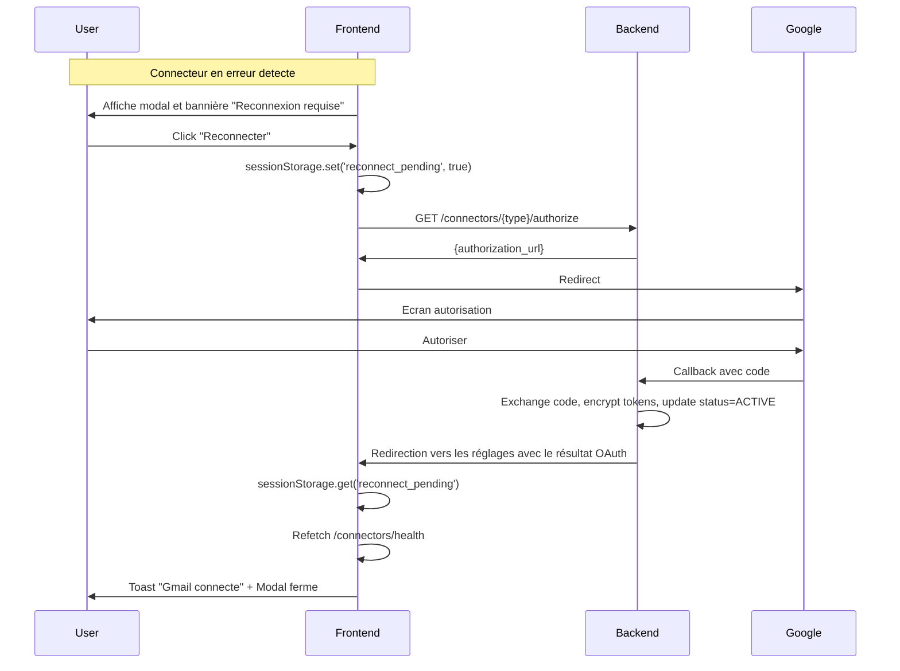

# OAuth Health Check System

> **Mis à jour** : 2026-09-21 | **Status** : Implemented

---

## Vue d'Ensemble

Le systeme OAuth Health Check surveille proactivement l'etat des connecteurs OAuth et notifie les utilisateurs lorsqu'une reconnexion manuelle est necessaire.

### Design Simplifie

**Principe cle** : Seuls les connecteurs avec `status=ERROR` declenchent des alertes.

| Situation | Comportement |
|-----------|--------------|
| Token expire (`expires_at < now`) | **PAS d'alerte** - Le refresh proactif ou on-demand gere ca |
| Refresh echoue (`status=ERROR`) | **Alerte** - Reconnexion manuelle requise |
| Connecteur sain | Aucune action |

**Pourquoi ce design ?**
- Le job de refresh proactif s'execute toutes les 15 minutes
- Les tokens sont rafraichis 30 minutes avant expiration
- `expires_at` dans le passe est **NORMAL** - le refresh on-demand obtient un nouveau token
- Seul `status=ERROR` indique un vrai probleme (refresh_token revoque ou expire)

Pour des services Google ou Microsoft déjà liés au même `oauth_grant_id`, le
refresh est effectué une seule fois par grant. Un refus définitif marque les
services liés en erreur ; un incident réseau temporaire conserve leur statut.
Les alertes restent par service, tandis que l'action
**Reconnecter mes services Google/Microsoft** peut réunir ceux d'un même compte
en un consentement. Les comptes distincts exigent des parcours distincts.
Voir [OAUTH.md](OAUTH.md#connexion-et-reconnexion-groupées) et
[ADR-302](../architecture/ADR-302-OAuth-Grant-Par-Compte-Et-Consentement-Groupe.md).

---

## Architecture

Le job publie toujours l'alerte sur le canal Redis, puis tente un push FCM
seulement en l'absence de connexion SSE. Le schéma ci-dessous représente ces
deux issues ; le canal Redis reste commun aux deux.

```
                         ┌──────────────────────────────────────┐
                         │      BACKEND SCHEDULER (5 min)       │
                         │   check_oauth_health_all_users()     │
                         └──────────────────┬───────────────────┘
                                            │
                    ┌───────────────────────▼───────────────────────┐
                    │         Pour chaque connecteur OAuth          │
                    │  connector.status == ERROR ?                  │
                    └───────────────────────┬───────────────────────┘
                                            │
                         ┌──────────────────▼──────────────────┐
                         │  Deja notifie ? (Redis cooldown)     │
                         │  Key: oauth:health:notified:{uid}:{cid} │
                         └──────────────────┬──────────────────┘
                                            │ Non
                         ┌──────────────────▼──────────────────┐
                         │   User a connexion SSE active ?      │
                         │   Key: sse:connection:{user_id}      │
                         └──────────────────┬──────────────────┘
                              │                           │
                         SSE actif                   Pas de SSE
                              │                           │
                              ▼                           ▼
                    ┌─────────────────┐         ┌─────────────────┐
                    │ Redis Pub/Sub   │         │ FCM Push + Redis │
                    │ (Frontend modal)│         │ Pub/Sub          │
                    └─────────────────┘         └─────────────────┘
                              │                           │
                              └───────────┬───────────────┘
                                          ▼
                         ┌────────────────────────────────┐
                         │  Set cooldown Redis (24h TTL)  │
                         └────────────────────────────────┘
```

---

## Backend

### Scheduled Job

**Fichier** : `apps/api/src/infrastructure/scheduler/oauth_health.py`

```python
async def check_oauth_health_all_users() -> dict[str, int]:
    """
    Job execute toutes les OAUTH_HEALTH_CHECK_INTERVAL_MINUTES.

    Returns:
        Stats: {checked, healthy, error, notified}
    """
```

**Execution** : Enregistré dans APScheduler par `infrastructure/startup/schedulers.py`.

### Configuration

**Fichier** : `apps/api/src/core/config/connectors.py`

| Setting | Default | Description |
|---------|---------|-------------|
| `OAUTH_HEALTH_CHECK_ENABLED` | `true` | Active/desactive le health check |
| `OAUTH_HEALTH_CHECK_INTERVAL_MINUTES` | `5` | Frequence de verification |
| `OAUTH_HEALTH_CRITICAL_COOLDOWN_HOURS` | `24` | Cooldown avant re-notification |
| `SSE_CONNECTION_TTL_SECONDS` | `120` | TTL tracking connexions SSE |

### Constantes Redis

**Fichier** : `apps/api/src/core/constants.py`

```python
# OAuth Health Check
OAUTH_HEALTH_NOTIFIED_KEY_PREFIX = "oauth:health:notified"
SSE_CONNECTION_KEY_PREFIX = "sse:connection"
SCHEDULER_JOB_OAUTH_HEALTH = "oauth_health_check"
```

### Messages i18n

**Fichier** : `apps/api/src/core/i18n_api_messages.py`

```python
# Methodes statiques dans APIMessages
oauth_health_critical_title(language)  # "Action requise" / "Action required"
oauth_health_critical_body(connector_name, language)  # "{name} est deconnecte..."
```

### Metriques Prometheus

```python
background_job_duration_seconds{job_name="oauth_health_check"}
background_job_errors_total{job_name="oauth_health_check"}
```

---

## Frontend

### Hook useConnectorHealth

**Fichier** : `apps/web/src/hooks/useConnectorHealth.ts`

```typescript
export function useConnectorHealth(options: UseConnectorHealthOptions): UseConnectorHealthResult {
  // - Fetch GET /connectors/health au mount
  // - Polling configurable (default 5 min)
  // - Deduplication multi-onglets via localStorage
  // - Auto-refetch apres reconnexion OAuth
}
```

**Interface retour** :

```typescript
interface UseConnectorHealthResult {
  health: ConnectorHealthResponse | null;
  isLoading: boolean;
  hasIssues: boolean;
  criticalConnectors: ConnectorHealthItem[];
  refetch: () => Promise<void>;
  dismissConnector: (connectorId: string) => void;
  markReconnectPending: () => void;
}
```

### Composant ConnectorHealthAlert

**Fichier** : `apps/web/src/components/connectors/ConnectorHealthAlert.tsx`

- Affiche une modal pour les connecteurs critiques (`status=ERROR`) et une bannière persistante tant que l'erreur subsiste
- Integre dans le layout dashboard
- Signale la reconnexion requise et renvoie vers les réglages, où la
  reconnexion peut être groupée par fournisseur et par compte

### Composant ErrorConnectorCard

**Fichier** : `apps/web/src/components/settings/connectors/ErrorConnectorCard.tsx`

- Affiche les connecteurs en erreur dans la page parametres
- Bouton "Reconnecter" pour initier le flow OAuth

### Integration Layout

**Fichier** : `apps/web/src/app/[lng]/dashboard/layout.tsx`

```tsx
<ConnectorHealthAlert lng={lng} />
```

---

## Flow de Reconnexion

La modal et la bannière de santé proposent encore une action **unitaire** pour
chaque service. Dans les réglages, « Reconnecter mes services Google/Microsoft »
regroupe les services en erreur **d'un même compte** ; « Tout connecter » autorise
les services absents admissibles en un parcours par fournisseur et par compte.
Voir [OAUTH.md](OAUTH.md#connexion-et-reconnexion-groupées).


```mermaid
sequenceDiagram
    participant User
    participant Frontend
    participant Backend
    participant Google

    Note over User,Frontend: Connecteur en erreur detecte
    Frontend->>User: Affiche modal et bannière "Reconnexion requise"
    User->>Frontend: Click "Reconnecter"
    Frontend->>Frontend: sessionStorage.set('reconnect_pending', true)
    Frontend->>Backend: GET /connectors/{type}/authorize
    Backend->>Frontend: {authorization_url}
    Frontend->>Google: Redirect
    Google->>User: Ecran autorisation
    User->>Google: Autoriser
    Google->>Backend: Callback avec code
    Backend->>Backend: Exchange code, encrypt tokens, update status=ACTIVE
    Backend->>Frontend: Redirection vers les réglages avec le résultat OAuth
    Frontend->>Frontend: sessionStorage.get('reconnect_pending')
    Frontend->>Frontend: Refetch /connectors/health
    Frontend->>User: Toast "Gmail connecte" + Modal ferme
```

---

## Anti-Spam / Deduplication

### Backend (Redis)

```python
# Cooldown key - empeche re-notification pendant 24h
notified_key = f"oauth:health:notified:{user_id}:{connector_id}"
await redis.set(notified_key, "1", ex=cooldown_seconds)
```

### Frontend (localStorage)

```typescript
// Deduplication multi-onglets - empeche double modal
const TOAST_DEDUP_KEY = 'oauth_health_toast_shown';
const key = `modal:${connectorId}`;
shown[key] = Date.now();
localStorage.setItem(TOAST_DEDUP_KEY, JSON.stringify(shown));
```

### SSE vs Push

- **User sur l'app (SSE actif)** : Modal via Redis Pub/Sub, pas de push
- **User hors app (pas de SSE)** : Push notification FCM

---

## i18n

### Frontend

**Fichiers** : `apps/web/locales/{lang}/translation.json`

```json
{
  "settings": {
    "connectors": {
      "health": {
        "modal_title": "Reconnexion requise",
        "modal_description": "Les connecteurs suivants necessitent une reconnexion...",
        "error_status": "Reconnexion necessaire",
        "reconnect": "Reconnecter",
        "reconnecting": "Reconnexion...",
        "reconnect_failed": "Echec de la reconnexion",
        "dismiss": "Plus tard"
      },
      "oauth_errors": {
        "title": "Connecteurs deconnectes",
        "needs_reconnection": "Reconnexion necessaire"
      }
    }
  }
}
```

### Backend

Voir `APIMessages.oauth_health_critical_title()` et `oauth_health_critical_body()` dans `i18n_api_messages.py`.

---

## Endpoint API

### GET /connectors/health

**Fichier** : `apps/api/src/domains/connectors/router.py`

```python
@router.get("/health")
async def check_connector_health(
    current_user: User = Depends(get_current_active_session),
) -> ConnectorHealthResponse:
    """Verifie la sante de tous les connecteurs OAuth d'un utilisateur."""
```

**Response** :

```json
{
  "connectors": [
    {
      "id": "uuid",
      "connector_type": "google_gmail",
      "display_name": "Gmail",
      "health_status": "error",
      "severity": "critical",
      "expires_in_minutes": null,
      "authorize_url": "/connectors/gmail/authorize"
    }
  ],
  "has_issues": true,
  "critical_count": 1,
  "warning_count": 0,
  "checked_at": "2026-01-28T10:00:00Z"
}
```

### GET /connectors/health/settings

**Response** :

```json
{
  "polling_interval_ms": 300000,
  "critical_cooldown_ms": 86400000
}
```

---

## Relation avec autres systemes

### Proactive Token Refresh

**Fichier** : `apps/api/src/infrastructure/scheduler/token_refresh.py`

- S'execute toutes les 15 minutes
- Rafraichit les tokens 30 minutes avant expiration
- Pour un grant partagé, un refus définitif (`invalid_grant` ou
  `interaction_required`) marque les services actifs liés en erreur ; les pannes
  transitoires ne déclenchent pas de reconnexion. Le job déduplique les services
  d'un même grant dans chaque passage

### On-Demand Token Refresh

**Fichier** : `apps/api/src/domains/connectors/clients/base_google_client.py`

- Verifie `expires_at` avant chaque appel API
- Rafraichit si necessaire (avec Redis lock pour eviter race conditions)
- Les services liés utilisent le runtime du grant ; son refus définitif marque
  les services actifs liés en erreur, tandis qu'une panne temporaire garde leur statut

---

## Troubleshooting

### Connecteur en erreur mais pas de notification

1. Verifier cooldown Redis : `redis-cli GET oauth:health:notified:{user_id}:{connector_id}`
2. Verifier SSE actif : `redis-cli GET sse:connection:{user_id}`
3. Verifier job actif : logs `oauth_health_check_completed`

### Modal ne s'affiche pas

1. Verifier localStorage : `oauth_health_toast_shown`
2. Verifier polling actif dans Network tab
3. Verifier `isAuthenticated` dans le hook

### Push non recu

1. Verifier FCM token valide
2. Verifier SSE non actif (sinon push skip)
3. Verifier logs `oauth_health_push_sent` ou `oauth_health_push_failed`

---

## References

| Document | Description |
|----------|-------------|
| [ADR-021](../architecture/ADR-021-OAuth-Token-Lifecycle-Management.md) | Cycle OAuth initial, amendé pour les grants partagés |
| [ADR-302](../architecture/ADR-302-OAuth-Grant-Par-Compte-Et-Consentement-Groupe.md) | Grant par compte et reconnexion groupée |
| [OAUTH.md](OAUTH.md) | Flux OAuth Google/Microsoft avec PKCE et grants |
| `docs/guides/GUIDE_BACKGROUND_JOBS_APSCHEDULER.md` | Guide jobs planifies |
| `docs/guides/GUIDE_FCM_PUSH_NOTIFICATIONS.md` | Guide notifications push |

---

**Fin de OAUTH_HEALTH_CHECK.md**
