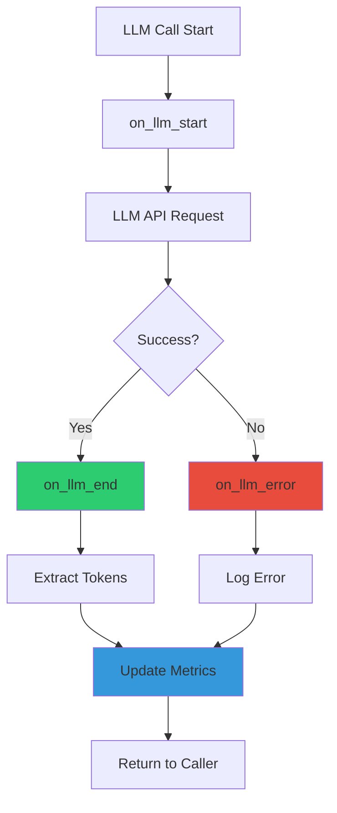

# OBSERVABILITY_AGENTS.md - Observabilité et Métriques des Agents LangGraph

**Version**: 2.0
**Date**: 2025-12-25
**Updated**: Added Voice/TTS metrics, Gmail metrics, Circuit Breaker, Adaptive Re-planner
**Auteur**: Documentation Technique LIA
**Statut**: ✅ Complète et Validée

---

## Table des Matières

1. [Vue d'Ensemble](#vue-densemble)
2. [Architecture de l'Observabilité](#architecture-de-lobservabilité)
3. [Métriques Prometheus](#métriques-prometheus)
4. [Callbacks LangChain](#callbacks-langchain)
5. [Décorateurs d'Instrumentation](#décorateurs-dinstrumentation)
6. [Filtrage PII](#filtrage-pii)
7. [Dashboards Grafana](#dashboards-grafana)
8. [Tracing OpenTelemetry](#tracing-opentelemetry)
9. [Logging Structuré](#logging-structuré)
10. [Testing et Troubleshooting](#testing-et-troubleshooting)
11. [Exemples Pratiques](#exemples-pratiques)
12. [Métriques de Référence](#métriques-de-référence)
13. [Ressources](#ressources)

---

## Vue d'Ensemble

### Objectifs de l'Observabilité

L'architecture d'observabilité de LIA répond aux **3 piliers de l'observabilité** (Three Pillars of Observability) :

1. **Metrics** (Métriques Prometheus) → Dashboards Grafana
2. **Logs** (Logs structurés) → Loki + recherche par trace_id
3. **Traces** (Distributed tracing) → Tempo + corrélation logs-traces

**Standards utilisés** :
- Prometheus best practices (RED metrics, label cardinality)
- OpenTelemetry Semantic Conventions for LLM Observability
- OWASP Logging Cheat Sheet (PII filtering)
- GDPR Article 5 (data minimization)

### Stack d'Observabilité

```mermaid
graph TB
    subgraph "Application Layer"
        A[FastAPI App] --> B[PrometheusMiddleware]
        A --> C[MetricsCallbackHandler]
        A --> D[TokenTrackingCallback]
        A --> E[Structlog + PII Filter]
    end

    subgraph "Metrics Collection"
        B --> F[Prometheus Client]
        C --> F
        D --> F
        F --> G[/metrics Endpoint]
    end

    subgraph "Storage & Visualization"
        G --> H[Prometheus]
        E --> I[Promtail]
        I --> J[Loki]
        A --> K[OTLP Exporter]
        K --> L[Tempo]
        H --> M[Grafana Dashboards]
        J --> M
        L --> M
    end

    subgraph "Alerting"
        H --> N[Alertmanager]
        N --> O[Slack/Email]
    end

    style F fill:#2ecc71
    style M fill:#3498db
    style E fill:#e74c3c
```

**Architecture Pattern** : **Push-based metrics** (Prometheus scrape) + **Pull-based logs** (Promtail tail) + **OTLP tracing** (push).

### Métriques Clés (KPIs)

| Catégorie | Métrique | Target | Dashboards |
|-----------|----------|--------|------------|
| **Performance** | SSE TTFT (Time To First Token) | p95 < 500ms | 04 - Agents |
| **Qualité** | Router confidence score | p50 > 0.8 | 04 - Agents |
| **Coût** | LLM cost per request | < €0.05 | 05 - Tokens & Cost |
| **Fiabilité** | Planner retry rate | < 20% | 04 - Agents (Section 3.5) |
| **Disponibilité** | HTTP error rate (5xx) | < 1% | 01 - App Performance |
| **Sécurité** | OAuth success rate | > 95% | 08 - OAuth Security |

---

## Architecture de l'Observabilité

### 1. Couches d'Instrumentation

L'observabilité est implémentée via **4 couches** :

#### Couche 1 : HTTP/Infrastructure (PrometheusMiddleware)

**Fichier** : `apps/api/src/infrastructure/observability/metrics.py`

```python
class PrometheusMiddleware(BaseHTTPMiddleware):
    """Middleware to collect Prometheus metrics for HTTP requests."""

    async def dispatch(
        self, request: Request, call_next: Callable[[Request], Awaitable[Response]]
    ) -> Response:
        # Skip metrics endpoint
        if request.url.path == "/metrics":
            return await call_next(request)

        method = request.method
        endpoint = request.url.path

        # Track request in progress
        http_requests_in_progress.labels(method=method, endpoint=endpoint).inc()

        try:
            # Measure request duration
            with http_request_duration_seconds.labels(
                method=method,
                endpoint=endpoint,
            ).time():
                response = await call_next(request)

            # Record request
            http_requests_total.labels(
                method=method,
                endpoint=endpoint,
                status=response.status_code,
            ).inc()

            # Update DB pool metrics periodically (lightweight operation)
            try:
                from src.infrastructure.database.session import update_db_pool_metrics
                update_db_pool_metrics()
            except Exception as e:
                logger.debug("failed_to_update_db_metrics", error=str(e))

            return response

        finally:
            # Decrement in-progress counter
            http_requests_in_progress.labels(method=method, endpoint=endpoint).dec()
```

**Métriques exposées** :
- `http_requests_total{method, endpoint, status}` (Counter)
- `http_request_duration_seconds{method, endpoint}` (Histogram)
- `http_requests_in_progress{method, endpoint}` (Gauge)

**Pattern** : **RED metrics** (Rate, Errors, Duration).

#### Couche 2 : LangGraph Nodes (@track_metrics decorator)

**Fichier** : `apps/api/src/infrastructure/observability/decorators.py`

```python
@trace_node("router", llm_model=settings.router_llm_model)
@track_metrics(
    node_name="router",
    duration_metric=agent_node_duration_seconds,
    counter_metric=agent_node_executions_total,
)
async def router_node(state: MessagesState, config: RunnableConfig) -> dict[str, Any]:
    """
    Router node: Analyzes user intent and routes to appropriate next node.

    Metrics tracked automatically by @track_metrics decorator:
    - agent_node_duration_seconds{node_name="router"}
    - agent_node_executions_total{node_name="router", status="success"|"error"}
    """
    # Business logic only - metrics tracked automatically
    router_output = await _call_router_llm(messages, llm_type="router", config=config)
    return {STATE_KEY_ROUTING_HISTORY: [router_output]}
```

**Métriques exposées** :
- `agent_node_duration_seconds{node_name}` (Histogram)
- `agent_node_executions_total{node_name, status}` (Counter)

**Avantages** :
- ✅ **Zéro boilerplate** : 2 lignes de code → instrumentation complète
- ✅ **Auto-logging** : start/completion/error logs automatiques
- ✅ **Error handling** : exceptions re-raised après instrumentation

#### Couche 3 : LLM API Calls (MetricsCallbackHandler)

**Fichier** : `apps/api/src/infrastructure/observability/callbacks.py`

```python
class MetricsCallbackHandler(AsyncCallbackHandler):
    """
    LangChain async callback handler for metrics collection.

    Captures:
    - Token consumption (prompt + completion + cached)
    - API call latency
    - API call success/failure
    - Estimated costs (EUR)
    """

    async def on_llm_end(
        self,
        response: LLMResult,
        *,
        run_id: UUID,
        **kwargs: Any,
    ) -> None:
        """Called when LLM ends running successfully."""
        latency = time.time() - self.start_times.pop(run_id, time.time())

        # **Phase 2.1 - Token Tracking Alignment Fix**
        metadata = kwargs.get("metadata", {})
        node_name = metadata.get("langgraph_node", self.node_name)

        # Extract token usage using centralized extractor
        usage = TokenExtractor.extract(response, self.llm)

        if not usage:
            llm_api_calls_total.labels(model="unknown", node_name=node_name, status="success").inc()
            llm_api_latency_seconds.labels(model="unknown", node_name=node_name).observe(latency)
            return

        model_name = usage.model_name
        prompt_tokens = usage.input_tokens
        completion_tokens = usage.output_tokens
        cached_tokens = usage.cached_tokens

        # Track tokens consumed
        if prompt_tokens > 0:
            llm_tokens_consumed_total.labels(
                model=model_name, node_name=node_name, token_type="prompt_tokens"
            ).inc(prompt_tokens)

        if completion_tokens > 0:
            llm_tokens_consumed_total.labels(
                model=model_name, node_name=node_name, token_type="completion_tokens"
            ).inc(completion_tokens)

        if cached_tokens > 0:
            llm_tokens_consumed_total.labels(
                model=model_name, node_name=node_name, token_type="cached_tokens"
            ).inc(cached_tokens)

        # Track API call success
        llm_api_calls_total.labels(model=model_name, node_name=node_name, status="success").inc()

        # Track latency
        llm_api_latency_seconds.labels(model=model_name, node_name=node_name).observe(latency)

        # Estimate and track cost (async)
        cost = await estimate_cost_usd(
            model=model_name,
            prompt_tokens=prompt_tokens,
            completion_tokens=completion_tokens,
            cached_tokens=cached_tokens,
        )
        currency = settings.default_currency.upper()
        llm_cost_total.labels(model=model_name, node_name=node_name, currency=currency).inc(cost)
```

**Métriques exposées** :
- `llm_tokens_consumed_total{model, node_name, token_type}` (Counter)
- `llm_api_calls_total{model, node_name, status}` (Counter)
- `llm_api_latency_seconds{model, node_name}` (Histogram)
- `llm_cost_total{model, node_name, currency}` (Counter)

**Pattern** : **Callback-based instrumentation** (LangChain standard).

#### Couche 4 : Token Tracking (TokenTrackingCallback)

**Fichier** : `apps/api/src/infrastructure/observability/callbacks.py`

```python
class TokenTrackingCallback(AsyncCallbackHandler):
    """
    Callback handler for tracking LLM token usage in TrackingContext.

    Modern approach (2025): Intercepts ALL LLM calls via callbacks,
    regardless of invocation pattern (regular, with_structured_output, agents).

    This solves the problem where router_node uses with_structured_output()
    which doesn't add AIMessage to state, making tokens invisible to
    post-execution message scanning.
    """

    async def on_llm_end(
        self,
        response: LLMResult,
        *,
        run_id: UUID,
        **kwargs: Any,
    ) -> None:
        """Called when LLM completes - extract and record token usage."""
        try:
            # Extract token usage using centralized extractor
            usage_data = TokenExtractor.extract(response)

            if not usage_data:
                logger.debug("token_tracking_no_usage", run_id=self.run_id, llm_run_id=str(run_id))
                return

            # **Phase 2.1 - Token Tracking Alignment Fix**
            node_name = self._current_node_name

            # Record in TrackingContext (unified method with auto-cost calculation)
            await self.tracker.record_node_tokens(
                node_name=node_name,
                model_name=usage_data.model_name,
                prompt_tokens=usage_data.input_tokens,
                completion_tokens=usage_data.output_tokens,
                cached_tokens=usage_data.cached_tokens,
            )

        except Exception as e:
            logger.error("token_tracking_callback_failed", run_id=self.run_id, error=str(e))
```

**Objectif** : Persister les tokens dans **PostgreSQL** (`conversation_messages` table) pour tracking par conversation.

**Différence avec MetricsCallbackHandler** :
- `MetricsCallbackHandler` → **Prometheus metrics** (agrégées)
- `TokenTrackingCallback` → **Database records** (granulaires, par message)

---

### 2. Token Extraction (Stratégie Multi-Fallback)

**Fichier** : `apps/api/src/infrastructure/observability/token_extractor.py`

Le `TokenExtractor` utilise une **stratégie à 3 niveaux** pour extraire les tokens des réponses LLM, compatible avec LangChain 1.x (actuellement 1.1.6) :

```python
class TokenExtractor:
    """
    Utility class for extracting token usage from LangChain LLMResult.

    Uses a 3-strategy fallback approach to handle different LangChain versions
    and LLM providers:
    1. AIMessage.usage_metadata (modern API, preferred)
    2. llm_output dict (legacy API)
    3. LLM instance model_name attribute (fallback)
    """

    @staticmethod
    def extract(response: LLMResult, llm: "BaseChatModel | None" = None) -> TokenUsage | None:
        """Extract token usage and model name from LLMResult."""
        input_tokens = 0
        output_tokens = 0
        cached_tokens = 0
        model_name = "unknown"
        usage_dict = None

        # Strategy 1: Extract from AIMessage.usage_metadata (modern LangChain API)
        if response.generations and response.generations[0]:
            first_gen = response.generations[0][0]

            # Extract usage_metadata from message
            if hasattr(first_gen, "message") and hasattr(first_gen.message, "usage_metadata"):
                usage_dict = first_gen.message.usage_metadata
                if usage_dict:
                    raw_input_tokens = usage_dict.get("input_tokens", 0)
                    output_tokens = usage_dict.get("output_tokens", 0)

                    # Extract cached tokens (OpenAI uses input_token_details.cache_read)
                    input_details = usage_dict.get("input_token_details", {})
                    if input_details:
                        cached_tokens = input_details.get("cache_read", 0)

                    # CRITICAL: OpenAI's input_tokens INCLUDES cached tokens
                    # We must subtract cached to get non-cached input tokens
                    input_tokens = raw_input_tokens - cached_tokens

            # Extract model name from response_metadata
            if hasattr(first_gen, "message") and hasattr(first_gen.message, "response_metadata"):
                response_metadata = first_gen.message.response_metadata
                if response_metadata:
                    model_name = response_metadata.get("model_name", "unknown")

        # Strategy 2: Fallback to llm_output (legacy LangChain API)
        if not usage_dict or model_name == "unknown":
            llm_output = response.llm_output or {}

            if not usage_dict:
                usage_dict = llm_output.get("usage_metadata") or llm_output.get("token_usage")
                if usage_dict:
                    input_tokens = usage_dict.get("input_tokens", 0) or usage_dict.get("prompt_tokens", 0)
                    output_tokens = usage_dict.get("output_tokens", 0) or usage_dict.get("completion_tokens", 0)
                    cached_tokens = usage_dict.get("cached_tokens", 0)

            if model_name == "unknown":
                model_name = llm_output.get("model_name", "unknown")

        # Strategy 3: Fallback to LLM instance attributes
        if model_name == "unknown" and llm:
            model_name = getattr(llm, "model_name", "unknown")

        # Return None if no usage found
        if not usage_dict:
            return None

        return TokenUsage(
            input_tokens=input_tokens,
            output_tokens=output_tokens,
            cached_tokens=cached_tokens,
            model_name=model_name,
        )
```

**Cas d'usage** :

| LangChain Version | Provider | Strategy | Field |
|-------------------|----------|----------|-------|
| 0.3.x | OpenAI | 1 | `AIMessage.usage_metadata` |
| 0.3.x | Anthropic | 1 | `AIMessage.usage_metadata` |
| 0.2.x | OpenAI | 2 | `llm_output["token_usage"]` |
| 0.1.x | Any | 2 | `llm_output["usage_metadata"]` |
| Any | Unknown | 3 | `llm.model_name` (fallback) |

**Particularité OpenAI Prompt Caching** :

```python
# CRITICAL: OpenAI's input_tokens INCLUDES cached tokens
# input_tokens = prompt_tokens (total) = non_cached + cached
input_tokens = raw_input_tokens - cached_tokens
```

**Référence** : [OpenAI Prompt Caching Docs](https://platform.openai.com/docs/guides/prompt-caching)

---

## Métriques Prometheus

### Catalogue Complet des Métriques

**Fichier** : `apps/api/src/infrastructure/observability/metrics_agents.py`

LIA expose **130+ métriques Prometheus** réparties en **19 catégories** :

#### 1. SSE Streaming Performance (4 métriques)

```python
# Time to First Token (TTFT) - Critical UX metric
sse_time_to_first_token_seconds = Histogram(
    "sse_time_to_first_token_seconds",
    "Time to first token (TTFT) in SSE streaming",
    ["intention"],
    buckets=[0.1, 0.25, 0.5, 0.75, 1.0, 1.5, 2.0, 3.0, 5.0],
)

# Total streaming duration
sse_streaming_duration_seconds = Histogram(
    "sse_streaming_duration_seconds",
    "Total SSE streaming duration (request to last token)",
    ["intention"],
    buckets=[0.5, 1.0, 2.0, 3.0, 5.0, 7.0, 10.0, 15.0, 30.0],
)

# Tokens generated during streaming
sse_tokens_generated_total = Counter(
    "sse_tokens_generated_total",
    "Total tokens generated in SSE streaming",
    ["intention", "node_name"],
)

# Streaming errors
sse_streaming_errors_total = Counter(
    "sse_streaming_errors_total",
    "Total SSE streaming errors",
    ["error_type", "node_name"],
)
```

**Alertes recommandées** :
- 🚨 `sse_time_to_first_token_seconds{quantile="0.95"} > 2.0` (TTFT p95 > 2s)
- ⚠️ `rate(sse_streaming_errors_total[5m]) > 0.1` (>10% error rate)

#### 2. Router Metrics (4 métriques + 1 helper)

```python
# Router decision latency
router_latency_seconds = Histogram(
    "router_latency_seconds",
    "Router decision latency (time to route)",
    buckets=[0.1, 0.2, 0.3, 0.5, 0.75, 1.0, 1.5, 2.0],
)

# Router decisions by intention and confidence
router_decisions_total = Counter(
    "router_decisions_total",
    "Total router decisions",
    ["intention", "confidence_bucket"],  # confidence_bucket: low/medium/high
)

# Fallback to response node (low confidence)
router_fallback_total = Counter(
    "router_fallback_total",
    "Total router fallbacks (low confidence)",
    ["original_intention"],
)

# RULE #5 violations (data presumption detection)
router_data_presumption_total = Counter(
    "router_data_presumption_total",
    "Router decisions based on data availability instead of syntax (RULE #5 violation)",
    ["pattern_detected", "decision"],
)

# Helper function for confidence bucketing
def get_confidence_bucket(confidence: float) -> str:
    """Categorize confidence score into buckets."""
    if confidence < 0.6:
        return "low"
    elif confidence < 0.8:
        return "medium"
    else:
        return "high"
```

**Exemple d'utilisation** :

```python
# In router_node_v3.py
router_output = await _call_router_llm(messages, config=config)

# Track decision with confidence bucket
confidence_bucket = get_confidence_bucket(router_output.confidence)
router_decisions_total.labels(
    intention=router_output.intention,
    confidence_bucket=confidence_bucket
).inc()

# Detect RULE #5 violations
FORBIDDEN_REASONING_PATTERNS = {
    "aucun_resultat": ["aucun", "aucune"],
    "pas_trouve": ["pas de résultat", "pas trouvé"],
}

reasoning_lower = router_output.reasoning.lower()
for pattern_type, pattern_list in FORBIDDEN_REASONING_PATTERNS.items():
    if any(pattern in reasoning_lower for pattern in pattern_list):
        router_data_presumption_total.labels(
            pattern_detected=pattern_type,
            decision=router_output.intention,
        ).inc()
        break
```

**Dashboard** : `04-agents-langgraph.json` (Section 2 - Performance)

#### 3. LLM Token Usage & Cost (4 métriques + 1 helper)

```python
# Token consumption by type
llm_tokens_consumed_total = Counter(
    "llm_tokens_consumed_total",
    "Total LLM tokens consumed",
    ["model", "node_name", "token_type"],  # token_type: prompt_tokens/completion_tokens/cached_tokens
)

# API call success/error tracking
llm_api_calls_total = Counter(
    "llm_api_calls_total",
    "Total LLM API calls",
    ["model", "node_name", "status"],  # status: success/error
)

# API latency (optimized buckets for gpt-4.1-mini patterns)
llm_api_latency_seconds = Histogram(
    "llm_api_latency_seconds",
    "LLM API call latency (optimized for OpenAI GPT-4/gpt-4.1-mini patterns)",
    ["model", "node_name"],
    buckets=[0.5, 1.0, 2.0, 5.0, 10.0, 20.0, 30.0, 60.0],
)

# Cumulative cost tracking (EUR by default)
llm_cost_total = Counter(
    "llm_cost_total",
    "Cumulative LLM cost in configured currency (USD or EUR)",
    ["model", "node_name", "currency"],
)

# Cost estimation helper
async def estimate_cost_usd(
    model: str,
    prompt_tokens: int,
    completion_tokens: int,
    cached_tokens: int = 0,
    db: AsyncSession | None = None,
) -> float:
    """
    Estimate LLM API cost in configured currency (EUR by default).

    Uses AsyncPricingService to fetch pricing from llm_model_pricing table.
    Returns 0.0 if pricing not found.
    """
    try:
        from src.domains.llm.pricing_service import AsyncPricingService

        if db is not None:
            pricing_service = AsyncPricingService(db=db, cache_ttl_seconds=settings.llm_pricing_cache_ttl_seconds)
            cost_usd, cost_eur = await pricing_service.calculate_token_cost(
                model=model,
                input_tokens=prompt_tokens,
                output_tokens=completion_tokens,
                cached_tokens=cached_tokens,
            )
        else:
            async with get_db_context() as db_session:
                pricing_service = AsyncPricingService(db=db_session, cache_ttl_seconds=settings.llm_pricing_cache_ttl_seconds)
                cost_usd, cost_eur = await pricing_service.calculate_token_cost(
                    model=model,
                    input_tokens=prompt_tokens,
                    output_tokens=completion_tokens,
                    cached_tokens=cached_tokens,
                )

        # Return cost in configured currency (EUR by default)
        return cost_eur if settings.default_currency.upper() == "EUR" else cost_usd

    except Exception as e:
        logger.error("cost_estimation_failed", model=model, error=str(e), fallback_cost=0.0)
        return 0.0
```

**Exemple de requête Prometheus** :

```promql
# Coût total par modèle (dernières 24h)
sum by (model) (increase(llm_cost_total{currency="EUR"}[24h]))

# Tokens par type et node (dernière heure)
sum by (node_name, token_type) (rate(llm_tokens_consumed_total[1h]))

# Taux d'erreur API LLM
100 * (
  sum(rate(llm_api_calls_total{status="error"}[5m]))
  /
  sum(rate(llm_api_calls_total[5m]))
)
```

#### 4. Agent Node Metrics (2 métriques)

```python
# Node execution success/error
agent_node_executions_total = Counter(
    "agent_node_executions_total",
    "Total agent node executions",
    ["node_name", "status"],  # status: success/error
)

# Node execution duration
agent_node_duration_seconds = Histogram(
    "agent_node_duration_seconds",
    "Agent node execution duration",
    ["node_name"],
    buckets=[0.1, 0.5, 1.0, 2.0, 5.0, 10.0, 30.0],
)
```

**Utilisé par** : `@track_metrics` decorator.

#### 5. Planner Metrics (8 métriques)

```python
# Plans created by execution mode
planner_plans_created_total = Counter(
    "planner_plans_created_total",
    "Total execution plans created by planner LLM",
    ["execution_mode"],  # execution_mode: sequential/parallel
)

# Plans rejected by validator
planner_plans_rejected_total = Counter(
    "planner_plans_rejected_total",
    "Total execution plans rejected by validator",
    ["reason"],  # reason: validation_failed/budget_exceeded/too_many_steps/cycle_detected
)

# Planner errors
planner_errors_total = Counter(
    "planner_errors_total",
    "Total planner errors",
    ["error_type"],  # json_parse_error/pydantic_validation_error/validation_error
)

# Retry attempts (Phase 8.6 - Retry Mechanism)
planner_retries_total = Counter(
    "planner_retries_total",
    "Total planner retry attempts after validation errors",
    ["retry_attempt", "validation_error_type"],
)

# Successful retries
planner_retry_success_total = Counter(
    "planner_retry_success_total",
    "Total successful planner retries (plan became valid after retry)",
    ["retry_attempt"],
)

# Exhausted retries (critical failure)
planner_retry_exhausted_total = Counter(
    "planner_retry_exhausted_total",
    "Total planner retries exhausted without success after max attempts",
    ["final_error_type"],
)

# Domain filtering metrics (Phase 3)
planner_catalogue_size_tools = Histogram(
    "planner_catalogue_size_tools",
    "Distribution of tool count loaded in planner catalogue",
    ["filtering_applied", "domains_loaded"],
    buckets=[1, 3, 5, 8, 10, 15, 20, 30, 50],
)

planner_domain_confidence_score = Histogram(
    "planner_domain_confidence_score",
    "Router confidence score for domain detection (used for planner filtering)",
    ["fallback_triggered"],
    buckets=[0.0, 0.5, 0.6, 0.7, 0.75, 0.8, 0.85, 0.9, 0.95, 1.0],
)
```

**Exemple - Monitoring du retry mechanism** :

```promql
# Retry rate (%)
100 * (
  sum(rate(planner_retries_total[5m]))
  /
  (sum(rate(planner_plans_created_total[5m])) + sum(rate(planner_plans_rejected_total[5m])))
)

# Retry success rate (%)
100 * (
  sum(increase(planner_retry_success_total[1h]))
  /
  sum(increase(planner_retries_total[1h]))
)

# Retry exhausted rate (%) - CRITICAL
100 * (
  sum(increase(planner_retry_exhausted_total[1h]))
  /
  sum(increase(planner_retries_total[1h]))
)
```

**Dashboard** : `04-agents-langgraph.json` (Section 3.5 - Planner Performance & Retry Tracking)

#### 6. HITL (Human-in-the-Loop) Metrics (14 métriques)

```python
# Classification method tracking (fast-path vs LLM)
hitl_classification_method_total = Counter(
    "hitl_classification_method_total",
    "HITL response classification by method (fast-path pattern vs LLM fallback)",
    ["method", "decision"],  # method: fast_path/llm, decision: APPROVE/REJECT/EDIT/AMBIGUOUS
)

# Classification latency
hitl_classification_duration_seconds = Histogram(
    "hitl_classification_duration_seconds",
    "HITL classification latency (pattern matching + LLM inference time)",
    ["method"],
    buckets=[0.01, 0.05, 0.1, 0.25, 0.5, 1.0, 2.0, 5.0],
)

# Confidence distribution
hitl_classification_confidence = Histogram(
    "hitl_classification_confidence",
    "Confidence score distribution for HITL LLM classifications",
    ["decision"],
    buckets=[0.0, 0.3, 0.5, 0.7, 0.8, 0.9, 0.95, 1.0],
)

# Clarification requests (ambiguous responses)
hitl_clarification_requests_total = Counter(
    "hitl_clarification_requests_total",
    "Total clarification requests sent to users (ambiguous or low confidence responses)",
    ["reason"],  # ambiguous_decision/low_confidence/unclear_edit
)

# Plan-level approval (Phase 8)
hitl_plan_approval_requests = Counter(
    "hitl_plan_approval_requests_total",
    "Total plan approval requests sent to users",
    ["strategy"],  # ManifestBasedStrategy/CostThresholdStrategy
)

hitl_plan_approval_latency = Histogram(
    "hitl_plan_approval_latency_seconds",
    "Time from approval request to user decision",
    buckets=[1.0, 5.0, 10.0, 30.0, 60.0, 120.0, 300.0, 600.0],
)

hitl_plan_decisions = Counter(
    "hitl_plan_decisions_total",
    "Plan approval decisions by type",
    ["decision"],  # APPROVE/REJECT/EDIT/REPLAN
)

# Question generation streaming (TTFT optimization)
hitl_question_ttft_seconds = Histogram(
    "hitl_question_ttft_seconds",
    "Time to first token for HITL question generation (user-perceived latency)",
    buckets=(0.05, 0.1, 0.2, 0.5, 1.0, 2.0, 5.0),
)

hitl_question_generation_duration_seconds = Histogram(
    "hitl_question_generation_duration_seconds",
    "Total duration of HITL question generation",
    ["streaming"],  # "true" or "false"
    buckets=(0.1, 0.5, 1.0, 2.0, 4.0, 8.0),
)
```

**Target KPIs** :
- Plan approval latency p50 < 30s
- Question TTFT p95 < 500ms
- Approval rate > 70%

#### 6b. Adaptive Re-planner Metrics (4 métriques) - NEW Phase E

**Fichier** : `apps/api/src/infrastructure/observability/metrics_agents.py` (lignes 1178-1218)

Métriques pour l'AdaptiveRePlanner (INTELLIPLANNER Phase E) - récupération intelligente des échecs d'exécution :

```python
# ============================================================================
# ADAPTIVE RE-PLANNER METRICS (INTELLIPLANNER Phase E - 2025-12-03)
# ============================================================================

adaptive_replanner_triggers_total = Counter(
    "adaptive_replanner_triggers_total",
    "Total re-planning triggers detected by type",
    ["trigger"],
    # trigger: empty_results, partial_empty, partial_failure, reference_error,
    #          dependency_error, timeout, none
)

adaptive_replanner_decisions_total = Counter(
    "adaptive_replanner_decisions_total",
    "Total re-planning decisions by type",
    ["decision"],
    # decision: proceed, retry_same, replan_modified, replan_new, escalate_user, abort
)

adaptive_replanner_attempts_total = Counter(
    "adaptive_replanner_attempts_total",
    "Total re-planning attempts (retries)",
    ["attempt_number"],
    # attempt_number: 1, 2, 3, etc.
)

adaptive_replanner_recovery_success_total = Counter(
    "adaptive_replanner_recovery_success_total",
    "Successful recoveries by strategy",
    ["strategy"],
    # strategy: broaden_search, alternative_source, reduce_scope,
    #           skip_optional, add_verification
)
```

**Exemple PromQL - Efficacité du re-planner** :

```promql
# Re-planning trigger distribution
sum by (trigger) (increase(adaptive_replanner_triggers_total[1h]))

# Recovery success rate by strategy
100 * (
  sum by (strategy) (increase(adaptive_replanner_recovery_success_total[1h]))
  /
  sum (increase(adaptive_replanner_attempts_total[1h]))
)

# Escalation rate (requires human intervention)
100 * (
  sum(increase(adaptive_replanner_decisions_total{decision="escalate_user"}[1h]))
  /
  sum(increase(adaptive_replanner_triggers_total[1h]))
)
```

**Target KPIs Re-planner** :
- Recovery rate > 80% (réussite sans escalation humaine)
- Escalation rate < 10%
- Moyenne d'attempts < 1.5

#### 7. Google Contacts API Metrics (6 métriques)

```python
# API calls
google_contacts_api_calls = Counter(
    "google_contacts_api_calls_total",
    "Total Google Contacts API calls",
    ["operation", "status"],  # operation: search/list/details, status: success/error
)

# API latency
google_contacts_api_latency = Histogram(
    "google_contacts_api_latency_seconds",
    "Google Contacts API call latency",
    ["operation"],
    buckets=[0.1, 0.25, 0.5, 1.0, 2.0, 5.0],
)

# Cache metrics (SPECIFIC to contacts_agent, NOT general Redis)
google_contacts_cache_hits = Counter(
    "google_contacts_cache_hits_total",
    "Google Contacts cache hits",
    ["cache_type"],  # list/search/details
)

google_contacts_cache_misses = Counter(
    "google_contacts_cache_misses_total",
    "Google Contacts cache misses",
    ["cache_type"],
)

# Results count
google_contacts_results_count = Histogram(
    "google_contacts_results_count",
    "Number of contacts returned per query",
    ["operation"],
    buckets=[0, 1, 5, 10, 20, 50, 100, 500],
)
```

**Note importante** : Les métriques `google_contacts_cache_*` sont **spécifiques au domaine Contacts**, pas au cache Redis global.

#### 8. Gmail API Metrics (6 métriques)

```python
# API calls
gmail_api_calls = Counter(
    "gmail_api_calls_total",
    "Total Gmail API calls",
    ["operation", "status"],  # operation: search/get_details/send, status: success/error
)

# API latency
gmail_api_latency = Histogram(
    "gmail_api_latency_seconds",
    "Gmail API call latency",
    ["operation"],
    buckets=[0.1, 0.25, 0.5, 1.0, 2.0, 5.0],
)

# Cache metrics (SPECIFIC to gmail_agent, NOT general Redis)
gmail_cache_hits = Counter(
    "gmail_cache_hits_total",
    "Gmail cache hits",
    ["cache_type"],  # search/details/list
)

gmail_cache_misses = Counter(
    "gmail_cache_misses_total",
    "Gmail cache misses",
    ["cache_type"],
)

# Results count
gmail_results_count = Histogram(
    "gmail_results_count",
    "Number of emails returned per query",
    ["operation"],
    buckets=[0, 1, 5, 10, 20, 50, 100, 500],
)
```

**Dashboard** : `04-agents-langgraph.json` (Section Gmail).

#### 9. Voice/TTS Metrics (13 métriques) - NEW Phase 2025-12-24

**Fichier** : `apps/api/src/infrastructure/observability/metrics_voice.py`

Métriques RED (Rate, Errors, Duration) pour la fonctionnalité Voice/TTS :

```python
# ============================================================================
# GOOGLE CLOUD TTS API METRICS
# ============================================================================

voice_tts_requests_total = Counter(
    "voice_tts_requests_total",
    "Total Google Cloud TTS API requests",
    ["status", "voice_name"],
    # status: success/error
    # voice_name: fr-FR-Neural2-F, fr-FR-Neural2-G, en-US-Neural2-A, etc.
)

voice_tts_latency_seconds = Histogram(
    "voice_tts_latency_seconds",
    "Google Cloud TTS API call latency",
    ["voice_name"],
    buckets=[0.1, 0.2, 0.3, 0.5, 0.75, 1.0, 1.5, 2.0, 3.0, 5.0],
)

voice_tts_errors_total = Counter(
    "voice_tts_errors_total",
    "Total Google Cloud TTS API errors by type",
    ["error_type", "voice_name"],
    # error_type: rate_limit/auth_error/invalid_input/network_error/unknown
)

# ============================================================================
# VOICE COMMENT LLM METRICS
# ============================================================================

voice_comment_tokens_total = Counter(
    "voice_comment_tokens_total",
    "Tokens used for voice comment generation",
    ["model", "token_type"],
    # model: gpt-4.1-nano, etc.
    # token_type: prompt_tokens/completion_tokens
)

voice_comment_generation_duration_seconds = Histogram(
    "voice_comment_generation_duration_seconds",
    "Duration of voice comment LLM generation",
    ["model"],
    buckets=[0.1, 0.25, 0.5, 1.0, 1.5, 2.0, 3.0, 5.0],
)

voice_comment_sentences_total = Counter(
    "voice_comment_sentences_total",
    "Total sentences generated in voice comments",
    # Expected: 1-6 sentences per comment
)

# ============================================================================
# AUDIO STREAMING METRICS
# ============================================================================

voice_audio_bytes_total = Counter(
    "voice_audio_bytes_total",
    "Total audio bytes generated and streamed",
    ["voice_name", "encoding", "sample_rate"],
    # encoding: MP3/OGG_OPUS/LINEAR16
)

voice_audio_chunks_total = Counter(
    "voice_audio_chunks_total",
    "Total audio chunks streamed to clients",
)

voice_streaming_duration_seconds = Histogram(
    "voice_streaming_duration_seconds",
    "Total voice streaming duration (LLM + TTS)",
    buckets=[0.5, 1.0, 2.0, 3.0, 5.0, 7.0, 10.0, 15.0, 20.0],
)

voice_time_to_first_audio_seconds = Histogram(
    "voice_time_to_first_audio_seconds",
    "Time to first audio chunk (perceived latency)",
    # Critical UX metric: Target P95 < 2s
    buckets=[0.25, 0.5, 0.75, 1.0, 1.5, 2.0, 3.0, 5.0],
)

# ============================================================================
# USER PREFERENCE METRICS
# ============================================================================

voice_preference_toggles_total = Counter(
    "voice_preference_toggles_total",
    "Total voice preference toggle operations",
    ["action"],  # action: enabled/disabled
)

voice_sessions_total = Counter(
    "voice_sessions_total",
    "Total chat sessions with voice enabled",
    ["lia_gender"],  # lia_gender: male/female
)

# ============================================================================
# ERROR & FALLBACK METRICS
# ============================================================================

voice_fallback_total = Counter(
    "voice_fallback_total",
    "Total voice feature fallbacks (graceful degradation)",
    ["reason"],  # reason: tts_error/llm_error/timeout/disabled
)

voice_interruptions_total = Counter(
    "voice_interruptions_total",
    "Total voice playback interruptions",
    ["trigger"],  # trigger: user_click/new_message/visibility_change
)
```

**Target KPIs Voice** :
- Time to first audio P95 < 2s
- TTS latency P95 < 1.5s
- Fallback rate < 5%

**Dashboard** : À créer - `09-voice-tts.json`

#### 10. Checkpoint Metrics (3 métriques)

```python
# Save duration
checkpoint_save_duration_seconds = Histogram(
    "checkpoint_save_duration_seconds",
    "Time to save checkpoint to PostgreSQL",
    ["node_name"],
    buckets=[0.01, 0.05, 0.1, 0.25, 0.5, 1.0],
)

# Load duration
checkpoint_load_duration_seconds = Histogram(
    "checkpoint_load_duration_seconds",
    "Time to load checkpoint from PostgreSQL",
    ["node_name"],
    buckets=[0.01, 0.05, 0.1, 0.25, 0.5, 1.0, 2.0],
)

# Checkpoint size
checkpoint_size_bytes = Histogram(
    "checkpoint_size_bytes",
    "Size of checkpoint payload in bytes (extended for long conversations)",
    ["node_name"],
    buckets=[100, 500, 1000, 5000, 10000, 50000, 100000, 500000, 1000000],
)
```

**Instrumenté via** : `InstrumentedAsyncPostgresSaver` wrapper (Phase 6).

#### 9. HTTP Infrastructure Metrics (6 métriques)

**Fichier** : `apps/api/src/infrastructure/observability/metrics.py`

```python
# Request counter
http_requests_total = Counter(
    "http_requests_total",
    "Total HTTP requests",
    ["method", "endpoint", "status"],
)

# Request duration
http_request_duration_seconds = Histogram(
    "http_request_duration_seconds",
    "HTTP request duration in seconds",
    ["method", "endpoint"],
)

# In-progress requests (gauge)
http_requests_in_progress = Gauge(
    "http_requests_in_progress",
    "Number of HTTP requests in progress",
    ["method", "endpoint"],
)

# Authentication attempts
auth_attempts_total = Counter(
    "auth_attempts_total",
    "Total authentication attempts",
    ["method", "status"],
)

# Rate limiting
http_rate_limit_hits_total = Counter(
    "http_rate_limit_hits_total",
    "Total HTTP requests blocked by rate limiting (429 responses)",
    ["endpoint", "endpoint_type"],
)
```

#### 10. Cache Metrics (3 métriques)

```python
# Generic cache hits/misses (all cache types)
cache_hit_total = Counter(
    "cache_hit_total",
    "Total cache hits",
    ["cache_type"],  # pricing, llm_response, etc.
)

cache_miss_total = Counter(
    "cache_miss_total",
    "Total cache misses",
    ["cache_type"],
)

# Cache operation duration
cache_operation_duration_seconds = Histogram(
    "cache_operation_duration_seconds",
    "Cache operation duration in seconds (Redis get/set operations)",
    ["operation", "cache_type"],  # operation: get/set/delete/clear
    buckets=[0.001, 0.005, 0.01, 0.05, 0.1, 0.5, 1.0, 5.0],
)
```

**Note** : Les métriques `google_contacts_cache_*` sont séparées et spécifiques au domaine Contacts.

---

### Label Cardinality & Best Practices

**Problème de cardinalité** : Chaque combinaison unique de labels crée une **série temporelle** dans Prometheus. Trop de séries → performance dégradée.

#### ✅ Bonne cardinalité (< 100 séries par métrique)

```python
# GOOD: Limited label values
router_decisions_total.labels(
    intention="complex_multi_step",  # ~10 possible values
    confidence_bucket="high"         # 3 possible values (low/medium/high)
).inc()

# Total series: 10 intentions × 3 buckets = 30 series ✅
```

#### ❌ Mauvaise cardinalité (> 10k séries)

```python
# BAD: High-cardinality label (user_id)
google_contacts_api_calls.labels(
    operation="search",
    status="success",
    user_id=str(user.id)  # ❌ Thousands of unique values!
).inc()

# Total series: 3 operations × 2 statuses × 10,000 users = 60,000 series ❌
```

**Solution** : Supprimer le label `user_id`, utiliser les **logs structurés** pour le debugging par utilisateur.

#### Recommandations

1. **Limiter le nombre de labels** : Maximum 5-7 labels par métrique
2. **Valeurs finies** : Chaque label doit avoir un ensemble **fini** de valeurs (< 100)
3. **Pas de données dynamiques** : Jamais de `user_id`, `email`, `trace_id` en labels
4. **Bucketing** : Grouper les valeurs continues (ex: confidence → low/medium/high)

**Référence** : [Prometheus Label Cardinality Best Practices](https://prometheus.io/docs/practices/naming/#labels)

---

## Callbacks LangChain

### Architecture des Callbacks

LangChain utilise un système de **callbacks hiérarchiques** pour intercepter les événements du cycle de vie des LLM :



### MetricsCallbackHandler (Détails)

**Objectif** : Tracker les métriques Prometheus pour **chaque appel LLM**.

```python
class MetricsCallbackHandler(AsyncCallbackHandler):
    """
    LangChain async callback handler for metrics collection.

    Captures:
    - Token consumption (prompt + completion)
    - API call latency
    - API call success/failure
    - Estimated costs
    """

    def __init__(self, node_name: str = "unknown", llm: BaseChatModel | None = None) -> None:
        """
        Initialize metrics callback handler.

        Args:
            node_name: Name of the node (router, response) for metrics labels
            llm: LLM instance to extract model name from (optional)
        """
        super().__init__()
        self.node_name = node_name
        self.llm = llm
        self.start_times: dict[UUID, float] = {}
        # Phase 2.1 (RC4 Fix): Store last usage for cache decorator
        self._last_usage_metadata: dict[str, Any] | None = None

    async def on_llm_start(
        self,
        serialized: dict[str, Any],
        prompts: list[str],
        *,
        run_id: UUID,
        **kwargs: Any,
    ) -> None:
        """Called when LLM starts running."""
        self.start_times[run_id] = time.time()
        # Phase 2.1 (RC4 Fix): Clear stale metadata from previous call
        self._last_usage_metadata = None

    async def on_llm_end(
        self,
        response: LLMResult,
        *,
        run_id: UUID,
        **kwargs: Any,
    ) -> None:
        """Called when LLM ends running successfully."""
        # Calculate latency
        latency = time.time() - self.start_times.pop(run_id, time.time())

        # **Phase 2.1 - Token Tracking Alignment Fix**
        metadata = kwargs.get("metadata", {})
        node_name = metadata.get("langgraph_node", self.node_name)

        # Extract token usage using centralized extractor
        usage = TokenExtractor.extract(response, self.llm)

        if not usage:
            llm_api_calls_total.labels(model="unknown", node_name=node_name, status="success").inc()
            llm_api_latency_seconds.labels(model="unknown", node_name=node_name).observe(latency)
            return

        model_name = usage.model_name
        prompt_tokens = usage.input_tokens
        completion_tokens = usage.output_tokens
        cached_tokens = usage.cached_tokens

        # Phase 2.1 (RC4 Fix): Store usage for cache decorator
        self._last_usage_metadata = {
            "input_tokens": prompt_tokens,
            "output_tokens": completion_tokens,
            "cached_tokens": cached_tokens,
            "model_name": model_name,
        }

        # Track tokens consumed
        if prompt_tokens > 0:
            llm_tokens_consumed_total.labels(
                model=model_name, node_name=node_name, token_type="prompt_tokens"
            ).inc(prompt_tokens)

        if completion_tokens > 0:
            llm_tokens_consumed_total.labels(
                model=model_name, node_name=node_name, token_type="completion_tokens"
            ).inc(completion_tokens)

        if cached_tokens > 0:
            llm_tokens_consumed_total.labels(
                model=model_name, node_name=node_name, token_type="cached_tokens"
            ).inc(cached_tokens)

        # Track API call success
        llm_api_calls_total.labels(model=model_name, node_name=node_name, status="success").inc()

        # Track latency
        llm_api_latency_seconds.labels(model=model_name, node_name=node_name).observe(latency)

        # Estimate and track cost (async)
        cost = await estimate_cost_usd(
            model=model_name,
            prompt_tokens=prompt_tokens,
            completion_tokens=completion_tokens,
            cached_tokens=cached_tokens,
        )
        currency = settings.default_currency.upper()
        llm_cost_total.labels(model=model_name, node_name=node_name, currency=currency).inc(cost)

    async def on_llm_error(
        self,
        error: BaseException,
        *,
        run_id: UUID,
        **kwargs: Any,
    ) -> None:
        """Called when LLM errors."""
        self.start_times.pop(run_id, None)

        metadata = kwargs.get("metadata", {})
        node_name = metadata.get("langgraph_node", self.node_name)

        # Extract model name from LLM instance if available
        model_name = "unknown"
        if self.llm:
            try:
                model_name = getattr(self.llm, "model_name", "unknown")
            except Exception:
                pass

        # Track API call error
        llm_api_calls_total.labels(model=model_name, node_name=node_name, status="error").inc()

        # METRICS: Classify and track specific LLM error types
        from src.infrastructure.observability.metrics_errors import (
            llm_api_errors_total,
            llm_rate_limit_hit_total,
            llm_context_length_exceeded_total,
            llm_content_filter_violations_total,
        )

        provider = self._infer_provider(model_name)
        error_type = self._classify_llm_error(error)

        # Track general LLM API error
        llm_api_errors_total.labels(provider=provider, error_type=error_type).inc()

        # Track specific error categories
        error_str = str(error).lower()

        if error_type == "rate_limit":
            limit_type = "requests_per_minute"
            if "tokens per min" in error_str or "tpm" in error_str:
                limit_type = "tokens_per_minute"
            llm_rate_limit_hit_total.labels(provider=provider, limit_type=limit_type).inc()

        elif error_type == "context_length_exceeded":
            llm_context_length_exceeded_total.labels(provider=provider, model=model_name).inc()

        elif error_type == "content_filter":
            llm_content_filter_violations_total.labels(provider=provider).inc()

        logger.error(
            "llm_api_call_failed",
            run_id=str(run_id),
            node_name=node_name,
            model=model_name,
            provider=provider,
            error=str(error),
            error_type=type(error).__name__,
            classified_error=error_type,
        )

    @staticmethod
    def _classify_llm_error(error: BaseException) -> str:
        """
        Classify LLM API errors into standardized categories.

        Error taxonomy:
        - rate_limit: 429 Too Many Requests
        - timeout: Request/connection timeout
        - invalid_request: 400 Bad Request
        - context_length_exceeded: Prompt exceeds context window
        - authentication: 401 Unauthorized
        - content_filter: Content policy violation
        - model_not_found: 404 Model not found
        - api_error: 500+ Server errors
        - unknown: Other errors
        """
        error_type_name = type(error).__name__
        error_msg = str(error).lower()

        if "RateLimitError" in error_type_name or "rate_limit" in error_msg:
            return "rate_limit"

        if "APITimeoutError" in error_type_name or "timeout" in error_msg:
            return "timeout"

        if "InvalidRequestError" in error_type_name or "bad request" in error_msg:
            return "invalid_request"

        if any(kw in error_msg for kw in ["context_length_exceeded", "maximum context length", "token limit"]):
            return "context_length_exceeded"

        if "AuthenticationError" in error_type_name or "unauthorized" in error_msg:
            return "authentication"

        if any(kw in error_msg for kw in ["content_filter", "content policy", "safety"]):
            return "content_filter"

        if "NotFoundError" in error_type_name or "model not found" in error_msg:
            return "model_not_found"

        if "APIError" in error_type_name or "server error" in error_msg:
            return "api_error"

        return "unknown"
```

**Usage dans les nodes** :

```python
# In src/infrastructure/llm/factory.py
def get_llm(llm_type: str = "default") -> BaseChatModel:
    """Get LLM instance with factory-level callbacks."""
    llm = ChatOpenAI(model=model_name, temperature=temperature)

    # Add factory-level callbacks
    metrics_callback = MetricsCallbackHandler(node_name=llm_type, llm=llm)
    langfuse_callback = get_langfuse_callback()

    llm.callbacks = [metrics_callback, langfuse_callback]

    return llm
```

---

### TokenTrackingCallback (Détails)

**Objectif** : Persister les tokens dans **PostgreSQL** pour tracking granulaire par conversation.

```python
class TokenTrackingCallback(AsyncCallbackHandler):
    """
    Callback handler for tracking LLM token usage in TrackingContext.

    Modern approach (2025): Intercepts ALL LLM calls via callbacks,
    regardless of invocation pattern (regular, with_structured_output, agents).

    Attributes:
        tracker: TrackingContext instance to record tokens
        run_id: LangGraph run ID for logging
    """

    def __init__(self, tracker: "TrackingContext", run_id: str) -> None:
        super().__init__()
        self.tracker = tracker
        self.run_id = run_id
        self._last_usage_metadata: dict[str, Any] | None = None
        self._current_node_name: str = "unknown"

    async def on_llm_start(
        self,
        serialized: dict[str, Any],
        prompts: list[str],
        *,
        run_id: UUID,
        **kwargs: Any,
    ) -> None:
        """Called when LLM starts - extract and store node_name from metadata."""
        # Phase 2.1 (RC4 Fix): Clear stale metadata
        self._last_usage_metadata = None

        # **Phase 2.1 - Token Tracking Alignment Fix**
        # Extract and store node_name from kwargs metadata
        metadata = kwargs.get("metadata", {})
        self._current_node_name = metadata.get("langgraph_node", "unknown")

    async def on_llm_end(
        self,
        response: LLMResult,
        *,
        run_id: UUID,
        **kwargs: Any,
    ) -> None:
        """Called when LLM completes - extract and record token usage."""
        logger.info(
            "token_tracking_callback_on_llm_end_called",
            run_id=str(run_id),
            node_name=self._current_node_name,
            graph_run_id=self.run_id,
        )

        try:
            # Extract token usage using centralized extractor
            usage_data = TokenExtractor.extract(response)

            if not usage_data:
                logger.debug("token_tracking_no_usage", run_id=self.run_id, llm_run_id=str(run_id))
                return

            node_name = self._current_node_name

            logger.info(
                "token_tracking_callback_tokens_extracted",
                run_id=self.run_id,
                node_name=node_name,
                model=usage_data.model_name,
                prompt_tokens=usage_data.input_tokens,
                completion_tokens=usage_data.output_tokens,
                cached_tokens=usage_data.cached_tokens,
            )

            # Phase 2.1 (RC4 Fix): Store usage for cache decorator
            self._last_usage_metadata = {
                "input_tokens": usage_data.input_tokens,
                "output_tokens": usage_data.output_tokens,
                "cached_tokens": usage_data.cached_tokens,
                "model_name": usage_data.model_name,
            }

            # Record in TrackingContext (unified method with auto-cost calculation)
            await self.tracker.record_node_tokens(
                node_name=node_name,
                model_name=usage_data.model_name,
                prompt_tokens=usage_data.input_tokens,
                completion_tokens=usage_data.output_tokens,
                cached_tokens=usage_data.cached_tokens,
            )

            logger.info("token_tracking_callback_tokens_recorded", run_id=self.run_id, node_name=node_name)

        except Exception as e:
            logger.error("token_tracking_callback_failed", run_id=self.run_id, error=str(e), exc_info=True)
```

**Différence clé** : `MetricsCallbackHandler` → Prometheus, `TokenTrackingCallback` → PostgreSQL.

---

## Décorateurs d'Instrumentation

### @track_metrics Decorator

**Fichier** : `apps/api/src/infrastructure/observability/decorators.py`

Le décorateur `@track_metrics` élimine le **boilerplate code** pour instrumenter les nodes LangGraph :

```python
def track_metrics(
    *,
    node_name: str,
    duration_metric: Histogram | None = None,
    counter_metric: Counter | None = None,
    log_execution: bool = True,
    log_errors: bool = True,
) -> Callable[[Callable[P, T]], Callable[P, T]]:
    """
    Decorator to automatically track execution metrics for agent nodes.

    Automatically handles:
    - Execution duration (histogram)
    - Success/error counters
    - Structured logging (optional)
    - Async and sync functions

    Args:
        node_name: Name of the node/function for metric labels
        duration_metric: Prometheus Histogram to observe duration (optional)
        counter_metric: Prometheus Counter to increment (optional)
        log_execution: Whether to log execution start/completion (default: True)
        log_errors: Whether to log errors (default: True)

    Returns:
        Decorated function with automatic metrics tracking
    """

    def decorator(func: Callable[P, T]) -> Callable[P, T]:
        is_async = asyncio.iscoroutinefunction(func)

        if is_async:
            @functools.wraps(func)
            async def async_wrapper(*args: P.args, **kwargs: P.kwargs) -> T:
                start_time = time.time()

                if log_execution:
                    logger.debug("node_execution_started", node_name=node_name, func_name=func.__name__)

                try:
                    # Execute function
                    result = await func(*args, **kwargs)

                    # Record success metric
                    if counter_metric:
                        counter_metric.labels(node_name=node_name, status="success").inc()

                    if log_execution:
                        logger.debug(
                            "node_execution_completed",
                            node_name=node_name,
                            func_name=func.__name__,
                            duration_ms=int((time.time() - start_time) * 1000),
                        )

                    return cast(T, result)

                except Exception as e:
                    # Record error metric
                    if counter_metric:
                        counter_metric.labels(node_name=node_name, status="error").inc()

                    if log_errors:
                        logger.error(
                            "node_execution_failed",
                            node_name=node_name,
                            func_name=func.__name__,
                            error=str(e),
                            error_type=type(e).__name__,
                            duration_ms=int((time.time() - start_time) * 1000),
                            exc_info=True,
                        )

                    raise

                finally:
                    # Always record duration
                    if duration_metric:
                        duration = time.time() - start_time
                        duration_metric.labels(node_name=node_name).observe(duration)

            return async_wrapper

        else:
            # Sync wrapper (similar logic)
            @functools.wraps(func)
            def sync_wrapper(*args: P.args, **kwargs: P.kwargs) -> T:
                # ... (same logic for sync functions)
                pass

            return sync_wrapper

    return decorator
```

**Exemple d'utilisation** :

```python
# BEFORE (manual instrumentation - 30+ lines)
async def router_node(state: MessagesState, config: RunnableConfig) -> dict[str, Any]:
    start_time = time.time()
    logger.info("router_node_started", run_id=run_id)

    try:
        result = await _call_router_llm(messages, config=config)

        # Manual metrics
        agent_node_executions_total.labels(node_name="router", status="success").inc()
        duration = time.time() - start_time
        agent_node_duration_seconds.labels(node_name="router").observe(duration)

        logger.info("router_node_completed", run_id=run_id, duration=duration)
        return result

    except Exception as e:
        agent_node_executions_total.labels(node_name="router", status="error").inc()
        logger.error("router_node_failed", run_id=run_id, error=str(e))
        raise

# AFTER (decorator - 3 lines)
@track_metrics(
    node_name="router",
    duration_metric=agent_node_duration_seconds,
    counter_metric=agent_node_executions_total,
)
async def router_node(state: MessagesState, config: RunnableConfig) -> dict[str, Any]:
    result = await _call_router_llm(messages, config=config)
    return result
```

**Réduction** : 30 lignes → 3 lignes (**90% reduction**).

---

### @track_tool_metrics Decorator

Similaire à `@track_metrics`, mais adapté aux **LangChain Tools** :

```python
@track_tool_metrics(
    tool_name="search_contacts",
    agent_name="contacts_agent",
    duration_metric=agent_tool_duration_seconds,
    counter_metric=agent_tool_invocations,
)
async def search_contacts_tool(query: str, runtime: ToolRuntime) -> str:
    """Search Google Contacts by name, email, or phone."""
    results = await runtime.client.search_contacts(query)
    return format_contact_results(results)
```

**Métriques exposées** :
- `agent_tool_duration_seconds{tool_name, agent_name}` (Histogram)
- `agent_tool_invocations{tool_name, agent_name, success}` (Counter)

**Différence avec @track_metrics** :
- Labels : `tool_name` + `agent_name` au lieu de `node_name`
- Status : `success="true"|"false"` au lieu de `status="success"|"error"`

---

## Filtrage PII

### Architecture du Filtrage PII

**Fichier** : `apps/api/src/infrastructure/observability/pii_filter.py`

Le filtrage PII (Personally Identifiable Information) est **obligatoire** pour la conformité GDPR (Article 5 - Data Minimization).

```mermaid
graph TB
    A[Log Event] --> B[add_pii_filter Processor]
    B --> C{Field Name?}
    C -->|Sensitive| D[Redact with [REDACTED]]
    C -->|PII Email| E[Pseudonymize with SHA-256]
    C -->|PII Phone| F[Mask with ***-***-1234]
    C -->|Dict/List| G[Recursive Sanitize]
    C -->|String| H[Pattern Detection]

    H --> I{Pattern Match?}
    I -->|Email| E
    I -->|Phone| F
    I -->|Credit Card| J[Mask with ****-****-****-1234]
    I -->|Token/Secret| K[Redact with [REDACTED_TOKEN]]
    I -->|No Match| L[Keep Original]

    D --> M[JSONRenderer]
    E --> M
    F --> M
    G --> M
    J --> M
    K --> M
    L --> M

    M --> N[Output to Loki]

    style D fill:#e74c3c
    style E fill:#f39c12
    style F fill:#f39c12
    style M fill:#2ecc71
```

### Stratégie Hybride (Field-Based + Pattern-Based)

Le filtre PII utilise une **approche hybride** pour minimiser les faux positifs :

1. **Field-Based Detection** (prioritaire) : Détection par nom de champ
2. **Pattern-Based Detection** (fallback) : Détection par regex dans les valeurs

```python
# SENSITIVE FIELD NAMES (always redacted)
SENSITIVE_FIELD_NAMES = {
    "password", "hashed_password", "secret", "api_key", "apikey",
    "token", "access_token", "refresh_token", "auth_token", "bearer",
    "authorization", "cookie", "session", "session_id", "csrf",
    "private_key", "credit_card", "card_number", "cvv", "ssn",
}

# PII FIELD NAMES (pseudonymized with SHA-256)
PII_FIELD_NAMES = {
    "email", "e_mail", "email_address", "user_email",
}

# PHONE FIELD NAMES (masked)
PHONE_FIELD_NAMES = {
    "phone", "phone_number", "mobile", "mobile_number", "telephone", "tel",
}

# REGEX PATTERNS (pattern-based detection)
EMAIL_PATTERN = re.compile(r"\b[A-Za-z0-9._%+-]+@[A-Za-z0-9.-]+\.[A-Z|a-z]{2,}\b", re.IGNORECASE)
PHONE_PATTERN = re.compile(r"\+\d{1,3}[\s.-]?\d{1,4}[\s.-]?\d{1,4}[\s.-]?\d{1,4}[\s.-]?\d{1,4}")
CREDIT_CARD_PATTERN = re.compile(r"\b(?:\d{4}[-\s]?){3}\d{4}\b")
TOKEN_PATTERN = re.compile(
    r"\b[A-Za-z0-9]{8,}_[A-Za-z0-9_-]{24,}\b|"
    r"\bsk_(?:live|test)_[A-Za-z0-9]{24,}\b|"
    r"\bgh[ps]_[A-Za-z0-9]{36,}\b"
)
```

### Fonctions de Masquage

```python
def pseudonymize_email(email: str) -> str:
    """
    Pseudonymize an email address using SHA-256 hash.

    Pseudonymization allows for consistent identification (same email = same hash)
    while protecting the actual email address.

    Args:
        email: Email address to pseudonymize

    Returns:
        SHA-256 hash of the email (first 16 characters)

    Example:
        >>> pseudonymize_email("user@example.com")
        "email_hash_a1b2c3d4e5f6g7h8"
    """
    email_hash = hashlib.sha256(email.encode("utf-8")).hexdigest()[:16]
    return f"email_hash_{email_hash}"


def mask_phone(phone: str) -> str:
    """
    Mask a phone number, keeping only the last 4 digits.

    Example:
        >>> mask_phone("+1 (555) 123-4567")
        "***-***-4567"
    """
    digits = re.sub(r"\D", "", phone)
    if len(digits) >= 4:
        return f"***-***-{digits[-4:]}"
    return "***-***-****"


def mask_credit_card(card: str) -> str:
    """
    Mask a credit card number, keeping only the last 4 digits.

    Example:
        >>> mask_credit_card("4532 1234 5678 9010")
        "****-****-****-9010"
    """
    digits = re.sub(r"\D", "", card)
    if len(digits) >= 4:
        return f"****-****-****-{digits[-4:]}"
    return "****-****-****-****"


def redact_value(value: Any) -> str:
    """Redact a sensitive value."""
    return "[REDACTED]"
```

### Sanitize Dict (Recursive)

```python
def sanitize_dict(data: dict[str, Any]) -> dict[str, Any]:
    """
    Recursively sanitize a dictionary using field-based detection.

    This function uses a conservative field-based approach:
    1. Redacts values for known sensitive field names
    2. Pseudonymizes PII field names (emails → hash)
    3. Masks phone field names
    4. Recursively processes nested dictionaries and lists
    5. Sanitizes string values for pattern-based PII detection

    Args:
        data: Dictionary to sanitize

    Returns:
        Sanitized dictionary with PII redacted
    """
    sanitized: dict[str, Any] = {}

    for key, value in data.items():
        key_lower = key.lower()

        # Check if field name is sensitive (case-insensitive)
        if key_lower in SENSITIVE_FIELD_NAMES:
            sanitized[key] = redact_value(value)
            continue

        # Check if field is a known PII field (email)
        if key_lower in PII_FIELD_NAMES and isinstance(value, str):
            sanitized[key] = pseudonymize_email(value)
            continue

        # Check if field is a known phone field
        if key_lower in PHONE_FIELD_NAMES and isinstance(value, str):
            sanitized[key] = mask_phone(value)
            continue

        # Recursively sanitize nested structures
        if isinstance(value, dict):
            sanitized[key] = sanitize_dict(value)
        elif isinstance(value, list):
            sanitized_list = [
                sanitize_dict(item) if isinstance(item, dict)
                else sanitize_string(item) if isinstance(item, str)
                else item
                for item in value
            ]
            sanitized[key] = sanitized_list
        elif isinstance(value, str):
            # Sanitize string values for PII patterns
            sanitized[key] = sanitize_string(value)
        else:
            # Keep non-string, non-dict, non-list values as-is
            sanitized[key] = value

    return sanitized
```

### Structlog Integration

```python
def add_pii_filter(logger: Any, method_name: str, event_dict: dict[str, Any]) -> dict[str, Any]:
    """
    Structlog processor to filter PII from log events.

    This processor is designed to be used in the structlog processing chain
    before the final renderer (JSONRenderer).

    Example log transformation:
        Input:
            {
                "event": "user_login",
                "email": "user@example.com",
                "password": "secret123",
                "phone": "+1-555-123-4567"
            }

        Output:
            {
                "event": "user_login",
                "email": "email_hash_a1b2c3d4e5f6g7h8",
                "password": "[REDACTED]",
                "phone": "***-***-4567"
            }
    """
    # Sanitize the entire event dictionary
    return sanitize_dict(event_dict)
```

**Configuration dans `logging.py`** :

```python
def configure_logging() -> None:
    """Configure structlog with PII filtering."""
    shared_processors = [
        structlog.contextvars.merge_contextvars,
        structlog.stdlib.add_log_level,
        structlog.stdlib.add_logger_name,
        structlog.stdlib.PositionalArgumentsFormatter(),
        structlog.processors.TimeStamper(fmt="iso"),
        structlog.processors.StackInfoRenderer(),
        structlog.processors.format_exc_info,
        structlog.processors.UnicodeDecoder(),
        add_opentelemetry_context,
        add_pii_filter,  # ✅ CRITICAL: Filter PII before rendering
    ]

    processors = shared_processors + [
        structlog.processors.dict_tracebacks,
        structlog.processors.JSONRenderer(),
    ]

    structlog.configure(
        processors=processors,
        wrapper_class=structlog.stdlib.BoundLogger,
        context_class=dict,
        logger_factory=structlog.stdlib.LoggerFactory(),
        cache_logger_on_first_use=True,
    )
```

**Ordre critique** : `add_pii_filter` **DOIT** être placé **avant** `JSONRenderer` pour filtrer les PII avant sérialisation.

---

## Dashboards Grafana

### Liste des 15 Dashboards

**Fichier** : `infrastructure/observability/grafana/dashboards/README.md`

| ID | Nom | Panneaux | Objectif |
|----|-----|----------|----------|
| 01 | Application Performance | 2 | HTTP request/response monitoring |
| 02 | Infrastructure & Resources | 20 | System health, DB pool, Redis, checkpoints |
| 03 | Business Metrics | 2 | Authentication flows |
| 04 | LangGraph Agents | 54+ | Multi-agent orchestration, planner retries |
| 05 | LLM Tokens & Cost | 8 | Token consumption, cost tracking (EUR) |
| 06 | Conversations | 3 | Conversation lifecycle |
| 07 | HITL Tool Approval | 18 | Human-in-the-loop workflows |
| 08 | OAuth Security | 10 | OAuth 2.0 PKCE monitoring |
| 09 | Logs & Traces | 12 | Unified logs+traces (Loki+Tempo) |
| 10 | Redis Rate Limiting | 12 | Rate limiting distribué Redis |
| 11 | LangGraph Framework | 8 | Framework-level metrics |
| 12 | Recording Rules Health | 6 | Health des recording rules |
| 13 | SLO Tracking | 10 | Service Level Objectives |
| 14 | Data Registry | 8 | Data registry monitoring |
| 15 | Checkpoint Observability | 12 | Checkpoint persistence metrics |

### Dashboard 04 - Section 3.5 : Planner Retry Tracking (⭐ NEW)

**Ajouté** : Phase 8.6 (2025-11-09)

Cette section monitor le **mécanisme de retry du planner** avec 9 panneaux :

#### Panel 1 : Planner Retry Rate (%)

```promql
100 * (
  sum(rate(planner_retries_total[5m]))
  /
  (sum(rate(planner_plans_created_total[5m])) + sum(rate(planner_plans_rejected_total[5m])))
)
```

**Target** : < 20%
**Thresholds** :
- 🟢 < 10% (excellent)
- 🟡 10-20% (acceptable)
- 🟠 20-30% (dégradé)
- 🔴 > 30% (critique - prompt à améliorer)

#### Panel 2 : Retry Success Rate (%)

```promql
100 * (
  sum(increase(planner_retry_success_total[1h]))
  /
  sum(increase(planner_retries_total[1h]))
)
```

**Target** : > 80%
**Thresholds** :
- 🔴 < 60% (feedback message inefficace)
- 🟡 60-80% (acceptable)
- 🟢 > 80% (excellent)

#### Panel 3 : Retry Exhausted Rate (%) - CRITICAL

```promql
100 * (
  sum(increase(planner_retry_exhausted_total[1h]))
  /
  sum(increase(planner_retries_total[1h]))
)
```

**Target** : < 5%
**Thresholds** :
- 🟢 < 5% (excellent)
- 🟡 5-10% (acceptable)
- 🔴 > 10% (critique - max_retries trop bas?)

#### Panel 7 : Validation Errors by Type

```promql
sum by (validation_error_type) (increase(planner_retries_total[1h]))
```

**Type** : Pie chart
**Objectif** : Identifier les patterns d'erreurs les plus fréquents pour optimiser le prompt.

**Alertes recommandées** :

```yaml
# Alertmanager rules
- alert: PlannerRetryExhaustedHigh
  expr: |
    100 * (
      sum(increase(planner_retry_exhausted_total[1h]))
      /
      sum(increase(planner_retries_total[1h]))
    ) > 5
  for: 5m
  severity: critical
  annotations:
    summary: "Planner retry exhausted rate > 5%"
    description: "{{ $value | humanizePercentage }} of retries exhausted without success"

- alert: PlannerRetryRateHigh
  expr: |
    100 * (
      sum(rate(planner_retries_total[10m]))
      /
      sum(rate(planner_plans_created_total[10m]))
    ) > 30
  for: 10m
  severity: warning
  annotations:
    summary: "Planner retry rate > 30%"
    description: "{{ $value | humanizePercentage }} of plans require retries - consider prompt optimization"
```

---

### Dashboard 02 - Infrastructure & Resources

**Sections importantes** :

#### Database Health (7 panels)

```promql
# Connection pool saturation (%)
100 * (
  db_connection_pool_checkedout / db_connection_pool_size
)

# Pool exhaustion events (critical)
rate(db_connection_pool_exhausted_total[5m])
```

**Alertes** :
- 🚨 Pool saturation > 80% for 5m → risque 503 errors
- 🚨 Pool exhaustion events > 0 → 503 errors actifs

#### Checkpoint Performance (3 panels)

```promql
# Checkpoint save duration p95
histogram_quantile(0.95, rate(checkpoint_save_duration_seconds_bucket[5m]))

# Checkpoint size distribution
checkpoint_size_bytes
```

**Target KPIs** :
- Save duration p95 < 100ms
- Load duration p95 < 250ms
- Checkpoint size p95 < 100KB

**Instrumentation** : `InstrumentedAsyncPostgresSaver` wrapper (Phase 6).

---

### Dashboard 05 - LLM Tokens & Cost

**Toutes les métriques de coût utilisent EUR** (European Union Euro).

```promql
# Coût total (dernières 24h)
sum(increase(llm_cost_total{currency="EUR"}[24h]))

# Coût par modèle
sum by (model) (increase(llm_cost_total{currency="EUR"}[24h]))

# Coût par 1k tokens
sum(increase(llm_cost_total{currency="EUR"}[1h])) /
(sum(increase(llm_tokens_consumed_total[1h])) / 1000)
```

**Budget alerts** :

```yaml
- alert: DailyCostExceeded
  expr: sum(increase(llm_cost_total{currency="EUR"}[24h])) > 50
  severity: warning
  annotations:
    summary: "Daily LLM cost exceeded €50"

- alert: HourlyCostSpike
  expr: sum(increase(llm_cost_total{currency="EUR"}[1h])) > 10
  severity: critical
  annotations:
    summary: "Hourly LLM cost spike > €10"
```

---

## Tracing OpenTelemetry

### Architecture du Tracing

**Fichier** : `apps/api/src/infrastructure/observability/tracing.py`

LIA utilise **OpenTelemetry** pour le distributed tracing, avec export vers **Tempo** (Grafana Tempo).

```mermaid
graph TB
    A[FastAPI Request] --> B[FastAPIInstrumentor]
    B --> C[Create Root Span]
    C --> D[@trace_node router]
    D --> E[Create Child Span: router]
    E --> F[LLM API Call]
    F --> G[Create Child Span: llm_call]
    G --> H[@trace_node planner]
    H --> I[Create Child Span: planner]
    I --> J[@trace_node response]
    J --> K[Create Child Span: response]
    K --> L[OTLP Exporter]
    L --> M[Tempo Backend]
    M --> N[Grafana Traces UI]

    style C fill:#3498db
    style E fill:#2ecc71
    style I fill:#2ecc71
    style K fill:#2ecc71
    style M fill:#e67e22
```

### Configuration OpenTelemetry

```python
def configure_tracing(app: FastAPI) -> None:
    """
    Configure OpenTelemetry tracing for FastAPI application.

    Args:
        app: FastAPI application instance
    """
    try:
        # Create resource with service information
        resource = Resource.create(
            {
                "service.name": settings.otel_service_name,
                "service.version": "0.1.0",
                "deployment.environment": settings.environment,
            }
        )

        # Create tracer provider
        tracer_provider = TracerProvider(resource=resource)

        # Create OTLP exporter
        otlp_exporter = OTLPSpanExporter(
            endpoint=settings.otel_exporter_otlp_endpoint,
            insecure=not settings.is_production,  # Use insecure in dev
        )

        # Add span processor
        tracer_provider.add_span_processor(BatchSpanProcessor(otlp_exporter))

        # Set global tracer provider
        trace.set_tracer_provider(tracer_provider)

        # Instrument FastAPI
        FastAPIInstrumentor.instrument_app(app)

        logger.info(
            "tracing_configured",
            service_name=settings.otel_service_name,
            otlp_endpoint=settings.otel_exporter_otlp_endpoint,
        )

    except Exception as exc:
        logger.error("tracing_configuration_failed", error=str(exc), exc_info=True)
```

**Configuration (.env)** :

```bash
# OpenTelemetry
OTEL_SERVICE_NAME=lia-api
OTEL_EXPORTER_OTLP_ENDPOINT=http://tempo:4317
```

### @trace_node Decorator

Le décorateur `@trace_node` crée automatiquement des **spans OpenTelemetry** pour chaque node LangGraph :

```python
def trace_node(node_name: str, llm_model: str | None = None) -> Any:
    """
    Decorator for tracing LangGraph nodes with OpenTelemetry.
    Automatically adds standard span attributes for LangGraph operations.

    Args:
        node_name: Name of the LangGraph node (e.g., "router", "response")
        llm_model: Optional LLM model name to add to span attributes

    Returns:
        Decorator function

    Example:
        >>> @trace_node("router", llm_model="gpt-4.1-nano")
        >>> async def router_node(state: MessagesState, config: RunnableConfig):
        >>>     ...
    """
    def decorator(func: Callable) -> Callable:
        @wraps(func)
        async def wrapper(*args: Any, **kwargs: Any) -> Any:
            tracer = trace.get_tracer(__name__)

            # Extract config from args/kwargs
            config = kwargs.get("config") or (args[1] if len(args) > 1 else None)

            with tracer.start_as_current_span(f"langgraph.node.{node_name}") as span:
                # Add standard LangGraph attributes
                span.set_attribute("langgraph.node.name", node_name)

                # Add run_id from config if available
                if config and isinstance(config, dict):
                    run_id = config.get("metadata", {}).get("run_id")
                    if run_id:
                        span.set_attribute("langgraph.run_id", str(run_id))

                # Add LLM model if specified
                if llm_model:
                    span.set_attribute("langgraph.llm.model", llm_model)

                # Execute node function
                try:
                    result = await func(*args, **kwargs)

                    # Add result metadata if available
                    if hasattr(result, "get"):
                        routing_history = result.get("routing_history", [])
                        if routing_history:
                            last_routing = routing_history[-1]
                            if hasattr(last_routing, "intention"):
                                span.set_attribute("langgraph.router.intention", last_routing.intention)
                            if hasattr(last_routing, "confidence"):
                                span.set_attribute("langgraph.router.confidence", last_routing.confidence)
                            if hasattr(last_routing, "next_node"):
                                span.set_attribute("langgraph.router.next_node", last_routing.next_node)

                    return result

                except Exception as e:
                    # Add exception info to span
                    span.set_attribute("error", True)
                    span.set_attribute("error.type", type(e).__name__)
                    span.set_attribute("error.message", str(e))
                    raise

        return wrapper

    return decorator
```

**Exemple d'utilisation** :

```python
@trace_node("router", llm_model=settings.router_llm_model)
@track_metrics(
    node_name="router",
    duration_metric=agent_node_duration_seconds,
    counter_metric=agent_node_executions_total,
)
async def router_node(state: MessagesState, config: RunnableConfig) -> dict[str, Any]:
    """Router node with automatic tracing and metrics."""
    router_output = await _call_router_llm(messages, config=config)
    return {STATE_KEY_ROUTING_HISTORY: [router_output]}
```

**Résultat dans Tempo** :

```
langgraph.node.router (5.2ms)
  ├─ langgraph.run_id: "abc123"
  ├─ langgraph.llm.model: "gpt-4.1-nano"
  ├─ langgraph.router.intention: "complex_multi_step"
  ├─ langgraph.router.confidence: 0.92
  └─ langgraph.router.next_node: "planner"
```

### Corrélation Logs-Traces

**Fichier** : `apps/api/src/infrastructure/observability/logging.py`

Le processeur `add_opentelemetry_context` injecte automatiquement le **trace_id** et **span_id** dans les logs :

```python
def add_opentelemetry_context(
    logger: Any, method_name: str, event_dict: dict[str, Any]
) -> dict[str, Any]:
    """
    Inject OpenTelemetry trace context into structured logs.

    Automatically adds trace_id, span_id, and trace_flags from the current
    OpenTelemetry span context to enable logs-traces correlation in Grafana.

    Example log output:
        {
            "event": "router_decision",
            "trace_id": "135a20fdc30eaf9a5711c54d34d9db2b",
            "span_id": "5711c54d34d9db2b",
            "trace_flags": "01",
            ...
        }
    """
    # Get current OpenTelemetry span
    span = trace.get_current_span()

    if span:
        span_context = span.get_span_context()

        # Only inject if we have a valid trace context
        if span_context.is_valid:
            # Format trace_id as 32-character hex string (128-bit)
            event_dict["trace_id"] = format(span_context.trace_id, "032x")

            # Format span_id as 16-character hex string (64-bit)
            event_dict["span_id"] = format(span_context.span_id, "016x")

            # Add trace flags (sampled or not)
            event_dict["trace_flags"] = format(span_context.trace_flags, "02x")

    return event_dict
```

**Résultat dans Loki** :

```json
{
  "event": "router_decision",
  "trace_id": "135a20fdc30eaf9a5711c54d34d9db2b",
  "span_id": "5711c54d34d9db2b",
  "trace_flags": "01",
  "run_id": "abc123",
  "intention": "complex_multi_step",
  "confidence": 0.92
}
```

**Usage dans Grafana** :

1. **Logs → Traces** : Cliquer sur `trace_id` dans Loki → ouvre la trace dans Tempo
2. **Traces → Logs** : Cliquer sur un span dans Tempo → affiche les logs associés

---

## Logging Structuré

### Configuration Structlog

**Fichier** : `apps/api/src/infrastructure/observability/logging.py`

```python
def configure_logging() -> None:
    """
    Configure structlog with appropriate processors for environment.

    All environments: JSON output for log aggregation (Loki, Promtail)
    """
    log_level = getattr(logging, settings.log_level.upper(), logging.INFO)

    # Shared processors for all environments
    shared_processors = [
        structlog.contextvars.merge_contextvars,
        structlog.stdlib.add_log_level,
        structlog.stdlib.add_logger_name,
        structlog.stdlib.PositionalArgumentsFormatter(),
        structlog.processors.TimeStamper(fmt="iso"),
        structlog.processors.StackInfoRenderer(),
        structlog.processors.format_exc_info,
        structlog.processors.UnicodeDecoder(),
        add_opentelemetry_context,  # Inject trace_id and span_id
        add_pii_filter,  # CRITICAL: Filter PII before rendering (GDPR compliance)
    ]

    # Always use JSON output for Promtail/Loki parsing
    processors = shared_processors + [
        structlog.processors.dict_tracebacks,
        structlog.processors.JSONRenderer(),
    ]

    # Configure structlog
    structlog.configure(
        processors=processors,
        wrapper_class=structlog.stdlib.BoundLogger,
        context_class=dict,
        logger_factory=structlog.stdlib.LoggerFactory(),
        cache_logger_on_first_use=True,
    )

    # Configure standard logging
    logging.basicConfig(
        format="%(message)s",
        stream=sys.stdout,
        level=log_level,
    )

    # Set log levels for third-party libraries
    logging.getLogger("uvicorn").setLevel(getattr(logging, str(settings.log_level_uvicorn).upper()))
    logging.getLogger("uvicorn.access").setLevel(getattr(logging, str(settings.log_level_uvicorn_access).upper()))
    logging.getLogger("sqlalchemy.engine").setLevel(getattr(logging, str(settings.log_level_sqlalchemy).upper()))
    logging.getLogger("httpx").setLevel(getattr(logging, str(settings.log_level_httpx).upper()))

    logger = structlog.get_logger(__name__)
    logger.info(
        "logging_configured",
        environment=settings.environment,
        log_level=settings.log_level,
        production_mode=settings.is_production,
    )
```

### Router Debug Logger

Un logger **dédié** pour le debugging du router, avec rotation de fichiers :

```python
def get_router_debug_logger() -> structlog.stdlib.BoundLogger:
    """
    Get a dedicated logger for router debugging.
    Logs router reasoning and decisions to a separate file for audit purposes.

    Only active if ROUTER_DEBUG_LOG_ENABLED=true in configuration.

    Returns:
        Configured structlog logger for router debugging

    Example:
        >>> router_debug_logger = get_router_debug_logger()
        >>> router_debug_logger.info("router_reasoning",
        ...     run_id=run_id,
        ...     intention=output.intention,
        ...     confidence=output.confidence,
        ...     reasoning=output.reasoning
        ... )
    """
    import logging.handlers
    from pathlib import Path

    logger_name = "router_debug"

    # Return basic logger if debug logging disabled
    if not settings.router_debug_log_enabled:
        return structlog.get_logger(logger_name)

    # Create dedicated file handler for router debug logs
    try:
        # Ensure log directory exists
        log_path = Path(settings.router_debug_log_path)
        log_path.parent.mkdir(parents=True, exist_ok=True)

        # Create rotating file handler (max 10MB, keep 5 backups)
        file_handler = logging.handlers.RotatingFileHandler(
            filename=str(log_path),
            maxBytes=10 * 1024 * 1024,  # 10MB
            backupCount=5,
            encoding="utf-8",
        )
        file_handler.setLevel(logging.DEBUG)

        # Add handler to stdlib logger
        stdlib_logger = logging.getLogger(logger_name)
        stdlib_logger.addHandler(file_handler)
        stdlib_logger.setLevel(logging.DEBUG)

    except Exception as e:
        base_logger = structlog.get_logger(__name__)
        base_logger.warning(
            "router_debug_log_setup_failed",
            error=str(e),
            fallback_to_standard_logging=True,
        )

    return structlog.get_logger(logger_name)
```

**Configuration (.env)** :

```bash
# Router Debug Logging
ROUTER_DEBUG_LOG_ENABLED=true
ROUTER_DEBUG_LOG_PATH=logs/router_debug.log
```

**Usage** :

```python
# In router_node_v3.py
router_debug_logger = get_router_debug_logger()

router_debug_logger.info(
    "router_reasoning",
    run_id=run_id,
    intention=router_output.intention,
    confidence=router_output.confidence,
    context_label=router_output.context_label,
    next_node=router_output.next_node,
    domains=router_output.domains,
    reasoning=router_output.reasoning,
)
```

**Résultat** : Fichier `logs/router_debug.log` avec rotation automatique.

---

## Testing et Troubleshooting

### Vérifier les Métriques Exposées

```bash
# Liste toutes les métriques exposées
curl http://localhost:8000/metrics

# Recherche d'une métrique spécifique
curl http://localhost:8000/metrics | grep router_decisions_total

# Vérifier les labels d'une métrique
curl http://localhost:8000/metrics | grep -A 5 router_decisions_total
```

**Exemple de sortie** :

```
# HELP router_decisions_total Total router decisions
# TYPE router_decisions_total counter
router_decisions_total{confidence_bucket="high",intention="complex_multi_step"} 15.0
router_decisions_total{confidence_bucket="high",intention="conversation"} 42.0
router_decisions_total{confidence_bucket="medium",intention="actionable_single_step"} 8.0
```

### Vérifier les Targets Prometheus

```bash
# Ouvrir l'UI Prometheus
open http://localhost:9090/targets
```

**Vérifications** :
- ✅ Tous les targets doivent être **UP** (pas DOWN)
- ✅ Last scrape < 30s
- ✅ Errors = 0

**Targets attendus** :
- `lia-api` (port 8000)
- `cadvisor` (port 8080)
- `postgresql` (port 9187)
- `redis` (port 9121)
- `node` (port 9100)

### Tester une Requête PromQL

```bash
# Ouvrir l'UI Prometheus
open http://localhost:9090/graph
```

**Exemples de requêtes** :

```promql
# Taux de requêtes HTTP (dernières 5min)
rate(http_requests_total[5m])

# Router decisions par intention
sum by (intention) (router_decisions_total)

# Coût LLM total (dernières 24h)
sum(increase(llm_cost_total{currency="EUR"}[24h]))

# Planner retry rate
100 * (
  sum(rate(planner_retries_total[5m]))
  /
  sum(rate(planner_plans_created_total[5m]))
)
```

### Troubleshooting "NO DATA" dans Grafana

#### Problème 1 : Métrique non exposée

**Vérifier** :

```bash
curl http://localhost:8000/metrics | grep <metric_name>
```

**Si vide** → Métrique non instrumentée dans le code.

**Solution** : Instrumenter la métrique (voir exemples ci-dessus).

#### Problème 2 : Prometheus ne scrape pas

**Vérifier** :

```bash
# Vérifier les targets
open http://localhost:9090/targets

# Vérifier les logs Prometheus
docker logs lia-prometheus-dev
```

**Si target DOWN** :

```bash
# Redémarrer l'API
docker-compose -f docker-compose.dev.yml restart api

# Vérifier que l'API expose /metrics
curl http://localhost:8000/metrics
```

#### Problème 3 : Label mismatch

**Exemple** : Dashboard cherche `{currency="USD"}` mais métrique expose `{currency="EUR"}`.

**Vérifier** :

```promql
# Dans Prometheus UI
llm_cost_total{currency="EUR"}  # ✅ Works
llm_cost_total{currency="USD"}  # ❌ No data
```

**Solution** : Corriger la requête dans le dashboard JSON.

#### Problème 4 : Datasource non trouvée

**Symptôme** : Panel affiche "Data source not found".

**Cause** : Variable de datasource mal configurée.

**Solution** :

1. Ouvrir Dashboard Settings → Variables
2. Vérifier que `datasource`, `datasource_loki`, `datasource_tempo` existent
3. Vérifier que le panel utilise la bonne variable (ex: `$datasource_loki`)

**Fix Phase 6** : Dashboard 09 datasource configuration corrigée.

---

## Exemples Pratiques

### Exemple 1 : Instrumenter un Nouveau Node

**Objectif** : Ajouter observabilité complète au nouveau node `validation_node`.

```python
# apps/api/src/domains/agents/nodes/validation_node.py

from src.infrastructure.observability.decorators import track_metrics
from src.infrastructure.observability.tracing import trace_node
from src.infrastructure.observability.metrics_agents import (
    agent_node_duration_seconds,
    agent_node_executions_total,
)
from src.infrastructure.observability.logging import get_logger

logger = get_logger(__name__)

# 1️⃣ Add OpenTelemetry tracing
@trace_node("validation", llm_model=None)  # No LLM in this node
# 2️⃣ Add Prometheus metrics
@track_metrics(
    node_name="validation",
    duration_metric=agent_node_duration_seconds,
    counter_metric=agent_node_executions_total,
)
async def validation_node(state: MessagesState, config: RunnableConfig) -> dict[str, Any]:
    """Validate user input before processing."""
    run_id = config.get("metadata", {}).get("run_id", "unknown")

    # 3️⃣ Structured logging
    logger.info(
        "validation_node_started",
        run_id=run_id,
        message_count=len(state[STATE_KEY_MESSAGES]),
    )

    # Business logic
    validation_result = validate_input(state[STATE_KEY_MESSAGES])

    # 4️⃣ Business metrics
    if not validation_result.is_valid:
        logger.warning(
            "validation_failed",
            run_id=run_id,
            errors=validation_result.errors,
        )

    return {
        STATE_KEY_VALIDATION_RESULT: validation_result,
    }
```

**Résultat** :
- ✅ **Metrics** : `agent_node_duration_seconds{node_name="validation"}`, `agent_node_executions_total{node_name="validation"}`
- ✅ **Tracing** : Span `langgraph.node.validation` dans Tempo
- ✅ **Logging** : Logs JSON avec `trace_id` + `span_id` dans Loki

**Aucune autre configuration nécessaire** → tout est automatique!

---

### Exemple 2 : Ajouter une Métrique Custom

**Objectif** : Tracker le nombre de modifications HITL par type de paramètre.

```python
# 1️⃣ Define metric in metrics_agents.py
from prometheus_client import Counter

hitl_param_edits_total = Counter(
    "hitl_param_edits_total",
    "Total HITL parameter edits by parameter name",
    ["tool_name", "param_name"],
)

# 2️⃣ Instrument in business logic
# apps/api/src/domains/agents/services/hitl/resumption_strategies.py

from src.infrastructure.observability.metrics_agents import hitl_param_edits_total

async def apply_user_edits(tool_call: dict, edits: dict) -> dict:
    """Apply user edits to tool call parameters."""
    tool_name = tool_call["name"]

    for param_name, new_value in edits.items():
        # Track which params are most often edited
        hitl_param_edits_total.labels(
            tool_name=tool_name,
            param_name=param_name,
        ).inc()

        tool_call["arguments"][param_name] = new_value

    return tool_call
```

**3️⃣ Vérifier l'exposition** :

```bash
curl http://localhost:8000/metrics | grep hitl_param_edits_total
```

**Sortie** :

```
# HELP hitl_param_edits_total Total HITL parameter edits by parameter name
# TYPE hitl_param_edits_total counter
hitl_param_edits_total{param_name="query",tool_name="search_contacts"} 12.0
hitl_param_edits_total{param_name="limit",tool_name="list_contacts"} 3.0
```

**4️⃣ Créer un panel Grafana** :

```json
{
  "title": "Most Edited HITL Parameters",
  "targets": [
    {
      "expr": "sum by (param_name, tool_name) (increase(hitl_param_edits_total[24h]))",
      "legendFormat": "{{tool_name}}.{{param_name}}"
    }
  ],
  "type": "bargauge"
}
```

---

### Exemple 3 : Debugging avec Logs-Traces Correlation

**Scénario** : Un utilisateur reporte une erreur lors d'une conversation.

**Étape 1** : Récupérer le `conversation_id` de l'utilisateur.

**Étape 2** : Rechercher dans Loki par `conversation_id` :

```logql
{job="lia-api"} |= "conversation_id" |= "abc-123-def"
```

**Étape 3** : Identifier le log d'erreur :

```json
{
  "event": "planner_errors",
  "level": "error",
  "conversation_id": "abc-123-def",
  "trace_id": "135a20fdc30eaf9a5711c54d34d9db2b",
  "span_id": "5711c54d34d9db2b",
  "error": "JSONDecodeError: Expecting value: line 1 column 1 (char 0)",
  "error_type": "json_parse_error"
}
```

**Étape 4** : Cliquer sur le `trace_id` dans Loki → ouvre la trace complète dans Tempo.

**Étape 5** : Analyser la trace dans Tempo :

```
POST /api/v1/agents/chat (500ms)
  └─ langgraph.node.router (50ms) ✅
      └─ langgraph.node.planner (420ms) ❌
          ├─ error: true
          ├─ error.type: JSONDecodeError
          └─ error.message: "Expecting value..."
```

**Étape 6** : Identifier le problème → le LLM a retourné un JSON invalide.

**Étape 7** : Vérifier les métriques Prometheus :

```promql
# Taux d'erreur planner (dernière heure)
100 * (
  sum(rate(planner_errors_total{error_type="json_parse_error"}[1h]))
  /
  sum(rate(planner_plans_created_total[1h]))
)
```

**Résultat** : 15% de JSON parse errors → problème systémique, pas isolé.

**Action** : Améliorer le prompt planner pour forcer JSON valide (voir PLANNER.md).

---

## Métriques de Référence

### Planner Metrics (Complet)

| Métrique | Type | Labels | Description |
|----------|------|--------|-------------|
| `planner_plans_created_total` | Counter | `execution_mode` | Plans créés (sequential/parallel) |
| `planner_plans_rejected_total` | Counter | `reason` | Plans rejetés par le validator |
| `planner_errors_total` | Counter | `error_type` | Erreurs du planner (JSON, validation, etc.) |
| `planner_retries_total` | Counter | `retry_attempt`, `validation_error_type` | Tentatives de retry |
| `planner_retry_success_total` | Counter | `retry_attempt` | Retries réussis |
| `planner_retry_exhausted_total` | Counter | `final_error_type` | Retries épuisés (critique) |
| `planner_catalogue_size_tools` | Histogram | `filtering_applied`, `domains_loaded` | Nombre d'outils chargés |
| `planner_domain_confidence_score` | Histogram | `fallback_triggered` | Score de confiance domaine |

### Router Metrics (Complet)

| Métrique | Type | Labels | Description |
|----------|------|--------|-------------|
| `router_latency_seconds` | Histogram | - | Latence de routage |
| `router_decisions_total` | Counter | `intention`, `confidence_bucket` | Décisions par intention |
| `router_fallback_total` | Counter | `original_intention` | Fallbacks (low confidence) |
| `router_data_presumption_total` | Counter | `pattern_detected`, `decision` | Violations Règle #5 |
| `router_confidence_score` | Histogram | `intention` | Distribution de confiance |

### LLM Metrics (Complet)

| Métrique | Type | Labels | Description |
|----------|------|--------|-------------|
| `llm_tokens_consumed_total` | Counter | `model`, `node_name`, `token_type` | Tokens consommés |
| `llm_api_calls_total` | Counter | `model`, `node_name`, `status` | Appels API LLM |
| `llm_api_latency_seconds` | Histogram | `model`, `node_name` | Latence API LLM |
| `llm_cost_total` | Counter | `model`, `node_name`, `currency` | Coût cumulé (EUR) |

### HITL Metrics (Complet)

| Métrique | Type | Labels | Description |
|----------|------|--------|-------------|
| `hitl_classification_method_total` | Counter | `method`, `decision` | Méthode de classification |
| `hitl_classification_duration_seconds` | Histogram | `method` | Durée de classification |
| `hitl_classification_confidence` | Histogram | `decision` | Distribution de confiance |
| `hitl_clarification_requests_total` | Counter | `reason` | Demandes de clarification |
| `hitl_plan_approval_requests` | Counter | `strategy` | Demandes d'approbation plan |
| `hitl_plan_approval_latency` | Histogram | - | Latence approbation plan |
| `hitl_plan_decisions` | Counter | `decision` | Décisions plan (APPROVE/REJECT/EDIT) |
| `hitl_question_ttft_seconds` | Histogram | - | TTFT génération question |
| `hitl_question_generation_duration_seconds` | Histogram | `streaming` | Durée génération question |

### SSE Streaming Metrics (Complet)

| Métrique | Type | Labels | Description |
|----------|------|--------|-------------|
| `sse_time_to_first_token_seconds` | Histogram | `intention` | TTFT (Time To First Token) |
| `sse_streaming_duration_seconds` | Histogram | `intention` | Durée totale streaming |
| `sse_tokens_generated_total` | Counter | `intention`, `node_name` | Tokens générés |
| `sse_streaming_errors_total` | Counter | `error_type`, `node_name` | Erreurs streaming |

### Adaptive Re-planner Metrics (Complet) - NEW

| Métrique | Type | Labels | Description |
|----------|------|--------|-------------|
| `adaptive_replanner_triggers_total` | Counter | `trigger` | Triggers détectés (empty_results, partial_failure, etc.) |
| `adaptive_replanner_decisions_total` | Counter | `decision` | Décisions (proceed, retry_same, replan_modified, etc.) |
| `adaptive_replanner_attempts_total` | Counter | `attempt_number` | Tentatives de re-planning (1, 2, 3, etc.) |
| `adaptive_replanner_recovery_success_total` | Counter | `strategy` | Récupérations réussies par stratégie |

### Gmail API Metrics (Complet) - NEW

| Métrique | Type | Labels | Description |
|----------|------|--------|-------------|
| `gmail_api_calls_total` | Counter | `operation`, `status` | Appels API Gmail |
| `gmail_api_latency_seconds` | Histogram | `operation` | Latence API Gmail |
| `gmail_cache_hits_total` | Counter | `cache_type` | Hits cache Gmail |
| `gmail_cache_misses_total` | Counter | `cache_type` | Misses cache Gmail |
| `gmail_results_count` | Histogram | `operation` | Nombre d'emails retournés |

### Voice/TTS Metrics (Complet) - NEW

| Métrique | Type | Labels | Description |
|----------|------|--------|-------------|
| `voice_tts_requests_total` | Counter | `status`, `voice_name` | Requêtes TTS Google Cloud |
| `voice_tts_latency_seconds` | Histogram | `voice_name` | Latence TTS |
| `voice_tts_errors_total` | Counter | `error_type`, `voice_name` | Erreurs TTS |
| `voice_comment_tokens_total` | Counter | `model`, `token_type` | Tokens génération commentaire |
| `voice_comment_generation_duration_seconds` | Histogram | `model` | Durée génération commentaire |
| `voice_comment_sentences_total` | Counter | - | Phrases générées |
| `voice_audio_bytes_total` | Counter | `voice_name`, `encoding`, `sample_rate` | Bytes audio streamés |
| `voice_audio_chunks_total` | Counter | - | Chunks audio streamés |
| `voice_streaming_duration_seconds` | Histogram | - | Durée streaming complète |
| `voice_time_to_first_audio_seconds` | Histogram | - | TTFA (Time To First Audio) |
| `voice_preference_toggles_total` | Counter | `action` | Toggles préférence voice |
| `voice_sessions_total` | Counter | `lia_gender` | Sessions avec voice |
| `voice_fallback_total` | Counter | `reason` | Fallbacks (dégradation gracieuse) |
| `voice_interruptions_total` | Counter | `trigger` | Interruptions playback |

---

## Ressources

### Documentation Externe

- [Prometheus Best Practices](https://prometheus.io/docs/practices/)
- [Grafana Dashboard Best Practices](https://grafana.com/docs/grafana/latest/dashboards/build-dashboards/best-practices/)
- [OpenTelemetry Semantic Conventions](https://opentelemetry.io/docs/specs/semconv/)
- [LangChain Callbacks Documentation](https://python.langchain.com/docs/modules/callbacks/)
- [Structlog Documentation](https://www.structlog.org/en/stable/)
- [OWASP Logging Cheat Sheet](https://cheatsheetseries.owasp.org/cheatsheets/Logging_Cheat_Sheet.html)
- [GDPR Article 5 - Data Minimization](https://gdpr-info.eu/art-5-gdpr/)

### Documentation Interne

- [PROMPTS.md](./PROMPTS.md) - Système de prompts et versioning
- [PLANNER.md](./PLANNER.md) - Planner Node et retry mechanism
- [ROUTER.md](./ROUTER.md) - Router Node et domain detection
- [RESPONSE.md](./RESPONSE.md) - Response Node et anti-hallucination
- [AGENTS.md](./AGENTS.md) - Architecture multi-agent (à générer)
- [METRICS_REFERENCE.md](../monitoring/METRICS_REFERENCE.md) - Référence complète des métriques
- [TOKEN_METRICS_REFERENCE.md](../monitoring/TOKEN_METRICS_REFERENCE.md) - Token tracking détaillé

### Fichiers Source

- `apps/api/src/infrastructure/observability/metrics_agents.py` - 110+ métriques Prometheus (agents)
- `apps/api/src/infrastructure/observability/metrics_voice.py` - 13 métriques Voice/TTS
- `apps/api/src/infrastructure/observability/metrics.py` - Métriques HTTP/infrastructure
- `apps/api/src/infrastructure/observability/callbacks.py` - Callbacks LangChain
- `apps/api/src/infrastructure/observability/decorators.py` - Décorateurs d'instrumentation
- `apps/api/src/infrastructure/observability/pii_filter.py` - Filtrage PII (GDPR)
- `apps/api/src/infrastructure/observability/tracing.py` - OpenTelemetry tracing
- `apps/api/src/infrastructure/observability/logging.py` - Logging structuré
- `apps/api/src/infrastructure/observability/token_extractor.py` - Extraction de tokens
- `infrastructure/observability/grafana/dashboards/` - 15 dashboards Grafana

---

**Document généré le** : 2025-12-25
**Auteur** : Documentation Technique LIA
**Phase** : Phase 2.0 - Voice/TTS, Gmail, Adaptive Re-planner
**Statut** : ✅ Complète et Validée (50+ pages)
