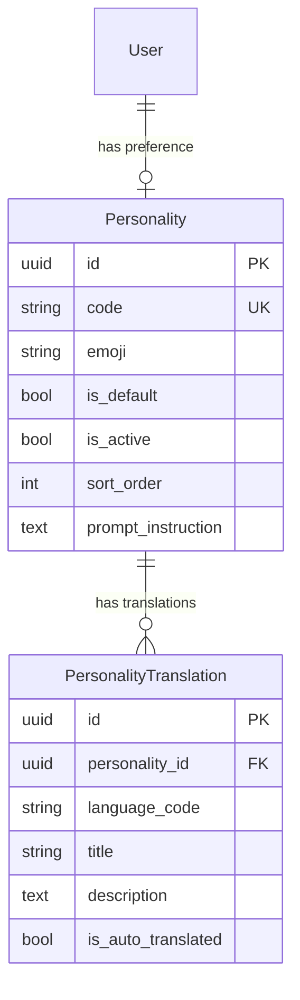
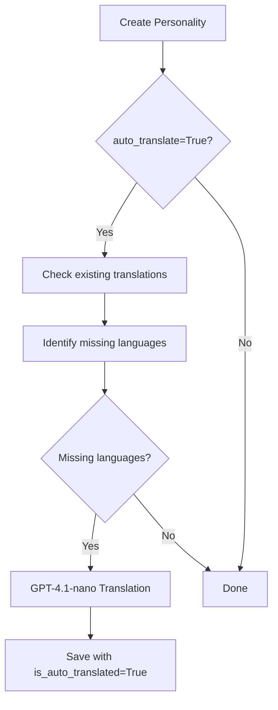

# PERSONALITIES - Gestion des Personnalités LLM

> **Documentation complète du système de personnalités : configuration du comportement de l'assistant IA**
>
> Version: 1.0
> Date: 2025-12-12

---

## Table des Matières

1. [Vue d'ensemble](#vue-densemble)
2. [Architecture](#architecture)
3. [Modèles de Données](#modèles-de-données)
4. [API Endpoints](#api-endpoints)
5. [Intégration avec les Prompts](#intégration-avec-les-prompts)
6. [Système de Traduction](#système-de-traduction)
7. [Configuration](#configuration)
8. [Usage Frontend](#usage-frontend)
9. [Administration](#administration)
10. [Troubleshooting](#troubleshooting)

---

## Vue d'ensemble

### Objectif

Le système de **Personnalités** permet de configurer le comportement et le ton de l'assistant IA. Chaque personnalité définit des instructions spécifiques injectées dans les prompts LLM, permettant une expérience utilisateur personnalisée.

### Concepts Clés

| Concept | Description |
|---------|-------------|
| **Personality** | Configuration de comportement LLM avec code unique et emoji |
| **Translation** | Titre et description localisés (6 langues supportées) |
| **prompt_instruction** | Texte injecté dans le placeholder `{personnalite}` des prompts |
| **is_default** | Personnalité par défaut pour les nouveaux utilisateurs |
| **Auto-translation** | Traduction automatique via GPT-4.1-nano |

### Langues Supportées

```python
SUPPORTED_LANGUAGES = ["fr", "en", "es", "de", "it", "zh-CN"]
```

---

## Architecture

### Structure des Fichiers

```
apps/api/src/domains/personalities/
├── __init__.py              # Exports du domaine
├── constants.py             # Constantes et valeurs par défaut
├── models.py                # Modèles SQLAlchemy (Personality, PersonalityTranslation)
├── schemas.py               # Schémas Pydantic (API validation)
├── router.py                # Endpoints FastAPI
├── service.py               # Logique métier
└── translation_service.py   # Service de traduction automatique
```

### Relations



---

## Modèles de Données

### Personality

**Fichier**: [apps/api/src/domains/personalities/models.py](../../apps/api/src/domains/personalities/models.py)

```python
class Personality(BaseModel):
    """
    Configuration de personnalité LLM.

    Attributes:
        code: Identifiant unique (e.g., 'enthusiastic', 'professor')
        emoji: Emoji d'affichage
        is_default: Personnalité par défaut (une seule active)
        is_active: Disponible pour sélection
        sort_order: Ordre d'affichage (lower = first)
        prompt_instruction: Instruction LLM (injectée dans {personnalite})
    """
    __tablename__ = "personalities"

    code: str                    # Unique, pattern: ^[a-z][a-z0-9_]*$
    emoji: str                   # Max 10 chars
    is_default: bool             # Default False
    is_active: bool              # Default True
    sort_order: int              # Default 0
    prompt_instruction: str      # Max 2000 chars
```

### PersonalityTranslation

```python
class PersonalityTranslation(BaseModel):
    """
    Métadonnées localisées (titre et description).

    Attributes:
        personality_id: FK vers Personality
        language_code: Code ISO (fr, en, es, de, it, zh-CN)
        title: Nom localisé (max 100 chars)
        description: Description localisée (max 500 chars)
        is_auto_translated: Créé par traduction automatique
    """
    __tablename__ = "personality_translations"

    personality_id: UUID         # FK CASCADE
    language_code: str           # Max 10 chars
    title: str                   # Max 100 chars
    description: str             # Max 500 chars
    is_auto_translated: bool     # Default False
```

### Contraintes

- `personality_translations` a une contrainte unique sur `(personality_id, language_code)`
- Une seule personnalité peut avoir `is_default = True`
- Le code suit le pattern `^[a-z][a-z0-9_]*$`

---

## API Endpoints

### Endpoints Utilisateur

| Méthode | Endpoint | Description |
|---------|----------|-------------|
| `GET` | `/api/v1/personalities` | Liste des personnalités actives (localisées) |
| `GET` | `/api/v1/personalities/current` | Personnalité actuelle de l'utilisateur |
| `PATCH` | `/api/v1/personalities/current` | Changer la personnalité |

### Endpoints Admin

| Méthode | Endpoint | Description |
|---------|----------|-------------|
| `GET` | `/api/v1/personalities/admin` | Liste complète (incluant inactives) |
| `GET` | `/api/v1/personalities/admin/{id}` | Détails personnalité |
| `POST` | `/api/v1/personalities/admin` | Créer personnalité |
| `PATCH` | `/api/v1/personalities/admin/{id}` | Modifier personnalité |
| `DELETE` | `/api/v1/personalities/admin/{id}` | Supprimer personnalité |
| `POST` | `/api/v1/personalities/admin/{id}/translations` | Ajouter traduction |
| `POST` | `/api/v1/personalities/admin/{id}/auto-translate` | Déclencher auto-traduction |

### Exemples de Requêtes

**Lister personnalités (utilisateur)**:
```bash
curl -X GET http://localhost:8000/api/v1/personalities \
  -H "Authorization: Bearer $TOKEN"
```

**Réponse**:
```json
{
  "personalities": [
    {
      "id": "550e8400-e29b-41d4-a716-446655440000",
      "code": "enthusiastic",
      "emoji": "🔥",
      "is_default": false,
      "title": "Enthousiaste",
      "description": "Assistant dynamique et encourageant"
    },
    {
      "id": "550e8400-e29b-41d4-a716-446655440001",
      "code": "professor",
      "emoji": "🎓",
      "is_default": false,
      "title": "Professeur",
      "description": "Style pédagogique avec explications détaillées"
    }
  ],
  "total": 2
}
```

**Changer sa personnalité**:
```bash
curl -X PATCH http://localhost:8000/api/v1/personalities/current \
  -H "Authorization: Bearer $TOKEN" \
  -H "Content-Type: application/json" \
  -d '{"personality_id": "550e8400-e29b-41d4-a716-446655440000"}'
```

**Créer une personnalité (admin)**:
```bash
curl -X POST http://localhost:8000/api/v1/personalities/admin \
  -H "Authorization: Bearer $ADMIN_TOKEN" \
  -H "Content-Type: application/json" \
  -d '{
    "code": "sarcastic",
    "emoji": "😏",
    "is_active": true,
    "is_default": false,
    "sort_order": 10,
    "prompt_instruction": "Tu es un assistant sarcastique mais utile.\n- Utilise l'\''humour avec modération.\n- Reste efficace malgré le ton léger.\n- Tutoie l'\''utilisateur.",
    "translations": [
      {
        "language_code": "fr",
        "title": "Sarcastique",
        "description": "Assistant avec une touche d'\''ironie"
      }
    ]
  }'
```

---

## Intégration avec les Prompts

### Mécanisme d'Injection

Le champ `prompt_instruction` est injecté dans le placeholder `{personnalite}` des prompts système.

**Prompt Response** (exemple):
```text
# Response System Prompt v3

Tu es INTELLIA, un assistant IA.

## Personnalité
{personnalite}

## Règles de Réponse
...
```

### Récupération de la Personnalité

```python
# apps/api/src/domains/agents/prompts/__init__.py

async def get_response_prompt_with_personality(
    user_id: UUID,
    db: AsyncSession,
    user_timezone: str = "Europe/Paris",
    user_language: str = "fr"
) -> ChatPromptTemplate:
    """
    Get response prompt with user's personality injected.
    """
    # Get user's personality
    service = PersonalityService(db)
    user = await get_user(user_id, db)

    personality = await service.get_user_personality(
        user.personality_id,
        user_language
    )

    # Load base prompt
    prompt_text = load_response_prompt(version="v3")

    # Inject personality
    personality_instruction = personality.prompt_instruction if personality else DEFAULT_PERSONALITY_PROMPT
    prompt_text = prompt_text.replace("{personnalite}", personality_instruction)

    # Build template
    return ChatPromptTemplate.from_messages([
        ("system", prompt_text),
        # ...
    ])
```

### Personnalité par Défaut

Si l'utilisateur n'a pas de préférence (`personality_id = NULL`), le système utilise:
1. La personnalité avec `is_default = True`
2. Sinon, `DEFAULT_PERSONALITY_PROMPT` de constants.py

```python
DEFAULT_PERSONALITY_PROMPT = """Tu es un assistant equilibre et professionnel.
- Reponds de maniere claire et concise.
- Adapte ton ton au contexte de la conversation.
- Sois utile sans etre excessif.
- Tutoie l'utilisateur."""
```

---

## Système de Traduction

### Architecture

**Fichier**: [apps/api/src/domains/personalities/translation_service.py](../../apps/api/src/domains/personalities/translation_service.py)

```python
class PersonalityTranslationService:
    """
    Service de traduction automatique via GPT-4.1-nano.

    Features:
    - Cache in-memory pour réduire appels LLM
    - Traduction batch pour efficacité
    - Fallback sur texte source en cas d'erreur
    """
```

### Flux de Traduction



### Configuration LLM

```python
# Translation uses nano model for cost efficiency
llm = ChatOpenAI(
    model="gpt-4.1-nano",
    temperature=0.3,  # Low for consistency
    max_tokens=200,   # Title + description
)
```

### Exemple de Prompt Traduction

```text
Translate the following personality description from French to English.
Keep the same tone and meaning.

Title: {title}
Description: {description}

Output JSON:
{"title": "...", "description": "..."}
```

---

## Configuration

### Constantes

**Fichier**: [apps/api/src/domains/personalities/constants.py](../../apps/api/src/domains/personalities/constants.py)

```python
# Langues supportées
SUPPORTED_LANGUAGES = ["fr", "en", "es", "de", "it", "zh-CN"]

# Personnalité par défaut
DEFAULT_PERSONALITY_CODE = "normal"

# Validation
PERSONALITY_CODE_PATTERN = r"^[a-z][a-z0-9_]*$"

# Limites
MAX_CODE_LENGTH = 50
MAX_EMOJI_LENGTH = 10
MAX_TITLE_LENGTH = 100
MAX_DESCRIPTION_LENGTH = 500
MAX_PROMPT_LENGTH = 2000
```

### Migration Base de Données

**Migration**: `2025_12_03_0000-add_personalities.py`

```python
# Tables créées:
# - personalities
# - personality_translations

# Index:
# - personalities.code (unique)
# - personalities.is_active
# - personality_translations.personality_id

# Contraintes:
# - uq_personality_translation_lang (personality_id, language_code)
```

---

## Usage Frontend

### Composant PersonalitySelector

**Fichier**: [apps/web/src/components/PersonalitySelector.tsx](../../apps/web/src/components/PersonalitySelector.tsx)

```typescript
interface PersonalityListItem {
  id: string;
  code: string;
  emoji: string;
  is_default: boolean;
  title: string;
  description: string;
}

export function PersonalitySelector() {
  const { data: personalities } = useApiQuery<PersonalityListResponse>(
    "/api/v1/personalities"
  );

  const updatePersonality = useApiMutation<UserPersonalityResponse>(
    "/api/v1/personalities/current",
    "PATCH"
  );

  return (
    <Select onValueChange={(id) => updatePersonality({ personality_id: id })}>
      {personalities?.personalities.map((p) => (
        <SelectItem key={p.id} value={p.id}>
          {p.emoji} {p.title}
        </SelectItem>
      ))}
    </Select>
  );
}
```

### Page Settings

**Fichier**: [apps/web/src/components/settings/PersonalitySettings.tsx](../../apps/web/src/components/settings/PersonalitySettings.tsx)

La sélection de personnalité est disponible dans les paramètres utilisateur.

---

## Administration

### Interface Admin

Les administrateurs peuvent gérer les personnalités via:
1. **API directe** (endpoints `/admin/*`)
2. **Interface Settings** avec composant `AdminPersonalitiesSection`

### Bonnes Pratiques

**Création de Personnalité**:

1. Définir un `code` descriptif et unique
2. Choisir un emoji représentatif
3. Rédiger `prompt_instruction` clair et concis:
   - Instructions de ton et style
   - Règles de comportement
   - Limites (ce que l'assistant ne doit pas faire)

**Exemple prompt_instruction**:
```text
Tu es un assistant enthousiaste et motivant.
- Utilise un ton positif et encourageant.
- Célèbre les réussites de l'utilisateur.
- Propose des alternatives constructives en cas de problème.
- Utilise des emojis avec modération.
- Tutoie l'utilisateur.
```

### Hiérarchie des Personnalités

1. **Personnalité utilisateur**: Si `user.personality_id` défini
2. **Personnalité par défaut**: Si `personality.is_default = True`
3. **Fallback constant**: `DEFAULT_PERSONALITY_PROMPT`

---

## Troubleshooting

### Problème 1: Personnalité non appliquée

**Symptômes**:
- L'assistant répond avec un ton par défaut
- Le changement de personnalité ne semble pas avoir d'effet

**Causes**:
1. `personality_id` non sauvegardé sur User
2. Prompt ne contient pas `{personnalite}` placeholder
3. Cache LLM retourne anciennes réponses

**Solutions**:
```python
# Vérifier personality_id sur User
SELECT id, personality_id FROM users WHERE id = 'user_id';

# Vérifier placeholder dans prompt
grep -r "{personnalite}" apps/api/src/domains/agents/prompts/

# Invalider cache si applicable
await llm_cache.invalidate_user(user_id)
```

### Problème 2: Traduction automatique échoue

**Symptômes**:
- Nouvelles personnalités n'ont qu'une langue
- Logs montrent erreurs LLM

**Causes**:
1. Rate limiting OpenAI
2. Erreur de validation JSON
3. Quota API dépassé

**Solutions**:
```python
# Vérifier logs
logger.info("personality_translated", ...)

# Déclencher manuellement
POST /api/v1/personalities/admin/{id}/auto-translate?source_language=fr

# Vérifier métriques
curl http://localhost:9090/api/v1/query?query=openai_api_errors_total
```

### Problème 3: Personnalité par défaut manquante

**Symptômes**:
- Nouveaux utilisateurs n'ont pas de personnalité
- Erreur "No default personality found"

**Causes**:
- Aucune personnalité avec `is_default = True`
- Migration seed non exécutée

**Solutions**:
```sql
-- Vérifier existence
SELECT * FROM personalities WHERE is_default = true;

-- Définir une par défaut
UPDATE personalities SET is_default = true WHERE code = 'normal';
```

---

## Métriques

### Prometheus (potentielles)

```python
# Métriques suggérées
personality_selection_total = Counter(
    'personality_selection_total',
    'Total personality selections',
    ['personality_code']
)

personality_translation_duration_seconds = Histogram(
    'personality_translation_duration_seconds',
    'Time to translate personality',
    ['source_language', 'target_language']
)
```

### Langfuse

Les personnalités sont trackées dans les traces via metadata:
```json
{
  "metadata": {
    "personality_code": "enthusiastic",
    "personality_id": "550e8400-..."
  }
}
```

---

## Références

**Code Source**:
- [models.py](../../apps/api/src/domains/personalities/models.py) - Modèles SQLAlchemy
- [schemas.py](../../apps/api/src/domains/personalities/schemas.py) - Schémas Pydantic
- [router.py](../../apps/api/src/domains/personalities/router.py) - Endpoints API
- [service.py](../../apps/api/src/domains/personalities/service.py) - Logique métier
- [translation_service.py](../../apps/api/src/domains/personalities/translation_service.py) - Traduction auto

**Documentation Liée**:
- [PROMPTS.md](PROMPTS.md) - Système de prompts
- [RESPONSE.md](RESPONSE.md) - Response Node et injection personnalité
- [STATE_AND_CHECKPOINT.md](STATE_AND_CHECKPOINT.md) - Gestion état utilisateur

---

**Fin de PERSONALITIES.md**

*Document généré le 2025-12-12*
*Qualité: Exhaustive et professionnelle*
