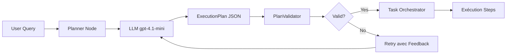
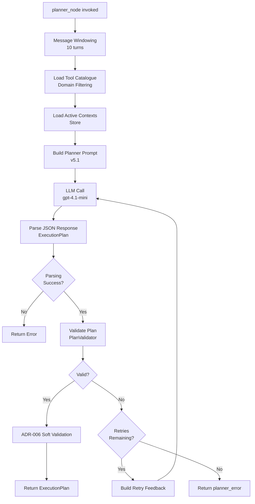
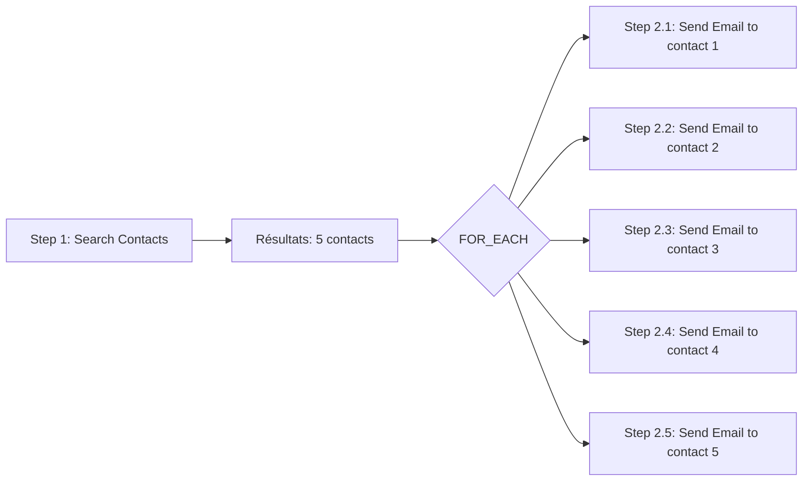
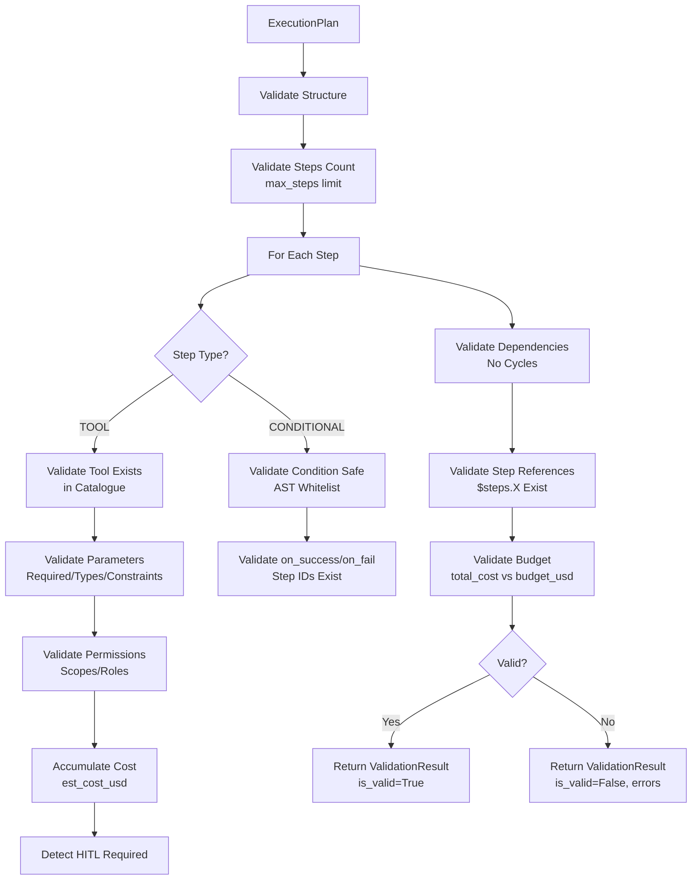
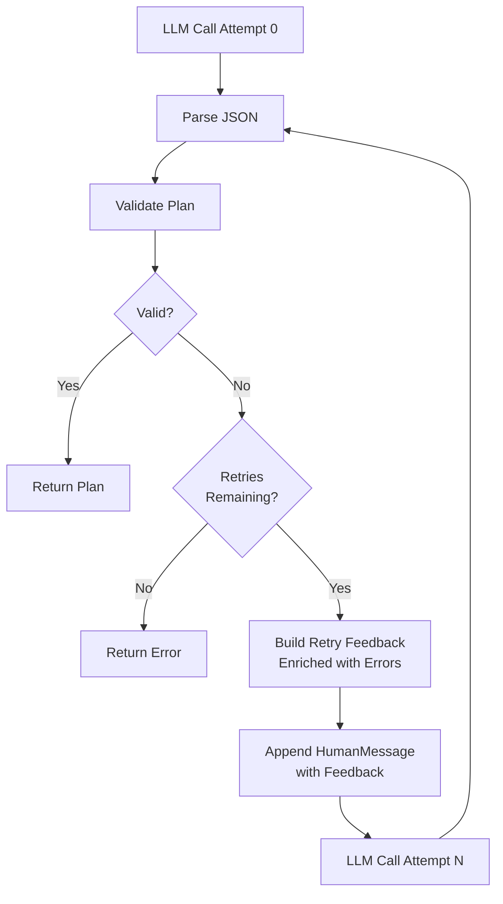
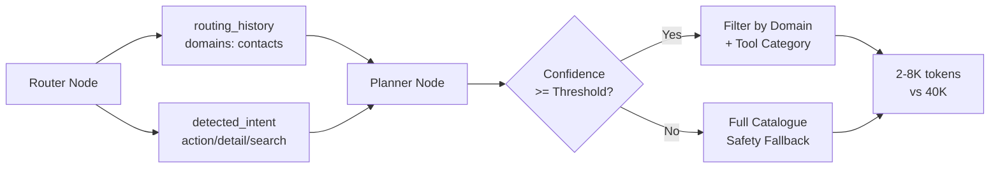
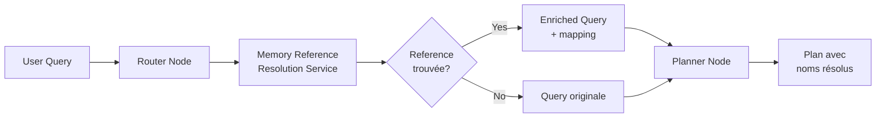

# PLANNER - Planner Node et ExecutionPlan DSL

> **Documentation complète du Planner Node : génération de plans d'exécution multi-agents avec LLM**
>
> Version: 3.1 (Architecture v3 - FOR_EACH Iteration Pattern)
> Date: 2026-01-22

---

## 📋 Table des Matières

1. [Vue d'ensemble](#vue-densemble)
2. [Architecture Planner Node](#architecture-planner-node)
3. [ExecutionPlan DSL](#executionplan-dsl)
4. [FOR_EACH Iteration Pattern](#for_each-iteration-pattern)
5. [Plan Validator](#plan-validator)
6. [Retry avec Feedback](#retry-avec-feedback)
7. [Domain Filtering & Tool Strategy](#-domain-filtering--tool-strategy)
8. [Memory Reference Resolution (Phase 7)](#-memory-reference-resolution-phase-7)
9. [Message Windowing](#message-windowing)
10. [Prompt Planner v5](#prompt-planner-v5)
11. [Exemples Complets](#exemples-complets)
12. [Métriques & Observabilité](#métriques--observabilité)
13. [Testing](#testing)
14. [Troubleshooting](#troubleshooting)

---

## 📖 Vue d'ensemble

### Objectif

Le **Planner Node** est le cerveau orchestrateur du système multi-agents LIA. Il génère des **ExecutionPlan** structurés qui coordonnent l'exécution de multiples tools à travers différents agents.

### Responsabilités



**Inputs**:
- User query (dernière HumanMessage)
- Tool catalogue filtré (domain filtering)
- Active contexts (Store)
- Routing history (domains détectés)
- `exclude_tools` (optional, set[str]) — tools to exclude from catalogue (F6: used after sub-agent rejection to remove `delegate_to_sub_agent_tool`)

**Outputs**:
- `ExecutionPlan` validé (Pydantic model)
- `planner_metadata` (pour streaming frontend)
- `planner_error` (si échec après retries)
- `validation_result` (pour approval gate)

> **F6 — Sub-agent delegation**: The `delegate_to_sub_agent_tool` is a transversal tool always included in the filtered catalogue via `NormalFilteringStrategy`. The planner prompt contains a `{sub_agents_section}` with guidelines on when to delegate. When a user rejects a plan with delegation steps, the approval gate sets `exclude_sub_agent_tools=True` in state, and the planner re-invokes with `exclude_tools={"delegate_to_sub_agent_tool"}` to generate a fallback plan using direct tools.

### Concepts Clés

| Concept | Description |
|---------|-------------|
| **ExecutionPlan** | Plan structuré avec steps, dépendances, conditions |
| **ExecutionStep** | Étape atomique (TOOL, CONDITIONAL, REPLAN, HUMAN) |
| **DSL** | Domain-Specific Language pour décrire plans multi-agents |
| **PlanValidator** | Validation exhaustive (params, permissions, coûts, dépendances) |
| **Retry Loop** | Retry avec feedback enrichi (LangChain RetryWithErrorOutputParser pattern) |
| **Domain Filtering** | Catalogue filtré par domains (80-90% token reduction) |
| **Message Windowing** | 10 derniers turns conversationnels (performance) |

---

## 🏗️ Architecture Planner Node

### Flow Complet



### Fichier Source

**Fichier**: [apps/api/src/domains/agents/nodes/planner_node_v3.py](../../apps/api/src/domains/agents/nodes/planner_node_v3.py)

**Longueur**: ~200 lignes

> **⚠️ Architecture v3.0** : Le planner node est maintenant un orchestrateur simple.
> Toute l'intelligence est externalisée dans `SmartPlannerService` qui gère :
> - **UN seul appel LLM** (au lieu de 3 stages legacy)
> - **Catalogue filtré** par intent sémantique (pas le catalogue complet)
> - **Cross-domain** géré par templates (pas par LLM)
>
> **Token efficiency** :
> - Legacy: Stage1 (1600) + Stage2 (12000) + Stage3 (500) = 14,100 tokens
> - Current: Single call with filtered catalogue = ~1,500 tokens
> - **Savings: 89%**
>
> **PANIC MODE** : Si la planification échoue avec le catalogue filtré,
> retry automatique avec catalogue étendu.
>
> **PATTERN LEARNING** : Injection de patterns validés dans le prompt planner.
> Voir [PLAN_PATTERN_LEARNER.md](./PLAN_PATTERN_LEARNER.md) pour les détails.

**Decorators**:
```python
@trace_node("planner_v3")  # Langfuse tracing
@track_metrics(node_name="planner_v3")
```

### Signature Fonction

```python
async def planner_node(
    state: MessagesState,
    config: RunnableConfig
) -> dict[str, Any]:
    """
    Planner Node: Génère ExecutionPlan using LLM.

    Args:
        state: Current LangGraph state with messages and routing history.
        config: Runnable config with metadata (run_id, user_id, session_id).

    Returns:
        Updated state dict with:
        - execution_plan: ExecutionPlan validé (ou None si erreur)
        - planner_metadata: Métadonnées pour streaming frontend
        - planner_error: None si succès, dict avec détails si échec
        - validation_result: ValidationResult (pour approval_gate routing)

    Raises:
        PlanValidationError: Si plan validation échoue (catchée en interne)
        Exception: Si LLM call ou parsing échoue (catchée en interne)
    """
```

### Code Complet Annoté

```python
async def planner_node(state: MessagesState, config: RunnableConfig) -> dict[str, Any]:
    run_id = config.get("metadata", {}).get("run_id", "unknown")
    settings = get_settings()

    logger.info(
        "planner_started",
        run_id=run_id,
        turn_id=state.get(STATE_KEY_CURRENT_TURN_ID, 0),
        message_count=len(state[STATE_KEY_MESSAGES]),
    )

    try:
        # ====================================================================
        # 0. Apply message windowing for performance optimization
        # ====================================================================
        # Planner needs moderate context for plan generation (10 turns default)
        # Store provides additional business context (active contexts, entities)
        from src.domains.agents.utils.message_windowing import get_planner_windowed_messages

        windowed_messages = get_planner_windowed_messages(state[STATE_KEY_MESSAGES])

        # ====================================================================
        # 1. Extract user query from messages
        # ====================================================================
        messages = windowed_messages  # Use windowed messages instead of full state
        if not messages:
            logger.warning("planner_no_messages", run_id=run_id)
            raise ValueError("No messages in state")

        # Get last user message
        user_message = None
        for msg in reversed(messages):
            if hasattr(msg, "type") and msg.type == "human":
                user_message = msg.content
                break

        if not user_message:
            logger.warning("planner_no_user_message", run_id=run_id)
            raise ValueError("No user message found")

        # ====================================================================
        # 2. Load tool catalogue from AgentRegistry (Phase 3: Dynamic Filtering)
        # ====================================================================
        registry = get_global_registry()

        # Phase 3: Multi-domain dynamic filtering (ALWAYS ENABLED)
        # Router v7 detects domains → Planner loads filtered catalogue
        planner_domain_filtering_active.set(1)  # Always enabled

        routing_history = state.get(STATE_KEY_ROUTING_HISTORY, [])
        router_output = routing_history[-1] if routing_history else None

        if router_output and hasattr(router_output, "domains") and router_output.domains:
            detected_domains = router_output.domains
            router_confidence = router_output.confidence

            # Metric: Track router confidence score for domain detection
            fallback_triggered = router_confidence < settings.domain_filtering_confidence_threshold
            planner_domain_confidence_score.labels(
                fallback_triggered=str(fallback_triggered).lower()
            ).observe(router_confidence)

            # Safety fallback: If router confidence too low, load full catalogue
            if router_confidence >= settings.domain_filtering_confidence_threshold:
                # Load filtered catalogue (80-90% token reduction)
                catalogue = registry.export_for_prompt_filtered(
                    domains=detected_domains,
                    max_tools_per_domain=settings.domain_filtering_max_tools_per_domain,
                )
                logger.info(
                    "planner_catalogue_filtered",
                    run_id=run_id,
                    detected_domains=detected_domains,
                    router_confidence=router_confidence,
                    filtering_applied=catalogue.get("filtering_applied", False),
                    domains_loaded=catalogue.get("domains_loaded", []),
                )
            else:
                # Low confidence → fallback to full catalogue
                logger.warning(
                    "planner_domain_filtering_low_confidence_fallback",
                    run_id=run_id,
                    router_confidence=router_confidence,
                    threshold=settings.domain_filtering_confidence_threshold,
                    action="Loading full catalogue (safety fallback)",
                )
                catalogue = registry.export_for_prompt()
        else:
            # No domains detected (conversational query) → load full catalogue
            catalogue = registry.export_for_prompt()

        # Metric: Track catalogue size distribution (filtered vs full)
        tool_count = sum(len(agent.get("tools", [])) for agent in catalogue.get("agents", []))
        filtering_applied = catalogue.get("filtering_applied", False)
        domains_loaded = ",".join(sorted(catalogue.get("domains_loaded", ["all"])))

        planner_catalogue_size_tools.labels(
            filtering_applied=str(filtering_applied).lower(),
            domains_loaded=domains_loaded
        ).observe(tool_count)

        logger.info(
            "planner_catalogue_loaded",
            run_id=run_id,
            tool_count=tool_count,
            agent_count=len(catalogue.get("agents", [])),
        )

        # ====================================================================
        # 2b. Load active contexts from Store (Phase 5 - Context-aware planning)
        # ====================================================================
        active_contexts = []
        try:
            # LangGraph v1.0: Store is NOT accessible via config.get("store") in nodes
            # For nodes, we must access the global Store singleton
            from src.domains.agents.context.store import get_tool_context_store

            store = await get_tool_context_store()
            user_id = config.get("configurable", {}).get("user_id")
            session_id = extract_session_id_from_config(config, required=False)

            if user_id and session_id:  # Validate both user_id and session_id
                from src.domains.agents.context.manager import ToolContextManager

                context_manager = ToolContextManager()
                active_contexts = await context_manager.list_active_domains(
                    user_id=str(user_id), session_id=session_id, store=store
                )

                logger.info(
                    "planner_active_contexts_loaded",
                    run_id=run_id,
                    active_count=len(active_contexts),
                    domains=[c["domain"] for c in active_contexts],
                )
        except Exception as e:
            # Non-blocking: context awareness is optional enhancement
            logger.warning("planner_active_contexts_failed", run_id=run_id, error=str(e))

        # ====================================================================
        # 3. Build context section from active contexts
        # ====================================================================
        if active_contexts:
            context_items = []
            for ctx in active_contexts:
                context_items.append(
                    f"  - {ctx['domain']}: {ctx['items_count']} items available"
                    + (
                        f" (current: index {ctx['current_item'].get('index', 'N/A')})"
                        if ctx.get("current_item")
                        else ""
                    )
                )
            context_section = f"""Active contexts from previous searches:
{chr(10).join(context_items)}

**Use `resolve_reference`** if user references these items (e.g., "the first one", "last", "2nd").
**Use search tools directly** for new search terms (e.g., "jean", "Jean")."""
        else:
            context_section = """No active contexts available. User has not performed searches yet.

**Do NOT use `resolve_reference`** - use search tools directly for all queries."""

        # ====================================================================
        # 4. Get planner prompt messages with pre-formatted data
        # ====================================================================
        # Pre-format large/dynamic data BEFORE message creation
        catalogue_json = json.dumps(catalogue, indent=2, ensure_ascii=False)

        # Get prompt messages (returns list of [SystemMessage, HumanMessage])
        messages = get_planner_prompt(
            context_section=context_section,
            catalogue_json=catalogue_json,
            user_message=user_message,
        )

        # ====================================================================
        # 5. Call LLM with messages directly (LangChain v1.0)
        # ====================================================================
        from src.domains.agents.graphs.base_agent_builder import LLMConfig
        from src.infrastructure.llm.invoke_helpers import enrich_config_with_node_metadata

        # Get planner LLM with custom config
        llm = get_llm(
            llm_type="planner",
            config_override=LLMConfig(
                model=settings.planner_llm_model,
                temperature=settings.planner_llm_temperature,
                max_tokens=settings.planner_llm_max_tokens,
            ),
        )

        # Build config with timeout and callbacks
        llm_config: RunnableConfig = {"timeout": settings.planner_timeout_seconds}
        if config:
            # Merge node config (callbacks) with timeout
            llm_config = {**config, "timeout": settings.planner_timeout_seconds}

        # Enrich config with node metadata for token tracking + Langfuse
        node_name = (
            config.get("metadata", {}).get("langgraph_node", "planner") if config else "planner"
        )
        llm_config = enrich_config_with_node_metadata(llm_config, node_name)

        # ====================================================================
        # RETRY LOOP: Validation-based retry with enriched feedback
        # Implements LangChain v1.0 RetryWithErrorOutputParser pattern
        # ====================================================================
        max_retries = settings.planner_max_replans  # Default: 2
        execution_plan = None
        last_validation_result = None
        retry_messages = messages.copy()  # Copy to avoid mutating original state
        plan_dict = None  # For error reporting

        for retry_attempt in range(max_retries + 1):  # 0=initial, 1-N=retries
            is_retry = retry_attempt > 0

            # Track retry metrics (Prometheus)
            if is_retry:
                error_type = (
                    last_validation_result.errors[0].code.value
                    if last_validation_result and last_validation_result.errors
                    else "unknown"
                )
                planner_retries_total.labels(
                    retry_attempt=str(retry_attempt),
                    validation_error_type=error_type,
                ).inc()

            # Call LLM with messages directly
            response = await llm.ainvoke(retry_messages, config=llm_config)
            llm_output = response.content.strip()

            # ====================================================================
            # 6. Parse JSON response into ExecutionPlan
            # ====================================================================
            original_output = llm_output

            try:
                # Extract JSON if wrapped in markdown code blocks
                if llm_output.startswith("```"):
                    llm_output = llm_output.split("```")[1]
                    if llm_output.startswith("json"):
                        llm_output = llm_output[4:].strip()

                plan_dict = json.loads(llm_output)

                # Add required fields if missing
                plan_dict["user_id"] = str(config.get("configurable", {}).get("user_id", ""))
                plan_dict["session_id"] = extract_session_id_from_config(config, required=True)

                # Parse into Pydantic model
                execution_plan = ExecutionPlan.model_validate(plan_dict)

            except json.JSONDecodeError as e:
                logger.error("planner_json_parse_failed", run_id=run_id, error=str(e))
                planner_errors_total.labels(error_type="json_parse_error").inc()
                break  # Exit retry loop - JSON errors won't be fixed by retry

            except Exception as e:
                logger.error("planner_pydantic_validation_failed", run_id=run_id, error=str(e))
                planner_errors_total.labels(error_type="pydantic_validation_error").inc()
                break  # Exit retry loop

            # ====================================================================
            # 7. Validate ExecutionPlan
            # ====================================================================
            if execution_plan is None:
                break  # Exit retry loop, will return error below

            validator = PlanValidator(registry=registry)

            # Fetch user's OAuth scopes from state
            user_oauth_scopes = state.get("oauth_scopes", [])

            validation_context = ValidationContext(
                user_id=str(config.get("configurable", {}).get("user_id", "")),
                session_id=extract_session_id_from_config(config, required=False),
                available_scopes=user_oauth_scopes,
                max_steps=settings.planner_max_steps,
                budget_usd=settings.planner_max_cost_usd,
            )

            validation_result = validator.validate_execution_plan(
                plan=execution_plan,
                context=validation_context,
            )

            if not validation_result.is_valid:
                # Store validation result for potential retry
                last_validation_result = validation_result

                logger.warning(
                    "planner_validation_failed",
                    run_id=run_id,
                    retry_attempt=retry_attempt,
                    errors=[err.message for err in validation_result.errors][:3],
                    will_retry=(retry_attempt < max_retries),
                )

                if retry_attempt < max_retries:
                    # RETRY: Build enriched feedback with validation errors
                    planner_plans_rejected_total.labels(
                        reason="validation_failed_will_retry",
                    ).inc()

                    feedback = _build_retry_feedback_message(
                        validation_errors=validation_result.errors,
                        invalid_plan_json=json.dumps(plan_dict, indent=2),
                        retry_attempt=retry_attempt + 1,
                    )

                    # Append feedback to messages for next iteration
                    retry_messages = messages.copy()
                    retry_messages.append(HumanMessage(content=feedback))

                    # Continue to next retry attempt
                    continue
                else:
                    # MAX RETRIES EXHAUSTED
                    planner_retry_exhausted_total.labels(
                        final_error_type=validation_result.errors[0].code.value,
                    ).inc()
                    break
            else:
                # VALIDATION SUCCESS
                last_validation_result = validation_result

                if is_retry:
                    planner_retry_success_total.labels(
                        retry_attempt=str(retry_attempt),
                    ).inc()

                # Success - break out of retry loop
                break

        # ====================================================================
        # ADR-006: Soft Validation for List Operations (after hard validation)
        # ====================================================================
        if execution_plan and last_validation_result and last_validation_result.is_valid:
            _validate_list_operations(execution_plan, run_id)

        # ====================================================================
        # After Retry Loop: Determine final return based on state
        # ====================================================================
        if execution_plan and last_validation_result and last_validation_result.is_valid:
            # SUCCESS PATH
            logger.info(
                "planner_final_success",
                run_id=run_id,
                plan_id=execution_plan.plan_id,
                total_attempts=retry_attempt + 1,
            )

            # Track metrics
            planner_plans_created_total.labels(
                execution_mode=execution_plan.execution_mode,
            ).inc()

            # Update plan with validated cost
            execution_plan.estimated_cost_usd = last_validation_result.total_cost_usd

            # Build planner metadata for streaming to frontend
            planner_metadata = {
                "plan_id": execution_plan.plan_id,
                "step_count": len(execution_plan.steps),
                "execution_mode": execution_plan.execution_mode,
                "estimated_cost_usd": last_validation_result.total_cost_usd,
                "steps": [
                    {
                        "step_id": step.step_id,
                        "step_type": step.step_type,
                        "tool": step.tool_name if step.step_type == "TOOL" else None,
                        "agent": step.agent_name if step.step_type == "TOOL" else None,
                    }
                    for step in execution_plan.steps
                ],
                "validation": {
                    "is_valid": last_validation_result.is_valid,
                    "warnings_count": len(last_validation_result.warnings),
                },
            }

            return {
                STATE_KEY_EXECUTION_PLAN: execution_plan,
                STATE_KEY_PLANNER_METADATA: planner_metadata,
                STATE_KEY_PLANNER_ERROR: None,  # Clear any previous error
                STATE_KEY_VALIDATION_RESULT: last_validation_result,
            }

        elif execution_plan and last_validation_result and not last_validation_result.is_valid:
            # VALIDATION FAILED - Retries exhausted
            planner_plans_rejected_total.labels(reason="validation_failed").inc()

            # Build error details for frontend streaming
            error_details = [
                {
                    "severity": "error",
                    "code": err.code.value,
                    "message": err.message,
                    "step_index": err.step_index,
                }
                for err in last_validation_result.errors
            ]

            return {
                STATE_KEY_EXECUTION_PLAN: None,
                STATE_KEY_PLANNER_ERROR: {
                    "plan_id": execution_plan.plan_id,
                    "errors": error_details,
                    "message": f"Plan rejected after {retry_attempt} retries",
                },
            }
        else:
            # PARSING FAILED
            return {
                STATE_KEY_EXECUTION_PLAN: None,
                STATE_KEY_PLANNER_ERROR: {
                    "message": "Failed to parse or validate execution plan",
                },
            }

    except Exception as e:
        logger.error("planner_failed", run_id=run_id, error=str(e), exc_info=True)
        planner_errors_total.labels(error_type="unknown_error").inc()

        return {
            STATE_KEY_EXECUTION_PLAN: None,
            "planner_error": {
                "message": f"Planner failed: {e!s}",
                "type": type(e).__name__,
            },
        }
```

---

## 🔧 ExecutionPlan DSL

### Domain-Specific Language

**Fichier source**: [apps/api/src/domains/agents/orchestration/plan_schemas.py](apps/api/src/domains/agents/orchestration/plan_schemas.py)

Le DSL (Domain-Specific Language) définit le format structuré des plans d'exécution multi-agents.

### StepType Enum

```python
class StepType(str, Enum):
    """
    Types d'étapes supportées dans un ExecutionPlan.

    MVP (Phase 1):
    - TOOL: Exécution d'un tool via agent
    - CONDITIONAL: Branchement conditionnel basé sur résultats

    Future (Phase 2):
    - REPLAN: Regénération de plan par le planner LLM
    - HUMAN: Demande d'approbation HITL (Human-In-The-Loop)
    """

    TOOL = "TOOL"
    CONDITIONAL = "CONDITIONAL"
    REPLAN = "REPLAN"  # Phase 2
    HUMAN = "HUMAN"  # Phase 2
```

### ExecutionStep Model

```python
class ExecutionStep(BaseModel):
    """
    Une étape d'exécution dans un plan multi-agents.

    Phase 3.2.8.2: Frozen model for performance (immutable after creation).

    Attributes:
        step_id: Identifiant unique du step (ex: "step_1", "search_contacts")
        step_type: Type de step (TOOL, CONDITIONAL, etc.)
        agent_name: Nom de l'agent responsable (requis pour TOOL)
        tool_name: Nom du tool à exécuter (requis pour TOOL)
        parameters: Paramètres du tool (peut contenir références $steps.X)
        depends_on: Liste des step_ids dont dépend ce step
        condition: Expression conditionnelle Python safe (requis pour CONDITIONAL)
        on_success: Step_id à exécuter si condition = True
        on_fail: Step_id à exécuter si condition = False ou erreur
        timeout_seconds: Timeout d'exécution (None = pas de timeout)
        approvals_required: Si True, nécessite approbation HITL
        description: Description textuelle du step (pour UI/logs)
    """

    model_config = {"frozen": True}  # Immutable for performance

    step_id: str = Field(description="Identifiant unique du step")
    step_type: StepType = Field(description="Type de step")
    agent_name: str | None = Field(default=None, description="Nom de l'agent (requis pour TOOL)")
    tool_name: str | None = Field(default=None, description="Nom du tool (requis pour TOOL)")
    parameters: dict[str, Any] = Field(
        default_factory=dict,
        description="Paramètres du tool (peut contenir références $steps.X)",
    )
    depends_on: list[str] = Field(
        default_factory=list,
        description="Liste des step_ids dont dépend ce step",
    )
    condition: str | None = Field(
        default=None,
        description="Expression conditionnelle Python safe (requis pour CONDITIONAL)",
    )
    on_success: str | None = Field(
        default=None,
        description="Step_id à exécuter si condition = True"
    )
    on_fail: str | None = Field(
        default=None,
        description="Step_id à exécuter si condition = False ou erreur"
    )
    timeout_seconds: int | None = Field(
        default=None,
        description="Timeout d'exécution en secondes"
    )
    approvals_required: bool = Field(
        default=False,
        description="Si True, nécessite approbation HITL",
    )
    description: str = Field(
        default="",
        description="Description textuelle du step"
    )

    @field_validator("step_id")
    @classmethod
    def validate_step_id(cls, v: str) -> str:
        """Valide que step_id est non-vide et sans espaces"""
        if not v or not v.strip():
            raise ValueError("step_id cannot be empty")
        if " " in v:
            raise ValueError("step_id cannot contain spaces")
        return v.strip()

    @field_validator("agent_name")
    @classmethod
    def validate_agent_name(cls, v: str | None, info: ValidationInfo) -> str | None:
        """Valide que agent_name est requis pour TOOL"""
        if info.data.get("step_type") == StepType.TOOL and not v:
            raise ValueError("agent_name is required for TOOL steps")
        return v

    @field_validator("tool_name")
    @classmethod
    def validate_tool_name(cls, v: str | None, info: ValidationInfo) -> str | None:
        """Valide que tool_name est requis pour TOOL"""
        if info.data.get("step_type") == StepType.TOOL and not v:
            raise ValueError("tool_name is required for TOOL steps")
        return v

    @field_validator("condition")
    @classmethod
    def validate_condition(cls, v: str | None, info: ValidationInfo) -> str | None:
        """Valide que condition est requise pour CONDITIONAL"""
        if info.data.get("step_type") == StepType.CONDITIONAL and not v:
            raise ValueError("condition is required for CONDITIONAL steps")
        return v
```

### ExecutionPlan Model

```python
class ExecutionPlan(BaseModel):
    """
    Plan d'exécution multi-agents complet.

    Généré par le planner LLM, validé par le validator, exécuté par l'orchestrateur.

    Phase 3.2.8.2: Frozen model for performance (immutable after creation).

    Attributes:
        plan_id: Identifiant unique du plan (UUID)
        user_id: ID de l'utilisateur (pour permissions et context)
        session_id: ID de session (pour continuité conversationnelle)
        steps: Liste ordonnée des steps à exécuter
        execution_mode: Mode d'exécution ("sequential" pour MVP, "parallel" future)
        max_cost_usd: Coût maximum autorisé (validation)
        estimated_cost_usd: Coût estimé basé sur manifests
        max_timeout_seconds: Timeout global du plan
        version: Version du format DSL (semver)
        created_at: Timestamp de création
        metadata: Métadonnées additionnelles (query, intention, etc.)
    """

    model_config = {"frozen": True}  # Immutable for performance

    plan_id: str = Field(
        default_factory=lambda: str(uuid4()),
        description="Identifiant unique du plan (UUID)",
    )
    user_id: str = Field(description="ID utilisateur")
    session_id: str = Field(default="", description="ID session")
    steps: list[ExecutionStep] = Field(description="Liste ordonnée des steps")
    execution_mode: Literal["sequential", "parallel"] = Field(
        default="sequential",
        description="Mode d'exécution",
    )
    max_cost_usd: float | None = Field(
        default=None,
        description="Coût maximum autorisé"
    )
    estimated_cost_usd: float = Field(
        default=0.0,
        description="Coût estimé basé sur manifests"
    )
    max_timeout_seconds: int | None = Field(
        default=None,
        description="Timeout global du plan"
    )
    version: str = Field(
        default="1.0.0",
        description="Version du format DSL"
    )
    created_at: datetime = Field(
        default_factory=lambda: datetime.now(UTC),
        description="Timestamp de création (UTC)",
    )
    metadata: dict[str, Any] = Field(
        default_factory=dict,
        description="Métadonnées additionnelles",
    )

    @field_validator("steps")
    @classmethod
    def validate_steps_not_empty(cls, v: list[ExecutionStep]) -> list[ExecutionStep]:
        """Valide qu'il y a au moins un step"""
        if not v:
            raise ValueError("Plan must contain at least one step")
        return v

    @field_validator("steps")
    @classmethod
    def validate_step_ids_unique(cls, v: list[ExecutionStep]) -> list[ExecutionStep]:
        """Valide que les step_ids sont uniques"""
        step_ids = [step.step_id for step in v]
        if len(step_ids) != len(set(step_ids)):
            duplicates = [sid for sid in step_ids if step_ids.count(sid) > 1]
            raise ValueError(f"Duplicate step_ids found: {duplicates}")
        return v
```

### Exemple Plan Complet

```python
from src.domains.agents.orchestration.plan_schemas import ExecutionPlan, ExecutionStep, StepType

# Plan simple : recherche contacts
plan = ExecutionPlan(
    plan_id=str(uuid4()),
    user_id="user_123",
    session_id="sess_456",
    steps=[
        ExecutionStep(
            step_id="search",
            step_type=StepType.TOOL,
            agent_name="contacts_agent",
            tool_name="search_contacts_tool",
            parameters={"query": "Jean", "max_results": 10},
            description="Search for contact 'Jean'"
        )
    ],
    execution_mode="sequential",
    max_cost_usd=0.01,
)

# Plan complexe : recherche + validation + détails OU fallback
plan = ExecutionPlan(
    plan_id=str(uuid4()),
    user_id="user_123",
    session_id="sess_456",
    steps=[
        ExecutionStep(
            step_id="search",
            step_type=StepType.TOOL,
            agent_name="contacts_agent",
            tool_name="search_contacts_tool",
            parameters={"query": "Jean", "max_results": 5},
            description="Search for contact 'Jean'"
        ),
        ExecutionStep(
            step_id="check",
            step_type=StepType.CONDITIONAL,
            condition="len($steps.search.contacts) > 0",
            on_success="get_details",
            on_fail="broader_search",
            depends_on=["search"],
            description="Check if contact found"
        ),
        ExecutionStep(
            step_id="get_details",
            step_type=StepType.TOOL,
            agent_name="contacts_agent",
            tool_name="get_contact_details_tool",
            parameters={"resource_name": "$steps.search.contacts[0].resource_name"},
            depends_on=["search"],
            description="Get full contact details"
        ),
        ExecutionStep(
            step_id="broader_search",
            step_type=StepType.TOOL,
            agent_name="contacts_agent",
            tool_name="search_contacts_tool",
            parameters={"query": "J", "max_results": 10},
            description="Broader fallback search"
        )
    ],
    execution_mode="sequential",
    max_cost_usd=0.05,
)
```

---

## 🔄 FOR_EACH Iteration Pattern

> **Version 3.1** : Pattern permettant d'itérer sur les résultats d'une step précédente pour des opérations bulk.

### Concept

Le pattern FOR_EACH permet de générer dynamiquement des exécutions répétées d'un tool sur chaque élément d'une collection résultante d'une step précédente.



### ExecutionStep avec FOR_EACH

```python
# Fichier: apps/api/src/domains/agents/orchestration/schemas.py

class ExecutionStep(BaseModel):
    # ... autres champs ...

    for_each: str | None = Field(
        default=None,
        description="Reference FOR_EACH: $steps.<step_id>.<field_path>"
    )
    for_each_max: int | None = Field(
        default=None,
        description="Limite max d'itérations (protection contre boucles infinies)"
    )
```

### Syntaxe DSL

```python
# Step provider : génère la collection
ExecutionStep(
    step_id="get_contacts",
    step_type=StepType.TOOL,
    agent_name="contacts_agent",
    tool_name="search_contacts_tool",
    parameters={"query": "Marketing", "max_results": 20}
)

# Step iterator : itère sur les résultats
ExecutionStep(
    step_id="send_emails",
    step_type=StepType.TOOL,
    agent_name="emails_agent",
    tool_name="send_email_tool",
    for_each="$steps.get_contacts.contacts",  # Reference au provider
    for_each_max=10,  # Limite à 10 itérations
    depends_on=["get_contacts"],  # Dépendance explicite
    parameters={
        "to": "$item.email",           # $item = élément courant
        "subject": "Hello $item.name",
        "body": "Message personnalisé pour $item.name"
    }
)
```

### Variables Spéciales

| Variable | Description | Exemple |
|----------|-------------|---------|
| `$item` | Élément courant de l'itération | `$item.email`, `$item.name` |
| `$item_index` | Index de l'itération (0-based) | `0`, `1`, `2`, ... |
| `$steps.<step_id>.<field>` | Référence au résultat d'une step | `$steps.search.contacts[0].email` |

### Utilitaires FOR_EACH

**Fichier** : `apps/api/src/domains/agents/orchestration/for_each_utils.py`

```python
# Patterns regex partagés
FOR_EACH_REF_PATTERN = re.compile(r"^\$steps\.([a-zA-Z_][a-zA-Z0-9_]*)\.(.+)$")
ITEM_REF_PATTERN = re.compile(r"\$item(?:\.([a-zA-Z_][a-zA-Z0-9_.]*))?")

def parse_for_each_reference(ref: str) -> tuple[str, str]:
    """
    Parse une référence FOR_EACH.

    Args:
        ref: "$steps.get_contacts.contacts"

    Returns:
        ("get_contacts", "contacts")
    """
    ...

def get_for_each_provider_step_id(for_each_ref: str) -> str:
    """Extrait uniquement step_id depuis la référence."""
    ...

def is_for_each_ready_for_expansion(
    for_each_ref: str,
    completed_steps: dict[str, Any]
) -> bool:
    """Vérifie si le provider step est complété."""
    ...

def count_items_at_path(data: Any, field_path: str) -> int:
    """Compte les items à la path pour HITL pre-execution."""
    ...
```

### HITL Thresholds

Les opérations FOR_EACH déclenchent des confirmations HITL selon les seuils configurables :

| Variable Env | Default | Description |
|--------------|---------|-------------|
| `FOR_EACH_MUTATION_THRESHOLD` | 1 | Mutations (send/update/delete) ≥N → HITL obligatoire |
| `FOR_EACH_APPROVAL_THRESHOLD` | 5 | Non-mutations ≥N → advisory dans UI |
| `FOR_EACH_WARNING_THRESHOLD` | 10 | Non-mutations ≥N → HITL obligatoire |

### Exemple Complet

```python
# Cas d'usage : "Envoie un email de rappel à tous les contacts du groupe RH"

plan = ExecutionPlan(
    plan_id="bulk_email_plan",
    user_id="user_123",
    session_id="sess_456",
    steps=[
        # Step 1: Récupérer les contacts RH
        ExecutionStep(
            step_id="get_rh_contacts",
            step_type=StepType.TOOL,
            agent_name="contacts_agent",
            tool_name="search_contacts_tool",
            parameters={
                "query": "RH",
                "max_results": 50
            },
            description="Recherche contacts du groupe RH"
        ),

        # Step 2: FOR_EACH - Envoyer email à chaque contact
        ExecutionStep(
            step_id="send_reminder",
            step_type=StepType.TOOL,
            agent_name="emails_agent",
            tool_name="send_email_tool",
            for_each="$steps.get_rh_contacts.contacts",
            for_each_max=25,  # Limite sécurité
            depends_on=["get_rh_contacts"],
            parameters={
                "to": "$item.email",
                "subject": "Rappel : Réunion mensuelle RH",
                "body": "Bonjour $item.name,\n\nRappel pour la réunion RH demain."
            },
            approvals_required=True,  # Force HITL vu mutation bulk
            description="Envoi email rappel à chaque contact"
        )
    ],
    execution_mode="sequential"
)
```

### Expansion Runtime

Le **Parallel Executor** détecte les steps FOR_EACH et les expand en runtime :

```python
# apps/api/src/domains/agents/orchestration/parallel_executor.py

async def _expand_for_each_step(
    self,
    step: ExecutionStep,
    completed_steps: dict[str, Any]
) -> list[ExecutionStep]:
    """
    Expand une step FOR_EACH en N steps concrètes.

    1. Parse for_each reference
    2. Récupère items du provider step
    3. Génère N steps avec $item substitué
    4. Retourne liste de steps expandées
    """
    ...
```

---

## ✅ Plan Validator

### PlanValidator Class

**Fichier source**: [apps/api/src/domains/agents/orchestration/validator.py](apps/api/src/domains/agents/orchestration/validator.py)

Le **PlanValidator** effectue une validation exhaustive des plans avant exécution.

### ValidationContext

```python
@dataclass
class ValidationContext:
    """
    Contexte de validation pour un plan.

    Attributes:
        user_id: Identifiant utilisateur
        session_id: Identifiant session
        available_scopes: Liste des scopes OAuth disponibles
        user_roles: Liste des roles utilisateur
        budget_usd: Budget max en USD (None = pas de limite)
        allow_hitl: Si False, rejette tools nécessitant HITL
        max_steps: Nombre max de steps autorisés (None = pas de limite)
    """

    user_id: str
    session_id: str
    available_scopes: list[str] = field(default_factory=list)
    user_roles: list[str] = field(default_factory=list)
    budget_usd: float | None = None
    allow_hitl: bool = True
    max_steps: int | None = None
```

### ValidationResult

```python
@dataclass
class ValidationResult:
    """
    Résultat de validation d'un plan.

    Attributes:
        is_valid: True si plan valide (aucune erreur)
        errors: Liste des erreurs bloquantes
        warnings: Liste des warnings non-bloquants
        total_cost_usd: Coût total estimé du plan
        total_steps: Nombre total de steps
        requires_hitl: Si True, au moins un step nécessite HITL
        validated_at: Timestamp de validation
    """

    is_valid: bool
    errors: list[ValidationIssue] = field(default_factory=list)
    warnings: list[ValidationIssue] = field(default_factory=list)
    total_cost_usd: float = 0.0
    total_steps: int = 0
    requires_hitl: bool = False
    validated_at: datetime = field(default_factory=lambda: datetime.now(UTC))
```

### Validations Effectuées



### Code Validation Complète

```python
class PlanValidator:
    """
    Validator pour plans d'exécution agents.

    Validations effectuées :
    1. Paramètres : conformité avec ParameterSchema (types, contraintes, requis)
    2. Permissions : scopes OAuth requis, roles autorisés
    3. Coûts : budget total, coût par step
    4. HITL : détection tools nécessitant approbation humaine
    5. Structure : steps valides, tools existants, dépendances
    """

    def __init__(self, registry: AgentRegistry) -> None:
        """Initialise le validator avec le registry de manifests."""
        self.registry = registry

    def validate_execution_plan(
        self,
        plan: ExecutionPlan,
        context: ValidationContext
    ) -> ValidationResult:
        """
        Valide un ExecutionPlan (format DSL Phase 5).

        Args:
            plan: ExecutionPlan à valider (Pydantic model)
            context: Contexte de validation (user, scopes, budget)

        Returns:
            ValidationResult avec is_valid, errors, warnings
        """
        result = ValidationResult(is_valid=True)

        # Valider nombre max de steps
        result.total_steps = len(plan.steps)
        if context.max_steps and result.total_steps > context.max_steps:
            result.add_error(
                code=ToolErrorCode.CONSTRAINT_VIOLATION,
                message=f"Plan exceeds max steps limit: {result.total_steps} > {context.max_steps}",
            )

        # Valider chaque step
        for idx, step in enumerate(plan.steps):
            self._validate_execution_step(step, idx, context, result)

        # Valider dépendances (pas de cycles)
        self._validate_dependencies(plan.steps, result)

        # Valider références dans conditions et paramètres
        self._validate_step_references(plan.steps, result)

        # Valider budget total
        if context.budget_usd is not None and result.total_cost_usd > context.budget_usd:
            result.add_error(
                code=ToolErrorCode.CONSTRAINT_VIOLATION,
                message=f"Plan exceeds budget: ${result.total_cost_usd:.4f} > ${context.budget_usd:.4f}",
            )

        # Valider HITL
        if result.requires_hitl and not context.allow_hitl:
            result.add_error(
                code=ToolErrorCode.FORBIDDEN,
                message="Plan requires HITL approval but HITL is not allowed in this context",
            )

        logger.info(
            "execution_plan_validated",
            plan_id=plan.plan_id,
            is_valid=result.is_valid,
            errors_count=len(result.errors),
            warnings_count=len(result.warnings),
            total_cost_usd=result.total_cost_usd,
        )

        # Log individual errors/warnings for debugging
        for issue in result.errors:
            logger.warning(
                "execution_plan_validation_error",
                plan_id=plan.plan_id,
                code=issue.code.value,
                message=issue.message,
                step_index=issue.step_index,
                tool_name=issue.tool_name,
                context=issue.context,
            )
        for issue in result.warnings:
            logger.info(
                "execution_plan_validation_warning",
                plan_id=plan.plan_id,
                code=issue.code.value,
                message=issue.message,
                step_index=issue.step_index,
                tool_name=issue.tool_name,
                context=issue.context,
            )

        return result

    def _validate_execution_step(
        self,
        step: ExecutionStep,
        step_index: int,
        context: ValidationContext,
        result: ValidationResult,
    ) -> None:
        """Valide un ExecutionStep."""

        # TOOL steps : valider tool existe et params
        if step.step_type == StepType.TOOL:
            if not step.tool_name:
                result.add_error(
                    code=ToolErrorCode.INVALID_INPUT,
                    message=f"Step {step.step_id}: tool_name required for TOOL steps",
                )
                return

            # Récupérer manifest du tool
            try:
                manifest = self.registry.get_tool_manifest(step.tool_name)
            except ToolManifestNotFound:
                result.add_error(
                    code=ToolErrorCode.NOT_FOUND,
                    message=f"Tool '{step.tool_name}' not found in catalogue",
                )
                return

            # Valider paramètres
            self._validate_step_parameters(step.parameters, manifest, step_index, result)

            # Valider permissions
            self._validate_permissions(manifest, context, step_index, result)

            # Accumuler coût
            step_cost = manifest.cost.est_cost_usd
            result.total_cost_usd += step_cost

            # Détecter HITL
            if manifest.permissions.hitl_required or step.approvals_required:
                result.requires_hitl = True

        # CONDITIONAL steps : valider condition safe
        elif step.step_type == StepType.CONDITIONAL:
            if not step.condition:
                result.add_error(
                    code=ToolErrorCode.INVALID_INPUT,
                    message=f"Step {step.step_id}: condition required for CONDITIONAL steps",
                )
                return

            # Valider que la condition est safe (whitelist AST)
            self._validate_condition_safe(step.condition, step.step_id, step_index, result)

    def _validate_condition_safe(
        self, condition: str, step_id: str, step_index: int, result: ValidationResult
    ) -> None:
        """
        Valide qu'une condition est safe (whitelist AST).

        Vérifie que la condition ne contient que des opérations sûres:
        - Comparaisons: ==, !=, <, >, <=, >=
        - Booléens: and, or, not
        - Longueurs: len()
        - Accès fields: $steps.X.field
        """
        import ast
        import re

        # Remplacer $steps.X par variable safe pour parsing AST
        safe_condition = re.sub(
            r"\$steps\.[a-zA-Z_][a-zA-Z0-9_]*(\.[a-zA-Z_][a-zA-Z0-9_]*)*",
            "var",
            condition
        )

        try:
            tree = ast.parse(safe_condition, mode="eval")
        except SyntaxError as e:
            result.add_error(
                code=ToolErrorCode.INVALID_INPUT,
                message=f"Invalid condition syntax: {e}",
            )
            return

        # Whitelist des nodes AST autorisés
        allowed_nodes = {
            ast.Expression, ast.Compare, ast.BoolOp, ast.UnaryOp,
            ast.Call, ast.Name, ast.Constant, ast.Attribute, ast.Subscript,
            ast.Load, ast.Eq, ast.NotEq, ast.Lt, ast.LtE, ast.Gt, ast.GtE,
            ast.And, ast.Or, ast.Not, ast.In, ast.NotIn,
        }

        for node in ast.walk(tree):
            if type(node) not in allowed_nodes:
                result.add_error(
                    code=ToolErrorCode.FORBIDDEN,
                    message=f"Unsafe node in condition: {node.__class__.__name__}",
                )
                return

            # Vérifier que Call est uniquement len()
            if isinstance(node, ast.Call):
                if isinstance(node.func, ast.Name) and node.func.id != "len":
                    result.add_error(
                        code=ToolErrorCode.FORBIDDEN,
                        message=f"Only len() function allowed in conditions, got: {node.func.id}",
                    )
                    return

    def _validate_dependencies(
        self, steps: list[ExecutionStep], result: ValidationResult
    ) -> None:
        """Valide qu'il n'y a pas de dépendances cycliques."""

        # Créer graph de dépendances
        step_ids = {step.step_id for step in steps}
        graph: dict[str, list[str]] = {step.step_id: step.depends_on for step in steps}

        # Vérifier que toutes les dépendances existent
        for step in steps:
            for dep in step.depends_on:
                if dep not in step_ids:
                    result.add_error(
                        code=ToolErrorCode.INVALID_INPUT,
                        message=f"Step {step.step_id} depends on non-existent step: {dep}",
                    )

        # Détecter cycles (DFS)
        visited = set()
        rec_stack = set()

        def has_cycle(node: str) -> bool:
            visited.add(node)
            rec_stack.add(node)

            for neighbor in graph.get(node, []):
                if neighbor not in visited:
                    if has_cycle(neighbor):
                        return True
                elif neighbor in rec_stack:
                    return True

            rec_stack.remove(node)
            return False

        for step_id in step_ids:
            if step_id not in visited:
                if has_cycle(step_id):
                    result.add_error(
                        code=ToolErrorCode.INVALID_INPUT,
                        message="Cyclic dependency detected in plan steps",
                    )
                    break

    def _validate_step_references(
        self, steps: list[ExecutionStep], result: ValidationResult
    ) -> None:
        """
        Valide que toutes les références $steps.X dans conditions et paramètres
        pointent vers des steps qui existent et qui seront exécutés AVANT.
        """
        import re

        # Créer mapping step_id -> index pour validation d'ordre
        step_indices = {step.step_id: idx for idx, step in enumerate(steps)}
        step_ids = set(step_indices.keys())

        # Pattern pour extraire les références $steps.X
        reference_pattern = re.compile(r"\$steps\.([a-zA-Z_][a-zA-Z0-9_]*)")

        for idx, step in enumerate(steps):
            # Collecter toutes les chaînes à analyser
            strings_to_check = []

            # Condition pour CONDITIONAL steps
            if step.step_type == StepType.CONDITIONAL and step.condition:
                strings_to_check.append(("condition", step.condition))

            # Paramètres pour TOOL steps
            if step.step_type == StepType.TOOL and step.parameters:
                for param_name, param_value in step.parameters.items():
                    if isinstance(param_value, str):
                        strings_to_check.append((f"parameter '{param_name}'", param_value))

            # Validation on_success et on_fail pour CONDITIONAL steps
            if step.step_type == StepType.CONDITIONAL:
                # Liste des valeurs interdites (placeholders génériques)
                forbidden_step_ids = {
                    "done", "error", "end", "success", "fail",
                    "complete", "finished", "abort", "stop",
                }

                if step.on_success:
                    # Vérifier valeurs interdites (ONLY if step doesn't exist)
                    if step.on_success in forbidden_step_ids and step.on_success not in step_ids:
                        result.add_error(
                            code=ToolErrorCode.INVALID_INPUT,
                            message=(
                                f"Step {step.step_id}: on_success uses forbidden placeholder "
                                f"'{step.on_success}'. Must reference an actual step_id."
                            ),
                        )
                    # Vérifier que le step référencé existe
                    elif step.on_success not in step_ids:
                        result.add_error(
                            code=ToolErrorCode.INVALID_INPUT,
                            message=f"Step {step.step_id}: on_success references non-existent step '{step.on_success}'",
                        )

                if step.on_fail:
                    # Même validation pour on_fail
                    if step.on_fail in forbidden_step_ids and step.on_fail not in step_ids:
                        result.add_error(
                            code=ToolErrorCode.INVALID_INPUT,
                            message=(
                                f"Step {step.step_id}: on_fail uses forbidden placeholder "
                                f"'{step.on_fail}'. Must reference an actual step_id."
                            ),
                        )
                    elif step.on_fail not in step_ids:
                        result.add_error(
                            code=ToolErrorCode.INVALID_INPUT,
                            message=f"Step {step.step_id}: on_fail references non-existent step '{step.on_fail}'",
                        )

            # Analyser toutes les chaînes collectées
            for source, string_value in strings_to_check:
                matches = reference_pattern.findall(string_value)

                for referenced_step_id in matches:
                    # Vérifier que le step référencé existe
                    if referenced_step_id not in step_ids:
                        result.add_error(
                            code=ToolErrorCode.INVALID_INPUT,
                            message=f"Step {step.step_id}: {source} references non-existent step: {referenced_step_id}",
                        )
                        continue

                    # Vérifier pas de référence circulaire
                    if referenced_step_id == step.step_id:
                        result.add_error(
                            code=ToolErrorCode.INVALID_INPUT,
                            message=f"Step {step.step_id}: {source} has circular reference to itself",
                        )
                        continue

                    # Vérifier ordre d'exécution (pas de forward reference)
                    referenced_idx = step_indices[referenced_step_id]
                    if referenced_idx >= idx:
                        result.add_error(
                            code=ToolErrorCode.INVALID_INPUT,
                            message=(
                                f"Step {step.step_id}: {source} references step {referenced_step_id} "
                                f"that will be executed later (index {referenced_idx} >= {idx})"
                            ),
                        )
```

---

## 🔄 Retry avec Feedback

### LangChain RetryWithErrorOutputParser Pattern

Le Planner implémente le pattern **RetryWithErrorOutputParser** de LangChain v1.0 pour améliorer la qualité des plans générés.

### Flow Retry



### Build Retry Feedback Function

```python
def _build_retry_feedback_message(
    validation_errors: list[Any],
    invalid_plan_json: str,
    retry_attempt: int,
) -> str:
    """
    Build enriched feedback message for LLM retry after validation error.

    This feedback helps the LLM understand what went wrong and how to fix it,
    implementing the LangChain v1.0 retry-with-error pattern for structured outputs.

    Args:
        validation_errors: List of ValidationIssue objects from validator
        invalid_plan_json: The JSON plan that was rejected (for LLM reference)
        retry_attempt: Current retry attempt number (1-indexed)

    Returns:
        Formatted feedback message to append to prompt as new HumanMessage
    """
    feedback = f"\n\n{'='*80}\n"
    feedback += f"⚠️ RETRY ATTEMPT #{retry_attempt} - PREVIOUS PLAN WAS INVALID\n"
    feedback += f"{'='*80}\n\n"

    feedback += "**Your previous plan was rejected due to validation errors.**\n\n"

    # List all errors with details
    feedback += "**VALIDATION ERRORS:**\n"
    for i, err in enumerate(validation_errors, 1):
        feedback += f"{i}. {err.message}\n"
        if hasattr(err, "context") and err.context:
            feedback += f"   Context: {err.context}\n"

    feedback += "\n**YOUR INVALID PLAN (for reference):**\n"
    feedback += "```json\n"
    # Limit to 1000 chars to avoid token explosion
    feedback += invalid_plan_json[:1000]
    if len(invalid_plan_json) > 1000:
        feedback += "\n... (truncated)"
    feedback += "\n```\n\n"

    # Specific guidance based on error types
    has_missing_step_error = any(
        "non-existent step" in err.message.lower() or "missing" in err.message.lower()
        for err in validation_errors
    )

    if has_missing_step_error:
        feedback += "**HOW TO FIX:**\n"
        feedback += "- CRITICAL: Every step_id referenced in `on_success` and `on_fail` MUST exist in your steps array\n"
        feedback += "- FORBIDDEN step_ids: 'done', 'error', 'end', 'success', 'fail'\n"
        feedback += "- You MUST create actual TOOL steps for fallback paths\n"
        feedback += "- Example: If `on_fail: 'not_found'`, you MUST include a step with `step_id: 'not_found'`\n\n"

    feedback += "**INSTRUCTIONS FOR RETRY:**\n"
    feedback += "1. Review the validation errors above carefully\n"
    feedback += "2. Ensure ALL step_ids referenced in conditionals exist in your steps array\n"
    feedback += "3. Create missing steps (especially fallback steps for on_fail conditions)\n"
    feedback += "4. Return a COMPLETE, VALID ExecutionPlan JSON\n\n"
    feedback += "Generate a corrected plan now:\n"

    return feedback
```

### Exemple Retry Scenario

**Attempt 0** - LLM génère plan invalide:
```json
{
  "steps": [
    {"step_id": "search", "tool_name": "search_contacts_tool", "parameters": {"query": "Jean"}},
    {
      "step_id": "check",
      "step_type": "CONDITIONAL",
      "condition": "len($steps.search.contacts) > 0",
      "on_success": "get_details",
      "on_fail": "error"  // ❌ 'error' n'existe pas dans steps
    }
  ]
}
```

**Validator returns errors**:
- `Step check: on_fail uses forbidden placeholder 'error'`

**Retry Feedback** (appended as HumanMessage):
```
================================================================================
⚠️ RETRY ATTEMPT #1 - PREVIOUS PLAN WAS INVALID
================================================================================

**Your previous plan was rejected due to validation errors.**

**VALIDATION ERRORS:**
1. Step check: on_fail uses forbidden placeholder 'error'. Must reference an actual step_id that exists in steps array.

**YOUR INVALID PLAN (for reference):**
```json
{
  "steps": [
    {"step_id": "search", ...},
    {"step_id": "check", "on_fail": "error"}
  ]
}
```

**HOW TO FIX:**
- CRITICAL: Every step_id referenced in `on_success` and `on_fail` MUST exist in your steps array
- FORBIDDEN step_ids: 'done', 'error', 'end', 'success', 'fail'
- You MUST create actual TOOL steps for fallback paths

**INSTRUCTIONS FOR RETRY:**
1. Review the validation errors above carefully
2. Ensure ALL step_ids referenced in conditionals exist
3. Create missing steps (especially fallback steps for on_fail conditions)
4. Return a COMPLETE, VALID ExecutionPlan JSON
```

**Attempt 1** - LLM génère plan corrigé:
```json
{
  "steps": [
    {"step_id": "search", "tool_name": "search_contacts_tool", "parameters": {"query": "Jean"}},
    {
      "step_id": "check",
      "step_type": "CONDITIONAL",
      "condition": "len($steps.search.contacts) > 0",
      "on_success": "get_details",
      "on_fail": "broader_search"  // ✅ Référence un step réel
    },
    {"step_id": "get_details", "tool_name": "get_contact_details_tool", ...},
    {"step_id": "broader_search", "tool_name": "search_contacts_tool", "parameters": {"query": "J"}}
  ]
}
```

**Validator**: ✅ Valid → Plan accepté

---

## 🎯 Domain Filtering & Tool Strategy

### Objectif

**Réduction tokens**: 80-90% de réduction du catalogue via :
1. **Domain Filtering** : Charger uniquement les tools des domains détectés
2. **Tool Strategy** : Filtrer par catégorie selon l'intention sémantique (Phase 7)

### Flow Domain + Intent Filtering



### Tool Strategy (Phase 7)

Le Planner utilise `detected_intent` du Router pour filtrer les tools par catégorie :

| Intent | Categories Included | Typical Tools |
|--------|---------------------|---------------|
| `action` | BASE + create/update/delete/send/details/readonly | ~15 tools |
| `detail` | BASE + details/readonly | ~6 tools |
| `search` | BASE + readonly | ~8 tools |
| `list` | BASE + readonly | ~8 tools |
| `full` | All categories | ~34 tools |

**BASE** = `{search, list, system}` - toujours inclus

### Code Domain + Intent Filtering

```python
# Read detected_intent from Router (Phase 7)
detected_intent = state.get(STATE_KEY_DETECTED_INTENT, "full")

# Map intent to tool_strategy (1:1 mapping)
tool_strategy = detected_intent if detected_intent else "full"

# Load filtered catalogue (domain + intent)
if router_confidence >= settings.domain_filtering_confidence_threshold:
    catalogue = registry.export_for_prompt_filtered(
        domains=detected_domains,
        max_tools_per_domain=settings.domain_filtering_max_tools_per_domain,
        include_context_utilities=has_active_context,
        tool_strategy=tool_strategy,  # NEW: Intent-based filtering
    )
```

### Fallback Mechanism (Phase 7)

Si le Planner échoue avec le catalogue filtré, retry automatique avec stratégie "full" :

```python
# If planner failed AND strategy was not "full"
if tool_strategy != "full":
    logger.warning("planner_fallback_to_full_strategy", ...)

    # Re-prepare with full strategy
    catalogue_retry, _ = _load_catalogue(
        registry, state, settings, run_id,
        force_full_strategy=True  # Override intent
    )

    # Retry plan generation
    execution_plan_retry = await planner_service.generate_plan(
        catalogue=catalogue_retry,
        ...
    )
```

### Configuration

```python
# apps/api/src/core/config.py

class Settings(BaseSettings):
    # Domain Filtering
    domain_filtering_confidence_threshold: float = 0.70
    domain_filtering_max_tools_per_domain: int = 50
```

### Bénéfices

| Metric | Sans Filtering | Avec Filtering | Réduction |
|--------|----------------|----------------|-----------|
| **Tokens catalogue** | 40,000 tokens | 4,000 tokens | **90%** |
| **Latency LLM call** | 8-12s | 2-4s | **60-70%** |
| **Cost per call** | $0.02 | $0.002 | **90%** |
| **Scalability** | Max 3-4 domains | Max 10+ domains | **3x+** |

---

## 🧠 Memory Reference Resolution (Phase 7)

### Objectif

**Phase 7 - 2025-12-23**: Résoudre les **références relationnelles** dans les requêtes utilisateur AVANT la génération du plan.

Exemples :
- "envoie un email à mon frère" → "envoie un email à jean dupond"
- "appelle ma femme" → "appelle Sophie Martin"

### Architecture



### Service

```python
# apps/api/src/domains/agents/services/memory_reference_resolution_service.py

class MemoryReferenceResolutionService:
    """
    Resolve memory-based references in user queries.

    Examples:
    - "mon frère" → "jean dupond" (si mémoire contient cette relation)
    - "ma patronne" → "Marie Dupont"
    """

    async def resolve_references(
        self,
        query: str,
        user_id: str,
        store: AsyncPostgresStore,
    ) -> ReferenceResolutionResult:
        """
        Résout les références relationnelles.

        Returns:
            - resolved_query: Query avec références remplacées
            - mappings: dict[str, str] (ref → nom résolu)
            - confidence: float (confiance moyenne des résolutions)
        """
```

### Flow dans Planner

```python
# Dans planner_node_v3.py

# 1. Résoudre références mémoire AVANT plan generation
from src.domains.agents.services.memory_reference_resolution_service import (
    MemoryReferenceResolutionService
)

memory_resolver = MemoryReferenceResolutionService()
resolution_result = await memory_resolver.resolve_references(
    query=user_message,
    user_id=user_id,
    store=store,
)

# 2. Utiliser query enrichie pour plan generation
enriched_query = resolution_result.resolved_query

# 3. Injecter mapping dans le prompt context
if resolution_result.mappings:
    context_section += f"""
Memory Reference Mappings:
{chr(10).join(f'  - "{k}" → "{v}"' for k, v in resolution_result.mappings.items())}
"""
```

### Exemple Complet

**Input**:
```
User: "envoie un email à mon frère pour lui souhaiter bon anniversaire"
```

**Memory Search**:
```
Query: "frère" → Memory: "jean est le frère de l'utilisateur"
```

**Resolution**:
```python
ReferenceResolutionResult(
    original_query="envoie un email à mon frère pour lui souhaiter bon anniversaire",
    resolved_query="envoie un email à jean pour lui souhaiter bon anniversaire",
    mappings={"mon frère": "jean"},
    confidence=0.92,
)
```

**Plan généré**:
```json
{
    "steps": [
        {
            "step_id": "search_contact",
            "tool_name": "search_contacts",
            "parameters": {"query": "jean"}  // Nom résolu, pas "mon frère"
        },
        {
            "step_id": "send_email",
            "tool_name": "send_email",
            "parameters": {
                "to": "$steps.search_contact.contacts[0].email",
                "subject": "Bon anniversaire !",
                "body": "Joyeux anniversaire jean !"
            }
        }
    ]
}
```

### Configuration

```python
# apps/api/src/core/config/agents.py
class AgentsSettings:
    memory_reference_resolution_enabled: bool = True
    memory_reference_resolution_timeout_ms: int = 2000
    memory_reference_resolution_min_confidence: float = 0.7
```

**Voir**: [MEMORY_RESOLUTION.md](MEMORY_RESOLUTION.md) | [LONG_TERM_MEMORY.md](LONG_TERM_MEMORY.md)

---

## 📐 Message Windowing

### Objectif

**Performance optimization**: Planner needs moderate context (10 turns default) au lieu de full conversation history (50+ turns).

### get_planner_windowed_messages

```python
# apps/api/src/domains/agents/utils/message_windowing.py

def get_planner_windowed_messages(
    messages: list[BaseMessage],
    max_turns: int = 10,
) -> list[BaseMessage]:
    """
    Get windowed messages for planner node.

    Planner needs moderate context for plan generation:
    - Recent user queries (10 turns default)
    - SystemMessage always preserved
    - Store provides additional business context (active contexts, entities)

    Args:
        messages: Full message history
        max_turns: Maximum conversational turns to keep (default: 10)

    Returns:
        Windowed messages (SystemMessage + last 10 turns)
    """
    if not messages:
        return []

    # Preserve SystemMessage
    system_messages = [m for m in messages if isinstance(m, SystemMessage)]
    non_system_messages = [m for m in messages if not isinstance(m, SystemMessage)]

    # Keep last N turns (HumanMessage + AIMessage pairs)
    windowed = non_system_messages[-max_turns * 2:] if len(non_system_messages) > max_turns * 2 else non_system_messages

    return system_messages + windowed
```

### Usage dans Planner Node

```python
# Phase: Performance Optimization - Message Windowing
from src.domains.agents.utils.message_windowing import get_planner_windowed_messages

windowed_messages = get_planner_windowed_messages(state[STATE_KEY_MESSAGES])

# Use windowed messages instead of full state
messages = windowed_messages
```

### Bénéfices

| Metric | Sans Windowing | Avec Windowing | Réduction |
|--------|----------------|----------------|-----------|
| **Tokens messages** | 100,000 tokens | 7,000 tokens | **93%** |
| **Latency LLM call** | 15-20s | 2-4s | **75-80%** |
| **Cost per call** | $0.05 | $0.0035 | **93%** |

---

## 📝 Prompt Planner (v5 → Consolidated v1)

### Version Actuelle

**Fichier**: [apps/api/src/domains/agents/prompts/v1/planner_system_prompt.txt](apps/api/src/domains/agents/prompts/v1/planner_system_prompt.txt)

> **Note**: Le prompt v5 a été consolidé dans v1 (décembre 2025). Le versioning historique v5.1 est conservé dans le contenu du fichier.

**Version**: v5.1 (consolidated to v1) - Analytical Reasoning Patterns (2025-11-12)

**Longueur**: ~3,200 tokens (659 lignes)

### Sections du Prompt

1. **DOMAIN FILTERING** (lignes 5-24)
   - Context: Catalogue filtré par domains
   - Responsibility: Work ONLY with provided tools
   - Benefits: Faster planning, scalability

2. **EXECUTION PLAN SCHEMA** (lignes 26-93)
   - Simple query example (1 step)
   - Complex query example (multi-step validation)
   - CRITICAL: Prefer SIMPLE pattern

3. **STEP TYPES** (lignes 95-112)
   - TOOL Steps (execute tools)
   - CONDITIONAL Steps (branching)
   - CRITICAL: Use ACTUAL step_ids, NOT placeholders

4. **REFERENCE RESOLUTION** (lignes 114-135)
   - `$steps.STEP_ID.FIELD` syntax
   - Wildcard `[*]` for batch operations
   - Type matching (string vs array)

5. **TOOL SELECTION STRATEGY** (lignes 137-150)
   - Match user intent to tool descriptions
   - Let tool descriptions guide decisions

6. **BEST PRACTICES** (lignes 152-163)
   - Check for NEW criteria FIRST
   - Prioritize correctness over simplicity
   - Detect analytical intent
   - Separate retrieval from reasoning

7. **ERROR HANDLING: VALIDATION PATTERNS** (lignes 165-216)
   - ❌ DO NOT add validation for standalone queries
   - ✅ DO add validation for multi-step workflows
   - Fallback steps must use REAL tools

8. **CONTEXTUAL REFERENCE RESOLUTION** (lignes 218-350)
   - When to use context resolution tools
   - ❌ FORBIDDEN: Using list_contacts for references
   - ✅ CORRECT: Pattern for single/multiple references
   - Key distinction: VERB determines intent

9. **ANALYTICAL REASONING PATTERNS** (lignes 352-473) ⭐ **NEW v5.1**
   - Pattern 1: Comparison & Ranking
   - Pattern 2: Relationship Finding (Progressive Enrichment)
   - Pattern 3: Attribute Matching
   - Pattern 4: Aggregation & Statistics
   - Decision tree for analytical queries

10. **TOOL USAGE RESTRICTIONS** (lignes 475-574)
    - ❌ CRITICAL: list_contacts_tool REQUIRES Query Parameter
    - Why forbidden without query (resource waste)
    - ✅ CORRECT Alternatives

11. **YOUR TASK** (lignes 576-633)
    - Classify query type
    - For ANALYTICAL queries: Follow patterns
    - For RETRIEVAL queries: Check for NEW criteria
    - Design the plan structure

### Analytical Reasoning Patterns (v5.1 NEW) ⭐

**Pattern 2: Relationship Finding** (THE KEY PATTERN)

```
User: "qui pourrait être la femme de jean dupond"

Strategy - PROGRESSIVE DATA ENRICHMENT:
1. Step 1: Identify subject - Search for "jean dupond"
2. Step 2: Enrich subject data - Get FULL details (age, address, organization)
3. Step 3: Generate search criteria - Based on subject, search "dupond" (family name)
4. Step 4: Fetch candidates - Search using generated criteria
5. Step 5: Validate candidates - Check if candidates found
6. Step 6: Get complete candidate data - Fetch ALL fields for comparison
7. Result: Response node has complete dataset for relationship inference

Plan Generated:
{
  "steps": [
    {"step_id": "find_jean", "tool_name": "search_contacts_tool", "parameters": {"query": "jean dupond"}},
    {"step_id": "check_jean", "condition": "len($steps.find_jean.contacts) > 0", "on_success": "get_jean_details", "on_fail": "not_found"},
    {"step_id": "get_jean_details", "tool_name": "get_contact_details_tool", "parameters": {"resource_name": "$steps.find_jean.contacts[0].resource_name"}},
    {"step_id": "search_dupond", "tool_name": "search_contacts_tool", "parameters": {"query": "dupond"}, "depends_on": ["get_jean_details"]},
    {"step_id": "check_candidates", "condition": "len($steps.search_dupond.contacts) > 1", "on_success": "get_all_details", "on_fail": "no_candidates"},
    {"step_id": "get_all_details", "tool_name": "get_contact_details_tool", "parameters": {"resource_names": "$steps.search_dupond.contacts[*].resource_name"}},
    {"step_id": "no_candidates", "tool_name": "search_contacts_tool", "parameters": {"query": ""}}
  ],
  "metadata": {
    "reasoning": "Find jean → get his full details (age, address) → search family name 'dupond' → get all candidates' details → response node compares: feminine name, similar age (±10y), same address → infers spouse"
  }
}

Response Node Receives:
- Jean's full data: {age: 45, address: "123 rue X", ...}
- All Dupond contacts: [{name: "Marie Dupond", age: 42, address: "123 rue X"}, ...]
- Can infer: Marie likely spouse (same address, close age, feminine name)
```

**Key Insight**: Tools can't reason → Response node (LLM) CAN reason → Planner orchestrates **progressive data enrichment**

---

## 💡 Exemples Complets

### Exemple 1: Simple Search

**User Query**: "recherche jean"

**Plan Généré**:
```json
{
  "plan_id": "plan_123",
  "user_id": "user_456",
  "session_id": "sess_789",
  "steps": [
    {
      "step_id": "search",
      "step_type": "TOOL",
      "agent_name": "contacts_agent",
      "tool_name": "search_contacts_tool",
      "parameters": {"query": "jean", "max_results": 10},
      "description": "Search for contact 'jean'"
    }
  ],
  "execution_mode": "sequential",
  "max_cost_usd": 0.01,
  "metadata": {
    "reasoning": "Simple search - no validation needed, response node handles empty results"
  }
}
```

**Validation**: ✅ Valid

**Exécution**:
1. `search_contacts_tool(query="jean")` → Returns contacts
2. Response node formats results

---

### Exemple 2: Search + Details avec Validation

**User Query**: "affiche les détails de Jean"

**Plan Généré**:
```json
{
  "plan_id": "plan_234",
  "user_id": "user_456",
  "session_id": "sess_789",
  "steps": [
    {
      "step_id": "search",
      "step_type": "TOOL",
      "agent_name": "contacts_agent",
      "tool_name": "search_contacts_tool",
      "parameters": {"query": "Jean", "max_results": 5},
      "description": "Search for contact 'Jean'"
    },
    {
      "step_id": "check_found",
      "step_type": "CONDITIONAL",
      "condition": "len($steps.search.contacts) > 0",
      "on_success": "get_details",
      "on_fail": "broader_search",
      "depends_on": ["search"],
      "description": "Check if contact found"
    },
    {
      "step_id": "get_details",
      "step_type": "TOOL",
      "agent_name": "contacts_agent",
      "tool_name": "get_contact_details_tool",
      "parameters": {"resource_name": "$steps.search.contacts[0].resource_name"},
      "depends_on": ["search"],
      "description": "Get full contact details"
    },
    {
      "step_id": "broader_search",
      "step_type": "TOOL",
      "agent_name": "contacts_agent",
      "tool_name": "search_contacts_tool",
      "parameters": {"query": "J", "max_results": 10},
      "description": "Broader fallback search"
    }
  ],
  "execution_mode": "sequential",
  "max_cost_usd": 0.05,
  "metadata": {
    "reasoning": "Multi-step workflow - validation needed because get_details depends on search result"
  }
}
```

**Validation**: ✅ Valid

**Exécution**:
1. `search_contacts_tool(query="Jean")` → Returns 3 contacts
2. CONDITIONAL: `len(contacts) > 0` → True → Route to `get_details`
3. `get_contact_details_tool(resource_name="...")` → Returns full details
4. Response node formats details

---

### Exemple 3: Contextual Reference Resolution

**User Query**: "affiche la première" (after previous search "recherche jean")

**Plan Généré**:
```json
{
  "plan_id": "plan_345",
  "user_id": "user_456",
  "session_id": "sess_789",
  "steps": [
    {
      "step_id": "resolve",
      "step_type": "TOOL",
      "agent_name": "context_agent",
      "tool_name": "resolve_reference",
      "parameters": {
        "reference": "première",
        "domain": "contacts"
      },
      "description": "Resolve 'la première' from previous search context"
    },
    {
      "step_id": "check_resolved",
      "step_type": "CONDITIONAL",
      "condition": "$steps.resolve.success == True",
      "on_success": "get_details",
      "on_fail": "no_context_fallback",
      "depends_on": ["resolve"],
      "description": "Check if reference resolved successfully"
    },
    {
      "step_id": "get_details",
      "step_type": "TOOL",
      "agent_name": "contacts_agent",
      "tool_name": "get_contact_details_tool",
      "parameters": {"resource_name": "$steps.resolve.resource_name"},
      "depends_on": ["resolve"],
      "description": "Get full details of resolved contact"
    },
    {
      "step_id": "no_context_fallback",
      "step_type": "TOOL",
      "agent_name": "contacts_agent",
      "tool_name": "search_contacts_tool",
      "parameters": {"query": "", "max_results": 10},
      "description": "Fallback if no context: show recent contacts"
    }
  ],
  "execution_mode": "sequential",
  "metadata": {
    "reasoning": "User references 'première' → resolve from context → get details. Fallback to recent contacts if no context exists."
  }
}
```

**Validation**: ✅ Valid

**Exécution**:
1. `resolve_reference(reference="première", domain="contacts")` → Returns resource_name from Store
2. CONDITIONAL: `success == True` → True → Route to `get_details`
3. `get_contact_details_tool(resource_name="...")` → Returns full details
4. Response node formats details

---

### Exemple 4: Analytical Reasoning - Relationship Finding

**User Query**: "qui pourrait être la femme de jean dupond"

**Plan Généré** (Pattern 2: Progressive Enrichment):
```json
{
  "plan_id": "plan_456",
  "user_id": "user_456",
  "session_id": "sess_789",
  "steps": [
    {
      "step_id": "find_jean",
      "step_type": "TOOL",
      "agent_name": "contacts_agent",
      "tool_name": "search_contacts_tool",
      "parameters": {"query": "jean dupond"},
      "description": "Find Jean Dupond"
    },
    {
      "step_id": "check_jean",
      "step_type": "CONDITIONAL",
      "condition": "len($steps.find_jean.contacts) > 0",
      "on_success": "get_jean_details",
      "on_fail": "not_found",
      "depends_on": ["find_jean"],
      "description": "Check if Jean found"
    },
    {
      "step_id": "get_jean_details",
      "step_type": "TOOL",
      "agent_name": "contacts_agent",
      "tool_name": "get_contact_details_tool",
      "parameters": {"resource_name": "$steps.find_jean.contacts[0].resource_name"},
      "depends_on": ["find_jean"],
      "description": "Get Jean's full details (age, address, etc.)"
    },
    {
      "step_id": "search_dupond",
      "step_type": "TOOL",
      "agent_name": "contacts_agent",
      "tool_name": "search_contacts_tool",
      "parameters": {"query": "dupond"},
      "depends_on": ["get_jean_details"],
      "description": "Search all Dupond family members"
    },
    {
      "step_id": "check_candidates",
      "step_type": "CONDITIONAL",
      "condition": "len($steps.search_dupond.contacts) > 1",
      "on_success": "get_all_details",
      "on_fail": "no_candidates",
      "depends_on": ["search_dupond"],
      "description": "Check if multiple candidates found"
    },
    {
      "step_id": "get_all_details",
      "step_type": "TOOL",
      "agent_name": "contacts_agent",
      "tool_name": "get_contact_details_tool",
      "parameters": {"resource_names": "$steps.search_dupond.contacts[*].resource_name"},
      "depends_on": ["search_dupond"],
      "description": "Get full details for ALL candidates (age, address, etc.)"
    },
    {
      "step_id": "no_candidates",
      "step_type": "TOOL",
      "agent_name": "contacts_agent",
      "tool_name": "search_contacts_tool",
      "parameters": {"query": ""},
      "description": "Fallback: show all contacts"
    },
    {
      "step_id": "not_found",
      "step_type": "TOOL",
      "agent_name": "contacts_agent",
      "tool_name": "search_contacts_tool",
      "parameters": {"query": "jean"},
      "description": "Fallback: broader search for 'jean'"
    }
  ],
  "execution_mode": "sequential",
  "max_cost_usd": 0.10,
  "metadata": {
    "reasoning": "Analytical query: relationship inference. Strategy: Progressive enrichment - Find Jean → get his full details (age, address) → search family name 'dupond' → get ALL candidates' details → response node compares attributes (feminine name, similar age ±10y, same address) → infers spouse"
  }
}
```

**Validation**: ✅ Valid

**Exécution**:
1. `search_contacts_tool(query="jean dupond")` → Returns Jean
2. CONDITIONAL: Jean found → Route to `get_jean_details`
3. `get_contact_details_tool(resource_name="...")` → Returns Jean's full data (age: 45, address: "123 rue X")
4. `search_contacts_tool(query="dupond")` → Returns 5 Dupond contacts
5. CONDITIONAL: Multiple candidates → Route to `get_all_details`
6. `get_contact_details_tool(resource_names=[...])` → Returns ALL candidates' full data
7. Response node receives:
   - Jean: {age: 45, address: "123 rue X", gender: "male"}
   - Candidates: [{name: "Marie Dupond", age: 42, address: "123 rue X", gender: "female"}, ...]
8. Response node infers: **Marie Dupond** likely spouse (same address, close age, feminine name)

---

## 📊 Métriques & Observabilité

### Métriques Prometheus

**Fichier**: [apps/api/src/infrastructure/observability/metrics_agents.py](apps/api/src/infrastructure/observability/metrics_agents.py)

#### Métriques Planner-Specific

```python
# Plans created (success)
planner_plans_created_total = Counter(
    'langgraph_planner_plans_created_total',
    'Total execution plans created successfully',
    ['execution_mode'],  # sequential | parallel
)

# Plans rejected (validation failed)
planner_plans_rejected_total = Counter(
    'langgraph_planner_plans_rejected_total',
    'Total execution plans rejected after validation',
    ['reason'],  # validation_failed | validation_failed_will_retry
)

# Retry attempts
planner_retries_total = Counter(
    'langgraph_planner_retries_total',
    'Total planner retry attempts',
    ['retry_attempt', 'validation_error_type'],
)

# Retry success
planner_retry_success_total = Counter(
    'langgraph_planner_retry_success_total',
    'Total successful retries',
    ['retry_attempt'],
)

# Retry exhausted
planner_retry_exhausted_total = Counter(
    'langgraph_planner_retry_exhausted_total',
    'Total retries exhausted (max attempts reached)',
    ['final_error_type'],
)

# Planner errors
planner_errors_total = Counter(
    'langgraph_planner_errors_total',
    'Total planner errors',
    ['error_type'],  # json_parse_error | pydantic_validation_error | validation_error | unknown_error
)

# Domain filtering active
planner_domain_filtering_active = Gauge(
    'langgraph_planner_domain_filtering_active',
    'Whether domain filtering is active (1=yes, 0=no)',
)

# Domain confidence score
planner_domain_confidence_score = Histogram(
    'langgraph_planner_domain_confidence_score',
    'Router confidence score for domain detection',
    ['fallback_triggered'],  # true | false
    buckets=[0.5, 0.6, 0.7, 0.8, 0.9, 0.95, 1.0],
)

# Catalogue size
planner_catalogue_size_tools = Histogram(
    'langgraph_planner_catalogue_size_tools',
    'Number of tools in loaded catalogue',
    ['filtering_applied', 'domains_loaded'],  # filtering_applied: true|false, domains_loaded: contacts|emails|all
    buckets=[5, 10, 20, 50, 100, 200],
)
```

#### Métriques Génériques (via @track_metrics)

```python
# Node duration
agent_node_duration_seconds = Histogram(
    'langgraph_agent_node_duration_seconds',
    'Duration of agent node execution',
    ['node_name'],  # planner
)

# Node executions
agent_node_executions_total = Counter(
    'langgraph_agent_node_executions_total',
    'Total agent node executions',
    ['node_name', 'status'],  # planner, success | error
)
```

### Grafana Dashboards

**Dashboard**: [infrastructure/observability/grafana/dashboards/04-agents-langgraph.json](infrastructure/observability/grafana/dashboards/04-agents-langgraph.json)

**Panels Planner**:
1. **Planner Plans Created** (rate)
2. **Planner Plans Rejected** (rate)
3. **Planner Retry Success Rate** (%)
4. **Planner Errors** (rate by error_type)
5. **Domain Filtering Effectiveness** (catalogue size distribution)
6. **Router Confidence Score** (histogram)
7. **Planner Duration** (P50, P95, P99)

### Langfuse Traces

**Trace structure** (planner_node):
```json
{
  "name": "planner",
  "input": {
    "user_message": "recherche jean",
    "catalogue_tool_count": 4,
    "domains_loaded": ["contacts"],
    "active_contexts_count": 0
  },
  "output": {
    "plan_id": "plan_123",
    "step_count": 1,
    "execution_mode": "sequential",
    "estimated_cost_usd": 0.002
  },
  "metadata": {
    "router_confidence": 0.95,
    "filtering_applied": true,
    "retry_attempts": 0,
    "validation_warnings": 0
  }
}
```

---

## 🧪 Testing

### Unit Tests

**Fichier**: `apps/api/tests/domains/agents/orchestration/test_planner_node_v3.py` (non trouvé dans codebase, à créer)

```python
import pytest
from unittest.mock import AsyncMock, MagicMock
from src.domains.agents.nodes.planner_node import planner_node
from src.domains.agents.orchestration.plan_schemas import ExecutionPlan, ExecutionStep, StepType

@pytest.mark.asyncio
async def test_planner_node_simple_search():
    """Test planner génère plan simple pour recherche basique."""

    # Mock state
    state = {
        "messages": [
            HumanMessage(content="recherche jean")
        ],
        "routing_history": [
            RouterOutput(
                intention="actionnable",
                confidence=0.95,
                next_node="planner",
                domains=["contacts"],
                reasoning="Search query for contacts"
            )
        ],
    }

    # Mock config
    config = {
        "configurable": {"user_id": "user_123"},
        "metadata": {"run_id": "run_456", "thread_id": "sess_789"},
    }

    # Mock LLM response
    mock_llm = AsyncMock()
    mock_llm.ainvoke.return_value = AIMessage(
        content='''```json
        {
          "steps": [{
            "step_id": "search",
            "step_type": "TOOL",
            "agent_name": "contacts_agent",
            "tool_name": "search_contacts_tool",
            "parameters": {"query": "jean", "max_results": 10}
          }],
          "execution_mode": "sequential"
        }
        ```'''
    )

    # Patch get_llm
    with patch("src.domains.agents.nodes.planner_node.get_llm", return_value=mock_llm):
        # Call planner_node
        result = await planner_node(state, config)

    # Assertions
    assert result["execution_plan"] is not None
    plan = result["execution_plan"]
    assert isinstance(plan, ExecutionPlan)
    assert len(plan.steps) == 1
    assert plan.steps[0].step_type == StepType.TOOL
    assert plan.steps[0].tool_name == "search_contacts_tool"
    assert plan.steps[0].parameters["query"] == "jean"
    assert result["planner_error"] is None


@pytest.mark.asyncio
async def test_planner_node_validation_error_retry():
    """Test planner retry avec feedback après validation error."""

    state = {
        "messages": [HumanMessage(content="affiche Jean")],
        "routing_history": [
            RouterOutput(domains=["contacts"], confidence=0.90)
        ],
    }
    config = {"configurable": {"user_id": "user_123"}, "metadata": {"run_id": "run_456", "thread_id": "sess_789"}}

    # Mock LLM responses
    mock_llm = AsyncMock()

    # Attempt 0: Invalid plan (on_fail uses forbidden placeholder)
    invalid_response = AIMessage(
        content='''```json
        {
          "steps": [
            {"step_id": "search", "step_type": "TOOL", "tool_name": "search_contacts_tool", "parameters": {"query": "Jean"}},
            {"step_id": "check", "step_type": "CONDITIONAL", "condition": "len($steps.search.contacts) > 0", "on_success": "get_details", "on_fail": "error"}
          ]
        }
        ```'''
    )

    # Attempt 1: Valid plan (on_fail references real step)
    valid_response = AIMessage(
        content='''```json
        {
          "steps": [
            {"step_id": "search", "step_type": "TOOL", "tool_name": "search_contacts_tool", "parameters": {"query": "Jean"}},
            {"step_id": "check", "step_type": "CONDITIONAL", "condition": "len($steps.search.contacts) > 0", "on_success": "get_details", "on_fail": "broader_search"},
            {"step_id": "get_details", "step_type": "TOOL", "tool_name": "get_contact_details_tool", "parameters": {"resource_name": "$steps.search.contacts[0].resource_name"}},
            {"step_id": "broader_search", "step_type": "TOOL", "tool_name": "search_contacts_tool", "parameters": {"query": "J"}}
          ]
        }
        ```'''
    )

    mock_llm.ainvoke.side_effect = [invalid_response, valid_response]

    with patch("src.domains.agents.nodes.planner_node.get_llm", return_value=mock_llm):
        result = await planner_node(state, config)

    # Assertions
    assert result["execution_plan"] is not None
    assert len(result["execution_plan"].steps) == 4
    assert result["planner_error"] is None
    assert mock_llm.ainvoke.call_count == 2  # Retry occurred


@pytest.mark.asyncio
async def test_planner_node_domain_filtering():
    """Test planner utilise catalogue filtré quand domains détectés."""

    state = {
        "messages": [HumanMessage(content="recherche jean")],
        "routing_history": [
            RouterOutput(domains=["contacts"], confidence=0.95)
        ],
    }
    config = {"configurable": {"user_id": "user_123"}, "metadata": {"run_id": "run_456", "thread_id": "sess_789"}}

    # Mock registry
    mock_registry = MagicMock()
    mock_registry.export_for_prompt_filtered.return_value = {
        "agents": [{"name": "contacts_agent", "tools": [...]}],
        "filtering_applied": True,
        "domains_loaded": ["contacts"],
    }

    with patch("src.domains.agents.nodes.planner_node.get_global_registry", return_value=mock_registry):
        with patch("src.domains.agents.nodes.planner_node.get_llm"):
            await planner_node(state, config)

    # Assertions: export_for_prompt_filtered called with correct domains
    mock_registry.export_for_prompt_filtered.assert_called_once()
    call_args = mock_registry.export_for_prompt_filtered.call_args
    assert call_args[1]["domains"] == ["contacts"]
```

### Integration Tests

```python
@pytest.mark.integration
@pytest.mark.asyncio
async def test_planner_node_e2e_with_real_llm():
    """Test planner node end-to-end avec LLM réel (gpt-4.1-mini-mini pour cost)."""

    state = {
        "messages": [HumanMessage(content="recherche jean")],
        "routing_history": [
            RouterOutput(domains=["contacts"], confidence=0.95)
        ],
    }
    config = {"configurable": {"user_id": "user_123"}, "metadata": {"run_id": "run_456", "thread_id": "sess_789"}}

    # Use real planner_node (avec LLM réel)
    result = await planner_node(state, config)

    # Assertions
    assert result["execution_plan"] is not None
    plan = result["execution_plan"]
    assert plan.plan_id is not None
    assert len(plan.steps) >= 1
    assert plan.steps[0].tool_name in ["search_contacts_tool", "resolve_reference"]
    assert result["planner_error"] is None
```

---

## 🔍 Troubleshooting

### Problème 1: Planner génère plans invalides (validation errors récurrentes)

**Symptômes**:
- Logs: `planner_validation_failed` avec même error_type répété
- Metric: `planner_plans_rejected_total{reason="validation_failed"}` élevé
- Metric: `planner_retry_exhausted_total` augmente

**Causes**:
1. **Prompt planner obsolète**: Version v5 pas adaptée aux nouveaux tools
2. **Catalogue manifests incomplets**: ParameterSchema manquants ou incorrects
3. **LLM hallucination**: gpt-4.1-mini génère step_ids invalides

**Solutions**:
1. **Update prompt planner**: Ajouter exemples pour nouveaux patterns
2. **Validate manifests**: Vérifier que tous les tools ont ParameterSchema complets
3. **Augmenter feedback retry**: Enrichir `_build_retry_feedback_message` avec plus de guidance
4. **Analyser patterns d'erreurs**:
   ```python
   # Query Prometheus
   rate(planner_retries_total[5m]) by (validation_error_type)

   # Top 3 error types → Fix prompt accordingly
   ```

---

### Problème 2: Planner trop lent (>10s par call)

**Symptômes**:
- Logs: `planner_llm_response` duration > 10s
- Metric: `langgraph_agent_node_duration_seconds{node_name="planner"}` P95 > 10s
- Frontend: Timeout ou délais inacceptables

**Causes**:
1. **Catalogue trop volumineux**: Domain filtering désactivé ou mal configuré
2. **Message windowing désactivé**: Full conversation history (100K tokens)
3. **LLM model trop gros**: gpt-4.1-mini vs gpt-4.1-mini-mini

**Solutions**:
1. **Vérifier domain filtering**:
   ```python
   # Check metric
   planner_domain_filtering_active  # Should be 1
   planner_catalogue_size_tools{filtering_applied="true"}  # Should be < 10 tools

   # If filtering_applied=false → Check router confidence
   planner_domain_confidence_score  # Should be >= 0.70
   ```

2. **Vérifier message windowing**:
   ```python
   # Check logs
   logger.info("planner_started", message_count=len(state[STATE_KEY_MESSAGES]))

   # If message_count > 20 → Windowing not applied
   # Fix: Ensure get_planner_windowed_messages() is called
   ```

3. **Considérer LLM plus rapide** (si qualité acceptable):
   ```python
   # apps/api/src/core/config.py
   planner_llm_model: str = "gpt-4.1-mini-mini"  # vs "gpt-4.1-mini"
   ```

---

### Problème 3: Planner crée plans trop complexes (over-planning)

**Symptômes**:
- Logs: `planner_plan_parsed` avec step_count > 5 pour queries simples
- Metric: `planner_catalogue_size_tools` élevé
- Frontend: Plans avec 7+ steps pour "recherche jean"

**Causes**:
1. **Prompt encourage complexité**: Exemples trop complexes dans prompt
2. **Pas de guidance "prefer simple"**: LLM tend vers multi-step par défaut
3. **Catalogue pas filtré**: LLM voit 50+ tools → génère plan complexe

**Solutions**:
1. **Renforcer guidance simplicité dans prompt**:
   ```txt
   **CRITICAL**: Prefer the SIMPLE pattern (1 step) unless user explicitly needs multi-step processing.

   Most queries need ONLY ONE step:
   - "recherche X" → ONE step: search_contacts_tool
   - "affiche Y" → ONE step: get_contact_details_tool OR resolve_reference
   - "liste Z" → ONE step: list_contacts_tool (with query!)
   ```

2. **Ajouter exemples simples en premier** dans prompt:
   ```txt
   **SIMPLE QUERY EXAMPLE** (most common - single tool call):
   ```json
   {
     "steps": [
       {"step_id": "search", "tool_name": "search_contacts_tool", "parameters": {"query": "Jean"}}
     ]
   }
   ```

   **COMPLEX QUERY EXAMPLE** (rare - multi-step):
   ...
   ```

3. **Valider domain filtering actif**: Moins de tools → plans plus simples

---

### Problème 4: Planner ne détecte pas patterns analytiques

**Symptômes**:
- User query: "qui pourrait être la femme de jean"
- Plan généré: Simple search "jean" → 1 step seulement
- Response node: Répond "Jean Dupont trouvé" sans analyser relationships

**Causes**:
1. **Prompt v5.0 sans analytical patterns**: Version antérieure à v5.1
2. **LLM pas guidé**: Ne sait pas comment décomposer reasoning complexe
3. **Response node seul insuffisant**: Pas assez de data pour analyser

**Solutions**:
1. **Vérifier prompt planner** (Analytical Reasoning Patterns):
   ```python
   # apps/api/src/domains/agents/prompts/v1/planner_system_prompt.txt
   # Contient les patterns de raisonnement analytique
   ```

2. **Vérifier prompt loader**:
   ```python
   from src.domains.agents.prompts.prompt_loader import load_planner_prompt

   prompt = load_planner_prompt()  # Charge depuis v1
   assert "ANALYTICAL REASONING PATTERNS" in prompt
   ```

3. **Ajouter exemples analytiques** dans prompt si v5.1 pas disponible:
   ```txt
   # Pattern 2: Relationship Finding
   User: "qui pourrait être la femme de X"
   Strategy: Progressive enrichment
   1. Find X → 2. Get X full details → 3. Search family name → 4. Get all candidates details → 5. Response analyzes
   ```

---

### Problème 5: Resolved Context non injecté pour TURN_TYPE_REFERENCE_PURE (BUG FIX 2025-12-25)

**Symptômes**:
- User query: "détail du premier" ou "détail du deuxième" (requête référence pure)
- Plan généré: Seulement 1 step (`resolve_reference`) au lieu de 2 steps
- Step `get_place_details_tool` (ou autre outil de détail) manquant
- Résultat: L'utilisateur voit les champs de recherche au lieu des détails

**Cause Racine**:
Le `router_node` définit `turn_type = "reference_pure"` pour les requêtes de type "détail du X", mais le `planner_node` ne vérifiait que `TURN_TYPE_REFERENCE` ("reference") dans ses 3 conditions critiques :

1. **has_active_context** (ligne ~844) : Détermine si un contexte actif existe
2. **Resolved context injection** (ligne ~911) : Injecte le template avec place_id/resource_name
3. **Domain extraction** (ligne ~1774) : Extrait le domaine depuis les items résolus

Comme `TURN_TYPE_REFERENCE_PURE` n'était pas vérifié, le template de contexte résolu n'était jamais injecté, et le Planner ne savait pas qu'il devait utiliser `get_place_details_tool` avec le `place_id`.

**Solution Appliquée**:

Dans `planner_node_v3.py`, les 3 conditions ont été modifiées pour vérifier les DEUX turn types :

```python
# Avant (BUG)
if turn_type == TURN_TYPE_REFERENCE and resolved_context:
    ...

# Après (FIX)
if turn_type in (TURN_TYPE_REFERENCE, TURN_TYPE_REFERENCE_PURE) and resolved_context:
    ...
```

**Fichiers Modifiés**:
- `apps/api/src/domains/agents/nodes/planner_node_v3.py` (3 modifications)

**Distinction Turn Types**:

| Turn Type | Constante | Description | Exemple |
|-----------|-----------|-------------|---------|
| `reference` | `TURN_TYPE_REFERENCE` | Follow-up avec action | "envoie-lui un email" |
| `reference_pure` | `TURN_TYPE_REFERENCE_PURE` | Demande de détails pure | "détail du premier" |

**Comportement Attendu Après Fix**:

```
User: "détail du premier" (après recherche de places)
Router: turn_type = "reference_pure"
Planner:
  - Détecte TURN_TYPE_REFERENCE_PURE ✓
  - Injecte resolved_context avec place_id ✓
  - Génère plan avec 1 step: get_place_details_tool(place_id="...") ✓
Résultat: Détails complets du lieu affichés ✓
```

**Vérification**:
```bash
# Dans les logs Docker, vérifier:
# 1. Le turn_type détecté
grep "turn_type.*reference_pure" docker-logs.txt

# 2. L'injection du contexte résolu
grep "resolved_context_injected" docker-logs.txt

# 3. Le plan généré avec le bon tool
grep "get_place_details_tool\|get_contact_details_tool" docker-logs.txt
```

---

## 📚 Annexes

### Configuration Planner

#### Variables .env - Planner LLM

| Variable | Default | Description |
|----------|---------|-------------|
| `PLANNER_LLM_PROVIDER` | openai | Provider LLM |
| `PLANNER_LLM_MODEL` | gpt-4.1-mini | Modele LLM |
| `PLANNER_LLM_TEMPERATURE` | 0.2 | Temperature (deterministic plans) |
| `PLANNER_LLM_TOP_P` | 1.0 | Top-p sampling |
| `PLANNER_LLM_FREQUENCY_PENALTY` | 0.0 | Penalite frequence |
| `PLANNER_LLM_PRESENCE_PENALTY` | 0.0 | Penalite presence |
| `PLANNER_LLM_MAX_TOKENS` | 4000 | Max tokens reponse (ExecutionPlan JSON) |
| `PLANNER_LLM_REASONING_EFFORT` | low | Effort raisonnement (o-series) |

#### Variables .env - Planner Validation

| Variable | Default | Description |
|----------|---------|-------------|
| `PLANNER_MAX_STEPS` | 10 | Max steps dans un plan |
| `PLANNER_MAX_COST_USD` | 1.0 | Budget limite USD par plan |
| `PLANNER_MAX_REPLANS` | 2 | Max tentatives retry |
| `PLANNER_TIMEOUT_SECONDS` | 30 | Timeout LLM response |

```python
# apps/api/src/core/config.py (code reference)

class Settings(BaseSettings):
    planner_llm_provider: str = "openai"
    planner_llm_model: str = "gpt-4.1-mini"
    planner_llm_temperature: float = 0.2
    planner_llm_max_tokens: int = 4000
    planner_timeout_seconds: int = 30
    planner_max_steps: int = 10
    planner_max_cost_usd: float = 1.0
    planner_max_replans: int = 2
```

### Ressources

**Documentation**:
- [PROMPTS.md](PROMPTS.md) - Prompt versions et optimisations
- [TOOLS.md](TOOLS.md) - Système d'outils et catalogue
- [STATE_AND_CHECKPOINT.md](STATE_AND_CHECKPOINT.md) - MessagesState structure
- [GRAPH_AND_AGENTS_ARCHITECTURE.md](GRAPH_AND_AGENTS_ARCHITECTURE.md) - LangGraph architecture

**Code source**:
- [planner_node_v3.py](apps/api/src/domains/agents/nodes/planner_node_v3.py) - Planner node implementation
- [plan_schemas.py](apps/api/src/domains/agents/orchestration/plan_schemas.py) - ExecutionPlan DSL
- [validator.py](apps/api/src/domains/agents/orchestration/validator.py) - PlanValidator
- [planner_system_prompt.txt](apps/api/src/domains/agents/prompts/v1/planner_system_prompt.txt) - Prompt actif (v5 consolidated to v1)

**ADRs**:
- [ADR-003: Multi-Domain Dynamic Filtering](docs/architecture/ADR-003-Multi-Domain-Dynamic-Filtering.md)
- [ADR-004: Analytical Reasoning Patterns](docs/architecture/ADR-004-Analytical-Reasoning-Patterns.md)
- [ADR-005: Sequential Fallback Execution](docs/architecture/ADR-005-Sequential-Fallback-Execution.md)
- [ADR-006: Prevent Unbounded List Operations](docs/architecture/ADR-006-Prevent-Unbounded-List-Operations.md)

---

**Fin de PLANNER.md**

*Document généré le 2025-11-14, mis à jour le 2025-12-27 dans le cadre du projet LIA*
*Phase 1.6 - Documentation Technique Critique*
*Qualité: Exhaustive et professionnelle*

*Mise à jour 2025-12-25: Ajout Problème 5 - TURN_TYPE_REFERENCE_PURE fix*
*Mise à jour 2025-12-27: Correction références prompts v5 → v1 consolidé*
