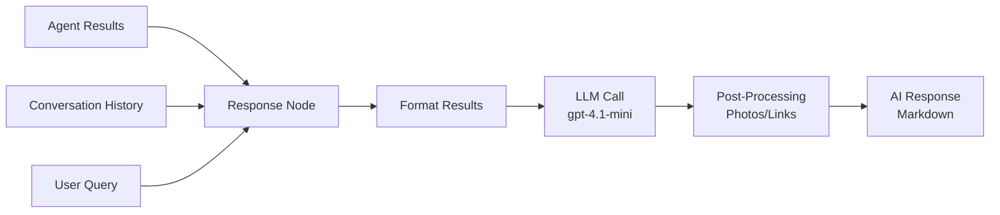
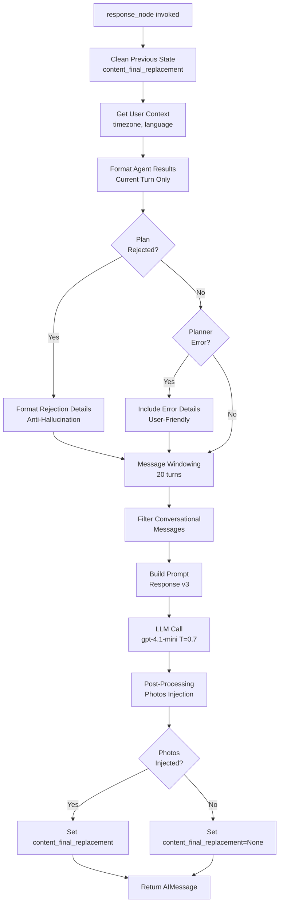
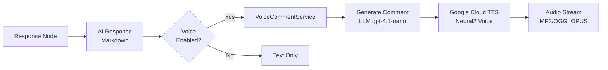
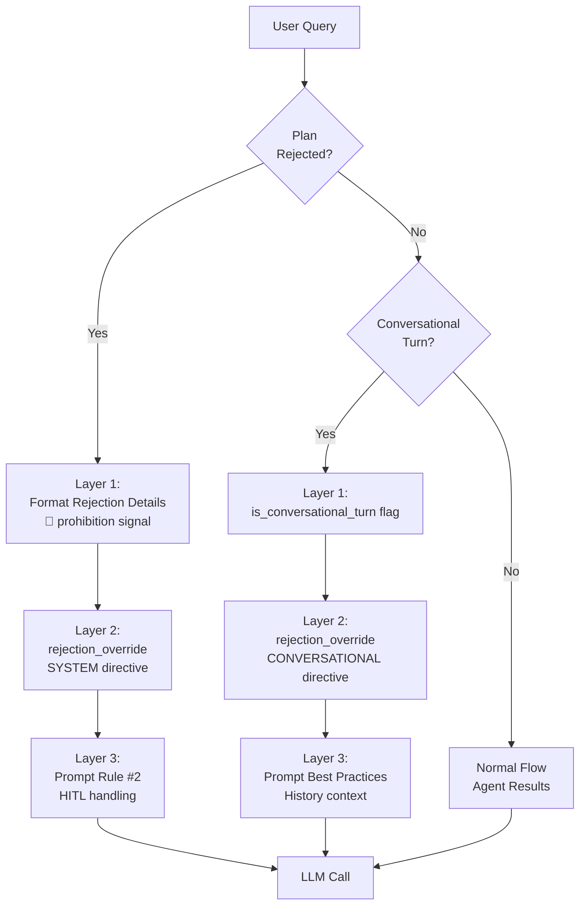

# RESPONSE - Response Node et Synthèse Conversationnelle

> **Documentation complète du Response Node : génération de réponses conversationnelles avec LLM créatif**
>
> Version: 1.2
> Date: 2026-01-12
> Updated: Architecture v3 references, Smart Services integration

---

## 📋 Table des Matières

1. [Vue d'ensemble](#vue-densemble)
2. [Architecture Response Node](#architecture-response-node)
3. [Prompt Response (v3 → v1)](#-prompt-response-v3--consolidated-v1)
4. [Format Agent Results](#format-agent-results)
5. [Post-Processing](#post-processing)
6. [Voice/TTS Integration](#voicetts-integration) - NEW
7. [Message Windowing](#message-windowing)
8. [Anti-Hallucination](#anti-hallucination)
9. [Multilingual Support](#multilingual-support)
10. [Métriques & Observabilité](#métriques--observabilité)
11. [Testing](#testing)
12. [Troubleshooting](#troubleshooting)

---

## 📖 Vue d'ensemble

### Objectif

Le **Response Node** est le node final du graph LangGraph qui génère la réponse conversationnelle présentée à l'utilisateur. Il synthétise les résultats des agents avec un LLM créatif (higher temperature) pour produire des réponses naturelles, personnalisées et contextualisées.

### Responsabilités



**Inputs**:
- `agent_results`: Résultats d'exécution des tools (dict)
- `messages`: Historique conversationnel (windowed)
- `user_timezone`: Timezone utilisateur (pour personnalisation)
- `user_language`: Langue utilisateur (fr, en, es, etc.)
- `plan_rejection_reason`: Raison de rejet HITL (si applicable)
- `planner_error`: Erreur du planner (si applicable)

**Outputs**:
- `AIMessage` avec réponse conversationnelle (Markdown)
- `content_final_replacement`: Signal pour streaming service (photos injectées)

### Concepts Clés

| Concept | Description |
|---------|-------------|
| **Conversational LLM** | gpt-4.1-mini avec temperature 0.7 pour créativité |
| **Agent Results Formatting** | Conversion résultats agents en texte structuré |
| **Post-Processing** | Injection photos HTML et liens profile |
| **Anti-Hallucination** | Directives strictes contre invention de données |
| **Message Windowing** | 20 derniers turns conversationnels (contexte riche) |
| **Multilingual** | Support 6 langues avec personnalisation temporelle |
| **Markdown Output** | CommonMark compliant avec emojis contextuels |

---

## 🏗️ Architecture Response Node

### Flow Complet



### Fichier Source

**Fichier**: [apps/api/src/domains/agents/nodes/response_node.py](apps/api/src/domains/agents/nodes/response_node.py)

**Longueur**: 993 lignes

**Decorators**:
```python
@trace_node("response", llm_model=settings.response_llm_model)
@track_metrics(
    node_name="response",
    duration_metric=agent_node_duration_seconds,
    counter_metric=agent_node_executions_total,
)
```

### Signature Fonction

```python
async def response_node(
    state: MessagesState,
    config: RunnableConfig
) -> dict[str, Any]:
    """
    Response node: Generates conversational response using higher-temperature LLM.
    Synthesizes agent results and streams tokens for real-time UX.

    Args:
        state: Current LangGraph state with messages and agent_results.
        config: Runnable config with metadata (run_id, etc.).

    Returns:
        Updated state with AI response message.

    Raises:
        Exception: If response generation fails, returns error fallback message.

    Note:
        - Streaming is handled by service layer via astream_events().
        - This node formats agent results for LLM context.
        - Basic metrics (duration, success/error counters) tracked by @track_metrics decorator.
    """
```

### Code Complet Annoté (Core Logic)

```python
async def response_node(state: MessagesState, config: RunnableConfig) -> dict[str, Any]:
    run_id = config.get("metadata", {}).get("run_id", "unknown")

    logger.info(
        "response_node_started",
        run_id=run_id,
        message_count=len(state[STATE_KEY_MESSAGES]),
        agent_results_count=len(state.get(STATE_KEY_AGENT_RESULTS, {})),
    )

    try:
        # ✅ CRITICAL FIX: Clean previous turn's content replacement signal
        # Prevents persisted state from triggering replacement in conversational turns
        # Root cause: content_final_replacement persists in PostgreSQL checkpointer
        if "content_final_replacement" in state:
            logger.debug("cleaning_previous_content_replacement", run_id=run_id)

        # Get user timezone and language from state (with fallbacks)
        user_timezone = state.get("user_timezone", "Europe/Paris")
        user_language = state.get("user_language", "fr")

        # Get response LLM and timezone-aware prompt
        llm = get_llm("response")
        prompt = get_response_prompt(user_timezone=user_timezone, user_language=user_language)

        # Format agent results for prompt context
        # Filter by current turn to only show results from this conversation turn
        agent_results_summary = format_agent_results_for_prompt(
            state.get(STATE_KEY_AGENT_RESULTS, {}),
            current_turn_id=state.get(STATE_KEY_CURRENT_TURN_ID),
        )

        # PHASE 8: Handle plan rejection via HITL
        plan_approved = state.get(STATE_KEY_PLAN_APPROVED)
        plan_rejection_reason = state.get(STATE_KEY_PLAN_REJECTION_REASON)

        # State coherence check: Discard stale rejection if plan was approved
        if plan_approved is True and plan_rejection_reason:
            logger.warning("response_node_state_coherence_violation", run_id=run_id)
            plan_rejection_reason = None

        # If plan was rejected, format rejection as structured agent result
        if plan_rejection_reason:
            agent_results_summary = _format_rejection_details(plan_rejection_reason)
            logger.info("response_node_plan_rejection", run_id=run_id)

        # Check if planner encountered an error (Phase 5)
        planner_error = state.get(STATE_KEY_PLANNER_ERROR)
        if planner_error:
            error_message = planner_error.get("message", "Plan validation failed")
            errors = planner_error.get("errors", [])

            # Build user-friendly error explanation
            error_details = f"\n\n⚠️ **Problème de planification:**\n{error_message}\n\n"

            if errors:
                error_details += "**Détails techniques:**\n"
                for err in errors[:3]:  # Limit to 3 errors max
                    error_details += f"- {err.get('message', 'Unknown error')}\n"

                error_details += "\n💡 **Explication:** Le planner n'a pas pu créer un plan d'exécution valide pour cette requête."

            # Prepend error to agent results summary
            agent_results_summary = error_details + "\n\n" + agent_results_summary

        # CRITICAL: Detect if this is a conversational turn with no new agent results
        is_conversational_turn = (
            agent_results_summary == "Aucun agent externe n'a été appelé."
            or not agent_results_summary.strip()
        )

        # Phase: Performance Optimization - Message Windowing
        # Response needs rich context for creative synthesis (20 turns default)
        from src.domains.agents.utils.message_windowing import get_response_windowed_messages

        windowed_messages = get_response_windowed_messages(state[STATE_KEY_MESSAGES])

        # Filter messages to keep only conversational messages
        # Removes ToolMessage and AIMessage with tool_calls
        conversational_messages = filter_conversational_messages(windowed_messages)

        # Create chain
        chain = prompt | llm

        # CRITICAL: Build SYSTEM-level anti-hallucination directive for rejected plans
        rejection_override = ""
        if plan_rejection_reason:
            rejection_override = (
                "🚨 CRITICAL SYSTEM DIRECTIVE - PLAN REJECTION 🚨\n\n"
                "The user has EXPLICITLY REJECTED the execution plan.\n"
                "NO operations were executed. NO data was retrieved. NO results exist.\n\n"
                "ABSOLUTE RULES:\n"
                "1. You MUST NOT invent, hallucinate, or fabricate ANY search results\n"
                "2. You MUST NOT pretend that operations were executed\n"
                "3. You MUST use the 'User Rejected Plan' response format from your system prompt\n"
                "4. You MUST respond in the SAME LANGUAGE the user used\n"
                "5. You MUST acknowledge the rejection respectfully and offer alternatives\n\n"
            )
        elif is_conversational_turn:
            # Anti-hallucination directive for conversational turns
            rejection_override = (
                "🚨 CONVERSATIONAL TURN - NO NEW AGENT RESULTS 🚨\n\n"
                "This is a CONVERSATIONAL query (e.g., 'comment ca va?', 'merci').\n"
                "NO new operations were executed. NO new data was retrieved.\n\n"
                "ABSOLUTE RULES:\n"
                "1. You MUST respond CONVERSATIONALLY to the user's message\n"
                "2. You MUST NOT redisplay previous search results\n"
                "3. Previous results in conversation history are for CONTEXT ONLY\n"
                "4. If user asks to RECALL previous info, THEN use history\n\n"
            )

        # Enrich config with node metadata for observability
        enriched_config = enrich_config_with_node_metadata(config, "response")

        # Invoke LLM
        result = await chain.ainvoke(
            {
                STATE_KEY_MESSAGES: conversational_messages,
                "rejection_override": rejection_override,
                "agent_results": agent_results_summary,
            },
            config=enriched_config,
        )

        # POST-PROCESSING: Inject contact photos via placeholder replacement
        photos_by_contact = _extract_contact_photos_html(
            state.get(STATE_KEY_AGENT_RESULTS, {}),
            current_turn_id=state.get(STATE_KEY_CURRENT_TURN_ID),
        )

        photos_injected = False
        if photos_by_contact:
            result.content, photos_injected = _inject_photos_via_placeholders(
                result.content, photos_by_contact
            )

        # Signal streaming service that final content replacement is needed
        state_update: dict[str, Any] = {STATE_KEY_MESSAGES: [result]}
        if photos_injected:
            state_update["content_final_replacement"] = result.content
        else:
            # ✅ CRITICAL FIX: MUST explicitly set to None to override persisted value
            state_update["content_final_replacement"] = None

        return state_update

    except Exception as e:
        logger.error("response_node_exception", run_id=run_id, exception_type=type(e).__name__, exc_info=True)

        graph_exceptions_total.labels(
            node_name="response",
            exception_type=type(e).__name__,
        ).inc()

        # Fallback: return error message
        error_message = HumanMessage(content=get_error_fallback_message(type(e).__name__))
        return {STATE_KEY_MESSAGES: [error_message]}
```

### Pattern Learning Recording

> **NEW (2026-01-12)** : Le Response Node participe au **Plan Pattern Learning** pour les plans simples ayant bypassé le semantic_validator.

```python
# À la fin de response_node, après génération réponse
from src.domains.agents.services.plan_pattern_learner import record_plan_success

# Plans simples (pas de validation sémantique) → enregistrement direct
if state.get("plan_bypassed_validation"):
    plan = state.get("execution_plan")
    intelligence = state.get("query_intelligence")
    if plan and intelligence:
        record_plan_success(plan, intelligence)  # Fire-and-forget async
```

**Contexte** : Le semantic_validator_node enregistre les patterns pour les plans complexes validés par LLM. Cependant, certains plans simples (single-step, contexte résolu, etc.) peuvent bypasser la validation. Pour ces cas, le Response Node se charge de l'enregistrement après exécution réussie.

**Documentation complète** : [PLAN_PATTERN_LEARNER.md](./PLAN_PATTERN_LEARNER.md)

---

## 📝 Prompt Response (v3 → Consolidated v1)

### Version Actuelle

> **Note**: Le prompt v3 a été consolidé dans v1 (décembre 2025). Le versioning historique est conservé dans le contenu du fichier.

**Fichier**: [apps/api/src/domains/agents/prompts/v1/response_system_prompt_base.txt](apps/api/src/domains/agents/prompts/v1/response_system_prompt_base.txt)

**Version**: Consolidated v1 (historiquement v3.0 - optimisé caching)

**Date**: 2025-11-08

**Longueur**: ~1,750 tokens (7KB) - **50% reduction from v1**

### Structure Prompt

Le prompt est divisé en **2 sections** pour optimiser le caching OpenAI:

#### Section 1: STATIC (Cacheable)

```
# ============================================================================
# STATIC SECTION (Cacheable - Place at top for OpenAI prompt caching)
# ============================================================================
```

**Contenu** (lignes 13-183):
- Personnalité IA (rebelle, sarcastique, intelligent)
- Core Rules (Anti-Hallucination - 5 règles)
- Response Structure (Intro, Main Content, Conclusion)
- Edge Cases (User Rejected Plan, Technical Error, No Results)
- Best Practices

**Bénéfice caching**: Cette section est **identique** pour toutes les requêtes → cached automatiquement après première utilisation → **90% cost reduction** sur ces tokens.

#### Section 2: DYNAMIC (Non-cacheable)

```
# ============================================================================
# DYNAMIC SECTION (Non-cacheable - Updated per request)
# ============================================================================
```

**Contenu** (lignes 184-206):
- Current Context (date/time)
- Time-based personalization (morning, evening, etc.)
- Week vs weekend tone

**Injected via ChatPromptTemplate**:
- Agent results
- Conversation history
- User message

#### App Knowledge Context (`{app_knowledge_context}` placeholder)

When `is_app_help_query=True` (detected by QueryAnalyzer), the Response Node injects additional context to help the LLM answer questions about LIA itself:

1. **App Identity Prompt** — loaded from `app_identity_prompt.txt` (in the prompts directory). Contains structured knowledge about LIA's features, setup instructions, supported integrations, and usage guidance. This prompt is loaded and injected into the `{app_knowledge_context}` placeholder in `response_system_prompt_base.txt`. Since v1.9.2, it also includes an admin-boundary directive instructing the LLM to never reference admin-only features (admin panels, LLM configuration, user management) when talking to regular users.

2. **System RAG Context** — optionally enriches the response with FAQ chunks retrieved from the knowledge base. When relevant FAQ entries exist, they are appended to the app knowledge context to provide precise, up-to-date answers.

**Lazy loading**: When `is_app_help_query=False`, the `{app_knowledge_context}` placeholder resolves to an empty string. Neither the app identity prompt file nor the RAG retrieval are loaded, ensuring zero overhead for standard (non-help) queries.

### Core Rules (Anti-Hallucination)

**Règle #1: Verified Data ONLY**
```
- With agent results → Use EXCLUSIVELY provided data
- NEVER invent, guess, extrapolate beyond results
- Missing info → State clearly: "Information not available"
```

**Règle #2: User Edits/HITL**
```
- If user modified request → Base response ONLY on final results
- IGNORE rejected/modified initial queries
```

**Règle #3: Markdown Required**
```
- ALL responses in Markdown (NOT HTML)
- Structure: ## sections, ### subsections, --- separators
- Emojis: ✅❌⚠️📧📞📇🔍📅💡🎯 (relevant)
```

**Règle #4: Media Fields (Photos)**
```
- NEVER mention photo URLs, file paths, or raw media URLs in text
- Photos are displayed automatically via HTML gallery
- DO NOT write "Photos (aperçu):", "Photos:", or similar text labels
```

**Règle #5: Contact Photos Placeholder** ⭐
```
- ONLY write [PHOTOS] if you see "*[N photo(s) disponible(s)]*" after contact name
- DO NOT copy the photo signal in your response - it's metadata only
- Place it on a new line immediately after contact name, BEFORE attributes
- If NO photo signal → DO NOT write [PHOTOS] placeholder

Example WITH photos:
Data: **1. jean dupond** ([Voir le profil](...)) *[2 photo(s) disponible(s)]*

Your response:
1. **jean dupond**
[PHOTOS]
   - 📧 jean@example.com

Example WITHOUT photos:
Data: **1. Jean Dupont** ([Voir le profil](...))

Your response:
1. **Jean Dupont**
   - 📧 jean@example.com
```

### Response Structure

**1. Intro** (italic + sarcastic):
```markdown
*Personalize subtly based on context: date, season, time, history, user request.*
```

**2. Main Content** (Markdown):
```markdown
## 🔍 Results

Found **3 contacts**:

1. **Marie Martin**
   - 📧 marie@example.com
   - 📞 +33 6 12 34 56 78

2. **Jean Dupont**
   - 📧 jean@example.com
   - (No phone)

---

> **Note**: Data from cache (updated 2 min ago)
```

**3. Conclusion** (italic + actions):
```markdown
*Voilà ! N'hésite pas si besoin.* 😊

**Next actions:**
- 📧 Get contact details
- 🔍 Refine search
- 💬 Something else?
```

### Edge Cases

**User Rejected Plan**:
```markdown
## 🚫 Plan rejected

You chose not to execute the proposed plan.

**What can I do for you?**
- Rephrase your request differently
- Propose another action
- Assist you in another way
```

**Technical Error**:
```markdown
## ❌ Error occurred

Service temporarily unavailable.

**What to do:**
- Retry in a moment
- Check connector in Settings
```

**No Results**:
```markdown
## 🔍 No results

**Suggestions:**
- Check spelling
- Broader search
- List all to browse
```

---

## 🔧 Format Agent Results

### format_agent_results_for_prompt Function

**Objectif**: Convertir les résultats agents (dict) en texte structuré pour injection dans le prompt LLM.

### Signature

```python
def format_agent_results_for_prompt(
    agent_results: dict[str, Any],
    current_turn_id: int | None = None
) -> str:
    """
    Format agent results for injection into response prompt.

    Converts AgentResult dictionary into human-readable summary WITH FULL DATA for LLM context.

    V2 (with turn_id): Supports composite keys "turn_id:agent_name" and filters by current turn.

    Args:
        agent_results: Dictionary of composite_key → AgentResult (keys: "turn_id:agent_name").
        current_turn_id: Optional turn ID to filter results (only include current turn).

    Returns:
        Formatted string with agent results summary AND detailed data.
    """
```

### Structure Composite Keys

**Format**: `"turn_id:agent_name"`

**Exemples**:
- `"3:contacts_agent"` → Turn 3, contacts agent
- `"5:emails_agent"` → Turn 5, emails agent

**Filtering**: Si `current_turn_id=3` fourni, ne garde que les résultats du turn 3.

### Format ContactsResultData

**Input** (AgentResult.data):
```python
{
    "status": "success",
    "data": {
        "total_count": 2,
        "contacts": [
            {
                "names": "jean dupond",
                "resource_name": "people/c6005623555827615994",
                "emails": ["jean@example.com"],
                "phones": ["+33 6 12 34 56 78"],
                "photos": [{"url": "https://..."}],
                "addresses": [{"formatted": "123 rue X\n75001 Paris", "type": "home"}],
                "organizations": [{"name": "Acme Inc", "title": "Engineer"}],
            }
        ],
        "data_source": "cache",
        "cache_age_seconds": 120,
        "timestamp": "2025-11-14T10:30:00Z"
    }
}
```

**Output** (formatted text):
```
✅ contacts_agent: Trouvé 2 contact(s)

**Metadata de fraîcheur:**
- Source: cache
- Âge du cache: 120 secondes
- Timestamp: 2025-11-14T10:30:00Z

Détails des contacts:

**1. jean dupond** ([Voir le profil](https://contacts.google.com/person/c6005623555827615994)) *[1 photo(s) disponible(s)]*

   - Emails: jean@example.com
   - Phones: +33 6 12 34 56 78
   - Adresse (Home): 123 rue X, 75001 Paris
   - Organisation: Acme Inc - Engineer
```

### Pre-Injection Strategy (Phase 5.5) ⭐

**Profile Links Pre-Injection**:

Avant Phase 5.5:
```python
# POST-PROCESSING (regex-based, fragile)
content = _inject_contact_profile_links(content, agent_results)
```

Après Phase 5.5:
```python
# PRE-INJECTION (in format_agent_results_for_prompt)
# LLM voit directement le lien dans les données
summary += f"**{idx}. {name}**"
if google_url:
    summary += f" ([Voir le profil]({google_url}))"
```

**Bénéfices**:
- ✅ Robuste: Pas de regex pattern matching
- ✅ Naturel: LLM peut reformuler sans casser les liens
- ✅ Générique: Fonctionne pour tous domaines (emails, calendar, etc.)

**Photo Signal Pre-Injection**:

```python
# Signal photo availability (metadata, not URLs)
photos = contact.get("photos", [])
if photos and isinstance(photos, list) and len(photos) > 0:
    photo_count = len(photos)
    summary += f" *[{photo_count} photo(s) disponible(s)]*"
```

**LLM voit**:
```
**1. jean dupond** ([Voir le profil](...)) *[2 photo(s) disponible(s)]*
```

**LLM génère** (via Règle #5):
```markdown
1. **jean dupond**
[PHOTOS]
   - 📧 jean@example.com
```

---

## 🎨 Post-Processing

### Objectif

Après génération LLM, injecter les **photos HTML** et **liens profile** dans la réponse Markdown.

**Problème**: LLM ne doit PAS générer HTML brut (security risk, inconsistent formatting).

**Solution**: **Placeholder-based injection** + **Pre-injection**.

### Flow Post-Processing

```mermaid
graph LR
    A[LLM Response<br/>with [PHOTOS]] --> B[_extract_contact_photos_html<br/>Extract photos from agent_results]
    B --> C[_inject_photos_via_placeholders<br/>Replace [PHOTOS] with HTML]
    C --> D[Final Content<br/>Markdown + HTML]
```

### _extract_contact_photos_html Function

**Signature**:
```python
def _extract_contact_photos_html(
    agent_results: dict[str, Any],
    current_turn_id: int | None
) -> dict[str, str]:
    """
    Extract photos from agent_results and generate HTML galleries per contact.

    Returns:
        Dict mapping contact names to HTML gallery strings
        Example: {"jean dupond": "<div>...</div>", "Jean Dupont": "<div>...</div>"}
    """
```

**Code complet annoté**:
```python
def _extract_contact_photos_html(
    agent_results: dict[str, Any],
    current_turn_id: int | None
) -> dict[str, str]:
    if not agent_results:
        return {}

    photos_by_contact: dict[str, str] = {}

    # Iterate through all agent results to find contact details with photos
    for composite_key, result in agent_results.items():
        # Filter by current turn (same logic as format_agent_results_for_prompt)
        if ":" in composite_key:
            turn_id_str, agent_name = composite_key.split(":", 1)
            if current_turn_id is not None:
                try:
                    turn_id_from_key = int(turn_id_str)
                    if turn_id_from_key != current_turn_id:
                        continue  # Skip results from other turns
                except ValueError:
                    pass

        # Only process successful results
        if result.get("status") != "success":
            continue

        # Extract data
        data = result.get("data")
        if not data or not _is_contacts_result_data(data):
            continue

        # Extract contacts list (support both Pydantic and dict)
        contacts = data.contacts if hasattr(data, "contacts") else data.get("contacts", [])
        if not contacts:
            continue

        # Process each contact for photos
        for contact in contacts:
            name = contact.get("names", "Contact")
            photos = contact.get("photos", [])

            if not photos or not isinstance(photos, list):
                continue

            # Generate HTML gallery for this contact
            # CRITICAL: CommonMark Type 6 HTML blocks require blank lines
            html_gallery = '\n<div class="contact-photos-gallery">\n'

            for photo in photos:
                if isinstance(photo, dict):
                    photo_url = photo.get("url", "")
                    if photo_url:
                        html_gallery += f'\n'

            html_gallery += "</div>\n\n"

            # Store gallery keyed by contact name
            photos_by_contact[name] = html_gallery

    return photos_by_contact
```

### _inject_photos_via_placeholders Function

**Signature**:
```python
def _inject_photos_via_placeholders(
    content: str,
    photos_by_contact: dict[str, str]
) -> tuple[str, bool]:
    """
    Inject photo galleries by replacing [PHOTOS] placeholders in LLM response.

    Returns:
        Tuple of (modified_content, was_injected)
    """
```

**Code complet annoté**:
```python
def _inject_photos_via_placeholders(
    content: str,
    photos_by_contact: dict[str, str]
) -> tuple[str, bool]:
    if not photos_by_contact:
        return content, False

    if "[PHOTOS]" not in content:
        logger.warning("photos_placeholder_not_found", contacts_with_photos=list(photos_by_contact.keys()))
        # User preference: No fallback, prefer no photos than misplaced photos
        return content, False

    modified_content = content
    injections_made = 0

    # For each contact with photos, find their placeholder and replace it
    for contact_name, html_gallery in photos_by_contact.items():
        # Escape special regex characters in contact name
        escaped_name = re.escape(contact_name)

        # Pattern: Match contact name followed by [PHOTOS]
        # CRITICAL FIX #1: Use .*? to allow profile links [Voir le profil](...)
        # CRITICAL FIX #2: Use re.DOTALL flag so .* matches newlines
        pattern = rf"(\*\*{escaped_name}\*\*.*?)(\[PHOTOS\])"

        # Replace the placeholder with HTML gallery
        replacement = rf"\1{html_gallery}"
        new_content = re.sub(pattern, replacement, modified_content, count=1, flags=re.DOTALL)

        if new_content != modified_content:
            injections_made += 1
            modified_content = new_content

    if injections_made > 0:
        logger.info("photos_injected_via_placeholders", contacts_injected=injections_made)
        return modified_content, True

    # No placeholders matched
    return content, False
```

### CommonMark Compliance

**Requirement**: HTML blocks doivent avoir **blank lines** avant et après pour parsing correct.

**Code**:
```python
# CRITICAL: For CommonMark Type 6 HTML blocks:
# - Must have blank line BEFORE and AFTER <div>
html_gallery = '\n<div class="contact-photos-gallery">\n'
# ... images ...
html_gallery += "</div>\n\n"
```

**Reference**: [CommonMark Spec 0.30 - HTML Blocks](https://spec.commonmark.org/0.30/#html-blocks)

---

## 🎙️ Voice/TTS Integration

### Vue d'Ensemble (Phase 2025-12-24)

Le **Response Node** peut optionnellement déclencher la génération d'un **commentaire vocal** (Voice Comment) qui sera synthétisé via **Google Cloud TTS** et streamé à l'utilisateur.



### Flux Voice Comment

1. **Condition d'activation** : `user.voice_enabled == True` (préférence utilisateur)
2. **Génération commentaire** : LLM léger (gpt-4.1-nano) génère 1-6 phrases conversationnelles
3. **Synthèse TTS** : Google Cloud TTS avec voix Neural2 (fr-FR-Neural2-F/G)
4. **Streaming audio** : Chunks audio streamés via SSE

### Configuration Voice

```python
# apps/api/src/core/config/voice.py

class VoiceSettings:
    voice_enabled: bool = False  # Feature flag
    voice_default_language_code: str = "fr-FR"
    voice_default_voice_name: str = "fr-FR-Neural2-F"  # Female Neural2
    voice_audio_encoding: str = "MP3"
    voice_sample_rate_hertz: int = 24000
    voice_max_sentences: int = 6  # Max sentences per comment
```

### Voix Disponibles

| Langue | Voice Name | Genre | Type |
|--------|------------|-------|------|
| Français | fr-FR-Neural2-F | Féminin | Neural2 |
| Français | fr-FR-Neural2-G | Masculin | Neural2 |
| English | en-US-Neural2-A | Masculin | Neural2 |
| English | en-US-Neural2-C | Féminin | Neural2 |

### Format Audio

| Encoding | Sample Rate | Use Case |
|----------|-------------|----------|
| **MP3** | 24000 Hz | Web, mobile (compression) |
| **OGG_OPUS** | 24000 Hz | Web moderne (meilleure qualité) |
| **LINEAR16** | 48000 Hz | Haute fidélité (non compressé) |

### Métriques Voice

Référence complète dans [OBSERVABILITY_AGENTS.md](OBSERVABILITY_AGENTS.md#voicetts-metrics-13-métriques---new-phase-2025-12-24).

**KPIs critiques** :
- `voice_time_to_first_audio_seconds` : P95 < 2s (TTFA - UX critique)
- `voice_tts_latency_seconds` : P95 < 1.5s
- `voice_fallback_total` : < 5% (dégradation gracieuse)

### Dégradation Gracieuse

Si Voice échoue, le système fallback silencieusement vers text-only :

```python
try:
    audio_chunks = await voice_service.generate_voice_comment(response_text)
    async for chunk in audio_chunks:
        yield VoiceChunk(audio=chunk)
except Exception as e:
    # Graceful degradation: log error, continue text-only
    logger.warning("voice_fallback", reason=str(e))
    voice_fallback_total.labels(reason="tts_error").inc()
```

### Ressources Voice

- [VOICE.md](VOICE.md) - Documentation complète Voice domain
- [ADR-050-Voice-Domain-TTS-Architecture.md](../architecture/ADR-050-Voice-Domain-TTS-Architecture.md) - Architecture Decision Record

---

## 📐 Message Windowing

### Objectif

**Performance optimization**: Response node needs rich context (20 turns default) au lieu de full conversation history (50+ turns).

### get_response_windowed_messages

```python
# apps/api/src/domains/agents/utils/message_windowing.py

def get_response_windowed_messages(
    messages: list[BaseMessage],
    max_turns: int = 20,
) -> list[BaseMessage]:
    """
    Get windowed messages for response node.

    Response needs rich context for creative synthesis:
    - Recent user queries (20 turns default)
    - SystemMessage always preserved
    - Conversational AIMessages for continuity

    Args:
        messages: Full message history
        max_turns: Maximum conversational turns to keep (default: 20)

    Returns:
        Windowed messages (SystemMessage + last 20 turns)
    """
    if not messages:
        return []

    # Preserve SystemMessage
    system_messages = [m for m in messages if isinstance(m, SystemMessage)]
    non_system_messages = [m for m in messages if not isinstance(m, SystemMessage)]

    # Keep last N turns (HumanMessage + AIMessage pairs)
    windowed = non_system_messages[-max_turns * 2:] if len(non_system_messages) > max_turns * 2 else non_system_messages

    return system_messages + windowed
```

### filter_conversational_messages

**Objectif**: Retirer ToolMessage et AIMessage avec tool_calls (reasoning interne agents).

```python
# apps/api/src/domains/agents/utils/message_filters.py

def filter_conversational_messages(messages: list[BaseMessage]) -> list[BaseMessage]:
    """
    Filter messages to keep only conversational content.

    Removes:
    - ToolMessage (internal agent execution results)
    - AIMessage with tool_calls (internal agent reasoning)

    Keeps:
    - SystemMessage (always preserved)
    - HumanMessage (user queries)
    - AIMessage without tool_calls (conversational responses)

    Args:
        messages: Full message list

    Returns:
        Filtered conversational messages only
    """
    conversational = []

    for msg in messages:
        # Always keep SystemMessage
        if isinstance(msg, SystemMessage):
            conversational.append(msg)
            continue

        # Always keep HumanMessage
        if isinstance(msg, HumanMessage):
            conversational.append(msg)
            continue

        # AIMessage: Keep only if no tool_calls (conversational response)
        if isinstance(msg, AIMessage):
            if not hasattr(msg, "tool_calls") or not msg.tool_calls:
                conversational.append(msg)
            # Else: Skip AIMessage with tool_calls (internal reasoning)

        # Skip ToolMessage (internal execution results)

    return conversational
```

### Usage dans Response Node

```python
# Apply windowing BEFORE filtering
windowed_messages = get_response_windowed_messages(state[STATE_KEY_MESSAGES])

# Filter to keep only conversational messages
conversational_messages = filter_conversational_messages(windowed_messages)

logger.debug(
    "response_node_messages_filtered",
    original_count=len(state[STATE_KEY_MESSAGES]),
    windowed_count=len(windowed_messages),
    filtered_count=len(conversational_messages),
)
```

### Bénéfices

| Metric | Sans Windowing/Filtering | Avec Windowing/Filtering | Réduction |
|--------|---------------------------|--------------------------|-----------|
| **Messages count** | 100 messages | 40 messages | **60%** |
| **Tokens LLM input** | 50,000 tokens | 10,000 tokens | **80%** |
| **Latency LLM call** | 8-12s | 2-4s | **60-70%** |
| **Cost per call** | $0.025 | $0.005 | **80%** |

---

## 🚫 Anti-Hallucination

### Problème

**LLM hallucinations** surviennent quand:
1. **Plan rejeté HITL**: User rejette plan → LLM invente résultats "comme si" plan exécuté
2. **Conversational turn**: Pas de nouveaux résultats → LLM redisplay résultats précédents
3. **Données manquantes**: Résultats partiels → LLM invente données manquantes

### Solution: Multi-Layer Anti-Hallucination



### Layer 1: Data Formatting

#### Format Rejection Details

```python
def _format_rejection_details(rejection_reason: str) -> str:
    """
    Format plan rejection with EXPLICIT anti-hallucination directives.

    CRITICAL: Uses 🚫 prohibition signal and direct LLM instructions.
    """
    reason_text = (
        rejection_reason
        if rejection_reason != "User rejected plan"
        else "L'utilisateur a choisi de ne pas exécuter ce plan"
    )

    # CRITICAL: Use 🚫 (prohibition) not ✅ (success)
    return (
        "🚫 PLAN REFUSÉ PAR L'UTILISATEUR (AUCUNE DONNÉE DISPONIBLE)\n\n"
        "ATTENTION: N'invente AUCUNE donnée. Le plan a été explicitement rejeté.\n"
        "AUCUNE opération n'a été exécutée. AUCUN résultat n'existe.\n\n"
        f"**Raison du refus:** {reason_text}\n"
        "**Statut:** Aucune action effectuée\n"
        "**Réponse attendue:** Accuse réception du refus et propose alternatives\n\n"
        "RÈGLE ABSOLUE: Ne mentionne AUCUN résultat de recherche, contact, ou donnée métier.\n"
        "Le contexte conversationnel précédent est CADUC (annulé par refus)."
    )
```

### Layer 2: rejection_override (SYSTEM Directive)

**Plan Rejected**:
```python
rejection_override = (
    "🚨 CRITICAL SYSTEM DIRECTIVE - PLAN REJECTION 🚨\n\n"
    "The user has EXPLICITLY REJECTED the execution plan.\n"
    "NO operations were executed. NO data was retrieved. NO results exist.\n\n"
    "ABSOLUTE RULES:\n"
    "1. You MUST NOT invent, hallucinate, or fabricate ANY search results\n"
    "2. You MUST NOT pretend that operations were executed\n"
    "3. You MUST use the 'User Rejected Plan' response format from your system prompt\n"
    "4. You MUST respond in the SAME LANGUAGE the user used\n"
    "5. You MUST acknowledge the rejection respectfully and offer alternatives\n\n"
)
```

**Conversational Turn**:
```python
rejection_override = (
    "🚨 CONVERSATIONAL TURN - NO NEW AGENT RESULTS 🚨\n\n"
    "This is a CONVERSATIONAL query (e.g., 'comment ca va?', 'merci').\n"
    "NO new operations were executed. NO new data was retrieved.\n\n"
    "ABSOLUTE RULES:\n"
    "1. You MUST respond CONVERSATIONALLY to the user's message\n"
    "2. You MUST NOT redisplay previous search results\n"
    "3. Previous results in conversation history are for CONTEXT ONLY\n"
    "4. If user asks to RECALL previous info, THEN use history\n\n"
    "EXAMPLES:\n"
    "❌ WRONG: User says 'comment ca va?' → You list previous contact details\n"
    "✅ CORRECT: User says 'comment ca va?' → You respond conversationally\n"
)
```

### Layer 3: Prompt Core Rules

**Règle #1** (dans response_system_prompt.txt):
```
1. **Verified Data ONLY**
   - With agent results → Use EXCLUSIVELY provided data
   - NEVER invent, guess, extrapolate beyond results
   - Missing info → State clearly: "Information not available"
```

**Règle #2**:
```
2. **User Edits/HITL**
   - If user modified request → Base response ONLY on final results
   - IGNORE rejected/modified initial queries
```

### Résultat

**Avant anti-hallucination** (BUG #2025-11-13):
```
User: "recherche jean"
Router: "aucun contact avec 'jean'" → confidence=0.45 → response
Response LLM: Invente "jean dupond trouvé" depuis historique ❌ HALLUCINATION
```

**Après anti-hallucination** (v8 + multi-layer):
```
User: "recherche jean"
Router v8: Analyse syntaxe → "recherche" + "jean" → confidence=0.90 → planner ✅
Planner: search_contacts_tool(query="jean")
Tool: Returns real results OR empty list
Response: Formate résultats réels (pas d'hallucination) ✅
```

---

## 🌍 Multilingual Support

### Objectif

Support **6 langues** avec personnalisation temporelle contextualisée.

### Langues Supportées

| Code | Langue | Timezone par défaut |
|------|--------|---------------------|
| **fr** | Français | Europe/Paris |
| **en** | English | America/New_York |
| **es** | Español | Europe/Madrid |
| **de** | Deutsch | Europe/Berlin |
| **it** | Italiano | Europe/Rome |
| **pt** | Português | Europe/Lisbon |

### get_response_prompt Function

```python
# apps/api/src/domains/agents/prompts/__init__.py

def get_response_prompt(
    user_timezone: str = "Europe/Paris",
    user_language: str = "fr"
) -> ChatPromptTemplate:
    """
    Get response prompt with timezone-aware datetime.

    Args:
        user_timezone: User's timezone (IANA format, e.g., "Europe/Paris")
        user_language: User's language code (ISO 639-1, e.g., "fr", "en")

    Returns:
        ChatPromptTemplate with timezone-aware current_datetime
    """
    # Load static prompt from file (v1 consolidated)
    prompt_text = load_response_prompt(version="v1")

    # Calculate current datetime in user's timezone
    from datetime import datetime
    from zoneinfo import ZoneInfo

    now_utc = datetime.now(ZoneInfo("UTC"))
    now_user_tz = now_utc.astimezone(ZoneInfo(user_timezone))

    # Format: "Wednesday, November 14, 2025 - 10:30 AM (Europe/Paris)"
    current_datetime = now_user_tz.strftime("%A, %B %d, %Y - %I:%M %p")
    current_datetime += f" ({user_timezone})"

    # Create ChatPromptTemplate
    # Note: System prompt is language-agnostic (English)
    # LLM will automatically respond in user's language by analyzing conversation history
    return ChatPromptTemplate.from_messages([
        ("system", prompt_text),
        ("placeholder", "{messages}"),
        ("system", "{rejection_override}"),  # Anti-hallucination override
        ("user", "Agent results:\n{agent_results}"),
    ]).partial(current_datetime=current_datetime)
```

### Time-Based Personalization

**Dans prompt** (lignes 190-201):
```
**Date/Time**: {current_datetime}

Time-based personalization (subtle):
- Morning (5h-12h): Energy, productivity
- Noon (12h-14h): Efficiency
- Afternoon (14h-18h): Focus
- Evening (18h-22h): Relaxed
- Night (22h-5h): Discreet support

Week: Productivity | Weekend: Casual tone

**DON'T OVERDO IT - Stay SUBTLE and RELEVANT**
```

**Exemple réponse personnalisée**:

**Morning (9h)**:
```markdown
*Bonjour ! Parfait timing pour une recherche productive.* ☀️

## 🔍 Résultats

...

*Bonne journée !*
```

**Evening (20h)**:
```markdown
*Bonsoir ! Voici ce que j'ai trouvé.* 🌙

## 🔍 Résultats

...

*Bon repos !*
```

### Language Detection

**Automatic**: LLM détecte la langue via conversation history (pas de configuration explicite).

**User Query**: "recherche jean"
**Response**: *Voici ce que j'ai trouvé...* (français détecté)

**User Query**: "search jean"
**Response**: *Here's what I found...* (english détecté)

---

## 📊 Métriques & Observabilité

### Métriques Prometheus

**Fichier**: [apps/api/src/infrastructure/observability/metrics_agents.py](apps/api/src/infrastructure/observability/metrics_agents.py)

#### Métriques Génériques (via @track_metrics)

```python
# Node duration
agent_node_duration_seconds = Histogram(
    'langgraph_agent_node_duration_seconds',
    'Duration of agent node execution',
    ['node_name'],  # response
)

# Node executions
agent_node_executions_total = Counter(
    'langgraph_agent_node_executions_total',
    'Total agent node executions',
    ['node_name', 'status'],  # response, success | error
)

# Graph exceptions
graph_exceptions_total = Counter(
    'langgraph_graph_exceptions_total',
    'Total graph exceptions by node and type',
    ['node_name', 'exception_type'],
)
```

#### Métriques Response-Specific (potentielles)

```python
# Photos injection (could be added)
response_photos_injected_total = Counter(
    'langgraph_response_photos_injected_total',
    'Total photos injected via placeholders',
    ['contact_count'],  # 1, 2, 3+
)

# Conversational turns (could be added)
response_conversational_turns_total = Counter(
    'langgraph_response_conversational_turns_total',
    'Total conversational turns (no agent results)',
)
```

### Grafana Dashboards

**Dashboard**: [infrastructure/observability/grafana/dashboards/04-agents-langgraph.json](infrastructure/observability/grafana/dashboards/04-agents-langgraph.json)

**Panels Response**:
1. **Response Duration** (P50, P95, P99)
2. **Response Success Rate** (%)
3. **Response Errors** (rate by exception_type)
4. **Message Filtering Effectiveness** (original vs filtered count)

### Langfuse Traces

**Trace structure** (response_node):
```json
{
  "name": "response",
  "model": "gpt-4.1-mini",
  "input": {
    "agent_results_summary_preview": "✅ contacts_agent: Trouvé 2 contacts...",
    "conversational_messages_count": 6,
    "rejection_override_present": false,
    "is_conversational_turn": false
  },
  "output": {
    "response_length": 450,
    "photos_injected": true,
    "contacts_with_photos": 2
  },
  "metadata": {
    "user_timezone": "Europe/Paris",
    "user_language": "fr",
    "current_datetime": "Wednesday, November 14, 2025 - 10:30 AM",
    "windowed_count": 40,
    "filtered_count": 20
  }
}
```

---

## 🧪 Testing

### Unit Tests

**Fichier**: `apps/api/tests/domains/agents/nodes/test_response_node.py` (non trouvé dans codebase, à créer)

```python
import pytest
from unittest.mock import AsyncMock, patch
from src.domains.agents.nodes.response_node import (
    response_node,
    format_agent_results_for_prompt,
    _extract_contact_photos_html,
    _inject_photos_via_placeholders,
)

@pytest.mark.asyncio
async def test_response_node_with_agent_results():
    """Test response node génère réponse avec résultats agents."""

    # Mock state
    state = {
        "messages": [HumanMessage(content="recherche jean")],
        "agent_results": {
            "3:contacts_agent": {
                "status": "success",
                "data": {
                    "total_count": 1,
                    "contacts": [{"names": "jean dupond", "emails": ["jean@example.com"]}],
                },
            }
        },
        "current_turn_id": 3,
        "user_timezone": "Europe/Paris",
        "user_language": "fr",
    }

    config = {"metadata": {"run_id": "run_123"}}

    # Mock LLM response
    mock_llm = AsyncMock()
    mock_llm.ainvoke.return_value = AIMessage(
        content="## 🔍 Résultats\n\n1. **jean dupond**\n   - 📧 jean@example.com"
    )

    with patch("src.domains.agents.nodes.response_node.get_llm", return_value=mock_llm):
        result = await response_node(state, config)

    # Assertions
    assert "messages" in result
    assert len(result["messages"]) == 1
    assert isinstance(result["messages"][0], AIMessage)
    assert "jean dupond" in result["messages"][0].content
    assert "jean@example.com" in result["messages"][0].content


def test_format_agent_results_for_prompt_contacts():
    """Test formatting ContactsResultData pour prompt."""

    agent_results = {
        "3:contacts_agent": {
            "status": "success",
            "data": {
                "total_count": 2,
                "contacts": [
                    {
                        "names": "jean dupond",
                        "resource_name": "people/c123",
                        "emails": ["jean@example.com"],
                        "photos": [{"url": "https://..."}],
                    },
                    {
                        "names": "Jean Dupont",
                        "resource_name": "people/c456",
                        "phones": ["+33 6 12 34 56 78"],
                    },
                ],
                "data_source": "cache",
                "cache_age_seconds": 120,
            },
        }
    }

    formatted = format_agent_results_for_prompt(agent_results, current_turn_id=3)

    # Assertions
    assert "✅ contacts_agent: Trouvé 2 contact(s)" in formatted
    assert "jean dupond" in formatted
    assert "Jean Dupont" in formatted
    assert "[Voir le profil](https://contacts.google.com/person/c123)" in formatted
    assert "*[1 photo(s) disponible(s)]*" in formatted
    assert "cache_age_seconds: 120" in formatted


def test_extract_contact_photos_html():
    """Test extraction photos et génération HTML galleries."""

    agent_results = {
        "3:contacts_agent": {
            "status": "success",
            "data": {
                "contacts": [
                    {
                        "names": "jean dupond",
                        "photos": [
                            {"url": "https://photo1.jpg"},
                            {"url": "https://photo2.jpg"},
                        ],
                    }
                ],
            },
        }
    }

    photos_by_contact = _extract_contact_photos_html(agent_results, current_turn_id=3)

    # Assertions
    assert "jean dupond" in photos_by_contact
    assert '<div class="contact-photos-gallery">' in photos_by_contact["jean dupond"]
    assert 'src="https://photo1.jpg"' in photos_by_contact["jean dupond"]
    assert 'src="https://photo2.jpg"' in photos_by_contact["jean dupond"]
    assert photos_by_contact["jean dupond"].count("\n\n</div>\n\n'
    }

    result, injected = _inject_photos_via_placeholders(content, photos_by_contact)

    # Assertions
    assert injected is True
    assert "[PHOTOS]" not in result
    assert '<div class="contact-photos-gallery">' in result
    assert 'src="https://photo.jpg"' in result


@pytest.mark.asyncio
async def test_response_node_plan_rejection():
    """Test response node avec plan rejeté HITL."""

    state = {
        "messages": [HumanMessage(content="recherche jean")],
        "agent_results": {},
        "plan_approved": False,
        "plan_rejection_reason": "User rejected plan",
        "current_turn_id": 3,
    }

    config = {"metadata": {"run_id": "run_123"}}

    mock_llm = AsyncMock()
    mock_llm.ainvoke.return_value = AIMessage(
        content="## 🚫 Plan refusé\n\nVous avez choisi de ne pas exécuter le plan."
    )

    with patch("src.domains.agents.nodes.response_node.get_llm", return_value=mock_llm):
        result = await response_node(state, config)

    # Assertions
    assert "messages" in result
    response_content = result["messages"][0].content
    assert "🚫" in response_content
    assert "refusé" in response_content.lower()

    # Check rejection_override was passed to LLM
    call_args = mock_llm.ainvoke.call_args
    assert "rejection_override" in call_args[0][0]
    assert "PLAN REJECTION" in call_args[0][0]["rejection_override"]
```

---

## 🔍 Troubleshooting

### Problème 1: LLM hallucine résultats après plan rejeté

**Symptômes**:
- User rejette plan HITL
- Response LLM: "Voici les 3 contacts trouvés: ..." (alors qu'aucune recherche exécutée)
- Logs: `response_node_plan_rejection` présent mais hallucination

**Causes**:
1. **rejection_override pas injecté**: System directive manquante
2. **Prompt Rule #2 ignorée**: LLM pas assez guidé
3. **Format rejection faible**: Pas assez de prohibition signals

**Solutions**:
1. **Vérifier rejection_override**:
   ```python
   # Check logs Langfuse
   trace.input["rejection_override"]  # Should contain "PLAN REJECTION"

   # If empty → Bug in response_node condition
   if plan_rejection_reason:
       rejection_override = "..."  # MUST be set
   ```

2. **Renforcer format rejection**:
   ```python
   # Add more prohibition signals
   return (
       "🚫 PLAN REFUSÉ PAR L'UTILISATEUR (AUCUNE DONNÉE DISPONIBLE)\n\n"
       "ATTENTION: N'invente AUCUNE donnée. Le plan a été explicitement rejeté.\n"
       "AUCUNE opération n'a été exécutée. AUCUN résultat n'existe.\n\n"
       # ... more directives
   )
   ```

3. **Vérifier prompt Rule #2**:
   ```txt
   # In response_system_prompt.txt
   2. **User Edits/HITL**
      - If user modified request → Base response ONLY on final results
      - IGNORE rejected/modified initial queries
   ```

---

### Problème 2: Photos pas injectées dans réponse

**Symptômes**:
- User query: "affiche détails de jean"
- Agent results contiennent photos
- Response LLM mentionne contact mais pas de photos affichées
- Logs: `photo_extraction_no_agent_results` OU `photos_placeholder_not_found`

**Causes**:
1. **[PHOTOS] placeholder manquant**: LLM ne génère pas `[PHOTOS]` marker
2. **Photo signal absent**: `format_agent_results_for_prompt` ne signale pas photos
3. **Regex pattern mismatch**: `_inject_photos_via_placeholders` ne trouve pas placeholder

**Solutions**:
1. **Vérifier photo signal dans formatted results**:
   ```python
   # Check logs
   logger.info("format_agent_results_contacts_found", contacts_count=...)

   # Search for: "*[N photo(s) disponible(s)]*"
   # If absent → Bug in format_agent_results_for_prompt
   ```

2. **Vérifier LLM génère [PHOTOS]**:
   ```python
   # Check LLM response BEFORE post-processing
   logger.info("response_node_completed", response_length=len(result.content))

   # Search result.content for "[PHOTOS]"
   # If absent → LLM didn't follow Prompt Rule #5
   ```

3. **Vérifier regex pattern**:
   ```python
   # Pattern: rf"(\*\*{escaped_name}\*\*.*?)(\[PHOTOS\])"
   # Flags: re.DOTALL (critical for newlines)

   # Test manually:
   import re
   pattern = rf"(\*\*jean dupond\*\*.*?)(\[PHOTOS\])"
   content = "**jean dupond** ([Voir le profil](...))\n[PHOTOS]"
   match = re.search(pattern, content, flags=re.DOTALL)
   # Should match
   ```

4. **Fallback debug**:
   ```python
   # If all else fails, check raw data
   photos_by_contact = _extract_contact_photos_html(agent_results, current_turn_id=3)
   print(photos_by_contact)  # Should contain {"jean dupond": "<div>...</div>"}
   ```

---

### Problème 3: Response redisplays previous results in conversational turn

**Symptômes**:
- User query conversationnelle: "merci", "comment ca va?"
- Response LLM: Redisplays previous search results (3 contacts trouvés...)
- Logs: `is_conversational_turn=True` mais hallucination

**Causes**:
1. **rejection_override conversational absent**: Pas de directive anti-redisplay
2. **Message filtering insuffisant**: ToolMessage/AIMessage tool_calls encore présents
3. **LLM ignore directive**: Prompt pas assez strict

**Solutions**:
1. **Vérifier is_conversational_turn flag**:
   ```python
   # Check logs
   logger.debug("response_node_agent_results_formatted", is_conversational_turn=...)

   # Should be True for "merci", "comment ca va?", etc.
   ```

2. **Vérifier rejection_override conversational**:
   ```python
   # Check Langfuse trace
   trace.input["rejection_override"]  # Should contain "CONVERSATIONAL TURN"

   # If empty → Bug in condition
   elif is_conversational_turn:
       rejection_override = "..."  # MUST be set
   ```

3. **Vérifier message filtering**:
   ```python
   # Check logs
   logger.debug("response_node_messages_filtered",
       original_count=100,
       windowed_count=40,
       filtered_count=20  # Should remove ToolMessage + AIMessage with tool_calls
   )

   # If filtered_count == windowed_count → Filtering failed
   ```

4. **Renforcer directive conversational**:
   ```python
   # Add more examples in rejection_override
   "EXAMPLES:\n"
   "❌ WRONG: User says 'comment ca va?' → You list previous contact details\n"
   "✅ CORRECT: User says 'comment ca va?' → You respond conversationally\n"
   "✅ CORRECT: User says 'rappelle-moi les infos sur jean' → You use history\n"
   ```

---

## 📚 Annexes

### Configuration Response

#### Variables .env - Response LLM

| Variable | Default | Description |
|----------|---------|-------------|
| `RESPONSE_LLM_PROVIDER` | openai | Provider LLM |
| `RESPONSE_LLM_MODEL` | gpt-4.1-mini | Modele LLM |
| `RESPONSE_LLM_TEMPERATURE` | 0.2 | Temperature (creative responses) |
| `RESPONSE_LLM_TOP_P` | 1.0 | Top-p sampling |
| `RESPONSE_LLM_FREQUENCY_PENALTY` | 0.1 | Penalite frequence (evite repetition) |
| `RESPONSE_LLM_PRESENCE_PENALTY` | 0.0 | Penalite presence |
| `RESPONSE_LLM_MAX_TOKENS` | 8000 | Max tokens reponse |
| `RESPONSE_LLM_REASONING_EFFORT` | minimal | Effort raisonnement (o-series) |

```python
# apps/api/src/core/config.py (code reference)

class Settings(BaseSettings):
    response_llm_provider: str = "openai"
    response_llm_model: str = "gpt-4.1-mini"
    response_llm_temperature: float = 0.2
    response_llm_max_tokens: int = 8000
```

### Ressources

**Documentation**:
- [PROMPTS.md](PROMPTS.md) - Prompt versions et optimisations
- [PLANNER.md](PLANNER.md) - Planner node et ExecutionPlan DSL
- [GRAPH_AND_AGENTS_ARCHITECTURE.md](GRAPH_AND_AGENTS_ARCHITECTURE.md) - LangGraph architecture
- [STATE_AND_CHECKPOINT.md](STATE_AND_CHECKPOINT.md) - MessagesState structure

**Code source**:
- [response_node.py](apps/api/src/domains/agents/nodes/response_node.py) - Response node implementation
- [response_system_prompt_base.txt](apps/api/src/domains/agents/prompts/v1/response_system_prompt_base.txt) - Prompt actif (v1 consolidated)
- [message_windowing.py](apps/api/src/domains/agents/utils/message_windowing.py) - Message windowing utilities
- [message_filters.py](apps/api/src/domains/agents/utils/message_filters.py) - Message filtering utilities

**ADRs**:
- Aucun ADR spécifique au Response node (features intégrées progressivement)

---

**Fin de RESPONSE.md**

*Document généré le 2025-11-14 dans le cadre du projet LIA*
*Phase 1.7 - Documentation Technique Critique*
*Qualité: Exhaustive et professionnelle*
