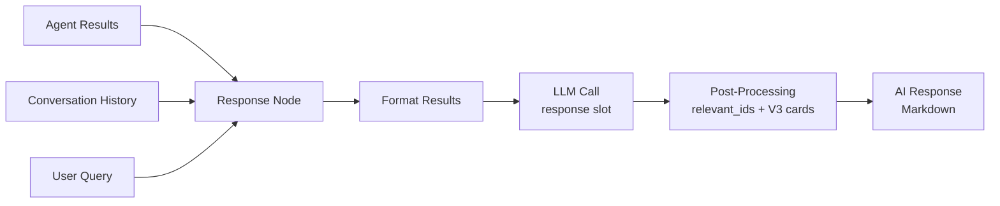
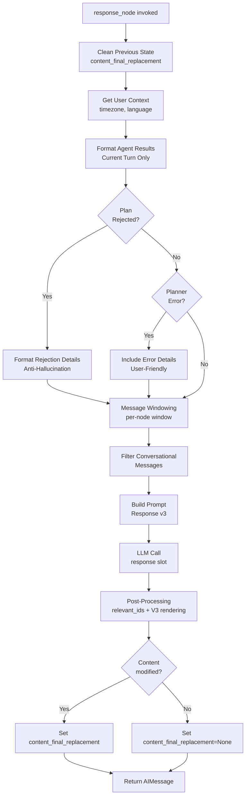
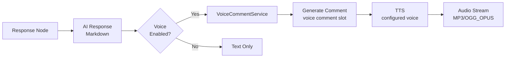
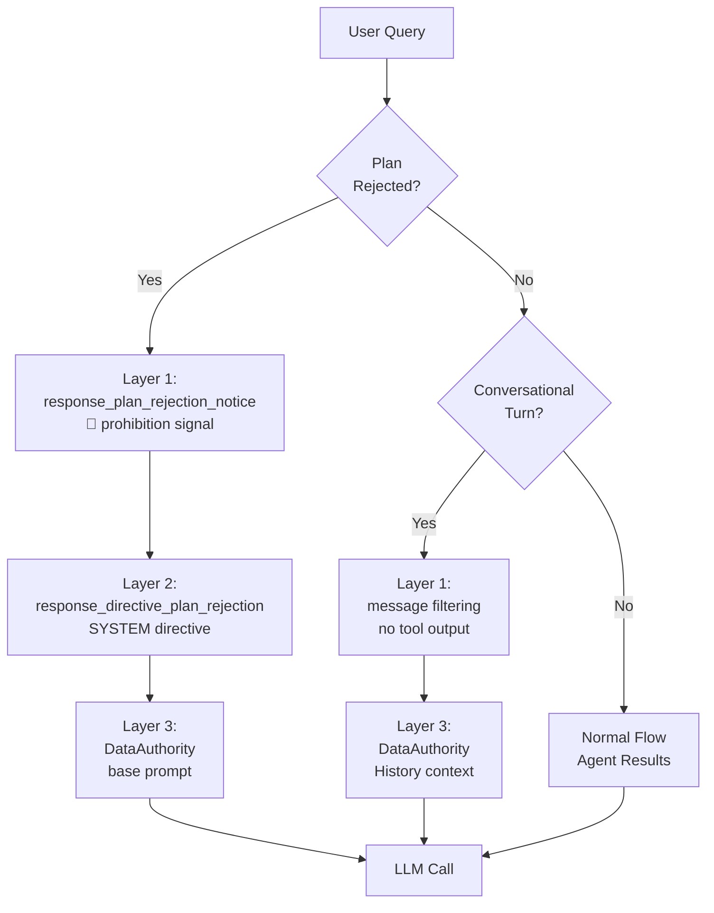

# RESPONSE - Response Node et Synthèse Conversationnelle

> **Documentation complète du Response Node : génération de réponses conversationnelles avec LLM créatif**
>
> Version: 1.2
> Date: 2026-01-12
> Updated: Architecture v3 references, Smart Services integration

---

## 📋 Table des Matières

1. [Vue d'ensemble](#-vue-densemble)
2. [Architecture Response Node](#-architecture-response-node)
3. [Prompt Response (v3 → v1)](#-prompt-response-v3--consolidated-v1)
4. [Format Agent Results](#-format-agent-results)
5. [Post-Processing](#-post-processing)
6. [Voice/TTS Integration](#-voicetts-integration) - NEW
7. [Message Windowing](#-message-windowing)
8. [Anti-Hallucination](#-anti-hallucination)
9. [Multilingual Support](#-multilingual-support)
10. [Métriques & Observabilité](#-métriques--observabilité)
11. [Testing](#-testing)
12. [Troubleshooting](#-troubleshooting)

---

## 📖 Vue d'ensemble

### Objectif

Le **Response Node** est le node final du graph LangGraph qui génère la réponse conversationnelle présentée à l'utilisateur. Il synthétise les résultats des agents avec un LLM créatif (higher temperature) pour produire des réponses naturelles, personnalisées et contextualisées.

### Responsabilités


```mermaid
graph LR
    A[Agent Results] --> B[Response Node]
    C[Conversation History] --> B
    D[User Query] --> B
    B --> E[Format Results]
    E --> F[LLM Call<br/>response slot]
    F --> G[Post-Processing<br/>relevant_ids + V3 cards]
    G --> H[AI Response<br/>Markdown]
```

**Inputs**:
- `agent_results`: Résultats d'exécution des tools (dict)
- `messages`: Historique conversationnel (windowed)
- `user_timezone`: Timezone utilisateur (pour personnalisation)
- `user_language`: Langue utilisateur (fr, en, es, etc.)
- `plan_rejection_reason`: Raison de rejet HITL (si applicable)
- `planner_error`: Erreur du planner (si applicable)

**Outputs**:
- `AIMessage` avec réponse conversationnelle (Markdown)
- `content_final_replacement`: Signal pour streaming service (contenu post-traité)

### Concepts Clés

| Concept | Description |
|---------|-------------|
| **Conversational LLM** | le modèle configuré sur le slot `response` (ADR-244 : chaque déploiement choisit le sien) |
| **Agent Results Formatting** | Conversion résultats agents en texte structuré |
| **Post-Processing** | Filtrage `<relevant_ids>` du registre du tour, puis rendu V3 (widgets, cartes de données) |
| **Anti-Hallucination** | Directives strictes contre invention de données |
| **Aveu d'échec fidèle (ADR-182)** | Quand le validateur refuse des étapes, le tour continue mais le modèle ne voyait qu'un résultat vide et **inventait** un diagnostic (mesuré 2026-07-30 : « aucun service n'est configuré » sur des services sains). `services/plan_blockers.py` réduit le verdict aux capacités bloquées et à leur cause (niveau capacité, jamais l'URL de scope brute), et la directive versionnée `response_directive_plan_blocked.txt` interdit de généraliser au-delà de cette liste, de blâmer l'utilisateur, ou de présenter une capacité manquante du demandeur comme une réponse sur la donnée d'un tiers. Généralisée à **tout** `ToolErrorCode` : un code non mappé dégrade vers une cause plus vague, jamais vers le silence. Un refus explicite de l'utilisateur (plan rejeté, brouillon annulé) garde la priorité. **Depuis ADR-184, le verdict est pesé contre ce que le tour a réellement exécuté** : `executed_tool_names(execution_plan, completed_steps)` liste les outils qui ont produit, et une capacité qui a produit n'est jamais déclarée bloquée — le routage ne lit jamais `is_valid`, donc un plan refusé s'exécute inchangé et réussit le plus souvent (mesuré 2026-07-31 : dix emails dans le registre, « la récupération a été bloquée »). Un blocage de niveau plan est tu dès que quoi que ce soit a produit ; l'ensemble vide — état absent ou revenu déformé d'un aller-retour msgpack — restaure le comportement antérieur, jamais l'inverse. Un tour partiellement bloqué présente ses résultats et nomme ce qui a manqué. |
| **Message Windowing** | les derniers tours conversationnels, `RESPONSE_MESSAGE_WINDOW_SIZE` (contexte riche) |
| **Context Prefetch (ADR-091)** | Les injections de contexte utilisateur (embedding du message, profil mémoire, RAG user/system, journal, portrait, psyché) vivent dans `services/response_context.py` et sont **préchargées depuis l'initiative node** en parallèle de son évaluation LLM (pipeline ET ReAct). Le response node fait un `pop_response_context(run_id)` ; sur tout miss (tour conversation, initiative désactivée/skippée, timeout), il exécute le **même** `fetch_response_context()` inline — zéro delta de comportement. Kill-switch `RESPONSE_CONTEXT_PREFETCH_ENABLED`. |
| **Mode HTML sans `<style>` + composants (ADR-177)** | En mode HTML enrichi, le LLM n'émet ni bloc `<style>` ni style inline : les règles `.lia-response` vivent dans `lia-components.css`. Depuis ADR-177 la directive expose un vocabulaire de composants (callouts ×4 avec titre, chips, `details` dépliables, listes clé-valeur `dl.lia-kv`, colonnes `lia-columns`, étapes `lia-steps`, tuiles `lia-stats`, code `language-*` → coloration Prism + bouton copier, `mark`/`kbd`/`abbr`) pour une composition adaptée aux données. En `html_cards`, la synthèse évite de recopier les fiches ajoutées. Sync directive↔CSS verrouillée par `test_html_directive_css_sync.py`. |
| **Multilingual** | Support 6 langues avec personnalisation temporelle |
| **Display Modes** | Format de sortie piloté par `user_display_mode` : `cards` (défaut, Markdown + cartes HTML), `markdown` (Markdown pur), `html` (HTML enrichi `lia-response`), `html_cards` (synthèse HTML enrichie + cartes sélectionnées) |
| **History Style Neutralization** | En modes `html` et `html_cards`, le style des réponses assistant de l'historique est neutralisé pour que la directive HTML reste la seule autorité de mise en forme (voir section Message Windowing) |

---

## 🏗️ Architecture Response Node

### Flow Complet


```mermaid
graph TD
    A[response_node invoked] --> B[Clean Previous State<br/>content_final_replacement]
    B --> C[Get User Context<br/>timezone, language]
    C --> D[Format Agent Results<br/>Current Turn Only]
    D --> E{Plan<br/>Rejected?}
    E -->|Yes| F[Format Rejection Details<br/>Anti-Hallucination]
    E -->|No| G{Planner<br/>Error?}
    G -->|Yes| H[Include Error Details<br/>User-Friendly]
    G -->|No| I[Message Windowing<br/>per-node window]
    F --> I
    H --> I
    I --> J[Filter Conversational<br/>Messages]
    J --> K[Build Prompt<br/>Response v3]
    K --> L[LLM Call<br/>response slot]
    L --> M[Post-Processing<br/>relevant_ids + V3 rendering]
    M --> N{Content<br/>modified?}
    N -->|Yes| O[Set content_final_replacement]
    N -->|No| P[Set content_final_replacement=None]
    O --> Q[Return AIMessage]
    P --> Q
```

### Fichier Source

**Fichier**: [apps/api/src/domains/agents/nodes/response_node.py](../../apps/api/src/domains/agents/nodes/response_node.py)

**Decorators**:
```python
@trace_node("response")
@track_metrics(
    node_name="response",
    duration_metric=agent_node_duration_seconds,
    counter_metric=agent_node_executions_total,
)
```

### Signature Fonction

```python
async def response_node(
    state: MessagesState,
    config: RunnableConfig
) -> dict[str, Any]:
    """
    Response node: Generates conversational response using higher-temperature LLM.
    Synthesizes agent results and streams tokens for real-time UX.

    Args:
        state: Current LangGraph state with messages and agent_results.
        config: Runnable config with metadata (run_id, etc.).

    Returns:
        Updated state with AI response message.

    Raises:
        Exception: If response generation fails, returns error fallback message.

    Note:
        - Streaming is handled by service layer via astream_events().
        - This node formats agent results for LLM context.
        - Basic metrics (duration, success/error counters) tracked by @track_metrics decorator.
    """
```

### Code Complet Annoté (Core Logic)

```python
async def response_node(state: MessagesState, config: RunnableConfig) -> dict[str, Any]:
    run_id = config.get("metadata", {}).get("run_id", "unknown")

    logger.info(
        "response_node_started",
        run_id=run_id,
        message_count=len(state[STATE_KEY_MESSAGES]),
        agent_results_count=len(state.get(STATE_KEY_AGENT_RESULTS, {})),
    )

    try:
        # ✅ CRITICAL FIX: Clean previous turn's content replacement signal
        # Prevents persisted state from triggering replacement in conversational turns
        # Root cause: content_final_replacement persists in PostgreSQL checkpointer
        if "content_final_replacement" in state:
            logger.debug("cleaning_previous_content_replacement", run_id=run_id)

        # Timezone and language from state; an absent language is the declared one (ADR-323)
        user_timezone = state.get("user_timezone", DEFAULT_USER_DISPLAY_TIMEZONE)
        user_language = resolve_language(state.get("user_language"))

        # Response LLM (the vision slot when the turn carries an image), and the
        # system prompt: get_response_prompt, then the tone and the contexts
        llm = get_llm("vision_analysis") if has_vision_content else get_llm("response")
        base_system_prompt = _build_response_system_prompt(...)

        # Format agent results for prompt context
        # Filter by current turn to only show results from this conversation turn
        agent_results_summary = format_agent_results_for_prompt(
            state.get(STATE_KEY_AGENT_RESULTS, {}),
            current_turn_id=state.get(STATE_KEY_CURRENT_TURN_ID),
        )

        # PHASE 8: Handle plan rejection via HITL
        plan_approved = state.get(STATE_KEY_PLAN_APPROVED)
        plan_rejection_reason = state.get(STATE_KEY_PLAN_REJECTION_REASON)

        # State coherence check: Discard stale rejection if plan was approved
        if plan_approved is True and plan_rejection_reason:
            logger.warning("response_node_state_coherence_violation", run_id=run_id)
            plan_rejection_reason = None

        # If plan was rejected, format rejection as structured agent result
        if plan_rejection_reason:
            agent_results_summary = _format_rejection_details(plan_rejection_reason)
            logger.info("response_node_plan_rejection", run_id=run_id)

        # A recorded planner error would be prepended to the agent results the
        # model reads — nothing records one today (ADR-323, found not fixed)
        planner_error = state.get(STATE_KEY_PLANNER_ERROR)
        if planner_error:
            error_message = planner_error.get(
                "message", APIMessages.plan_validation_failed(user_language)
            )
            errors = planner_error.get("errors", [])
            error_details = APIMessages.planner_error_header(error_message, user_language)
            if errors:
                error_details += APIMessages.planner_technical_details(user_language)
                for err in errors[:RESPONSE_MAX_ERRORS_DISPLAY]:
                    err_msg = err.get("message") or APIMessages.planner_unknown_error(user_language)
                    error_details += f"- {err_msg}\n"
                error_details += APIMessages.planner_explanation(user_language)
            agent_results_summary = error_details + "\n\n" + agent_results_summary

        # The history: the current turn's own responses dropped (the ReAct
        # answer reaches the model through agent_results), windowed — the
        # windowing already removes ToolMessages and tool-calling AIMessages —,
        # then filtered for the LLM (a card's HTML reduced to its leading prose,
        # a placeholder only when it has none; styles neutralised in HTML modes).
        # Abridged: the real code also drops a refused plan's messages
        # (_prepare_conversational_messages).
        windowed_messages = get_response_windowed_messages(
            drop_current_turn_responses(state[STATE_KEY_MESSAGES])
        )
        conversational_messages = filter_for_llm_context(
            windowed_messages, neutralize_formatting=neutralize_history_formatting
        )

        # The chain: base prompt, skill contract, at most ONE versioned directive
        # (draft cancelled, plan refused or plan blocked — see "Layer 2" below),
        # the acts the turn performed, the agent results, the conversation, then
        # the language reminder. A conversational turn gets no directive: the base
        # prompt's <DataAuthority> rules govern it.
        chain = _build_response_chain(
            base_system_prompt=base_system_prompt,
            agent_results_summary=agent_results_summary,
            skills_context=skills_context,
            plan_rejection_reason=plan_rejection_reason,
            state=state,
            user_language=user_language,
            llm=llm,
            performed_actions_block=await build_performed_actions_block(
                state, run_id_of(config), user_language
            ),
        )

        # Enrich config with node metadata for observability
        enriched_config = enrich_config_with_node_metadata(config, "response")

        # (Abridged) A confirmed or cancelled draft takes a FAST PATH here: no
        # model call, a short answer, the business metrics instrumented with the
        # draft's execution — the turn ends there. The nominal path instruments
        # them after post-processing (_instrument_business_metrics).

        # Invoke LLM: every block is already in the template
        result = await asyncio.wait_for(
            chain.ainvoke({STATE_KEY_MESSAGES: conversational_messages}, config=enriched_config),
            timeout=settings.response_llm_timeout_seconds,
        )

        # POST-PROCESSING: the psyche self-report and the tone annotation are
        # stripped, then <relevant_ids> filtering of the turn's registry and
        # the V3 HTML rendering (widgets always, data cards in cards / html_cards)
        original_content = coerce_content_to_text(result.content)
        final_content, current_turn_registry = _apply_relevant_ids_filtering(...)
        final_content = _render_response_html(...)

        # Signal the streaming service when post-processing changed the text —
        # the stored message becomes the modified text too; None clears a value
        # the checkpoint kept from an earlier turn
        content_was_modified = final_content != original_content
        if content_was_modified:
            result = AIMessage(content=final_content)
        state_update: dict[str, Any] = {STATE_KEY_MESSAGES: [result]}
        state_update["content_final_replacement"] = (
            final_content if content_was_modified else None
        )

        return state_update

    except (RuntimeError, ValueError, KeyError, TypeError, AttributeError) as e:
        # Logged, counted (graph_exceptions_total), and answered as the
        # ASSISTANT in the person's language
        return _response_error_fallback(state, run_id, e)
```

### Pattern Learning Recording

> **NEW (2026-01-12)** : Le Response Node participe au **Plan Pattern Learning** pour les plans simples ayant bypassé le semantic_validator.

```python
# À la fin de response_node, après génération réponse
from src.domains.agents.services.plan_pattern_learner import record_plan_success

# Plans simples (pas de validation sémantique) → enregistrement direct
if state.get("plan_bypassed_validation"):
    plan = state.get("execution_plan")
    intelligence = state.get("query_intelligence")
    if plan and intelligence:
        record_plan_success(plan, intelligence)  # Fire-and-forget async
```

**Contexte** : Le semantic_validator_node enregistre les patterns pour les plans complexes validés par LLM. Cependant, certains plans simples (single-step, contexte résolu, etc.) peuvent bypasser la validation. Pour ces cas, le Response Node se charge de l'enregistrement après exécution réussie.

**Documentation complète** : [PLAN_PATTERN_LEARNER.md](./PLAN_PATTERN_LEARNER.md)

---

## 📝 Prompt Response (v3 → Consolidated v1)

### Version Actuelle

> **Note**: Le prompt v3 a été consolidé dans v1 (décembre 2025). Le versioning historique est conservé dans le contenu du fichier.

**Fichier**: [apps/api/src/domains/agents/prompts/v1/response_system_prompt_base.txt](../../apps/api/src/domains/agents/prompts/v1/response_system_prompt_base.txt)

**Version**: Consolidated v1 (historiquement v3.0 - optimisé caching)

**Date**: 2025-11-08

**Longueur**: le fichier versionné fait foi (ce document n'en recopie pas la taille).

### Structure Prompt

Le prompt est divisé en **2 parties** par la ligne
`--- DYNAMIC CONTEXT (all variable data below) ---` : tout ce qui la précède ne
change pas d'un tour à l'autre pour un même compte, tout ce qui la suit change à
chaque tour. Les adaptateurs de fournisseur coupent le préfixe relu par le cache
de prompt à cette ligne (ADR-309).

#### Partie 1 : STABLE (préfixe du cache)

**Contenu** (les blocs du fichier, dans l'ordre) :
- `<Personality>`, `<agent_identity>`, `<context_and_operating_boundaries>`
- `<DataAuthority>` (la vérité des données) et `<operational_heuristics>`, qui
  contient `<SubAgentDeliveryOverride>`
- `<tool_orchestration_contract>`, `<security_and_containment_protocols>`
- `<edge_cases_and_contingency>` : aucun résultat, donnée absente, tri
  ambigu — un plan refusé n'y figure pas : il passe par une directive
  versionnée et `response_plan_rejection_notice.txt` (voir plus bas)
- `<canonical_examples>`, `<output_specifications>`

Ses seules valeurs sont celles du compte — sa personnalité (`{personnalite}`) et
sa langue (`{user_language}`) : d'un tour à l'autre, un fournisseur doté d'un cache
de prompt relit ce préfixe, au tarif que déclare la table des prix ; un modèle sans
cache paie ce qu'il payait (ADR-309).

#### Partie 2 : VARIABLE (chaque tour)

**Contenu** : `<TemporalContext>` (la date et l'heure courantes, la taille de la
fenêtre), puis `{context_sections}` — les sections de contexte déclarées dans
`response_context_sections.txt`, chacune émise seulement quand son contenu existe
(ADR-284).

**Injected via ChatPromptTemplate**:
- Agent results
- Conversation history
- User message

#### App Knowledge Context (la section `AppKnowledge`)

When `is_app_help_query=True` (detected by QueryAnalyzer), the Response Node injects additional context to help the LLM answer questions about LIA itself, as the `AppKnowledge` section of `response_context_sections.txt` (key `app_knowledge_context`):

1. **App Identity Prompt** — loaded from `app_identity_prompt.txt` (in the prompts directory). Contains structured knowledge about LIA's features, setup instructions, supported integrations, and usage guidance. Since v1.9.2, it also includes an admin-boundary directive instructing the LLM to never reference admin-only features (admin panels, LLM configuration, user management) when talking to regular users.

2. **System RAG Context** — optionally enriches the response with FAQ chunks retrieved from the knowledge base. When relevant FAQ entries exist, they are appended to the app knowledge context to provide precise, up-to-date answers.

**Lazy loading**: When `is_app_help_query=False`, the section is empty and `get_response_prompt` leaves it out, instruction included (ADR-284). Neither the app identity prompt file nor the RAG retrieval are loaded, ensuring zero overhead for standard (non-help) queries.

### Core Rules (Anti-Hallucination)

> Les règles ci-dessous décrivent le prompt d'avant sa consolidation. Le fichier
> `response_system_prompt_base.txt` les a réécrites — `<DataAuthority>` pour la
> vérité des données, `<operational_heuristics>` pour le filtrage et la forme — et
> c'est lui qui fait foi.

**Règle #1: Verified Data ONLY**
```
- With agent results → Use EXCLUSIVELY provided data
- NEVER invent, guess, extrapolate beyond results
- Missing info → State clearly: "Information not available"
```

**Règle #2: User Edits/HITL**
```
- If user modified request → Base response ONLY on final results
- IGNORE rejected/modified initial queries
```

**Règle #3: Output Format (display-mode dependent)**
```
- Format dépend de user_display_mode (cards | markdown | html | html_cards) :
  - cards / markdown → réponse en Markdown
    - Structure: ## sections, ### subsections, --- separators
    - Emojis: ✅❌⚠️📧📞📇🔍📅💡🎯 (relevant)
  - html / html_cards → HTML enrichi <div class="lia-response"> (directive
    html_response_directive.txt, override des consignes Markdown)
  - html_cards → synthèse HTML suivie des cartes choisies par <relevant_ids> ;
    html_cards_response_directive.txt évite de recopier les fiches dans la synthèse
```

> Note: la directive Markdown ci-dessus est la consigne de base ; en modes `html` et `html_cards`
> elle est explicitement remplacée par `html_response_directive.txt`
> (« OVERRIDE ALL PREVIOUS FORMATTING INSTRUCTIONS »).
> Sur un tour conversationnel avec voix activée, les directives HTML sont supprimées
> pour que la synthèse vocale ne lise pas les balises du texte diffusé.

**Règle #4: Media Fields (Photos)**
```
- NEVER mention photo URLs, file paths, or raw media URLs in text
- Photos are displayed automatically via HTML gallery
- DO NOT write "Photos (aperçu):", "Photos:", or similar text labels
```

**Règle #5: Contact Photos Placeholder** ⭐
```
- ONLY write [PHOTOS] if you see "*[N photo(s) disponible(s)]*" after contact name
- DO NOT copy the photo signal in your response - it's metadata only
- Place it on a new line immediately after contact name, BEFORE attributes
- If NO photo signal → DO NOT write [PHOTOS] placeholder

Example WITH photos:
Data: **1. jean dupond** ([Voir le profil](...)) *[2 photo(s) disponible(s)]*

Your response:
1. **jean dupond**
[PHOTOS]
   - 📧 jean@example.com

Example WITHOUT photos:
Data: **1. Jean Dupont** ([Voir le profil](...))

Your response:
1. **Jean Dupont**
   - 📧 jean@example.com
```

### Response Structure

> Comme les règles ci-dessus, les gabarits de cette section et de la suivante
> décrivent le prompt d'avant sa consolidation ; `<output_specifications>` et
> `<edge_cases_and_contingency>` du fichier font foi.

**1. Intro** (italic + sarcastic):
```markdown
*Personalize subtly based on context: date, season, time, history, user request.*
```

**2. Main Content** (Markdown):
```markdown
## 🔍 Results

Found **3 contacts**:

1. **Marie Martin**
   - 📧 marie@example.com
   - 📞 +33 6 12 34 56 78

2. **Jean Dupont**
   - 📧 jean@example.com
   - (No phone)

---

> **Note**: Data from cache (updated 2 min ago)
```

**3. Conclusion** (italic + actions):
```markdown
*Voilà ! N'hésite pas si besoin.* 😊

**Next actions:**
- 📧 Get contact details
- 🔍 Refine search
- 💬 Something else?
```

### Edge Cases

**User Rejected Plan**:
```markdown
## 🚫 Plan rejected

You chose not to execute the proposed plan.

**What can I do for you?**
- Rephrase your request differently
- Propose another action
- Assist you in another way
```

**Technical Error**:
```markdown
## ❌ Error occurred

Service temporarily unavailable.

**What to do:**
- Retry in a moment
- Check connector in Settings
```

**No Results**:
```markdown
## 🔍 No results

**Suggestions:**
- Check spelling
- Broader search
- List all to browse
```

---

## 🔧 Format Agent Results

> **ADR-303 — un fait, un canal.** Le formateur ne porte plus les échecs de
> steps : ils atteignent le prompt par la **directive d'honnêteté**
> (`runtime_failures_directive`), qui lit `completed_steps` dans la forme que
> l'executor écrit, nomme l'outil et publie le **total exact**. Le formateur
> garde deux choses : ce que les outils ont **dit** quand ils ont réussi
> (confirmations d'action, analyses de sous-agent) et l'erreur d'un **agent**
> dont tout le travail a échoué, en une ligne localisée. Un statut hors
> vocabulaire est journalisé, jamais narré — la branche « Statut inconnu » qui
> jetait le champ `error` a disparu avec les trois valeurs mortes du `Literal`.

### Le vocabulaire des statuts

`AgentResultStatus` a **deux** valeurs : `SUCCESS` et `ERROR`. `ERROR` ne vaut
que si **tous** les steps exécutés ont échoué ; un plan partiellement réussi est
un `SUCCESS` qui porte ses échecs dans `AgentResult.failed_steps`. Le champ dit
le partiel, jamais le statut. Garde : `test_agent_status_vocabulary_guard.py`.

### format_agent_results_for_prompt Function

**Objectif**: Convertir les résultats agents (dict) en texte structuré pour injection dans le prompt LLM.

### Signature

```python
def format_agent_results_for_prompt(
    agent_results: dict[str, Any],
    current_turn_id: int | None = None
) -> str:
    """
    Format agent results for injection into response prompt.

    Converts AgentResult dictionary into human-readable summary WITH FULL DATA for LLM context.

    V2 (with turn_id): Supports composite keys "turn_id:agent_name" and filters by current turn.

    Args:
        agent_results: Dictionary of composite_key → AgentResult (keys: "turn_id:agent_name").
        current_turn_id: Optional turn ID to filter results (only include current turn).

    Returns:
        Formatted string with agent results summary AND detailed data.
    """
```

### Structure Composite Keys

**Format**: `"turn_id:agent_name"`

**Exemples**:
- `"3:contacts_agent"` → Turn 3, contacts agent
- `"5:emails_agent"` → Turn 5, emails agent

**Filtering**: Si `current_turn_id=3` fourni, ne garde que les résultats du turn 3.

### Format ContactsResultData

**Input** (AgentResult.data):
```python
{
    "status": "success",
    "data": {
        "total_count": 2,
        "contacts": [
            {
                "names": "jean dupond",
                "resource_name": "people/c6005623555827615994",
                "emails": ["jean@example.com"],
                "phones": ["+33 6 12 34 56 78"],
                "photos": [{"url": "https://..."}],
                "addresses": [{"formatted": "123 rue X\n75001 Paris", "type": "home"}],
                "organizations": [{"name": "Acme Inc", "title": "Engineer"}],
            }
        ],
        "data_source": "cache",
        "cache_age_seconds": 120,
        "timestamp": "2025-11-14T10:30:00Z"
    }
}
```

**Output** (formatted text):
```
✅ contacts_agent: Trouvé 2 contact(s)

**Metadata de fraîcheur:**
- Source: cache
- Âge du cache: 120 secondes
- Timestamp: 2025-11-14T10:30:00Z

Détails des contacts:

**1. jean dupond** ([Voir le profil](https://contacts.google.com/person/c6005623555827615994)) *[1 photo(s) disponible(s)]*

   - Emails: jean@example.com
   - Phones: +33 6 12 34 56 78
   - Adresse (Home): 123 rue X, 75001 Paris
   - Organisation: Acme Inc - Engineer
```

### Pre-Injection Strategy (Phase 5.5) ⭐

**Profile Links Pre-Injection**:

Avant Phase 5.5:
```python
# POST-PROCESSING (regex-based, fragile)
content = _inject_contact_profile_links(content, agent_results)
```

Après Phase 5.5:
```python
# PRE-INJECTION (in format_agent_results_for_prompt)
# LLM voit directement le lien dans les données
summary += f"**{idx}. {name}**"
if google_url:
    summary += f" ([Voir le profil]({google_url}))"
```

**Bénéfices**:
- ✅ Robuste: Pas de regex pattern matching
- ✅ Naturel: LLM peut reformuler sans casser les liens
- ✅ Générique: Fonctionne pour tous domaines (emails, calendar, etc.)

**Photo Signal Pre-Injection**:

```python
# Signal photo availability (metadata, not URLs)
photos = contact.get("photos", [])
if photos and isinstance(photos, list) and len(photos) > 0:
    photo_count = len(photos)
    summary += f" *[{photo_count} photo(s) disponible(s)]*"
```

**LLM voit**:
```
**1. jean dupond** ([Voir le profil](...)) *[2 photo(s) disponible(s)]*
```

**LLM génère** (via Règle #5):
```markdown
1. **jean dupond**
[PHOTOS]
   - 📧 jean@example.com
```

---

## 🎨 Post-Processing

In `cards` and `html_cards` modes, data cards reflect the final answer's selection. Whenever
`DataForFiltering` contains items, the model declares the retained IDs in
`<relevant_ids>`, including unfiltered requests and ReAct answers. An empty
selection stays empty, including searches mixing weather and personal data.
Missing selection metadata does not display every candidate in either mode with cards.
Approval drafts and interactive widgets remain available; initiative results
also require selection before becoming data cards. Neither context resolution
nor the final SSE replacement resurrects an explicitly discarded selection.

On a reference turn without fresh agent results, payloads still held in
`resolved_context` become registry candidates before `DataForFiltering` if their
registry slice has expired. They undergo the same positive selection; fresh
results remain authoritative, and rendering never restores rejected candidates.

`html_cards` combines the existing rich HTML response with that same deterministic
card renderer. The versioned `html_cards_response_directive.txt` specializes the rich
HTML directive: prose contributes the answer, comparisons, caveats and next steps;
the appended cards carry the detailed fields. It does not ask the model to reproduce
the cards or to add a component for every field. The synthesis and `<relevant_ids>`
come from the same response-model call. Widgets are still injected once in every
display mode, before data cards, and an empty final selection cannot fall back to
discarded records for rendering or final SSE emission.

Avatar weather styles use the `lia-ambient-weather` prefix; `lia-weather`
belongs to data cards. Card-bearing bubbles have an explicit width so their
container queries cannot collapse a short answer to its title's width.

Contact card photos declare `lia-illus__image`, keeping them inside their
illustration frame without the standalone image wrapper. `rehypeContactPhotos`
runs after `rehypeTableLabels` and before search highlighting: on the already
sanitized AST it restores that fixed class to images directly inside a contact
card's `lia-illus` frame, repairing saved answers without rewriting history.
It changes no URL or style and creates no markup. Google photos pass through
the same authenticated proxy before both preload and rendering; standalone
photo classification uses the original URL and retains its lightbox.

> **Historique.** L'injection de photos par marqueur décrite ci-dessous
> (`_extract_contact_photos_html`, `_inject_photos_via_placeholders`, `[PHOTOS]`)
> n'existe plus : le nœud de réponse filtre le registre du tour par `<relevant_ids>`
> (`_apply_relevant_ids_filtering`), puis dessine les widgets et les cartes de
> données après le modèle (`_render_response_html`, rendu V3). La section est
> gardée comme trace de la conception d'origine.

### Objectif

Après génération LLM, injecter les **photos HTML** et **liens profile** dans la réponse Markdown.

**Problème**: LLM ne doit PAS générer HTML brut (security risk, inconsistent formatting).

**Solution**: **Placeholder-based injection** + **Pre-injection**.

### Flow Post-Processing

```mermaid
graph LR
    A[LLM Response<br/>with [PHOTOS]] --> B[_extract_contact_photos_html<br/>Extract photos from agent_results]
    B --> C[_inject_photos_via_placeholders<br/>Replace [PHOTOS] with HTML]
    C --> D[Final Content<br/>Markdown + HTML]
```

### _extract_contact_photos_html Function

**Signature**:
```python
def _extract_contact_photos_html(
    agent_results: dict[str, Any],
    current_turn_id: int | None
) -> dict[str, str]:
    """
    Extract photos from agent_results and generate HTML galleries per contact.

    Returns:
        Dict mapping contact names to HTML gallery strings
        Example: {"jean dupond": "<div>...</div>", "Jean Dupont": "<div>...</div>"}
    """
```

**Code complet annoté**:
```python
def _extract_contact_photos_html(
    agent_results: dict[str, Any],
    current_turn_id: int | None
) -> dict[str, str]:
    if not agent_results:
        return {}

    photos_by_contact: dict[str, str] = {}

    # Iterate through all agent results to find contact details with photos
    for composite_key, result in agent_results.items():
        # Filter by current turn (same logic as format_agent_results_for_prompt)
        if ":" in composite_key:
            turn_id_str, agent_name = composite_key.split(":", 1)
            if current_turn_id is not None:
                try:
                    turn_id_from_key = int(turn_id_str)
                    if turn_id_from_key != current_turn_id:
                        continue  # Skip results from other turns
                except ValueError:
                    pass

        # Only process successful results
        if result.get("status") != "success":
            continue

        # Extract data
        data = result.get("data")
        if not data or not _is_contacts_result_data(data):
            continue

        # Extract contacts list (support both Pydantic and dict)
        contacts = data.contacts if hasattr(data, "contacts") else data.get("contacts", [])
        if not contacts:
            continue

        # Process each contact for photos
        for contact in contacts:
            name = contact.get("names", "Contact")
            photos = contact.get("photos", [])

            if not photos or not isinstance(photos, list):
                continue

            # Generate HTML gallery for this contact
            # CRITICAL: CommonMark Type 6 HTML blocks require blank lines
            html_gallery = '\n<div class="contact-photos-gallery">\n'

            for photo in photos:
                if isinstance(photo, dict):
                    photo_url = photo.get("url", "")
                    if photo_url:
                        html_gallery += f'\n'

            html_gallery += "</div>\n\n"

            # Store gallery keyed by contact name
            photos_by_contact[name] = html_gallery

    return photos_by_contact
```

### _inject_photos_via_placeholders Function

**Signature**:
```python
def _inject_photos_via_placeholders(
    content: str,
    photos_by_contact: dict[str, str]
) -> tuple[str, bool]:
    """
    Inject photo galleries by replacing [PHOTOS] placeholders in LLM response.

    Returns:
        Tuple of (modified_content, was_injected)
    """
```

**Code complet annoté**:
```python
def _inject_photos_via_placeholders(
    content: str,
    photos_by_contact: dict[str, str]
) -> tuple[str, bool]:
    if not photos_by_contact:
        return content, False

    if "[PHOTOS]" not in content:
        logger.warning("photos_placeholder_not_found", contacts_with_photos=list(photos_by_contact.keys()))
        # User preference: No fallback, prefer no photos than misplaced photos
        return content, False

    modified_content = content
    injections_made = 0

    # For each contact with photos, find their placeholder and replace it
    for contact_name, html_gallery in photos_by_contact.items():
        # Escape special regex characters in contact name
        escaped_name = re.escape(contact_name)

        # Pattern: Match contact name followed by [PHOTOS]
        # CRITICAL FIX #1: Use .*? to allow profile links [Voir le profil](...)
        # CRITICAL FIX #2: Use re.DOTALL flag so .* matches newlines
        pattern = rf"(\*\*{escaped_name}\*\*.*?)(\[PHOTOS\])"

        # Replace the placeholder with HTML gallery
        replacement = rf"\1{html_gallery}"
        new_content = re.sub(pattern, replacement, modified_content, count=1, flags=re.DOTALL)

        if new_content != modified_content:
            injections_made += 1
            modified_content = new_content

    if injections_made > 0:
        logger.info("photos_injected_via_placeholders", contacts_injected=injections_made)
        return modified_content, True

    # No placeholders matched
    return content, False
```

### CommonMark Compliance

**Requirement**: HTML blocks doivent avoir **blank lines** avant et après pour parsing correct.

**Code**:
```python
# CRITICAL: For CommonMark Type 6 HTML blocks:
# - Must have blank line BEFORE and AFTER <div>
html_gallery = '\n<div class="contact-photos-gallery">\n'
# ... images ...
html_gallery += "</div>\n\n"
```

**Reference**: [CommonMark Spec 0.30 - HTML Blocks](https://spec.commonmark.org/0.30/#html-blocks)

---

## 🎙️ Voice/TTS Integration

### Vue d'Ensemble (Phase 2025-12-24)

Le **Response Node** peut optionnellement déclencher la génération d'un **commentaire vocal** (Voice Comment) qui sera synthétisé via **Google Cloud TTS** et streamé à l'utilisateur.


```mermaid
graph LR
    A[Response Node] --> B[AI Response<br/>Markdown]
    B --> C{Voice<br/>Enabled?}
    C -->|Yes| D[VoiceCommentService]
    D --> E[Generate Comment<br/>voice comment slot]
    E --> F[TTS<br/>configured voice]
    F --> G[Audio Stream<br/>MP3/OGG_OPUS]
    C -->|No| H[Text Only]
```

### Flux Voice Comment

1. **Condition d'activation** : `user.voice_enabled == True` (préférence utilisateur)
2. **Génération commentaire** : LLM léger (gpt-4.1-nano) génère 1-6 phrases conversationnelles
3. **Synthèse TTS** : Google Cloud TTS avec voix Neural2 (fr-FR-Neural2-F/G)
4. **Streaming audio** : Chunks audio streamés via SSE

### Configuration Voice

```python
# apps/api/src/core/config/voice.py

class VoiceSettings:
    voice_enabled: bool = False  # Feature flag
    voice_default_language_code: str = "fr-FR"
    voice_default_voice_name: str = "fr-FR-Neural2-F"  # Female Neural2
    voice_audio_encoding: str = "MP3"
    voice_sample_rate_hertz: int = 24000
    voice_max_sentences: int = 6  # Max sentences per comment
```

### Voix Disponibles

| Langue | Voice Name | Genre | Type |
|--------|------------|-------|------|
| Français | fr-FR-Neural2-F | Féminin | Neural2 |
| Français | fr-FR-Neural2-G | Masculin | Neural2 |
| English | en-US-Neural2-A | Masculin | Neural2 |
| English | en-US-Neural2-C | Féminin | Neural2 |

### Format Audio

| Encoding | Sample Rate | Use Case |
|----------|-------------|----------|
| **MP3** | 24000 Hz | Web, mobile (compression) |
| **OGG_OPUS** | 24000 Hz | Web moderne (meilleure qualité) |
| **LINEAR16** | 48000 Hz | Haute fidélité (non compressé) |

### Métriques Voice

Référence complète dans [OBSERVABILITY_AGENTS.md](OBSERVABILITY_AGENTS.md#9-voicetts-metrics-13-métriques---new-phase-2025-12-24).

**KPIs critiques** :
- `voice_time_to_first_audio_seconds` : P95 < 2s (TTFA - UX critique)
- `voice_tts_latency_seconds` : P95 < 1.5s
- `voice_fallback_total` : < 5% (dégradation gracieuse)

### Dégradation Gracieuse

Si Voice échoue, le système fallback silencieusement vers text-only :

```python
try:
    audio_chunks = await voice_service.generate_voice_comment(response_text)
    async for chunk in audio_chunks:
        yield VoiceChunk(audio=chunk)
except Exception as e:
    # Graceful degradation: log error, continue text-only
    logger.warning("voice_fallback", reason=str(e))
    voice_fallback_total.labels(reason="tts_error").inc()
```

### Ressources Voice

- [VOICE.md](VOICE.md) - Documentation complète Voice domain
- [ADR-050-Voice-Domain-TTS-Architecture.md](../architecture/ADR-050-Voice-Domain-TTS-Architecture.md) - Architecture Decision Record

---

## 📐 Message Windowing

### Objectif

**Performance optimization**: Response node needs rich context (`settings.response_message_window_size` tours) au lieu de full conversation history.

### get_response_windowed_messages

```python
# apps/api/src/domains/agents/utils/message_windowing.py

def get_response_windowed_messages(messages: list[BaseMessage]) -> list[BaseMessage]:
    """
    Get windowed messages for response node.

    Response needs rich context for creative synthesis:
    - Recent user queries (settings.response_message_window_size turns)
    - SystemMessage always preserved
    - Conversational AIMessages for continuity

    Args:
        messages: Full message history

    Returns:
        Windowed messages (SystemMessages + the last window of turns)
    """
    if not messages:
        return []

    # Preserve SystemMessage
    system_messages = [m for m in messages if isinstance(m, SystemMessage)]
    non_system_messages = [m for m in messages if not isinstance(m, SystemMessage)]

    # Keep last N turns (HumanMessage + AIMessage pairs)
    windowed = non_system_messages[-max_turns * 2:] if len(non_system_messages) > max_turns * 2 else non_system_messages

    return system_messages + windowed
```

### filter_conversational_messages

**Objectif**: Retirer ToolMessage et AIMessage avec tool_calls (reasoning interne agents).

```python
# apps/api/src/domains/agents/utils/message_filters.py

def filter_conversational_messages(messages: list[BaseMessage]) -> list[BaseMessage]:
    """
    Filter messages to keep only conversational content.

    Removes:
    - ToolMessage (internal agent execution results)
    - AIMessage with tool_calls (internal agent reasoning)

    Keeps:
    - SystemMessage (always preserved)
    - HumanMessage (user queries)
    - AIMessage without tool_calls (conversational responses)

    Args:
        messages: Full message list

    Returns:
        Filtered conversational messages only
    """
    conversational = []

    for msg in messages:
        # Always keep SystemMessage
        if isinstance(msg, SystemMessage):
            conversational.append(msg)
            continue

        # Always keep HumanMessage
        if isinstance(msg, HumanMessage):
            conversational.append(msg)
            continue

        # AIMessage: Keep only if no tool_calls (conversational response)
        if isinstance(msg, AIMessage):
            if not hasattr(msg, "tool_calls") or not msg.tool_calls:
                conversational.append(msg)
            # Else: Skip AIMessage with tool_calls (internal reasoning)

        # Skip ToolMessage (internal execution results)

    return conversational
```

### Usage dans Response Node

Le nœud ne l'appelle pas lui-même : le fenêtrage l'applique
(`get_windowed_messages`), puis le nœud filtre pour le contexte du modèle.

```python
# The current turn's own responses dropped, then windowing (which applies
# filter_conversational_messages), then the LLM-context filter
windowed_messages = get_response_windowed_messages(
    drop_current_turn_responses(state[STATE_KEY_MESSAGES])
)
conversational_messages = filter_for_llm_context(
    windowed_messages, neutralize_formatting=neutralize_history_formatting
)

logger.debug(
    "response_node_messages_filtered",
    original_count=len(state[STATE_KEY_MESSAGES]),
    windowed_count=len(windowed_messages),
    filtered_count=len(conversational_messages),
)
```

### Bénéfices

| Metric | Sans Windowing/Filtering | Avec Windowing/Filtering | Réduction |
|--------|---------------------------|--------------------------|-----------|
| **Messages count** | 100 messages | 40 messages | **60%** |
| **Tokens LLM input** | 50,000 tokens | 10,000 tokens | **80%** |
| **Latency LLM call** | 8-12s | 2-4s | **60-70%** |
| **Cost per call** | $0.025 | $0.005 | **80%** |

### Display Modes & History Style Neutralization

Le format de sortie est piloté par `LiaRuntimeContext.display_mode`, alimenté par
la préférence `User.response_display_mode` :

| Mode | Sortie | Historique assistant injecté au LLM |
|------|--------|-------------------------------------|
| `cards` (défaut) | Markdown + cartes HTML | Markdown conservé verbatim ; cartes HTML réduites au placeholder `[Results displayed]` (`CONTEXT_RESULTS_DISPLAYED_PLACEHOLDER`) |
| `markdown` | Markdown pur | Idem `cards` |
| `html` | HTML enrichi `lia-response` | **Style neutralisé** (Markdown + HTML strippés), contenu préservé, préfixé du marqueur `[previous answer, formatting omitted]` (`CONTEXT_PRIOR_ANSWER_UNFORMATTED_MARKER`) |
| `html_cards` | Synthèse HTML enrichie `lia-response` + cartes HTML sélectionnées | Idem `html` |

Les groupes `RESPONSE_DISPLAY_MODES_WITH_HTML` et `RESPONSE_DISPLAY_MODES_WITH_CARDS`
déclarent ces deux capacités dans `src/core/constants.py`. La validation du point
d'entrée `PATCH /auth/me/display-mode-preference` lit `RESPONSE_DISPLAY_MODE_CHOICES` ;
les schémas de profil transportent la valeur conservée dans la colonne texte existante.
Le mode combiné ne demande aucune migration de stockage ni appel modèle supplémentaire.

**Voix** — les deux modes HTML partagent `_should_inject_html_directive` : la directive
est injectée sur un tour dirigé vers `planner`, ou lorsque la voix de l'utilisateur est
désactivée. Sur les autres routes avec voix activée, la réponse conversationnelle reste
en Markdown puisqu'elle est lue directement. Les cartes et widgets sont ajoutés après
la génération, selon les mêmes règles de sélection ; le contexte vocal conserve son
périmètre au tour courant.

**Pourquoi neutraliser en modes HTML** — `filter_for_llm_context` traitait les tours
assistant de façon asymétrique : réponses HTML précédentes réduites à un placeholder,
réponses Markdown conservées telles quelles. Sur plusieurs tours, l'historique visible
finissait uniformément en Markdown, et le LLM en déduisait que « Markdown = la norme »,
outrepassant la directive HTML (cliquet à sens unique dès qu'un tour Markdown entrait
dans le contexte).

**Correctif** — `filter_for_llm_context(neutralize_formatting=True)`, activé par le
response node pour `html` et `html_cards`. Chaque réponse assistant de
l'historique est convertie en texte sans style (helpers `_strip_markdown_syntax` /
`_neutralize_assistant_formatting`), de sorte qu'**aucun précédent de style** ne subsiste
dans le contexte — la neutralisation est *structurelle* (le Markdown est physiquement
retiré), le marqueur n'étant qu'un signal explicite complémentaire. Le contenu du tour
courant à reformater n'est pas touché. Avec le défaut `False`, les réponses Markdown
gardent leur style ; sans effet au tour 1 (pas d'historique).

La synthèse des racines `lia-response` est extraite structurellement et conservée
comme texte, y compris après un changement de mode. Seul le texte précédant le
premier tag était auparavant conservé : une réponse entièrement HTML perdait donc
son contenu. Les sous-arbres de cartes, widgets et contenus invisibles restent
exclus, même en présence de balises mal imbriquées. Les entités sont décodées une
seule fois et les messages stockés ne sont pas réécrits.

Constantes : `CONTEXT_PRIOR_ANSWER_UNFORMATTED_MARKER`,
`CONTEXT_RESULTS_DISPLAYED_PLACEHOLDER` (`src/core/constants.py`).

**Vocabulaire de composants des modes `html` et `html_cards` (ADR-177)** — la directive
`html_response_directive.txt` documente, au-delà des éléments de base
(titres, listes, tables avec `<caption>`, blockquotes, code `language-*` →
`CodeBlock` Prism + bouton copier), sept composants stylés par
`lia-components.css` : callouts ×4 avec `.lia-callout__title`, chips
`.lia-chip` (variantes couleur + icônes Material Symbols),
`details.lia-collapsible`, `dl.lia-kv` (clé-valeur), `div.lia-columns`
(colonnes responsives), `ol.lia-steps` (compteurs stylés), `div.lia-stats`
(tuiles de chiffres) — plus les accents inline `mark`/`kbd`/`abbr` autorisés
par le schéma de sanitisation frontend. Depuis le 2026-09-17 (ADR-177, amendement b),
la directive impose une page COMPOSÉE pour toute réponse porteuse de données —
accroche, une section `<h2>` par facette dans son composant, callout de clôture —
et la forme suit les données de la réponse, jamais celle des réponses précédentes ;
la règle de sobriété qui laissait un `<p>` + `dl.lia-kv` passer pour du HTML enrichi
est retirée. La synchronisation directive↔CSS est
verrouillée par le garde `test_html_directive_css_sync.py`
(`tests/unit/domains/agents/prompts/`) ; le budget de la directive est plafonné
à 96 lignes par le même garde. Voir
`docs/architecture/ADR-177-Rich-HTML-Response-Components.md`.

---

## 🚫 Anti-Hallucination

### Problème

**LLM hallucinations** surviennent quand:
1. **Plan rejeté HITL**: User rejette plan → LLM invente résultats "comme si" plan exécuté
2. **Conversational turn**: Pas de nouveaux résultats → LLM redisplay résultats précédents
3. **Données manquantes**: Résultats partiels → LLM invente données manquantes

### Solution: Multi-Layer Anti-Hallucination


```mermaid
graph TD
    A[User Query] --> B{Plan<br/>Rejected?}
    B -->|Yes| C[Layer 1:<br/>response_plan_rejection_notice<br/>🚫 prohibition signal]
    C --> D[Layer 2:<br/>response_directive_plan_rejection<br/>SYSTEM directive]
    D --> E[Layer 3:<br/>DataAuthority<br/>base prompt]
    B -->|No| F{Conversational<br/>Turn?}
    F -->|Yes| G[Layer 1:<br/>message filtering<br/>no tool output]
    G --> I[Layer 3:<br/>DataAuthority<br/>History context]
    F -->|No| J[Normal Flow<br/>Agent Results]
    E --> K[LLM Call]
    I --> K
    J --> K
```

### Layer 1: Data Formatting

#### Format Rejection Details

`_format_rejection_details` (`nodes/response_node.py`) rend l'avis versionné
`prompts/v1/response_plan_rejection_notice.txt` (ADR-323) : un texte en anglais
technique, puisque seul le modèle le lit, ouvert par le signal d'interdiction 🚫 (jamais
✅), qui déclare qu'aucune opération n'a tourné et qu'aucune donnée n'existe, et interdit
d'en inventer. Son seul paramètre est `{reason}` : la raison que l'écrivain de l'état a
posée — la clarification annulée par la personne (`User cancelled during
clarification`), seule à en écrire une —, relayée telle quelle ; une porte d'approbation
sans plan n'écrit aucun refus (rien à approuver n'est pas un refus). Il ne faut pas le
confondre avec la directive système `response_directive_plan_rejection` (couche 2
ci-dessous), injectée au même tour.

### Layer 2: directives système versionnées

`_build_response_chain` (`nodes/response_node.py`) injecte au plus UNE des trois
directives versionnées, chacune recevant le NOM de la langue (`get_language_name`,
ADR-323) — les fichiers sont le texte, ce document ne les recopie pas :

| Situation | Directive (`prompts/v1/`) | Paramètres |
|---|---|---|
| La personne a annulé un brouillon (l'emporte sur un refus du même tour) | `response_directive_draft_cancelled.txt` | `{user_language}`, `{draft_type}` |
| La personne a refusé le plan | `response_directive_plan_rejection.txt` | `{user_language}` |
| Le système a refusé des étapes qui n'ont ensuite rien produit | `response_directive_plan_blocked.txt` | `{user_language}`, `{blocked_capabilities}` |

Un tour conversationnel n'en reçoit aucune : les règles `<DataAuthority>` du prompt
de base le gouvernent (l'ancienne surcharge « CONVERSATIONAL TURN » a disparu).

### Layer 3: `<DataAuthority>` du prompt de base

Le bloc `<DataAuthority>` de `response_system_prompt_base.txt` : les données du tour
courant font autorité sur l'historique ; une valeur factuelle (heure, date, nombre,
nom, adresse, statut) n'est énoncée que si elle figure dans ces données, dans
`<RecentEntities>` ou mot pour mot plus haut dans la conversation ; une donnée
demandée mais jamais reçue est dite manquante, jamais estimée. Le fichier fait foi.

### Résultat

**Avant anti-hallucination** (BUG #2025-11-13):
```
User: "recherche jean"
Router: "aucun contact avec 'jean'" → confidence=0.45 → response
Response LLM: Invente "jean dupond trouvé" depuis historique ❌ HALLUCINATION
```

**Après anti-hallucination** (v8 + multi-layer):
```
User: "recherche jean"
Router v8: Analyse syntaxe → "recherche" + "jean" → confidence=0.90 → planner ✅
Planner: search_contacts_tool(query="jean")
Tool: Returns real results OR empty list
Response: Formate résultats réels (pas d'hallucination) ✅
```

---

## 🌍 Multilingual Support

### Objectif

Support **6 langues** avec personnalisation temporelle contextualisée.

### Langues Supportées

| Code | Langue |
|------|--------|
| **fr** | Français |
| **en** | English |
| **es** | Español |
| **de** | Deutsch |
| **it** | Italiano |
| **zh-CN** | 中文 |

Le fuseau d'affichage ne dépend pas de la langue : c'est celui du profil, sinon
`DEFAULT_USER_DISPLAY_TIMEZONE`. Une langue absente est la langue déclarée pour la
requête, le tour ou la tâche, sinon le réglage `DEFAULT_LANGUAGE` (ADR-323).

### get_response_prompt Function

`get_response_prompt` (`apps/api/src/domains/agents/prompts/__init__.py`) assemble le
prompt système de réponse : le texte versionné, l'heure courante dans le fuseau de la
personne, puis les sections de contexte déclarées par `response_context_sections.txt`,
chacune émise seulement quand elle a un contenu (ADR-284). Sa signature est la source de
vérité ; un `user_language` absent y est la langue déclarée (ADR-323).

### Time-Based Personalization

**Dans prompt** (lignes 190-201):
```
**Date/Time**: {current_datetime}

Time-based personalization (subtle):
- Morning (5h-12h): Energy, productivity
- Noon (12h-14h): Efficiency
- Afternoon (14h-18h): Focus
- Evening (18h-22h): Relaxed
- Night (22h-5h): Discreet support

Week: Productivity | Weekend: Casual tone

**DON'T OVERDO IT - Stay SUBTLE and RELEVANT**
```

**Exemple réponse personnalisée**:

**Morning (9h)**:
```markdown
*Bonjour ! Parfait timing pour une recherche productive.* ☀️

## 🔍 Résultats

...

*Bonne journée !*
```

**Evening (20h)**:
```markdown
*Bonsoir ! Voici ce que j'ai trouvé.* 🌙

## 🔍 Résultats

...

*Bon repos !*
```

### Language Detection

**Automatic**: LLM détecte la langue via conversation history (pas de configuration explicite).

**User Query**: "recherche jean"
**Response**: *Voici ce que j'ai trouvé...* (français détecté)

**User Query**: "search jean"
**Response**: *Here's what I found...* (english détecté)

---

## 📊 Métriques & Observabilité

### Métriques Prometheus

**Fichier**: [apps/api/src/infrastructure/observability/metrics_agents.py](../../apps/api/src/infrastructure/observability/metrics_agents.py)

#### Métriques Génériques (via @track_metrics)

```python
# Node duration
agent_node_duration_seconds = Histogram(
    'langgraph_stage_duration_seconds',
    'Duration of agent node execution',
    ['node_name'],  # response
)

# Node executions
agent_node_executions_total = Counter(
    'langgraph_agent_node_executions_total',
    'Total agent node executions',
    ['node_name', 'status'],  # response, success | error
)

# Graph exceptions
graph_exceptions_total = Counter(
    'langgraph_graph_exceptions_total',
    'Total graph exceptions by node and type',
    ['node_name', 'exception_type'],
)
```

#### Métriques Response-Specific (potentielles)

```python
# Photos injection (could be added)
response_photos_injected_total = Counter(
    'langgraph_response_photos_injected_total',
    'Total photos injected via placeholders',
    ['contact_count'],  # 1, 2, 3+
)

# Conversational turns (could be added)
response_conversational_turns_total = Counter(
    'langgraph_response_conversational_turns_total',
    'Total conversational turns (no agent results)',
)
```

### Grafana Dashboards

**Dashboard**: [infrastructure/observability/grafana/dashboards/07-agents-pipeline.json](../../infrastructure/observability/grafana/dashboards/07-agents-pipeline.json)

**Panels Response**:
1. **Response Duration** (P50, P95, P99)
2. **Response Success Rate** (%)
3. **Response Errors** (rate by exception_type)
4. **Message Filtering Effectiveness** (original vs filtered count)

### Langfuse Traces

**Trace structure** (response_node) — une ILLUSTRATION de la forme, pas un contrat :
ni les champs d'entrée ni les compteurs des métadonnées ci-dessous ne sont dans la
trace (le nombre de messages, le drapeau conversationnel et les compteurs de
fenêtre ne vont que dans les journaux `response_node_llm_input_debug`,
`response_node_domain_detection` et `response_node_messages_filtered`) ; la trace
porte les messages que reçoit le modèle.
```json
{
  "name": "response",
  "model": "<le modèle du slot response>",
  "input": {
    "agent_results_summary_preview": "✅ contact_agent: ...",
    "conversational_messages_count": 6,
    "is_conversational_turn": false
  },
  "output": {
    "response_length": 450
  },
  "metadata": {
    "user_timezone": "Europe/Paris",
    "user_language": "fr",
    "current_datetime": "Wednesday, November 14, 2025 - 10:30 AM",
    "windowed_count": 40,
    "filtered_count": 40
  }
}
```

---

## 🧪 Testing

Les tests du nœud de réponse vivent dans `apps/api/tests/unit/domains/agents/nodes/`
et `apps/api/tests/agents/` (ce document n'en recopie aucun, une copie cessait
d'être vraie) :

| Fichier | Ce qu'il fixe |
|---|---|
| `test_response_node_prompt_assembly.py` | le prompt système (`_build_response_system_prompt`) et les blocs que `_build_response_chain` assemble, dans leur ordre |
| `test_response_plan_blocked_directive.py` | les trois directives (brouillon annulé, plan refusé, plan bloqué), leur priorité et le NOM de la langue qu'elles portent |
| `test_response_node_context_and_skills.py` | la résolution du résumé des résultats (type de tour, brouillon confirmé, avis de refus) et les compétences |
| `test_response_node_html_gating.py` | quand la directive HTML est injectée : en mode `html`, sauf sur un tour conversationnel d'un compte à la voix activée |
| `test_response_display_modes.py` | les quatre modes traversent le nœud réel avec un seul appel modèle : prompt, historique neutralisé, garde vocal, sélection absente/vide/positive, cartes et registre SSE final |
| `test_response_node_plan_failed_guard.py` | un plan entièrement échoué n'active jamais le `skill_name` du plan (`_plan_execution_failed`) |
| `test_response_node_react_merge.py`, `test_response_node_helpers.py`, `test_response_prompt_braces.py` | la fusion ReAct, les aides, l'échappement des accolades |

Dans `apps/api/tests/agents/` (`task test:backend:agents`, jamais lancé par le hook) :
`test_response_node_characterization.py` fixe trois des quatre chemins de retour du
nœud — nominal, chemin rapide d'un brouillon (et son verdict dans les métriques),
délai dépassé : les clés d'état que chacun écrit ; le repli d'exception est testé
ailleurs (`tests/unit/infrastructure/observability/test_metrics_langgraph_state.py`) —, `test_response_node.py`, `test_response_node_formatting.py` et
`test_response_node_security.py` le reste. Aucun ne fait tourner le graphe entier.

---

## 🔍 Troubleshooting

### Problème 1: LLM hallucine résultats après plan rejeté

**Symptômes**:
- User rejette plan HITL
- Response LLM: "Voici les 3 contacts trouvés: ..." (alors qu'aucune recherche exécutée)
- Logs: `response_node_plan_rejection` présent mais hallucination

**Causes**:
1. **Directive système absente** : `response_directive_plan_rejection` n'a pas été injectée
2. **`<DataAuthority>` ignoré** : le modèle n'est pas assez guidé
3. **Avis de refus trop faible** : pas assez de signaux d'interdiction

**Solutions**:
1. **Vérifier la directive système** : dans la trace Langfuse de l'appel de réponse,
   un message système doit porter le texte rendu de
   `response_directive_plan_rejection.txt`. Absent : `plan_rejection_reason` n'a pas
   atteint `_build_response_chain` — ou une annulation de brouillon du même tour l'a
   emporté, ce qui est voulu.

2. **Renforcer l'avis de refus** : le texte est
   `prompts/v1/response_plan_rejection_notice.txt` (anglais technique, un seul
   paramètre `{reason}`) ; on modifie le fichier versionné, jamais une chaîne dans un
   `.py` (ADR-284, ADR-323).

3. **Vérifier `<DataAuthority>`** dans `response_system_prompt_base.txt` : une donnée
   que le tour n'a pas reçue y est dite manquante, jamais inventée.

---

### Problème 2: Photos pas injectées dans réponse

Retiré : le mécanisme par marqueur `[PHOTOS]` qu'il déboguait n'existe plus (voir
« Post-Processing »). Une carte de contact et sa photo viennent aujourd'hui du rendu V3
(`_render_response_html`) : un contact sans carte se cherche dans le registre du tour
(`current_turn_registry`) et dans le mode d'affichage de la personne.

---

### Problème 3: Response redisplays previous results in conversational turn

**Symptômes**:
- User query conversationnelle: "merci", "comment ca va?"
- Response LLM: Redisplays previous search results (3 contacts trouvés...)
- Logs: `is_conversational_turn=True` mais hallucination

**Causes**:
1. **Message filtering insuffisant**: ToolMessage/AIMessage tool_calls encore présents
2. **`<DataAuthority>` ignoré** : un tour conversationnel ne reçoit AUCUNE directive —
   la surcharge « CONVERSATIONAL TURN » a disparu —, seules les règles du prompt de
   base le gouvernent
3. **Type de tour mal résolu** : le tour n'est pas reconnu conversationnel

**Solutions**:
1. **Vérifier le type de tour** : l'événement `response_node_domain_detection` porte
   `is_conversational_turn`, dérivé du `turn_type` de la résolution de contexte (le
   libellé « aucun agent externe » des résultats n'est qu'un signal de repli). Ce
   drapeau ne sert qu'à ce journal : il n'alimente aucune métrique et n'injecte
   rien dans le prompt.

2. **Vérifier message filtering**:
   ```python
   # Check logs
   logger.debug("response_node_messages_filtered",
       original_count=100,
       windowed_count=40,
       filtered_count=40,
   )

   # The windowing already applied filter_conversational_messages, so equal
   # counts are the NORMAL case; a ToolMessage or a tool-calling AIMessage left
   # in the windowed history is the defect
   ```

3. **Renforcer les règles** : `<DataAuthority>` dans
   `response_system_prompt_base.txt` — le fichier versionné, jamais une directive
   écrite dans le code.

---

## 📚 Annexes

### Configuration Response

#### Le modèle du slot `response`

Sa configuration vient de `LLM_DEFAULTS["response"]`
(`apps/api/src/domains/llm_config/constants.py`), puis des surcharges
`llm_config_overrides`, en base, qui diffèrent d'un déploiement à l'autre
(ADR-244) ; ce document n'en recopie aucune valeur. Les variables
`RESPONSE_LLM_*` de `core/config/llm.py` (fournisseur, modèle, température, top-p,
pénalités, plafond de sortie, effort de raisonnement) ne sont lues par aucun code :
les changer ne change rien. Seule `RESPONSE_LLM_TIMEOUT_SECONDS`
(`core/config/agents.py`) borne l'appel.

### Ressources

**Documentation**:
- [PROMPTS.md](PROMPTS.md) - Prompt versions et optimisations
- [PLANNER.md](PLANNER.md) - Planner node et ExecutionPlan DSL
- [ARCHITECTURE_LANGRAPH.md](../ARCHITECTURE_LANGRAPH.md) - LangGraph architecture
- [STATE_AND_CHECKPOINT.md](STATE_AND_CHECKPOINT.md) - MessagesState structure

**Code source**:
- [response_node.py](../../apps/api/src/domains/agents/nodes/response_node.py) - Response node implementation
- [response_system_prompt_base.txt](../../apps/api/src/domains/agents/prompts/v1/response_system_prompt_base.txt) - Prompt actif (v1 consolidated)
- [message_windowing.py](../../apps/api/src/domains/agents/utils/message_windowing.py) - Message windowing utilities
- [message_filters.py](../../apps/api/src/domains/agents/utils/message_filters.py) - Message filtering utilities

**ADRs**:
- Aucun ADR spécifique au Response node (features intégrées progressivement)

---

**Fin de RESPONSE.md**

*Document généré le 2025-11-14 dans le cadre du projet LIA*
*Phase 1.7 - Documentation Technique Critique*
*Qualité: Exhaustive et professionnelle*
