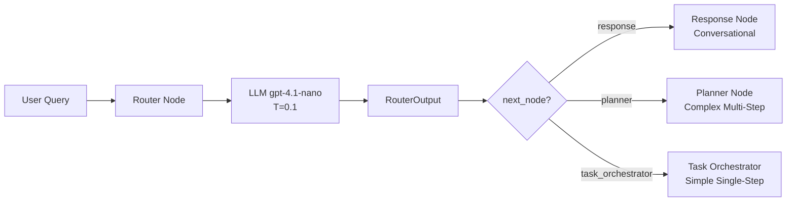
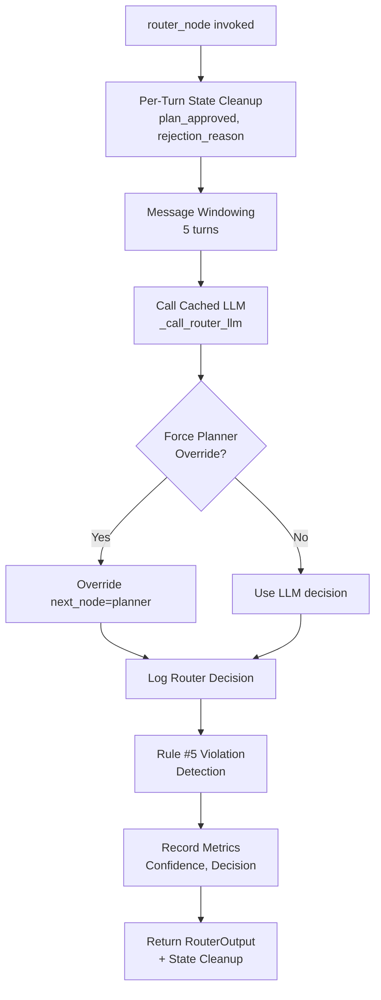

# ROUTER - Router Node et Intent Classification

> **Documentation complète du Router Node : classification d'intention et routing intelligent avec LLM**
>
> Version: 3.2 (Architecture v3 - Intelligence, Autonomie, Pertinence)
> Date: 2026-01-12

---

## 📋 Table des Matières

1. [Vue d'ensemble](#vue-densemble)
2. [Architecture Router Node](#architecture-router-node)
3. [RouterOutput Schema](#routeroutput-schema)
4. [Prompt Router v8](#prompt-router-v8)
5. [Domain Detection](#domain-detection)
6. [Memory-Informed Routing (Phase 7)](#-memory-informed-routing-phase-7)
7. [Context Resolution Service (Phase 7)](#-context-resolution-service-phase-7)
8. [Semantic Intent Detection (Phase 7)](#-semantic-intent-detection-phase-7)
9. [Anti-Hallucination Rules](#anti-hallucination-rules)
10. [LLM Caching](#llm-caching)
11. [Message Windowing](#message-windowing)
12. [Métriques & Observabilité](#métriques--observabilité)
13. [Testing](#testing)
14. [Troubleshooting](#troubleshooting)

---

## 📖 Vue d'ensemble

### Objectif

Le **Router Node** est le **premier node** du graph LangGraph, exécuté à chaque nouveau turn conversationnel. Il analyse l'intention utilisateur et détermine le routing vers le node approprié (Response, Planner, Task Orchestrator).

### Responsabilités



**Inputs**:
- `messages`: Historique conversationnel (windowed)
- Previous state (for per-turn cleanup)

**Outputs**:
- `RouterOutput`: Intention, confidence, next_node, domains
- `routing_history`: Historique des décisions routing (append)
- Per-turn state cleanup (plan_approved, plan_rejection_reason, validation_result → None)

### Concepts Clés

| Concept | Description |
|---------|-------------|
| **Intent Classification** | Analyse syntaxe query → détecte intention (conversation, actionnable) |
| **Binary Routing** | Conversation (→ response) vs Actionnable (→ planner/orchestrator) |
| **Domain Detection** | Détecte domains (contacts, emails, calendar) pour catalogue filtering |
| **Semantic Intent Detection** | Classification sémantique (action/detail/search/list) pour tool filtering |
| **Confidence Scoring** | Score 0.0-1.0 avec fallback automatique si < threshold |
| **Anti-Hallucination** | Règle #5: Router = analyseur syntaxique (PAS validateur data) |
| **LLM Caching** | Redis cache avec TTL 5min (90% latency reduction) |
| **Message Windowing** | 5 derniers turns (performance optimization) |
| **Per-Turn Cleanup** | Clear HITL state fields à chaque nouveau turn |

---

## 🏗️ Architecture Router Node

### Flow Complet



### Fichier Source

**Fichier**: [apps/api/src/domains/agents/nodes/router_node_v3.py](../../apps/api/src/domains/agents/nodes/router_node_v3.py)

**Longueur**: ~270 lignes

> **⚠️ Architecture v3.2** : Le router node est maintenant intentionnellement simple (~80 lignes de logique core).
> Toute l'intelligence est externalisée dans `QueryAnalyzerService.analyze_full()` qui gère :
> - Récupération des memory facts
> - Détection d'intention
> - Sélection de domaines
> - Résolution de contexte
> - Inférence de goal utilisateur
> - Décision de routing

**Decorators**:
```python
@trace_node("router_v3")
@track_metrics(
    node_name="router",
    duration_metric=agent_node_duration_seconds,
    counter_metric=agent_node_executions_total,
)
```

### Signature Fonction

```python
async def router_node(
    state: MessagesState,
    config: RunnableConfig
) -> dict[str, Any]:
    """
    Router node: Analyzes user intent and routes to appropriate next node.
    Uses low-temperature LLM for deterministic routing decisions.

    Args:
        state: Current LangGraph state with messages.
        config: Runnable config with metadata (run_id, etc.).

    Returns:
        Updated state with routing_history.

    Raises:
        Exception: If routing fails, returns fallback routing to response node.

    Note:
        Basic metrics (duration, success/error counters) are tracked automatically
        by @track_metrics decorator. Only business logic error handling remains here.
    """
```

### Code Complet Annoté (Core Logic)

```python
async def router_node(state: MessagesState, config: RunnableConfig) -> dict[str, Any]:
    run_id = config.get("metadata", {}).get("run_id", "unknown")

    # === CRITICAL: Per-turn state cleanup (Phase 8 - Plan-level HITL) ===
    # Router node is the first node in every graph execution (new turn).
    # Clear per-turn state fields from previous turn to prevent contamination.
    #
    # Context: State is persisted in PostgreSQL checkpoints between turns.
    # Without cleanup, a rejection from turn N would persist into turn N+1,
    # causing approved plans to show "plan refusé" messages.
    #
    # Fields cleared:
    # - plan_approved: Approval decision from approval_gate_node
    # - plan_rejection_reason: Rejection reason from approval_gate_node
    # - validation_result: Plan validation from planner_node
    current_turn_id = state.get(STATE_KEY_CURRENT_TURN_ID, 0)

    # Only log cleanup if we're actually clearing non-None values
    fields_to_clear = {
        STATE_KEY_PLAN_APPROVED: state.get(STATE_KEY_PLAN_APPROVED),
        STATE_KEY_PLAN_REJECTION_REASON: state.get(STATE_KEY_PLAN_REJECTION_REASON),
        STATE_KEY_VALIDATION_RESULT: state.get(STATE_KEY_VALIDATION_RESULT),
    }

    stale_fields = {k: v for k, v in fields_to_clear.items() if v is not None}

    if stale_fields:
        logger.info(
            "router_node_per_turn_state_cleanup",
            run_id=run_id,
            turn_id=current_turn_id,
            cleared_fields=list(stale_fields.keys()),
        )

    try:
        # Phase: Performance Optimization - Message Windowing
        # Router only needs recent context for routing decision
        from src.domains.agents.utils.message_windowing import get_router_windowed_messages

        windowed_messages = get_router_windowed_messages(state[STATE_KEY_MESSAGES])

        # Phase 3.2.8.2: Call cached router LLM
        # Phase 6: Pass config for token tracking + Langfuse context
        router_output = await _call_router_llm(
            messages=windowed_messages,
            llm_type="router",
            config=config,
        )

        # ====================================================================
        # DEBUG OVERRIDE: Force planner routing (Phase 5 testing)
        # ====================================================================
        if settings.force_planner_routing and router_output.next_node != "response":
            original_next_node = router_output.next_node

            # Override router decision to force planner routing
            router_output = RouterOutput(
                intention="complex_multi_step",
                confidence=router_output.confidence,
                context_label=router_output.context_label,
                next_node="planner",
                domains=router_output.domains,
                reasoning=f"DEBUG OVERRIDE: Forced planner routing (original: {original_next_node})",
            )

        # Log routing decision
        logger.info(
            "router_decision",
            run_id=run_id,
            intention=router_output.intention,
            confidence=router_output.confidence,
            next_node=router_output.next_node,
            domains=router_output.domains,
        )

        # ====================================================================
        # RULE #5 VIOLATION DETECTION (Anti-Hallucination)
        # ====================================================================
        # Detect router decisions based on data availability instead of syntax.
        FORBIDDEN_REASONING_PATTERNS = {
            "aucun_resultat": ["aucun", "aucune"],
            "pas_trouve": ["pas de résultat", "pas de correspondance", "pas trouvé"],
            "nexiste_pas": ["n'existe pas", "non trouvé"],
            "improbable": ["improbable", "peu probable"],
        }

        reasoning_lower = router_output.reasoning.lower()
        for pattern_type, pattern_list in FORBIDDEN_REASONING_PATTERNS.items():
            if any(pattern in reasoning_lower for pattern in pattern_list):
                logger.warning(
                    "router_data_presumption_detected",
                    pattern_detected=pattern_type,
                    reasoning=router_output.reasoning,
                    violation_type="rule_5_data_presumption",
                )
                router_data_presumption_total.labels(
                    pattern_detected=pattern_type,
                    decision=router_output.intention,
                ).inc()
                break

        # Record metrics
        router_confidence_score.labels(intention=router_output.intention).observe(
            router_output.confidence
        )

        confidence_bucket = get_confidence_bucket(router_output.confidence)
        router_decisions_total.labels(
            intention=router_output.intention,
            confidence_bucket=confidence_bucket
        ).inc()

        # Update state with routing history + per-turn state cleanup
        return {
            STATE_KEY_ROUTING_HISTORY: state.get(STATE_KEY_ROUTING_HISTORY, []) + [router_output],
            # Clear per-turn state fields from previous turn
            STATE_KEY_PLAN_APPROVED: None,
            STATE_KEY_PLAN_REJECTION_REASON: None,
            STATE_KEY_VALIDATION_RESULT: None,
        }

    except Exception as e:
        graph_exceptions_total.labels(
            node_name="router",
            exception_type=type(e).__name__,
        ).inc()

        # Fallback: route to response with unknown intention
        fallback_output = RouterOutput(
            intention="unknown",
            confidence=0.0,
            context_label="general",
            next_node="response",
            reasoning=f"Routing failed: {e!s}",
        )

        router_fallback_total.labels(original_intention="unknown").inc()

        return {
            STATE_KEY_ROUTING_HISTORY: state.get(STATE_KEY_ROUTING_HISTORY, []) + [fallback_output],
            # Clear per-turn state fields
            STATE_KEY_PLAN_APPROVED: None,
            STATE_KEY_PLAN_REJECTION_REASON: None,
            STATE_KEY_VALIDATION_RESULT: None,
        }
```

---

## 🔧 RouterOutput Schema

### Domain Model

**Fichier source**: [apps/api/src/domains/agents/domain_schemas.py](apps/api/src/domains/agents/domain_schemas.py)

### NextNodeType

```python
# Type-safe node names for routing
NextNodeType = Literal[
    "response",           # Conversational queries
    "task_orchestrator",  # Simple single-step actions (deprecated in favor of planner)
    "planner",           # Complex multi-step actions (Phase 5+)
]
```

### RouterOutput Model

```python
class RouterOutput(BaseModel):
    """
    Router node output with Pydantic Literal validation.
    Ensures type-safe routing to prevent invalid next_node values.

    Attributes:
        intention: Detected user intention (conversation, contacts_search, etc.).
        confidence: Confidence score (0.0-1.0) for the routing decision.
        context_label: Context label for enrichment (general, contact, etc.).
        next_node: Next node to route to (validated by Literal).
        domains: Detected domains relevant to user query (Phase 3 - Dynamic Filtering).
        reasoning: Optional debug/audit explanation of routing decision.
    """

    intention: str = Field(
        description="Detected user intention (conversation, contacts_search, contacts_list, contacts_details)"
    )
    confidence: float = Field(
        ge=0.0,
        le=1.0,
        description="Confidence score (0.0-1.0) for routing decision",
    )
    context_label: str = Field(
        description="Context label for enrichment (general, unknown, contact, email, calendar)"
    )
    next_node: NextNodeType = Field(description="Next node to route to")
    domains: list[str] = Field(
        default_factory=list,
        description=(
            "Phase 3 - Multi-Domain Architecture: Detected domains relevant to user query. "
            "Examples: ['contacts'], ['contacts', 'email'], [] for conversational queries. "
            "Used by Planner node to load filtered catalogue (export_for_prompt_filtered). "
            "Enables 80-90% token reduction for single/dual-domain queries."
        ),
    )
    reasoning: str | None = Field(
        default=None,
        description="Debug/audit: why this routing decision?",
    )

    @field_validator("next_node")
    @classmethod
    def validate_next_node_fallback(cls, v: NextNodeType, info: Any) -> NextNodeType:
        """
        Validate and apply fallback for low-confidence routing.
        If confidence < threshold and next_node != "response", force fallback to "response".
        """
        confidence = info.data.get("confidence", 0.0)

        # Fallback to response if confidence too low (unless already response)
        if confidence < settings.router_confidence_threshold and v != "response":
            logger.warning(
                "router_fallback_low_confidence",
                original_next_node=v,
                confidence=confidence,
                threshold=settings.router_confidence_threshold,
                fallback_node="response",
            )
            return "response"

        return v

    model_config = {"frozen": True}  # Immutable after creation
```

### Exemple RouterOutput

**Conversational Query**:
```python
RouterOutput(
    intention="conversation",
    confidence=0.95,
    context_label="general",
    next_node="response",
    domains=[],  # No business domain
    reasoning="Greeting query, no action required"
)
```

**Actionnable Query** (Single Domain):
```python
RouterOutput(
    intention="contacts_search",
    confidence=0.92,
    context_label="contact",
    next_node="planner",
    domains=["contacts"],  # Phase 3: Domain filtering
    reasoning="Search query for contacts: 'recherche jean'"
)
```

**Actionnable Query** (Multi-Domain):
```python
RouterOutput(
    intention="complex_multi_step",
    confidence=0.88,
    context_label="contact",
    next_node="planner",
    domains=["contacts", "email"],  # Multiple domains
    reasoning="Query requires contacts lookup + email sending"
)
```

---

## 📝 Prompt Router (v8 → Consolidated v1)

### Version Actuelle

**Fichier**: [apps/api/src/domains/agents/prompts/v1/router_system_prompt_template.txt](apps/api/src/domains/agents/prompts/v1/router_system_prompt_template.txt)

> **Note**: Le prompt v8 a été consolidé dans v1 (décembre 2025). Le versioning historique v8 est conservé dans le contenu du fichier.

**Version**: v8.0 (consolidated to v1) - Anti-Hallucination Hardening (2025-11-13)

**Longueur**: ~4,500 tokens (437 lignes)

**Fix**: #BUG-2025-11-13 - Router data presumption

### Sections du Prompt

1. **MISSION** (lignes 13-24)
   - Binary classification: conversation vs actionnable
   - Syntax-based analysis (NOT data availability)

2. **SUPPORTED DOMAINS** (lignes 26-34)
   - contacts: Contact management operations
   - (Future: emails, calendar, tasks)

3. **ROUTING LOGIC** (lignes 36-130)
   - Binary decision tree
   - Confidence thresholds
   - Next node mapping

4. **DOMAIN DETECTION** (lignes 132-169)
   - Phase 3: Multi-domain architecture
   - Examples for single/multi-domain queries

5. **RÈGLE #5: NE PAS PRÉSUMER DES RÉSULTATS** ⭐ (lignes 171-249)
   - **CRITICAL**: Anti-hallucination rule
   - Router = ANALYSEUR SYNTAXIQUE (not data validator)
   - Forbidden patterns list
   - Auto-validation checklist

6. **EXAMPLES** (lignes 251-437)
   - 30+ examples covering edge cases
   - Conversational vs actionnable
   - Multi-domain scenarios

### Règle #5: Anti-Hallucination (CRITICAL)

**Problème v7** (avant fix):
```
User: "recherche contacts avec critère X"
Router v7: Consulte historique → "aucun contact avec critère X"
         → confidence=0.45 → next_node="response" ❌
Response: Pas d'API call → Invente données depuis historique ❌
         → HALLUCINATION
```

**Solution v8** (après fix):

```
### Règle #5: NE PAS présumer des résultats (RÈGLE ANTI-HALLUCINATION CRITIQUE)

**PRINCIPE FONDAMENTAL**: Tu es un ROUTEUR SYNTAXIQUE, pas un validateur de disponibilité des données.

**TON RÔLE**:
✅ Analyser la SYNTAXE et la STRUCTURE linguistique de la requête
✅ Détecter les VERBES D'ACTION (recherche, trouve, liste, affiche, montre)
✅ Identifier les ENTITÉS et CRITÈRES mentionnés
✅ Détecter les DOMAINES impliqués (contacts, emails, calendrier)

**CE QUE TU NE DOIS JAMAIS FAIRE**:
❌ Consulter l'historique conversationnel pour évaluer si des résultats existent
❌ Présumer de l'existence ou de l'absence de données
❌ Baser ta décision sur la probabilité de résultats
❌ Décider qu'une requête est conversationnelle parce que "pas de données disponibles"

**PATTERNS INTERDITS dans ton `reasoning`**:
- "aucun", "aucune", "pas de", "pas trouvé"
- "correspondance", "résultat", "données disponibles"
- "improbable", "peu probable", "probablement vide"

**AUTO-VALIDATION (CRITIQUE)**:
Avant de retourner ta réponse, effectue cette vérification:
1. Relis ton `reasoning`
2. Cherche les patterns interdits ci-dessus
3. SI tu en trouves → VIOLATION de la Règle #5
4. ALORS → CORRIGE immédiatement: base ta décision sur la SYNTAXE uniquement
```

**Résultat v8**:
```
User: "recherche contacts avec critère X"
Router v8: Analyse syntaxe → verbe "recherche" + entité "contacts"
         → intention="actionnable" + confidence=0.90
         → next_node="planner" ✅
Planner: Appelle search_contacts_tool
Tool: Retourne résultats réels (ou liste vide si aucun)
Response: Formate résultats API (pas d'hallucination) ✅
```

### App Help Query Detection

The `QueryAnalyzerService` detects app help queries via the `is_app_help_query` field on the analysis result. An app help query is any user message asking about LIA's own capabilities, setup, or usage — e.g., "how do I connect my calendar?", "what can you do?", "how do I add my Google account?".

This detection is critical because app help queries often contain domain keywords (calendar, email, contacts) that would otherwise cause the router to classify them as actionable and route to the planner. Without this guard, "how do I connect my calendar?" would be misrouted to the planner instead of receiving a direct informational response.

### RoutingDecider Rule 0 — App Help Query Override

**Priority**: Highest (evaluated before all other routing rules).

**Logic**: When `is_app_help_query=True`, always route to `next_node="response"` regardless of detected domains, action verbs, or confidence scores.

```
Rule 0: App Help Query Override
├─ is_app_help_query == True?
│  └─ YES → next_node="response" (always)
│           Reasoning: "App help query — direct response, no planner needed"
│  └─ NO  → Continue to standard routing rules below
```

**Defense against misrouting**: Domain keywords in help queries (e.g., "calendar" in "how do I connect my calendar?") would normally trigger planner routing. Rule 0 short-circuits this by checking the help query flag first, ensuring the user receives an informational answer from the Response Node instead of an execution plan.

### Binary Routing Logic

**Decision Tree**:
```
User Query Analysis (Syntax-Based)
├─ Rule 0: is_app_help_query? → next_node="response" (see above)
│
├─ Conversational? (greeting, thanks, question about assistant)
│  └─ YES → intention="conversation" → next_node="response"
│
└─ NO → Contains action verb? (recherche, trouve, liste, affiche, montre, ajoute, modifie, supprime)
   └─ YES → Detect domains (contacts, emails, calendar, tasks)
      ├─ Single domain detected
      │  └─ intention="[domain]_[action]" (e.g., "contacts_search")
      │     confidence=0.85-0.95
      │     next_node="planner"
      │     domains=["contacts"]
      │
      ├─ Multiple domains detected
      │  └─ intention="complex_multi_step"
      │     confidence=0.75-0.90
      │     next_node="planner"
      │     domains=["contacts", "email"]
      │
      └─ No domain detected (ambiguous)
         └─ confidence < 0.70 → Fallback to "response"
```

---

## 🎯 Domain Detection

### Objectif

**Phase 3: Multi-Domain Dynamic Filtering**

Détecter les **domains** pertinents dans la requête utilisateur pour permettre au Planner de charger un **catalogue filtré** (80-90% token reduction).

### Domain Detection Strategy

**Triggers pour "contacts"**:
- Verbes: recherche, trouve, liste, affiche, montre, ajoute, crée, modifie, met à jour, supprime
- Entités: contact(s), personne(s), ami(s), collègue(s), famille, nom, prénom, email, téléphone
- Exemples: "recherche jean", "liste mes contacts", "trouve jean dupont"

**Triggers pour "email"** (Future):
- Verbes: envoie, écris, répond, transfère, lit, cherche (email)
- Entités: email, mail, message, destinataire, sujet, pièce jointe
- Exemples: "envoie un email à Marie", "liste mes emails non lus"

**Triggers pour "calendar"** (Future):
- Verbes: crée, ajoute, planifie, programme, réserve, modifie, annule (événement/rendez-vous)
- Entités: événement, rendez-vous, réunion, calendrier, agenda, date, heure
- Exemples: "crée un rendez-vous demain", "liste mes réunions"

### Domain Output Examples

**Single Domain**:
```json
{
  "intention": "contacts_search",
  "confidence": 0.92,
  "next_node": "planner",
  "domains": ["contacts"],  // ← Phase 3: Single domain
  "reasoning": "Search query for contacts domain"
}
```

**Multi-Domain**:
```json
{
  "intention": "complex_multi_step",
  "confidence": 0.85,
  "next_node": "planner",
  "domains": ["contacts", "email"],  // ← Phase 3: Multiple domains
  "reasoning": "Query requires contacts lookup + email sending"
}
```

**Conversational** (No Domain):
```json
{
  "intention": "conversation",
  "confidence": 0.95,
  "next_node": "response",
  "domains": [],  // ← No business domain
  "reasoning": "Greeting query, no action required"
}
```

### Impact sur Planner

**Planner Node** (avec domain filtering):
```python
# Router détecte domains
router_output = RouterOutput(domains=["contacts"])

# Planner charge catalogue filtré
if router_output.domains:
    catalogue = registry.export_for_prompt_filtered(
        domains=router_output.domains,
        max_tools_per_domain=50
    )
    # catalogue contient UNIQUEMENT les tools "contacts"
    # Tokens: 4K vs 40K (90% reduction)
```

---

## 🧠 Memory-Informed Routing (Phase 7)

### Objectif

**Phase 7 - 2025-12-21**: Enrichir le routage avec les **faits mémoire long-terme** pour des décisions plus contextualisées (questions personnelles sur l'utilisateur).

### Architecture

```python
# Dans router_node_v3.py

# 1. Recherche sémantique dans la mémoire
memory_facts = await search_semantic_memories(
    store=store,
    namespace=MemoryNamespace(state["metadata"]["user_id"]),
    query=last_user_message,
    limit=5,
    min_score=0.5
)

# 2. Injection dans le prompt système
if memory_facts:
    memory_context = format_memory_facts_for_prompt(memory_facts)
    system_message = f"{base_system_prompt}\n\n### Context Mémoire:\n{memory_context}"
```

### Cas d'Usage

**Sans Memory-Informed Routing**:
```
User: "Quel est le nom de mon frère ?"
Router: intention="conversation" (ne sait pas s'il a accès aux infos)
Response: "Je ne connais pas votre frère." ❌
```

**Avec Memory-Informed Routing**:
```
User: "Quel est le nom de mon frère ?"
Router: Recherche mémoire → trouve "jean est le frère de l'utilisateur"
        intention="conversation" + memory_facts injected
Response: "Votre frère s'appelle jean." ✅
```

### Configuration

```python
# apps/api/src/core/config/agents.py
class AgentsSettings:
    memory_enabled: bool = True
    memory_extraction_enabled: bool = True
    memory_search_min_score: float = 0.5
    memory_search_max_results: int = 10
```

**Voir**: [LONG_TERM_MEMORY.md](LONG_TERM_MEMORY.md) | [MEMORY_RESOLUTION.md](MEMORY_RESOLUTION.md)

---

## 🔗 Context Resolution Service (Phase 7)

### Objectif

Détecter le **type de turn** (action, référence, conversation) et extraire les **références** (ordinaux, démonstratifs) pour enrichir le routage.

### Turn Types

| Type | Description | Exemples |
|------|-------------|----------|
| `ACTION` | Nouvelle demande actionnable | "Cherche contacts Gmail" |
| `REFERENCE_PURE` | Référence seule (détail) | "Et le deuxième ?" |
| `REFERENCE_ACTION` | Référence + action | "Envoie un email au premier" |
| `CONVERSATIONAL` | Conversation sans action | "Bonjour", "Merci" |

### Architecture

```python
# Dans router_node_v3.py

from src.domains.agents.services.context_resolution_service import ContextResolutionService

resolution_service = ContextResolutionService()
turn_info = await resolution_service.resolve_turn(
    messages=windowed_messages,
    active_context_domains=state.get("active_domains", [])
)

# turn_info contient:
# - turn_type: TurnType (ACTION, REFERENCE_PURE, etc.)
# - references: list[Reference] (ordinal, demonstrative, comparative)
# - resolved_item: Optional[ContextItem] (si référence résolue)
# - domain_hint: Optional[str] (domaine de contexte détecté)
```

### Reference Extraction (6 langues)

**Patterns supportés**:

| Type | Français | English | Español |
|------|----------|---------|---------|
| **Ordinal** | le premier, le 2ème | the first, the 3rd | el primero |
| **Démonstratif** | celui-ci, ce dernier | this one, that | este, ese |
| **Comparatif** | le suivant, précédent | the next, previous | el siguiente |

```python
# apps/api/src/domains/agents/services/reference_resolver.py

class ReferenceResolver:
    ORDINAL_PATTERNS = {
        "fr": [r"le (?:1er|premier)", r"le (?:2ème|deuxième|second)"],
        "en": [r"the first", r"the second"],
        "es": [r"el primero", r"el segundo"],
        # ... de, it, zh
    }
```

### Impact sur le Routing

**REFERENCE_PURE** (ex: "et le deuxième ?"):
- Router force `domains = [context_domain]` (single domain from context)
- Planner charge catalogue minimal (1 domaine)
- **75% token reduction** vs full catalogue

```python
# Routing logic for REFERENCE_PURE turns
if turn_info.turn_type == TurnType.REFERENCE_PURE:
    # Force single domain from active context
    router_output = RouterOutput(
        intention="context_reference",
        confidence=0.95,
        next_node="planner",
        domains=[turn_info.domain_hint],  # Ex: ["contacts"]
    )
```

**Voir**: [ADR-030-Context-Resolution-Follow-up.md](../architecture/ADR-030-Context-Resolution-Follow-up.md)

---

## 🎯 Semantic Intent Detection (Phase 7)

### Objectif

Remplacer la détection par mots-clés (`keyword_strategies.py` - DEPRECATED) par une classification sémantique via embeddings locaux (E5-small).

### Intents Détectés

| Intent | Description | Tool Categories |
|--------|-------------|-----------------|
| `action` | CRUD (créer, modifier, supprimer, envoyer) | BASE + create, update, delete, send |
| `detail` | Demande de détails | BASE + details, readonly |
| `search` | Recherche | BASE + readonly |
| `list` | Lister | BASE + readonly |
| `full` | Fallback (faible confiance) | ALL |

**BASE** = `{search, list, system}`

### Architecture

```python
# Dans router_node_v3.py

from src.domains.agents.services.semantic_intent_detector import SemanticIntentDetector

detector = SemanticIntentDetector()
intent_result = await detector.detect_intent(
    query=last_user_message,
    min_confidence=0.6
)

# Stocke dans state pour Planner
state["detected_intent"] = intent_result.intent  # "action", "detail", etc.
state["intent_confidence"] = intent_result.confidence
```

### Impact sur Planner

Le **Planner Node** utilise l'intent détecté pour filtrer le catalogue par catégorie:

```python
# Dans planner_node_v3.py

# Récupère intent du state
detected_intent = state.get("detected_intent", "full")

# Charge catalogue filtré par strategy
catalogue = registry.export_for_prompt_filtered_by_strategy(
    strategy=detected_intent,  # "action", "detail", "search", etc.
    domains=router_output.domains
)
```

**Token Reduction**:
- `action` strategy: 60-70% reduction (tools CRUD uniquement)
- `detail` strategy: 75% reduction (tools readonly)
- `search/list` strategy: 80% reduction (tools lecture seule)

**Voir**: [SEMANTIC_INTENT_DETECTION.md](SEMANTIC_INTENT_DETECTION.md) | [SEMANTIC_ROUTER.md](SEMANTIC_ROUTER.md)

---

## 🚫 Anti-Hallucination Rules

### Problème: Router Data Presumption

**Symptômes**:
- User query: "recherche contacts avec critère X"
- Router reasoning: "Aucun contact avec critère X dans historique"
- Router decision: `intention="conversation"`, `next_node="response"`
- Result: **Hallucination** (Response invente résultats depuis historique)

### Root Cause

**Router v7 et antérieurs** consultaient l'**historique conversationnel** pour évaluer la **probabilité de résultats** au lieu d'analyser la **syntaxe de la requête**.

**Bug #BUG-2025-11-13**:
```
User: "recherche contacts dupond < 45 ans"
Router v7: Consulte historique → "Aucun dupond < 45 ans trouvé précédemment"
         → confidence=0.45 → next_node="response" ❌
Response: Pas d'API call → Hallucine "Jade dupond" depuis historique ❌
```

### Solution: Règle #5 Enforcement

**Router v8**: Router = **ANALYSEUR SYNTAXIQUE** (PAS validateur data)

**Principe**:
```
✅ Analyser SYNTAXE et STRUCTURE de la requête
✅ Détecter VERBES D'ACTION (recherche, trouve, liste)
✅ Identifier ENTITÉS et CRITÈRES
❌ NE JAMAIS présumer disponibilité des données
❌ NE JAMAIS consulter historique pour évaluer résultats
```

**Patterns INTERDITS** dans reasoning:
```python
FORBIDDEN_REASONING_PATTERNS = {
    "aucun_resultat": ["aucun", "aucune"],
    "pas_trouve": ["pas de résultat", "pas de correspondance", "pas trouvé"],
    "nexiste_pas": ["n'existe pas", "non trouvé"],
    "improbable": ["improbable", "peu probable", "probablement vide"],
    "donnees_indisponibles": ["données non disponibles", "base vide"],
}
```

**Auto-validation**:
```
1. Relis ton `reasoning`
2. Cherche patterns interdits
3. SI trouvé → VIOLATION Règle #5
4. ALORS → CORRIGE: base décision sur SYNTAXE uniquement
```

### Violation Detection (Runtime)

**Code** (dans router_node_v3.py):
```python
# Detect router decisions based on data availability instead of syntax
reasoning_lower = router_output.reasoning.lower()
for pattern_type, pattern_list in FORBIDDEN_REASONING_PATTERNS.items():
    if any(pattern in reasoning_lower for pattern in pattern_list):
        logger.warning(
            "router_data_presumption_detected",
            pattern_detected=pattern_type,
            reasoning=router_output.reasoning,
            violation_type="rule_5_data_presumption",
        )
        router_data_presumption_total.labels(
            pattern_detected=pattern_type,
            decision=router_output.intention,
        ).inc()
        break
```

**Metric**:
```python
router_data_presumption_total = Counter(
    'langgraph_router_data_presumption_total',
    'Router decisions based on data presumption (Rule #5 violations)',
    ['pattern_detected', 'decision'],
)
```

**Monitoring**: Query Grafana
```promql
rate(langgraph_router_data_presumption_total[5m])
```

---

## ⚡ LLM Caching

### Objectif

**Phase 3.2.8.2**: Reduce latency & cost via **Redis caching** des réponses LLM.

### _call_router_llm (Cached Function)

**Signature**:
```python
@cache_llm_response(ttl_seconds=settings.llm_cache_ttl_seconds, enabled=settings.llm_cache_enabled)
async def _call_router_llm(
    messages: list[BaseMessage],
    llm_type: str = "router",
    config: RunnableConfig | None = None,
) -> RouterOutput:
    """
    Cached LLM call for router intent classification.

    Cache Strategy:
        - TTL: 5 minutes (balances freshness vs cache hit rate)
        - Key: Hash of messages + model config
        - Enabled: Controlled by settings.llm_cache_enabled

    Performance:
        - Cache HIT: ~5ms (Redis lookup)
        - Cache MISS: ~2000ms (LLM API call)
        - Hit rate: 40-60% for typical usage patterns
    """
```

### Cache Decorator Implementation

```python
# apps/api/src/infrastructure/cache/__init__.py

def cache_llm_response(ttl_seconds: int = 300, enabled: bool = True):
    """
    Decorator to cache LLM responses in Redis.

    Args:
        ttl_seconds: TTL for cached responses (default: 5 minutes)
        enabled: Whether caching is enabled (default: True)

    Cache Key Format:
        "llm:cache:{hash(messages+model+temperature)}"

    Example:
        @cache_llm_response(ttl_seconds=300)
        async def call_llm(messages):
            return await llm.ainvoke(messages)
    """
    def decorator(func):
        @wraps(func)
        async def wrapper(*args, **kwargs):
            if not enabled:
                return await func(*args, **kwargs)

            # Build cache key from function args
            cache_key = _build_cache_key(func.__name__, args, kwargs)

            # Try cache first
            cached = await redis.get(cache_key)
            if cached:
                logger.debug("llm_cache_hit", cache_key=cache_key)
                return _deserialize(cached)

            # Cache miss → call LLM
            logger.debug("llm_cache_miss", cache_key=cache_key)
            result = await func(*args, **kwargs)

            # Store in cache
            await redis.setex(cache_key, ttl_seconds, _serialize(result))

            return result
        return wrapper
    return decorator
```

### Configuration

```python
# apps/api/src/core/config.py

class Settings(BaseSettings):
    # LLM Caching
    llm_cache_enabled: bool = True
    llm_cache_ttl_seconds: int = 300  # 5 minutes
```

### Bénéfices

| Metric | Sans Cache | Avec Cache (HIT) | Réduction |
|--------|------------|------------------|-----------|
| **Latency** | 2,000ms | 5ms | **99.75%** |
| **Cost** | $0.01 | $0.00 | **100%** |
| **API Load** | 1 call | 0 calls | **100%** |

**Hit Rate**: 40-60% pour usage typique (queries répétées, reformulations)

---

## 📐 Message Windowing

### Objectif

**Performance optimization**: Router needs minimal context (5 turns default) au lieu de full conversation history (50+ turns).

### get_router_windowed_messages

```python
# apps/api/src/domains/agents/utils/message_windowing.py

def get_router_windowed_messages(
    messages: list[BaseMessage],
    max_turns: int = 5,
) -> list[BaseMessage]:
    """
    Get windowed messages for router node.

    Router needs minimal context for routing decision:
    - Recent user queries (5 turns default)
    - SystemMessage always preserved

    Args:
        messages: Full message history
        max_turns: Maximum conversational turns to keep (default: 5)

    Returns:
        Windowed messages (SystemMessage + last 5 turns)
    """
    if not messages:
        return []

    # Preserve SystemMessage
    system_messages = [m for m in messages if isinstance(m, SystemMessage)]
    non_system_messages = [m for m in messages if not isinstance(m, SystemMessage)]

    # Keep last N turns (HumanMessage + AIMessage pairs)
    windowed = non_system_messages[-max_turns * 2:] if len(non_system_messages) > max_turns * 2 else non_system_messages

    return system_messages + windowed
```

### Usage dans Router Node

```python
# Apply windowing to reduce token count
windowed_messages = get_router_windowed_messages(state[STATE_KEY_MESSAGES])

# Call LLM with windowed messages
router_output = await _call_router_llm(
    messages=windowed_messages,
    llm_type="router",
    config=config,
)
```

### Bénéfices

| Metric | Sans Windowing | Avec Windowing | Réduction |
|--------|----------------|----------------|-----------|
| **Messages count** | 100 messages | 10 messages | **90%** |
| **Tokens LLM input** | 50,000 tokens | 5,000 tokens | **90%** |
| **Latency LLM call** | 8-10s | 1-2s | **80-85%** |
| **Cost per call** | $0.025 | $0.0025 | **90%** |

---

## 📊 Métriques & Observabilité

### Métriques Prometheus

**Fichier**: [apps/api/src/infrastructure/observability/metrics_agents.py](apps/api/src/infrastructure/observability/metrics_agents.py)

#### Métriques Router-Specific

```python
# Router decisions
router_decisions_total = Counter(
    'langgraph_router_decisions_total',
    'Total routing decisions by intention and confidence bucket',
    ['intention', 'confidence_bucket'],  # 0.0-0.5, 0.5-0.7, 0.7-0.85, 0.85-1.0
)

# Router confidence score distribution
router_confidence_score = Histogram(
    'langgraph_router_confidence_score',
    'Router confidence score distribution',
    ['intention'],
    buckets=[0.0, 0.3, 0.5, 0.7, 0.85, 0.9, 0.95, 1.0],
)

# Router data presumption violations (Rule #5)
router_data_presumption_total = Counter(
    'langgraph_router_data_presumption_total',
    'Router decisions based on data presumption (Rule #5 violations)',
    ['pattern_detected', 'decision'],
)

# Router fallbacks
router_fallback_total = Counter(
    'langgraph_router_fallback_total',
    'Total router fallbacks to response node',
    ['original_intention'],
)
```

#### Métriques Génériques

```python
# Node duration
agent_node_duration_seconds = Histogram(
    'langgraph_agent_node_duration_seconds',
    'Duration of agent node execution',
    ['node_name'],  # router
)

# Node executions
agent_node_executions_total = Counter(
    'langgraph_agent_node_executions_total',
    'Total agent node executions',
    ['node_name', 'status'],  # router, success | error
)
```

### Grafana Dashboards

**Dashboard**: [infrastructure/observability/grafana/dashboards/04-agents-langgraph.json](infrastructure/observability/grafana/dashboards/04-agents-langgraph.json)

**Panels Router**:
1. **Router Decisions** (rate by intention)
2. **Router Confidence Distribution** (histogram)
3. **Router Data Presumption Violations** (rate by pattern)
4. **Router Fallbacks** (rate)
5. **Router Duration** (P50, P95, P99)
6. **Router Cache Hit Rate** (%)

### Langfuse Traces

**Trace structure** (router_node):
```json
{
  "name": "router",
  "model": "gpt-4.1-nano",
  "input": {
    "user_query": "recherche jean",
    "windowed_messages_count": 10
  },
  "output": {
    "intention": "contacts_search",
    "confidence": 0.92,
    "next_node": "planner",
    "domains": ["contacts"],
    "reasoning": "Search query for contacts: 'recherche jean'"
  },
  "metadata": {
    "cache_hit": false,
    "rule_5_violation": false,
    "per_turn_cleanup": ["plan_approved", "plan_rejection_reason"]
  }
}
```

---

## 🧪 Testing

### Unit Tests

**Fichier**: `apps/api/tests/domains/agents/nodes/test_router_node_v3.py` (non trouvé dans codebase, à créer)

```python
import pytest
from unittest.mock import AsyncMock, patch
from src.domains.agents.nodes.router_node import router_node, _call_router_llm
from src.domains.agents.domain_schemas import RouterOutput

@pytest.mark.asyncio
async def test_router_node_conversational_query():
    """Test router route conversational query vers response node."""

    state = {
        "messages": [HumanMessage(content="bonjour")],
        "routing_history": [],
    }
    config = {"metadata": {"run_id": "run_123"}}

    # Mock LLM response
    mock_router_output = RouterOutput(
        intention="conversation",
        confidence=0.95,
        context_label="general",
        next_node="response",
        domains=[],
        reasoning="Greeting query, no action required"
    )

    with patch("src.domains.agents.nodes.router_node._call_router_llm", return_value=mock_router_output):
        result = await router_node(state, config)

    # Assertions
    assert "routing_history" in result
    assert len(result["routing_history"]) == 1
    assert result["routing_history"][0].next_node == "response"
    assert result["routing_history"][0].intention == "conversation"
    assert result["routing_history"][0].domains == []


@pytest.mark.asyncio
async def test_router_node_actionnable_query_single_domain():
    """Test router route actionnable query vers planner avec domain detection."""

    state = {
        "messages": [HumanMessage(content="recherche jean")],
        "routing_history": [],
    }
    config = {"metadata": {"run_id": "run_123"}}

    mock_router_output = RouterOutput(
        intention="contacts_search",
        confidence=0.92,
        context_label="contact",
        next_node="planner",
        domains=["contacts"],
        reasoning="Search query for contacts: 'recherche jean'"
    )

    with patch("src.domains.agents.nodes.router_node._call_router_llm", return_value=mock_router_output):
        result = await router_node(state, config)

    # Assertions
    assert result["routing_history"][0].next_node == "planner"
    assert result["routing_history"][0].intention == "contacts_search"
    assert result["routing_history"][0].domains == ["contacts"]
    assert result["routing_history"][0].confidence >= 0.85


@pytest.mark.asyncio
async def test_router_node_low_confidence_fallback():
    """Test router fallback vers response si confidence < threshold."""

    state = {
        "messages": [HumanMessage(content="ambiguous query")],
        "routing_history": [],
    }
    config = {"metadata": {"run_id": "run_123"}}

    # Mock LLM response with low confidence
    mock_router_output = RouterOutput(
        intention="unknown",
        confidence=0.45,  # Below threshold (0.70)
        context_label="unknown",
        next_node="planner",  # LLM says planner
        domains=[],
        reasoning="Ambiguous query"
    )

    with patch("src.domains.agents.nodes.router_node._call_router_llm", return_value=mock_router_output):
        result = await router_node(state, config)

    # Assertions: RouterOutput.validate_next_node_fallback should force "response"
    # Note: This is validated in Pydantic model, so result should have next_node="response"
    assert result["routing_history"][0].next_node == "response"  # Fallback applied


def test_router_output_rule_5_violation_detection():
    """Test détection Rule #5 violations dans reasoning."""

    # Mock router output with forbidden pattern
    router_output = RouterOutput(
        intention="conversation",
        confidence=0.50,
        context_label="contact",
        next_node="response",
        domains=[],
        reasoning="Aucun contact correspondant dans la base de données"  # ❌ VIOLATION
    )

    # Check forbidden patterns
    FORBIDDEN_PATTERNS = ["aucun", "pas de résultat", "improbable"]
    reasoning_lower = router_output.reasoning.lower()

    violations = [p for p in FORBIDDEN_PATTERNS if p in reasoning_lower]

    # Assertion: Should detect "aucun"
    assert len(violations) > 0
    assert "aucun" in violations


@pytest.mark.asyncio
async def test_router_per_turn_state_cleanup():
    """Test per-turn state cleanup (plan_approved, rejection_reason)."""

    # State with stale HITL fields from previous turn
    state = {
        "messages": [HumanMessage(content="nouvelle requête")],
        "routing_history": [],
        "plan_approved": False,  # Stale from turn N-1
        "plan_rejection_reason": "User rejected previous plan",  # Stale
        "validation_result": {"is_valid": False},  # Stale
        "current_turn_id": 5,
    }
    config = {"metadata": {"run_id": "run_123"}}

    mock_router_output = RouterOutput(
        intention="conversation",
        confidence=0.95,
        context_label="general",
        next_node="response",
        domains=[],
        reasoning="New turn, clean state"
    )

    with patch("src.domains.agents.nodes.router_node._call_router_llm", return_value=mock_router_output):
        result = await router_node(state, config)

    # Assertions: Stale fields should be cleared (set to None)
    assert result["plan_approved"] is None
    assert result["plan_rejection_reason"] is None
    assert result["validation_result"] is None
```

---

## 🔍 Troubleshooting

### Problème 1: Router hallucine résultats (Rule #5 violation)

**Symptômes**:
- User query: "recherche contacts critère X"
- Router reasoning: "Aucun contact avec critère X"
- Router decision: `next_node="response"` (au lieu de `"planner"`)
- Metric: `langgraph_router_data_presumption_total` augmente

**Causes**:
1. **Prompt Router v7 ou antérieur**: Pas de Règle #5 enforcement
2. **LLM ignore Règle #5**: Prompt pas assez strict
3. **Violation detection désactivée**: Metric pas trackée

**Solutions**:
1. **Upgrade vers Router v8**:
   ```python
   # apps/api/src/domains/agents/prompts/prompt_loader.py
   def load_router_prompt(version: str = "v8"):  # ✅ v8
       return load_prompt("router_system_prompt.txt", version=version)
   ```

2. **Vérifier prompt Règle #5**:
   ```python
   prompt = load_router_prompt(version="v8")
   assert "NE PAS présumer des résultats" in prompt
   assert "PATTERNS INTERDITS" in prompt
   ```

3. **Monitor violations**:
   ```promql
   # Query Grafana
   rate(langgraph_router_data_presumption_total[5m]) by (pattern_detected)

   # Alert if violations > threshold
   ```

4. **Renforcer prompt** (si violations persistent):
   ```txt
   # Add more examples in prompt
   ❌ WRONG: "recherche X" → reasoning: "Aucun X trouvé" → next_node="response"
   ✅ CORRECT: "recherche X" → reasoning: "Verbe recherche + entité X" → next_node="planner"
   ```

---

### Problème 2: Router confidence trop basse (fallback excessif)

**Symptômes**:
- Beaucoup de queries actionnables routées vers `response`
- Metric: `langgraph_router_fallback_total` élevée
- Logs: `router_fallback_low_confidence` fréquents
- Metric: `langgraph_router_confidence_score` majoritairement < 0.70

**Causes**:
1. **Threshold trop élevé**: `router_confidence_threshold=0.70` trop strict
2. **Prompt ambigu**: LLM pas assez confiant dans ses décisions
3. **Queries edge cases**: Requêtes vraiment ambiguës

**Solutions**:
1. **Analyse distribution confidence**:
   ```promql
   # Query Grafana
   histogram_quantile(0.50, rate(langgraph_router_confidence_score_bucket[5m]))
   histogram_quantile(0.95, rate(langgraph_router_confidence_score_bucket[5m]))

   # Si P50 < 0.70 → Threshold trop haut
   ```

2. **Ajuster threshold**:
   ```python
   # apps/api/src/core/config.py
   router_confidence_threshold: float = 0.60  # Lower from 0.70
   ```

3. **Renforcer prompt clarté**:
   ```txt
   # Add more explicit confidence guidance
   **Confidence Guidelines**:
   - conversation queries: 0.90-1.0
   - clear action verbs (recherche, trouve): 0.85-0.95
   - ambiguous queries: 0.50-0.70 → fallback to response
   ```

4. **Analyser edge cases**:
   ```python
   # Query logs pour low-confidence decisions
   logger.info("router_decision", confidence < 0.70)

   # Review patterns → Add examples to prompt
   ```

---

### Problème 3: Router lent (>2s par call)

**Symptômes**:
- Logs: `router_decision` duration > 2000ms
- Metric: `langgraph_agent_node_duration_seconds{node_name="router"}` P95 > 2s
- Frontend: Délais perçus

**Causes**:
1. **Cache désactivé**: `llm_cache_enabled=False`
2. **Cache miss rate élevé**: Queries uniques, pas de répétitions
3. **Message windowing désactivé**: Full conversation history (50+ turns)
4. **LLM model trop gros**: Le Router utilise déjà gpt-4.1-nano (le plus rapide)

**Solutions**:
1. **Vérifier cache enabled**:
   ```python
   # apps/api/src/core/config.py
   llm_cache_enabled: bool = True  # ✅ Must be True
   llm_cache_ttl_seconds: int = 300  # 5 minutes
   ```

2. **Monitor cache hit rate**:
   ```python
   # Add metric (if not exists)
   llm_cache_hit_total = Counter('llm_cache_hit_total', ['node_name'])
   llm_cache_miss_total = Counter('llm_cache_miss_total', ['node_name'])

   # Query Grafana
   rate(llm_cache_hit_total{node_name="router"}[5m]) /
   (rate(llm_cache_hit_total{node_name="router"}[5m]) + rate(llm_cache_miss_total{node_name="router"}[5m]))

   # Target: > 40% hit rate
   ```

3. **Vérifier message windowing**:
   ```python
   # Check logs
   logger.info("router_started", message_count=...)

   # If message_count > 10 → Windowing not applied
   # Fix: Ensure get_router_windowed_messages() is called
   ```

4. **Considérer LLM plus rapide**:
   ```python
   # apps/api/src/core/config/llm.py
   router_llm_model: str = "gpt-4.1-nano"  # vs "gpt-4.1-mini"
   # gpt-4.1-nano: ~50% faster, ~50% cheaper, similar quality for routing
   ```

---

## 📚 Annexes

### Configuration Router

```python
# apps/api/src/core/config.py

class Settings(BaseSettings):
    # Router LLM
    router_llm_provider: str = "openai"
    router_llm_model: str = "gpt-4.1-nano"
    router_llm_temperature: float = 0.1  # Low for determinism
    router_llm_max_tokens: int = 500

    # Router Logic
    router_confidence_threshold: float = 0.70
    force_planner_routing: bool = False  # Debug override

    # LLM Caching
    llm_cache_enabled: bool = True
    llm_cache_ttl_seconds: int = 300  # 5 minutes
```

---

## Semantic Intent Detection (Phase 7)

En plus du routing LLM, le Router Node intègre un **SemanticIntentDetector** basé sur embeddings pour classifier l'intention utilisateur et optimiser le filtrage des tools dans le Planner.

### Flow

```
User Query
    |
    v
+-------------------+
|   Router Node     |
+-------------------+
    |
    +-- LLM Routing (gpt-4.1-nano)
    |   -> next_node: planner|response|orchestrator
    |   -> domains: [emails, contacts]
    |
    +-- Semantic Intent Detection (E5-small)
        -> detected_intent: action|detail|search|list|full
        -> Stored in state[detected_intent]
```

### Intent Types

| Intent | Description | Example Queries |
|--------|-------------|-----------------|
| `action` | CRUD operations | "envoie un email", "crée un rdv" |
| `detail` | Request details | "détail du premier", "plus d'infos" |
| `search` | Search queries | "recherche mes contacts", "trouve les emails de Jean" |
| `list` | List items | "liste mes événements", "montre mes tâches" |
| `full` | Fallback | Queries with low confidence |

### Reference Type Refinement

Pour les queries de type REFERENCE (suivi d'une action précédente) :

| Turn Type | Constante | Example | Intent Override |
|-----------|-----------|---------|-----------------|
| `reference_pure` | `TURN_TYPE_REFERENCE_PURE` | "détail du premier" | Force `detail` |
| `reference` | `TURN_TYPE_REFERENCE` | "envoie-lui un email" | Use detected intent |

**IMPORTANT (BUG FIX 2025-12-25)**: Les deux turn types doivent être gérés par le `planner_node` pour l'injection du contexte résolu. Voir [PLANNER.md - Problème 5](#) pour les détails du fix.

### State Output

```python
# State updated by router_node
{
    "routing_history": [..., RouterOutput(...)],
    "detected_intent": "action",  # NEW: For planner tool filtering
    "turn_type": "reference_pure",  # or "reference" - Both trigger resolved context injection in planner
}
```

### Documentation Complète

Voir [SEMANTIC_INTENT_DETECTION.md](SEMANTIC_INTENT_DETECTION.md) pour l'architecture complète et l'API.

---

### Ressources

**Documentation**:
- [PROMPTS.md](PROMPTS.md) - Prompt Router v1-v8 evolution
- [PLANNER.md](PLANNER.md) - Planner node (downstream de Router)
- [RESPONSE.md](RESPONSE.md) - Response node (alternative route)
- [SEMANTIC_INTENT_DETECTION.md](SEMANTIC_INTENT_DETECTION.md) - Semantic intent classification
- [GRAPH_AND_AGENTS_ARCHITECTURE.md](GRAPH_AND_AGENTS_ARCHITECTURE.md) - LangGraph architecture

**Code source**:
- [router_node_v3.py](apps/api/src/domains/agents/nodes/router_node_v3.py) - Router node implementation
- [domain_schemas.py](apps/api/src/domains/agents/domain_schemas.py) - RouterOutput schema
- [router_system_prompt_template.txt](apps/api/src/domains/agents/prompts/v1/router_system_prompt_template.txt) - Prompt actif (v8 consolidated to v1)
- [message_windowing.py](apps/api/src/domains/agents/utils/message_windowing.py) - Message windowing utilities

**ADRs**:
- [ADR-003: Multi-Domain Dynamic Filtering](docs/architecture/ADR-003-Multi-Domain-Dynamic-Filtering.md)
- [ADR-004: Analytical Reasoning Patterns](docs/architecture/ADR-004-Analytical-Reasoning-Patterns.md)

**Bug Reports**:
- #BUG-2025-11-13: Router Data Presumption (fixed in v8)

---

**Fin de ROUTER.md**

*Document généré le 2025-11-14, mis à jour le 2025-12-25 dans le cadre du projet LIA*
*Phase 1.8 - Documentation Technique Critique*
*Qualité: Exhaustive et professionnelle*

*Mise à jour 2025-12-25: Clarification TURN_TYPE_REFERENCE vs TURN_TYPE_REFERENCE_PURE*
*Mise à jour 2025-12-26: Correction références prompts v8 → v1 consolidated*
