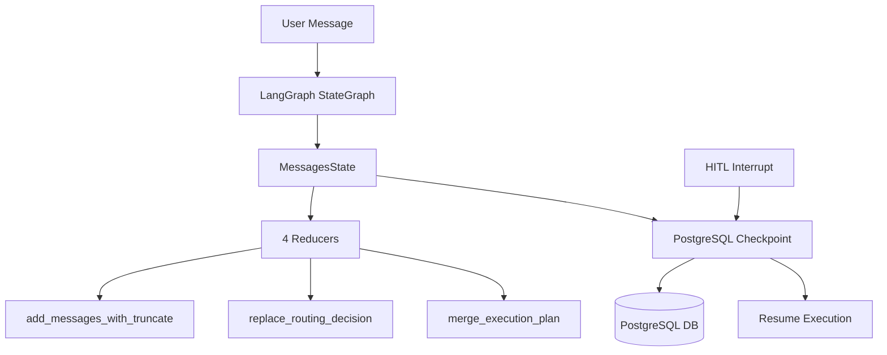

# STATE_AND_CHECKPOINT - State Management & Checkpointing

> **Documentation complète du state management LangGraph avec PostgreSQL checkpointing**
>
> Version: 1.2
> Date: 2026-02-27
> Auteur: Documentation LIA

---

## 📋 Table des Matières

1. [Vue d'ensemble](#vue-densemble)
2. [MessagesState - Structure Complète](#messagesstate---structure-complète)
3. [Les Reducers](#les-reducers)
4. [PostgreSQL Checkpointing](#postgresql-checkpointing)
5. [Checkpoint Lifecycle](#checkpoint-lifecycle)
6. [HITL Integration](#hitl-integration)
7. [State Migration](#state-migration)
8. [State Validation](#state-validation)
9. [Patterns Avancés](#patterns-avancés)
10. [Métriques & Observabilité](#métriques--observabilité)
11. [Troubleshooting](#troubleshooting)
12. [Annexes](#annexes)

---

## 📖 Vue d'ensemble

### Objectif

Le state management dans LIA repose sur **LangGraph 1.0.10** avec un schema `MessagesState` personnalise et un systeme de **PostgreSQL checkpointing** pour la persistence.

Ce système permet:
- **Conversations multi-tours** avec historique persistant
- **HITL (Human-in-the-Loop)** avec interruption/reprise
- **Truncation intelligente** des messages (93% réduction tokens)
- **Migration de schéma** pour évolution forward-compatible
- **State validation** pour détecter corruption précoce

### Architecture Globale



### Concepts Clés

**MessagesState**:
- TypedDict définissant le schéma complet du state
- 19 champs couvrant messages, metadata, planning, HITL, etc.
- Schema versioning (`_schema_version = "1.0"`)

**Reducers**:
- Fonctions définissant comment fusionner old state + new updates
- 4 reducers: `add_messages_with_truncate`, `replace_routing_decision`, `merge_execution_plan`, `add_messages` (standard)
- Pattern Annotated: `Annotated[list[BaseMessage], add_messages_with_truncate]`

**PostgreSQL Checkpointing**:
- Persistence automatique du state à chaque node
- Support HITL interrupt/resume
- Thread-based isolation (thread_id = conversation_id)

---

## 🏗️ MessagesState - Structure Complète

### Schéma TypedDict

**Fichier source**: [apps/api/src/domains/agents/models.py:130-195](apps/api/src/domains/agents/models.py#L130-L195)

```python
from typing import Annotated, Any
from typing_extensions import TypedDict
from langchain_core.messages import BaseMessage

class MessagesState(TypedDict):
    """
    LangGraph state for conversational agents.
    Compatible with PostgresCheckpointer for state persistence.

    Schema Version: 1.0 (introduced 2025-10-27)
    """

    # === Core Conversation ===
    messages: Annotated[list[BaseMessage], add_messages_with_truncate]
    metadata: dict[str, Any]
    current_turn_id: int
    session_id: str

    # === User Preferences ===
    user_timezone: str  # IANA timezone (e.g., "Europe/Paris")
    user_language: str  # Language code (e.g., "fr", "en")
    oauth_scopes: list[str]  # OAuth scopes from active connectors

    # === Routing & Planning ===
    routing_history: list[Any]  # RouterOutput objects
    orchestration_plan: Any | None  # Legacy OrchestratorPlan (Phase < 5)
    execution_plan: Any | None  # ExecutionPlan from planner (Phase 5+)
    planner_metadata: dict[str, Any] | None  # Planner metadata for streaming
    planner_error: dict[str, Any] | None  # Planner error/warning for streaming

    # === Agent Execution ===
    agent_results: dict[str, Any]  # Results by "turn_id:agent_name" key
    completed_steps: dict[str, dict[str, Any]]  # Parallel execution results (Phase 5.2B)

    # === HITL Approval (Phase 8) ===
    validation_result: Any | None  # ValidationResult from planner
    approval_evaluation: Any | None  # ApprovalEvaluation from strategies
    plan_approved: bool | None  # Approval decision (True/False/None)
    plan_rejection_reason: str | None  # Rejection reason if plan_approved = False

    # === Post-Processing (Phase 5.5) ===
    content_final_replacement: str | None  # Post-processed content for STREAM_REPLACE

    # === Context Compaction (F4) ===
    compaction_summary: str | None  # Last compaction summary (debug/audit)
    compaction_count: int  # Number of compactions in this session

    # === Schema Versioning ===
    _schema_version: str  # Current: "1.1"
```

### Champs Détaillés

#### 1. **messages** (Core)

**Type**: `Annotated[list[BaseMessage], add_messages_with_truncate]`

**Description**:
- Historique complet de la conversation
- Types de messages: `HumanMessage`, `AIMessage`, `SystemMessage`, `ToolMessage`
- **Reducer**: `add_messages_with_truncate` (truncation automatique)

**Lifecycle**:
1. User message ajouté via `state["messages"].append(HumanMessage(...))`
2. **Compaction node** (F4): Before routing, if token count exceeds dynamic threshold (40% of response model context window), old messages are summarized via LLM and replaced by a SystemMessage. The `/resume` command forces compaction. 4 HITL safety conditions prevent compaction during active approval flows.
3. Reducer déclenché automatiquement
4. Truncation si > 100K tokens ou > 50 messages (safety net after compaction)
5. SystemMessage toujours préservé en tête
6. Messages récents prioritaires

**Exemple**:
```python
state["messages"] = [
    SystemMessage(content="You are a helpful assistant..."),
    HumanMessage(content="Hello"),
    AIMessage(content="Hi! How can I help?"),
    HumanMessage(content="What's the weather in Paris?"),
    AIMessage(content="Let me check...", tool_calls=[...]),
    ToolMessage(content="Temperature: 15°C", tool_call_id="..."),
    AIMessage(content="It's currently 15°C in Paris.")
]
```

---

#### 2. **metadata** (Core)

**Type**: `dict[str, Any]`

**Description**:
- Métadonnées additionnelles pour traçabilité
- Contient `user_id`, `session_id`, `run_id`, etc.

**Contenu Standard**:
```python
metadata = {
    "user_id": "550e8400-e29b-41d4-a716-446655440000",  # UUID
    "session_id": "session_abc123",
    "run_id": "run_xyz789",  # Unique run identifier for tracing
    "conversation_created_at": "2025-11-14T10:30:00Z",
    "total_tokens_used": 15420,  # Cumulative
    "last_activity": "2025-11-14T12:45:00Z"
}
```

**Usage**:
- Tracing avec Langfuse (run_id)
- User context (user_id)
- Analytics (tokens, activity)

---

#### 3. **current_turn_id** (Core)

**Type**: `int`

**Description**:
- Compteur de tours de conversation
- Incrémenté à chaque message utilisateur
- Utilisé pour isolation des résultats agents

**Cycle**:
```python
# Turn 1
state["current_turn_id"] = 1
state["agent_results"]["1:contacts_agent"] = {...}

# Turn 2
state["current_turn_id"] = 2
state["agent_results"]["2:contacts_agent"] = {...}

# Isolation: résultats turn 1 ne sont pas écrasés par turn 2
```

**Important**:
- Start à 0, incrémenté avant router_node
- Clé composite: `f"{turn_id}:{agent_name}"`
- Permet historique multi-tour

---

#### 4. **session_id** (Core)

**Type**: `str`

**Description**:
- Identifiant de session = thread_id LangGraph
- Isolation des contextes entre conversations
- Clé pour PostgreSQL checkpointer

**Format**:
```python
session_id = f"user_{user_id}_session_{uuid4()}"
# Exemple: "user_550e8400_session_7c9e6679"
```

**Usage**:
```python
# Création
config = {"configurable": {"thread_id": session_id}}

# Invocation
result = await graph.ainvoke(initial_state, config=config)

# Checkpointer utilise thread_id pour isolation
```

---

#### 5. **user_timezone** (User Preferences)

**Type**: `str`

**Description**:
- Timezone IANA de l'utilisateur
- Utilisé pour contexte temporel dans prompts

**Valeurs**:
```python
user_timezone = "Europe/Paris"         # France
user_timezone = "America/New_York"     # USA EST
user_timezone = "Asia/Tokyo"           # Japan
user_timezone = "UTC"                  # Default fallback
```

**Usage dans Prompts**:
```python
# Response node prompt
f"""
Current date/time in user's timezone ({state["user_timezone"]}):
{datetime.now(ZoneInfo(state["user_timezone"])).strftime("%Y-%m-%d %H:%M")}
"""
```

---

#### 6. **user_language** (User Preferences)

**Type**: `str`

**Description**:
- Code langue ISO 639-1 de l'utilisateur
- Détermine langue des réponses AI

**Valeurs supportées**:
```python
user_language = "fr"  # Français
user_language = "en"  # English
user_language = "es"  # Español
user_language = "de"  # Deutsch
user_language = "it"  # Italiano
user_language = "pt"  # Português
```

**Usage**:
```python
# Chargement du prompt localisé
prompt_template = load_prompt(
    f"response_system_prompt_{state['user_language']}.txt"
)

# Questions HITL multilingues
question_text = question_generator.generate(
    language=state["user_language"]
)
```

---

#### 7. **oauth_scopes** (User Preferences)

**Type**: `list[str]`

**Description**:
- Scopes OAuth actifs des connecteurs utilisateur
- Détermine permissions disponibles pour outils

**Exemple**:
```python
oauth_scopes = [
    "https://www.googleapis.com/auth/contacts.readonly",
    "https://www.googleapis.com/auth/contacts.other.readonly",
    "https://www.googleapis.com/auth/calendar.readonly",
    "https://mail.google.com/"
]
```

**Usage**:
```python
# Filtrage d'outils selon scopes disponibles
available_tools = [
    tool for tool in all_tools
    if tool.required_scope in state["oauth_scopes"]
]
```

---

#### 8. **routing_history** (Routing)

**Type**: `list[Any]`  (contient des `RouterOutput` objects)

**Description**:
- Historique des décisions de routing
- Debugging et analytics

**Contenu**:
```python
routing_history = [
    RouterOutput(
        intention="contacts_search",
        confidence=0.95,
        context_label="contact",
        next_node="planner",
        domains=["contacts"],
        reasoning="User asks to search contacts"
    ),
    RouterOutput(
        intention="conversation",
        confidence=0.88,
        context_label="general",
        next_node="response",
        domains=[],
        reasoning="General conversation, no action needed"
    )
]
```

**Usage Analytics**:
- Tracer évolution des intentions
- Détecter patterns utilisateur
- Optimiser router prompts

---

#### 9. **execution_plan** (Planning - Phase 5+)

**Type**: `Any | None`  (contient un `ExecutionPlan` object)

**Description**:
- Plan d'exécution généré par planner_node
- Séquence d'étapes (steps) à exécuter
- Remplace `orchestration_plan` (legacy Phase < 5)

**Structure**:
```python
from src.domains.agents.orchestration.plan_schemas import ExecutionPlan, Step

execution_plan = ExecutionPlan(
    plan_id="plan_abc123",
    steps=[
        Step(
            step_id="step_1",
            action_type="tool_call",
            tool_name="search_contacts",
            parameters={"query": "john", "max_results": 10},
            dependencies=[],  # No dependencies
            parallel_group=1
        ),
        Step(
            step_id="step_2",
            action_type="tool_call",
            tool_name="get_contact_details",
            parameters={"contact_id": "{step_1.result.contacts[0].id}"},
            dependencies=["step_1"],  # Depends on step_1
            parallel_group=2
        )
    ],
    metadata={
        "created_at": "2025-11-14T10:30:00Z",
        "requires_hitl": True,
        "estimated_duration_seconds": 5
    }
)
```

**Lifecycle**:
1. Planner node génère ExecutionPlan
2. Approval gate évalue si HITL requis
3. Si approved: Task Orchestrator exécute steps
4. Résultats stockés dans `completed_steps`

---

#### 10. **planner_metadata** (Planning)

**Type**: `dict[str, Any] | None`

**Description**:
- Métadonnées du planner pour streaming frontend
- Permet affichage progressif du plan

**Contenu**:
```python
planner_metadata = {
    "plan_summary": "Search for John, then get his details",
    "total_steps": 2,
    "estimated_duration": 5,
    "requires_approval": True,
    "risk_level": "low"
}
```

**Usage Streaming**:
```python
# api/service.py
async def stream_chunk(chunk_type: str, data: dict):
    if chunk_type == "planner_metadata":
        yield f"data: {json.dumps({
            'type': 'planner_metadata',
            'data': state['planner_metadata']
        })}\n\n"
```

---

#### 11. **planner_error** (Planning)

**Type**: `dict[str, Any] | None`

**Description**:
- Erreurs ou warnings du planner
- Streamed to frontend for UX

**Contenu**:
```python
planner_error = {
    "error_type": "planning_failed",
    "message": "Cannot determine clear action from user query",
    "suggestion": "Please provide more details",
    "retry_possible": True
}
```

---

#### 12. **agent_results** (Execution)

**Type**: `dict[str, Any]`

**Description**:
- Résultats des agents exécutés
- Clé format: `"{turn_id}:{agent_name}"`
- Limite: 30 résultats max (memory management)

**Exemple**:
```python
agent_results = {
    "1:contacts_agent": {
        "status": "success",
        "data": {
            "contacts": [
                {"id": "people/c123", "name": "John Doe"}
            ],
            "total_found": 1
        },
        "execution_time_ms": 450,
        "tokens_used": 1200
    },
    "2:contacts_agent": {
        "status": "success",
        "data": {
            "contact": {
                "id": "people/c123",
                "name": "John Doe",
                "email": "john@example.com"
            }
        },
        "execution_time_ms": 320,
        "tokens_used": 800
    }
}
```

**Memory Management**:
```python
# Limit to 30 most recent results
if len(state["agent_results"]) > 30:
    # Keep only most recent 30
    sorted_keys = sorted(state["agent_results"].keys(),
                        key=lambda k: int(k.split(":")[0]))
    for old_key in sorted_keys[:-30]:
        del state["agent_results"][old_key]
```

---

#### 13. **completed_steps** (Parallel Execution - Phase 5.2B)

**Type**: `dict[str, dict[str, Any]]`

**Description**:
- Résultats des steps exécutés en parallèle
- Clé = `step_id` de l'ExecutionPlan
- Populé par `parallel_executor` après `asyncio.gather()`

**Exemple**:
```python
completed_steps = {
    "step_1": {
        "status": "success",
        "result": {
            "contacts": [{"id": "people/c123", "name": "John"}]
        },
        "execution_time_ms": 450,
        "started_at": "2025-11-14T10:30:00.000Z",
        "completed_at": "2025-11-14T10:30:00.450Z"
    },
    "step_2": {
        "status": "success",
        "result": {
            "contact": {"id": "people/c123", "email": "john@example.com"}
        },
        "execution_time_ms": 320,
        "started_at": "2025-11-14T10:30:00.500Z",
        "completed_at": "2025-11-14T10:30:00.820Z"
    }
}
```

**Usage**:
```python
# Parallel executor (asyncio.gather)
results = await asyncio.gather(
    *[execute_step(step) for step in parallel_group],
    return_exceptions=True
)

# Populate completed_steps
for step, result in zip(parallel_group, results):
    state["completed_steps"][step.step_id] = {
        "status": "success" if not isinstance(result, Exception) else "error",
        "result": result if not isinstance(result, Exception) else None,
        "error": str(result) if isinstance(result, Exception) else None
    }
```

---

#### 14. **validation_result** (HITL - Phase 8)

**Type**: `Any | None` (contient un `ValidationResult` object)

**Description**:
- Résultat de validation du plan par planner
- Contient flag `requires_hitl`

**Structure**:
```python
from src.domains.agents.orchestration.validator import ValidationResult

validation_result = ValidationResult(
    is_valid=True,
    requires_hitl=True,
    confidence=0.92,
    issues=[],
    warnings=["Step 2 has high risk - requires approval"],
    suggestions=[]
)
```

---

#### 15. **approval_evaluation** (HITL - Phase 8)

**Type**: `Any | None` (contient un `ApprovalEvaluation` object)

**Description**:
- Évaluation des stratégies d'approbation
- Résultat de l'ApprovalEvaluator

**Structure**:
```python
from src.domains.agents.services.approval.evaluator import ApprovalEvaluation

approval_evaluation = ApprovalEvaluation(
    requires_approval=True,
    confidence=0.95,
    reasons=[
        "ManifestBasedStrategy: delete_contact requires HITL",
        "RiskBasedStrategy: high risk operation"
    ],
    risk_level="high",
    triggered_by=["ManifestBasedStrategy", "RiskBasedStrategy"]
)
```

---

#### 16. **plan_approved** (HITL - Phase 8)

**Type**: `bool | None`

**Description**:
- Décision d'approbation utilisateur
- `True` = approved, `False` = rejected, `None` = pending

**Lifecycle**:
```python
# 1. Approval gate sets to None (pending)
state["plan_approved"] = None

# 2. HITL interrupt
return Command(goto=INTERRUPT)

# 3. User responds via /approve-plan or /reject-plan
# Backend resumes with decision

# 4. State updated
state["plan_approved"] = True  # or False
```

---

#### 17. **plan_rejection_reason** (HITL - Phase 8)

**Type**: `str | None`

**Description**:
- Raison du rejet si `plan_approved = False`

**Exemple**:
```python
plan_rejection_reason = "User does not want to delete contact, too risky"
```

---

#### 18. **content_final_replacement** (Post-Processing - Phase 5.5)

**Type**: `str | None`

**Description**:
- Contenu post-traité pour remplacement complet
- Utilisé pour injection photos HTML après génération LLM

**Usage**:
```python
# response_node génère markdown
ai_content = "Here are the contacts:\n- John Doe\n- Jane Smith"

# Post-processing: inject photos HTML
html_content = inject_photos_html(ai_content, photos_data)

# Signal replacement
state["content_final_replacement"] = html_content

# Streaming service détecte et émet STREAM_REPLACE chunk
```

---

#### 19. **_schema_version** (Schema Versioning)

**Type**: `str`

**Description**:
- Version du schéma state
- Permet migrations forward-compatible

**Valeur actuelle**: `"1.0"`

**Usage**:
```python
# Check version
current_version = state.get("_schema_version", "0.0")

# Migrate if needed
if needs_migration(state):
    state = migrate_state_to_current(state)
```

---

## 🔧 Les Reducers

### Qu'est-ce qu'un Reducer?

Un **reducer** est une fonction qui définit comment **fusionner** l'ancien state avec les nouvelles updates.

**Pattern LangGraph**:
```python
from typing import Annotated

class State(TypedDict):
    field: Annotated[Type, reducer_function]
```

**Comportement**:
```python
# Node returns update
node_update = {"field": new_value}

# Reducer called
merged_value = reducer_function(old_state["field"], node_update["field"])

# State updated
new_state["field"] = merged_value
```

### Les 4 Reducers de MessagesState

#### 1. **add_messages_with_truncate** (messages)

**Fichier source**: [apps/api/src/domains/agents/models.py:22-128](apps/api/src/domains/agents/models.py#L22-L128)

**Signature**:
```python
def add_messages_with_truncate(
    left: list[BaseMessage],
    right: list[BaseMessage]
) -> list[BaseMessage]:
    """
    Reducer with automatic truncation by tokens (100K) then messages (50).
    Always preserves SystemMessage at start.
    Validates OpenAI message sequence (removes orphan ToolMessages).
    """
```

**Stratégie**:

1. **Fusion** via `add_messages()` LangGraph standard (support `RemoveMessage`)
2. **Truncation par tokens** (100K tokens max) via `trim_messages()`
3. **Fallback truncation par count** (50 messages max) si tokens fail
4. **Validation** sequence OpenAI (remove orphan ToolMessages)

**Code Complet Annoté**:

```python
def add_messages_with_truncate(
    left: list[BaseMessage], right: list[BaseMessage]
) -> list[BaseMessage]:
    """Reducer with truncation."""

    # === STEP 0: Handle RemoveMessage (LangGraph v1.0 pattern) ===
    all_messages_result = add_messages(left, right)  # Support RemoveMessage
    all_messages = cast(list[BaseMessage], all_messages_result)

    if not all_messages:
        return []

    # === STEP 1: Truncate by TOKENS (100K tokens) ===
    try:
        encoding = tiktoken.get_encoding("o200k_base")  # GPT-4 encoding

        def token_counter(messages: list[BaseMessage]) -> int:
            """Count tokens in messages."""
            total = 0
            for m in messages:
                content = m.content
                if isinstance(content, str):
                    total += len(encoding.encode(content))
            return total

        # Truncate keeping most recent messages
        trimmed_result = trim_messages(
            all_messages,
            max_tokens=settings.max_tokens_history,  # 100,000
            strategy="last",  # Keep most recent
            token_counter=token_counter,
            include_system=True,  # Always preserve SystemMessage
        )
        trimmed = cast(list[BaseMessage], trimmed_result)

        logger.debug(
            "messages_truncated_by_tokens",
            original_count=len(all_messages),
            truncated_count=len(trimmed),
            max_tokens=settings.max_tokens_history,
        )

    except Exception as e:
        logger.warning(
            "token_truncation_failed_fallback_to_messages",
            error=str(e),
            fallback_max_messages=settings.max_messages_history,
        )
        # Fallback to message count
        trimmed = all_messages

    # === STEP 2: Fallback - Truncate by MESSAGE COUNT (50 messages) ===
    if len(trimmed) > settings.max_messages_history:  # 50
        # Keep system messages + recent N messages
        system_msgs = [m for m in trimmed if isinstance(m, SystemMessage)]
        recent_msgs = trimmed[-settings.max_messages_history:]

        # Merge, avoiding duplicates
        final = system_msgs + [m for m in recent_msgs if m not in system_msgs]

        logger.debug(
            "messages_truncated_by_count",
            original_count=len(trimmed),
            final_count=len(final),
            max_messages=settings.max_messages_history,
        )
    else:
        final = trimmed

    # === STEP 3: Validate OpenAI Sequence (remove orphan ToolMessages) ===
    validated = remove_orphan_tool_messages(list(final))
    return validated
```

**Métriques de Performance**:

- **Avant truncation**: Conversations de 50+ tours = ~500K tokens
- **Après truncation**: ~7K tokens (93% réduction)
- **SystemMessage**: Toujours préservé (contient instructions agent)
- **Window size**: 5-10 tours récents selon configuration

**Orphan ToolMessages**:

Problème:
```python
# Sequence invalide après truncation
messages = [
    SystemMessage(...),
    # AIMessage with tool_calls TRUNCATED (removed)
    ToolMessage(tool_call_id="123", ...)  # ORPHAN!
]
# OpenAI API error: "ToolMessage without preceding AIMessage"
```

Solution:
```python
def remove_orphan_tool_messages(messages: list[BaseMessage]) -> list[BaseMessage]:
    """Remove ToolMessages without corresponding AIMessage."""
    tool_call_ids = set()

    # Collect all tool_call_ids from AIMessages
    for msg in messages:
        if isinstance(msg, AIMessage) and msg.tool_calls:
            for tc in msg.tool_calls:
                tool_call_ids.add(tc["id"])

    # Filter out orphan ToolMessages
    validated = []
    orphan_count = 0
    for msg in messages:
        if isinstance(msg, ToolMessage):
            if msg.tool_call_id in tool_call_ids:
                validated.append(msg)
            else:
                orphan_count += 1
                logger.warning("orphan_tool_message_removed",
                              tool_call_id=msg.tool_call_id)
        else:
            validated.append(msg)

    return validated
```

---

#### 2. **replace_routing_decision** (routing_decision)

**Note**: Ce reducer n'est plus utilisé dans MessagesState actuel, mais présent dans legacy code.

**Stratégie**: Replacement simple (pas de merge)

```python
def replace_routing_decision(left: dict, right: dict) -> dict:
    """Replace old routing decision with new one."""
    return right  # Simple replacement
```

**Rationale**:
- Routing decision est spécifique à chaque tour
- Pas de fusion nécessaire
- Simplement remplacer

---

#### 3. **merge_execution_plan** (execution_plan)

**Note**: Ce reducer n'est plus utilisé dans MessagesState actuel (execution_plan est Any | None).

**Stratégie**: Merge intelligent pour plans partiels

```python
def merge_execution_plan(left: dict | None, right: dict | None) -> dict | None:
    """Merge execution plans (e.g., retry scenarios)."""
    if right is None:
        return left
    if left is None:
        return right

    # Merge steps (keep unique by step_id)
    merged_steps = {step["step_id"]: step for step in left.get("steps", [])}
    for step in right.get("steps", []):
        merged_steps[step["step_id"]] = step  # Override/add

    return {
        "plan_id": right.get("plan_id", left.get("plan_id")),
        "steps": list(merged_steps.values()),
        "metadata": {**left.get("metadata", {}), **right.get("metadata", {})}
    }
```

---

#### 4. **add_messages** (Standard LangGraph)

**Usage**: Pour champs sans logique custom

```python
from langgraph.graph.message import add_messages

class State(TypedDict):
    messages: Annotated[list[BaseMessage], add_messages]
```

**Comportement**:
- Append new messages to list
- Support `RemoveMessage(id="...")` pour suppression
- Pas de truncation

---

## 🗄️ PostgreSQL Checkpointing

### Architecture

**LangGraph Checkpointing** permet de:
- **Persister le state** après chaque node
- **Reprendre l'exécution** après interruption (HITL)
- **Isoler les conversations** par thread_id

**Composants**:
- `AsyncPostgresSaver`: Implémentation PostgreSQL async du checkpointer
- Table `checkpoints`: Stockage des states
- `thread_id`: Clé d'isolation (= conversation_id)

### Configuration

**Fichier source**: [apps/api/src/domains/agents/graph.py](apps/api/src/domains/agents/graph.py)

```python
from langgraph.checkpoint.postgres.aio import AsyncPostgresSaver
from psycopg_pool import AsyncConnectionPool

# Create connection pool
pool = AsyncConnectionPool(
    conninfo=settings.database_url,
    min_size=2,
    max_size=10
)

# Create checkpointer with msgpack allowlist for custom types
from langgraph.checkpoint.serde.jsonplus import JsonPlusSerializer

serde = JsonPlusSerializer(allowed_msgpack_modules=_CHECKPOINT_ALLOWED_MODULES)
checkpointer = AsyncPostgresSaver(pool, serde=serde)

# Initialize schema (run once)
await checkpointer.setup()

# Compile graph with checkpointer
graph = StateGraph(MessagesState)
# ... add nodes ...
compiled = graph.compile(checkpointer=checkpointer)
```

> **⚠️ Msgpack Allowlist (langgraph-checkpoint 4.0+)**: Les types custom
> (dataclasses, Enums) stockés dans le state du graph doivent être enregistrés
> dans `_CHECKPOINT_ALLOWED_MODULES` dans
> [`checkpointer.py`](../../apps/api/src/domains/conversations/checkpointer.py).
> Les Pydantic BaseModels n'ont pas besoin d'être listés (sérialisation en dicts natifs).
> En cas d'oubli, le warning `"Deserializing unregistered type"` apparaît dans les logs
> et deviendra une erreur bloquante dans une future version.

### Table Schema

**Table**: `checkpoints`

```sql
CREATE TABLE checkpoints (
    thread_id TEXT NOT NULL,
    checkpoint_ns TEXT NOT NULL DEFAULT '',
    checkpoint_id TEXT NOT NULL,
    parent_checkpoint_id TEXT,
    type TEXT,
    checkpoint JSONB NOT NULL,
    metadata JSONB NOT NULL DEFAULT '{}',
    PRIMARY KEY (thread_id, checkpoint_ns, checkpoint_id)
);

CREATE INDEX idx_checkpoints_thread_id ON checkpoints(thread_id);
CREATE INDEX idx_checkpoints_parent ON checkpoints(parent_checkpoint_id);
```

**Champs**:
- `thread_id`: Conversation ID (isolation)
- `checkpoint_ns`: Namespace (default `""`)
- `checkpoint_id`: Unique ID du checkpoint
- `parent_checkpoint_id`: Parent checkpoint (chaînage)
- `checkpoint`: State complet en JSONB
- `metadata`: Metadata additionnelle

**Exemple Row**:
```json
{
  "thread_id": "conv_abc123",
  "checkpoint_ns": "",
  "checkpoint_id": "1ef5c79e-8b2a-6c4d-a3f1-2b9d8c6e4a1b",
  "parent_checkpoint_id": "1ef5c79e-7a1b-5c3d-b2e0-1a8c7b5d3e2a",
  "checkpoint": {
    "v": 1,
    "ts": "2025-11-14T10:30:00.000Z",
    "id": "1ef5c79e-8b2a-6c4d-a3f1-2b9d8c6e4a1b",
    "channel_values": {
      "messages": [...],
      "metadata": {...},
      "current_turn_id": 1,
      ...
    }
  },
  "metadata": {
    "source": "update",
    "step": 1,
    "writes": {"router": {...}}
  }
}
```

### Operations CRUD

#### **Save Checkpoint**

```python
# Automatic - LangGraph saves after each node
# Manual save (rare)
await checkpointer.aput(
    config={"configurable": {"thread_id": "conv_abc123"}},
    checkpoint={...},
    metadata={...}
)
```

#### **Get Checkpoint**

```python
# Get latest checkpoint for thread
checkpoint = await checkpointer.aget(
    config={"configurable": {"thread_id": "conv_abc123"}}
)

# checkpoint = {
#     "v": 1,
#     "ts": "2025-11-14T10:30:00.000Z",
#     "channel_values": {...}  # MessagesState
# }
```

#### **List Checkpoints**

```python
# Get checkpoint history for thread
checkpoints = []
async for checkpoint_tuple in checkpointer.alist(
    config={"configurable": {"thread_id": "conv_abc123"}}
):
    checkpoints.append(checkpoint_tuple)

# checkpoints = [
#     (config, checkpoint, metadata),
#     ...
# ]
```

#### **Delete Checkpoints** (Cleanup)

```python
# Not directly supported by AsyncPostgresSaver
# Manual cleanup via SQL
await pool.execute("""
    DELETE FROM checkpoints
    WHERE thread_id = $1
""", "conv_abc123")
```

### Performance Indexing

**Indexes créés**:
```sql
CREATE INDEX idx_checkpoints_thread_id ON checkpoints(thread_id);
CREATE INDEX idx_checkpoints_parent ON checkpoints(parent_checkpoint_id);
CREATE INDEX idx_checkpoints_timestamp ON checkpoints((checkpoint->>'ts'));
```

**Cleanup automatique** (optional):
```sql
-- Delete checkpoints older than 30 days
DELETE FROM checkpoints
WHERE (checkpoint->>'ts')::timestamp < NOW() - INTERVAL '30 days';
```

---

## 🔄 Checkpoint Lifecycle

### 1. Création Automatique

**À chaque node**:
```python
# LangGraph saves state after EVERY node execution
async def my_node(state: MessagesState) -> dict:
    # Do work
    result = await some_operation()

    # Return update
    return {"messages": [AIMessage(content=result)]}

# Checkpoint saved automatically here
```

### 2. Restauration

**Resume conversation**:
```python
# Get latest checkpoint
config = {"configurable": {"thread_id": "conv_abc123"}}

# Invoke - automatically loads latest checkpoint
result = await graph.ainvoke(
    {"messages": [HumanMessage(content="New message")]},
    config=config
)
```

**State restored from checkpoint** + new message added.

### 3. HITL Interrupt/Resume

**Interrupt**:
```python
async def approval_gate_node(state: MessagesState) -> Command:
    if requires_approval:
        # Save checkpoint before interrupt
        state["plan_approved"] = None

        # INTERRUPT
        return Command(goto=INTERRUPT)
```

**Checkpoint saved** avec `plan_approved = None`.

**Resume**:
```python
# User approves via API
# Backend calls:
result = await graph.ainvoke(
    {"plan_approved": True},  # Update state
    config={"configurable": {"thread_id": "conv_abc123"}}
)

# State restored from checkpoint + plan_approved updated
# Execution continues from approval_gate_node
```

---

## 🔐 HITL Integration

### HITL Checkpoint Pattern

**Approval Gate Node**:
```python
async def approval_gate_node(state: MessagesState) -> Command:
    """HITL approval gate before plan execution."""

    # 1. Evaluate if approval needed
    evaluator = ApprovalEvaluator(strategies=[...])
    evaluation = await evaluator.evaluate_plan(
        plan=state["execution_plan"],
        context=state.get("context", {})
    )

    if not evaluation.requires_approval:
        # Auto-approve, continue
        return Command(goto=NODE_TASK_ORCHESTRATOR)

    # 2. Generate approval question
    question = await question_generator.generate_question(
        plan=state["execution_plan"],
        evaluation=evaluation,
        language=state["user_language"]
    )

    # 3. Save evaluation & question in state
    state["approval_evaluation"] = evaluation
    state["plan_approved"] = None  # Pending

    # 4. Stream question to user
    await stream_hitl_question(question)

    # 5. INTERRUPT - wait for user decision
    return Command(goto=INTERRUPT)

    # Checkpoint saved HERE with plan_approved = None
```

**Resume After Approval**:
```python
# POST /api/v1/conversations/{id}/approve-plan
# Body: {"approved": true, "reason": null}

# Backend:
result = await graph.ainvoke(
    {
        "plan_approved": True,
        "plan_rejection_reason": None
    },
    config={"configurable": {"thread_id": conversation_id}}
)

# Graph resumes from approval_gate_node
# State has plan_approved = True
# Execution continues to task_orchestrator_node
```

**Rejection**:
```python
# POST /api/v1/conversations/{id}/reject-plan
# Body: {"approved": false, "reason": "Too risky"}

result = await graph.ainvoke(
    {
        "plan_approved": False,
        "plan_rejection_reason": "Too risky"
    },
    config={"configurable": {"thread_id": conversation_id}}
)

# Approval gate detects rejection
# Returns to response_node with rejection message
```

---

## 🔄 State Migration

### Schema Versioning

**Current Version**: `"1.0"`

**Field**: `state["_schema_version"]`

### Migration Functions

**Fichier source**: [apps/api/src/domains/agents/models.py:416-506](apps/api/src/domains/agents/models.py#L416-L506)

#### **get_state_schema_version**

```python
def get_state_schema_version(state: MessagesState) -> str:
    """Get schema version from state."""
    return state.get("_schema_version", "0.0")  # "0.0" = legacy
```

#### **needs_migration**

```python
CURRENT_SCHEMA_VERSION = "1.0"

def needs_migration(state: MessagesState) -> bool:
    """Check if state needs migration."""
    current_version = get_state_schema_version(state)
    return current_version != CURRENT_SCHEMA_VERSION
```

#### **migrate_state_to_current**

```python
def migrate_state_to_current(state: MessagesState) -> MessagesState:
    """Migrate state to current schema version."""

    current_version = get_state_schema_version(state)

    logger.info(
        "state_migration_check",
        current_version=current_version,
        target_version=CURRENT_SCHEMA_VERSION,
    )

    # Migration: 0.0 → 1.0 (add _schema_version field)
    if current_version == "0.0":
        logger.info("migrating_state_0.0_to_1.0")
        state["_schema_version"] = "1.0"
        current_version = "1.0"

    # Future migrations:
    # if current_version == "1.0":
    #     logger.info("migrating_state_1.0_to_1.1")
    #     # Add new fields with defaults
    #     state["new_field"] = default_value
    #     state["_schema_version"] = "1.1"
    #     current_version = "1.1"

    # Verify final version
    if current_version != CURRENT_SCHEMA_VERSION:
        logger.error(
            "state_migration_incomplete",
            final_version=current_version,
            expected_version=CURRENT_SCHEMA_VERSION,
        )

    return state
```

### Usage Pattern

```python
# After loading checkpoint
checkpoint = await checkpointer.aget(config=config)
state = checkpoint["channel_values"]

# Check & migrate
if needs_migration(state):
    logger.info("migrating_state",
               from_version=get_state_schema_version(state))
    state = migrate_state_to_current(state)

# Continue execution with migrated state
result = await graph.ainvoke(new_input, config=config)
```

---

## ✅ State Validation

### validate_state_consistency

**Fichier source**: [apps/api/src/domains/agents/models.py:298-414](apps/api/src/domains/agents/models.py#L298-L414)

**Objectif**: Détecter corruption de state précoce

```python
def validate_state_consistency(state: MessagesState) -> list[str]:
    """
    Validate state consistency.

    Returns:
        List of validation issues (empty = valid).
    """
    issues = []

    turn_id = state.get("current_turn_id", 0)
    agent_results = state.get("agent_results", {})
    plan = state.get("orchestration_plan")

    # Validation 1: Negative turn_id
    if turn_id < 0:
        issues.append(f"Negative turn_id detected: {turn_id}")

    # Validation 2: agent_results key format
    for key in agent_results.keys():
        if ":" not in key:
            issues.append(
                f"Invalid agent_results key format: '{key}' "
                f"(expected 'turn_id:agent_name')"
            )
            continue

        parts = key.split(":", 1)
        try:
            result_turn_id = int(parts[0])
            agent_name = parts[1]

            # Check for future turn_ids
            if result_turn_id > turn_id:
                issues.append(
                    f"Future turn detected: {key} (current_turn_id={turn_id})"
                )

            # Check for empty agent names
            if not agent_name:
                issues.append(f"Empty agent name in key: '{key}'")

        except ValueError:
            issues.append(
                f"Invalid turn_id in key: '{key}' (must be integer)"
            )

    # Validation 3: Plan-result alignment
    if plan and hasattr(plan, "agents_to_call"):
        expected_agents = set(plan.agents_to_call)

        current_turn_results = {
            key.split(":", 1)[1]
            for key in agent_results.keys()
            if ":" in key and key.split(":", 1)[0] == str(turn_id)
        }

        unexpected = current_turn_results - expected_agents
        if unexpected:
            issues.append(
                f"Unexpected agent results for turn {turn_id}: {unexpected} "
                f"(not in plan: {expected_agents})"
            )

    # Validation 4: messages field
    messages = state.get("messages")
    if messages is None:
        issues.append("Missing 'messages' field in state")
    elif not isinstance(messages, list):
        issues.append(f"Invalid 'messages' type: {type(messages).__name__}")

    # Validation 5: metadata field
    metadata = state.get("metadata")
    if metadata is None:
        issues.append("Missing 'metadata' field in state")
    elif not isinstance(metadata, dict):
        issues.append(f"Invalid 'metadata' type: {type(metadata).__name__}")

    return issues
```

### Usage

```python
# At critical checkpoints
issues = validate_state_consistency(state)

if issues:
    logger.error("state_validation_failed", issues=issues)
    # Optionally raise exception
    raise StateValidationError(issues)
else:
    logger.debug("state_validation_passed")
```

---

## 🎨 Patterns Avancés

### Pattern 1: Turn-Based Isolation

**Problème**: Éviter écrasement des résultats entre tours

**Solution**: Clé composite `"{turn_id}:{agent_name}"`

```python
# Turn 1
state["current_turn_id"] = 1
state["agent_results"]["1:contacts_agent"] = result1

# Turn 2
state["current_turn_id"] = 2
state["agent_results"]["2:contacts_agent"] = result2

# Pas d'écrasement - clés différentes
```

### Pattern 2: Memory Management (30 results max)

```python
def cleanup_old_results(state: MessagesState):
    """Keep only 30 most recent agent results."""
    if len(state["agent_results"]) <= 30:
        return

    # Sort by turn_id (ascending)
    sorted_keys = sorted(
        state["agent_results"].keys(),
        key=lambda k: int(k.split(":")[0])
    )

    # Keep only last 30
    for old_key in sorted_keys[:-30]:
        del state["agent_results"][old_key]
        logger.debug("old_agent_result_removed", key=old_key)
```

### Pattern 3: Nested Checkpoints (Subgraphs)

```python
# Main graph with checkpointer
main_graph = StateGraph(MessagesState)
main_compiled = main_graph.compile(checkpointer=checkpointer)

# Subgraph (agent) without checkpointer
agent_graph = create_react_agent(...)

# Main graph calls subgraph
async def agent_node(state: MessagesState) -> dict:
    # Subgraph invocation
    result = await agent_graph.ainvoke({"messages": state["messages"]})

    # Main graph checkpoint saved after this node
    return {"messages": result["messages"]}
```

**Checkpoints**: Seul le main graph sauvegarde. Subgraphs sont éphémères.

### Pattern 4: Proactive Message Injection

**Problème**: Les notifications proactives (intérêts, etc.) sont dispatchées par le scheduler en dehors du graphe LangGraph. Elles sont archivées dans `conversation_messages` (role="assistant", metadata.type="proactive_*") mais **jamais écrites dans les checkpoints**. Quand l'utilisateur répond à une notification, `load_or_create_state()` charge l'état depuis le checkpoint qui ne contient pas la notification — le LLM n'a aucun contexte.

**Solution**: Après chargement du checkpoint, requêter `conversation_messages` pour les messages proactifs créés après le timestamp du checkpoint, et les injecter comme `AIMessage` dans `state["messages"]` avant le `HumanMessage`.

```python
# orchestration/service.py - _inject_proactive_messages()
# 1. Déterminer le cutoff: checkpoint_created_at ou lookback 24h
# 2. Query: ConversationRepository.get_proactive_messages_after()
# 3. Convertir en AIMessage (new UUID → pas de déduplication par le reducer)
# 4. Append à state["messages"] AVANT le HumanMessage
```

**Pourquoi ça fonctionne avec le reducer** :
1. `graph.astream(state, config)` recharge le checkpoint
2. Le reducer `add_messages_with_truncate` appelle `add_messages(checkpoint_msgs, input_msgs)`
3. Messages avec le même ID (checkpoint) → reconnus comme existants
4. Messages avec nouveaux IDs (AIMessages proactifs + HumanMessage) → ajoutés
5. Les proactives sont persistées dans le prochain checkpoint naturellement

**Protection contre les doublons** : Après injection, le prochain checkpoint a un timestamp plus récent que les messages proactifs → pas de ré-injection au tour suivant.

**Configuration** :
- `PROACTIVE_INJECT_MAX_MESSAGES` : Max messages injectés par tour (défaut: 5)
- `PROACTIVE_INJECT_LOOKBACK_HOURS` : Fenêtre lookback si pas de checkpoint (défaut: 24h)

**Fichiers** :
- `orchestration/service.py` : `_inject_proactive_messages()`, appel dans `load_or_create_state()`
- `conversations/repository.py` : `get_proactive_messages_after()`

---

## 📊 Métriques & Observabilité

### Prometheus Metrics

```python
from prometheus_client import Counter, Histogram

# Checkpoint operations
checkpoint_save_total = Counter(
    'checkpoint_save_total',
    'Total checkpoints saved',
    ['thread_id', 'node']
)

checkpoint_load_total = Counter(
    'checkpoint_load_total',
    'Total checkpoints loaded',
    ['thread_id']
)

# State size
state_size_bytes = Histogram(
    'state_size_bytes',
    'State size in bytes (JSONB)',
    ['thread_id'],
    buckets=[1000, 10000, 100000, 1000000, 10000000]
)

# Message truncation
messages_truncated_total = Counter(
    'messages_truncated_total',
    'Total messages truncated',
    ['strategy']  # 'tokens' or 'count'
)

messages_count = Histogram(
    'messages_count',
    'Number of messages in state',
    buckets=[5, 10, 20, 50, 100]
)
```

### Grafana Dashboard

**Panel 1**: Checkpoint Operations
```promql
rate(checkpoint_save_total[5m])
rate(checkpoint_load_total[5m])
```

**Panel 2**: State Size
```promql
histogram_quantile(0.95, state_size_bytes)
```

**Panel 3**: Message Truncation
```promql
rate(messages_truncated_total[5m]) by (strategy)
```

---

## 🔍 Troubleshooting

### Problème 1: State Trop Grand

**Symptôme**:
```
ERROR: checkpoint save failed - JSONB too large (> 1MB)
```

**Cause**: Trop de messages ou agent_results

**Solution**:
```python
# Augmenter truncation
settings.max_messages_history = 30  # Au lieu de 50

# Cleanup agent_results plus agressif
if len(state["agent_results"]) > 20:
    cleanup_old_results(state)
```

### Problème 2: Checkpoint Load Fail

**Symptôme**:
```
ERROR: checkpoint not found for thread_id=conv_abc123
```

**Cause**: thread_id incorrect ou checkpoint expiré

**Solution**:
```python
# Vérifier thread_id
config = {"configurable": {"thread_id": conversation_id}}

# Lister checkpoints disponibles
async for checkpoint_tuple in checkpointer.alist(config=config):
    print(checkpoint_tuple)

# Si vide: conversation n'existe pas ou checkpoints purgés
```

### Problème 3: Migration Failed

**Symptôme**:
```
ERROR: state_migration_incomplete final_version=0.0 expected_version=1.0
```

**Cause**: Migration non appliquée

**Solution**:
```python
# Forcer migration
state = migrate_state_to_current(state)

# Vérifier version
print(get_state_schema_version(state))  # Should be "1.0"
```

### Problème 4: Orphan ToolMessages

**Symptôme**:
```
OpenAI API Error: messages with role 'tool' must be a response to a preceeding message with 'tool_calls'
```

**Cause**: Truncation a supprimé AIMessage avec tool_calls

**Solution**: Reducer `add_messages_with_truncate` appelle automatiquement `remove_orphan_tool_messages()`

**Vérification**:
```python
# Vérifier messages
for msg in state["messages"]:
    if isinstance(msg, ToolMessage):
        # Chercher AIMessage correspondant
        found = False
        for ai_msg in state["messages"]:
            if isinstance(ai_msg, AIMessage) and ai_msg.tool_calls:
                for tc in ai_msg.tool_calls:
                    if tc["id"] == msg.tool_call_id:
                        found = True
                        break
        if not found:
            print(f"ORPHAN: {msg.tool_call_id}")
```

---

## 📚 Annexes

### Ressources

- [LangGraph Documentation - State](https://langchain-ai.github.io/langgraph/concepts/state/)
- [PostgresSaver API](https://langchain-ai.github.io/langgraph/reference/checkpoints/#langgraph.checkpoint.postgres.PostgresSaver)
- [Code Source - models.py](apps/api/src/domains/agents/models.py)
- [Code Source - graph.py](apps/api/src/domains/agents/graph.py)

### Exemples Complets

#### Initialisation State

```python
from src.domains.agents.models import create_initial_state
from uuid import uuid4

state = create_initial_state(
    user_id=uuid4(),
    session_id="session_abc123",
    run_id="run_xyz789",
    user_timezone="Europe/Paris",
    user_language="fr",
    oauth_scopes=[
        "https://www.googleapis.com/auth/contacts.readonly"
    ]
)
```

#### Invocation avec Checkpoint

```python
# First message
config = {"configurable": {"thread_id": "conv_abc123"}}

result1 = await graph.ainvoke(
    {"messages": [HumanMessage(content="Hello")]},
    config=config
)

# Checkpoint saved

# Second message (state restored from checkpoint)
result2 = await graph.ainvoke(
    {"messages": [HumanMessage(content="What's the weather?")]},
    config=config
)

# State contains both messages + truncation applied
```

#### HITL Full Flow

```python
# 1. User sends message
result = await graph.ainvoke(
    {"messages": [HumanMessage(content="Delete contact John")]},
    config={"configurable": {"thread_id": "conv_123"}}
)

# 2. Approval gate interrupts
# Checkpoint saved with plan_approved = None

# 3. User approves
approval_result = await graph.ainvoke(
    {"plan_approved": True},
    config={"configurable": {"thread_id": "conv_123"}}
)

# 4. Execution continues from checkpoint
```

---

**Fin de STATE_AND_CHECKPOINT.md**

*Document généré le 2025-11-14 dans le cadre du projet LIA*
*Phase 1 - Documentation Technique Critique (1/8)*
