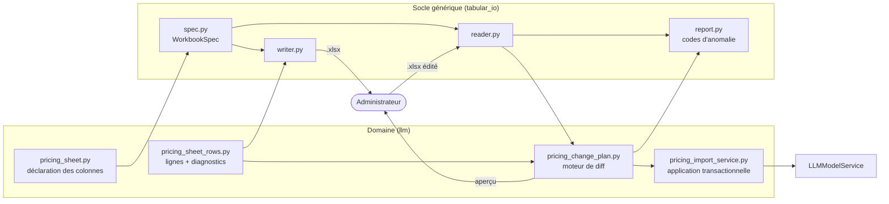

# Import/export tabulaire des administrations

> Socle générique permettant d'exporter une administration en classeur Excel,
> de l'éditer hors ligne et de la réimporter en masse. Premier consommateur :
> le catalogue des modèles LLM et leurs tarifs (ADR-228).

## Vue d'ensemble

Le socle ignore tout du domaine ; le domaine ignore tout du format.

## Le classeur

| Onglet | Contenu |
|---|---|
| **Notice** | Mode d'emploi traduit dans la langue de l'administrateur |
| **Modeles** | 27 colonnes, une ligne par modèle |
| **Plages horaires** | Une ligne par fenêtre UTC (clé de regroupement, pas d'identité) |
| **Référentiels** | Masqué et verrouillé ; alimente les listes déroulantes |
| **Métadonnées** | Version de schéma, auteur, horodatage |

**Ligne 1** = clés techniques invariantes (masquée). **Ligne 2** = libellés
traduits, colorés par bloc. **Données à partir de la ligne 3.**

Les colonnes sont résolues **par clé technique**, jamais par position :
réordonner, masquer ou ajouter une colonne dans Excel est sans effet, et changer
de langue entre l'export et l'import ne change rien.

### Les 27 colonnes

| Bloc | Colonnes | Modifiable |
|---|---|---|
| Identité | `model_name` (clé), `provider`, `kind` | oui (`provider` à la création seulement) |
| État | `is_active` | oui — désactivation **et** réactivation |
| Capacités | `max_input_tokens`, `max_output_tokens`, `supports_tools`, `supports_structured_output`, `supports_strict_mode`, `supports_streaming`, `supports_vision` | oui |
| Sampling | `supports_temperature`, `supports_top_p`, `supports_frequency_penalty`, `supports_presence_penalty` | oui |
| Raisonnement | `reasoning_template`, `reasoning_shape` (lecture seule), `reasoning_doc_i18n_key` | gabarit + clé d'aide |
| Tarif | `pricing_unit`, `input_unit_price`, `cached_input_unit_price`, `output_unit_price`, `effective_from` | prix + unité |
| Plages | `time_slots_mode`, `time_slots_summary` | mode |
| Diagnostic | `statut` | non |
| *(masquée)* | `row_fingerprint` | non |

## Les règles d'import

1. **Clé = `model_name`.** Absent en base → création ; présent → mise à jour.
2. **Une ligne absente du fichier ne supprime rien.** Jamais.
3. **`is_active = FAUX`** désactive ; **`VRAI`** sur un modèle inactif réactive.
4. **Un tarif n'est écrit que s'il a réellement changé.** Sans cette règle, un
   import de 124 lignes créerait 124 versions inutiles.
5. **Une cellule de prix de cache vidée signifie NULL**, exprimé explicitement.
6. **Plages horaires** : `windows` (l'onglet fait autorité), `flat` (effacement),
   `inherit` (inchangé) — le contrat d'ADR-223 rendu lisible dans le fichier.
7. **Intégral ou nul.** La moindre anomalie non résolue n'écrit rien.
8. **Aperçu obligatoire**, et l'application re-dérive le plan : celui qui a été
   relu est celui qui est écrit.
9. **Verrou optimiste par ligne** : seules les lignes modifiées entre-temps sont
   refusées.
10. **Un changement de `provider` est signalé**, jamais avalé en silence.

## Endpoints

| Méthode | Chemin | Rôle |
|---|---|---|
| `GET` | `/admin/llm/pricing/sheet/export.xlsx` | Télécharge le classeur |
| `POST` | `/admin/llm/pricing/sheet/import?dry_run=true` | Aperçu — n'écrit rien |
| `POST` | `/admin/llm/pricing/sheet/import?dry_run=false&plan_fingerprint=…` | Application |

Superuser uniquement. Un fichier illisible renvoie **200 avec un rapport**
localisé à la cellule — pas une erreur générique : l'administrateur doit savoir
*quelle cellule* corriger. Les 400 sont réservés à ce qui n'est pas un rapport :
empreinte absente ou périmée, fichier hors gabarit.

## Gardes

| Garde | Réglage | Défaut |
|---|---|---|
| Taille du fichier | `LLM_SHEET_MAX_UPLOAD_KB` | 4096 |
| Taille décompressée | `LLM_SHEET_ZIP_MAX_DECOMPRESSED_KB` | 65536 |
| Nombre de membres | `LLM_SHEET_ZIP_MAX_FILES` | 256 |
| Lignes par onglet | `LLM_SHEET_MAX_ROWS` | 2000 |

Un `.xlsx` **est** une archive zip : la garde anti-zip-bomb est celle de
l'importeur de plugins (`infrastructure/archives/zip_budget.py`), partagée.
La lecture est bornée par blocs — un fichier hors gabarit est refusé avant
d'être tenu en mémoire en entier.

## Décliner à une autre administration

1. Écrire une déclaration : colonnes, référentiels **construits depuis les
   enums** (jamais depuis les valeurs présentes en base, sinon une valeur jamais
   utilisée manquerait à sa propre liste déroulante).
2. Écrire un constructeur de lignes et un applicateur passant par le service du
   domaine.
3. Ajouter les traductions dans `core/i18n_pricing_sheet.py` (ou son équivalent).
4. Ajouter la garde de complétude : toute colonne métier exportée ou exclue avec
   une raison écrite.

Le socle, lui, ne bouge pas.

## Pièges (mesurés)

- `ws.protection.sheet = True` seul **interdit d'ajouter une ligne** : les
  booléens de `sheetProtection` signifient « bloqué » quand ils valent `1`.
- `showDropDown="1"` **masque** la flèche de liste.
- Protection ⇒ groupes de colonnes repliables inertes (non persistable sans
  macro).
- `data_only=True` renvoie `None` sur un fichier jamais ouvert par Excel.
- `max_row` est gonflé par le pré-formatage.
- Chaîne vide et cellule absente sont **la même valeur**.
- `Decimal("NaN")` et `Decimal("inf")` parsent, franchissent le contrôle de
  minimum et cassent le calcul d'échelle.
- La clé d'un onglet de détail **regroupe**, elle n'identifie pas.

## Voir aussi

- `docs/architecture/ADR-228-Import-Export-Tabulaire-Administration.md`
- `docs/architecture/ADR-223-Tarification-LLM-Par-Plages-Horaires-UTC.md`
