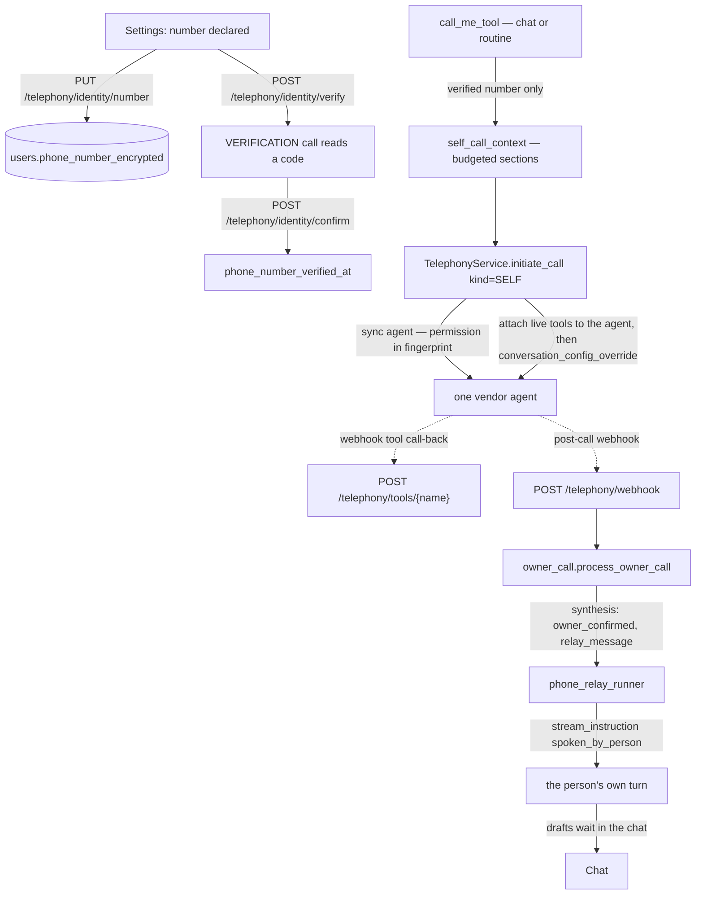

# Agentic Telephony — Technical Reference

Per-user, agentic **outbound calls**: LIA phones a third party on the user's
behalf, pursues a stated objective (read-only), and reports back asynchronously
in the chat. Vendor: **ElevenLabs Agents** (dials via Twilio/SIP). Since
ADR-290 the phone is also a **channel**: LIA calls the account holder on a
number they declared and verified, with no confirmation card, and what they say
on the call comes back as their own turn (see
[Phone as a channel](#phone-as-a-channel-adr-290)).

- Architecture decisions: [ADR-127](../architecture/ADR-127-Agentic-Telephony.md)
  (third-party calls), [ADR-290](../architecture/ADR-290-Phone-As-A-Channel-Owner-Calls.md)
  (owner calls, verified number, relay, live tools)
- Feature flag: `TELEPHONY_ENABLED` (default off). Per-user connector
  `ELEVENLABS_TELEPHONY` in *Préférences → Mes Connecteurs*.
- Status: implemented à blanc; vendor E2E gated on the P2.0 spike (see below).

## Architecture

```mermaid
flowchart TD
    U[User: "call Marie, ask if she's free Tuesday"] --> Tool[place_phone_call tool]
    Tool -->|connector active? resolve contact→phone| Draft[PHONE_CALL draft]
    Draft --> Critique[draft_critique — HITL confirm]
    Critique -->|confirm| Exec[execute_phone_call_draft]
    Exec --> Svc[TelephonyService.initiate_call]
    Svc -->|read-only, fields=start/end| Avail[availability.py — free/busy only]
    Svc -->|commit dialing row BEFORE dialing| DB[(phone_calls)]
    Svc -->|dynamic_variables incl. call_id| EL[ElevenLabs outbound-call]
    EL -. post-call webhook (HMAC) .-> WH[POST /telephony/webhook]
    WH -->|foreign-filter → per-user HMAC verify| Recon[authenticate_and_reconcile]
    Recon -->|fire-and-forget| PCC[process_completed_call]
    PCC -->|tool-less LLM synthesis| Synth[summary + proposal]
    Synth -->|mark_completed exactly-once| DB
    Synth --> Notif[NotificationDispatcher → chat + push]
```

**Key modules** (`src/domains/telephony/`):

| File | Role |
|---|---|
| `connector.py` | Activation wizard backend (validate key → provision guardrailed agent → store encrypted connector); `get_active` capability guard. |
| `client.py` | Thin async ElevenLabs Agents client (`xi-api-key`); `call_recording_enabled=false`; injectable transport for tests. |
| `agent_prompt.py` | Fixed guardrail system prompt + per-call dynamic vars — including the localized `current_datetime` anchor: the voice agent has no clock of its own, so a callee's "tomorrow" was unresolvable without it (observed: agreed "tomorrow"=Saturday spoken back as Sunday) — + the `data_collection` schema (contract with the webhook extractor) + the config fingerprint powering the lazy agent re-sync (`initiate_call` PATCHes the vendor agent on drift — prompt/settings changes need no reactivation). |
| `availability.py` | Free/busy projection — **busy ranges only**, never titles/attendees/locations. |
| `service.py` | `initiate_call`: guard → **self-healing** one-active pre-check (vendor conversation-status probe closes rows whose webhook never arrived, then the stale threshold inline — the guard no longer depends on the reaper's tick) → lazy agent config re-sync → availability → **commit dialing row → dial → persist conversation id**. |
| `webhook_handler.py` | Foreign-filter → resolve → agent match → per-user HMAC verify (Stripe-style `t=,v0=`). |
| `return_synthesis.py` | Tool-less synthesis (structured output **through the central `get_structured_output_with_retry` chokepoint** — a direct `with_structured_output` bypasses the provider constraints it carries, e.g. DeepSeek V4 thinking rejects the forced `tool_choice` with a 400 (prod incident 2026-07-29: every return degraded to the raw English vendor summary); enforced repo-wide by the AST guard `test_no_direct_structured_output_guard`. Token usage is read via the shared `TokenCaptureHandler`, and the `telephony_synthesis` budget is calibrated for the debrief-era output *plus* reasoning tokens on thinking models) + `process_completed_call` (exactly-once, minimized persistence, token tracking, **arms + delivers the durable return outbox**). |
| `repository.py` | `PhoneCall` data access: F12 active-guard, `mark_completed` (atomic conditional UPDATE **+ PENDING outbox arm + SYNTHESIZED inbox close + transcript purge**), `mark_notification_delivered` / `fetch_recoverable_notifications` / `record_notification_failure`, **`persist_return_inbox` / `fetch_recoverable_returns` / `expire_stale_returns` (T1-A inbox)**, reaper queries. |
| `reapers.py` | Stale-call recovery (interval) + **return-notification recovery (interval, T1)** + **pre-synthesis return recovery (interval, T1-A)** + retention purge (daily). |
| Tool | `agents/tools/telephony_tools.py::place_phone_call` (draft-producing) + `execute_phone_call_draft`; refuses the owner's own verified number (`callee_is_the_user`). |
| i18n | `core/i18n_telephony.py` (all backend strings, 6 languages). |
| `phone_numbers.py` | ONE normaliser to E.164 (`normalize_phone`, `to_e164`, `same_line`) — the section shows the number WHOLE so a typo is visible. |
| `identity.py` | `TelephonyIdentityService`: the declared number (encrypted), its verification date, the rich-context switch; `verified_number` is the ONE seam the no-card exception rests on. |
| `verification.py` | `TelephonyVerificationService`: places a `VERIFICATION` call reading a `secrets`-drawn code aloud; code + attempt counter in Redis (`telephony_verify*`, `USER_RUNTIME`), constant-time compare, 429 lock past the attempt cap. |
| `mandates.py` | One vendor agent, three mandates (`CallKind`): the baked third-party mandate, and the owner / verification overrides rendered server-side (`build_override`), boot-asserted (ADR-085). |
| `self_call_context.py` | The context block an owner call carries — memories, agenda, reminders, open loops, recent exchanges — under `TELEPHONY_SELF_CONTEXT_MAX_TOKENS`, cuts stated, every read filed on the `phone_call` surface. |
| `self_call_relay.py` / `owner_call.py` | Relay synthesis (chokepoint, `SelfCallRelay`: `owner_confirmed`, `relay_message`, `summary`) and the owner-call completion path (RELAYING outbox, fallback notification, `RelayOutcome`). |
| `infrastructure/scheduler/phone_relay_runner.py` | Runs the relayed turn through `stream_instruction(spoken_by_person=True)` with a VISIBLE `phone_call` origin; retries a busy thread, stands aside for a pending question, settles the outbox. Lives outside `telephony` so the domain never imports `agents`. |
| `live_tools.py` (telephony) + `agents/telephony/live_tools.py` + `live_tools_router.py` | Live read-only lookups during an owner call (flagged): derived token, vendor tool bodies, fingerprinted provisioning, the session-less call-back. |
| Tool | `agents/tools/telephony_self_tools.py::call_me` — `reversible` with a written reason: no card, and a routine may plan it. |

## Security invariants (do not weaken)

1. **Read-only, minimized by capability.** The agent only ever receives a
   free/busy snapshot (`fields=["start","end"]` → busy ranges). Meeting details
   are never fetched, so they cannot leak — regardless of what the callee asks.
2. **Per-user HMAC, foreign-filter first.** The webhook secret is per-connector;
   resolve `call_id → PhoneCall → connector` **before** verifying the signature.
   Unknown/foreign/malformed → 200 + ignored counter; known-call + forged
   signature → 4xx. No PII on any webhook log path.
3. **Secrets encrypted, never in JSONB.** API key + webhook secret live in
   `credentials_encrypted`; only non-secret ids in `connector_metadata`. The
   callee phone is encrypted at rest (`callee_phone`); the calls API
   (`GET /telephony/calls`) omits it entirely.
4. **No recording, transcript never persisted (D-8).** Only `summary` +
   minimized `StructuredCallData` survive; the transcript feeds synthesis then
   is discarded. The retention reaper clears content past its TTL.
5. **No PII at INFO/WARNING.** Logs carry IDs/counts/status only — never names,
   phones, summaries, or collected values (a `ValidationError` message is logged
   by type, not value, to avoid leaking a collected detail).
6. **Mandate boundary (no unrequested spending).** The voice agent's mandate is
   exactly the objective: it never accepts a surcharge, upsell, substitution or
   commitment beyond it — even a small one. It captures the offer and its price,
   defers, and announces a call-back; the deferred item flows through two
   dedicated structured fields (`additional_costs`, `pending_user_decision`)
   that the synthesis MUST surface (every cost stated, every open point flagged
   with a how-to-proceed question). Enforced in the system prompt (Goal step 4 +
   guardrail) and in the synthesis prompt's hard rules.
7. **No card only for a VERIFIED number (ADR-290).** `call_me` runs without a
   confirmation card because the person who would confirm is the one who picks
   up — and that holds only if the number is proven theirs: declared in the
   settings, then heard reading a code LIA spoke. Never a name match. The
   third-party tool refuses that same number, so an owner call can never go
   through the stranger's mandate by another door. **The spoken code is bound
   to the number it was dialled on**: the Redis value carries the number, and
   a code heard on A never verifies B (declare A, hear the code, switch to B,
   type it — refused, the code voided). A verification call counts against
   the same hourly cap as every paid call (`TELEPHONY_RATE_LIMIT_PER_HOUR`),
   so a stolen session cannot make LIA ring arbitrary numbers at will.
8. **Nothing of the owner's context is ever baked into the agent.** The
   provisioned agent also phones strangers; the owner mandate travels as a
   per-call override. Its live tools (lot 7) are attached to the agent for the
   owner's call ONLY — the vendor refuses `tool_ids` inside an override
   (measured on a real call 2026-09-16, the call died at pickup) — and the
   connector remembers it: they come off when the call ends, and the dial path
   detaches them again before any third-party or verification call leaves,
   while the third-party prompt names any attached lookup as refused.
9. **The live-tool call-back opens only for an active owner call.** No session;
   a token DERIVED from the connector's webhook secret (never the secret
   itself); the call must be `SELF`, on the line and younger than the
   stale-call timeout; the tool must be allow-listed, read-only by
   construction, and currently offered; a per-call budget bounds the lookups.
   Every refusal short of a wrong secret on a qualifying call reads « not
   found ».

## Data model — `phone_calls`

One row per placed call. `status` (dialing → in_progress → completed/no_answer/
voicemail/failed/cancelled), `outcome` (objective_met/partial/declined/
unreachable), `call_seconds` (factual, never money — D-9), `summary` +
`structured_data` (purged after `expires_at`). `debrief` (ADR-174, JSONB
nullable with `none_as_null=True` — an EMPTY debrief must persist as SQL NULL,
not the JSONB `'null'` literal, or `IS NOT NULL` lies and the retention purge
leaves a ghost): commitments, follow-up tasks/reminders, message draft, points
to verify, and `key_points` — the factual findings the call produced (opening
hours, availability, an answer), populated even when nothing is actionable;
same retention as `summary`. Return-outbox columns (T1):
`notification_status` (pending/delivered/failed), `notification_payload`
(minimal `{content, title}` to re-dispatch without re-synthesizing),
`notification_attempts`. Three partial indexes: one-active-call-per-user (F12,
unique), the ElevenLabs conversation id (unique), and PENDING notifications by
completion time (the reaper's scan).

## Return durability (T1)

The return notification (summary + proposal) delivered to the user after a call
completes is a **transactional outbox**, so a hard crash cannot lose it:

1. `mark_completed` writes the terminal call state **and** `notification_status =
   PENDING` + `notification_payload` in ONE atomic conditional UPDATE. The return
   is a committed durable record *before* it is dispatched.
2. `process_completed_call` dispatches, then flips PENDING → DELIVERED **only after
   the dispatcher succeeds**. A dispatch error is swallowed (not re-raised — the
   old retry loop could never re-dispatch, since `mark_completed` is already
   terminal) and the row is left PENDING.
3. `telephony_notification_reaper` (interval, single-instance under leader election
   + `max_instances=1` = the lease) re-dispatches PENDING rows from their payload
   once past a grace window (so it never races the live dispatch of a
   just-completed call), bounded by `TELEPHONY_NOTIFICATION_MAX_ATTEMPTS` before a
   row is retired to FAILED.

### Pre-synthesis inbox (T1 approach A)

The outbox above only protects the window *after* synthesis. The webhook itself
is delivered by the vendor exactly once, so a crash *during* synthesis (before
`mark_completed`) previously lost the return. The pre-synthesis inbox closes that
window:

1. The webhook handler persists `return_status = RECEIVED` + the **Fernet-encrypted**
   raw payload (`return_webhook_encrypted`) + `return_received_at` and COMMITS
   **before responding 200**, so the transcript needed to (re)synthesize survives a
   crash — encrypted at rest (D-8 relaxation validated by the product owner).
2. `mark_completed` flips `RECEIVED → SYNTHESIZED` and **purges the encrypted
   transcript** in the same atomic transition, so it only rests on disk for the
   synthesis window.
3. `telephony_return_reaper` (interval, single-instance) re-runs the idempotent
   `process_completed_call` for `RECEIVED` rows past `TELEPHONY_RETURN_GRACE_SECONDS`
   (never racing the live synthesis), decrypting the persisted payload; a row still
   stranded past `TELEPHONY_RETURN_MAX_AGE_MINUTES` is retired to FAILED and its
   transcript purged.
4. The stale-call reaper explicitly **excludes `RECEIVED` rows** (the return reaper
   owns them), so it can never fail a recoverable call out from under recovery.

Crash matrix: *before `mark_completed`* → the encrypted `RECEIVED` inbox is
committed; the return reaper re-synthesizes from it after the grace window (incl.
after a restart), or gives up + purges past max-age; *after commit, before/mid
dispatch* → PENDING, the notification reaper recovers it on the next tick. A
duplicated webhook loses the `mark_completed` race (exactly-once) and never
reverts a SYNTHESIZED row back to RECEIVED. Worst case is a rare duplicate
notification on a mid-dispatch crash — deliberately preferred over a lost return.

## Vendor refusal — the 200 that means "no"

`POST /convai/conversations/outbound-call` answers **HTTP 200 even when it
declines to dial**: the refusal lives in the body, as `success: false` with a
`message` (observed: *"The source phone number provided … is not yet verified
for your account"*).

Treating that as a placed call left a `DIALING` row that nothing would ever
close. Worse, such a row carries **no conversation id**, so the self-healing
probe of the one-active-call guard cannot even ask the vendor about it: the row
blocked every further call until the 15-minute stale threshold elapsed.

`TelephonyService._dial_and_interpret` therefore reads four distinct outcomes:

| Vendor answer | Status | Row transition | What the user is told |
|---|---|---|---|
| `ElevenLabsAgentsError` with `is_auth_error` (401, or a 4xx whose body carries `detail.type == "authentication_error"`) | `auth_failed` | `mark_dial_failed(initiate_auth_failed:<code>)` | the stored connector key is no longer valid — reconnect ElevenLabs; retrying will not help |
| `ElevenLabsAgentsError` (network, 5xx) | `failed` | `mark_dial_failed(initiate_failed:<code>)` | transient — "try again in a moment" |
| `200` + `success: false` | `rejected` | `mark_dial_failed(initiate_rejected:<message>)` | configuration — retrying will not help |
| `200` + `success: true` | `placed` | `set_conversation_id(...)` | the call is ringing |

The auth classification is structural (the vendor's `detail.type` taxonomy
field, read on the full body before log truncation) — never a message
substring. Observed in production 2026-08-15: ElevenLabs stopped accepting a
legacy key-ID-shaped credential with 400 `invalid_api_key`, and every call
died behind the generic "try again" message.

A `placed` call **without** a conversation id keeps its row active on purpose:
it may well be ringing, and closing it would let a second call start in
parallel — the one thing the guard exists to prevent. It is simply unprobeable,
and a `telephony_call_initiated_without_conversation_id` warning says so.

`_STATUS_TO_PHRASE` (`agents/tools/telephony_tools.py`) maps each non-placed
status to a locale key. The mapping is a module constant so the completeness
test imports it rather than re-parsing the source, and it asserts the set of
statuses equals `get_args(_InitiateStatus)` minus `placed`, with every phrase
present and non-empty in all six languages.

## Calls surface (A6)

`GET /telephony/calls` shipped with the domain and was consumed by nothing.
Two frontend surfaces read it now:

- `TelephonyCallsSection` — a deep-linkable settings section
  (`?section=telephony-calls`) listing name, objective, status, outcome, recap
  and duration. Never the number: `TelephonyCallSummary` has no field for it.
- `ActiveCallBanner` — a status line above the chat thread, visible only while
  a call is `dialing` or `in_progress`.

`useTelephonyCalls` polls **only** while a call is in flight (15 s) and stops as
soon as none is: there is no intermediate webhook, only a post-call one, so
there is nothing to stream and the hook does not pretend otherwise. A 404
(feature flag off) silences it permanently. The banner also re-reads on every new
conversation turn, because a chat opened *before* the call would otherwise never
see one start.

## Phone as a channel (ADR-290)



- **Identity**: `GET/PUT/DELETE /telephony/identity[/number]`,
  `POST /telephony/identity/verify` and `/confirm`, `PATCH /telephony/identity`
  (the rich-context switch). The settings section `TelephonyIdentitySection`
  shows the number whole, offers the verification call, and asks for the code
  only while one is pending; a 409 (the code expired, the number changed)
  re-reads the identity so the form stops asking for a code nobody can type.
- **Mandates**: `THIRD_PARTY` (baked), `SELF` (owner prompt
  `telephony_self_call_system_prompt` and greeting), `VERIFICATION`
  (`telephony_verification_prompt` and greeting). An override is the prompt
  and the greeting, nothing else: the language and the duration cap are the
  portal's (owner decision, 2026-09-16). The override is rendered with
  `str.format`; a `{{…}}` inside a value is neutralised so the vendor never
  reads it as a variable.
- **Relay**: exactly-once and crash-safe. Once the turn ran, a push (and only
  a push: the rows are already in the chat) tells the person LIA acted —
  `relay_answered`, or `relay_drafts_waiting` when a draft waits for them —
  because the person who hung up may not be looking at the app. Their draft
  cards render as the chat's `lia-card`: `card_surface()` reads the origin's
  VISIBILITY, not its mere presence (a hidden origin is a ticket, a visible
  one is the chat). `mark_completed` arms the outbox as
  `RELAYING` BEFORE the turn; `mark_relay_delivered` / `mark_relay_fallback`
  settle it by conditional update; `recover_stale_relays` (notification
  reaper) hands a `RELAYING` row older than `TELEPHONY_RELAY_MAX_AGE_MINUTES`
  back to `PENDING`. `RelayOutcome` (`answered`, `waiting`, `empty`,
  `not_owner`, `pending_question`, `busy`, `quota_blocked`, `failed`) is
  counted (`telephony_relay_total`), stored in
  `notification_payload.relay_outcome` and drawn on the calls list. The relayed
  turn is a `phone_call` origin with `hidden=False`, so the archived message
  carries the badge the chat draws.
- **Live tools (lots 7-8, `TELEPHONY_LIVE_TOOLS_ENABLED`)**: the phone
  reads everything the chat reads (owner decision 2026-09-16). The tool set
  is a RULE over the catalogue, not a list (`derive_live_tool_specs` in
  `agents/telephony/live_tools.py`): every tool that only reads (`search`
  category or an explicit `read` policy — never the `readonly` inference
  fallback), is not a `system` tool (those answer inside a turn), runs
  outside the pipeline's executor, belongs to a domain the phone offers
  (`domains/shared/phone_domains.PHONE_DOMAINS`, the register's own
  vocabulary), and whose required parameters a voice can speak (an
  identifier — by `semantic_type` or by name — hides its parameter; a tool
  whose required parameter is an id is left out). Measured on the real
  catalogue: 55 tools over 22 domains, plus the native `recall_memories`
  lookup (the chat has no memory tool; it reads through the chat's own
  profile builder). The vendor description is the voice line of
  `telephony_live_tools.txt` when one exists, else the manifest's own first
  paragraph. Provisioned per connector by fingerprint
  (`connector_metadata.live_tool_ids` / `live_tools_hash`), concurrently
  under `TELEPHONY_LIVE_TOOL_PROVISIONING_CONCURRENCY` (sixty sequential
  creations would hold a dial for a minute; the vendor accepted sixty on one
  agent — measured), deleted at deactivation after the agent; attached to
  the AGENT before an owner call (`set_agent_tool_ids`,
  `connector_metadata.live_tools_attached`) — the subset the PERSON left on
  (`users.phone_disabled_domains`, the DISABLED set so a new domain is on by
  default; switches in *Téléphonie · Mon identité*, vocabulary published by
  the API as `available_domains`) — and detached once it ended (`owner_call`)
  or before the next stranger is dialled (`_arm_live_tools`); measured
  2026-09-16 on a real owner call, the vendor refuses `tool_ids` inside the
  per-call override (« Tool IDs not attached to this agent ») and the call
  dies at pickup. The owner prompt names the DOMAINS it may look into, in
  words, never fifty tool names. The call-back runs the
  registered tool on a synthetic runtime, arguments validated through the
  tool's own call schema, bounded `TELEPHONY_LIVE_TOOL_INNER_MARGIN_SECONDS`
  under `TELEPHONY_LIVE_TOOL_TIMEOUT_SECONDS`, result reduced to what a
  VOICE can say (`agents/telephony/voice_projection.py`: identifiers, links
  and wire details dropped, a nested value spoken through its `formatted` /
  `name`, a list of records counted — measured 2026-09-16: four weekend
  events were returned and the agent heard ONE, the raw event JSON having
  eaten the budget) then paged under `TELEPHONY_LIVE_TOOL_RESULT_MAX_TOKENS`
  (the cut stated), consultation filed under the section named after the
  tool's domain, inside a collector the route opens itself. The call-back
  reads the person's switches from THEIR row at every call: a tool still
  attached by a stale PATCH answers « not found » on a domain switched off
  since. Needs a PUBLIC `API_URL` the vendor can reach.
- **The assistant's personality (lot 9)**: the instruction the person
  configured for LIA (`PersonalityService.get_prompt_instruction_for_user`,
  the chat's and the voice flow's own door) is read once at the dial,
  best-effort, and reaches both mandates — rendered into the owner prompt's
  `<personality_profile>` (neutralised like every value; a scaffold says when
  none is configured) and handed to the baked third-party agent as the
  `personality_profile` dynamic variable, so a personality change needs no
  re-sync. Both prompts say it colours how the agent speaks, never what it
  may share or do.
- **The call's bill (lot 8)**: the live lookups during the call, the
  synthesis after it and the relayed turn all spend under ONE run id
  (`telephony/spend.phone_call_run_id`, `phone_call_<hex>`): each lookup
  opens a `TrackingContext` on it and hands its `TokenTrackingCallback` to
  the synthetic runtime's config (a structured door handed no config builds
  one nobody tracks), the synthesis passes it to `track_proactive_tokens`,
  the relay drives the turn under it. The per-run summary the chat meter
  already reads (`message_token_summary`, unique on `run_id`, accumulated by
  column arithmetic) is therefore the call's cumulated bill by construction:
  the relayed answer's bubble shows it, and `GET /telephony/calls` carries it
  as `usage` (tokens in/out/cache, euros, Maps requests) drawn on the calls
  list. **It is the bill of what LIA pays, and nothing else — by decision,
  not omission** (owner rule 2026-09-16, `cost_bearers`): the voice agent's
  own LLM, the TTS, the ASR and the line run on the person's ElevenLabs key
  and are never counted nor shown in LIA. Measured on a 198 s owner call with
  eight lookups: LIA 28 k tokens / 0,0065 €; the vendor 409 k voice-LLM
  tokens, 2 079 credits ≈ 0,41 $ on the person's account — twenty times more,
  and not ours to account.
- **Measured on production, 2026-09-16**: the verification call succeeded
  (19 s, the code read twice). Two owner calls died at pickup with the
  vendor's `tool_ids` refusal above — and were reported to the person as
  « someone else answered ». Both fixed (agent-level attachment;
  `unanswered` / `call_failed` told apart from `not_owner` — ten
  `RelayOutcome`s). A third owner call then ran end to end: 179 s, four live
  lookups (agenda ×3, tasks ×1, 478-783 ms each), detached at the webhook,
  relayed as the person's turn in 38 s, `answered`. What that call revealed
  is what lot 8 fixed: no e-mail or memory lookup existed, and the agenda
  projection showed 1 event of 4. The flag stays off by default: an owner
  call under the derived tool set has not been measured end to end yet.

## Configuration

All knobs are deployment-wide (`TelephonySettings`, `.env`); per-user secrets
live in the connector. **What the voice agent SOUNDS like is NOT a setting**
(owner decision, 2026-09-16): its LLM and reasoning effort, its language, its
voice, its audio format and its duration cap are administered on the
ElevenLabs portal, for the agent, and changed there without restarting the
application. LIA sends none of them at creation or on sync — it passes only
what is its own: the prompts, the greeting, the tools, the context, the
data-collection contract. The reason is measured: the vendor MERGES a PATCH
with what the agent already stores and validates the pair, so a model pinned
by LIA collided with the portal's `reasoning_effort` (« Not supported
reasoning effort ») on every sync — and since the sync is mandatory for the
owner and verification mandates, every such call was refused while
third-party calls kept running on the stored config. A freshly provisioned
agent therefore starts on the vendor's defaults until they are set on the
portal (runbook step 5 below); the vendor's own constraints apply there (a
non-English agent needs a turbo/flash v2.5 TTS model; a Twilio line wants
`ulaw_8000` in both directions — a mismatch is the vendor's documented cause
of garbled call audio). Notable knobs:
`TELEPHONY_PROBE_NOT_FOUND_GRACE_SECONDS` (age before a 404
conversation-status probe closes an active row as gone — a mid-call connector
deactivation deletes the vendor agent and its conversation, so the end-of-call
webhook can never arrive; the grace window protects freshly dialed calls whose
conversation may not be readable yet),
`TELEPHONY_DEFAULT_COUNTRY_CODE` (e.g. `+33` — converts
national numbers with a single leading 0 to E.164 before dialing; empty = as-is),
`TELEPHONY_PREFETCH_WINDOW_DAYS`, `TELEPHONY_CALL_RETENTION_DAYS`,
`TELEPHONY_STALE_CALL_TIMEOUT_MINUTES` (also the age past which a live-tool
call-back and its budget no longer recognise an owner call, since the
application cannot read the portal's cap), `TELEPHONY_RATE_LIMIT_PER_HOUR`,
`TELEPHONY_WEBHOOK_TOLERANCE_SECONDS`, `TELEPHONY_STALE_REAPER_INTERVAL_MINUTES`,
and the return-outbox knobs `TELEPHONY_NOTIFICATION_GRACE_SECONDS`,
`TELEPHONY_NOTIFICATION_REAPER_INTERVAL_MINUTES`, `TELEPHONY_NOTIFICATION_MAX_ATTEMPTS`,
plus the pre-synthesis inbox knobs (T1 approach A) `TELEPHONY_RETURN_GRACE_SECONDS`,
`TELEPHONY_RETURN_MAX_AGE_MINUTES`, `TELEPHONY_RETURN_REAPER_INTERVAL_MINUTES`.

Phone as a channel (ADR-290):
`TELEPHONY_VERIFICATION_CODE_LENGTH`, `TELEPHONY_VERIFICATION_CODE_TTL_SECONDS`,
`TELEPHONY_VERIFICATION_MAX_ATTEMPTS`, `TELEPHONY_SELF_CONTEXT_MAX_TOKENS`,
`TELEPHONY_RELAY_TRANSCRIPT_MAX_TOKENS`, `TELEPHONY_RELAY_TIMEOUT_SECONDS`,
`TELEPHONY_RELAY_BUSY_RETRIES`, `TELEPHONY_RELAY_BUSY_DELAY_SECONDS`,
`TELEPHONY_RELAY_MAX_AGE_MINUTES`, and the live-tool knobs
`TELEPHONY_LIVE_TOOLS_ENABLED`, `TELEPHONY_LIVE_TOOL_TIMEOUT_SECONDS`,
`TELEPHONY_LIVE_TOOL_RESULT_MAX_TOKENS` (spent on WORDS since lot 8 — the
items reach the budget reduced to what a voice can say),
`TELEPHONY_LIVE_TOOL_MAX_CALLS_PER_CALL`. Which DOMAINS a call may read is
the person's own setting, not the deployment's (`users.phone_disabled_domains`).
Defaults in `core/constants.py`; every one present in the four application
`.env` files.

## Observability

Prometheus (`metrics_telephony.py`): `telephony_calls_total{status}`,
`telephony_call_duration_seconds` (histogram), `telephony_webhook_ignored_total{reason}`,
`telephony_notification_recovered_total{result}` (delivered/failed/skipped — the T1
reaper's recovery outcomes; a non-zero `failed` means returns exhausted their retries).
The synthesis LLM spend is tracked via `track_proactive_tokens` (task type
`phone_call`) — visible in the user's consumption export alongside briefing /
heartbeat. ADR-290 adds `telephony_relay_total{outcome}`,
`telephony_live_tool_calls_total{tool,outcome}` and
`telephony_live_tool_duration_seconds{tool}`; dashboard 24 draws all of them
(rows « Calls », « Recovery reapers », « Owner calls — relay into the chat »,
« Webhooks »).

## Setup runbook (per user, spec §17)

1. Create an ElevenLabs account and generate an **API key** (workspace settings).
2. **Import a phone number** into the ElevenLabs workspace (Twilio import or SIP
   trunk — ElevenLabs sells no numbers). This is the number LIA calls *from*.
3. In LIA: *Préférences → Mes Connecteurs → Téléphonie* → paste the API key →
   validate → pick the number.
4. In the ElevenLabs workspace, create a **post-call (`post_call_transcription`)
   webhook** pointing at the URL LIA shows you
   (`<public-host>/api/v1/telephony/webhook`), and copy its **signing secret**.
5. Paste the secret in LIA and activate. LIA provisions a guardrailed agent in
   your workspace and the connector goes active. Then open that agent on the
   ElevenLabs portal and set what it sounds like — LIA never overwrites any
   of it, and none of it needs a restart:
   - its **LLM** (and reasoning effort): the vendor's default is a thinking
     model that was once observed reciting its reasoning aloud, so pick a
     fast, thinking-free one;
   - its **language** (the greeting LIA sends is already in the account's
     language, but the agent speaks the portal's);
   - its **voice** (the vendor default is an ENGLISH voice — garbled speech
     was observed on French calls with it) and **TTS model** (a non-English
     agent needs a turbo/flash v2.5 model, the vendor refuses otherwise);
   - its **audio format** in BOTH directions (`ulaw_8000` on a Twilio line —
     the phone network is 8 kHz mu-law, anything higher is inaudible and a
     mismatch is the vendor's documented cause of garbled audio);
   - its **maximum call duration** (the vendor's cap on a runaway call).
6. Calls are billed on **your own** ElevenLabs/telephony accounts (D-9).

## Spike owed (P2.0 — before go-live)

Confirm against a real ElevenLabs + Twilio account (all marked `spike:` in code):

- create-agent body: exact prompt-text key + **data-collection config path**
  (assumed `platform_settings.data_collection`) — the identifiers
  (`agreed`/`proposed_datetime`/`location`/`notes`) are the contract with
  `return_synthesis._extract_structured` and are unit-test-guarded.
- webhook: exact signature header name (`ElevenLabs-Signature`) + post-call
  payload field paths (`call_id` in `dynamic_variables`, `agent_id`,
  `transcript_summary`, `data_collection_results`, `call_duration_secs`).
- `built_in_tools` shape (`agent.prompt.built_in_tools` keyed by tool name —
  `end_call` + `voicemail_detection` are now sent; without `end_call` the agent
  can never hang up). The maximum call duration is the portal's
  (`conversation_config.conversation.max_duration_seconds` there, never sent
  by LIA).
