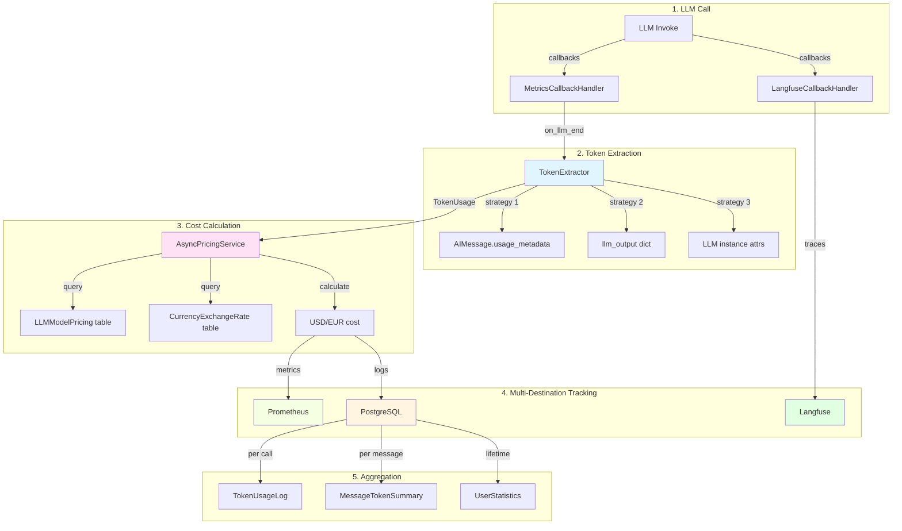

# Token Tracking & Counting (LIA)

**Document de référence technique - Architecture du suivi de consommation de tokens LLM**

---

## Table des matières

1. [Vue d'ensemble](#vue-densemble)
2. [Architecture 3-Sources](#architecture-3-sources)
3. [Token Extraction](#token-extraction)
4. [Token Counting](#token-counting)
5. [Cost Calculation](#cost-calculation)
6. [Database Models](#database-models)
7. [Exemples pratiques](#exemples-pratiques)
8. [Testing](#testing)
9. [Troubleshooting](#troubleshooting)
10. [Ressources](#ressources)

---

## Vue d'ensemble

### Objectifs

Le système de **Token Tracking & Counting** fournit :

1. **Comptage précis** : Extraction fiable des tokens via 3 stratégies de fallback
2. **Calcul de coûts** : Estimation USD/EUR avec tarification dynamique
3. **Triple source** : Langfuse (observabilité) + Prometheus (métriques) + PostgreSQL (persistance)
4. **Audit trail** : Journaux immuables pour facturation et compliance
5. **Performance** : Cache TTL pour tarification, requêtes optimisées avec indexes

### Composants clés

```
Token Tracking & Counting
├── Extraction (TokenExtractor)
│   ├── Strategy 1: AIMessage.usage_metadata (moderne, préféré)
│   ├── Strategy 2: llm_output dict (legacy)
│   └── Strategy 3: LLM instance attributes (fallback)
├── Counting (token_utils)
│   ├── tiktoken encoding (cl100k_base, o200k_base)
│   ├── count_tokens() - texte brut
│   ├── count_messages_tokens() - messages LangChain
│   └── count_state_tokens() - état LangGraph complet
├── Cost Calculation (pricing_service)
│   ├── AsyncPricingService (cache TTL 1h)
│   ├── Database pricing tables (LLMModelPricing, CurrencyExchangeRate)
│   └── Hybrid currency conversion (API → DB fallback)
└── Persistence (3 sources)
    ├── Langfuse (observability, traces LLM)
    ├── Prometheus (real-time metrics, alerting)
    └── PostgreSQL (audit trail, billing)
```

### Flux de données



---

## Architecture 3-Sources

### Principe

Le tracking utilise **3 destinations complémentaires** :

| Source | Rôle | Rétention | Accès |
|--------|------|-----------|-------|
| **Langfuse** | Observabilité LLM, traces détaillées | 30-90 jours | Web UI, API |
| **Prometheus** | Métriques temps réel, alerting SLO | 15 jours | Grafana, PromQL |
| **PostgreSQL** | Audit trail, facturation, analytics | Permanent | SQL, API |

### Langfuse (Observability)

**Rôle** : Traces détaillées des appels LLM avec contexte conversationnel.

**Avantages** :
- UI riche pour explorer traces
- Hiérarchie parent/child automatique
- Metadata enrichie (session, user, tags)

**Limitations** :
- Cache hits non trackés (by design, ADR-015)
- Eventual consistency (1-2s delay)
- Rétention limitée (coût cloud)

**Code d'instrumentation** :

```python
from src.infrastructure.llm.instrumentation import create_instrumented_config

# Créer config avec callbacks Langfuse
config = create_instrumented_config(
    llm_type="router",
    session_id="conv_123",
    user_id="user_456",
    metadata={"intent": "search"}
)

# Invoquer LLM avec instrumentation
response = llm.invoke(messages, config=config)
# → Trace automatiquement créée dans Langfuse
```

### Prometheus (Real-Time Metrics)

**Rôle** : Métriques agrégées pour monitoring et alerting.

**Avantages** :
- Queries temps réel (sub-second)
- Alerting SLO/SLA automatique
- Graphes de tendances Grafana

**Métriques clés** :

```python
from src.infrastructure.observability.metrics_agents import (
    llm_tokens_consumed_total,  # Counter: tokens par model/node/type
    llm_cost_total,              # Counter: coût USD/EUR par model/node
    llm_api_calls_total,         # Counter: appels par model/node/status
    llm_api_latency_seconds,     # Histogram: latence par model/node
)

# Exemple d'incrémentation (automatique via callback)
llm_tokens_consumed_total.labels(
    model="gpt-4.1-mini",
    node_name="router",
    token_type="prompt_tokens"
).inc(1250)

llm_cost_total.labels(
    model="gpt-4.1-mini",
    node_name="router",
    currency="EUR"
).inc(0.00125)
```

**Requête PromQL** :

```promql
# Tokens totaux par modèle (dernière heure)
sum by (model) (
    increase(llm_tokens_consumed_total[1h])
)

# Coût total EUR (dernières 24h)
sum(increase(llm_cost_total{currency="EUR"}[24h]))

# Taux d'erreur LLM par nœud
rate(llm_api_calls_total{status="error"}[5m])
/ rate(llm_api_calls_total[5m])
```

### PostgreSQL (Audit Trail)

**Rôle** : Persistance permanente pour facturation et compliance.

**Avantages** :
- Rétention infinie (GDPR-compliant)
- Requêtes SQL complexes (analytics)
- Jointure avec données utilisateur

**Tables** :

```sql
-- TokenUsageLog : 1 enregistrement par appel LLM
CREATE TABLE token_usage_logs (
    id UUID PRIMARY KEY,
    user_id UUID NOT NULL,
    run_id VARCHAR(255) NOT NULL,
    node_name VARCHAR(100),
    model_name VARCHAR(100),
    prompt_tokens INTEGER DEFAULT 0,
    completion_tokens INTEGER DEFAULT 0,
    cached_tokens INTEGER DEFAULT 0,
    cost_usd NUMERIC(10,6) DEFAULT 0.0,
    cost_eur NUMERIC(10,6) DEFAULT 0.0,
    usd_to_eur_rate NUMERIC(10,6) DEFAULT 1.0,
    created_at TIMESTAMP WITH TIME ZONE
);

-- MessageTokenSummary : 1 enregistrement par message utilisateur
CREATE TABLE message_token_summary (
    id UUID PRIMARY KEY,
    user_id UUID NOT NULL,
    session_id VARCHAR(255),
    run_id VARCHAR(255) UNIQUE,
    conversation_id UUID,
    total_prompt_tokens INTEGER DEFAULT 0,
    total_completion_tokens INTEGER DEFAULT 0,
    total_cached_tokens INTEGER DEFAULT 0,
    total_cost_eur NUMERIC(10,6) DEFAULT 0.0,
    created_at TIMESTAMP WITH TIME ZONE
);

-- UserStatistics : cache de stats par utilisateur
CREATE TABLE user_statistics (
    id UUID PRIMARY KEY,
    user_id UUID UNIQUE NOT NULL,
    -- Lifetime totals
    total_prompt_tokens BIGINT DEFAULT 0,
    total_completion_tokens BIGINT DEFAULT 0,
    total_cached_tokens BIGINT DEFAULT 0,
    total_cost_eur NUMERIC(12,6) DEFAULT 0.0,
    total_messages BIGINT DEFAULT 0,
    -- Current billing cycle
    current_cycle_start TIMESTAMP WITH TIME ZONE,
    cycle_prompt_tokens BIGINT DEFAULT 0,
    cycle_completion_tokens BIGINT DEFAULT 0,
    cycle_cached_tokens BIGINT DEFAULT 0,
    cycle_cost_eur NUMERIC(12,6) DEFAULT 0.0,
    cycle_messages BIGINT DEFAULT 0,
    last_updated_at TIMESTAMP WITH TIME ZONE
);
```

**Requête analytics** :

```sql
-- Top 10 utilisateurs par coût (dernier mois)
SELECT
    u.email,
    us.cycle_cost_eur,
    us.cycle_prompt_tokens + us.cycle_completion_tokens as total_tokens,
    us.cycle_messages
FROM user_statistics us
JOIN users u ON u.id = us.user_id
WHERE us.current_cycle_start >= NOW() - INTERVAL '30 days'
ORDER BY us.cycle_cost_eur DESC
LIMIT 10;

-- Breakdown par nœud pour un utilisateur
SELECT
    node_name,
    COUNT(*) as call_count,
    SUM(prompt_tokens) as total_prompt,
    SUM(completion_tokens) as total_completion,
    SUM(cost_eur) as total_cost
FROM token_usage_logs
WHERE user_id = 'user_uuid'
    AND created_at >= NOW() - INTERVAL '7 days'
GROUP BY node_name
ORDER BY total_cost DESC;
```

---

## Token Extraction

### TokenExtractor (3-Strategy Fallback)

**Localisation** : `apps/api/src/infrastructure/observability/token_extractor.py`

**Principe** : Extraction robuste avec fallback pour gérer les différences entre :
- Versions LangChain (0.x vs 1.x)
- Providers LLM (OpenAI, Anthropic, etc.)
- Formats de réponse (moderne vs legacy)

### Strategy 1 : AIMessage.usage_metadata (Moderne, Préféré)

**LangChain 1.0+ API** - Recommandé depuis 2025.

```python
from langchain_core.outputs import LLMResult
from src.infrastructure.observability.token_extractor import TokenExtractor

extractor = TokenExtractor()
usage = extractor.extract(response, llm_instance)

# Extraction interne (Strategy 1)
if response.generations and response.generations[0]:
    first_gen = response.generations[0][0]

    # 1. Extract usage_metadata from AIMessage
    if hasattr(first_gen, "message") and hasattr(first_gen.message, "usage_metadata"):
        usage_dict = first_gen.message.usage_metadata
        if usage_dict:
            raw_input_tokens = usage_dict.get("input_tokens", 0)
            output_tokens = usage_dict.get("output_tokens", 0)

            # 2. Extract cached tokens (OpenAI: input_token_details.cache_read)
            input_details = usage_dict.get("input_token_details", {})
            if input_details:
                cached_tokens = input_details.get("cache_read", 0)

            # 3. CRITICAL: OpenAI's input_tokens INCLUDES cached tokens
            # Subtract cached to get non-cached input tokens
            # Reference: https://platform.openai.com/docs/guides/prompt-caching
            # input_tokens = prompt_tokens (total) = non_cached + cached
            input_tokens = raw_input_tokens - cached_tokens

    # 4. Extract model name from response_metadata
    if hasattr(first_gen, "message") and hasattr(first_gen.message, "response_metadata"):
        response_metadata = first_gen.message.response_metadata
        if response_metadata:
            model_name = response_metadata.get("model_name", "unknown")
```

**Exemple de résultat** :

```python
from typing import NamedTuple

class TokenUsage(NamedTuple):
    """Token usage extracted from LLMResult."""
    input_tokens: int          # 1250 (non-cached)
    output_tokens: int         # 450
    cached_tokens: int         # 300 (prompt caching)
    model_name: str            # "gpt-4.1-mini-2024-11-20"
```

### Strategy 2 : llm_output Dict (Legacy)

**Fallback pour LangChain 0.x ou providers sans usage_metadata.**

```python
# Strategy 2: Fallback to llm_output (legacy LangChain API)
if not usage_dict or model_name == "unknown":
    llm_output = response.llm_output or {}

    # Extract usage from llm_output
    if not usage_dict:
        usage_dict = llm_output.get("usage_metadata") or llm_output.get("token_usage")
        if usage_dict:
            input_tokens = usage_dict.get("input_tokens", 0) or usage_dict.get(
                "prompt_tokens", 0
            )
            output_tokens = usage_dict.get("output_tokens", 0) or usage_dict.get(
                "completion_tokens", 0
            )
            # Legacy cached tokens field
            cached_tokens = usage_dict.get("cached_tokens", 0)

    # Extract model name from llm_output
    if model_name == "unknown":
        model_name = llm_output.get("model_name", "unknown")
```

### Strategy 3 : LLM Instance Attributes (Ultimate Fallback)

**Dernière ligne de défense si aucune métadonnée disponible.**

```python
# Strategy 3: Fallback to LLM instance attributes
if model_name == "unknown" and llm:
    model_name = getattr(llm, "model_name", "unknown")

# Return None if no usage found
if not usage_dict:
    logger.debug("token_extraction_no_usage", msg="No usage metadata found in LLMResult")
    return None

return TokenUsage(
    input_tokens=input_tokens,
    output_tokens=output_tokens,
    cached_tokens=cached_tokens,
    model_name=model_name,
)
```

### Usage dans MetricsCallbackHandler

**Intégration automatique dans callbacks LangChain** :

```python
from src.infrastructure.observability.callbacks import MetricsCallbackHandler
from src.infrastructure.observability.token_extractor import TokenExtractor

class MetricsCallbackHandler(AsyncCallbackHandler):
    """LangChain callback for metrics collection."""

    def __init__(self, node_name: str = "unknown", llm: BaseChatModel | None = None):
        super().__init__()
        self.node_name = node_name
        self.llm = llm
        self.start_times: dict[UUID, float] = {}

    async def on_llm_end(
        self,
        response: LLMResult,
        *,
        run_id: UUID,
        **kwargs: Any,
    ) -> None:
        """Called when LLM ends successfully."""
        # Extract node_name from metadata (overrides __init__ value)
        metadata = kwargs.get("metadata", {})
        node_name = metadata.get("langgraph_node", self.node_name)

        # Extract token usage using centralized extractor
        usage = TokenExtractor.extract(response, self.llm)

        if not usage:
            # No usage found - track API call but skip token metrics
            llm_api_calls_total.labels(
                model="unknown",
                node_name=node_name,
                status="success"
            ).inc()
            return

        # Track tokens consumed
        if usage.input_tokens > 0:
            llm_tokens_consumed_total.labels(
                model=usage.model_name,
                node_name=node_name,
                token_type="prompt_tokens"
            ).inc(usage.input_tokens)

        if usage.output_tokens > 0:
            llm_tokens_consumed_total.labels(
                model=usage.model_name,
                node_name=node_name,
                token_type="completion_tokens"
            ).inc(usage.output_tokens)

        if usage.cached_tokens > 0:
            llm_tokens_consumed_total.labels(
                model=usage.model_name,
                node_name=node_name,
                token_type="cached_tokens"
            ).inc(usage.cached_tokens)

        # Estimate and track cost
        cost = await estimate_cost_usd(
            model=usage.model_name,
            prompt_tokens=usage.input_tokens,
            completion_tokens=usage.output_tokens,
            cached_tokens=usage.cached_tokens,
        )

        currency = settings.default_currency.upper()
        llm_cost_total.labels(
            model=usage.model_name,
            node_name=node_name,
            currency=currency
        ).inc(cost)
```

---

## Token Counting

### Tiktoken Encoding

**Principe** : Comptage précis des tokens via l'encodeur officiel d'OpenAI.

**Localisation** : `apps/api/src/domains/agents/utils/token_utils.py`

**Encodings supportés** :

| Encoding | Modèles | Date |
|----------|---------|------|
| **o200k_base** | GPT-4.1, gpt-4.1-mini (2024+) | Nouvelle génération |
| **cl100k_base** | GPT-4, GPT-3.5-turbo | 2023 |
| **p50k_base** | GPT-3 (legacy) | 2020 |

### count_tokens() - Texte Brut

**Comptage pour texte simple** :

```python
import tiktoken
from src.core.config import get_settings
from src.infrastructure.observability.logging import get_logger

logger = get_logger(__name__)
settings = get_settings()

def count_tokens(text: str, encoding_name: str | None = None) -> int:
    """
    Count tokens in text using tiktoken encoding.

    Args:
        text: Text to count tokens for.
        encoding_name: Tiktoken encoding name (default: from settings.token_encoding_name).

    Returns:
        Number of tokens.

    Example:
        >>> count_tokens("Hello, world!")
        3
        >>> count_tokens("Bonjour le monde !")
        5

    Note:
        Falls back to rough estimation (4 chars per token) if tiktoken fails.
    """
    if encoding_name is None:
        encoding_name = settings.token_encoding_name

    try:
        encoding = tiktoken.get_encoding(encoding_name)
        return len(encoding.encode(text))
    except Exception as e:
        logger.warning(
            "token_counting_failed_fallback",
            error=str(e),
            encoding=encoding_name,
        )
        # Fallback: rough estimation (4 chars per token for Latin scripts)
        return len(text) // 4
```

**Exemples** :

```python
# Texte court
count_tokens("Hello, world!")
# → 3 tokens

# Texte français
count_tokens("Bonjour, comment allez-vous ?")
# → 7 tokens

# Texte long avec code
code = '''
def hello():
    print("Hello, world!")
'''
count_tokens(code)
# → 14 tokens

# Fallback si tiktoken échoue
count_tokens("Test text", encoding_name="invalid_encoding")
# → 2 tokens (len("Test text") // 4 = 9 // 4 = 2)
```

### count_messages_tokens() - Messages LangChain

**Comptage pour listes de messages** :

```python
from langchain_core.messages import BaseMessage

def count_messages_tokens(messages: list[BaseMessage], encoding_name: str | None = None) -> int:
    """
    Count total tokens in a list of messages.

    Sums token counts across all message contents.

    Args:
        messages: List of LangChain messages.
        encoding_name: Tiktoken encoding name (default: from settings.token_encoding_name).

    Returns:
        Total token count across all messages.

    Example:
        >>> from langchain_core.messages import HumanMessage, AIMessage
        >>> messages = [HumanMessage(content="Hello"), AIMessage(content="Hi there!")]
        >>> count_messages_tokens(messages)
        6

    Note:
        Only counts message content, not metadata or tool_calls.
        For precise LLM billing, use OpenAI's native token counter.
    """
    if encoding_name is None:
        encoding_name = settings.token_encoding_name

    total = 0
    for msg in messages:
        content = msg.content or ""
        total += count_tokens(str(content), encoding_name)

    return total
```

**Exemples** :

```python
from langchain_core.messages import HumanMessage, AIMessage, SystemMessage

# Conversation simple
messages = [
    SystemMessage(content="You are a helpful assistant."),
    HumanMessage(content="What is the capital of France?"),
    AIMessage(content="The capital of France is Paris."),
]
count_messages_tokens(messages)
# → 23 tokens (environ)

# Conversation longue
messages = [
    HumanMessage(content="Explain quantum computing in detail."),
    AIMessage(content="Quantum computing is a type of computation that harnesses..."),
]
count_messages_tokens(messages)
# → 150+ tokens
```

### count_state_tokens() - État LangGraph Complet

**Comptage pour diagnostics et monitoring** :

```python
def count_state_tokens(state: dict, encoding_name: str | None = None) -> dict[str, int]:
    """
    Count tokens in MessagesState for diagnostics and monitoring.

    Provides detailed breakdown of token usage across state fields:
    - messages: Total tokens in all messages
    - agent_results: Total tokens in agent results data
    - routing_history: Total tokens in router decisions

    Args:
        state: MessagesState dictionary.
        encoding_name: Tiktoken encoding name (default: from settings.token_encoding_name).

    Returns:
        Dictionary with token counts per field.

    Example:
        >>> token_counts = count_state_tokens(state)
        >>> print(f"Total state tokens: {sum(token_counts.values())}")
        >>> # Output: {"messages": 12500, "agent_results": 3200, "routing_history": 450}

    Note:
        Useful for identifying memory bloat and optimizing state management.
    """
    if encoding_name is None:
        encoding_name = settings.token_encoding_name

    counts = {
        "messages": 0,
        "agent_results": 0,
        "routing_history": 0,
        "total": 0,
    }

    # Count messages tokens
    messages = state.get("messages", [])
    counts["messages"] = count_messages_tokens(messages, encoding_name)

    # Count agent_results tokens (approximate)
    agent_results = state.get("agent_results", {})
    for _key, result in agent_results.items():
        result_str = str(result)
        counts["agent_results"] += count_tokens(result_str, encoding_name)

    # Count routing_history tokens (approximate)
    routing_history = state.get("routing_history", [])
    for decision in routing_history:
        decision_str = str(decision)
        counts["routing_history"] += count_tokens(decision_str, encoding_name)

    # Total
    counts["total"] = sum(counts.values())

    logger.debug(
        "count_state_tokens",
        token_counts=counts,
        encoding=encoding_name,
    )

    return counts
```

**Exemple de diagnostic** :

```python
# Diagnostiquer la croissance de l'état
state = {
    "messages": [
        HumanMessage(content="Hello"),
        AIMessage(content="Hi"),
        # ... 100 messages
    ],
    "agent_results": {
        "contacts_search": {"results": [...], "metadata": {...}},
        "contacts_get_details": {"results": [...], "metadata": {...}},
    },
    "routing_history": [
        {"intention": "search", "confidence": 0.95},
        {"intention": "get_details", "confidence": 0.88},
    ],
}

token_breakdown = count_state_tokens(state)
print(f"""
État LangGraph - Token Breakdown:
  Messages: {token_breakdown['messages']:,} tokens
  Agent Results: {token_breakdown['agent_results']:,} tokens
  Routing History: {token_breakdown['routing_history']:,} tokens
  TOTAL: {token_breakdown['total']:,} tokens
""")

# Output:
# État LangGraph - Token Breakdown:
#   Messages: 12,500 tokens (85%)
#   Agent Results: 3,200 tokens (12%)
#   Routing History: 450 tokens (3%)
#   TOTAL: 16,150 tokens
```

### get_encoding_for_model() - Sélection Automatique

**Mapping modèle → encoding** :

```python
def get_encoding_for_model(model: str) -> str:
    """
    Get appropriate tiktoken encoding for a model.

    Maps model names to their corresponding tiktoken encodings.

    Args:
        model: Model identifier (e.g., "gpt-4.1-mini", "gpt-3.5-turbo").

    Returns:
        Tiktoken encoding name.

    Example:
        >>> encoding = get_encoding_for_model("gpt-4.1-mini")
        >>> encoding
        'o200k_base'

    Encoding mapping:
        - GPT-4.1, gpt-4.1-mini: o200k_base (2024+ models)
        - GPT-4: cl100k_base (2023 models)
        - GPT-3.5: cl100k_base
    """
    if any(model_prefix in model for model_prefix in ["gpt-4.1", "gpt-4.1-mini"]):
        return "o200k_base"  # Latest GPT-4 models (2024+)
    elif "gpt-4" in model or "gpt-3.5" in model:
        return "cl100k_base"  # Older GPT-4 and GPT-3.5 models
    else:
        # Default to latest encoding
        logger.warning(
            "unknown_model_using_default_encoding",
            model=model,
            default_encoding="o200k_base",
        )
        return "o200k_base"
```

---

## Cost Calculation

### AsyncPricingService (Database-Backed)

**Localisation** : `apps/api/src/domains/llm/pricing_service.py`

**Principe** : Service async avec cache TTL pour récupération de tarifs depuis PostgreSQL.

### Database Models

**LLMModelPricing** - Tarification par modèle :

```python
from sqlalchemy import DECIMAL, Boolean, DateTime, String
from sqlalchemy.orm import Mapped, mapped_column

class LLMModelPricing(Base, TimestampMixin):
    """
    LLM model pricing configuration with temporal versioning.

    Stores pricing per million tokens for input, cached input, and output.
    Supports versioning through effective_from and is_active flags.

    Example:
        gpt-5:
            input_price_per_1m_tokens = 1.25 ($/1M tokens)
            cached_input_price_per_1m_tokens = 0.125 ($/1M tokens)
            output_price_per_1m_tokens = 10.00 ($/1M tokens)
    """

    __tablename__ = "llm_model_pricing"

    model_name: Mapped[str] = mapped_column(
        String(100),
        nullable=False,
        index=True,
        comment="LLM model identifier (e.g., 'gpt-5', 'o1-mini')",
    )

    input_price_per_1m_tokens: Mapped[Decimal] = mapped_column(
        DECIMAL(10, 6),
        nullable=False,
        comment="Price in USD per 1 million input tokens",
    )

    cached_input_price_per_1m_tokens: Mapped[Decimal | None] = mapped_column(
        DECIMAL(10, 6),
        nullable=True,
        comment="Price in USD per 1M cached input tokens (NULL if not supported)",
    )

    output_price_per_1m_tokens: Mapped[Decimal] = mapped_column(
        DECIMAL(10, 6),
        nullable=False,
        comment="Price in USD per 1 million output tokens",
    )

    effective_from: Mapped[datetime] = mapped_column(
        DateTime(timezone=True),
        nullable=False,
        comment="Date from which this pricing is effective",
    )

    is_active: Mapped[bool] = mapped_column(
        Boolean,
        nullable=False,
        default=True,
        index=True,
        comment="Whether this pricing entry is currently active",
    )
```

**CurrencyExchangeRate** - Taux de change :

```python
class CurrencyExchangeRate(Base, TimestampMixin):
    """
    Currency exchange rates for cost conversion.

    Supports temporal versioning through effective_from and is_active.

    Example:
        USD -> EUR: rate = 0.95 (1 USD = 0.95 EUR)
    """

    __tablename__ = "currency_exchange_rates"

    from_currency: Mapped[str] = mapped_column(
        String(3),
        nullable=False,
        index=True,
        comment="Source currency code (ISO 4217, e.g., 'USD')",
    )

    to_currency: Mapped[str] = mapped_column(
        String(3),
        nullable=False,
        index=True,
        comment="Target currency code (ISO 4217, e.g., 'EUR')",
    )

    rate: Mapped[Decimal] = mapped_column(
        DECIMAL(10, 6),
        nullable=False,
        comment="Exchange rate (1 from_currency = rate to_currency)",
    )

    effective_from: Mapped[datetime] = mapped_column(
        DateTime(timezone=True),
        nullable=False,
        comment="Date from which this rate is effective",
    )

    is_active: Mapped[bool] = mapped_column(
        Boolean,
        nullable=False,
        default=True,
        index=True,
        comment="Whether this rate entry is currently active",
    )
```

### Service Implementation

**AsyncPricingService** - Cache TTL 1h :

```python
import time
from typing import NamedTuple
from decimal import Decimal
from sqlalchemy.ext.asyncio import AsyncSession

class ModelPrice(NamedTuple):
    """Container for LLM model pricing information."""
    model_name: str
    input_price: Decimal
    cached_input_price: Decimal | None
    output_price: Decimal
    effective_from: datetime

class AsyncPricingService:
    """
    Async service for retrieving LLM pricing and currency rates with caching.

    Uses LRU cache to minimize database queries. Cache expires after TTL.

    Example:
        >>> async with AsyncSessionLocal() as db:
        ...     service = AsyncPricingService(db)
        ...     price = await service.get_active_model_price("gpt-4.1-mini")
        ...     print(f"Input: ${price.input_price}/1M")
    """

    def __init__(self, db: AsyncSession, cache_ttl_seconds: int = 3600) -> None:
        """
        Initialize AsyncPricingService.

        Args:
            db: SQLAlchemy async database session
            cache_ttl_seconds: Cache time-to-live in seconds (default: 1 hour)
        """
        self.db = db
        self.cache_ttl = cache_ttl_seconds
        self._cache_timestamp: dict[str, float] = {}
        self._model_price_cache: dict[str, ModelPrice] = {}
        self._currency_rate_cache: dict[str, Decimal] = {}

    async def get_active_model_price(self, model_name: str) -> ModelPrice | None:
        """
        Get active pricing for a specific LLM model (async).

        Queries database for active pricing entry. Results are cached for TTL duration.

        Args:
            model_name: LLM model identifier (e.g., "gpt-4.1-mini", "o1-mini")

        Returns:
            ModelPrice if found, None if model pricing not configured

        Example:
            >>> price = await service.get_active_model_price("gpt-4.1-mini")
            >>> if price:
            ...     print(f"${price.input_price}/1M tokens")
        """
        cache_key = f"async_model_price_{model_name}"

        # Check if cache entry exists and is still valid
        if cache_key in self._cache_timestamp:
            age = time.time() - self._cache_timestamp[cache_key]
            if age > self.cache_ttl:
                # Cache expired, invalidate
                self._invalidate_cache(cache_key)
            elif cache_key in self._model_price_cache:
                # Cache hit within TTL
                return self._model_price_cache[cache_key]

        # Cache miss or expired - query database
        pricing = await self._query_model_pricing(model_name)

        # Store in cache
        if pricing:
            self._model_price_cache[cache_key] = pricing
            self._cache_timestamp[cache_key] = time.time()

        return pricing

    async def calculate_token_cost(
        self,
        model: str,
        input_tokens: int,
        output_tokens: int,
        cached_tokens: int = 0,
    ) -> tuple[float, float]:
        """
        Calculate LLM token cost in USD and configured currency (EUR).

        Centralized cost calculation logic used by callbacks, tracking,
        and statistics. Single source of truth for token cost computation.

        Args:
            model: LLM model name (e.g., "gpt-4.1-mini", "o1-mini-2024-09-12")
            input_tokens: Number of input/prompt tokens
            output_tokens: Number of output/completion tokens
            cached_tokens: Number of cached input tokens (default: 0)

        Returns:
            Tuple of (cost_usd, cost_eur) as floats

        Example:
            >>> service = AsyncPricingService(db)
            >>> usd, eur = await service.calculate_token_cost("gpt-4.1-mini", 1000, 500, 200)
            >>> print(f"${usd:.6f} / {eur:.6f}€")
            $0.006250 / 0.005813€

        Raises:
            ValueError: If currency rate not found (no fallback available)
        """
        from src.core.config import settings
        from src.core.llm_utils import normalize_model_name

        # Normalize model name (remove date suffix like -2024-09-12)
        model_normalized = normalize_model_name(model)

        # Get model pricing from database
        pricing = await self.get_active_model_price(model_normalized)

        if not pricing:
            logger.warning(
                "llm_pricing_not_found_using_zero_cost",
                model=model,
                model_normalized=model_normalized,
                input_tokens=input_tokens,
                output_tokens=output_tokens,
            )
            return (0.0, 0.0)

        # Calculate USD cost per 1 million tokens
        input_cost_usd = (input_tokens / 1_000_000) * float(pricing.input_price)

        # Cached input tokens (if supported by model)
        if pricing.cached_input_price is not None and cached_tokens > 0:
            cached_cost_usd = (cached_tokens / 1_000_000) * float(pricing.cached_input_price)
        else:
            cached_cost_usd = 0.0

        output_cost_usd = (output_tokens / 1_000_000) * float(pricing.output_price)

        total_cost_usd = input_cost_usd + cached_cost_usd + output_cost_usd

        # Convert to EUR (configured default currency)
        if settings.default_currency.upper() == "EUR":
            try:
                # Hybrid logic: Try API live → Fallback DB
                from src.infrastructure.external.currency_api import CurrencyRateService

                api = CurrencyRateService()
                usd_to_eur_rate_decimal = await api.get_rate("USD", "EUR")

                if usd_to_eur_rate_decimal:
                    # API success - use live rate
                    total_cost_eur = total_cost_usd * float(usd_to_eur_rate_decimal)
                else:
                    # Fallback to DB (last synced rate)
                    db_rate = await self.get_active_currency_rate("USD", "EUR")
                    total_cost_eur = total_cost_usd * float(db_rate)
            except ValueError:
                # No rate in DB - cannot convert, use USD for both (fallback)
                return (total_cost_usd, total_cost_usd)
        else:
            # Default currency is USD - no conversion needed
            total_cost_eur = total_cost_usd

        return (total_cost_usd, total_cost_eur)
```

### estimate_cost() - Estimation Rapide (In-Memory)

**Fonction utilitaire pour estimations sans DB** :

```python
def estimate_cost(
    input_tokens: int,
    output_tokens: int,
    model: str = "gpt-4.1-mini",
) -> dict[str, float]:
    """
    Estimate LLM API cost based on token counts and model pricing.

    Uses approximate pricing as of 2025. For exact pricing, use the LLM pricing service.

    Args:
        input_tokens: Number of input tokens.
        output_tokens: Number of output tokens.
        model: Model identifier (e.g., "gpt-4.1-mini", "gpt-4.1-mini-mini").

    Returns:
        Dictionary with cost breakdown in USD.

    Example:
        >>> cost = estimate_cost(input_tokens=1000, output_tokens=500, model="gpt-4.1-mini")
        >>> print(f"Total cost: ${cost['total']:.4f}")
        Total cost: $0.0015

    Pricing (approximate, 2025):
        - gpt-4.1-nano: $0.10/1M input, $0.40/1M output
        - gpt-4.1-mini: $0.15/1M input, $0.60/1M output
        - gpt-4.1-mini-mini: $0.15/1M input, $0.60/1M output
        - gpt-4.1: $2.50/1M input, $10/1M output
    """
    # Approximate pricing (USD per 1M tokens)
    pricing = {
        "gpt-4.1-nano": {"input": 0.10, "output": 0.40},
        "gpt-4.1-mini": {"input": 0.15, "output": 0.60},
        "gpt-4.1-mini-mini": {"input": 0.15, "output": 0.60},
        "gpt-4.1": {"input": 2.50, "output": 10.00},
        "gpt-4.1-mini": {"input": 5.00, "output": 15.00},
    }

    model_pricing = pricing.get(model, {"input": 0.15, "output": 0.60})

    input_cost = (input_tokens / 1_000_000) * model_pricing["input"]
    output_cost = (output_tokens / 1_000_000) * model_pricing["output"]
    total_cost = input_cost + output_cost

    return {
        "input_cost": round(input_cost, 6),
        "output_cost": round(output_cost, 6),
        "total": round(total_cost, 6),
        "model": model,
        "input_tokens": input_tokens,
        "output_tokens": output_tokens,
    }
```

---

## Database Models

### TokenUsageLog (Per-Call Immutable Log)

**Table** : `token_usage_logs`

**Granularité** : 1 enregistrement par appel LLM (node execution).

```python
from sqlalchemy import BigInteger, ForeignKey, Index, Integer, Numeric, String
from sqlalchemy.orm import Mapped, mapped_column

class TokenUsageLog(BaseModel):
    """
    Audit trail for token usage per LLM node call.

    Immutable logs for detailed tracking and billing verification.
    One record per LLM call (node execution).

    Attributes:
        user_id: User who triggered the LLM call
        run_id: LangGraph run ID (links to MessageTokenSummary for aggregation)
        node_name: LangGraph node name (router, response, contacts_agent, etc.)
        model_name: LLM model used (gpt-4.1-mini, gpt-4-turbo, etc.)
        prompt_tokens: Number of input tokens
        completion_tokens: Number of output tokens
        cached_tokens: Number of cached input tokens (prompt caching)
        cost_usd: Estimated cost in USD at time of call
        cost_eur: Estimated cost in EUR at time of call
        usd_to_eur_rate: Exchange rate used for conversion (for audit)
        created_at: Timestamp of LLM call
    """

    __tablename__ = "token_usage_logs"

    user_id: Mapped[UUID] = mapped_column(index=True)
    run_id: Mapped[str] = mapped_column(String(255), index=True, nullable=False)
    node_name: Mapped[str] = mapped_column(String(100))
    model_name: Mapped[str] = mapped_column(String(100))

    # Token counts
    prompt_tokens: Mapped[int] = mapped_column(Integer, default=0)
    completion_tokens: Mapped[int] = mapped_column(Integer, default=0)
    cached_tokens: Mapped[int] = mapped_column(Integer, default=0)

    # Cost tracking
    cost_usd: Mapped[Decimal] = mapped_column(Numeric(10, 6), default=Decimal("0.0"))
    cost_eur: Mapped[Decimal] = mapped_column(Numeric(10, 6), default=Decimal("0.0"))
    usd_to_eur_rate: Mapped[Decimal] = mapped_column(Numeric(10, 6), default=Decimal("1.0"))

    __table_args__ = (
        Index("ix_token_usage_logs_user_created", "user_id", "created_at"),
        Index("ix_token_usage_logs_node_name", "node_name"),
    )
```

**Requête exemple** :

```python
from sqlalchemy import select, func
from src.domains.chat.models import TokenUsageLog

# Coût par nœud pour un run_id
query = (
    select(
        TokenUsageLog.node_name,
        func.sum(TokenUsageLog.prompt_tokens).label("total_prompt"),
        func.sum(TokenUsageLog.completion_tokens).label("total_completion"),
        func.sum(TokenUsageLog.cost_eur).label("total_cost"),
    )
    .where(TokenUsageLog.run_id == "run_abc123")
    .group_by(TokenUsageLog.node_name)
)

results = await db.execute(query)
for row in results:
    print(f"{row.node_name}: {row.total_cost:.4f}€ ({row.total_prompt}+{row.total_completion} tokens)")

# Output:
# router: 0.0012€ (450+150 tokens)
# planner: 0.0035€ (1200+400 tokens)
# contacts_agent: 0.0028€ (800+350 tokens)
```

### MessageTokenSummary (Per-Message Aggregation)

**Table** : `message_token_summary`

**Granularité** : 1 enregistrement par message utilisateur (SSE request).

```python
class MessageTokenSummary(BaseModel):
    """
    Aggregated token usage per user message (SSE request).

    One record per chat message, aggregating all LLM nodes called.
    Links to user, session, conversation, and LangGraph run_id for traceability.

    For detailed per-node/per-model breakdown, JOIN with token_usage_logs via run_id.

    Attributes:
        user_id: User who sent the message
        session_id: Chat session identifier
        run_id: LangGraph run ID (unique per message, links to token_usage_logs)
        conversation_id: Conversation UUID (nullable for historical data)
        total_prompt_tokens: Sum of all prompt tokens across nodes
        total_completion_tokens: Sum of all completion tokens across nodes
        total_cached_tokens: Sum of all cached tokens across nodes
        total_cost_eur: Total cost in EUR for this message
        created_at: Timestamp of message
    """

    __tablename__ = "message_token_summary"

    user_id: Mapped[UUID] = mapped_column(index=True)
    session_id: Mapped[str] = mapped_column(String(255), index=True)
    run_id: Mapped[str] = mapped_column(String(255), unique=True, index=True)
    conversation_id: Mapped[UUID | None] = mapped_column(
        ForeignKey("conversations.id", ondelete="SET NULL"),
        nullable=True,
        index=True,
    )

    # Aggregated token counts
    total_prompt_tokens: Mapped[int] = mapped_column(Integer, default=0)
    total_completion_tokens: Mapped[int] = mapped_column(Integer, default=0)
    total_cached_tokens: Mapped[int] = mapped_column(Integer, default=0)

    # Total cost
    total_cost_eur: Mapped[Decimal] = mapped_column(Numeric(10, 6), default=Decimal("0.0"))

    __table_args__ = (
        Index("ix_message_token_summary_user_created", "user_id", "created_at"),
    )
```

**Requête exemple** :

```python
from src.domains.chat.models import MessageTokenSummary

# Messages les plus coûteux (dernier mois)
query = (
    select(MessageTokenSummary)
    .where(
        MessageTokenSummary.user_id == user_id,
        MessageTokenSummary.created_at >= datetime.now(UTC) - timedelta(days=30)
    )
    .order_by(MessageTokenSummary.total_cost_eur.desc())
    .limit(10)
)

results = await db.execute(query)
for msg in results.scalars():
    print(f"{msg.created_at}: {msg.total_cost_eur:.4f}€ ({msg.total_prompt_tokens}+{msg.total_completion_tokens} tokens)")
```

### UserStatistics (Pre-Calculated Cache)

**Table** : `user_statistics`

**Granularité** : 1 enregistrement par utilisateur (cache de totaux).

```python
class UserStatistics(BaseModel):
    """
    Pre-calculated user statistics cache for dashboard.

    Avoids expensive SUM() queries on millions of rows.
    Updated incrementally after each message.

    Attributes:
        user_id: User UUID (unique)

        # Lifetime totals
        total_prompt_tokens: All-time prompt tokens
        total_completion_tokens: All-time completion tokens
        total_cached_tokens: All-time cached tokens
        total_cost_eur: All-time cost in EUR
        total_messages: All-time user messages sent

        # Current billing cycle (monthly from signup date)
        current_cycle_start: Start date of current billing cycle
        cycle_prompt_tokens: Prompt tokens this cycle
        cycle_completion_tokens: Completion tokens this cycle
        cycle_cached_tokens: Cached tokens this cycle
        cycle_cost_eur: Cost in EUR this cycle
        cycle_messages: Messages sent this cycle

        last_updated_at: Last update timestamp
    """

    __tablename__ = "user_statistics"

    user_id: Mapped[UUID] = mapped_column(unique=True, index=True)

    # Lifetime totals
    total_prompt_tokens: Mapped[int] = mapped_column(BigInteger, default=0)
    total_completion_tokens: Mapped[int] = mapped_column(BigInteger, default=0)
    total_cached_tokens: Mapped[int] = mapped_column(BigInteger, default=0)
    total_cost_eur: Mapped[Decimal] = mapped_column(Numeric(12, 6), default=Decimal("0.0"))
    total_messages: Mapped[int] = mapped_column(BigInteger, default=0)

    # Current billing cycle
    current_cycle_start: Mapped[datetime] = mapped_column(
        DateTime(timezone=True),
        default=lambda: datetime.now(UTC),
        nullable=False,
    )
    cycle_prompt_tokens: Mapped[int] = mapped_column(BigInteger, default=0)
    cycle_completion_tokens: Mapped[int] = mapped_column(BigInteger, default=0)
    cycle_cached_tokens: Mapped[int] = mapped_column(BigInteger, default=0)
    cycle_cost_eur: Mapped[Decimal] = mapped_column(Numeric(12, 6), default=Decimal("0.0"))
    cycle_messages: Mapped[int] = mapped_column(BigInteger, default=0)

    last_updated_at: Mapped[datetime] = mapped_column(
        DateTime(timezone=True),
        default=lambda: datetime.now(UTC),
        onupdate=lambda: datetime.now(UTC),
        nullable=False,
    )
```

**Mise à jour incrémentale** :

```python
from sqlalchemy import update
from src.domains.chat.models import UserStatistics

async def increment_user_stats(
    db: AsyncSession,
    user_id: UUID,
    prompt_tokens: int,
    completion_tokens: int,
    cached_tokens: int,
    cost_eur: Decimal,
) -> None:
    """Increment user statistics incrementally (avoid SUM queries)."""

    # Increment lifetime and cycle counters atomically
    stmt = (
        update(UserStatistics)
        .where(UserStatistics.user_id == user_id)
        .values(
            # Lifetime totals
            total_prompt_tokens=UserStatistics.total_prompt_tokens + prompt_tokens,
            total_completion_tokens=UserStatistics.total_completion_tokens + completion_tokens,
            total_cached_tokens=UserStatistics.total_cached_tokens + cached_tokens,
            total_cost_eur=UserStatistics.total_cost_eur + cost_eur,
            total_messages=UserStatistics.total_messages + 1,
            # Current cycle
            cycle_prompt_tokens=UserStatistics.cycle_prompt_tokens + prompt_tokens,
            cycle_completion_tokens=UserStatistics.cycle_completion_tokens + completion_tokens,
            cycle_cached_tokens=UserStatistics.cycle_cached_tokens + cached_tokens,
            cycle_cost_eur=UserStatistics.cycle_cost_eur + cost_eur,
            cycle_messages=UserStatistics.cycle_messages + 1,
            # Update timestamp
            last_updated_at=datetime.now(UTC),
        )
    )

    await db.execute(stmt)
    await db.commit()
```

---

## Exemples pratiques

### Exemple 1 : Tracker un Appel LLM Complet

**Scénario** : Suivre tokens + coût pour un appel simple.

```python
from langchain_core.messages import HumanMessage
from src.infrastructure.llm.factory import create_llm
from src.infrastructure.llm.instrumentation import create_instrumented_config
from src.infrastructure.observability.token_extractor import TokenExtractor
from src.domains.llm.pricing_service import AsyncPricingService

async def track_llm_call_example(db: AsyncSession):
    """Exemple complet de tracking d'appel LLM."""

    # 1. Créer LLM avec callbacks
    llm = create_llm(llm_type="router")

    # 2. Créer config instrumenté (Langfuse + Metrics)
    config = create_instrumented_config(
        llm_type="router",
        session_id="conv_123",
        user_id="user_456",
        metadata={"intent": "search"}
    )

    # 3. Invoquer LLM
    messages = [HumanMessage(content="Find contact John Doe")]
    response = await llm.ainvoke(messages, config=config)

    # 4. Extraire tokens (post-call)
    usage = TokenExtractor.extract(response, llm)

    if usage:
        print(f"""
        Token Usage:
          Input: {usage.input_tokens} tokens
          Output: {usage.output_tokens} tokens
          Cached: {usage.cached_tokens} tokens
          Model: {usage.model_name}
        """)

        # 5. Calculer coût
        pricing_service = AsyncPricingService(db)
        cost_usd, cost_eur = await pricing_service.calculate_token_cost(
            model=usage.model_name,
            input_tokens=usage.input_tokens,
            output_tokens=usage.output_tokens,
            cached_tokens=usage.cached_tokens,
        )

        print(f"""
        Cost:
          USD: ${cost_usd:.6f}
          EUR: {cost_eur:.6f}€
        """)

        # 6. Persister dans PostgreSQL
        from src.domains.chat.models import TokenUsageLog

        log = TokenUsageLog(
            user_id=UUID("user_456"),
            run_id="run_abc123",
            node_name="router",
            model_name=usage.model_name,
            prompt_tokens=usage.input_tokens,
            completion_tokens=usage.output_tokens,
            cached_tokens=usage.cached_tokens,
            cost_usd=Decimal(str(cost_usd)),
            cost_eur=Decimal(str(cost_eur)),
        )

        db.add(log)
        await db.commit()

        print("✅ Token log persisted to PostgreSQL")

# Output:
# Token Usage:
#   Input: 450 tokens
#   Output: 120 tokens
#   Cached: 0 tokens
#   Model: gpt-4.1-mini-2024-11-20
#
# Cost:
#   USD: $0.002850
#   EUR: 0.002653€
#
# ✅ Token log persisted to PostgreSQL
```

### Exemple 2 : Compter Tokens d'une Conversation

**Scénario** : Estimer tokens avant d'invoquer LLM.

```python
from langchain_core.messages import HumanMessage, AIMessage, SystemMessage
from src.domains.agents.utils.token_utils import count_messages_tokens, estimate_cost

def estimate_conversation_cost():
    """Estimer coût d'une conversation avant appel LLM."""

    # Conversation simulée
    messages = [
        SystemMessage(content="You are a helpful assistant for contact management."),
        HumanMessage(content="Find John Doe in my contacts"),
        AIMessage(content="I found 3 contacts named John Doe. Would you like to see details?"),
        HumanMessage(content="Yes, show me details for the first one"),
    ]

    # Compter tokens
    total_tokens = count_messages_tokens(messages)
    print(f"Total tokens in conversation: {total_tokens}")

    # Estimer coût (approximatif)
    # Assume 60% input, 40% output (ratio typique)
    input_tokens = int(total_tokens * 0.6)
    output_tokens = int(total_tokens * 0.4)

    cost = estimate_cost(
        input_tokens=input_tokens,
        output_tokens=output_tokens,
        model="gpt-4.1-mini-mini"
    )

    print(f"""
    Cost Estimation (gpt-4.1-mini-mini):
      Input: {input_tokens} tokens → ${cost['input_cost']:.6f}
      Output: {output_tokens} tokens → ${cost['output_cost']:.6f}
      TOTAL: ${cost['total']:.6f}
    """)

# Output:
# Total tokens in conversation: 85
# Cost Estimation (gpt-4.1-mini-mini):
#   Input: 51 tokens → $0.000008
#   Output: 34 tokens → $0.000020
#   TOTAL: $0.000028
```

### Exemple 3 : Diagnostiquer Croissance d'État LangGraph

**Scénario** : Identifier memory bloat dans état LangGraph.

```python
from src.domains.agents.utils.token_utils import count_state_tokens

def diagnose_state_bloat(state: dict):
    """Diagnostiquer la croissance de l'état LangGraph."""

    # Compter tokens par champ
    token_breakdown = count_state_tokens(state)

    total_tokens = token_breakdown["total"]

    print(f"""
    État LangGraph - Token Breakdown:
      Messages: {token_breakdown['messages']:,} tokens ({token_breakdown['messages']/total_tokens*100:.1f}%)
      Agent Results: {token_breakdown['agent_results']:,} tokens ({token_breakdown['agent_results']/total_tokens*100:.1f}%)
      Routing History: {token_breakdown['routing_history']:,} tokens ({token_breakdown['routing_history']/total_tokens*100:.1f}%)
      TOTAL: {total_tokens:,} tokens
    """)

    # Alerter si > seuil
    if total_tokens > 15_000:
        print(f"⚠️  WARNING: État dépasse 15k tokens ({total_tokens:,})")
        print("   Recommandations:")
        if token_breakdown['messages'] > 10_000:
            print("   - Appliquer message windowing (voir MESSAGE_WINDOWING_STRATEGY.md)")
        if token_breakdown['agent_results'] > 3_000:
            print("   - Nettoyer agent_results après utilisation")
        if token_breakdown['routing_history'] > 1_000:
            print("   - Limiter routing_history à 10 dernières décisions")

# Output:
# État LangGraph - Token Breakdown:
#   Messages: 12,500 tokens (77.3%)
#   Agent Results: 3,200 tokens (19.8%)
#   Routing History: 450 tokens (2.8%)
#   TOTAL: 16,150 tokens
#
# ⚠️  WARNING: État dépasse 15k tokens (16,150)
#    Recommandations:
#    - Appliquer message windowing (voir MESSAGE_WINDOWING_STRATEGY.md)
#    - Nettoyer agent_results après utilisation
```

### Exemple 4 : Requête Analytics Multi-Tables

**Scénario** : Rapport détaillé pour un utilisateur.

```python
from sqlalchemy import select, func
from src.domains.chat.models import TokenUsageLog, MessageTokenSummary, UserStatistics

async def generate_user_token_report(db: AsyncSession, user_id: UUID):
    """Générer rapport détaillé de consommation tokens."""

    # 1. Statistiques lifetime
    stats_query = select(UserStatistics).where(UserStatistics.user_id == user_id)
    result = await db.execute(stats_query)
    stats = result.scalar_one_or_none()

    if not stats:
        print("❌ No statistics found for user")
        return

    print(f"""
    ========================================
    USER TOKEN REPORT
    ========================================
    User ID: {user_id}

    LIFETIME TOTALS:
      Total Messages: {stats.total_messages:,}
      Total Tokens: {stats.total_prompt_tokens + stats.total_completion_tokens:,}
        - Prompt: {stats.total_prompt_tokens:,}
        - Completion: {stats.total_completion_tokens:,}
        - Cached: {stats.total_cached_tokens:,}
      Total Cost: {stats.total_cost_eur:.2f}€

    CURRENT BILLING CYCLE:
      Cycle Start: {stats.current_cycle_start.strftime('%Y-%m-%d')}
      Messages: {stats.cycle_messages:,}
      Tokens: {stats.cycle_prompt_tokens + stats.cycle_completion_tokens:,}
      Cost: {stats.cycle_cost_eur:.2f}€
    """)

    # 2. Breakdown par nœud (dernier mois)
    node_query = (
        select(
            TokenUsageLog.node_name,
            func.count(TokenUsageLog.id).label("call_count"),
            func.sum(TokenUsageLog.prompt_tokens).label("total_prompt"),
            func.sum(TokenUsageLog.completion_tokens).label("total_completion"),
            func.sum(TokenUsageLog.cost_eur).label("total_cost"),
        )
        .where(
            TokenUsageLog.user_id == user_id,
            TokenUsageLog.created_at >= datetime.now(UTC) - timedelta(days=30)
        )
        .group_by(TokenUsageLog.node_name)
        .order_by(func.sum(TokenUsageLog.cost_eur).desc())
    )

    result = await db.execute(node_query)

    print("\n    BREAKDOWN BY NODE (Last 30 days):")
    print("    Node Name           | Calls | Tokens      | Cost")
    print("    --------------------|-------|-------------|--------")

    for row in result:
        total_tokens = (row.total_prompt or 0) + (row.total_completion or 0)
        print(f"    {row.node_name:19} | {row.call_count:5} | {total_tokens:11,} | {row.total_cost:.4f}€")

    # 3. Top 5 messages les plus coûteux
    msg_query = (
        select(MessageTokenSummary)
        .where(
            MessageTokenSummary.user_id == user_id,
            MessageTokenSummary.created_at >= datetime.now(UTC) - timedelta(days=30)
        )
        .order_by(MessageTokenSummary.total_cost_eur.desc())
        .limit(5)
    )

    result = await db.execute(msg_query)

    print("\n    TOP 5 MOST EXPENSIVE MESSAGES (Last 30 days):")
    print("    Date                | Tokens      | Cost")
    print("    --------------------|-------------|--------")

    for msg in result.scalars():
        total_tokens = msg.total_prompt_tokens + msg.total_completion_tokens
        print(f"    {msg.created_at.strftime('%Y-%m-%d %H:%M')} | {total_tokens:11,} | {msg.total_cost_eur:.4f}€")

# Output:
# ========================================
# USER TOKEN REPORT
# ========================================
# User ID: 550e8400-e29b-41d4-a716-446655440000
#
# LIFETIME TOTALS:
#   Total Messages: 1,234
#   Total Tokens: 456,789
#     - Prompt: 274,074
#     - Completion: 182,715
#     - Cached: 45,600
#   Total Cost: 12.34€
#
# CURRENT BILLING CYCLE:
#   Cycle Start: 2025-11-01
#   Messages: 234
#   Tokens: 87,654
#   Cost: 2.45€
#
#     BREAKDOWN BY NODE (Last 30 days):
#     Node Name           | Calls | Tokens      | Cost
#     --------------------|-------|-------------|--------
#     response            |   234 |      45,678 | 1.2345€
#     planner             |   234 |      23,456 | 0.6789€
#     contacts_agent      |   156 |      15,234 | 0.4321€
#     router              |   234 |       3,286 | 0.0987€
#
#     TOP 5 MOST EXPENSIVE MESSAGES (Last 30 days):
#     Date                | Tokens      | Cost
#     --------------------|-------------|--------
#     2025-11-10 14:23    |       3,456 | 0.0234€
#     2025-11-09 10:15    |       2,987 | 0.0198€
#     2025-11-08 16:42    |       2,765 | 0.0187€
#     2025-11-07 09:30    |       2,543 | 0.0172€
#     2025-11-06 11:18    |       2,321 | 0.0156€
```

---

## Testing

### Tests Unitaires - TokenExtractor

**Fichier** : `apps/api/tests/infrastructure/observability/test_token_extractor.py`

```python
import pytest
from langchain_core.outputs import LLMResult, Generation
from langchain_core.messages import AIMessage
from src.infrastructure.observability.token_extractor import TokenExtractor, TokenUsage

class TestTokenExtractor:
    """Tests for TokenExtractor 3-strategy extraction."""

    def test_extract_strategy_1_modern_api(self):
        """Test Strategy 1: AIMessage.usage_metadata (modern)."""

        # Mock AIMessage with usage_metadata (LangChain 1.0+)
        ai_msg = AIMessage(
            content="Response text",
            usage_metadata={
                "input_tokens": 1500,  # INCLUDES cached (OpenAI API)
                "output_tokens": 450,
                "input_token_details": {
                    "cache_read": 300,  # Cached tokens
                }
            },
            response_metadata={
                "model_name": "gpt-4.1-mini-2024-11-20"
            }
        )

        # Mock LLMResult
        generation = Generation(message=ai_msg, text=ai_msg.content)
        response = LLMResult(generations=[[generation]])

        # Extract
        extractor = TokenExtractor()
        usage = extractor.extract(response, llm=None)

        # Assertions
        assert usage is not None
        assert usage.input_tokens == 1200  # 1500 - 300 (cached subtracted)
        assert usage.output_tokens == 450
        assert usage.cached_tokens == 300
        assert usage.model_name == "gpt-4.1-mini-2024-11-20"

    def test_extract_strategy_2_legacy_api(self):
        """Test Strategy 2: llm_output dict (legacy)."""

        # Mock LLMResult with legacy llm_output
        response = LLMResult(
            generations=[[Generation(text="Response")]],
            llm_output={
                "token_usage": {
                    "prompt_tokens": 1200,
                    "completion_tokens": 450,
                    "cached_tokens": 0,
                },
                "model_name": "gpt-4-turbo"
            }
        )

        # Extract
        extractor = TokenExtractor()
        usage = extractor.extract(response, llm=None)

        # Assertions
        assert usage is not None
        assert usage.input_tokens == 1200
        assert usage.output_tokens == 450
        assert usage.cached_tokens == 0
        assert usage.model_name == "gpt-4-turbo"

    def test_extract_no_usage_returns_none(self):
        """Test that extraction returns None when no usage found."""

        # Mock LLMResult with no usage data
        response = LLMResult(generations=[[Generation(text="Response")]])

        # Extract
        extractor = TokenExtractor()
        usage = extractor.extract(response, llm=None)

        # Assertion
        assert usage is None
```

### Tests Unitaires - Token Counting

**Fichier** : `apps/api/tests/agents/test_token_utils.py`

```python
import pytest
from langchain_core.messages import HumanMessage, AIMessage, SystemMessage
from src.domains.agents.utils.token_utils import (
    count_tokens,
    count_messages_tokens,
    count_state_tokens,
    estimate_cost,
)

class TestTokenCounting:
    """Tests for token counting utilities."""

    def test_count_tokens_basic(self):
        """Test basic token counting."""
        assert count_tokens("Hello, world!") > 0
        assert count_tokens("") == 0

    def test_count_tokens_fallback(self):
        """Test fallback to char count when tiktoken fails."""
        # Invalid encoding should trigger fallback
        count = count_tokens("Test text", encoding_name="invalid_encoding")
        assert count == len("Test text") // 4  # 9 // 4 = 2

    def test_count_messages_tokens(self):
        """Test counting tokens in message list."""
        messages = [
            HumanMessage(content="Hello"),
            AIMessage(content="Hi there!"),
        ]
        count = count_messages_tokens(messages)
        assert count > 0
        assert count < 20  # Should be small for short messages

    def test_count_state_tokens(self):
        """Test counting tokens in LangGraph state."""
        state = {
            "messages": [
                HumanMessage(content="Hello"),
                AIMessage(content="Hi"),
            ],
            "agent_results": {
                "contacts_search": {"results": ["result1", "result2"]},
            },
            "routing_history": [
                {"intention": "search", "confidence": 0.95},
            ],
        }

        breakdown = count_state_tokens(state)

        assert "messages" in breakdown
        assert "agent_results" in breakdown
        assert "routing_history" in breakdown
        assert "total" in breakdown
        assert breakdown["total"] == sum([
            breakdown["messages"],
            breakdown["agent_results"],
            breakdown["routing_history"]
        ])

    def test_estimate_cost(self):
        """Test cost estimation."""
        cost = estimate_cost(
            input_tokens=1000,
            output_tokens=500,
            model="gpt-4.1-mini-mini"
        )

        assert "input_cost" in cost
        assert "output_cost" in cost
        assert "total" in cost
        assert cost["total"] > 0
        assert cost["input_cost"] < cost["output_cost"]  # Output more expensive
```

### Tests d'Intégration - Pricing Service

**Fichier** : `apps/api/tests/domains/test_pricing_service.py`

```python
import pytest
from decimal import Decimal
from datetime import datetime, UTC
from src.domains.llm.pricing_service import AsyncPricingService
from src.domains.llm.models import LLMModelPricing, CurrencyExchangeRate

@pytest.mark.asyncio
class TestAsyncPricingService:
    """Integration tests for AsyncPricingService."""

    async def test_get_active_model_price(self, db_session):
        """Test retrieving active model pricing."""

        # Create pricing entry
        pricing = LLMModelPricing(
            model_name="gpt-4.1-mini",
            input_price_per_1m_tokens=Decimal("5.00"),
            cached_input_price_per_1m_tokens=Decimal("0.50"),
            output_price_per_1m_tokens=Decimal("15.00"),
            effective_from=datetime.now(UTC),
            is_active=True,
        )
        db_session.add(pricing)
        await db_session.commit()

        # Retrieve via service
        service = AsyncPricingService(db_session)
        price = await service.get_active_model_price("gpt-4.1-mini")

        assert price is not None
        assert price.model_name == "gpt-4.1-mini"
        assert price.input_price == Decimal("5.00")
        assert price.cached_input_price == Decimal("0.50")
        assert price.output_price == Decimal("15.00")

    async def test_calculate_token_cost(self, db_session):
        """Test cost calculation with database pricing."""

        # Setup pricing
        pricing = LLMModelPricing(
            model_name="gpt-4.1-mini",
            input_price_per_1m_tokens=Decimal("5.00"),
            cached_input_price_per_1m_tokens=Decimal("0.50"),
            output_price_per_1m_tokens=Decimal("15.00"),
            effective_from=datetime.now(UTC),
            is_active=True,
        )
        db_session.add(pricing)

        # Setup currency rate
        rate = CurrencyExchangeRate(
            from_currency="USD",
            to_currency="EUR",
            rate=Decimal("0.93"),
            effective_from=datetime.now(UTC),
            is_active=True,
        )
        db_session.add(rate)
        await db_session.commit()

        # Calculate cost
        service = AsyncPricingService(db_session)
        cost_usd, cost_eur = await service.calculate_token_cost(
            model="gpt-4.1-mini",
            input_tokens=1000,
            output_tokens=500,
            cached_tokens=200,
        )

        # Verify
        expected_usd = (
            (1000 / 1_000_000) * 5.00 +  # Input
            (200 / 1_000_000) * 0.50 +   # Cached
            (500 / 1_000_000) * 15.00    # Output
        )
        expected_eur = expected_usd * 0.93

        assert abs(cost_usd - expected_usd) < 0.000001
        assert abs(cost_eur - expected_eur) < 0.000001

    async def test_cache_ttl(self, db_session):
        """Test cache TTL expiration."""

        # Create pricing
        pricing = LLMModelPricing(
            model_name="gpt-4.1-mini",
            input_price_per_1m_tokens=Decimal("5.00"),
            output_price_per_1m_tokens=Decimal("15.00"),
            effective_from=datetime.now(UTC),
            is_active=True,
        )
        db_session.add(pricing)
        await db_session.commit()

        # First call - cache miss
        service = AsyncPricingService(db_session, cache_ttl_seconds=1)
        price1 = await service.get_active_model_price("gpt-4.1-mini")
        assert price1 is not None

        # Second call - cache hit (within TTL)
        price2 = await service.get_active_model_price("gpt-4.1-mini")
        assert price2 == price1

        # Wait for cache expiration
        import asyncio
        await asyncio.sleep(1.1)

        # Third call - cache miss (expired)
        price3 = await service.get_active_model_price("gpt-4.1-mini")
        assert price3 is not None
```

---

## Troubleshooting

### Problème 1 : Tokens Manquants dans Extraction

**Symptôme** : `TokenExtractor.extract()` retourne `None`.

**Causes possibles** :

1. **LLMResult vide** : Pas de `generations` dans la réponse.
2. **Provider non supporté** : Provider LLM ne retourne pas de métadonnées standard.
3. **Cache hit** : Réponse depuis cache (pas d'appel LLM réel).

**Solution** :

```python
from src.infrastructure.observability.token_extractor import TokenExtractor

# Debug: Inspecter LLMResult
usage = TokenExtractor.extract(response, llm)

if not usage:
    logger.warning(
        "token_extraction_failed",
        response_generations=len(response.generations) if response.generations else 0,
        llm_output_keys=list(response.llm_output.keys()) if response.llm_output else [],
        provider=type(llm).__name__,
    )

    # Fallback: Estimer tokens manuellement
    from src.domains.agents.utils.token_utils import count_messages_tokens
    estimated_input = count_messages_tokens(messages)
    estimated_output = count_tokens(response.generations[0][0].text)

    logger.info(
        "token_estimation_fallback",
        estimated_input=estimated_input,
        estimated_output=estimated_output,
    )
```

### Problème 2 : Coût Calculé à 0.0

**Symptôme** : `calculate_token_cost()` retourne `(0.0, 0.0)`.

**Causes possibles** :

1. **Pricing manquant** : Aucune entrée dans `llm_model_pricing` pour ce modèle.
2. **Model name normalization** : Nom de modèle avec suffix de date non normalisé.
3. **is_active=False** : Pricing existe mais désactivé.

**Solution** :

```python
from src.domains.llm.pricing_service import AsyncPricingService
from src.core.llm_utils import normalize_model_name

# 1. Vérifier normalisation
model = "gpt-4.1-mini-2024-11-20"
normalized = normalize_model_name(model)
print(f"Model: {model} → Normalized: {normalized}")

# 2. Vérifier pricing dans DB
from sqlalchemy import select
from src.domains.llm.models import LLMModelPricing

stmt = select(LLMModelPricing).where(
    LLMModelPricing.model_name == normalized
)
result = await db.execute(stmt)
pricing = result.scalar_one_or_none()

if not pricing:
    print(f"❌ No pricing found for model: {normalized}")
    print("Run: python scripts/check_pricing.py")
else:
    print(f"""
    ✅ Pricing found:
      Input: ${pricing.input_price_per_1m_tokens}/1M
      Output: ${pricing.output_price_per_1m_tokens}/1M
      Active: {pricing.is_active}
    """)

# 3. Si pricing manquant, ajouter manuellement
if not pricing:
    from decimal import Decimal
    from datetime import datetime, UTC

    new_pricing = LLMModelPricing(
        model_name=normalized,
        input_price_per_1m_tokens=Decimal("5.00"),
        cached_input_price_per_1m_tokens=Decimal("0.50"),
        output_price_per_1m_tokens=Decimal("15.00"),
        effective_from=datetime.now(UTC),
        is_active=True,
    )
    db.add(new_pricing)
    await db.commit()
    print(f"✅ Pricing added for {normalized}")
```

### Problème 3 : Discrepancy entre Langfuse et Prometheus

**Symptôme** : Métriques Prometheus > traces Langfuse.

**Cause** : **By design** - Cache hits ne génèrent pas de traces Langfuse (ADR-015).

**Vérification** :

```bash
# 1. Vérifier cache hit rate dans Prometheus
curl -s http://localhost:9090/api/v1/query --data-urlencode 'query=rate(llm_cache_hits_total[5m]) / rate(llm_api_calls_total[5m])'

# 2. Vérifier token discrepancy
curl -s http://localhost:9090/api/v1/query --data-urlencode 'query=sum(llm_tokens_consumed_total{token_type="prompt_tokens"})'

# 3. Comparer avec Langfuse via script
python scripts/validate_langfuse_integration.py
```

**Résultat attendu** :

```
Prometheus tokens: 45,678
Langfuse tokens: 32,145
Cache hit rate: 29.6%

✅ Discrepancy expliquée par cache hits (normal behavior per ADR-015)
```

### Problème 4 : Performance Dégradée avec Token Counting

**Symptôme** : Latence élevée lors du comptage de tokens pour grands états.

**Solution** : Utiliser comptage asynchrone et cache.

```python
import asyncio
from src.domains.agents.utils.token_utils import count_state_tokens

async def count_state_tokens_async(state: dict) -> dict[str, int]:
    """Version async du comptage de tokens (non-blocking)."""

    # Exécuter comptage dans thread pool (CPU-bound)
    loop = asyncio.get_event_loop()
    counts = await loop.run_in_executor(None, count_state_tokens, state)

    return counts

# Usage
counts = await count_state_tokens_async(state)
print(f"Total tokens (async): {counts['total']:,}")
```

### Problème 5 : UserStatistics Non Synchronized

**Symptôme** : `total_tokens` dans `user_statistics` ne correspond pas à SUM de `token_usage_logs`.

**Cause** : Erreur lors de l'incrémentation incrémentale (transaction rollback).

**Solution** : Recalculer depuis logs.

```python
from sqlalchemy import select, func
from src.domains.chat.models import TokenUsageLog, UserStatistics

async def recalculate_user_statistics(db: AsyncSession, user_id: UUID):
    """Recalculer statistiques utilisateur depuis logs."""

    # 1. Calculer totaux depuis logs
    query = (
        select(
            func.sum(TokenUsageLog.prompt_tokens).label("total_prompt"),
            func.sum(TokenUsageLog.completion_tokens).label("total_completion"),
            func.sum(TokenUsageLog.cached_tokens).label("total_cached"),
            func.sum(TokenUsageLog.cost_eur).label("total_cost"),
            func.count(TokenUsageLog.id).label("total_calls"),
        )
        .where(TokenUsageLog.user_id == user_id)
    )

    result = await db.execute(query)
    row = result.one()

    # 2. Mettre à jour UserStatistics
    from sqlalchemy import update

    stmt = (
        update(UserStatistics)
        .where(UserStatistics.user_id == user_id)
        .values(
            total_prompt_tokens=row.total_prompt or 0,
            total_completion_tokens=row.total_completion or 0,
            total_cached_tokens=row.total_cached or 0,
            total_cost_eur=row.total_cost or Decimal("0.0"),
            # Note: total_messages != total_calls (1 message = multiple calls)
        )
    )

    await db.execute(stmt)
    await db.commit()

    print(f"""
    ✅ UserStatistics recalculated:
      Prompt tokens: {row.total_prompt or 0:,}
      Completion tokens: {row.total_completion or 0:,}
      Cached tokens: {row.total_cached or 0:,}
      Total cost: {row.total_cost or 0:.2f}€
    """)
```

---

## Ressources

### Documentation Interne

- **OBSERVABILITY_AGENTS.md** : Métriques Prometheus détaillées (110+ métriques)
- **LANGFUSE.md** : Intégration Langfuse pour traces LLM
- **MESSAGE_WINDOWING_STRATEGY.md** : Optimisation tokens via windowing
- **PII_LOGGING_SECURITY.md** : Sécurité et GDPR compliance

### Code Source

**Extraction** :
- `apps/api/src/infrastructure/observability/token_extractor.py` (139 lignes)
- `apps/api/src/infrastructure/observability/callbacks.py` (MetricsCallbackHandler)

**Counting** :
- `apps/api/src/domains/agents/utils/token_utils.py` (249 lignes)
- `apps/api/src/infrastructure/llm/providers/token_counter.py` (alternative provider-specific)

**Cost Calculation** :
- `apps/api/src/domains/llm/pricing_service.py` (563 lignes)
- `apps/api/src/domains/llm/models.py` (LLMModelPricing, CurrencyExchangeRate)

**Database Models** :
- `apps/api/src/domains/chat/models.py` (TokenUsageLog, MessageTokenSummary, UserStatistics)
- `apps/api/src/domains/conversations/models.py` (Conversation)

**Scripts** :
- `apps/api/scripts/check_pricing.py` : Vérifier tarifs en DB
- `apps/api/scripts/diagnose_tokens.py` : Diagnostiquer discrepancies
- `apps/api/scripts/validate_token_alignment.py` : Valider alignement Langfuse/Prometheus/PostgreSQL

### Références Externes

**LangChain** :
- [Token Counting Guide](https://python.langchain.com/docs/how_to/count_tokens)
- [Callbacks Documentation](https://python.langchain.com/docs/concepts/callbacks)

**OpenAI** :
- [Prompt Caching Documentation](https://platform.openai.com/docs/guides/prompt-caching)
- [Token Pricing](https://openai.com/api/pricing/)

**Tiktoken** :
- [Tiktoken GitHub](https://github.com/openai/tiktoken)
- [Encoding Reference](https://github.com/openai/tiktoken/blob/main/tiktoken/model.py)

### ADR Connexes

- **ADR-015** : Token Tracking Architecture V2 (cache hits handling)
- **ADR-004** : Analytical Reasoning Patterns (message windowing impact)
- **Phase 2.1** : RC4 Fix (cache hit callbacks alignment)

---

**Document généré le** : 2025-11-14
**Version** : 1.0
**Auteur** : Équipe LIA
**Status** : ✅ Production-ready
