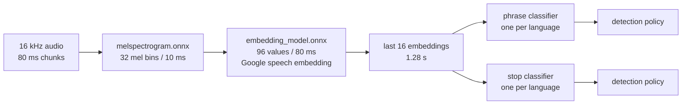

# Training a wake word

How LIA's spoken keywords are built, judged and shipped: the wake phrase of each interface
language (« Dis LIA », « Hey LIA »…) and its stop command (« LIA, stop », « LIA, stopp »,
« LIA，停下 »…). The
decision is [ADR-329](../architecture/ADR-329-Live-Standby-And-Multilingual-Wake-Word.md); the
toolbox is [`scripts/wake-word/`](../../scripts/wake-word/README.md); the browser side is
described in [VOICE_MODE.md](VOICE_MODE.md). This page explains the procedure end to end, and
the measurements that shaped it.

Nothing here runs on the server: a model is trained once, offline, on a workstation, measured,
and committed to the repository as a few megabytes the browser downloads.

## 1. What a model is

A keyword model is the last stage of [openWakeWord](https://github.com/dscripka/openWakeWord)'s
pipeline. The first two stages are shared by every language and every keyword:



- The **melspectrogram** and the **embedding** are frozen, pre-trained models (Apache-2.0). The
  embedding was trained by Google on a large speech corpus; it turns any 760 ms of sound into 96
  numbers, every 80 ms.
- The **classifier** is ours: a small dense network (openWakeWord's head) reading the last 16
  embeddings, so 1.28 s of context, and answering a score between 0 and 1. It is the only thing a
  training produces — under a megabyte.
- The **detection policy** turns scores into detections: a threshold, a patience (how many
  consecutive chunks above it), a 2-second warm-up and a 2-second refractory period. The bench
  measures a model UNDER its policy, and the browser applies exactly that policy.

A stop command is one more classifier over the same embeddings: the expensive stages run once per
chunk whatever the number of keywords.

## 2. The data

A classifier learns from three families of clips. All of them are SYNTHESISED or taken from
open corpora: no recording of a real user ever enters the toolbox.

### Positives — the keyword, said every way a person says it

Two synthesisers, because one alone teaches the model what that synthesiser sounds like:

- **Piper** (CPU): fast VITS voices, a few per language, some with hundreds of speakers. Asked
  for two words, a VITS voice babbles, so every clip is said INSIDE a sentence — a lead-in and its
  pause, the keyword, a long continuation (« Bon, dis Lia, quel temps va-t-il faire… ») — and cut
  out on the per-phoneme sample counts the voice reports. Each speaker's speed is first calibrated
  on the keyword's natural duration, then varied around it.
- **VoxCPM2** (GPU): natural voices, either DESIGNED from a description (age, gender, timbre,
  pace, mood, accent) or CLONED from a recording of the language's own corpora. It says a short
  phrase at its natural duration.

Every keyword is written in several FORMS, because nobody controls how a person says it: plainly
(« Dis Lia »), fused (« Dilia »), and with a pause (« Dis, Lia »); a stop command with and without
the pause after the name, and doubled (« Lia, stop stop »). The spellings live in
`wakeword/languages.py`.

### Near misses — what must NOT trigger

Phrases a person actually says that sound like the keyword: « Dis-lui », « Dis Léa », « Lydia »
for the phrase; « Stop » alone, « Léa, stop », « Lia, top » for « LIA, stop ». Each phrase also
lists its language's stop command, so « LIA, stop » never opens the microphone. A homophone of
the keyword itself is never listed — it is a positive.

### Negatives — everything else a microphone hears

- **Speech in the language**: FLEURS and Multilingual LibriSpeech (CC-BY 4.0) — hundreds of hours
  for the languages MLS covers, taken SPEAKER BY SPEAKER: MLS's training split is shared out by
  speaker, each capped at fifteen hours, so the model learns the language and not its most prolific
  readers (French: 230 hours from 106 speakers, where 120 evenly spaced shards gave 222 hours of
  which five voices were two thirds).
- **Music, noise and English speech**: MUSAN (CC-BY 4.0).
- **Silence and room tone**, at every level: an idle microphone is the commonest input of all.

### Licences and splits

Every input that shapes a shipped model carries a permissive licence (CC0, CC-BY, Apache-2.0); a
voice under a share-alike or non-commercial licence serves the held-out TEST set only. Every
download is pinned to an immutable address and a SHA-256 in `sources.lock.json`.

Data is split three ways and never mixed:

| Split | Used for | Never used for |
|---|---|---|
| train | learning | judging |
| dev | choosing the checkpoint and its threshold | learning |
| test | the final measurement only | anything else |

Test voices are held-out Piper voices and speakers, VoxCPM2 voices from the other half of the
descriptions and from the corpora's TEST speakers.

The dev split is LARGE on purpose — 74 hours for French: 10.9 h of FLEURS and MLS dev, 23 h
more of MLS from speakers the training never hears (one MLS training speaker in four, ranked by
how much they recorded, at most two hours each; a shard's name starts with its speaker id), 6 h
of music (one MUSAN music file in six) and 34 h of the English speech no training uses. With the
10.9 hours of the official dev alone, a target of 0.25 false accepts per hour meant « at most
2 »: a checkpoint was kept or thrown away on 2 false accepts against 3. And the dev hears the
music and the English the measurement counts.

English is there to teach the model to stay QUIET: a French speaker's room also holds series,
songs and videos in English, and English speech was where the phrase false-triggered most
(0.82 per hour, against 0.50 on French). It is a negative and a competing voice, dosed — 15 h
for 240 h of French — never a second phrase.

## 3. Augmentation

A clip is never seen twice the same way (`wakeword/augment.py`): a resampled speed, a tilted
equaliser, a simulated room, a background of noise, music or speech mixed at a random
signal-to-noise ratio (down to below 0 dB), a telephone band, a random level. Positives are
augmented three times and near misses four, each placed in a 2-second window that ENDS with the
keyword — exactly the 16 embeddings the browser scores when the keyword has just been said.

Competing speech — someone else talking — is the condition that fails: at 10 dB the French
phrase was found 72 % of the time over noise and 69 % over music, but 30 % over English speech
and 38 % over French. It is part of the backgrounds, not a step of its own: a dedicated step
(one to three voices at 0-15 dB in 30 % of the windows, and among the negatives) was measured
and removed — the model grew timid, 9.6 points of clean recall lost on the dev for no gain at
10 dB, the same on the stop word.

## 4. Training

`train` (GPU or CPU, the same recipe; `wakeword/train.py`):

1. Every clip window and every negative stream is turned into embeddings once, and cached with
   the fingerprints of the banks it came from.
2. Each batch is a quarter positives, a quarter near misses and half negatives — a fifth of those
   drawn from a pool of HARD negatives: the windows the current model likes most, rescanned from
   the streams every few thousand steps.
3. The weight of the negatives rises over the first half of the run, to openWakeWord's reference
   value: early on the model learns the keyword, later it learns to be quiet.
4. Every thousand steps the checkpoint is JUDGED on the dev split: the lowest threshold that keeps
   the dev false accepts under the keyword's target is found (the phrase is judged at the published
   speech limit itself: a missed « Dis LIA » costs more than a rare false wake; the stop command at
   half its own), and the score is the mean, there,
   of three recalls of held-out training clips played as 6-second STREAMS: clean, at 10 dB, and
   that of the WEAKEST written form clean — the acceptance holds every form, and an average hid
   « Stop » said once at 58 % behind 96 % doubled. The best checkpoint is kept and exported to
   ONNX.

## 5. Measurement

`measure` reads the TEST split only, listened to continuously under the browser's policy
(`wakeword/measure.py`, shared stream logic in `wakeword/trials.py`):

- **Recall**: every test clip is placed 3 s into a 6 s stream, through a room and a phone half the
  time, clean or at 20, 10 and 5 dB; a detection counts between the start of the keyword and one
  second after its end. Reported overall, per voice and per written form.
- **False accepts per hour**: on hours of continuous test speech in the language and in English,
  on music and on noise.
- **Near-miss accepts** and the **latency** after the keyword.

The verdict compares these with an acceptance grid PUBLISHED before training and never lowered to
pass (`ACCEPTANCE` in `wakeword/measure.py`). The bench measures at the dev's threshold, or at an
operating point the operator certifies (`measure --threshold`): the export ships the measured row,
so a manifest's figures are always those of the threshold it carries. A stop command allows more false accepts than the
phrase: a false « stop » only cuts a reading aloud, where a false wake opens the microphone. A
model that fails is not shipped.

## 6. Export and shipping

`export` writes into `apps/web/public/models/wake/v1/`: the two shared stages, the classifier of
each language and keyword, every file named after its SHA-256 (a retrained model is a new URL, so
no cache ever serves a stale one), and one `manifest.json` per language — its files with their
size and hash, the policy, the measured figures, the verdict and the provenance of every input
with its licence. A stop command is exported INTO its language's manifest, under `commands`.

Three guards hold what ships:

- `shipped-models.test.ts`: every language has its phrase and its stop command, each file is the one
  its manifest names, each model was accepted by the bench, and no unnamed file ships.
- `parity.test.ts`: the browser's engine, on the real models through ONNX Runtime Web, scores a
  golden audio file as the toolbox did (`task wake:golden -- <lang>`).
- The browser itself refuses any file whose size or SHA-256 differs from its manifest.

## 7. Running it

The toolbox has its own pinned requirements and two Docker images: a CPU one (Piper,
measurement) and a GPU one (VoxCPM2, CUDA training). See the
[toolbox README](../../scripts/wake-word/README.md) for every command; one language and keyword:

```bash
task wake:run -- prepare --lang fr                 # corpora (once per language)
task wake:run -- synth --lang fr                   # Piper clips
task wake:clone -- fr                              # VoxCPM2 clips (GPU)
task wake:run:gpu -- train --lang fr               # train on CUDA
task wake:run -- measure --lang fr                 # bench on the CPU
task wake:run -- export --lang fr                  # write the model and manifest
task wake:run -- synth --lang fr --keyword stop    # the same steps for the stop command
```

Every step rebuilds what is stale, and nothing else: `lock` keeps exactly the corpus shards the
selection names; a corpus bank built from other archives is decoded again; a clip bank records the
RECIPE of its plan — its texts, voices and rates, and for VoxCPM2 the recordings it clones — and is
synthesised again when the spec changes; every training cache records the FINGERPRINT of the
banks it read. A new near miss, a bigger plan or another corpus selection needs no manual purge.

Measured on one workstation (16 cores, RTX 4090, 2026-10-01 and 02), for one French keyword:

| Step | Duration |
|---|---|
| Piper clips (four banks, CPU) | about 45 min |
| VoxCPM2 clips (10 000, one process) | 80 to 100 min — 0.48 to 0.65 s a clip, longer texts slower |
| Training (40 000 steps) | about 30 min on the GPU (74 h of dev judged every thousand steps), hours on the CPU |
| Measurement (CPU) | about 25 min |

The synthesis, not the training, is the long part, and it does not parallelise: one VoxCPM2
process alone keeps the GPU busy, and a second one only time-slices it — measured, 0.66 s a clip
for two processes together against 0.48 s for one (no MPS under Windows or WSL). A process also
takes 11 GB of RAM while it loads, and three loading at once froze the WSL machine. The lever is
the number of clips, not the number of processes.

## 8. What the measurements taught

Every rule above was paid for by a measurement (French, 2026-10-01 and 02):

| Finding | Measured | What changed |
|---|---|---|
| Too little negative speech makes a jumpy model | 49 h of MLS: 14 false accepts/h on dev; 220 h: 2.7/h | 120 MLS training shards |
| A light negative weight never learns silence | weight 30: stuck at 2.7/h; openWakeWord's 1 000: 0.18/h | the reference ramp |
| One window at a fixed offset misjudges a checkpoint | 27 % recall in one window = 75 % in a stream | selection on stream recall, the bench's own logic |
| A bigger network buys nothing | 512 hidden units ≈ 128 | 128 |
| Patience costs more recall than it saves | patience 2-4 lost more recall than false accepts | patience 1 by default |
| Someone talking is the hard case, not noise | at 10 dB: 72 % over noise, 69 % over music, 30 % over English speech, 38 % over French | still open |
| Drowning the training in talk makes the model timid | a competing-speech step (1-3 voices at 0-15 dB, 30 % of windows, and among the negatives): dev clean recall 79 % → 69 %, no gain at 10 dB; the same on « Stop » | removed |
| A dev that hears only French certifies the wrong threshold | selected on French alone, the phrase failed English (0.82/h) and music (0.41/h) at the test | dev with English and music: the selected model holds every false-accept limit (0 French, 0.27 English, 0.14 music per hour) |
| A small dev turns selection into a draw | 10.9 h of dev: « 0.25/h » meant at most 2 false accepts; 21 of 40 validations discarded, the best clean recall among them | a dev of 74 h, music and English included, speakers never heard |
| Five voices were two thirds of the negatives | 120 evenly spaced MLS shards: 60 of 142 speakers, the five largest 66 % of 222 h | every speaker capped: at 5 h (121 h) fewer false accepts on music and English, but the dev's rose earlier in training and the test recall fell (clean 74 % against 80 %); at 15 h (230 h, the five largest 29 %), at the same false-accept limits, clean 79 %, 10 dB 38.5 % against 35 % — the amount matters as much as the voices |
| The grid stopped before the best checkpoints | at 0.999, late checkpoints recalling 93 % were thrown away for want of a stricter step | thresholds up to 0.9999: the dev chose 0.9999; at the same false-accept limits, clean 81 % and 10 dB 40 % (79 % and 38.5 % before) |
| Two generators on one GPU are slower than one | VoxCPM2: 0.66 s a clip for two processes together, 0.48 s for one; the GPU is time-sliced, not shared | one process |
| A stale bank is read in silence | after the selection moved, the lock still named 151 dropped shards, and banks and caches were reused by name | the lock holds exactly the selection; a bank records its recipe, a cache the fingerprints of the banks it read |
| An average hides the weakest form | « Stop » said once 58 %, doubled 96 % | the checkpoint scored on the weakest form too |
| A one-syllable stop is a coin toss | « Stop » said once found 51-58 % at best, 1.6 false accepts per hour of music | « LIA, stop » (owner decision): said once 80-82 %, doubled 98 %, 0.68 per hour of music |
| The bench does not hear what a person meets | in use, the model of 2026-10-01 woke on nothing and missed a quick « dilia », where the bench counted 0.8 false accepts per hour of English and 87 % of « Dilia » — synthetic voices, unfiltered audio, while the browser filters the microphone | the phrase judged at the published limit, shipped at the production model's sensitivity (`measure --threshold`); fast speech by a real voice still to measure |
| Positives cloned from dev voices | natural voices cloned from MLS speakers that became the dev's | regenerated from training speakers only: with the phrase judged at the limit, 85 % clean at the dev's own threshold, 74 % before |
| Slow training voices miss a quick « dilia » | natural voices said the phrase in 0.85 s, a third with a pause; « dis … Lia » woke LIA, « dilia » did not | fused and paused forms in every language, faster rates, recall per form ≥ 85 % — on the test set, recall clean 73 % → 88 %, « Dilia » 87 % like « Dis Lia », at 10 dB 43 % → 50 % |
| The browser runtime needs its loader | ONNX Runtime Web loads a `.mjs` beside its `.wasm`; only the binary was served | both copied by `apps/web/scripts/copy-ort-runtime.mjs` |
| A two-word request makes a VITS voice babble | Piper on « Dis Lia » alone | the keyword said inside a sentence, cut on its phonemes |

## 9. Adding a keyword or a language

- **A language**: declare its `LanguageSpec` in `wakeword/languages.py` (phrase, forms, near
  misses, voices with their licences, FLEURS and MLS configurations) and its stop command in
  `STOP_WORDS`, pin its remotes (`task wake:run -- lock --lang <code>`), review the diff of
  `sources.lock.json`, run the steps above for both keywords, and add the words to
  `apps/web/src/lib/audio/wake-word/phrases.ts`.
- **A keyword**: it is a retraining, never a setting — the words are a contract between the
  toolbox, the manifest and the screens, held equal by `shipped-models.test.ts`.
- **A new spoken command** beside « stop »: extend `Keyword` in the toolbox and `WAKE_COMMANDS`
  in `apps/web/src/lib/audio/wake-word/commands.ts`; the manifest, the engine and the worker
  already carry any number of commands.
